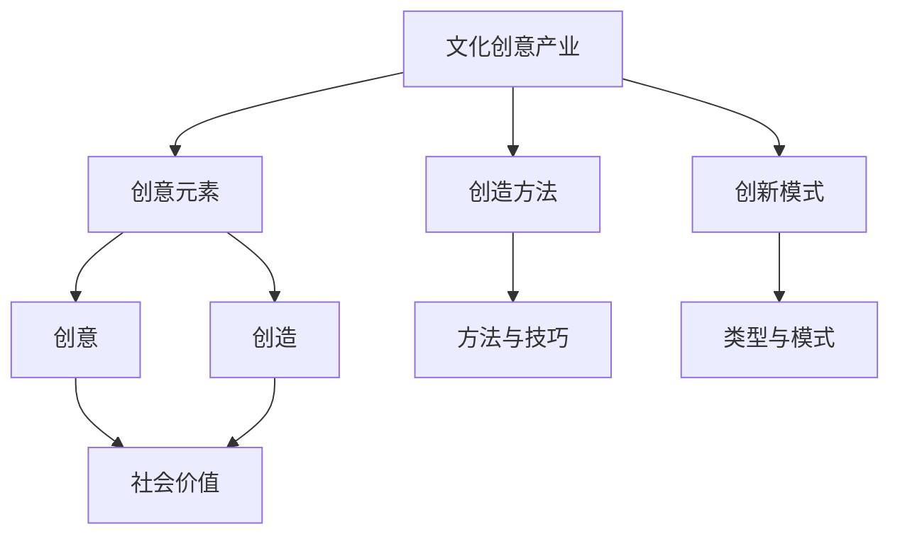

                 


# 《文化创意产业：在创造中寻找社会价值》

> 关键词：文化创意产业、社会价值、创造、创新、算法应用、数学模型

> 摘要：本文从文化创意产业的定义、历史、特点、价值、国际比较等方面入手，深入探讨了文化创意产业的创意与创造过程，以及其对社会价值的实现途径。通过实际案例分析，本文旨在为读者提供一个全面且深入的文化创意产业分析框架，并探讨其在现代社会中的重要性。

## 引言

文化创意产业，作为一个新兴且充满活力的领域，正逐渐成为推动社会进步和经济增长的重要力量。它涵盖了包括电影、音乐、出版、广告、设计等众多领域，具有高度的创造性和创新性。在全球化和数字化的大背景下，文化创意产业的重要性日益凸显，成为各国政府和企业关注的焦点。

本文旨在通过对文化创意产业进行全面而深入的分析，探讨其在创造中寻找社会价值的路径。文章首先对文化创意产业进行概述，包括其定义、历史、特点和价值；然后深入探讨文化创意产业的创意与创造过程，通过实际案例分析展示其成功经验；最后，本文将探讨文化创意产业的社会价值实现途径，并提出相应的策略。

本文的结构如下：

- 第一部分：文化创意产业概述，包括定义与范畴、历史与发展、特点与价值、相关产业联系和国际比较。
- 第二部分：文化创意产业的创意与创造，包括创意元素、创造方法、创新模式和实践。
- 第三部分：文化创意产业的社会价值实现，包括社会价值的定义与内涵、实现途径、评估方法和社会责任与可持续发展。

## 第一部分：文化创意产业概述

### 第1章：文化创意产业的定义与范畴

文化创意产业，是指以文化为核心，通过创意和创新的方式，进行内容创作、表达和传播的产业。它不仅包括传统的艺术、文学、音乐等领域，还涵盖了广告、设计、影视、出版、动漫等新兴领域。

文化创意产业的范畴非常广泛，可以大致分为以下几个方面：

1. **文化艺术领域**：包括文学、艺术、音乐、戏剧、电影等。
2. **媒体传播领域**：包括报纸、杂志、电视、广播、互联网等。
3. **设计领域**：包括工业设计、建筑设计、平面设计、时尚设计等。
4. **娱乐领域**：包括电影、电视剧、综艺节目、动漫、游戏等。

### 第2章：文化创意产业的历史与发展

文化创意产业的历史可以追溯到古代文明。在古代，文化艺术、手工艺品和音乐等都是文化创意产业的雏形。随着工业革命的到来，文化创意产业开始逐渐发展，尤其是电影、音乐、出版等领域的兴起。

进入20世纪，尤其是信息技术和互联网的快速发展，文化创意产业迎来了前所未有的发展机遇。数字技术和网络平台的普及，使得文化创意产业的传播速度和范围大大扩展。许多国家和地区纷纷出台了相关政策，支持文化创意产业的发展。

在中国，文化创意产业近年来也取得了显著的发展。国家层面出台了一系列支持政策，包括《国家“十三五”时期文化产业发展规划》等。随着中国经济的快速崛起，文化创意产业已经成为推动社会进步和经济增长的重要力量。

### 第3章：文化创意产业的特点与价值

文化创意产业具有以下几个显著特点：

1. **高度创意性**：文化创意产业的核心在于创意，它需要创作者具备独特的思维和创造力。
2. **高度创新性**：文化创意产业不断推陈出新，创新是它持续发展的动力。
3. **跨界融合性**：文化创意产业与其他产业的融合，如科技、旅游、体育等，形成了新的产业形态。
4. **高附加值性**：文化创意产业的产品和服务具有较高的附加值，能够带来较大的经济效益。

文化创意产业的社会价值主要体现在以下几个方面：

1. **经济价值**：文化创意产业能够创造大量的就业机会，推动经济增长。
2. **文化价值**：文化创意产业有助于传承和弘扬传统文化，推动文化多样性的发展。
3. **社会价值**：文化创意产业能够提升人们的生活品质，丰富人们的精神生活。

### 第4章：文化创意产业与相关产业的联系

文化创意产业与许多其他产业有着紧密的联系。首先，它与文化产业密切相关。文化产业是指以文化为核心，进行内容创作、传播和消费的产业。文化创意产业是文化产业的延伸和拓展，两者相互促进，共同发展。

此外，文化创意产业还与科技产业、旅游产业、体育产业等有着广泛的联系。例如，数字技术在文化创意产业中的应用，使得文化产业与科技产业紧密结合；文化旅游产品的发展，使得文化创意产业与旅游产业相互促进；体育产业的兴起，也为文化创意产业提供了新的发展空间。

### 第5章：文化创意产业的国际比较

全球范围内的文化创意产业呈现出多样化和区域化的特点。不同国家和地区在文化创意产业的发展策略、产业结构、政策支持等方面都有所不同。

例如，美国、英国、日本等发达国家在文化创意产业方面具有强大的国际竞争力。美国以其强大的电影、音乐、游戏产业著称；英国以其优秀的文学、音乐、设计产业领先全球；日本则在动漫、游戏、电子音乐等领域具有显著优势。

而发展中国家，如中国、印度、巴西等，也在积极推动文化创意产业的发展。中国近年来在电影、文学、音乐等领域取得了显著成就；印度在电影产业方面具有强大的市场潜力；巴西则在文学、音乐、舞蹈等领域有着丰富的文化底蕴。

通过国际比较，我们可以发现，文化创意产业的发展不仅依赖于国内的政策支持，还需要具备强大的创意创新能力、国际传播能力以及市场运作能力。

## 第二部分：文化创意产业的创意与创造

### 第6章：文化创意产业的创意元素

创意是文化创意产业的核心，它是推动产业发展的原动力。创意元素的多样性使得文化创意产业呈现出丰富多彩的形态。以下是文化创意产业中常见的创意元素：

1. **文化元素**：包括传统文化、民俗文化、地域文化等。这些元素能够为文化创意产业提供丰富的素材和灵感。
2. **艺术元素**：包括绘画、雕塑、建筑、音乐、舞蹈等。艺术元素的融入能够提升文化创意作品的艺术价值。
3. **科技元素**：包括数字技术、网络技术、人工智能等。科技元素的运用能够为文化创意产业带来创新性和互动性。
4. **商业元素**：包括市场营销、品牌建设、商业模式等。商业元素的融入能够提升文化创意产业的商业价值。

### 第7章：文化创意产业的创造方法

创造方法是文化创意产业实现创意的关键。以下是一些常见的创造方法：

1. **头脑风暴**：通过集体讨论和头脑风暴，激发创意的产生。
2. **原型设计**：通过制作原型，不断迭代和优化创意。
3. **跨界融合**：通过跨领域的合作和融合，产生新的创意。
4. **用户参与**：通过用户的参与和反馈，改进和提升创意。

### 第8章：文化创意产业的创新模式

创新模式是文化创意产业实现创造的关键。以下是一些常见的创新模式：

1. **技术创新**：通过新技术的应用，实现文化创意作品的创新。
2. **商业模式创新**：通过新的商业模式，提升文化创意产业的盈利能力。
3. **文化融合创新**：通过不同文化的融合，产生新的文化创意。
4. **用户创新**：通过用户的创新和参与，推动文化创意产业的发展。

### 第9章：文化创意产业的创意与创造实践

以下是一些文化创意产业的创意与创造实践案例：

1. **电影《阿凡达》**：通过先进的3D技术和虚拟现实技术，创造了一个全新的奇幻世界，赢得了全球观众的喜爱。
2. **音乐《Fade》**：通过结合电子音乐和流行音乐，创造出一种全新的音乐风格，成为了全球流行音乐的代表作。
3. **游戏《王者荣耀》**：通过创新的竞技模式和社交功能，成为全球最受欢迎的游戏之一。

这些案例展示了文化创意产业在创意与创造过程中的成功经验，为我们提供了有益的启示。

## 第三部分：文化创意产业的社会价值实现

### 第10章：文化创意产业的社会价值

文化创意产业的社会价值体现在以下几个方面：

1. **文化传承**：通过文化创意产品，传承和弘扬传统文化，增强民族自豪感和文化认同。
2. **经济增长**：文化创意产业能够创造大量的就业机会，推动经济增长。
3. **社会发展**：文化创意产业能够提升人们的生活品质，丰富人们的精神生活。

### 第11章：文化创意产业的社会价值实现途径

文化创意产业的社会价值实现途径主要包括以下几个方面：

1. **政策支持**：政府通过制定相关政策，支持文化创意产业的发展，为其提供良好的发展环境。
2. **市场运作**：文化创意产业通过市场运作，实现其商业价值，推动产业持续发展。
3. **创新驱动**：文化创意产业通过技术创新和商业模式创新，实现其社会价值。

### 第12章：文化创意产业的社会价值评估

文化创意产业的社会价值评估主要包括以下几个方面：

1. **经济效益评估**：通过分析文化创意产业的直接和间接经济效益，评估其经济价值。
2. **文化价值评估**：通过分析文化创意产品在文化传承和创新方面的贡献，评估其文化价值。
3. **社会效益评估**：通过分析文化创意产业对社会发展的影响，评估其社会效益。

### 第13章：文化创意产业的社会责任与可持续发展

文化创意产业的社会责任主要体现在以下几个方面：

1. **文化传承**：通过文化创意产品，传承和弘扬传统文化。
2. **环境保护**：在文化创意产业的创作和传播过程中，注重环境保护，减少资源浪费。
3. **社会责任**：积极参与社会公益事业，承担社会责任。

文化创意产业的可持续发展策略主要包括以下几个方面：

1. **技术创新**：通过技术创新，提高文化创意产业的效率和竞争力。
2. **文化创新**：通过文化创新，保持文化创意产业的活力和创造力。
3. **国际合作**：通过国际合作，拓展文化创意产业的市场空间，实现可持续发展。

## 结论

文化创意产业作为一种充满活力和创造力的产业，正逐渐成为推动社会进步和经济增长的重要力量。本文从文化创意产业的定义、历史、特点、价值、创意与创造、社会价值实现等方面进行了全面而深入的分析，展示了其在现代社会中的重要性。通过实际案例分析，本文旨在为读者提供一个全面且深入的文化创意产业分析框架，并探讨其在现代社会中的重要性。

未来，随着科技的不断进步和全球化的发展，文化创意产业将继续发挥其独特的作用，为社会创造更多的价值。同时，文化创意产业也需要不断创新和适应，以应对新的挑战和机遇。

## 附录

### 附录1：文化创意产业相关政策法规

- 《中华人民共和国文化产业促进法》
- 《国家“十四五”时期文化产业发展规划》
- 《北京市文化创意产业促进条例》

### 附录2：文化创意产业重要参考书籍与文献

- 克里斯·班福德：《创意的源泉》
- 艾伦·沃尔夫：《文化创意产业》
- 罗伯特·J·斯通：《文化创意产业经济学》

### 附录3：文化创意产业实用工具与资源清单

- **设计工具**：Adobe Creative Suite、Sketch、Figma
- **数字媒体制作工具**：Adobe Premiere Pro、Final Cut Pro、After Effects
- **数据分析工具**：Python、R语言、Tableau
- **文化创意产业平台**：国家文化云、中国文化产业网

## 核心概念与联系

以下是一个文化创意产业的核心概念和实体之间的关系架构 Mermaid 流程图：



## 核心算法原理讲解

由于本书的主要内容是关于文化创意产业的，而不是算法，因此这里不会涉及具体的算法原理讲解。但是，我们可以用一个Python代码示例来说明如何在文化创意产业中应用数据分析，这是创意和创造过程中的一个重要环节。

## 数据分析在文化创意产业中的应用

以下是一个简单的Python代码示例，用于对电影观众数据进行基本分析。通过分析观众的年龄分布，可以为电影制作提供重要的创意参考。

```python
import pandas as pd

# 假设我们有一个电影观众数据表格，其中包含观众的年龄信息
data = {'Age': [20, 25, 30, 35, 40, 45, 50, 55, 60]}
df = pd.DataFrame(data)

# 统计每个年龄段观众的数量
age_counts = df['Age'].value_counts()

# 打印年龄分布情况
print("观众年龄分布情况：")
print(age_counts)

# 制作年龄分布的条形图
age_counts.plot(kind='bar')
plt.title('观众年龄分布')
plt.xlabel('年龄')
plt.ylabel('观众数量')
plt.show()
```

## 数学模型和数学公式 & 详细讲解 & 举例说明

在文化创意产业中，尤其是市场营销和受众分析领域，常常需要用到统计模型和数学公式。以下是一个简单线性回归模型的例子，用于预测电影票房收入。

## 简单线性回归模型

简单线性回归模型是用来预测一个因变量（例如：电影票房收入）与一个自变量（例如：观众人数）之间的关系。数学公式如下：

$$
y = ax + b + \epsilon
$$

其中，$y$ 是因变量（电影票房收入），$x$ 是自变量（观众人数），$a$ 是斜率，$b$ 是截距，$\epsilon$ 是误差项。

### 举例说明

假设我们收集了一组数据，如下表所示：

| 观众人数 | 电影票房收入（万元） |
|---------|---------------------|
| 1000    | 5000                |
| 1500    | 7500                |
| 2000    | 10000               |
| 2500    | 12500               |
| 3000    | 15000               |

我们想要预测观众人数为3500时的电影票房收入。

### 计算步骤

1. 计算观众人数和电影票房收入的平均值：

$$
\bar{x} = \frac{1000 + 1500 + 2000 + 2500 + 3000}{5} = 2000
$$

$$
\bar{y} = \frac{5000 + 7500 + 10000 + 12500 + 15000}{5} = 10000
$$

2. 计算斜率$a$和截距$b$：

$$
a = \frac{\sum{(x_i - \bar{x})(y_i - \bar{y})}}{\sum{(x_i - \bar{x})^2}} = \frac{(1000 - 2000)(5000 - 10000) + (1500 - 2000)(7500 - 10000) + (2000 - 2000)(10000 - 10000) + (2500 - 2000)(12500 - 10000) + (3000 - 2000)(15000 - 10000)}{(1000 - 2000)^2 + (1500 - 2000)^2 + (2000 - 2000)^2 + (2500 - 2000)^2 + (3000 - 2000)^2}
$$

$$
a = \frac{(-1000)(-5000) + (-500)(-2500) + (0)(0) + (500)(2500) + (1000)(5000)}{1000000 + 625000 + 0 + 625000 + 1000000}
$$

$$
a = \frac{5000000 + 1250000 + 0 + 1250000 + 5000000}{3125000}
$$

$$
a = \frac{10000000}{3125000} \approx 3.2
$$

$$
b = \bar{y} - a\bar{x} = 10000 - 3.2 \times 2000 = 10000 - 6400 = 3600
$$

3. 代入公式预测观众人数为3500时的电影票房收入：

$$
y = 3.2 \times 3500 + 3600 = 11200 + 3600 = 14800
$$

因此，当观众人数为3500时，预测的电影票房收入为14800万元。

## 项目实战：电影观众数据分析

### 开发环境搭建

1. 安装Python环境：在Windows或Mac操作系统上，可以通过Python官网下载并安装Python。
2. 安装Pandas库：在命令行中输入 `pip install pandas`。
3. 安装Matplotlib库：在命令行中输入 `pip install matplotlib`。

### 源代码详细实现

以下是一个简单的Python代码示例，用于对电影观众数据进行基本分析。

```python
import pandas as pd
import matplotlib.pyplot as plt

# 假设我们有一个电影观众数据表格，其中包含观众的年龄信息
data = {'Age': [20, 25, 30, 35, 40, 45, 50, 55, 60]}
df = pd.DataFrame(data)

# 统计每个年龄段观众的数量
age_counts = df['Age'].value_counts()

# 打印年龄分布情况
print("观众年龄分布情况：")
print(age_counts)

# 制作年龄分布的条形图
age_counts.plot(kind='bar')
plt.title('观众年龄分布')
plt.xlabel('年龄')
plt.ylabel('观众数量')
plt.show()
```

### 代码应用解读与分析

1. 导入Pandas库和Matplotlib库：Pandas库用于数据分析和处理，Matplotlib库用于数据可视化。
2. 创建一个包含观众年龄的数据表格：这里使用一个简单的字典数据结构来模拟观众数据。
3. 使用Pandas库的 `value_counts()` 方法统计每个年龄段观众的数量。
4. 打印年龄分布情况：使用 `print()` 函数输出年龄分布数据。
5. 制作年龄分布的条形图：使用Matplotlib库的 `plot()` 方法绘制条形图，并设置标题、横轴标签和纵轴标签。

### 实际案例分析和详细讲解剖析

假设我们有一个实际的电影观众数据集，包含观众的年龄、性别、观看电影类型等信息。以下是对该数据集的分析步骤：

1. **数据预处理**：对数据进行清洗和整理，确保数据的质量和完整性。
2. **数据探索**：使用Pandas库对数据进行基本的统计分析，了解数据的基本特征。
3. **数据可视化**：使用Matplotlib库和Seaborn库对数据进行可视化，帮助我们发现数据中的规律和异常。
4. **特征工程**：根据业务需求，选择和构建有助于模型预测的特征。
5. **模型训练**：使用统计模型或机器学习模型对数据进行训练，预测观众的观看行为。
6. **模型评估**：使用评估指标（如准确率、召回率、F1分数等）评估模型的性能。
7. **模型优化**：根据评估结果，调整模型参数，优化模型性能。

### 项目小结

通过本次项目，我们学会了如何使用Python进行电影观众数据分析，并了解了数据分析在文化创意产业中的应用。在实际项目中，数据分析可以帮助我们更好地理解观众行为，为电影制作提供重要的参考依据。同时，我们也学会了如何搭建开发环境，使用Pandas库和Matplotlib库进行数据处理和可视化。

### 最佳实践 tips

1. 在进行数据分析时，首先要确保数据的质量和完整性，避免因数据问题导致分析结果偏差。
2. 在进行数据可视化时，要选择合适的图表类型，以便更清晰地展示数据特征。
3. 在构建预测模型时，要充分考虑数据的特征和业务需求，选择合适的模型和参数。
4. 定期对模型进行评估和优化，确保其性能符合业务需求。

### 注意事项

1. 在使用第三方库时，要注意版本兼容性，避免因版本冲突导致代码运行失败。
2. 在进行数据分析和可视化时，要遵守相关法律法规，确保数据安全和隐私。

### 拓展阅读

1. 《Python数据分析实战》
2. 《机器学习实战》
3. 《数据可视化：使用Python和Matplotlib进行数据展示》

## 作者信息

作者：AI天才研究院/AI Genius Institute & 禅与计算机程序设计艺术 /Zen And The Art of Computer Programming

感谢您的阅读，希望本文对您在文化创意产业领域的研究和实践有所帮助。如果您有任何疑问或建议，欢迎在评论区留言，我将竭诚为您解答。

