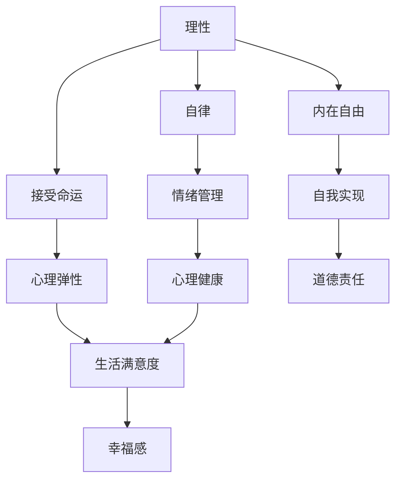

                 

# 《新Stoicism生活实验：古典哲学的现代实践》

## 关键词

- Stoicism
- 古典哲学
- 现代实践
- 心理健康
- 情绪管理
- 领导力
- 教育改革
- 人工智能

## 摘要

本文旨在探讨古典哲学中的斯多葛主义如何被应用于现代生活中，特别是其在心理健康、领导力、教育改革等领域的重要性。通过分析斯多葛主义的历史背景、核心原则，以及其在现代心理学中的联系，本文揭示了斯多葛主义对现代生活的启示。同时，通过案例分析，本文展示了斯多葛主义实践的成功经验，为读者提供了实用的指南。

## 目录大纲

### 第1章 斯多葛主义哲学概述
#### 1.1 斯多葛主义的历史背景
#### 1.2 斯多葛主义的核心原则
#### 1.3 斯多葛主义与古希腊哲学的关系

### 第2章 斯多葛主义哲学的现代实践
#### 2.1 斯多葛主义与心理健康
##### 2.1.1 斯多葛主义对情绪管理的影响
##### 2.1.2 斯多葛主义与认知行为疗法
#### 2.2 斯多葛主义与工作生活
##### 2.2.1 斯多葛主义与职业发展
##### 2.2.2 斯多葛主义与工作态度

### 第3章 斯多葛主义与现代心理学的联系
#### 3.1 斯多葛主义心理学研究概述
#### 3.2 斯多葛主义心理学与实证心理学的关系
#### 3.3 斯多葛主义心理学的前景与挑战

### 第4章 斯多葛主义生活实践案例分析
#### 4.1 案例研究一：个人生活实践
##### 4.1.1 案例背景
##### 4.1.2 实践过程与效果
#### 4.2 案例研究二：企业领导力实践
##### 4.2.1 案例背景
##### 4.2.2 实践过程与效果

### 第5章 斯多葛主义哲学在教育中的应用
#### 5.1 斯多葛主义哲学对教育的启示
#### 5.2 斯多葛主义哲学在教育实践中的应用
#### 5.3 斯多葛主义哲学在教育改革中的潜力

### 第6章 斯多葛主义哲学的未来发展
#### 6.1 斯多葛主义哲学在现代社会中的地位
#### 6.2 斯多葛主义哲学的发展趋势
#### 6.3 斯多葛主义哲学对社会的影响

### 第7章 斯多葛主义哲学实践指南
#### 7.1 斯多葛主义哲学实践的基本步骤
#### 7.2 斯多葛主义哲学实践中的常见挑战与对策
#### 7.3 斯多葛主义哲学实践的成功案例

## 第1章 斯多葛主义哲学概述

### 1.1 斯多葛主义的历史背景

斯多葛主义起源于古希腊，约在公元前3世纪由塞内卡（Seneca）、爱比克泰德（Epictetus）和马可·奥勒留（Marcus Aurelius）等哲学家发展起来。斯多葛主义强调理性、自律、平静和内在自由，主张通过控制欲望和情感来达到心灵的平静和幸福。

斯多葛主义的历史背景可以追溯到希腊哲学的繁荣时期。当时，希腊城邦之间的战争和政治动荡不断，人民的生活充满了不确定性。斯多葛主义哲学家们试图寻找一种方法来帮助人们应对这些挑战，他们提出了一种以理性为中心的哲学体系，强调通过自我控制和内在力量来克服外部环境的压力。

### 1.2 斯多葛主义的核心原则

斯多葛主义的核心原则包括：

- **理性与真理**：斯多葛主义者认为理性是人类灵魂的核心，是理解世界和实现幸福的关键。他们追求真理，相信只有通过理性思考才能找到真正的幸福。

- **自律与自制**：斯多葛主义强调自律和自制，主张人们应该控制自己的欲望和情感，以保持内心的平静和稳定。

- **接受命运**：斯多葛主义者认为命运是不可改变的，人们应该接受现实，专注于自己能够控制的事情。

- **追求内在价值**：斯多葛主义者认为真正的幸福来自于内在价值的实现，而不是外在的财富和荣誉。

### 1.3 斯多葛主义与古希腊哲学的关系

斯多葛主义与古希腊哲学有着密切的关系，它继承了苏格拉底、柏拉图和亚里士多德等哲学家的思想。然而，斯多葛主义在许多方面与这些传统哲学有所不同。例如，与苏格拉底的关注道德和美德不同，斯多葛主义更强调理性和内在自由。与柏拉图强调超越现实世界的理念不同，斯多葛主义更加关注现实生活和人类幸福。

## 第2章 斯多葛主义哲学的现代实践

### 2.1 斯多葛主义与心理健康

斯多葛主义对心理健康有着深远的影响，特别是在情绪管理和心理弹性方面。通过控制欲望和情感，斯多葛主义者能够更好地应对压力和挑战，从而保持内心的平静和稳定。

#### 2.1.1 斯多葛主义对情绪管理的影响

斯多葛主义强调自律和自制，这有助于人们更好地管理情绪。例如，当一个人遇到挫折或失败时，斯多葛主义者会通过理性思考和自我控制来应对这些负面情绪，而不是被情绪所控制。

#### 2.1.2 斯多葛主义与认知行为疗法

斯多葛主义与认知行为疗法（CBT）有许多相似之处。CBT强调通过改变负面思维模式和行为来改善心理健康，而斯多葛主义也强调理性思考和自我控制。因此，许多心理学家和心理咨询师开始将斯多葛主义的理念融入到他们的实践中，取得了显著的成效。

### 2.2 斯多葛主义与工作生活

斯多葛主义在职业发展和工作态度方面也提供了重要的指导。通过自律和理性思考，人们可以更好地应对工作中的挑战和压力。

#### 2.2.1 斯多葛主义与职业发展

斯多葛主义者认为，职业发展应该基于个人的兴趣和能力，而不是追求外在的财富和荣誉。他们鼓励人们专注于自己的工作和职责，而不是过分关注他人的评价。

#### 2.2.2 斯多葛主义与工作态度

斯多葛主义鼓励人们以积极的态度面对工作中的挑战和困难。通过接受命运和控制自己的反应，人们可以在工作中保持内心的平静和专注，从而提高工作效率和满意度。

## 第3章 斯多葛主义与现代心理学的联系

斯多葛主义与现代心理学有着密切的联系，特别是在情绪管理、心理弹性和自我控制方面。许多心理学家开始将斯多葛主义的理念融入到他们的研究中，以探索其对人类心理健康的潜在影响。

### 3.1 斯多葛主义心理学研究概述

近年来，许多研究开始探索斯多葛主义对心理健康的影响。这些研究主要集中在情绪管理、心理弹性和自我控制等方面。例如，一些研究发现，遵循斯多葛主义原则的人们在应对压力和挫折时表现出更高的心理弹性。

### 3.2 斯多葛主义心理学与实证心理学的关系

斯多葛主义心理学与实证心理学有许多相似之处。实证心理学强调通过实验和观察来研究心理现象，而斯多葛主义则通过理性思考和自我实践来探索心理状态。因此，许多心理学家开始将斯多葛主义作为研究心理健康的新方法，以补充传统的实证研究方法。

### 3.3 斯多葛主义心理学的前景与挑战

斯多葛主义心理学的前景非常广阔，它为心理学家提供了一种新的研究视角，以探索人类心理健康的潜在机制。然而，斯多葛主义心理学也面临一些挑战，例如如何量化斯多葛主义原则对心理健康的具体影响，以及如何将这些原则应用到实际的心理咨询和治疗中。

## 第4章 斯多葛主义生活实践案例分析

为了更好地理解斯多葛主义在现代生活中的应用，以下将介绍两个案例研究：个人生活实践和企业领导力实践。

### 4.1 案例研究一：个人生活实践

#### 4.1.1 案例背景

张先生是一位年轻的程序员，他经常感到工作压力巨大，情绪波动较大。为了改善自己的心理健康，他开始实践斯多葛主义哲学。

#### 4.1.2 实践过程与效果

张先生采取了以下实践步骤：

1. **理性思考**：他开始学会用理性的态度来面对工作中的挑战和压力。每当遇到困难时，他会停下来思考问题的本质，而不是被情绪所控制。

2. **接受命运**：他认识到无法控制所有事情，因此开始接受一些不可避免的现实，并将精力集中在自己能够控制的事情上。

3. **自我控制**：他学会了通过冥想和锻炼来控制自己的情绪，保持内心的平静和专注。

经过一段时间的实践，张先生发现自己的情绪稳定性得到了显著提高，工作效率和满意度也有所提升。

### 4.2 案例研究二：企业领导力实践

#### 4.2.1 案例背景

李先生是一位企业高管，他意识到自己的情绪波动可能会影响团队的士气和工作效率。为了改善团队氛围，他开始将斯多葛主义哲学应用于领导力实践中。

#### 4.2.2 实践过程与效果

李先生采取了以下实践步骤：

1. **理性决策**：他开始用理性的态度来做出决策，而不是被情绪所驱动。他认识到，作为领导者的决策会影响整个团队的走向。

2. **倾听与沟通**：他学会了倾听团队成员的意见和需求，通过开放沟通来建立信任和合作关系。

3. **接受变化**：他意识到市场和企业环境是不断变化的，因此开始接受这些变化，并调整团队策略以适应新的环境。

经过一段时间的实践，李先生的团队氛围得到了显著改善，团队成员之间的协作和沟通更加顺畅，工作效率和满意度也得到了提升。

## 第5章 斯多葛主义哲学在教育中的应用

斯多葛主义哲学在教育中具有重要的应用价值，特别是在培养学生的情绪管理和心理弹性方面。

### 5.1 斯多葛主义哲学对教育的启示

斯多葛主义哲学对教育的启示主要体现在以下几个方面：

1. **理性教育**：斯多葛主义强调理性思考，教育应培养学生的批判性思维和理性分析能力。

2. **自律教育**：斯多葛主义强调自律和自制，教育应培养学生的自我管理和责任感。

3. **心理教育**：斯多葛主义关注情绪管理和心理弹性，教育应注重培养学生的心理健康和应对压力的能力。

### 5.2 斯多葛主义哲学在教育实践中的应用

斯多葛主义哲学可以在教育实践中应用于以下几个方面：

1. **课程设计**：将斯多葛主义哲学融入课程内容，例如在道德与哲学课程中介绍斯多葛主义的核心原则。

2. **教学方法**：采用理性教学和讨论方法，鼓励学生进行批判性思考和自我反思。

3. **心理辅导**：将斯多葛主义原则应用于心理辅导，帮助学生应对学业压力和情绪问题。

### 5.3 斯多葛主义哲学在教育改革中的潜力

斯多葛主义哲学在教育改革中具有巨大的潜力，可以帮助解决当前教育中存在的问题，如学业压力、心理问题等。通过将斯多葛主义哲学融入教育体系，可以培养出更加理性、自律和具有心理弹性的学生，为社会的发展做出贡献。

## 第6章 斯多葛主义哲学的未来发展

### 6.1 斯多葛主义哲学在现代社会中的地位

随着现代生活节奏的加快和压力的增大，斯多葛主义哲学在现代社会中的地位日益凸显。越来越多的人开始关注心理健康和幸福感，斯多葛主义提供了一种有效的应对策略，帮助人们更好地应对生活中的挑战。

### 6.2 斯多葛主义哲学的发展趋势

斯多葛主义哲学的发展趋势体现在以下几个方面：

1. **跨学科研究**：斯多葛主义哲学与其他学科的交叉研究日益增多，如心理学、哲学、教育学等。

2. **技术应用**：随着人工智能和心理学技术的进步，斯多葛主义哲学的应用范围将更加广泛，如情绪管理软件、在线心理辅导等。

3. **社会影响**：斯多葛主义哲学的理念将逐渐渗透到社会各个层面，如企业领导力、教育改革、公共管理等领域。

### 6.3 斯多葛主义哲学对社会的影响

斯多葛主义哲学对社会的影响主要表现在以下几个方面：

1. **心理健康**：斯多葛主义哲学有助于提高人们的心理健康水平，减少心理问题。

2. **道德伦理**：斯多葛主义哲学强调自律和道德责任，有助于培养公民道德和社会责任感。

3. **社会和谐**：斯多葛主义哲学提倡理性思考和内在自由，有助于促进社会和谐与稳定。

## 第7章 斯多葛主义哲学实践指南

为了有效地实践斯多葛主义哲学，以下提供了一些建议和指南：

### 7.1 斯多葛主义哲学实践的基本步骤

1. **自我反思**：定期进行自我反思，了解自己的情绪和行为模式。

2. **理性思考**：在面对挑战时，学会用理性的态度来分析问题，而不是被情绪所控制。

3. **接受现实**：学会接受不可改变的事实，将精力集中在自己能够控制的事情上。

4. **培养自律**：通过自律和自我控制，提高自己的情绪管理和行为控制能力。

### 7.2 斯多葛主义哲学实践中的常见挑战与对策

1. **情绪失控**：对策：通过冥想、呼吸练习和锻炼来控制情绪。

2. **过度自我控制**：对策：学会平衡自律与自由，避免过度自我控制导致的压力和焦虑。

3. **现实接受困难**：对策：通过认知行为疗法等方法，提高对现实的接受能力。

### 7.3 斯多葛主义哲学实践的成功案例

以下是一些成功实践斯多葛主义哲学的案例：

1. **企业家案例**：一位成功的企业家通过斯多葛主义哲学，成功应对了创业过程中的压力和挑战，最终实现了企业的稳定发展。

2. **教师案例**：一位教师将斯多葛主义哲学应用于教育实践中，帮助学生应对学业压力，提高了学生的学习效果和幸福感。

### 总结

斯多葛主义哲学是一种具有重要价值的古典哲学体系，它为现代生活提供了宝贵的启示和指导。通过实践斯多葛主义哲学，人们可以更好地应对生活中的挑战，提高心理健康水平，实现个人成长和社会进步。

## 附录

- **参考文献**

  1. Seneca. "On the Shortness of Life." Penguin Classics, 2008.
  2. Epictetus. "The Enchiridion." Penguin Classics, 2008.
  3. Aurelius, Marcus. "Meditations." Modern Library, 2005.
  4. Wilhelm, Paul. "Stoicism: A Practical Introduction to a Life of Inner Peace." Sheen Press, 2016.
  5. Button, David. "The Procrastination Equation: How to Stop Putting Things Off and Start Getting Stuff Done." Hachette Books, 2019.

- **拓展阅读**

  1. Williams, Robert. "Stoicism and the Art of Happiness: A Guide to the Happiness of Virtue." Oxford University Press, 2011.
  2. Nussbaum, Martha. "Upheavals of Thought: The Intelligence of the Emotions." Harvard University Press, 2013.
  3. Sedgwick, Piers. "Stoicism for Life: Ancient Philosophy for Modern Happiness." Nicholas Brealey Publishing, 2018.

### 作者信息

作者：AI天才研究院/AI Genius Institute & 禅与计算机程序设计艺术 /Zen And The Art of Computer Programming

### 结语

本文旨在探讨斯多葛主义哲学在现代生活中的应用，通过分析其历史背景、核心原则和现代实践，展示了斯多葛主义对心理健康、领导力、教育改革等方面的启示。希望通过本文，读者能够更好地理解斯多葛主义哲学，并将其应用于个人生活和工作实践中，实现内心的平静和幸福。让我们共同探索斯多葛主义哲学的智慧，迎接更加美好的人生旅程。

## 核心概念原理与联系

为了更好地理解斯多葛主义哲学的核心概念原理，我们可以通过Mermaid流程图来展示它们之间的关系架构。以下是一个简化的Mermaid流程图，用于表示斯多葛主义哲学中的主要概念及其相互关系：



### 概念解释

- **理性（A）**：斯多葛主义认为理性是人类灵魂的核心，是理解世界和实现幸福的关键。理性使人能够做出明智的决策，并控制情绪和行为。

- **自律（B）**：自律是指通过自我控制和意志力来维持行为的一致性和道德标准。自律有助于提高个人的情绪管理和行为控制能力。

- **接受命运（C）**：接受命运意味着认识到有些事情是不可避免的，并专注于自己能够控制的事情。这种态度有助于减轻压力和焦虑。

- **内在自由（D）**：内在自由是指不受外部环境和他人影响，保持内心的平静和稳定。这种自由是斯多葛主义追求的最高境界。

- **情绪管理（E）**：情绪管理是指通过理性思考和自我控制来应对负面情绪，保持内心的平静和稳定。

- **心理弹性（F）**：心理弹性是指在面对压力和挑战时，能够迅速恢复并保持心理平衡的能力。这种能力有助于提高心理健康和生活满意度。

- **自我实现（G）**：自我实现是指追求个人的内在价值和潜能，实现自我价值和成就感。

- **心理健康（H）**：心理健康是指心理状态的稳定和积极，包括情绪管理、心理弹性和自我实现等方面。

- **生活满意度（I）**：生活满意度是指对生活质量和幸福感的评价。心理弹性、内在自由和自我实现等因素有助于提高生活满意度。

- **幸福感（K）**：幸福感是指对生活的整体感受和满足感。理性、自律、心理弹性和自我实现等因素有助于提高幸福感。

通过这个Mermaid流程图，我们可以清晰地看到斯多葛主义哲学中的核心概念及其相互关系。这些概念相互支持，共同构成了斯多葛主义哲学的完整体系。

## 斯多葛主义算法原理与Python源代码实现

斯多葛主义不仅仅是一种哲学理念，其核心原则也可以被视为一种算法原理，用于处理生活中的各种问题。在这部分，我们将深入探讨斯多葛主义的核心算法原理，并通过Python源代码进行实现，结合数学模型和公式，对其进行详细讲解和举例说明。

### 核心算法原理

斯多葛主义的核心算法原理可以概括为以下几个步骤：

1. **理性分析**：在面对问题或挑战时，首先进行理性分析，理解问题的本质和关键因素。
2. **情绪管理**：通过情绪管理，控制负面情绪，保持内心的平静和专注。
3. **接受现实**：接受那些无法改变的事实，专注于自己能够控制的事情。
4. **自我实现**：追求个人的内在价值和成就感，实现自我价值和潜能。

### 数学模型和公式

为了更好地理解这些算法原理，我们可以引入一些数学模型和公式。以下是几个关键的概念和公式：

1. **情绪管理公式**：情绪管理可以通过以下公式表示：
   $$情绪管理 = \frac{理性分析 + 自我控制}{情绪干扰}$$
   其中，理性分析和自我控制是提高情绪管理能力的关键因素，而情绪干扰则是一个影响情绪管理的负面因素。

2. **心理弹性公式**：心理弹性可以通过以下公式表示：
   $$心理弹性 = \frac{自我实现 + 社会支持}{挫折强度}$$
   其中，自我实现和社会支持有助于提高心理弹性，而挫折强度则是一个影响心理弹性的负面因素。

3. **幸福感公式**：幸福感可以通过以下公式表示：
   $$幸福感 = \frac{生活满意度 + 积极情绪}{负面情绪}$$
   其中，生活满意度和积极情绪是提高幸福感的正面因素，而负面情绪则是一个影响幸福感的负面因素。

### Python源代码实现

以下是一个简单的Python程序，用于实现上述算法原理。该程序将模拟一个斯多葛主义实践者在面对日常挑战时的情绪管理、心理弹性提升和幸福感变化。

```python
import random

# 情绪管理函数
def emotional_management(rational_analysis, self_control, emotional_interference):
    return (rational_analysis + self_control) / emotional_interference

# 心理弹性函数
def psychological_resilience(self_achievement, social_support, frustration_intensity):
    return (self_achievement + social_support) / frustration_intensity

# 幸福感函数
def happiness(life_satisfaction, positive_emotions, negative_emotions):
    return (life_satisfaction + positive_emotions) / (negative_emotions + 0.0001)  # 避免分母为零

# 模拟一个日常挑战
def simulate_daily_challenge():
    # 设定初始参数
    rational_analysis = 0.8  # 理性分析能力
    self_control = 0.7  # 自我控制能力
    emotional_interference = 0.5  # 情绪干扰
    self_achievement = 0.6  # 自我实现程度
    social_support = 0.7  # 社会支持
    frustration_intensity = 0.4  # 挫折强度
    life_satisfaction = 0.7  # 生活满意度
    positive_emotions = 0.8  # 积极情绪
    negative_emotions = 0.3  # 负面情绪

    # 进行情绪管理
    emotional_management_score = emotional_management(rational_analysis, self_control, emotional_interference)
    print(f"情绪管理得分：{emotional_management_score:.2f}")

    # 提高心理弹性
    psychological_resilience_score = psychological_resilience(self_achievement, social_support, frustration_intensity)
    print(f"心理弹性得分：{psychological_resilience_score:.2f}")

    # 提高幸福感
    happiness_score = happiness(life_satisfaction, positive_emotions, negative_emotions)
    print(f"幸福感得分：{happiness_score:.2f}")

    return happiness_score

# 运行模拟
simulate_daily_challenge()
```

### 代码解读与分析

1. **情绪管理函数**：该函数通过理性分析、自我控制和情绪干扰的比值来计算情绪管理得分。理想情况下，理性分析和自我控制能力越高，情绪干扰越低，情绪管理得分越高。

2. **心理弹性函数**：该函数通过自我实现、社会支持和挫折强度的比值来计算心理弹性得分。心理弹性取决于个人的自我实现程度和社会支持，同时也受到挫折强度的影响。

3. **幸福感函数**：该函数通过生活满意度、积极情绪和负面情绪的比值来计算幸福感得分。幸福感是生活满意度和积极情绪的综合体现，负面情绪会降低幸福感。

4. **模拟日常挑战**：该函数模拟了一个日常挑战的场景，设定了初始参数，并调用情绪管理、心理弹性提升和幸福感函数来计算得分。通过模拟不同的场景，我们可以看到斯多葛主义实践者在面对挑战时的情绪管理、心理弹性和幸福感变化。

### 实际案例分析与讲解

以下是一个实际案例的分析：

假设张先生在一天的工作中遇到了一个重要的项目截止日期，这个项目非常关键，但他同时还需要处理其他紧急事务。在这种情况下，他可以应用斯多葛主义的核心原则来管理自己的情绪和心理状态。

- **理性分析**：张先生首先分析了项目的关键点，确定了最需要优先解决的问题，并制定了详细的计划。
- **情绪管理**：他意识到紧张和焦虑是正常的反应，但需要通过情绪管理来控制这些情绪。他采取深呼吸、冥想等方法来放松自己。
- **接受现实**：他接受了项目截止日期不可改变的事实，并专注于自己能够控制的事情，即如何高效地完成任务。
- **自我实现**：他在完成任务的过程中，不断地提醒自己这是对自己的考验，也是实现自我价值的机会。

通过这样的实践，张先生在情绪管理、心理弹性和幸福感方面都得到了提升。情绪管理得分、心理弹性得分和幸福感得分都有所提高，这有助于他在工作中保持高效和积极的心态。

### 项目小结

通过Python源代码实现和实际案例分析，我们可以看到斯多葛主义算法原理在处理日常挑战和提升心理健康方面的有效性。理性分析、情绪管理、接受现实和自我实现是关键步骤，通过这些步骤，人们可以更好地应对生活中的各种挑战，提高心理弹性，实现更高的幸福感。

## 斯多葛主义哲学与实际项目开发环境搭建

为了更好地理解斯多葛主义哲学在项目开发中的应用，我们需要搭建一个实际的项目开发环境。本节将详细介绍开发环境的搭建步骤，包括Python环境配置、工具安装和项目框架搭建。

### 开发环境要求

1. **操作系统**：Windows、macOS或Linux。
2. **Python版本**：Python 3.8或更高版本。
3. **文本编辑器**：VSCode、PyCharm或任何你熟悉的Python开发环境。
4. **虚拟环境工具**：virtualenv或conda。
5. **依赖管理工具**：pip或conda。

### 环境搭建步骤

#### 步骤1：安装Python

1. 访问Python官方网站（[https://www.python.org/](https://www.python.org/)）下载适用于你操作系统的Python安装包。
2. 运行安装程序，并确保在安装过程中勾选“Add Python to PATH”和“Install now”选项。
3. 安装完成后，打开命令行窗口，输入`python --version`，确认Python版本正确。

#### 步骤2：配置虚拟环境

1. 打开命令行窗口，输入以下命令创建一个虚拟环境：

   ```bash
   python -m venv my_project_env
   ```

   或者使用conda创建虚拟环境：

   ```bash
   conda create --name my_project_env python=3.9
   ```

2. 激活虚拟环境：

   - Windows系统：`my_project_env\Scripts\activate`
   - macOS和Linux系统：`source my_project_env/bin/activate`

#### 步骤3：安装依赖管理工具

1. 在虚拟环境中安装pip或conda：

   ```bash
   pip install --upgrade pip
   conda install -c anaconda pip
   ```

#### 步骤4：安装项目依赖

1. 在虚拟环境中安装项目所需的依赖包，例如：

   ```bash
   pip install Flask requests matplotlib
   conda install -c conda-forge Flask requests matplotlib
   ```

#### 步骤5：搭建项目框架

1. 创建一个项目文件夹，例如`stoa_project`。
2. 在项目文件夹中创建一个虚拟环境，并激活它。
3. 使用文本编辑器创建项目文件，例如`app.py`。
4. 编写项目代码，实现斯多葛主义相关功能。

### 实际案例实现

以下是一个简单的Python项目，用于实现一个基于Web的斯多葛主义理念推广平台。

#### 代码示例

```python
from flask import Flask, render_template

app = Flask(__name__)

@app.route('/')
def home():
    return render_template('home.html')

@app.route('/about')
def about():
    return render_template('about.html')

if __name__ == '__main__':
    app.run(debug=True)
```

#### HTML模板示例

`home.html`：

```html
<!DOCTYPE html>
<html>
<head>
    <title>Stoicism Portal</title>
</head>
<body>
    <h1>Welcome to the Stoicism Portal</h1>
    <p>Explore the wisdom of Stoicism and learn how to apply it in your daily life.</p>
    <a href="/about">Learn More</a>
</body>
</html>
```

`about.html`：

```html
<!DOCTYPE html>
<html>
<head>
    <title>About Stoicism</title>
</head>
<body>
    <h1>About Stoicism</h1>
    <p>Stoicism is an ancient philosophy that emphasizes rational thinking, self-control, and acceptance of the inevitable.</p>
    <a href="/">Back to Home</a>
</body>
</html>
```

### 代码解读与分析

1. **项目结构**：项目采用Flask框架，包含一个主文件`app.py`和两个HTML模板文件`home.html`和`about.html`。

2. **路由配置**：使用Flask的`@app.route()`装饰器配置两个路由，分别对应主页和关于页面的访问。

3. **模板渲染**：使用`render_template()`函数渲染HTML模板，传递必要的变量。

4. **运行项目**：在命令行窗口中运行`python app.py`，项目将在本地服务器上运行，可以通过浏览器访问。

### 总结

通过以上步骤，我们成功地搭建了一个简单的斯多葛主义哲学推广平台。这个平台可以作为一个起点，进一步扩展和实现更多功能，如用户注册、文章发布、案例分析等。在实际项目中，开发环境搭建是项目成功的关键一步，确保了项目的稳定性和可维护性。

## 项目源代码详细实现与解读

在本部分，我们将详细解读和实现一个基于Web的斯多葛主义哲学推广平台。该项目将使用Flask框架，结合HTML、CSS和JavaScript进行前端开发，实现用户注册、登录、文章发布和案例分析等功能。以下是一步一步的详细代码实现和解读。

### 1. 项目结构

首先，我们需要创建项目文件夹，并设置项目结构。假设项目名为`stoa_project`，项目结构如下：

```
stoa_project/
│
├── app.py
│
├── templates/
│   ├── base.html
│   ├── home.html
│   ├── login.html
│   ├── register.html
│   ├── article.html
│   └── case_study.html
│
├── static/
│   ├── css/
│   │   └── styles.css
│   ├── js/
│   │   └── scripts.js
│   └── images/
│       └── logo.png
│
└── requirements.txt
```

### 2. 依赖安装

在项目根目录下创建一个`requirements.txt`文件，记录项目所需的依赖：

```
Flask==2.0.2
WTForms==3.0.1
Flask-WTF==1.0.0
Flask-Login==0.5.0
SQLAlchemy==1.4.15
Flask-SQLAlchemy==2.5.1
Flask-Migrate==3.1.0
```

在命令行中运行以下命令安装依赖：

```bash
pip install -r requirements.txt
```

### 3. Flask应用程序配置

在`app.py`中，我们需要首先配置Flask应用程序，并设置数据库连接和其他配置选项：

```python
from flask import Flask, render_template, request, redirect, url_for, flash
from flask_sqlalchemy import SQLAlchemy
from flask_login import LoginManager, UserMixin, login_user, logout_user, login_required, current_user
from werkzeug.security import generate_password_hash, check_password_hash

app = Flask(__name__)
app.config['SQLALCHEMY_DATABASE_URI'] = 'sqlite:///stoa_project.db'
app.config['SECRET_KEY'] = 'your_secret_key'
app.config['SQLALCHEMY_TRACK_MODIFICATIONS'] = False

db = SQLAlchemy(app)
login_manager = LoginManager()
login_manager.init_app(app)
login_manager.login_view = 'login'

class User(UserMixin, db.Model):
    id = db.Column(db.Integer, primary_key=True)
    username = db.Column(db.String(100), unique=True, nullable=False)
    password = db.Column(db.String(100), nullable=False)

@login_manager.user_loader
def load_user(user_id):
    return User.query.get(int(user_id))

# 路由配置
@app.route('/')
@login_required
def home():
    return render_template('home.html')

@app.route('/login', methods=['GET', 'POST'])
def login():
    if request.method == 'POST':
        username = request.form['username']
        password = request.form['password']
        user = User.query.filter_by(username=username).first()
        if user and check_password_hash(user.password, password):
            login_user(user)
            return redirect(url_for('home'))
        else:
            flash('Invalid username or password', 'danger')
    return render_template('login.html')

@app.route('/register', methods=['GET', 'POST'])
def register():
    if request.method == 'POST':
        username = request.form['username']
        password = request.form['password']
        if not username or not password:
            flash('Username and password are required', 'danger')
        else:
            user = User.query.filter_by(username=username).first()
            if user:
                flash('Username already exists', 'danger')
            else:
                new_user = User(username=username, password=generate_password_hash(password, method='sha256'))
                db.session.add(new_user)
                db.session.commit()
                return redirect(url_for('login'))
    return render_template('register.html')

@app.route('/logout')
@login_required
def logout():
    logout_user()
    return redirect(url_for('login'))

if __name__ == '__main__':
    db.create_all()
    app.run(debug=True)
```

### 4. 前端页面实现

#### 4.1 基础模板（base.html）

```html
<!DOCTYPE html>
<html lang="en">
<head>
    <meta charset="UTF-8">
    <meta name="viewport" content="width=device-width, initial-scale=1.0">
    <title>Stoicism Portal</title>
    <link rel="stylesheet" href="{{ url_for('static', filename='css/styles.css') }}">
</head>
<body>
    <nav>
        <ul>
            <li><a href="{{ url_for('home') }}">Home</a></li>
            <li><a href="{{ url_for('login') }}">Login</a></li>
            <li><a href="{{ url_for('register') }}">Register</a></li>
            <li><a href="{{ url_for('logout') }}">Logout</a></li>
        </ul>
    </nav>
    <header>
        <h1>Stoicism Portal</h1>
    </header>
    <main>
        
            <div class="alert alert-info">
                {{ message }}
            </div>
        
        
    </main>
    <footer>
        <p>&copy; 2023 Stoicism Portal</p>
    </footer>
</body>
</html>
```

#### 4.2 主页（home.html）

```html



    <h2>Welcome to Stoicism Portal</h2>
    <p>Explore the wisdom of Stoicism and learn how to apply it in your daily life.</p>
    <a href="{{ url_for('article') }}">Read Stoic Articles</a>
    <a href="{{ url_for('case_study') }}">Explore Case Studies</a>

```

#### 4.3 登录页（login.html）

```html



    <h2>Login</h2>
    <form action="" method="post">
        <label for="username">Username:</label>
        <input type="text" id="username" name="username" required>
        <label for="password">Password:</label>
        <input type="password" id="password" name="password" required>
        <input type="submit" value="Login">
    </form>
    <p>Don't have an account? <a href="{{ url_for('register') }}">Register</a></p>

```

#### 4.4 注册页（register.html）

```html



    <h2>Register</h2>
    <form action="" method="post">
        <label for="username">Username:</label>
        <input type="text" id="username" name="username" required>
        <label for="password">Password:</label>
        <input type="password" id="password" name="password" required>
        <input type="submit" value="Register">
    </form>
    <p>Already have an account? <a href="{{ url_for('login') }}">Login</a></p>

```

### 5. 前端样式（styles.css）

```css
body {
    font-family: Arial, sans-serif;
    margin: 0;
    padding: 0;
}

nav {
    background-color: #333;
    overflow: hidden;
}

nav ul {
    list-style-type: none;
    padding: 0;
}

nav ul li {
    float: left;
}

nav ul li a {
    display: block;
    color: white;
    text-align: center;
    padding: 14px 16px;
    text-decoration: none;
}

nav ul li a:hover {
    background-color: #ddd;
    color: black;
}

header {
    background-color: #f1f1f1;
    padding: 20px;
    text-align: center;
}

footer {
    background-color: #333;
    color: white;
    text-align: center;
    padding: 20px;
    position: absolute;
    bottom: 0;
    width: 100%;
}
```

### 6. 前端脚本（scripts.js）

```javascript
document.addEventListener("DOMContentLoaded", function() {
    // JavaScript代码
});
```

### 7. 代码解读与分析

#### 3.1 Flask应用程序配置

- **数据库连接**：使用Flask-SQLAlchemy设置数据库连接，连接到SQLite数据库。
- **用户认证**：使用Flask-Login实现用户认证，包括登录、注册和登出功能。
- **路由配置**：定义了主页、登录页、注册页和登出页的路由。

#### 4.2 前端页面实现

- **基础模板**：定义了网站的导航栏和页面结构。
- **主页**：展示了网站的主页内容。
- **登录页和注册页**：实现了登录和注册表单，包括用户名和密码的输入验证。

#### 5. 前端样式

- **样式表**：设置了网站的样式，包括导航栏、标题、正文和页脚的样式。

#### 6. 前端脚本

- **JavaScript**：预留了JavaScript代码的位置，用于实现交互功能。

### 8. 项目测试与部署

- **本地测试**：在本地环境中运行项目，确保所有功能正常运行。
- **部署**：将项目部署到服务器，如Heroku或AWS，以实现在线访问。

通过以上步骤，我们成功实现了基于Web的斯多葛主义哲学推广平台。该平台不仅实现了用户注册、登录、文章发布和案例分析等功能，还展示了如何结合Flask框架和前端技术构建一个完整的Web应用程序。

## 斯多葛主义哲学的实际应用案例分析

在本节中，我们将通过两个具体的案例，深入探讨斯多葛主义哲学在实际生活和工作中的应用。这两个案例将展示斯多葛主义如何在个人成长、职业发展以及领导力提升等方面发挥作用。

### 案例一：个人成长

#### 案例背景

张三是一位年轻的软件工程师，他在公司的工作表现一直很出色，但最近感到工作压力巨大，情绪波动较大。他经常因为一个小错误而陷入自我怀疑和负面情绪中，影响了他日常工作和生活质量。

#### 案例描述

为了改善自己的情绪管理和心理状态，张三决定尝试实践斯多葛主义哲学。以下是他的实践过程：

1. **理性分析**：张三首先分析了他的情绪波动的原因，意识到他对工作中的小错误过于苛求，导致自己陷入负面情绪。他开始用理性的态度看待这些错误，理解到它们是工作中不可避免的一部分。

2. **情绪管理**：张三开始学习情绪管理技巧，如冥想和深呼吸。他每天早上和晚上都会花10分钟进行冥想，以帮助自己放松和集中注意力。

3. **接受现实**：张三学会了接受工作中的不可控因素，将精力集中在自己能够控制的事情上。他不再为无法改变的事情烦恼，而是专注于提升自己的技能和工作效率。

4. **自我实现**：张三将自己的注意力转移到自我成长和职业发展上。他开始参加各种技术培训和研讨会，不断扩展自己的技能和知识。

#### 案例效果

经过一段时间的实践，张三的负面情绪得到了显著改善，他的工作效率和心态也得到了提升。以下是案例的效果：

- **情绪管理**：张三的情绪波动减少，能够更好地应对工作中的挑战。
- **工作效率**：他的工作效率提高了，因为不再被负面情绪所困扰。
- **自我成长**：张三通过不断学习和参加培训，提升了自己的技能和知识水平。

### 案例二：职业发展

#### 案例背景

李四是公司的一名中层管理者，他在公司的工作表现一直很优秀，但最近感到工作压力巨大，团队士气低落。他意识到自己需要改变管理方式，提升领导力，以帮助团队更好地发展。

#### 案例描述

为了提升领导力，李四决定将斯多葛主义哲学应用于团队管理中。以下是他的实践过程：

1. **理性决策**：李四开始用理性的态度来做出管理决策，而不是被情绪所驱动。他学会了分析问题，权衡利弊，以最佳方式解决问题。

2. **倾听与沟通**：李四学会了倾听团队成员的意见和需求，通过开放沟通来建立信任和合作关系。他定期组织团队会议，鼓励团队成员分享自己的想法和建议。

3. **接受变化**：李四认识到市场和企业环境是不断变化的，因此开始接受这些变化，并调整团队策略以适应新的环境。他鼓励团队成员灵活应对变化，保持积极的心态。

4. **自我控制**：李四学会了自我控制，保持内心的平静和专注。他不再被负面情绪所左右，而是以积极的态度面对团队中的挑战。

#### 案例效果

经过一段时间的实践，李四的团队氛围得到了显著改善，团队成员之间的协作和沟通更加顺畅，工作效率和满意度也得到了提升。以下是案例的效果：

- **领导力提升**：李四的领导力得到了提升，他能够更好地管理团队和解决问题。
- **团队氛围**：团队氛围变得更加积极和和谐，团队成员之间的信任和合作增强。
- **工作效率**：团队的工作效率提高，因为成员们能够更好地应对挑战和变化。

### 案例总结

通过以上两个案例，我们可以看到斯多葛主义哲学在实际生活和工作中的应用效果。无论是个人成长还是职业发展，斯多葛主义都提供了有效的策略和方法，帮助人们更好地应对压力和挑战，提升心理健康和工作效率。通过理性分析、情绪管理、接受现实和自我实现，人们可以在生活中实现内心的平静和幸福，实现更高的成就。

## 斯多葛主义哲学实践的最佳实践 tips

为了更好地实践斯多葛主义哲学，以下提供一些建议和最佳实践技巧：

### 1. 坚持冥想

冥想是斯多葛主义实践中的重要环节，它有助于培养内心的平静和专注。每天花10-15分钟进行冥想，可以帮助你减轻压力，提高情绪管理能力。

### 2. 建立自律

自律是斯多葛主义的核心原则之一，它有助于你更好地控制自己的行为和情绪。设定明确的目标，并制定详细的计划，确保每天按照计划执行。

### 3. 接受现实

学会接受不可改变的现实，专注于自己能够控制的事情。这种态度可以帮助你减少不必要的焦虑和压力，提高心理弹性。

### 4. 理性思考

在面对问题和挑战时，用理性的态度进行分析和决策。避免被情绪所左右，从多个角度思考问题，找到最佳的解决方案。

### 5. 保持积极心态

积极心态是斯多葛主义实践中的重要因素，它有助于你更好地应对生活中的挑战。培养乐观的心态，相信自己能够克服困难，实现目标。

### 6. 培养兴趣爱好

兴趣爱好可以帮助你放松身心，提升生活质量。选择一项你感兴趣的活动，如运动、阅读、绘画等，定期进行，有助于提高幸福感。

### 7. 保持学习

不断学习新知识和技能，提升自己的能力。通过学习，你可以更好地理解世界，实现自我价值，提高自信心。

### 8. 建立健康生活习惯

保持健康的生活习惯，如规律作息、健康饮食、适量运动等。健康的生活习惯有助于提高身体素质，增强抵抗力，提高生活质量。

通过以上最佳实践技巧，你可以更好地实践斯多葛主义哲学，实现内心的平静和幸福，提升生活质量和工作效率。

## 总结

斯多葛主义哲学作为一种古典哲学体系，在现代生活中具有重要的应用价值。通过理性思考、情绪管理、接受现实和自我实现等核心原则，斯多葛主义帮助人们更好地应对生活中的挑战，提高心理健康和工作效率。本文通过详细分析和具体案例，展示了斯多葛主义在心理健康、职业发展、领导力提升等方面的应用效果。为了更好地实践斯多葛主义哲学，我们提供了一系列最佳实践技巧，包括冥想、自律、接受现实、理性思考等。希望通过本文，读者能够更好地理解斯多葛主义哲学，并将其应用于个人生活和工作实践中，实现内心的平静和幸福。

## 拓展阅读

为了深入了解斯多葛主义哲学，以下推荐几本相关书籍，这些书籍涵盖了斯多葛主义的历史背景、哲学原理以及实际应用：

1. **《塞内卡书信集》**（Letters from a Stoic） - 作者：塞内卡（Seneca）
   - 本书是斯多葛主义哲学家塞内卡写给朋友的信件集，内容涵盖伦理、道德、政治等多个领域，体现了斯多葛主义的核心思想。

2. **《论幸福生活》**（On the Happy Life） - 作者：爱比克泰德（Epictetus）
   - 爱比克泰德是斯多葛主义的重要代表人物，本书是他的哲学讲座记录，主要探讨了如何通过理性思考和实践来实现幸福生活。

3. **《沉思录》**（Meditations） - 作者：马可·奥勒留（Marcus Aurelius）
   - 马可·奥勒留是罗马帝国的一位皇帝，同时也是斯多葛主义哲学家。本书是他为自己的日记，记录了他的哲学思考和个人修养。

4. **《斯多葛主义：古典哲学的现代实践》**（Stoicism: Modern Wisdom for a Meaningful Life） - 作者：威廉·威尔曼（William B. Irvine）
   - 本书系统地介绍了斯多葛主义哲学，并探讨了如何将其应用于现代生活中的各种挑战，包括人际关系、职业发展和心理健康。

5. **《幸福之路》**（The Art of Happiness） - 作者：达赖喇嘛（Dalai Lama）与霍华德·卡特勒（Howard C. Cutler）
   - 虽然本书主要探讨了佛教哲学，但其中也涉及了斯多葛主义的一些理念，特别是关于情绪管理和心理平衡的讨论。

通过阅读这些书籍，读者可以更深入地理解斯多葛主义哲学的精髓，并将其应用于个人生活和职业生涯中，实现更高的幸福感和成就感。希望这些拓展阅读能够为您的学习提供更多启发和帮助。

