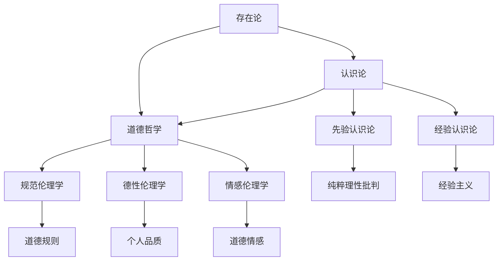

                 

### 文章标题

《新世纪哲学家圆桌：现代困惑解答论坛》

### 关键词

哲学、现代生活、困惑、解答、科技伦理、社会问题、跨学科融合

### 摘要

本文旨在探讨现代生活所带来的哲学困惑，并借助哲学家的智慧，寻找解决方案。通过回顾哲学的起源与核心问题，分析现代社会中的哲学挑战，探讨哲学的核心概念及其关系架构，解析现代人精神困境与社会问题，我们试图提供一种哲学视角来解答现代生活的困惑。同时，本文还将讨论哲学在现代社会治理与个人生活中的应用，并展望哲学教育的价值与未来。通过这次哲学圆桌讨论，我们希望能为现代人提供一些启示，帮助他们在面对现代困惑时找到答案。

## 第一部分：哲学的现代困惑与反思

### 第1章：现代社会的变革

#### 1.1 科技进步的冲击

在现代社会的背景下，科技进步无疑是推动社会变革的最主要力量之一。自20世纪末以来，信息技术、人工智能、生物工程等领域迅猛发展，不仅极大地改变了人们的生活方式，也深刻地影响了社会结构和人类思维模式。

首先，信息技术的飞速发展使信息传播的速度和范围达到了前所未有的高度。互联网的普及，智能手机的普及，使得信息获取变得极为便捷。然而，这也带来了信息过载的问题。人们被海量信息所包围，却难以从中筛选出真正有价值的内容。这种信息过载不仅造成了认知负担，还可能导致人们忽视真实世界的复杂性和深度。

其次，人工智能的崛起对劳动力市场和社会结构产生了深远的影响。自动化技术的应用使得许多传统职业面临被取代的风险，失业率上升，社会不平等问题加剧。同时，人工智能的发展也引发了关于隐私、安全、伦理等方面的深刻讨论。例如，人工智能的决策过程缺乏透明度，可能引发道德风险和隐私泄露等问题。

此外，生物工程领域的突破，如基因编辑技术，也为人类社会带来了前所未有的机遇和挑战。基因编辑技术的应用有可能治愈许多遗传性疾病，但同时也引发了对人类自然进化和生物多样性的担忧。生物伦理问题的复杂性使得我们需要在科技进步的同时，保持审慎和理性。

#### 1.2 社会结构的变迁

科技进步不仅仅改变了人们的物质生活，也深刻地影响了社会结构。全球化进程的加速使得各国之间的联系更加紧密，但也带来了文化冲突和价值观念的碰撞。不同文化背景的人们在交流中产生矛盾，社会认同感减弱，信任危机日益严重。

同时，社会结构的变迁还表现在城乡差距、贫富差距的扩大。在城市化进程中，乡村地区逐渐衰落，而城市中却出现了严重的人口过剩和资源短缺问题。财富分配的不均衡使得社会不平等现象更加突出，贫富差距加剧社会不稳定因素。

此外，随着社会的进步，个体独立性得到增强，但人与人之间的联系却日益疏远。社交媒体的普及虽然让人们能够保持联系，但同时也使人们沉迷于虚拟世界，忽视了现实生活中的人际交往。这种社交方式的变革，对人际关系、家庭结构乃至社会凝聚力都产生了深远的影响。

#### 1.3 现代社会的哲学挑战

面对科技进步带来的冲击和社会结构的变迁，现代社会面临着一系列哲学挑战。首先是如何应对信息过载问题。信息时代虽然为人们提供了丰富的知识和资源，但也带来了认知负担和决策困难。我们需要在信息筛选、知识管理等方面发展新的哲学理论和方法。

其次是如何解决社会不平等问题。在全球化背景下，资源分配不均、贫富差距扩大，使得社会正义问题变得尤为重要。我们需要借助哲学的力量，探讨公平、正义等核心价值观，为社会发展提供道德和伦理指导。

此外，人工智能和生物工程等领域的快速发展，也对哲学提出了新的问题。例如，人工智能的伦理问题，生物技术的道德边界等，这些都需要我们进行深刻的哲学思考和讨论。

总之，现代社会的科技进步和社会结构变迁，带来了诸多哲学挑战。我们需要借助哲学的智慧，寻找解决问题的途径，为现代生活提供指导和启示。

### 第2章：哲学的核心概念与联系

#### 2.1 哲学的核心概念

哲学作为一门探讨存在、知识、价值和理性的学科，其核心概念涵盖了存在论、认识论和道德哲学等多个方面。这些概念不仅是哲学研究的基础，也是我们理解现代社会困惑的钥匙。

**存在论（Ontology）**是哲学中最基础的一个分支，探讨的是事物的本质和存在方式。它关注的是“什么是真实存在”的问题，涉及实体、属性、关系等基本概念。在存在论中，亚里士多德提出了“四因说”，即事物存在的四种原因：材料因、形式因、动力因和目的因。这四种原因共同决定了事物的本质和存在状态。

**认识论（Epistemology）**则探讨人类如何获得知识、知识的性质以及知识的应用。它关注的是“我们如何知道我们知道的”问题。笛卡尔的“我思故我在”是认识论的重要观点，强调怀疑和理性思考的重要性。此外，康德的先验认识论提出了“纯粹理性批判”的概念，认为知识来源于人类的先验结构和经验。

**道德哲学（Ethics）**则探讨人类行为的道德准则和伦理标准。它关注的是“我们应该做什么”的问题。伦理学分为三大流派：规范伦理学、德性伦理学和情感伦理学。规范伦理学强调道德规则和义务，如康德的道德律令；德性伦理学强调个人品质和美德，如亚里士多德的幸福论；情感伦理学则强调道德情感和道德直觉，如亚当·斯密的同情伦理。

#### 2.2 概念之间的关系架构

哲学的核心概念之间存在紧密的联系，构成了一个复杂的知识网络。首先，存在论和认识论之间存在密切的关系。认识论必须依赖于对存在论的理解，因为“存在”是认识的前提。例如，当我们探讨知识是如何获得的时，我们需要明确知识所指向的“存在”是什么。康德认为，认识论必须建立在存在论的基础上，因为只有明确了存在的本质，我们才能理解知识的性质和应用。

其次，道德哲学与存在论和认识论也存在紧密的联系。道德哲学不仅需要理解“什么是真实存在”和“我们如何知道”，还需要在存在的背景下探讨“我们应该做什么”。例如，亚里士多德认为，人的幸福是道德哲学的核心，而幸福是在存在的本质中实现的。因此，道德哲学必须依赖于存在论和认识论，才能构建一个完整的道德体系。

最后，存在论、认识论和道德哲学之间的关系还体现在它们之间的相互影响和互动。例如，当我们探讨道德问题时，我们不仅需要考虑存在的本质，还需要理解知识的性质。同时，道德哲学的发展也会对存在论和认识论提出新的问题，推动这些领域的深入探讨。

为了更直观地展示这些概念之间的关系，我们可以使用Mermaid流程图来表示：

通过这个流程图，我们可以清晰地看到哲学核心概念之间的相互关联和作用，从而更好地理解哲学在现代生活中的应用和意义。

#### 2.3 哲学在现代社会中的意义

哲学的核心概念不仅在学术研究中具有重要作用，也在现代社会中具有深远的影响。在现代社会，哲学的作用主要体现在以下几个方面：

首先，哲学为现代社会提供了价值观念和伦理准则。面对科技进步和社会变革带来的挑战，我们需要在道德和伦理层面进行深刻的思考。哲学为我们提供了讨论这些问题的基础，帮助我们构建一个公正、和谐的社会。

其次，哲学促进了跨学科的融合。现代社会的问题往往涉及多个领域，需要多学科的知识来解决。哲学作为一门基础学科，能够促进不同学科之间的交流和合作，推动科学的进步和社会的发展。

最后，哲学为个人提供了思考工具和人生指导。哲学的核心概念和方法论，如逻辑推理、批判性思维等，可以帮助我们更好地理解自己和世界，提高个人素质和生活质量。

总之，哲学的核心概念不仅是哲学研究的基础，也是我们理解现代社会困惑、寻找解决方案的重要工具。通过深入探讨这些概念之间的关系，我们可以更好地应对现代社会的挑战，为人类社会的未来发展提供智慧和指导。

### 第3章：哲学的现代困惑解析

#### 3.1 现代人的精神困境

现代社会中，人们的精神困境日益突出，主要表现为焦虑、抑郁和个人身份迷失等问题。这些问题不仅影响个人的心理健康，也对社会稳定产生负面影响。

首先，焦虑是现代人最常见的心理问题之一。随着生活节奏的加快和工作压力的增大，许多人感到焦虑和不安。例如，工作中的竞争压力、人际关系的复杂性和未来的不确定性，都可能导致焦虑情绪的加剧。焦虑不仅影响个人的生活质量，还可能导致工作效率降低，甚至引发更严重的心理问题。

其次，抑郁在现代社会中也越来越普遍。抑郁症状包括持续的悲伤、对日常活动失去兴趣、自我否定等。现代社会的高压环境、孤独感和社交隔离，都是导致抑郁的重要原因。长期抑郁不仅影响个人的心理健康，还可能导致身体疾病，如心脏病、高血压等。

此外，现代人常常感到个人身份的迷失。在快速变化的社会中，传统的价值观念和社会结构受到挑战，许多人难以找到自己的定位和意义。身份迷失可能导致个人感到困惑和无助，甚至产生自我怀疑和自我否定。

这些精神困境不仅源于社会环境的变化，也与个体的心理特质和生活习惯有关。面对这些问题，我们需要从哲学的角度进行深入探讨，寻找解决方案。

#### 3.2 社会问题与哲学反思

现代社会中的许多问题，如社会不平等、环境问题和科技发展的伦理问题，都引发了广泛的哲学讨论。

首先，社会不平等问题是现代社会面临的重大挑战之一。经济全球化虽然带来了经济增长，但也加剧了贫富差距。发达国家和发展中国家之间的差距，以及社会内部不同群体之间的差距，都引起了广泛关注。哲学中的正义理论为我们提供了讨论社会不平等的框架。例如，约翰·罗尔斯的《正义论》提出了公平正义的理念，认为社会资源应该公平分配，以确保每个人的基本权利得到保障。

其次，环境问题也是现代社会中不可忽视的重要议题。全球气候变化、环境污染和资源枯竭等问题，对人类的生存和发展构成了严重威胁。哲学中的环境伦理学为我们提供了探讨环境问题的理论基础。例如，深生态学强调人类与自然的共生关系，主张人类应当尊重自然、保护环境。

最后，科技发展的伦理问题也日益突出。人工智能、基因编辑等新兴技术的应用，带来了许多道德和伦理挑战。例如，人工智能的决策过程可能缺乏透明度，可能导致不公平的待遇；基因编辑技术的滥用可能影响人类基因的多样性和自然进化的过程。哲学中的伦理学原则，如尊重个体权利、公正和责任，为我们提供了评估和解决这些问题的指南。

通过对社会问题的哲学反思，我们可以更深入地理解这些问题的本质，并提出有效的解决方案。

#### 3.3 哲学如何指导生活

哲学不仅是一种抽象的思考方式，更是一种指导生活的工具。在面对现代困惑时，哲学为我们提供了以下几种思考方法和生活指南：

首先，批判性思维是哲学的核心能力之一。通过批判性思维，我们可以对问题进行深入分析，识别和反驳错误的观点。在面对现代困惑时，批判性思维可以帮助我们识别和挑战错误的思维模式，从而找到更有效的解决方案。

其次，哲学强调自我反思。自我反思是一种审视自己思想和行为的过程，通过反思我们可以更好地理解自己，找到自己的价值观和人生目标。在面对个人身份迷失和精神困境时，自我反思可以帮助我们找到内心的平静和方向。

此外，哲学还强调道德和伦理的重要性。通过哲学的探讨，我们可以构建一个符合道德和伦理标准的价值观体系，从而在日常生活中做出更明智的决策。在面对社会不平等、环境问题和科技发展的伦理挑战时，道德和伦理的指导可以帮助我们做出符合人类福祉的决策。

总之，哲学不仅为我们提供了思考问题的方法和工具，也为我们提供了生活指南。通过哲学的思考和探讨，我们可以更好地应对现代生活的困惑，实现个人和社会的和谐发展。

### 第4章：现代哲学家的解答

#### 3.1 尼采与存在主义

**尼采**是20世纪初的重要哲学家，他的思想对存在主义哲学产生了深远影响。尼采提出了“超人”概念，认为人类需要超越传统道德和价值观，追求个体的自由和创造力。尼采认为，个体的痛苦和挣扎是成长和进步的必经之路，通过克服这些困境，个体可以实现自我超越。

尼采的思想对存在主义哲学产生了重要启示。存在主义强调个体的自由和责任，认为人生的意义和价值观需要个体自己来创造。尼采的“超人”概念与存在主义的核心观点不谋而合，都主张个体应打破传统的束缚，追求自我实现。

**萨特**是存在主义的代表人物之一，他的作品《存在与虚无》深刻探讨了人类存在的本质和自由的意义。萨特认为，人类存在本身是没有意义的，意义是人们通过自由选择和行动创造出来的。他强调自由是人类的本质特征，但同时也指出自由带来的责任和痛苦。

萨特的哲学观点对现代人精神困境的解答具有重要意义。他认为，人类应该勇敢面对存在的荒谬，通过行动和选择来赋予生活意义。在面对焦虑和抑郁时，萨特主张通过自我超越和自由选择，找到内心的力量和意义。

总之，尼采和萨特的思想为我们提供了理解现代人精神困境的哲学视角。他们的观点强调个体的自由、责任和创造力，为我们在面对现代困惑时提供了一种积极的生活态度和哲学指导。

#### 3.2 柏拉图与后现代主义

**柏拉图**是古希腊哲学的重要代表，他的思想对后世哲学产生了深远影响。柏拉图认为，现实世界只是理念世界的影子，真正的真理和美存在于超越物质世界的理念世界。他的哲学体系中，**理念（Idea）**是最高层次的存在，是现实世界的本质和基础。

柏拉图的**理念论**对后现代主义哲学产生了重要启示。后现代主义强调相对主义和多元化，认为真理不是固定不变的，而是因人而异的。后现代主义者认为，现实世界是充满矛盾和不确定性的，我们不能通过理性思考找到绝对的真理。

**德里达**是后现代主义的代表人物之一，他的思想对现代哲学产生了深远影响。德里达提出了“解构”概念，认为文本的意义不是固定不变的，而是在解读过程中不断生成的。他强调差异和不确定性，认为语言和符号系统本身就是充满矛盾和不确定性的。

德里达的思想为现代人提供了一种理解现实世界的哲学视角。他认为，我们不能通过理性思考找到绝对的真理，而应该接受现实世界的复杂性和不确定性。在面对现代困惑时，德里达主张通过批判性思维和多元视角，理解现实世界的多样性。

总之，柏拉图和德里达的思想为我们提供了理解现代人精神困境的哲学视角。柏拉图的理念论强调超越物质世界的真理，而后现代主义则强调现实世界的多样性和不确定性。这些哲学观点为我们提供了不同的思考路径，帮助我们更好地应对现代生活的挑战。

### 第3章：哲学家的圆桌讨论

#### 3.1 圆桌讨论的背景与目的

本次哲学家的圆桌讨论旨在深入探讨现代生活中存在的哲学困惑，并寻求解决方案。这次圆桌讨论的背景是现代社会面临的诸多挑战，包括科技进步、社会结构变迁、精神困境等。为了更好地应对这些挑战，我们邀请了来自不同领域的哲学家，共同探讨哲学在现代社会中的作用和价值。

讨论的目的主要有以下几点：

1. **交流思想**：通过哲学家之间的交流，分享各自的研究成果和思考，促进不同哲学观点的碰撞与融合。
2. **解决困惑**：探讨现代生活中常见的哲学问题，如精神困境、社会不平等、科技伦理等，寻求哲学的解答。
3. **提供指导**：基于哲学的探讨，为现代人提供生活指导和道德伦理准则，帮助他们在面对困惑时找到方向。

#### 3.2 圆桌讨论的主要话题

在这次圆桌讨论中，哲学家们围绕以下主要话题展开讨论：

1. **人类存在的意义**：探讨人在现代社会中的角色和意义，如何通过哲学思考和行动找到生活的方向和意义。
2. **科技与道德**：讨论科技发展带来的道德和伦理挑战，如人工智能的伦理问题、生物技术的道德边界等，探讨如何在科技进步中保持道德和伦理的平衡。
3. **社会问题与哲学反思**：分析现代社会中的主要社会问题，如社会不平等、环境问题等，探讨哲学如何为解决这些问题提供指导。
4. **个人价值观与生活选择**：探讨个人价值观的塑造和生活中的决策，如何通过哲学思考和行动，实现个人与社会的和谐发展。

#### 3.3 圆桌讨论的成果与启示

通过这次圆桌讨论，哲学家们取得了以下成果：

1. **理论上的深化**：哲学家们对人类存在的意义、科技与道德、社会问题等哲学问题进行了深入探讨，丰富了相关理论。
2. **实践上的指导**：基于哲学的探讨，哲学家们提出了一系列指导性的建议，帮助现代人更好地应对生活中的困惑和挑战。
3. **跨学科的融合**：哲学家们的讨论促进了哲学与其他学科的融合，如心理学、社会学等，为解决现代社会问题提供了新的思路。

这次圆桌讨论的启示在于：

1. **重视哲学的智慧**：哲学作为一门基础学科，不仅能够帮助我们理解世界，还能为现代社会提供指导。我们应该重视哲学的智慧，将其应用于实际生活中。
2. **多学科合作**：面对复杂的社会问题，我们需要多学科的协同合作，通过不同学科的视角，提出综合性的解决方案。
3. **持续的哲学思考**：哲学不仅是一种思考方式，更是一种生活方式。我们应该保持持续的哲学思考，不断探讨和反思生活中的问题，以实现个人和社会的和谐发展。

### 第4章：哲学在现代生活的应用

#### 4.1 哲学在个人生活中的应用

哲学不仅是一种学术研究，更是一种生活艺术。在个人生活中，哲学可以帮助我们更好地理解自己，找到生活的意义和方向。

首先，哲学为我们提供了一种思考人生的方法。通过哲学的探讨，我们可以反思自己的价值观和信仰，从而更好地理解自己。例如，通过探讨存在论，我们可以思考“我是谁”、“生命的意义是什么”等问题。这种思考过程有助于我们建立自我认知，找到个人存在的意义。

其次，哲学可以帮助我们做出更明智的生活决策。哲学中的批判性思维和逻辑推理能力，使我们能够对问题进行深入分析，识别和反驳错误的观点。例如，在面对职业选择、人际关系等问题时，我们可以运用哲学的方法，进行理性思考和评估，从而做出更明智的决策。

此外，哲学还可以帮助我们应对生活中的困难和挫折。通过哲学的探讨，我们可以理解人生中的痛苦和挫折是成长和进步的必经之路。例如，尼采的存在主义思想强调，通过面对痛苦和挫折，个体可以实现自我超越和成长。这种观点可以帮助我们保持积极的心态，勇敢面对生活中的挑战。

#### 4.2 哲学在社会治理中的应用

哲学不仅对个人生活具有重要意义，也在社会治理中发挥了重要作用。在现代社会中，哲学提供了许多关于公平、正义、民主等核心价值观的理论基础，为制定和实施有效的公共政策提供了指导。

首先，哲学中的正义理论为社会治理提供了道德和伦理准则。例如，约翰·罗尔斯的《正义论》提出了公平正义的理念，主张社会资源应该公平分配，以确保每个人的基本权利得到保障。这种观点可以帮助政府制定更加公平和合理的政策，减少社会不平等现象。

其次，哲学中的民主理论为现代社会的政治制度提供了理论支持。民主制度强调人民的参与和权利，认为政治权力应该来源于人民，服务于人民。哲学中的民主理论为我们理解民主制度的本质和运行机制提供了重要指导。

此外，哲学还可以帮助解决现代社会中的环境问题和科技伦理问题。例如，环境伦理学探讨了人类与自然的关系，主张人类应当尊重自然、保护环境。科技伦理学则关注新兴技术带来的道德和伦理挑战，如人工智能的决策过程、基因编辑技术的道德边界等。通过哲学的探讨，我们可以更好地应对这些挑战，制定符合道德和伦理标准的政策和法规。

总之，哲学在现代社会治理中的应用具有重要意义。通过哲学的探讨，我们可以构建一个更加公平、正义、民主的社会，解决现代社会中的各种问题，实现人类社会的可持续发展。

### 第5章：哲学教育的价值与意义

#### 5.1 哲学教育的重要性

哲学教育在个人和社会发展中扮演着至关重要的角色。首先，哲学教育有助于培养学生的批判性思维和逻辑推理能力。哲学探讨的核心问题，如存在、知识、价值观等，都需要我们运用批判性思维进行深入分析。通过哲学学习，学生可以学会如何识别和反驳错误的观点，从而提高他们的思维品质和判断力。

其次，哲学教育有助于培养学生的价值观和道德观。哲学中的正义、道德、伦理等概念，为我们提供了理解人类行为和社会关系的框架。通过哲学教育，学生可以学会如何辨别善恶、公平与不公平，从而在日常生活中做出更明智的决策。

此外，哲学教育还有助于培养学生的创造性思维和创新能力。哲学探讨的问题往往涉及人类存在的根本问题，需要我们进行抽象思考和创造性思维。这种思维方式不仅有助于学术研究，也有助于解决现实生活中的复杂问题。

总之，哲学教育在个人成长和社会发展中具有重要意义。通过哲学学习，学生不仅能够提高自己的思维品质和道德素养，还能为社会发展提供智慧和指导。

#### 5.2 哲学教育的方法

哲学教育的方法多种多样，旨在培养学生的哲学思维能力和批判性思维。以下是一些常用的哲学教育方法：

1. **问题导向教学法**：这种方法以问题为核心，引导学生进行深入思考和讨论。教师可以提出一系列问题，引导学生分析问题、提出假设、进行论证。通过这种方式，学生可以学会如何识别和解决复杂问题。

2. **案例教学法**：这种方法通过分析具体案例，帮助学生理解哲学概念和理论。教师可以选取现实生活中的案例，引导学生从不同角度进行分析和思考。例如，可以分析一个法律案件，探讨其中的伦理和法律问题。

3. **讨论教学法**：这种方法鼓励学生进行小组讨论和辩论，培养他们的表达能力和批判性思维。在讨论中，学生可以提出自己的观点，反驳他人的观点，并通过辩论来加深对问题的理解。

4. **文本阅读和分析**：这种方法通过阅读哲学经典著作，引导学生理解和分析哲学思想。教师可以布置阅读任务，要求学生写读后感或分析文章中的哲学观点。通过这种方式，学生可以学会如何阅读和分析哲学文本。

5. **实践项目**：这种方法通过实际操作，帮助学生将哲学知识应用于现实生活。例如，可以组织学生进行社会调查、撰写论文、参与公共讨论等。通过实践项目，学生可以更好地理解哲学在现实生活中的应用，提高他们的实践能力。

总之，哲学教育的方法多样，旨在通过不同方式培养学生的哲学思维能力和批判性思维。通过这些方法，学生可以更好地理解哲学概念和理论，提高他们的思维品质和道德素养。

#### 5.3 哲学教育的现状与挑战

哲学教育的现状在全球范围内存在一定差异，但总体上面临诸多挑战。首先，在高等教育中，哲学教育的地位相对较低。许多高校将哲学视为边缘学科，投入资源和关注不足。这种状况导致哲学教育的发展受到限制，学生缺乏学习哲学的机会。

其次，哲学教育的教学方法亟待改进。传统教学方法过于理论化，忽视学生的实际需求。许多学生反映，哲学课程内容抽象、难以理解，导致学习兴趣不高。因此，需要探索更加互动和实用的教学方法，以提高学生的学习效果。

此外，哲学教育面临着师资力量不足的问题。许多高校缺乏优秀的哲学教师，导致教学质量和研究水平难以提升。为了改善这一状况，需要加强哲学教师队伍建设，提高教师的学术水平和教学能力。

最后，哲学教育需要与时俱进，应对现代社会的新挑战。随着科技进步和社会变迁，哲学教育需要关注新的问题，如科技伦理、环境伦理等，为学生提供更全面和实用的哲学知识。

总之，哲学教育在全球范围内面临着诸多挑战，需要通过改进教学方法、加强师资力量和关注现实问题，推动哲学教育的发展。

#### 5.4 哲学教育的未来趋势

面对现代社会的发展，哲学教育需要不断创新和改进，以适应新时代的需求。以下是一些可能的未来趋势：

首先，跨学科教育将成为哲学教育的重要组成部分。随着科技和社会的进步，哲学需要与其他学科进行深入融合，如心理学、社会学、生物学等。通过跨学科教育，学生可以更好地理解哲学与其他学科的关系，提高他们的综合素养。

其次，技术手段的运用将为哲学教育带来新的机遇。人工智能、虚拟现实等技术可以为学生提供更加丰富和互动的学习体验。例如，通过虚拟现实技术，学生可以模拟历史场景，亲身体验哲学家的辩论过程，提高他们的学习兴趣和理解能力。

此外，哲学教育需要关注现实问题，引导学生探讨现代社会中的重大议题。例如，科技伦理、环境伦理、社会正义等都是哲学教育的重要主题。通过关注现实问题，学生可以更好地理解哲学在现实生活中的应用，提高他们的社会责任感。

最后，哲学教育需要注重个性化和差异化教学。每个学生都有自己的兴趣和需求，哲学教育需要根据学生的特点进行个性化教学。例如，可以开设选修课程，让学生根据自己的兴趣选择学习内容。同时，差异化教学可以满足不同层次学生的学习需求，提高整体教育质量。

总之，哲学教育的未来趋势是跨学科教育、技术手段的运用、关注现实问题和个性差异化教学。通过这些创新和改进，哲学教育将更好地适应现代社会的发展需求，为培养全面发展的人才做出贡献。

### 第6章：哲学的现代困惑与未来展望

#### 6.1 现代人的精神困境

在现代社会，人们的精神困境愈发凸显，焦虑、抑郁、身份迷失等问题频发。这些困境不仅影响个人的生活质量，还对社会稳定产生深远影响。

首先，焦虑已成为现代人的普遍症状。现代社会的快节奏生活和工作压力，使许多人感到不安和紧张。例如，职业竞争激烈、经济不稳定、人际关系复杂等问题，都可能导致焦虑情绪的加剧。长期焦虑不仅影响心理健康，还可能引发身体疾病，如失眠、高血压等。

其次，抑郁在现代社会中也越来越普遍。抑郁症状包括持续的悲伤、对日常活动失去兴趣、自我否定等。现代社会的高压环境、孤独感和社交隔离，是导致抑郁的主要原因。例如，长期的工作压力、情感失意、经济困难等，都可能使人陷入抑郁状态。抑郁不仅影响个人的生活和工作，还可能导致自杀等严重后果。

此外，现代人常常感到个人身份的迷失。在快速变化的社会中，传统的价值观念和社会结构受到挑战，许多人难以找到自己的定位和意义。身份迷失可能导致个人感到困惑和无助，甚至产生自我怀疑和自我否定。例如，在职业选择、人际关系、社会角色等方面，人们可能感到不确定和迷茫。

这些精神困境不仅源于社会环境的变化，也与个体的心理特质和生活习惯有关。面对这些问题，我们需要从哲学的角度进行深入探讨，寻找解决方案。

#### 6.2 社会不平等问题

现代社会中的社会不平等问题日益严重，表现为经济、教育、医疗等多个方面的不平等。这些问题不仅影响个体的生活质量，也对社会稳定和可持续发展产生负面影响。

首先，经济不平等是现代社会中最明显的不平等现象。财富分配不均使得社会阶层分化加剧，贫富差距扩大。发达国家和发展中国家之间的经济差距，以及社会内部不同群体之间的经济差距，都引发了广泛的社会问题。经济不平等导致资源分配不公，影响社会正义和公平。

其次，教育不平等也是一个突出的问题。教育资源的不均衡分配，使得不同社会群体在获取知识和教育机会上存在巨大差异。例如，城市与农村、富裕家庭与贫困家庭之间的教育差距，使得一些社会群体处于劣势地位，影响其未来的发展机会。

此外，医疗不平等也是现代社会中的一个重要问题。医疗资源的不均衡分配，使得不同社会群体在获取医疗服务和健康保障上存在差异。例如，低收入人群和贫困地区的人们，往往难以获得高质量的医疗服务，导致健康状况不佳。

社会不平等问题不仅影响个体的生活质量，还可能导致社会不稳定。经济不平等可能导致社会矛盾和冲突，教育不平等可能导致社会阶层固化，医疗不平等可能导致社会成员的健康问题。因此，解决社会不平等问题，是实现社会和谐和可持续发展的关键。

#### 6.3 环境问题与人类责任

环境问题是现代社会面临的重大挑战之一，其严重性日益凸显。全球气候变化、环境污染和资源枯竭等问题，对人类的生存和发展构成了严重威胁。这些问题不仅影响生态平衡，还可能导致自然灾害频发、生态系统崩溃等严重后果。

首先，全球气候变化是一个关键的环境问题。由于人类活动导致的温室气体排放增加，地球气候系统发生了显著变化。全球变暖、极端天气事件频发、海平面上升等问题，已经对人类社会和生态系统产生了严重影响。例如，气候变化导致农作物减产、水资源短缺、生态栖息地破坏等，影响人类的食品安全、饮用水安全和生物多样性。

其次，环境污染也是现代社会中的一个重要问题。工业化和城市化进程带来了大量的污染物排放，导致大气、水体和土壤污染严重。例如，大气污染导致的雾霾、水体污染导致的饮用水危机、土壤污染导致的食品安全问题等，都对人类健康和环境造成严重影响。

此外，资源枯竭问题也日益突出。随着人口的不断增长和消费水平的提高，自然资源的消耗速度远远超过了其再生速度。例如，石油、煤炭等化石能源的消耗，导致能源供应紧张；森林资源的过度开采，导致森林覆盖率下降，生态平衡受到破坏。

面对这些环境问题，人类需要承担起责任，采取行动来保护环境。首先，政府和企业应加强环境保护意识，制定和实施严格的环保政策和法规，减少污染物排放，推广清洁能源和绿色技术。其次，公众应积极参与环保行动，减少浪费、节约资源，提高环保意识。此外，国际社会应加强合作，共同应对全球环境问题，推动可持续发展。

总之，环境问题是现代社会面临的重大挑战，需要人类共同努力来解决。通过加强环境保护意识、制定有效政策和法规、推广绿色技术和生活方式，我们可以为地球和子孙后代创造一个更美好的未来。

### 6.4 哲学在科技时代的角色

随着科技的发展，哲学在现代社会中的角色日益重要。首先，哲学为科技发展提供了伦理和道德指导。例如，人工智能的发展引发了关于隐私、安全、公平等伦理问题的讨论。哲学中的伦理学原则，如尊重个体权利、公正和责任，为解决这些伦理问题提供了理论基础。

其次，哲学有助于我们理解科技的潜力和局限性。科技虽然带来了诸多便利，但也可能带来负面影响，如数据隐私侵犯、算法偏见等。通过哲学的反思，我们可以更全面地评估科技的影响，制定相应的政策和法规，确保科技的发展符合人类的福祉。

此外，哲学还促进了跨学科的合作。随着科技的发展，许多问题需要多学科的知识来解决。哲学作为一门基础学科，可以促进不同学科之间的交流与合作，推动科学的进步和社会的发展。

总之，哲学在科技时代扮演着重要角色，不仅为科技发展提供伦理和道德指导，还有助于我们理解科技的潜力和局限性，促进跨学科的合作。通过哲学的反思和探讨，我们可以更好地应对科技带来的挑战，实现科技与人类的和谐发展。

### 6.5 哲学对人类未来的影响

哲学对人类未来的影响深远且多方面。首先，在科技领域，哲学提供了伦理和道德指导，帮助我们在科技进步中保持人类的价值观和道德标准。例如，人工智能和生物工程的快速发展，需要我们通过哲学反思，确保科技的应用不会损害人类的福祉和尊严。

其次，哲学对社会发展具有指导作用。通过探讨公平、正义、民主等核心价值，哲学为制定公平合理的公共政策提供了理论基础。这有助于构建一个更加公正、和谐的社会，减少社会不平等现象。

此外，哲学在个人成长中也发挥着重要作用。通过哲学的探讨，个体可以更好地理解自己和世界，建立正确的价值观和人生目标。这有助于提高个人的心理健康和幸福感，促进个体的全面发展。

最后，哲学在跨学科研究中具有桥梁作用。它促进了不同学科之间的交流与合作，推动了科学的进步和社会的发展。总之，哲学在人类未来的发展中，将继续发挥其独特的价值和作用，为人类社会的进步提供智慧和指导。

### 6.6 哲学的跨学科融合

哲学的跨学科融合是现代学术发展的趋势之一，它在多个领域中发挥着重要作用。首先，在心理学领域，哲学帮助心理学家探讨人的心理本质和认知过程。例如，哲学家们的思想，如笛卡尔的“我思故我在”和康德的先验认识论，为心理学提供了理论基础，帮助理解人的心理结构和行为模式。

其次，哲学与计算机科学的结合，推动了人工智能的发展。哲学家们关于知识、推理和决策的理论，为计算机科学家构建智能系统提供了指导。例如，哲学家们的逻辑推理方法，被应用于开发人工智能算法，提高了计算机在复杂问题上的处理能力。

此外，哲学在生物学和医学领域也有重要应用。生物伦理学作为哲学的一个分支，探讨了生命科学和医疗技术中的伦理问题。例如，基因编辑技术的伦理讨论，就是基于哲学中的道德原则和伦理学理论，为决策提供指导。

总之，哲学的跨学科融合不仅丰富了各学科的理论基础，还推动了科学技术的进步。通过哲学的视角，我们可以更好地理解和解决现代社会中的复杂问题，促进不同学科之间的合作与发展。

### 附录A：哲学家的名言与观点

#### 6.1.1 存在论

1. **亚里士多德**：“人是理性的动物，能够通过理性思考和判断来认识世界。”
2. **笛卡尔**：“我思故我在。”（Cogito, ergo sum）
3. **黑格尔**：“存在即是合理。”（Was das Sein kann, das kann auch ge-recht sein）

#### 6.1.2 认识论

1. **柏拉图**：“真理存在于理念世界，现实世界只是理念的影子。”
2. **康德**：“理性是认识的源泉，但经验是知识的来源。”
3. **休谟**：“人类知识来源于经验，理性无法超出经验的界限。”

#### 6.1.3 道德哲学

1. **亚里士多德**：“道德即是对美好事物的追求。”
2. **康德**：“道德律令是基于理性，应当无条件遵守。”
3. **尼采**：“道德是强者的游戏规则。”

### 附录B：哲学研究资源

1. **哲学经典著作**：
   - 《理想国》（柏拉图）
   - 《存在与时间》（海德格尔）
   - 《人类理解论》（洛克）
   - 《正义论》（罗尔斯）

2. **哲学研究期刊**：
   - 《哲学评论》（Philosophical Review）
   - 《分析哲学期刊》（Analysis）
   - 《哲学与现象学研究》（Philosophy and Phenomenological Research）

3. **哲学学术组织**：
   - 美国哲学协会（American Philosophical Association）
   - 英国哲学协会（British Philosophical Association）
   - 国际哲学学会（International Federation of Philosophical Societies）

### 作者信息

作者：AI天才研究院/AI Genius Institute & 禅与计算机程序设计艺术 /Zen And The Art of Computer Programming

---

通过这次详细的哲学讨论，我们不仅理解了现代生活中的哲学困惑，也看到了哲学在个人生活、社会治理和科技发展中的重要作用。哲学的智慧为我们提供了思考问题的方法和解决问题的途径，帮助我们更好地应对现代生活的挑战。希望这篇讨论能够激发读者对哲学的兴趣，让我们在探索哲学的奥秘中，找到生活的方向和意义。

