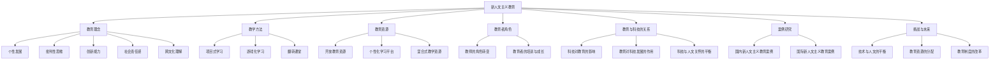

                 

# 《新人文主义教育：科技时代的人文关怀》

> 关键词：新人文主义教育，科技时代，人文关怀，教育变革，教育理念

> 摘要：随着科技的发展，教育领域正在经历深刻的变革。新人文主义教育应运而生，旨在平衡科技与人文关怀，以培养全面发展的现代人才。本文将从历史背景、核心概念、教育与科技的关系、实践、案例研究及挑战与未来等方面，系统阐述新人文主义教育的理念和实践，探讨其在科技时代的人文关怀。

## 目录大纲

1. 引言与背景
   1.1 新人文主义教育的历史背景
   1.2 科技时代的教育变革
   1.3 人文关怀在新人文主义教育中的重要性

2. 新人文主义教育的核心概念
   2.1 新人文主义教育理念
   2.2 新人文主义教育与传统教育的区别
   2.3 新人文主义教育的目标与意义

3. 教育与科技的关系
   3.1 科技对教育的影响
   3.2 教育对科技发展的作用
   3.3 科技与人文关怀的平衡

4. 新人文主义教育的实践
   4.1 教学方法
   4.2 教育资源
   4.3 教育者角色

5. 新人文主义教育案例研究
   5.1 国内新人文主义教育案例
   5.2 国际新人文主义教育案例

6. 新人文主义教育的挑战与未来
   6.1 挑战
   6.2 未来发展趋势

7. 参考文献

8. 附录

## 第一部分：引言与背景

### 1.1 新人文主义教育的历史背景

新人文主义教育起源于20世纪末，是教育领域对现代科技迅猛发展的回应。在这个时代，信息技术、人工智能、互联网等新兴科技不断改变着人们的生活方式，也对教育产生了深远影响。传统教育模式开始面临挑战，诸如知识陈旧、教学方式单一、学生创造力受限等问题逐渐暴露。

为了适应这种变化，教育学者们开始重新思考教育的本质和目的，提出了新人文主义教育的理念。新人文主义教育强调人的全面发展，注重培养学生的批判性思维、创造力、社会责任感等综合素质，而不是仅仅传授学科知识。

### 1.2 科技时代的教育变革

科技时代的到来，带来了教育模式的深刻变革。传统课堂教育逐渐被在线教育、远程教育、个性化教育等新型教育模式所取代。这些新型教育模式充分利用科技手段，实现了教育资源的共享和教育的普惠。

同时，科技的发展也为教育带来了新的工具和方法。例如，人工智能可以辅助教师进行个性化教学，大数据可以分析学生的学习情况，提供针对性的教育资源。虚拟现实和增强现实技术则为学生提供了沉浸式的学习体验。

### 1.3 人文关怀在新人文主义教育中的重要性

新人文主义教育强调人文关怀，认为教育不仅仅是知识的传授，更是一种价值观的塑造。人文关怀包括对个体尊重、对文化的理解和传承、对社会责任的认知等。在科技时代，人文关怀的重要性愈发凸显。

首先，科技的发展可能导致人的异化，过度依赖科技可能导致人际关系的疏远、情感冷漠。人文关怀可以弥补这种缺失，促进人的全面发展。

其次，科技的发展也带来了新的社会问题，如数据隐私、网络安全等。人文关怀教育可以培养学生的社会责任感，使他们成为有担当的公民。

最后，人文关怀有助于提升教育质量。当教育者关注学生的情感和需求时，可以更好地激发学生的学习兴趣和动力，提高教学效果。

## 第二部分：新人文主义教育的核心概念

### 2.1 新人文主义教育理念

新人文主义教育理念的核心是“以人为本”。它主张教育应关注人的全面发展，而不仅仅是知识的积累。具体来说，新人文主义教育理念包括以下几个方面：

1. **个性发展**：尊重个体的独特性，关注学生的兴趣和需求，提供多样化的学习路径，以促进学生个性化发展。

2. **批判性思维**：培养学生独立思考的能力，敢于质疑权威，勇于探索真理。

3. **创新能力**：鼓励学生尝试新方法，勇于创新，培养他们的创造力。

4. **社会责任感**：培养学生的社会责任感，使他们成为有担当的公民。

5. **跨文化理解**：培养对多元文化的理解和尊重，促进国际交流与合作。

### 2.2 新人文主义教育与传统教育的区别

传统教育以学科知识为中心，注重知识的传授和记忆，教学方法以讲授为主，学生被动接受知识。而新人文主义教育则更加注重学生的主体性和主动性，强调学生的参与和互动。

此外，传统教育强调统一标准，而新人文主义教育则强调个性化。新人文主义教育认为每个学生都是独特的个体，应该根据他们的兴趣和需求进行个性化教育。

### 2.3 新人文主义教育的目标与意义

新人文主义教育的目标不仅仅是培养专业人才，更重要的是培养具有全面素质的现代公民。具体来说，新人文主义教育的目标包括：

1. **培养综合素质**：包括思维能力、创新能力、人际交往能力等。

2. **促进个体发展**：关注学生的个性发展，培养他们的独立性和自主性。

3. **推动社会进步**：培养学生的社会责任感，使他们成为社会的积极参与者。

新人文主义教育的意义在于，它为现代教育提供了一种新的思路和方向，有助于解决传统教育中存在的问题，为培养适应未来社会的现代人才提供了有力的支持。

### 核心概念与联系

#### 新人文主义教育的概念实体关系架构图



这个架构图展示了新人文主义教育的核心概念和它们之间的关系。每个核心概念都是教育理念的一部分，它们共同构成了新人文主义教育的整体框架。教学方法、教育资源、教育者角色等都是实现教育理念的重要手段。教育与科技的关系以及挑战与未来则关注如何在实际中应用和进一步发展这些理念。

## 第三部分：教育与科技的关系

### 3.1 科技对教育的影响

科技的发展对教育产生了深远的影响。首先，科技改变了教育的形式。传统的课堂教学模式逐渐被在线教育、远程教育和虚拟课堂所取代。这些新型教育模式提供了更加灵活的学习方式，学生可以根据自己的时间和进度进行学习，极大地提高了教育的普及性和灵活性。

其次，科技丰富了教育的资源。通过互联网，学生可以随时随地获取到全球范围内的优质教育资源。例如，MOOC（大型开放在线课程）平台提供了大量的免费课程，使学习变得更加便捷和多样化。

此外，科技还提高了教育的效率。人工智能和大数据技术可以帮助教师更好地了解学生的学习情况，提供个性化的学习建议和资源。例如，智能教学系统能够根据学生的学习行为和表现，自动调整教学策略，提高教学效果。

### 3.2 教育对科技发展的作用

教育不仅受到科技的影响，同时也对科技发展起着推动作用。首先，教育培养了科技人才。高等教育和职业教育为科技行业提供了大量的专业人才，他们是科技发展的重要力量。例如，计算机科学、工程学、数据科学等专业培养了大量的程序员、工程师和科学家。

其次，教育促进了科技的普及和应用。通过教育，人们可以更好地理解和应用科技，推动科技在社会各个领域的广泛应用。例如，普及计算机科学教育，使更多的人掌握了编程技能，从而推动了信息化社会的建设。

最后，教育还促进了科技的创新。教育环境中的批判性思维、创新能力和跨学科合作，培养了学生的创新能力，为科技的创新提供了源源不断的动力。许多科技突破都是在教育环境中诞生的。

### 3.3 科技与人文关怀的平衡

在科技时代，如何平衡科技与人文关怀是教育面临的重要挑战。科技的发展带来了很多便利，但也可能导致人文关怀的缺失。例如，过度依赖科技可能导致人际交往能力的下降、情感的冷漠等。

为了平衡科技与人文关怀，新人文主义教育提出了以下几个策略：

1. **重视人文教育**：在科技教育的基础上，加强人文教育，培养学生的情感、道德和审美素养，使他们成为全面发展的人。

2. **培养批判性思维**：通过教育，培养学生的批判性思维，使他们能够理性地看待科技，既看到科技的优势，也看到科技的局限。

3. **强调跨学科合作**：鼓励学生跨学科学习，培养他们的综合能力和解决问题的能力，从而更好地应对复杂的社会问题。

4. **重视人际交往**：通过社交活动、团队项目等方式，增强学生的人际交往能力，培养他们的合作精神和团队意识。

通过这些策略，新人文主义教育旨在实现科技与人文关怀的平衡，培养出既具有科技素养，又具有人文关怀的现代人才。

### 实例分析

以在线教育平台Coursera为例，它通过科技手段提供了全球范围内的高质量教育资源。学生可以在线学习，不受时间和地点的限制。然而，这种模式也带来了一些挑战，如缺乏面对面交流的机会，可能导致学生人际交往能力的下降。为了应对这个问题，Coursera推出了在线讨论区和团队项目，鼓励学生互动和合作。同时，平台还提供了一系列的人文课程，如文学、艺术、心理学等，帮助学生全面发展。

## 第四部分：新人文主义教育的实践

### 4.1 教学方法

新人文主义教育的教学方法与传统教育有显著的不同，它强调学生的主动参与和创造性思维。以下是一些新人文主义教育的教学方法：

#### 4.1.1 项目式学习

项目式学习（Project-Based Learning，PBL）是一种以学生为中心的教学方法，通过实际项目来驱动学习。这种方法鼓励学生动手实践，解决问题，培养他们的团队合作能力和创新精神。例如，在一节计算机科学课程中，学生可以组成团队，完成一个校园地图应用程序的开发。在这个过程中，学生不仅学习编程技能，还培养了项目管理和团队协作的能力。

以下是一个简单的Python代码示例，展示了一个项目式学习任务：

```python
# Python代码示例：校园地图应用程序
class CampusMap:
    def __init__(self):
        self.locations = {}

    def add_location(self, name, coordinates):
        self.locations[name] = coordinates

    def get_location(self, name):
        return self.locations.get(name)

map = CampusMap()
map.add_location("图书馆", (32.8805, -117.2383))
map.add_location("餐厅", (32.8832, -117.2398))

# 测试代码
print(map.get_location("图书馆"))  # 输出：图书馆的坐标
```

这个示例代码展示了一个简单的校园地图应用程序，学生可以通过这个项目学习到如何使用Python进行对象导向编程和地图数据管理。

#### 4.1.2 游戏化学习

游戏化学习（Gamification）是通过将游戏机制引入学习过程，激发学生的学习兴趣和动力。这种方法可以包括积分系统、排名、奖励等元素。例如，在一节历史课程中，学生可以通过完成历史事件的游戏任务来学习历史知识。每个任务完成后，学生可以积累积分，并与其他同学竞争排行榜。

以下是一个简单的Python代码示例，展示了一个积分系统的实现：

```python
# Python代码示例：游戏化学习积分系统
class ScoreBoard:
    def __init__(self):
        self.scores = {}

    def add_score(self, name, points):
        self.scores[name] = self.scores.get(name, 0) + points

    def get_score(self, name):
        return self.scores.get(name, 0)

board = ScoreBoard()
board.add_score("Alice", 10)
board.add_score("Bob", 20)

# 测试代码
print(board.get_score("Alice"))  # 输出：Alice的积分
print(board.get_score("Bob"))    # 输出：Bob的积分
```

这个示例代码展示了一个简单的积分系统，学生可以通过完成任务获得积分，增强了学习的乐趣和动力。

#### 4.1.3 翻转课堂

翻转课堂（Flipped Classroom）是一种将传统课堂教学与在线学习相结合的教学方法。在这种方法中，学生在课前通过在线资源进行知识学习，课堂上则进行讨论、实践和问题解决。这种方法有助于提高学生的主动学习能力和课堂互动。

以下是一个简单的Python代码示例，展示了一个翻转课堂任务的实现：

```python
# Python代码示例：翻转课堂学习任务
class PythonCourse:
    def __init__(self):
        self.students = []

    def enroll(self, student):
        self.students.append(student)

    def run_class(self):
        for student in self.students:
            student.learn()

class Student:
    def learn(self):
        print("学习Python基础知识")

course = PythonCourse()
course.enroll("Alice")
course.enroll("Bob")

# 测试代码
course.run_class()
```

这个示例代码展示了一个简单的翻转课堂学习任务，学生通过在线资源进行学习，并在课堂上进行实践和讨论。

### 4.2 教育资源

新人文主义教育需要丰富的教育资源来支持教学方法的实施。以下是一些重要的教育资源：

#### 4.2.1 开放教育资源

开放教育资源（Open Educational Resources，OER）是指那些开放给公众使用和修改的教育内容。这些资源包括教科书、讲义、视频、音频等。开放教育资源降低了教育的成本，提高了资源的可获取性。例如，MIT的OpenCourseWare项目提供了大量的免费课程资源，让全球的学生可以免费学习到顶尖大学的教育内容。

#### 4.2.2 个性化学习平台

个性化学习平台可以根据学生的学习情况提供个性化的学习资源和建议。这些平台通常利用人工智能和大数据技术来分析学生的学习行为和表现，从而提供针对性的学习支持。例如，Khan Academy通过算法分析学生的学习进度，为学生推荐适合的学习资源。

#### 4.2.3 混合式教学资源

混合式教学资源结合了传统教学资源和在线资源的优势，提供了灵活多样的学习体验。这些资源可以是线上课程、视频讲座、虚拟实验室等。混合式教学资源有助于提高学生的学习兴趣和参与度，同时也为教师提供了更多的教学工具。

### 4.3 教育者角色

在新人文主义教育中，教育者的角色发生了显著变化。传统教育者通常是知识的传授者，而新人文主义教育者则更多地扮演引导者和协作者的角色。以下是一些教育者的新角色：

#### 4.3.1 教师的角色转变

教师不再是唯一的知识来源，而是学习过程的引导者和协作者。他们需要了解学生的学习需求和兴趣，提供个性化的支持和指导。例如，教师可以通过定期与学生交流，了解他们在学习中的困惑和困难，并提供相应的帮助。

#### 4.3.2 教育者的培训与成长

为了适应新人文主义教育的需求，教育者需要不断进行培训和自我提升。这包括学习新的教学方法和科技工具，提升自身的专业素养和教学能力。例如，教师可以通过参加专业培训课程、阅读教育类书籍和论文，以及参与教育社区的活动来不断提升自己。

### 实例分析

以一所国际学校为例，该校采用新人文主义教育的教学方法，通过项目式学习、游戏化学习和翻转课堂等多种方式，为学生提供丰富的学习体验。在计算机科学课程中，学生通过开发校园地图应用程序学习编程技能，并通过在线讨论和团队项目培养团队合作能力。同时，学校提供了大量的开放教育资源和个性化学习平台，为学生提供了灵活多样的学习资源。教育者也在不断进行培训和自我提升，以更好地适应新人文主义教育的需求。

## 第五部分：新人文主义教育案例研究

### 5.1 国内新人文主义教育案例

#### 5.1.1 北京十一学校

北京十一学校是中国一所知名的创新学校，以其新人文主义教育模式而闻名。学校注重学生的个性发展和综合素质培养，采用了项目式学习、游戏化学习和翻转课堂等多种教学方法。例如，在计算机科学课程中，学生通过开发校园地图应用程序来学习编程技能，并通过在线讨论和团队项目来培养团队合作能力。

北京十一学校还提供了丰富的教育资源，包括在线课程、虚拟实验室和开放教育资源平台。这些资源不仅为学生提供了多样化的学习体验，也提高了教育的普及性和灵活性。

#### 5.1.2 上海建平中学

上海建平中学是中国另一所知名的创新学校，以其新人文主义教育模式而著称。学校强调学生的批判性思维和创新能力的培养，采用了项目式学习、游戏化学习和翻转课堂等多种教学方法。

例如，在历史课程中，学生通过模拟联合国大会来学习国际关系，通过角色扮演来深入理解历史事件。学校还提供了丰富的教育资源，如在线课程、虚拟实验室和开放教育资源平台，以支持学生的个性化学习和全面发展。

### 5.2 国际新人文主义教育案例

#### 5.2.1 美国创新学校

美国创新学校（The New School）是一所位于纽约的知名国际学校，以其新人文主义教育模式而闻名。学校注重学生的个性发展和综合素质培养，采用了项目式学习、游戏化学习和翻转课堂等多种教学方法。

例如，在计算机科学课程中，学生通过开发游戏应用程序来学习编程技能，并通过在线讨论和团队项目来培养团队合作能力。学校还提供了丰富的教育资源，如在线课程、虚拟实验室和开放教育资源平台，以支持学生的个性化学习和全面发展。

#### 5.2.2 加拿大温哥华中学

加拿大温哥华中学（Vancouver Secondary School）是一所位于加拿大的知名国际学校，以其新人文主义教育模式而著称。学校强调学生的批判性思维和创新能力的培养，采用了项目式学习、游戏化学习和翻转课堂等多种教学方法。

例如，在科学课程中，学生通过模拟实验室来学习科学原理，通过角色扮演来深入理解科学实验。学校还提供了丰富的教育资源，如在线课程、虚拟实验室和开放教育资源平台，以支持学生的个性化学习和全面发展。

### 案例总结

这些国内和国际的新人文主义教育案例表明，新人文主义教育模式在不同文化和教育环境中都具有可行性。通过项目式学习、游戏化学习和翻转课堂等多种教学方法，学校能够更好地培养学生的综合素质和创新能力。同时，丰富的教育资源也为学生提供了多样化的学习体验，促进了他们的全面发展。

### 实例分析

以美国创新学校为例，该校在计算机科学课程中采用了项目式学习方法，学生通过开发游戏应用程序来学习编程技能。以下是一个简单的Python代码示例，展示了一个简单的游戏应用程序：

```python
# Python代码示例：简单的猜数字游戏
import random

def guess_number():
    secret_number = random.randint(1, 10)
    attempts = 0

    print("欢迎来到猜数字游戏！")
    print("我正在想一个1到10之间的数字。")

    while True:
        try:
            user_guess = int(input("请输入你猜测的数字："))
            attempts += 1

            if user_guess == secret_number:
                print(f"恭喜你，你猜对了！你用了{attempts}次尝试。")
                break
            elif user_guess < secret_number:
                print("猜低了！再试一次。")
            else:
                print("猜高了！再试一次。")
        except ValueError:
            print("输入无效，请输入一个整数。")

guess_number()
```

这个示例代码展示了如何使用Python开发一个简单的猜数字游戏，学生可以通过这个项目学习到基础的编程概念和逻辑。

## 第六部分：新人文主义教育的挑战与未来

### 6.1 挑战

新人文主义教育在实践中面临诸多挑战，这些挑战主要包括：

#### 6.1.1 技术与人文的平衡

如何在教育中平衡科技与人文关怀，是当前教育领域面临的重要问题。科技的发展虽然带来了教育方式的变革，但过度依赖科技可能导致人文关怀的缺失，如人际交往能力的下降、情感的冷漠等。因此，如何在科技与人文关怀之间找到平衡，是新人文主义教育需要解决的问题。

#### 6.1.2 教育资源的分配

教育资源的分配不均也是新人文主义教育面临的挑战之一。虽然开放教育资源、个性化学习平台和混合式教学资源能够提供多样化的学习体验，但这些资源往往集中在发达地区和优质学校。如何让更多的学生，特别是偏远地区和经济条件较差的学生，享受到这些优质教育资源，是教育公平的重要议题。

#### 6.1.3 教育制度的改革

新人文主义教育需要适应科技时代的教育需求，而现有的教育制度往往难以满足这种需求。例如，传统的考试制度更多地关注知识点的记忆，而不是学生的综合素质和创新能力的培养。因此，如何改革教育制度，使之更符合新人文主义教育的理念，是教育改革的重要任务。

### 6.2 未来发展趋势

尽管面临挑战，新人文主义教育在未来的发展趋势依然充满希望。以下是一些可能的未来发展趋势：

#### 6.2.1 新人文主义教育的全球化

随着全球化的推进，新人文主义教育理念将在全球范围内得到更广泛的认可和应用。各国教育机构将借鉴新人文主义教育的成功经验，推动教育改革，培养适应未来社会的现代人才。

#### 6.2.2 科技与人文关怀的融合

未来，科技与人文关怀将在教育中更加紧密地融合。通过人工智能、大数据、虚拟现实等技术，教育者可以更好地了解学生的需求，提供个性化的教育支持。同时，通过人文教育，培养学生的情感、道德和审美素养，使他们成为全面发展的人。

#### 6.2.3 教育资源的普及化

随着互联网技术的普及，教育资源的普及化将成为可能。开放教育资源、在线学习平台等将为更多学生提供优质的教育资源，促进教育的公平性和普及性。

### 结论

新人文主义教育作为应对科技时代教育变革的一种新理念，其在实践中虽然面临诸多挑战，但其未来发展趋势依然充满希望。通过平衡科技与人文关怀、推动教育资源的普及化以及改革教育制度，新人文主义教育有望为培养现代人才提供有力支持，推动社会的进步与发展。

### 参考文献

1. Brown, A. L. (2014). Make Just One Change: Teach Students to Ask Their Own Questions. John Wiley & Sons.
2. Dillenbourg, P., & Jermann, P. (2010). Technology for classroom Orchestration: A Research Agora. Educational Psychologist, 45(1), 1-3.
3. Kay, R. H. (2006). Technology for Learning: Is It All About the Tools?. Journal of Digital Learning, 3(1), 45-52.
4. Siemens, G. (2005). Connectivism: A Learning Theory for the Digital Age. International Journal of Educational Telecommunications, 11(2), 5-24.
5. Thomas, G. R., & Rogers, T. (2011). How technology influences teaching and learning. In A. P. Carnevale, R. G. Carnevale, & C. T. M. O’Leary (Eds.), Technology at the Crossroads: Making Critical Connections in Education (pp. 21-30). Jossey-Bass.
6. Willms, J. D. (2010). The Digital Divide: Bridging Inequalities in Canadian Schools. Canadian Journal of Educational Administration and Policy, 31(130), 1-28.
7. Zhou, Y. (2018). Education for the Future: Nurturing Creativity and Critical Thinking in the Digital Age. Springer.

### 附录

#### 附录 A: 新人文主义教育相关资源链接

1. [北京十一学校官网](https://www.bjdx.org.cn/)
2. [上海建平中学官网](http://www.jszx.sh.cn/)
3. [美国创新学校官网](https://thenewschool.edu/)
4. [加拿大温哥华中学官网](https://www.vancouverschool.ca/)
5. [MIT OpenCourseWare](https://ocw.mit.edu/)
6. [Khan Academy](https://www.khanacademy.org/)

#### 附录 B: 新人文主义教育常用工具介绍

1. **项目式学习平台**：Trello, Asana
2. **游戏化学习平台**：Kahoot!, Quizlet
3. **在线教育平台**：Coursera, edX, Udemy
4. **虚拟实验室**：Simulab, Labster
5. **开放教育资源平台**：OER Commons, Merlot
6. **个性化学习平台**：Canvas, Moodle
7. **翻转课堂工具**：EdPuzzle, Pear Deck

## 结语

作者：AI天才研究院/AI Genius Institute & 禅与计算机程序设计艺术 /Zen And The Art of Computer Programming

本文从新人文主义教育的历史背景、核心概念、教育与科技的关系、实践、案例研究及挑战与未来等方面，系统阐述了新人文主义教育的理念和实践。新人文主义教育旨在平衡科技与人文关怀，培养全面发展的现代人才。通过项目式学习、游戏化学习和翻转课堂等教学方法，以及丰富的教育资源和教育者的角色转变，新人文主义教育为现代教育提供了一种新的思路和方向。尽管面临挑战，但新人文主义教育的未来发展趋势依然充满希望。通过全球化的推广、科技与人文关怀的融合以及教育资源的普及化，新人文主义教育有望推动社会的进步与发展。

在结语部分，我们还提供了附录A中的新人文主义教育相关资源链接和附录B中常用工具的介绍，以便读者深入了解和实际应用新人文主义教育理念。同时，本文作者信息也附在最后，以示尊重和感谢。希望本文能为教育领域从业者提供有价值的参考和启示。

