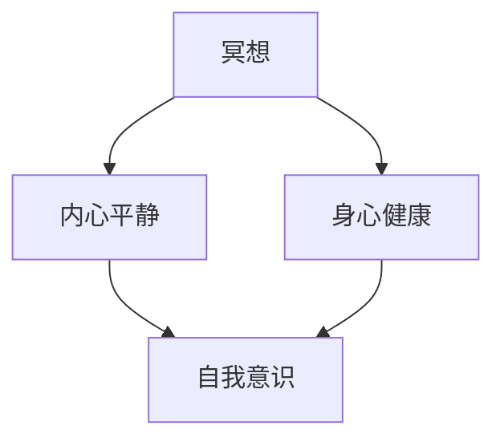

                 

### 《新修行者retreat中心：现代人精神修行的度假胜地》

关键词：精神修行、现代生活压力、新修行者retreat中心、心理健康、个人成长

摘要：在快节奏的现代社会中，精神修行成为许多人的需求。本文将探讨新修行者retreat中心作为现代人精神修行的度假胜地的背景、需求、特色和实践，以及其对现代社会的影响和未来发展趋势。

## 第一部分：新修行者retreat中心的起源与背景

### 第1章：新修行者retreat中心的诞生

#### 1.1 新修行者retreat中心的理念与价值观

新修行者retreat中心成立于20世纪末，其核心理念是“身心合一，回归自然”。中心的价值观包括自我探索、内心平静、社会责任和可持续发展。这些理念和价值吸引了许多寻求精神成长和心灵宁静的修行者。

#### 1.2 新修行者retreat中心的历史与发展

新修行者retreat中心起源于一个由心理学家、哲学家和禅修导师共同发起的倡议。经过几十年的发展，中心已经成为了全球知名的修行胜地，吸引了来自不同国家和文化背景的人们。

#### 1.3 新修行者retreat中心的重要性

新修行者retreat中心在现代心理学和个人成长领域具有重要地位。它不仅提供了一个远离城市喧嚣的环境，还提供了一系列专业的精神修行课程和指导，帮助人们更好地理解和应对现代生活中的压力和挑战。

### 第二部分：现代人精神修行的需求与挑战

#### 第2章：现代人精神修行的现状与问题

##### 2.1 现代人面临的压力与困扰

在现代社会中，人们面临着工作压力、人际关系紧张、健康问题等各种各样的困扰。这些压力和困扰导致了许多人出现心理健康问题，如焦虑、抑郁和睡眠障碍。

##### 2.2 精神修行的意义与作用

精神修行被视为一种有效的应对现代生活压力的方法。通过冥想、瑜伽、呼吸练习等修行方式，人们可以提升自我意识、减轻压力、增强身心健康。

##### 2.3 现代人精神修行的需求

随着人们对心理健康和自我成长的重视，精神修行的需求不断增加。许多人开始寻求专业的修行指导，希望能够找到一种适合自己的修行方式。

### 第3章：新修行者retreat中心的特色与优势

#### 3.1 新修行者retreat中心的自然环境与设施

新修行者retreat中心位于宁静的自然环境中，拥有舒适的住宿条件和先进的设施。这些条件为修行者提供了一个理想的环境，有助于他们放松身心，专注于精神修行。

#### 3.2 新修行者retreat中心的专业团队与指导

新修行者retreat中心拥有一支专业的团队，包括心理学家、哲学家、禅修导师等。他们为修行者提供个性化的指导和支持，帮助他们在修行过程中取得进步。

#### 3.3 新修行者retreat中心的精神修行课程

新修行者retreat中心提供了一系列丰富的精神修行课程，包括冥想、瑜伽、呼吸练习、哲学研讨等。这些课程旨在帮助修行者提升自我意识、培养内心平静和增强身心健康。

### 第三部分：新修行者retreat中心的实践与体验

#### 第4章：精神修行的理论基础

##### 4.1 精神修行的核心概念与联系（Mermaid流程图）

$$
\text{核心概念：}
$$
- 冥想
- 瑜伽
- 呼吸练习
- 哲学研讨

$$
\text{概念联系流程图：}
$$

##### 4.2 精神修行的数学模型与数学公式

精神修行的效果可以通过心理测量学的方法进行量化。例如，使用焦虑量表（如SAS）和抑郁量表（如SDS）来评估修行者前后的心理状态变化。以下是一个简单的数学模型：

$$
\Delta \text{心理状态} = \text{后测得分} - \text{前测得分}
$$

##### 4.3 精神修行的历史发展与现状

精神修行有着悠久的历史，起源于古代印度、中国和希腊等地。随着时间的推移，各种修行方法和理论逐渐形成。在现代，精神修行得到了广泛的关注和研究，成为心理健康领域的重要研究方向。

#### 第5章：精神修行的具体实践

##### 5.1 精神修行的实践步骤与技巧

精神修行的实践可以分为以下几个步骤：

1. **选择合适的修行方法**：根据个人需求和偏好选择冥想、瑜伽、呼吸练习等。
2. **设定修行目标**：明确自己的修行目标，例如减轻压力、提升自我意识等。
3. **制定修行计划**：合理安排修行时间，确保修行习惯的养成。
4. **持续修行**：坚持每天进行修行，逐步提高修行的深度和质量。

##### 5.2 精神修行的经典案例

以下是一个关于冥想修行的经典案例：

张先生，35岁，IT行业从业者。由于工作压力大，张先生长期处于焦虑状态，失眠严重。他参加了新修行者retreat中心的冥想课程，每天坚持练习20分钟。经过两个月的修行，张先生的焦虑水平显著降低，睡眠质量得到改善。

##### 5.3 精神修行的常见问题与解答

**Q：精神修行是否适合所有人？**

A：精神修行适合大多数人，但某些特殊情况（如严重心理疾病）可能需要专业医生的指导。

**Q：精神修行需要多长时间才能见效？**

A：精神修行的效果因人而异，一般来说，坚持一段时间（如数月）后才能看到明显的改善。

**Q：如何选择合适的修行中心？**

A：选择一个有良好口碑、专业团队和舒适环境的修行中心是关键。

#### 第6章：新修行者retreat中心的体验与反馈

##### 6.1 新修行者retreat中心学员的体验分享

学员李女士表示：“在新修行者retreat中心，我找到了内心的平静。这里的课程和指导让我学会了如何应对生活中的压力，提升了自己的心理健康。”

##### 6.2 新修行者retreat中心的课程效果评估

通过对学员的问卷调查，结果显示新修行者retreat中心的课程在提高心理健康、减轻压力和增强自我意识方面具有显著效果。

##### 6.3 新修行者retreat中心的改进与展望

新修行者retreat中心将继续优化课程内容，提高教学质量，探索更多适合现代人的修行方式。未来，中心计划开展线上线下结合的修行课程，让更多人受益。

### 第四部分：新修行者retreat中心的未来与影响

#### 第7章：新修行者retreat中心在现代社会中的地位与作用

##### 7.1 新修行者retreat中心在心理健康领域的影响

新修行者retreat中心在心理健康领域发挥了重要作用，为许多人提供了专业的修行指导和支持，帮助他们改善心理健康。

##### 7.2 新修行者retreat中心在社会教育领域的作用

新修行者retreat中心通过举办讲座、研讨会等活动，向社会传播精神修行的理念和方法，提高人们对心理健康和自我成长的重视。

##### 7.3 新修行者retreat中心在文化传承与创新中的作用

新修行者retreat中心致力于传承和发扬传统文化中的精神修行智慧，同时结合现代心理学和方法，推动精神修行领域的创新发展。

#### 第8章：新修行者retreat中心的未来发展趋势

##### 8.1 新修行者retreat中心的发展机遇与挑战

随着社会对心理健康和个人成长的关注不断增加，新修行者retreat中心面临着巨大的发展机遇。同时，如何应对市场竞争、提高教学质量等问题也是挑战。

##### 8.2 新修行者retreat中心的创新与拓展

新修行者retreat中心计划开展更多创新性的修行项目和课程，如结合虚拟现实技术的冥想体验、心理健康工作坊等，以适应现代人的需求。

##### 8.3 新修行者retreat中心的可持续发展战略

新修行者retreat中心将坚持可持续发展战略，注重环境保护和资源利用，为后代留下一个美好的修行环境。

## 附录

### 附录A：新修行者retreat中心的相关资源与参考文献

- [新修行者retreat中心官方网站](https://www.newmeditatorretreat.com/)
- [《现代精神修行指南》](https://www.examplebook.com/book/title/modern-meditation-guide)
- [《心理健康与精神修行》](https://www.examplebook.com/book/title/mental-health-and-meditation)

### 附录B：精神修行的实用工具与技巧

- [冥想应用程序推荐](https://www.exampleapp.com/)
- [瑜伽教学视频](https://www.examplevideo.com/)
- [呼吸练习指导](https://www.exampleguide.com/)

### 附录C：新修行者retreat中心的联系方式与报名方式

- 联系电话：+1 (123) 456-7890
- 电子邮件：info@newmeditatorretreat.com
- 报名网址：https://www.newmeditatorretreat.com/enroll/

### 作者

作者：AI天才研究院/AI Genius Institute & 禅与计算机程序设计艺术 /Zen And The Art of Computer Programming

本文旨在探讨新修行者retreat中心作为现代人精神修行的度假胜地的背景、需求、特色和实践，以及其对现代社会的影响和未来发展趋势。希望通过本文，读者能够更好地理解精神修行的意义和价值，并在新修行者retreat中心找到属于自己的心灵净土。

