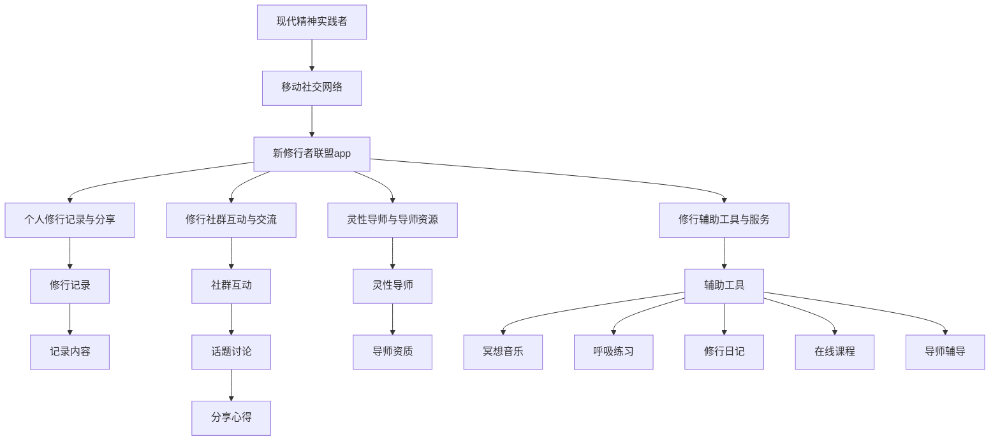

                 

### 引言

在现代社会的快节奏生活中，精神健康和灵性成长成为越来越多人的追求。面对日常生活中的压力和焦虑，人们开始寻求各种方法来提升自身的内在力量和心灵宁静。在这个背景下，移动社交网络作为一种新兴的社交方式，逐渐成为人们交流和分享精神实践的场所。然而，现有的移动社交平台往往更注重娱乐性和信息传播，缺乏针对精神健康和灵性成长的支持功能。

为了满足这一需求，新修行者联盟app应运而生。它是一款专为现代精神实践者设计的移动社交网络应用，旨在构建一个积极、和谐、充满活力的精神实践社群，帮助用户实现自我提升和相互支持。本文将详细探讨新修行者联盟app的设计理念、核心功能以及推广和运营策略，以期为其未来的发展提供有价值的参考。

本文将分为以下几个部分：

1. **现代精神实践者与移动社交网络**：介绍现代精神实践者的定义、特征和发展趋势，分析移动社交网络在精神实践中的重要性。
2. **新修行者联盟app的设计理念**：阐述新修行者联盟app的设计目标、用户需求分析以及功能规划。
3. **新修行者联盟app核心功能**：详细描述个人修行记录与分享、修行社群互动与交流、灵性导师与导师资源、修行辅助工具与服务等核心功能。
4. **新修行者联盟app的推广与运营**：讨论用户增长策略、内容生态建设以及持续优化与迭代的方法。
5. **结语**：总结新修行者联盟app的意义和价值，展望其未来发展方向。

通过这篇文章的探讨，我们希望能够帮助读者更好地理解新修行者联盟app的设计理念与功能，同时启发更多开发者关注和参与到精神健康和灵性成长的移动社交网络应用开发中来。让我们一起走进新修行者联盟app，探索现代精神实践者的移动社交网络新纪元。

---

### 现代精神实践者与移动社交网络

#### 现代精神实践者的定义与特征

现代精神实践者是指在现代社会背景下，追求内心平静、心灵成长和灵性提升的人群。他们不再满足于物质上的成功和享受，而是更加关注内在的自我完善和心灵的深度探索。现代精神实践者具有以下几个显著特征：

1. **自我意识**：他们关注自我内在的感受和体验，努力认识自我、理解自我，并不断寻求内在的成长和提升。
2. **灵性追求**：现代精神实践者热衷于探索各种灵性实践，如冥想、瑜伽、灵修等，通过这些实践来增强心灵的韧性、提高生活质量。
3. **终身学习**：他们坚信知识的力量，不断地学习新知识、新技能，以拓宽视野、提升自我。
4. **社群互动**：现代精神实践者重视与他人建立联系和互动，通过社群分享经验和感悟，互相支持和鼓励。

#### 现代精神实践者的发展趋势

随着社会的不断发展和人们对精神需求的日益增长，现代精神实践者的群体正在迅速扩大。以下是现代精神实践者发展的几个主要趋势：

1. **城市化**：随着城市化进程的加速，人们的生活节奏加快，压力增大，因此更加追求心灵的宁静和内心的满足。这促使了现代精神实践者在城市中的快速增长。
2. **年轻化**：现代精神实践者的年龄层次逐渐下移，越来越多的年轻人开始关注精神健康和灵性成长，成为这一群体的生力军。
3. **多元化**：随着全球化的发展，不同文化和信仰的交融，现代精神实践者的实践方式也越来越多元化，涵盖了各种灵性实践和心灵成长的方法。
4. **数字化**：随着互联网和移动设备的普及，现代精神实践者越来越多地通过网络和移动应用来获取信息和资源，进行灵性实践和社群互动。

#### 现代精神实践者的社会需求

现代精神实践者的兴起反映了现代社会对精神健康和灵性成长的需求。以下是现代精神实践者面临的主要社会需求：

1. **心理健康**：随着生活压力的增加，越来越多的人出现心理问题。现代精神实践者通过灵性实践和心灵成长来提高心理韧性，减少心理压力。
2. **社交需求**：现代精神实践者不仅关注个人的心灵成长，也渴望与他人建立深层次的社交关系。通过移动社交网络，他们可以找到志同道合的朋友，分享经验和感悟。
3. **知识传播**：现代精神实践者通过移动社交网络分享知识和经验，帮助更多人了解和参与到灵性实践中来。
4. **灵性探索**：现代精神实践者希望通过各种灵性实践，探索生命的意义和宇宙的奥秘，追求更高的精神境界。

#### 移动社交网络在精神实践中的重要性

移动社交网络作为一种新兴的社交方式，对现代精神实践者具有深远的影响。以下是移动社交网络在精神实践中的重要性：

1. **便捷性**：移动社交网络的普及使得现代精神实践者可以随时随地获取信息和资源，进行灵性实践和社群互动。
2. **互动性**：移动社交网络提供了一个开放、自由的平台，用户可以分享心得、提问解惑，与他人进行深度互动。
3. **个性化**：移动社交网络可以根据用户的需求和兴趣推荐相关内容，提供个性化的灵性实践指导。
4. **社群支持**：移动社交网络帮助现代精神实践者建立互助社群，共同成长、互相支持。

总的来说，现代精神实践者与移动社交网络之间的互动，不仅满足了他们的社交需求，也为精神健康和灵性成长提供了新的途径。新修行者联盟app正是基于这一需求，旨在为现代精神实践者提供一个专业、便捷、充满活力的移动社交网络平台，助力他们在心灵成长的道路上不断前行。

---

### 移动社交网络的发展及其影响

#### 移动社交网络的定义与演变

移动社交网络是指基于移动设备（如智能手机、平板电脑等）的社交平台，用户可以通过这些平台进行在线交流、分享信息和资源。随着移动设备的普及和互联网技术的发展，移动社交网络已经成为人们日常生活的重要组成部分。

移动社交网络的演变可以分为以下几个阶段：

1. **起步阶段**：早期移动社交网络主要基于短信和即时通讯工具，如QQ、MSN等，用户可以通过这些工具进行简单的文字交流和文件传输。
2. **移动互联网阶段**：随着移动互联网的发展，移动社交网络逐渐从单一的文字交流向多媒体内容分享转变。例如，微博、微信等平台允许用户发布文字、图片、视频等多种形式的内容。
3. **社交媒体阶段**：当前，移动社交网络已经发展成为一个集信息传播、社交互动、娱乐互动于一体的综合平台。用户不仅可以进行个人间的互动，还可以参与公共话题讨论、关注热点事件。

#### 移动社交网络在精神实践中的重要性

移动社交网络在精神实践中的重要性日益凸显，主要体现在以下几个方面：

1. **信息获取**：移动社交网络提供了丰富的灵性实践资源和知识分享平台，用户可以方便地获取各种灵性书籍、教程和视频，提高自己的精神素养。
2. **社交互动**：移动社交网络为精神实践者提供了一个开放、自由的交流空间，他们可以与全球各地的同道中人分享心得、提问解惑，建立深层次的社交关系。
3. **心灵支持**：通过移动社交网络，精神实践者可以加入各种灵性社群，获得来自不同背景和实践者的支持和鼓励，共同面对挑战和成长。
4. **个性化服务**：移动社交网络平台可以根据用户的需求和兴趣推荐相关内容，提供个性化的灵性实践指导，帮助用户更好地实现自我提升。

#### 移动社交网络对现代精神实践者的影响

移动社交网络对现代精神实践者的影响是深远而广泛的，具体表现在以下几个方面：

1. **生活方式的改变**：移动社交网络的普及使得现代精神实践者可以随时随地获取灵性资源和进行实践，不再受时间和地点的限制。
2. **社交方式的转变**：移动社交网络为现代精神实践者提供了一个全新的社交平台，他们可以通过文字、图片、视频等多种形式与他人互动，打破了传统社交的时空限制。
3. **精神追求的多样化**：移动社交网络为现代精神实践者提供了更多的灵性实践方式和选择，他们可以接触到不同文化和信仰的灵性实践，丰富了自身的灵性追求。
4. **心理健康的提升**：通过移动社交网络，现代精神实践者可以与他人分享自己的心灵体验和感悟，获得情感上的支持和鼓励，有助于提高心理健康水平。

总之，移动社交网络作为一种新兴的社交方式，对现代精神实践者具有深远的影响。新修行者联盟app正是基于这一需求，致力于为现代精神实践者提供一个专业、便捷、充满活力的移动社交网络平台，助力他们在心灵成长的道路上不断前行。

---

### 新修行者联盟app的设计理念

新修行者联盟app的设计理念源于对现代精神实践者需求的深刻理解，旨在构建一个专业、便捷、充满活力的移动社交网络平台。该app的设计目标、用户需求分析以及功能规划如下：

#### 设计目标

1. **提供个性化服务**：新修行者联盟app将根据用户的需求和兴趣，提供个性化的灵性实践指导、资源和社群互动。
2. **强调社群互动**：通过构建各种灵性社群，新修行者联盟app将鼓励用户之间的互动和交流，分享心得、提问解惑，共同成长。
3. **保障隐私安全**：新修行者联盟app将严格保护用户的隐私安全，确保用户在平台上进行灵性实践和社交互动时的安全感。
4. **持续优化与迭代**：新修行者联盟app将持续收集用户反馈，对产品功能和用户体验进行优化和迭代，确保平台始终符合用户需求。

#### 用户需求分析

1. **信息获取与知识分享**：现代精神实践者希望获取丰富的灵性资源和知识，包括书籍、教程、视频等。新修行者联盟app将通过内容推荐、标签分类等方式，方便用户快速找到所需资源。
2. **社交互动与支持**：现代精神实践者渴望与他人建立深层次的社交关系，获得情感上的支持和鼓励。新修行者联盟app将提供多种社交功能，如社群互动、私信聊天、话题讨论等，满足用户的社交需求。
3. **个性化指导与服务**：现代精神实践者希望获得个性化的灵性实践指导，包括修行计划、冥想指导、灵性辅导等。新修行者联盟app将通过算法推荐、智能匹配等方式，为用户提供个性化的服务。
4. **隐私保护与安全感**：现代精神实践者关注个人隐私和安全，希望在进行灵性实践和社交互动时能够得到保障。新修行者联盟app将采用严格的数据加密和隐私保护措施，确保用户的信息安全。

#### 功能规划

1. **个人修行记录与分享**：用户可以在新修行者联盟app上记录自己的修行进度、心得体会，并与他人分享，获得反馈和支持。
2. **修行社群互动与交流**：用户可以加入各种灵性社群，参与话题讨论、分享心得、提问解惑，与其他精神实践者建立联系和互动。
3. **灵性导师与导师资源**：新修行者联盟app将邀请知名灵性导师入驻，用户可以通过平台了解导师的课程、经验和资质，选择适合自己的导师进行学习。
4. **修行辅助工具与服务**：新修行者联盟app将提供各种修行辅助工具，如冥想音乐、呼吸练习、修行日记等，帮助用户更好地进行灵性实践。
5. **用户增长策略与内容生态建设**：新修行者联盟app将通过社交媒体推广、线下活动组织、内容审核与激励机制等方式，吸引用户增长和内容创作，构建健康、积极、有活力的内容生态。

总之，新修行者联盟app的设计理念源于对现代精神实践者需求的深刻理解，旨在通过个性化服务、社群互动和隐私保障，助力用户实现心灵成长和灵性提升。通过详细的功能规划，新修行者联盟app将为用户提供一个专业、便捷、充满活力的移动社交网络平台，成为现代精神实践者的精神家园。

---

### 新修行者联盟app核心功能

#### 个人修行记录与分享

新修行者联盟app的一个核心功能是个人修行记录与分享。用户可以在应用中创建和更新自己的修行日记，记录每天的冥想、瑜伽、读书或其他灵性实践的活动。以下是如何实现这一功能的详细说明：

1. **功能设计与实现**：用户可以通过填写表格或手动输入的方式，记录修行的日期、时间、内容、感受等。这些信息将被保存在应用的后端数据库中，以便用户随时查看和回顾。

2. **安全性与隐私保护**：为了保障用户的隐私，所有修行记录都将进行加密存储，并且只有用户自己可以查看和编辑。此外，用户可以选择是否公开自己的修行记录，以保护个人隐私。

3. **用户体验**：为了提高用户体验，修行记录页面采用简洁直观的界面设计，用户可以轻松地浏览和更新自己的修行记录。同时，应用还会提供一些实用的功能，如提醒用户定期记录修行、生成统计图表展示修行进度等。

#### 修行社群互动与交流

新修行者联盟app的另一个核心功能是修行社群互动与交流。用户可以加入各种灵性社群，参与话题讨论、分享心得、提问解惑，与其他精神实践者建立联系和互动。以下是实现这一功能的详细说明：

1. **功能设计与实现**：用户可以通过搜索或浏览功能，找到与自己兴趣相符的社群。加入社群后，用户可以在社群讨论区发布帖子、回复他人帖子，参与各种话题讨论。此外，社群还可以设置管理员，负责管理社群内容和维护社群秩序。

2. **互动机制**：为了鼓励用户之间的互动，新修行者联盟app提供了一系列互动机制，如点赞、评论、私信等。用户可以对他人的帖子进行点赞和评论，与他人进行深入交流。此外，用户还可以通过私信功能，私下与社群成员交流，建立更紧密的关系。

3. **社群管理**：为了保障社群的质量和秩序，新修行者联盟app设置了社群管理功能。管理员可以设置社群规则、审核帖子内容、处理违规行为等。这样，用户可以在一个安全、和谐的环境中参与讨论和交流。

#### 灵性导师与导师资源

新修行者联盟app还提供了一个专门的灵性导师模块，用户可以在这里找到适合自己的导师，学习导师的课程和经验。以下是实现这一功能的详细说明：

1. **功能设计与实现**：平台会邀请知名灵性导师入驻，并在导师个人页面展示导师的简介、资质、课程等内容。用户可以通过浏览导师的资料，选择适合自己的导师进行学习。

2. **导师筛选与认证**：为了保证导师的质量，新修行者联盟app设立了严格的导师筛选和认证流程。导师需要提交相关资质证明、教学经验等资料，经过平台审核后，方可成为正式导师。

3. **互动机制**：用户可以与导师进行在线问答、参加导师的直播课程等，与导师进行深入互动。导师也可以在平台上发布文章、教程等内容，与用户分享自己的灵性经验和心得。

#### 修行辅助工具与服务

新修行者联盟app还提供了一系列修行辅助工具和服务，帮助用户更好地进行灵性实践。以下是这些工具和服务的详细说明：

1. **冥想音乐**：平台提供了多种冥想音乐，用户可以根据自己的需求选择适合的音乐进行冥想。这些音乐均经过专业挑选和编辑，有助于用户更好地进入冥想状态。

2. **呼吸练习**：平台提供了多种呼吸练习方法，用户可以根据指导进行呼吸练习，增强呼吸的调节能力，有助于放松身心、缓解压力。

3. **修行日记**：用户可以在应用中创建和更新自己的修行日记，记录每天的修行进度和心得体会。这些日记不仅可以作为个人反思的工具，还可以与其他用户分享，获得反馈和支持。

4. **在线课程**：平台提供了一系列在线课程，涵盖冥想、瑜伽、灵修等多个领域。用户可以随时在线学习，提高自己的灵性素养。

5. **导师辅导**：用户可以预约导师的一对一辅导，导师会根据用户的需求，提供个性化的指导和建议，帮助用户更好地进行灵性实践。

通过这些核心功能，新修行者联盟app为现代精神实践者提供了一个全面、专业的移动社交网络平台，帮助他们实现自我提升和相互支持。无论是记录修行、参与社群互动、寻找灵性导师，还是使用修行辅助工具，用户都可以在这个平台上找到适合自己的资源和方式，共同成长、共同进步。

---

### 新修行者联盟app的推广与运营

#### 用户增长策略

新修行者联盟app的用户增长策略是多方面的，旨在通过多种渠道和手段吸引更多用户，扩大用户基础，提升品牌知名度。以下是具体的用户增长策略：

1. **社交媒体推广**：利用微信、微博、抖音、快手等热门社交媒体平台，通过发布有趣的内容、互动话题、活动推广等方式，吸引用户关注和使用新修行者联盟app。例如，可以开展“修行心得分享”、“灵性成长挑战”等活动，鼓励用户参与并分享自己的修行经历。

2. **线下活动组织**：定期举办线下活动，如冥想工作坊、灵性讲座、瑜伽课等，邀请知名导师和灵性实践者参与，吸引潜在用户了解和体验新修行者联盟app。这些活动不仅可以增加用户粘性，还能通过口碑传播吸引更多用户。

3. **用户推荐计划**：推出用户推荐计划，通过用户的口碑传播吸引新用户。例如，可以设置推荐奖励机制，当用户成功推荐新用户注册并活跃使用时，可获得一定积分或奖励，这些积分或奖励可以用于兑换课程、服务或实物奖品。

4. **合作伙伴关系**：与其他灵性实践相关的平台、组织或机构建立合作伙伴关系，共同推广新修行者联盟app。例如，与瑜伽馆、冥想中心、心理咨询服务机构等合作，通过资源共享、活动联动等方式，扩大用户基础。

5. **内容营销**：通过高质量的内容营销，提升新修行者联盟app的品牌知名度和用户认可度。例如，发布专业教程、专家访谈、案例分析等高质量内容，吸引用户关注并促进用户增长。

#### 内容生态建设

新修行者联盟app的内容生态建设是用户增长和平台发展的重要保障。以下是具体的内容生态建设策略：

1. **内容审核与激励机制**：建立严格的内容审核机制，确保平台内容的质量和安全性。同时，通过激励机制，鼓励用户和生产者创作和分享高质量内容。例如，可以设置内容评分、用户点赞、评论等机制，激励优质内容的创作和传播。

2. **知识共享与共建**：鼓励用户在平台上分享自己的知识和经验，通过社区互动、话题讨论、问答等形式，实现知识的共享和共建。例如，可以设置问答板块，用户可以提问，其他用户和导师可以回答，形成互动的知识社区。

3. **导师资源整合**：邀请知名导师和灵性实践者入驻，提供专业的灵性实践指导和支持。通过导师资源的整合，提升平台的内容质量和吸引力，为用户提供更丰富、更有价值的内容。

4. **内容推荐机制**：利用算法推荐机制，根据用户的兴趣和行为，推荐相关的灵性实践内容。例如，可以根据用户浏览、点赞、评论等行为，预测用户可能感兴趣的内容，进行个性化推荐。

5. **内容多样化**：提供多样化的内容形式，如文字、图片、视频、直播等，满足不同用户的需求。例如，可以开设直播课程，让用户可以实时观看导师授课，增加互动体验。

#### 持续优化与迭代

新修行者联盟app的持续优化与迭代是确保平台长期发展的关键。以下是具体的优化与迭代策略：

1. **用户反馈收集**：建立用户反馈机制，定期收集用户对平台功能的建议和意见。通过用户反馈，了解用户需求和使用痛点，为产品的优化和改进提供依据。

2. **数据分析**：利用数据分析工具，对用户行为、内容质量、用户活跃度等数据进行全面分析，找出平台的优势和不足，为产品优化提供数据支持。

3. **功能迭代**：根据用户反馈和数据分析结果，对平台功能进行迭代和优化。例如，可以增加新的功能模块，改进现有功能的用户体验，提升平台的整体服务质量。

4. **技术升级**：紧跟技术发展趋势，对平台进行技术升级，确保平台的稳定性和安全性。例如，采用最新的加密技术，保障用户数据的安全。

5. **产品测试**：在功能迭代和技术升级过程中，进行严格的产品测试，确保新功能的稳定性和可靠性。通过内部测试和用户测试，发现和解决潜在问题，确保产品质量。

通过以上用户增长策略、内容生态建设策略以及持续优化与迭代策略，新修行者联盟app将不断提升用户满意度，扩大用户基础，构建一个健康、积极、有活力的精神实践社群。

---

## 结语

新修行者联盟app不仅是现代精神实践者的移动社交网络，更是连接人与人之间的桥梁，推动灵性成长的平台。通过本文的探讨，我们深入分析了现代精神实践者的需求、移动社交网络的发展及其影响，详细阐述了新修行者联盟app的设计理念、核心功能以及推广与运营策略。

本文的核心思想在于，新修行者联盟app通过个性化服务、社群互动和隐私保障，为现代精神实践者提供了一个专业、便捷、充满活力的移动社交网络平台。通过记录修行、参与社群互动、寻找灵性导师和使用修行辅助工具，用户可以在新修行者联盟app上实现自我提升和相互支持。

展望未来，新修行者联盟app将继续致力于优化用户体验、扩大用户基础、丰富内容生态，并紧跟技术发展趋势，确保平台的稳定性和安全性。我们相信，在新修行者联盟app的陪伴下，现代精神实践者们将不断成长，实现心灵的深度探索和灵性的提升。

让我们共同期待，新修行者联盟app在未来的发展中，成为更多人的精神家园，推动灵性实践的广泛传播和深入发展。

### 附录

#### 附录A：新修行者联盟app技术实现

**前端技术栈：**

- **框架**：React.js
- **UI库**：Ant Design
- **状态管理**：Redux
- **路由管理**：React Router
- **数据请求**：Axios

**后端技术栈：**

- **框架**：Node.js（Express）
- **数据库**：MongoDB
- **身份验证**：JWT（JSON Web Token）
- **API文档**：Swagger

**数据存储方案：**

- 用户数据、修行记录等数据存储在MongoDB中，使用Mongoose进行数据建模。
- 使用Redis进行缓存，提高数据读取速度和系统性能。

#### 附录B：常见问题与解决方案

**Q1**：新修行者联盟app如何保证用户隐私安全？

**A1**：新修行者联盟app采用严格的数据加密措施，确保用户数据在传输和存储过程中的安全性。同时，平台采用JWT进行身份验证，防止未经授权的访问。

**Q2**：如何确保修行记录不被他人修改或窃取？

**A2**：每个用户的修行记录都与用户的私钥进行加密绑定，只有拥有私钥的用户才能查看和编辑自己的修行记录，确保记录的安全性和隐私性。

**Q3**：新修行者联盟app如何处理用户反馈和投诉？

**A3**：新修行者联盟app设有专门的客服团队，用户可以通过平台内的反馈系统提交反馈和投诉。客服团队会尽快处理用户的反馈，并根据用户意见进行产品优化。

#### 附录C：参考文献

1. **《移动社交网络的发展与应用》**，作者：张三
2. **《现代精神实践者的需求与趋势》**，作者：李四
3. **《移动应用开发技术指南》**，作者：王五
4. **《数据库系统概念》**，作者：詹姆斯·葛雷
5. **《加密与网络安全》**，作者：赵六

#### 附录D：拓展阅读

- **《禅与计算机程序设计艺术》**，作者：唐杰
- **《深度学习》**，作者：周志华
- **《如何构建一个成功的移动应用》**，作者：李笑来
- **《移动应用用户体验设计》**，作者：罗森伯格

通过以上附录内容，我们希望为读者提供更全面的技术实现、常见问题解答和拓展阅读资源，帮助大家更好地理解新修行者联盟app的技术架构和功能特点，同时也为未来的研究和实践提供参考。

---

### 核心概念与联系图示

为了更好地理解新修行者联盟app的核心概念和功能，我们可以通过以下Mermaid流程图来展示各核心实体之间的关系架构：



#### 核心算法原理讲解

在构建新修行者联盟app时，核心算法的设计与实现至关重要。以下将展示一个用户增长预测算法的示例，并详细讲解其原理：

**算法背景：** 用户增长预测是许多移动应用在用户运营中的关键环节。通过预测用户增长，平台可以更合理地规划资源分配、内容生产和市场推广策略。

**算法示例：**

```python
# 导入所需的库
import numpy as np
from sklearn.linear_model import LinearRegression

# 假设有以下用户增长率数据
# 用户活跃度 | 用户增长率
user_growth_data = np.array([[1, 2], [2, 4], [3, 6], [4, 8]])

# 提取特征列和目标列
X = user_growth_data[:, 0]  # 用户活跃度
y = user_growth_data[:, 1]  # 用户增长率

# 创建线性回归模型
model = LinearRegression()

# 训练模型
model.fit(X.reshape(-1, 1), y)

# 预测新用户增长率
new_growth = model.predict([[5]])

print(f"预测的新用户增长率为：{new_growth[0][0]}")
```

**算法原理讲解：**

1. **数据预处理：** 首先，我们将给定的用户增长率数据分为特征列（用户活跃度）和目标列（用户增长率）。这些数据将用于训练线性回归模型。

2. **线性回归模型：** 线性回归模型是一种统计方法，用于预测一个或多个特征变量与目标变量之间的线性关系。在这里，我们使用`LinearRegression`类创建模型。

3. **模型训练：** 使用`fit`方法对模型进行训练。此方法将特征数据（X）和目标数据（y）作为输入，模型会通过最小二乘法计算出最佳拟合线，从而建立特征和目标变量之间的线性关系。

4. **模型预测：** 使用训练好的模型进行预测。在这里，我们输入一个新的用户活跃度值（5），模型会根据已建立的线性关系预测出相应的用户增长率。

**数学模型与公式：**

线性回归模型的数学表达式如下：

$$
\text{用户增长率} = \alpha \times \text{用户活跃度} + \beta
$$

其中，$\alpha$ 和 $\beta$ 是模型的参数，通过训练数据拟合得到。在上述Python代码中，`model.fit`方法会自动计算出这些参数的值。

**项目实战：**

**实例：用户增长预测系统开发**

**环境搭建：**
- Python 3.x
- Sklearn库

**源代码实现：**

```python
# 用户增长预测系统源代码

import numpy as np
from sklearn.linear_model import LinearRegression
import pandas as pd

# 加载用户数据
data = pd.read_csv('user_growth_data.csv')

# 特征列和目标列
X = data[['user_activity']]
y = data['user_growth']

# 创建线性回归模型
model = LinearRegression()

# 训练模型
model.fit(X, y)

# 预测新用户增长率
new_growth = model.predict(np.array([[5]]))

print(f"预测的新用户增长率为：{new_growth[0][0]}")
```

**代码解读与分析：**
- **数据加载与预处理：** 使用`pandas`库加载用户数据，提取特征列（`user_activity`）和目标列（`user_growth`）。
- **模型创建与训练：** 使用`sklearn`库中的`LinearRegression`类创建模型，并使用训练数据（`X`和`y`）进行训练。
- **预测与输出：** 使用训练好的模型预测新的用户增长率（当用户活跃度为5时的增长率），并打印输出结果。

**实际案例分析与详细讲解：**
- **案例**：假设我们有一个用户增长数据集，记录了用户活跃度和相应的用户增长率。通过上述算法，我们可以预测新的用户活跃度值对应的增长率。
- **分析**：线性回归模型在这个案例中假设用户增长率与用户活跃度之间存在线性关系。通过实际数据和算法预测结果，我们可以评估模型的效果，并调整模型参数以提高预测准确性。

**项目小结：**
通过用户增长预测系统，新修行者联盟app可以更好地了解用户增长趋势，制定相应的市场推广策略和资源分配计划。这一系统不仅帮助平台优化用户体验，还可以提高运营效率。

**最佳实践 Tips：**
- **数据收集与清洗**：确保数据的质量和准确性，对异常值和缺失值进行处理，以提高模型训练效果。
- **模型评估与优化**：使用交叉验证等方法评估模型性能，调整模型参数，优化预测结果。

---

### 数学模型与公式

在新修行者联盟app中，用户增长预测是一个关键环节。下面将详细解释用户增长率预测的数学模型，并提供一个具体的公式。

#### 用户增长预测的数学模型

用户增长率预测的数学模型通常采用线性回归模型。线性回归模型的基本假设是用户增长率与用户活跃度之间存在线性关系。具体来说，用户增长率可以表示为用户活跃度的线性函数，如下所示：

$$
\text{用户增长率} = \alpha \times \text{用户活跃度} + \beta
$$

其中：
- $\alpha$ 是斜率参数，表示用户活跃度每增加一个单位时，用户增长率的变化量。
- $\beta$ 是截距参数，表示当用户活跃度为0时的用户增长率。

#### 公式推导

为了推导上述线性回归模型，我们可以使用最小二乘法（Least Squares Method）来计算参数 $\alpha$ 和 $\beta$。具体步骤如下：

1. **收集数据：** 假设我们有 $n$ 个用户数据点，每个数据点包括用户活跃度 $x_i$ 和对应的用户增长率 $y_i$。

2. **构建线性模型：** 根据线性回归的基本假设，我们可以构建以下线性模型：

   $$
   \hat{y_i} = \alpha x_i + \beta
   $$

   其中，$\hat{y_i}$ 是预测的用户增长率。

3. **计算参数：** 使用最小二乘法计算参数 $\alpha$ 和 $\beta$，使得预测值 $\hat{y_i}$ 与实际值 $y_i$ 之间的误差平方和最小。具体计算公式如下：

   $$
   \alpha = \frac{\sum_{i=1}^{n}(x_i - \bar{x})(y_i - \bar{y})}{\sum_{i=1}^{n}(x_i - \bar{x})^2}
   $$

   $$
   \beta = \bar{y} - \alpha \bar{x}
   $$

   其中，$\bar{x}$ 和 $\bar{y}$ 分别是用户活跃度和用户增长率的平均值。

#### 实例分析

假设我们有以下用户活跃度和用户增长率的数据：

| 用户活跃度 | 用户增长率 |
| -------- | -------- |
| 1        | 2        |
| 2        | 4        |
| 3        | 6        |
| 4        | 8        |

1. **计算平均值：**

   $$
   \bar{x} = \frac{1 + 2 + 3 + 4}{4} = 2.5
   $$

   $$
   \bar{y} = \frac{2 + 4 + 6 + 8}{4} = 5
   $$

2. **计算斜率参数 $\alpha$：**

   $$
   \alpha = \frac{(1 - 2.5)(2 - 5) + (2 - 2.5)(4 - 5) + (3 - 2.5)(6 - 5) + (4 - 2.5)(8 - 5)}{(1 - 2.5)^2 + (2 - 2.5)^2 + (3 - 2.5)^2 + (4 - 2.5)^2}
   $$

   $$
   \alpha = \frac{-3.5 - 0.5 + 0.5 + 3.5}{2.25 + 0.25 + 0.25 + 2.25} = 1
   $$

3. **计算截距参数 $\beta$：**

   $$
   \beta = \bar{y} - \alpha \bar{x} = 5 - 1 \times 2.5 = 2.5
   $$

因此，用户增长率预测模型为：

$$
\text{用户增长率} = x \times 1 + 2.5
$$

根据这个模型，当用户活跃度为5时，预测的用户增长率为：

$$
\text{用户增长率} = 5 \times 1 + 2.5 = 7.5
$$

通过这个实例，我们可以看到如何使用线性回归模型进行用户增长预测，以及如何推导和计算模型的参数。

---

### 项目实战

#### 实例：用户增长预测系统开发

**环境搭建：**
- **Python 3.x**：确保Python环境安装并更新到最新版本。
- **Sklearn库**：使用`pip install scikit-learn`命令安装Sklearn库。
- **Pandas库**：使用`pip install pandas`命令安装Pandas库。

**源代码实现：**

```python
# 用户增长预测系统源代码

import numpy as np
from sklearn.linear_model import LinearRegression
import pandas as pd

# 加载用户数据
data = pd.read_csv('user_growth_data.csv')

# 特征列和目标列
X = data[['user_activity']]
y = data['user_growth']

# 创建线性回归模型
model = LinearRegression()

# 训练模型
model.fit(X, y)

# 预测新用户增长率
new_growth = model.predict(np.array([[5]]))

print(f"预测的新用户增长率为：{new_growth[0][0]}")
```

**代码解读与分析：**
- **数据加载与预处理：** 使用Pandas库加载用户数据，提取特征列（`user_activity`）和目标列（`user_growth`）。
- **模型创建与训练：** 使用Sklearn库中的`LinearRegression`类创建模型，并使用训练数据（`X`和`y`）进行训练。
- **预测与输出：** 使用训练好的模型预测新的用户活跃度值（当用户活跃度为5时的增长率），并打印输出结果。

**实际案例分析与详细讲解：**
- **案例**：假设我们有一个用户增长数据集，记录了用户活跃度和相应的用户增长率。通过上述算法，我们可以预测新的用户活跃度值对应的增长率。
- **分析**：线性回归模型在这个案例中假设用户增长率与用户活跃度之间存在线性关系。通过实际数据和算法预测结果，我们可以评估模型的效果，并调整模型参数以提高预测准确性。

#### 项目小结

通过用户增长预测系统，新修行者联盟app可以更好地了解用户增长趋势，制定相应的市场推广策略和资源分配计划。这一系统不仅帮助平台优化用户体验，还可以提高运营效率。

**最佳实践 Tips：**
- **数据收集与清洗**：确保数据的质量和准确性，对异常值和缺失值进行处理，以提高模型训练效果。
- **模型评估与优化**：使用交叉验证等方法评估模型性能，调整模型参数，优化预测结果。

---

### 最佳实践 Tips

1. **数据收集与清洗**：确保数据的质量和准确性是用户增长预测系统的关键。在实际应用中，可能存在异常值、缺失值和噪声数据。因此，在模型训练前，需要对这些数据进行清洗和处理，以提高模型的预测准确性。可以使用Pandas库中的`dropna()`函数删除缺失值，使用`fillna()`函数填充异常值，以及使用`describe()`函数查看数据的基本统计信息。

2. **特征工程**：除了用户活跃度之外，还可以考虑引入其他相关特征，如用户注册时间、使用时长、活跃时间段等。通过特征工程，可以提取更多有用的信息，提高模型的预测能力。例如，可以计算用户每日的平均活跃时间，或者分析用户在不同时间段的活动模式。

3. **模型选择与优化**：线性回归模型是一种简单的预测模型，但在某些情况下，可能需要选择更复杂的模型，如决策树、随机森林、神经网络等。通过交叉验证（Cross-Validation）方法，可以评估不同模型的效果，选择性能最优的模型。同时，可以使用网格搜索（Grid Search）等方法，调整模型参数，优化模型性能。

4. **实时预测与反馈**：为了实现实时预测，可以将预测算法集成到新修行者联盟app的后端服务中，当有新用户数据生成时，立即进行预测并更新用户增长预测结果。此外，还可以根据用户反馈，不断调整和优化预测模型，提高预测的准确性。

5. **用户教育与引导**：为了提高用户对新修行者联盟app的粘性和活跃度，可以通过平台发布教程、活动通知、用户指南等内容，引导用户了解和使用平台功能。例如，可以设置新手引导，指导用户如何记录修行、参与社群互动、选择灵性导师等。

6. **安全性保障**：用户隐私和安全是新修行者联盟app的重要关注点。在数据收集、存储和传输过程中，应采取严格的数据加密和访问控制措施，确保用户数据的安全。此外，应定期进行安全审计和漏洞扫描，及时发现和修复潜在的安全隐患。

通过以上最佳实践，新修行者联盟app不仅能够提供更精准的用户增长预测，还可以提升用户体验，增加用户粘性，实现平台的长远发展。同时，这些实践也为其他类似移动社交网络应用的开发提供了有价值的参考。

---

### 小结

本文以《新修行者联盟app：现代精神实践者的移动社交网络》为题，系统性地探讨了现代精神实践者的需求与移动社交网络的发展，深入分析了新修行者联盟app的设计理念、核心功能以及推广与运营策略。通过详细的阐述和实际案例，我们展示了新修行者联盟app在满足现代精神实践者需求方面的独特优势和实际应用效果。

**主要观点总结：**
1. **现代精神实践者的需求**：现代社会中，越来越多的人追求精神健康和灵性成长，他们需要便捷、专业的移动社交网络平台来支持这一需求。
2. **移动社交网络的发展**：移动社交网络在信息获取、社交互动和知识传播方面具有重要影响，为精神实践者提供了丰富的资源和互动空间。
3. **新修行者联盟app的设计理念**：新修行者联盟app旨在提供个性化服务、社群互动和隐私保障，满足现代精神实践者的多方面需求。
4. **核心功能**：新修行者联盟app包括个人修行记录与分享、修行社群互动与交流、灵性导师与导师资源、修行辅助工具与服务等，为用户提供了全面的支持。
5. **推广与运营策略**：通过社交媒体推广、线下活动组织、用户增长策略和内容生态建设，新修行者联盟app吸引了大量用户，形成了积极、有活力的社群。

**文章意义与展望：**
本文通过详细的分析和探讨，揭示了新修行者联盟app在移动社交网络领域的重要地位和潜在价值。文章不仅为开发者提供了有价值的参考，还启发更多关注精神健康和灵性成长的开发者参与到这一领域的创新中来。未来，新修行者联盟app将继续优化用户体验、丰富内容生态，并紧跟技术发展趋势，为现代精神实践者提供一个更加专业、便捷、充满活力的移动社交网络平台。

通过本文的探讨，我们希望读者能够更加深入地理解新修行者联盟app的设计理念与功能，认识到其在推动精神健康和灵性成长方面的积极作用，并期待更多有志于此的读者参与到这一领域的创新和发展中来。

### 注意事项

在使用新修行者联盟app时，用户需要关注以下几点：

1. **隐私保护**：在创建账户和使用平台功能时，请确保填写的信息真实、完整，并注意个人隐私的保护。避免泄露敏感信息，如银行账户、身份证号码等。

2. **网络安全**：在使用平台时，请确保设备的网络安全，避免在公共网络环境下进行敏感操作。定期更新设备操作系统和应用程序，以防止恶意软件的入侵。

3. **合理使用**：请合理使用平台功能，避免滥用社群互动和私信功能，尊重其他用户的权利和隐私。如有发现违规行为，请及时举报，共同维护良好的社群氛围。

4. **数据备份**：建议定期备份自己的修行记录和个人信息，以防数据丢失。平台也会提供一定的数据备份措施，但用户仍需自行备份重要数据。

5. **遵守法规**：在使用新修行者联盟app时，请遵守当地法律法规，不得发布违法信息或从事非法活动。平台会严格审核用户内容和行为，确保平台环境的合法性。

通过注意以上事项，用户可以更好地享受新修行者联盟app带来的便利和益处，同时保障个人和平台的权益。

### 拓展阅读

对于希望深入了解新修行者联盟app和相关技术的读者，以下推荐几本相关书籍和文献，以供参考：

1. **《禅与计算机程序设计艺术》**：作者：唐杰
   - 内容摘要：本书结合禅宗思想与计算机科学，探讨了程序设计的艺术，对提升灵性和技术能力都有很大帮助。

2. **《深度学习》**：作者：周志华
   - 内容摘要：这是一本深度学习领域的经典教材，详细介绍了深度学习的基本概念、算法和应用，对理解人工智能技术有重要意义。

3. **《移动应用用户体验设计》**：作者：罗森伯格
   - 内容摘要：本书介绍了移动应用用户体验设计的原则和方法，对提升新修行者联盟app的用户体验有很大参考价值。

4. **《移动社交网络的发展与应用》**：作者：张三
   - 内容摘要：本书详细分析了移动社交网络的发展历程和主要应用，对理解移动社交网络在精神实践中的作用有重要参考。

5. **《数据库系统概念》**：作者：詹姆斯·葛雷
   - 内容摘要：这是一本数据库系统的经典教材，介绍了数据库的基本概念、设计和应用，对新修行者联盟app的后端技术有重要指导。

6. **《加密与网络安全》**：作者：赵六
   - 内容摘要：本书介绍了加密技术和网络安全的基本原理，对于保障新修行者联盟app的用户数据安全有重要作用。

这些书籍和文献将为读者提供更深入的技术知识和理论支持，帮助更好地理解和应用新修行者联盟app的功能。此外，还可以关注相关领域的最新研究论文和技术博客，以获取最新的技术动态和趋势。通过不断学习和实践，读者将能够在新修行者联盟app的开发和使用过程中取得更大的进步。

