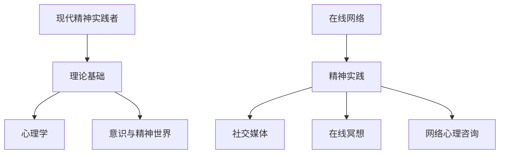

                 

### 《新修行者联盟：现代精神实践者的在线网络》

关键词：现代精神实践、在线网络、心理健康、社交媒体、社区建设、智能技术

摘要：随着互联网技术的快速发展，现代精神实践者逐渐将目光投向了在线网络这一新的领域。本文旨在探讨现代精神实践者如何在在线网络中开展活动，构建一个有益于个人成长和社会进步的修行社区。《新修行者联盟：现代精神实践者的在线网络》将详细介绍这一领域的发展背景、理论基础、核心原则、在线工具与技术、实际案例，以及新修行者联盟的实践与探索。通过本文，读者可以了解到现代精神实践者在互联网时代的新趋势、新机遇和新挑战。

# 《新修行者联盟：现代精神实践者的在线网络》目录大纲

## 第一部分：现代精神实践者的背景与理论基础

### 第1章：现代精神实践者的定义与演变
- **1.1 现代精神实践者的概念**
- **1.2 现代精神实践者的历史背景**
- **1.3 现代精神实践者与传统文化的关系**

### 第2章：现代精神实践者的理论基础
- **2.1 基本理论框架**
- **2.2 心理学与精神实践的交融**
- **2.3 人类意识与精神世界的探索**

### 第3章：现代精神实践者的核心原则
- **3.1 内在平和与自我认知**
- **3.2 爱与慈悲的力量**
- **3.3 勇气与变革**

## 第二部分：在线网络的现代精神实践

### 第4章：在线网络与精神实践的结合
- **4.1 在线网络的优势与挑战**
- **4.2 网络环境下的精神实践**
- **4.3 在线社区的构建与维护**

### 第5章：现代精神实践者的在线工具与技术
- **5.1 社交媒体与精神实践**
- **5.2 在线冥想与瑜伽**
- **5.3 网络心理咨询与支持**

### 第6章：在线精神实践的实际案例
- **6.1 成功案例分享**
- **6.2 挑战与解决方案**
- **6.3 未来趋势与展望**

## 第三部分：新修行者联盟：实践与探索

### 第7章：新修行者联盟的起源与发展
- **7.1 新修行者联盟的成立背景**
- **7.2 新修行者联盟的核心价值观**
- **7.3 新修行者联盟的组织架构**

### 第8章：新修行者联盟的核心活动
- **8.1 在线课程与研讨会**
- **8.2 实践工作坊与社交活动**
- **8.3 互助社区与支持网络**

### 第9章：新修行者联盟的成果与影响
- **9.1 成员成长与变化**
- **9.2 社会影响与评估**
- **9.3 持续发展策略**

## 第四部分：未来展望与挑战

### 第10章：未来发展的机遇与挑战
- **10.1 技术革新与精神实践**
- **10.2 社会变迁与精神需求**
- **10.3 在线网络与精神实践的未来**

### 第11章：总结与反思
- **11.1 主要内容回顾**
- **11.2 现代精神实践者的角色与责任**
- **11.3 对未来的展望**

## 附录

### 附录A：参考资料与推荐阅读
- **A.1 必读经典与文献**
- **A.2 实用工具与网站推荐**
- **A.3 深入阅读与扩展**

### 附录B：专业术语表
- **B.1 现代精神实践相关术语**
- **B.2 在线网络相关术语**

---

### Mermaid 流程图



### 核心算法原理讲解

```python
# Python代码示例：简单神经网络实现
import tensorflow as tf

# 定义输入和输出
inputs = tf.keras.layers.Input(shape=(784,), name='inputs')

# 创建神经网络层
dense = tf.keras.layers.Dense(units=64, activation='relu', name='dense')(inputs)

# 添加输出层
outputs = tf.keras.layers.Dense(units=10, activation='softmax', name='outputs')(dense)

# 创建模型
model = tf.keras.Model(inputs=inputs, outputs=outputs)

# 编译模型
model.compile(optimizer='adam', loss='categorical_crossentropy', metrics=['accuracy'])

# 打印模型结构
model.summary()
```

### 数学模型和数学公式详细讲解

```latex
\section{线性回归模型}

线性回归模型是机器学习中最基本的模型之一。其数学公式可以表示为：
$$ y = \beta_0 + \beta_1 \cdot x + \epsilon $$

其中，\( y \) 是预测值，\( x \) 是特征值，\( \beta_0 \) 和 \( \beta_1 \) 是模型参数，\( \epsilon \) 是误差项。
```

接下来，我们将详细探讨每个章节的内容，逐步构建起现代精神实践者在在线网络中的全面理解。让我们开始这次思想之旅，探索新的修行之道。

