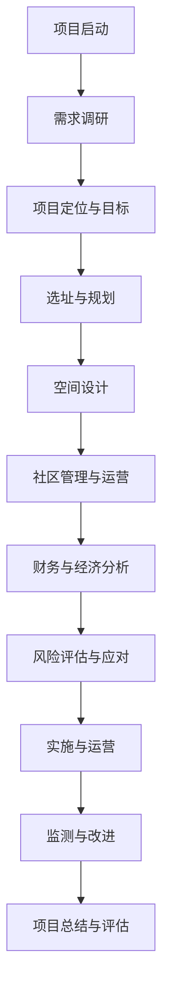

                 

# 《新共居项目设计工具包：重建社区联结的都市生活方式DIY指南》

## 关键词

- 共居项目
- 社区联结
- 都市生活方式
- 设计工具包
- DIY指南

## 摘要

本文旨在为读者提供一套系统化、实用的新共居项目设计工具包，帮助重建都市社区联结，实现更高质量的生活方式。通过深入探讨共居理念的起源、理论基础、项目规划、设计与实施、财务与经济分析、案例分析、设计工具与方法以及共居项目的文化与社会影响，本文为读者呈现了一个全面、易操作的共居项目构建指南。

---

# 《新共居项目设计工具包：重建社区联结的都市生活方式DIY指南》

## 目录大纲

### 第一部分：共居理念与理论基础

#### 第1章：共居运动与都市生活方式
- **1.1 共居运动的起源与发展**
- **1.2 都市生活方式的挑战**
- **1.3 共居理念的核心原则**
- **1.4 共居运动在都市社会中的意义**

#### 第2章：共居项目的规划与设计
- **2.1 共居项目规划**
- **2.2 共居空间设计**
- **2.3 社区管理与运营**
- **2.4 共居项目的设计原则**

### 第二部分：共居项目的实施与评估

#### 第3章：共居项目的财务与经济分析
- **3.1 项目成本分析**
- **3.2 项目收益分析**
- **3.3 风险评估与应对策略**

#### 第4章：共居项目的案例研究
- **4.1 国内外共居项目案例分析**
- **4.2 成功共居项目的关键要素**

### 第三部分：共居项目的设计工具与方法

#### 第5章：共居项目设计工具
- **5.1 空间规划工具**
- **5.2 社区参与工具**
- **5.3 经济评估工具**

#### 第6章：共居项目的文化与社会影响
- **6.1 社区凝聚力提升**
- **6.2 社区文化发展**
- **6.3 社区成员福利改善**

### 第四部分：共居项目的未来趋势与展望

#### 第7章：共居项目的未来发展
- **7.1 共居项目的发展趋势**
- **7.2 共居项目的未来展望**
- **7.3 共居项目的可持续发展路径**

### 附录

#### 附录A：共居项目设计参考资料
#### 附录B：共居项目设计流程图

---

## 第一部分：共居理念与理论基础

### 第1章：共居运动与都市生活方式

#### 1.1 共居运动的起源与发展

共居运动（Co-housing）起源于20世纪60年代的丹麦，是一种新型的社区生活方式，强调共同参与、共享资源和可持续发展的理念。共居社区通常由居民共同管理和运营，旨在创造一种紧密结合的社区生活，增强邻里之间的互动与联结。

在过去的几十年中，共居运动在全球范围内得到了快速发展。特别是在欧美国家，共居社区逐渐成为都市生活中的一部分。这一趋势不仅体现在住宅项目的开发中，还涉及到商业、办公和休闲等多种空间形式。

共居运动的起源可以追溯到丹麦社会学家雅各布·布隆德·拉斯玛森（Jacobs Brundtland）提出的“可持续居住”理念。他认为，现代城市面临着一系列问题，如交通拥堵、环境污染和社区联结减弱等。共居模式提供了一种可能的解决方案，通过强化居民之间的互动与合作，改善生活质量。

共居社区的核心特点包括：

1. **共同管理**：居民共同参与社区的管理和决策过程，确保社区运营的透明性和公正性。
2. **共享资源**：社区内设有共享设施，如花园、游乐场、健身房等，居民可以共同使用这些资源，降低生活成本。
3. **可持续性**：共居社区注重环境保护和资源节约，采用绿色建筑技术和可再生能源。
4. **社区联结**：共居社区鼓励居民之间的互动和合作，增强社区的凝聚力。

#### 1.2 都市生活方式的挑战

随着城市化进程的加速，都市生活方式面临着一系列挑战。首先，社区联结的减弱成为一个突出问题。在快节奏的都市生活中，人们往往忙于工作，忽视了与邻里之间的交流。这导致了社区凝聚力的下降，居民之间的隔阂感增加。

其次，生活质量的提升需求日益突出。都市居民对居住环境、生活设施和文化活动等方面有着更高的期望。然而，传统住宅项目往往难以满足这些需求，导致居民对社区的不满意。

最后，可持续发展的必要性日益凸显。随着全球气候变化和环境问题的加剧，都市生活方式的可持续性成为了一个重要议题。传统的单一家庭模式往往导致资源浪费和环境污染，而共居模式则提供了一种可能的解决方案。

#### 1.3 共居理念的核心原则

共居理念的核心原则主要包括以下几个方面：

1. **社区共享**：共居社区强调居民之间的资源共享，通过共享设施和服务，降低生活成本，提高生活质量。
2. **生态友好**：共居社区注重环境保护和资源节约，采用绿色建筑技术和可再生能源，实现可持续发展。
3. **创意活力**：共居社区鼓励居民参与社区管理和文化活动的策划，激发社区的创新活力和创造力。
4. **社区联结**：共居社区通过强化居民之间的互动和合作，增强社区的凝聚力，改善社区生活氛围。

这些原则共同构成了共居社区的基本框架，为都市生活方式的转型提供了新的思路和方向。

### 第2章：共居项目的规划与设计

#### 2.1 共居项目规划

共居项目的规划是确保项目成功实施的关键步骤。规划阶段需要明确项目的定位、目标、规模和选址等关键要素。

**2.1.1 项目定位与目标**

项目定位是确定共居社区在市场中的定位，包括目标客户群体、社区特色和核心竞争力等。目标则是指明项目要达到的具体目标和预期效果，如提高居民生活质量、增强社区凝聚力、实现可持续发展等。

**2.1.2 项目规模与选址**

项目规模包括住宅数量、建筑规模和占地面积等。选址则需考虑交通便利性、环境友好性和社区氛围等因素。理想选址应具备良好的自然环境、便捷的交通设施和丰富的社区资源。

**2.1.3 项目融资与投资回报**

项目融资是确保项目顺利实施的重要保障。融资方式包括自筹资金、银行贷款、政府补贴等。投资回报则是评估项目经济可行性的重要指标，包括收益来源、收益预测和投资回报期等。

#### 2.2 共居空间设计

共居空间设计是共居项目成功的关键。设计原则包括空间规划原则、功能区设计和绿色生态设计等。

**2.2.1 空间规划原则**

空间规划原则主要包括功能分区、动线设计和空间利用等。功能分区确保不同功能区之间相互独立又相互联系，动线设计则要考虑居民生活的便捷性和舒适性，空间利用则要最大化利用空间资源。

**2.2.2 功能区设计**

共居社区通常包括住宅区、公共活动区、休闲区、绿地等。住宅区要满足居民的隐私需求，公共活动区则要提供多样化的社交空间，休闲区则要为居民提供放松和娱乐的场所。

**2.2.3 绿色生态设计**

绿色生态设计是共居社区可持续发展的基础。设计过程中要考虑可再生能源利用、废水处理、垃圾分类和绿化等环保措施，实现社区的绿色生态。

#### 2.3 社区管理与运营

社区管理与运营是共居社区长期发展的关键。管理模式、组织架构和社区服务是社区管理的重要组成部分。

**2.3.1 管理模式与组织架构**

共居社区的管理模式通常采用居民自治模式，即居民共同参与社区管理和决策。组织架构则包括居民委员会、社区管理团队和第三方服务机构等。

**2.3.2 社区服务与活动**

社区服务与活动是增强社区联结的重要手段。社区服务包括物业维护、卫生清洁、安全保障等，社区活动则包括节日庆祝、文化沙龙、体育竞赛等。

**2.3.3 持续改进与反馈机制**

持续改进与反馈机制是确保社区长期发展的重要保障。通过定期评估和反馈，发现问题和不足，及时调整和改进，提高社区服务质量。

#### 2.4 共居项目的设计原则

共居项目的设计原则主要包括：

1. **以人为本**：设计要满足居民的需求，提高居民的生活质量。
2. **生态优先**：设计要注重环境保护和资源节约，实现可持续发展。
3. **共享共建**：设计要鼓励居民参与社区管理和文化建设，增强社区凝聚力。
4. **创新驱动**：设计要注重创新和创意，推动社区文化和社会发展。

这些原则共同构成了共居项目设计的核心框架，为共居社区的建设提供了指导。

## 第二部分：共居项目的实施与评估

### 第3章：共居项目的财务与经济分析

共居项目的成功不仅依赖于良好的规划和设计，还需要科学的财务与经济分析。本章将详细探讨共居项目的成本分析、收益分析以及风险评估与应对策略。

#### 3.1 项目成本分析

项目成本分析是共居项目财务评估的基础。项目成本主要包括以下几个方面：

1. **初期投资成本**：初期投资成本包括土地购置、建筑设计、施工建设、设施配置等。这些成本通常占据了项目总投资的较大比例。

2. **运营成本**：运营成本包括物业管理、设施维护、绿化养护、安全保障等。这些成本是项目长期运营中不可避免的支出。

3. **其他成本**：其他成本包括法律费用、咨询费用、广告宣传费用等。这些成本虽然相对较小，但也是项目成本的重要组成部分。

**3.1.1 初期投资成本**

初期投资成本是共居项目启动阶段的主要支出。具体包括：

- **土地购置**：土地购置成本取决于土地的市场价格和地理位置。共居项目通常选址在城市周边或交通便利的区域，以降低居民的生活成本。

- **建筑设计**：建筑设计费用取决于设计团队的资质和项目规模。优秀的设计方案能够提高项目的市场竞争力，增加收益。

- **施工建设**：施工建设费用包括建筑材料的采购、施工队伍的雇佣等。施工质量直接关系到项目的交付时间和质量。

- **设施配置**：设施配置费用包括公共设施、绿化、停车位等。这些设施是提高居民生活质量的重要因素。

**3.1.2 运营成本**

运营成本是共居项目长期运营的主要支出。具体包括：

- **物业管理**：物业管理费用包括物业人员的工资、设施维护费用等。良好的物业管理能够提升居民的生活质量和满意度。

- **设施维护**：设施维护费用包括公共设施、绿化、停车位等的日常维护和更新。设施维护的及时性和有效性直接关系到项目的运营效率。

- **绿化养护**：绿化养护费用包括绿化区域的日常养护、病虫害防治等。良好的绿化环境能够提升项目的生态价值。

- **安全保障**：安全保障费用包括安全人员的工资、安保设备的购置和维护等。安全保障是居民生活质量的重要保障。

**3.1.3 成本控制与优化策略**

为了确保共居项目的经济可行性，成本控制与优化策略至关重要。具体措施包括：

- **精细化成本管理**：通过精细化的成本核算和管理，降低不必要的支出，提高资源利用效率。

- **招标采购**：通过招标采购，选择性价比高的供应商，降低采购成本。

- **供应链管理**：建立有效的供应链管理体系，确保原材料和设施配置的及时供应，降低库存成本。

- **创新技术**：采用先进的施工技术和材料，提高建设效率和质量，降低建设成本。

#### 3.2 项目收益分析

项目收益分析是评估共居项目经济效益的重要环节。项目收益主要包括以下几个方面：

1. **租金收入**：租金收入是共居项目的主要收益来源。租金的定价取决于市场供需关系、项目定位和配套设施等因素。

2. **物业管理费**：物业管理费是居民为享受物业管理服务而支付的费用。物业管理费的定价取决于物业管理服务的质量和居民的满意度。

3. **设施使用费**：设施使用费是居民为使用公共设施而支付的费用。设施使用费的定价取决于设施的类型和居民的需求。

4. **其他收益**：其他收益包括广告收入、停车费、社区活动收入等。这些收益虽然相对较小，但也是项目收益的重要组成部分。

**3.2.1 收益来源与模式**

共居项目的收益来源和模式具有多样性。具体包括：

- **租金收入**：租金收入是共居项目的主要收益来源。租金的定价取决于市场供需关系、项目定位和配套设施等因素。通过合理的租金定价策略，可以最大化租金收入。

- **物业管理费**：物业管理费是居民为享受物业管理服务而支付的费用。物业管理费的定价取决于物业管理服务的质量和居民的满意度。通过提供优质的物业管理服务，可以提高物业管理费的收取率。

- **设施使用费**：设施使用费是居民为使用公共设施而支付的费用。设施使用费的定价取决于设施的类型和居民的需求。通过多样化的设施配置，可以吸引更多居民参与使用，提高设施使用费的收入。

- **其他收益**：其他收益包括广告收入、停车费、社区活动收入等。这些收益虽然相对较小，但也是项目收益的重要组成部分。通过合理规划和使用这些收益，可以增加项目的整体收益。

**3.2.2 收益预测与估值**

收益预测与估值是评估共居项目经济效益的重要环节。具体包括：

- **收益预测**：收益预测是指根据项目定位、市场供需关系、配套设施等因素，预测项目的未来收益。收益预测的准确性直接影响项目的经济可行性评估。

- **估值**：估值是指对项目的资产和收益进行评估，确定项目的价值。估值方法包括市场法、成本法、收益法等。通过科学合理的估值方法，可以确定项目的投资价值。

#### 3.3 风险评估与应对策略

共居项目面临多种风险，包括市场风险、政策风险、运营风险等。风险评估与应对策略是确保项目顺利实施和运营的重要保障。

**3.3.1 市场风险**

市场风险主要包括市场供需变化、竞争加剧、消费者需求变化等。应对策略包括：

- **市场调研**：通过市场调研，了解市场供需关系和消费者需求，制定合理的项目定位和定价策略。

- **差异化竞争**：通过提供独特的产品和服务，打造项目特色，提高市场竞争力。

- **市场拓展**：通过拓展市场渠道，扩大项目的影响力，提高市场份额。

**3.3.2 政策风险**

政策风险主要包括政策变化、法规调整等。应对策略包括：

- **政策跟踪**：密切关注政策变化，及时调整项目策略，确保项目合规。

- **法律咨询**：聘请专业的法律顾问，确保项目运营中的法律合规性。

- **政策参与**：积极参与政策制定和行业合作，争取政策支持和行业资源。

**3.3.3 运营风险**

运营风险主要包括运营管理、财务风险等。应对策略包括：

- **运营优化**：通过优化运营管理，提高项目效率和服务质量，降低运营成本。

- **风险管理**：建立完善的风险管理机制，及时识别和应对风险。

- **财务稳健**：保持财务稳健，确保项目运营的资金链不断裂。

#### 3.4 成本与收益分析的综合评估

成本与收益分析是评估共居项目经济效益的关键环节。通过综合评估成本与收益，可以确定项目的经济可行性。

- **成本效益分析**：通过比较项目成本和收益，评估项目的经济效益。

- **现金流量分析**：通过现金流量分析，评估项目的资金流入和流出，确保项目资金链的稳定。

- **投资回报率分析**：通过投资回报率分析，评估项目的投资收益情况。

通过综合评估，可以确定项目的经济可行性，为项目的投资决策提供科学依据。

### 第4章：共居项目的案例研究

#### 4.1 国内外共居项目案例分析

共居项目在全球范围内取得了显著的成功，不同国家和地区的共居项目各有特色。本节将介绍国内外共居项目的典型案例，分析其成功经验和挑战。

**4.1.1 国外共居项目的成功经验**

1. **丹麦比隆**：比隆共居社区是世界上最早的共居社区之一，成立于1972年。该社区拥有240套住宅、一系列共享设施和一个合作社商店。居民共同管理社区，参与决策，实现了高度的社区联结和可持续发展。

2. **瑞士卢塞恩**：卢塞恩共居社区建于1990年代，由约100个家庭组成。社区注重生态友好，采用可再生能源和绿色建筑技术。社区设有花园、儿童游乐场、健身房等共享设施，居民积极参与社区活动。

3. **美国波特兰**：波特兰共居社区建于2000年代初，是一个由80个家庭组成的混合收入社区。社区采用模块化住宅设计，实现了灵活的空间利用。社区设有共享厨房、花园和社区中心，居民共同管理社区事务。

**4.1.2 国内共居项目的现状与趋势**

1. **北京七彩云**：七彩云共居社区是北京的一个高端共居项目，成立于2010年。社区由120套住宅组成，设有共享花园、健身房、图书馆等设施。社区注重文化氛围，定期举办文化活动和社区论坛。

2. **上海杨浦阳光社区**：杨浦阳光社区是一个中低收入共居项目，成立于2005年。社区由约1000户居民组成，设有共享厨房、健身房、图书馆等设施。社区注重居民参与，建立了居民自治委员会，实现了有效的社区管理。

3. **深圳共筑未来**：共筑未来共居社区是深圳的一个混合收入共居项目，成立于2018年。社区由约200户居民组成，设有共享花园、健身房、会议室等设施。社区注重科技创新，采用智能家居系统和共享经济模式。

**4.1.3 案例比较与分析**

国内外共居项目在以下几个方面存在差异：

- **目标客户群体**：国外共居项目多面向中高收入人群，国内共居项目则兼顾中低收入人群。

- **管理模式**：国外共居项目多采用居民自治模式，国内共居项目则多采用专业管理公司运营。

- **设施配置**：国外共居项目设施配置更加丰富，国内共居项目则更注重实用性和舒适性。

- **社区文化**：国外共居项目强调社区联结和共享精神，国内共居项目则更注重文化氛围和社区活动。

通过对国内外共居项目的案例比较和分析，可以总结出共居项目成功的关键要素，为国内共居项目的发展提供借鉴。

#### 4.2 成功共居项目的关键要素

成功共居项目具有以下关键要素：

1. **政策支持**：政策支持是共居项目成功的重要保障。政府应在规划、审批、融资等方面提供支持，鼓励共居项目的发展。

2. **社区参与**：社区参与是共居项目成功的基础。居民应积极参与社区管理和决策，共同打造美好家园。

3. **设计创新**：设计创新是共居项目成功的关键。优秀的设计能够满足居民的需求，提高生活质量。

4. **运营管理**：运营管理是共居项目成功的重要环节。良好的运营管理能够提升社区服务质量，增强居民满意度。

通过上述关键要素的分析，可以更好地理解和把握共居项目的成功之道。

### 第5章：共居项目的设计工具与方法

共居项目的成功离不开科学的设计工具和方法。本章将介绍共居项目设计中的关键工具和方法，包括空间规划工具、社区参与工具和经济评估工具等。

#### 5.1 共居项目设计工具

共居项目设计工具是项目规划与实施的重要支持。以下是一些常用的共居项目设计工具：

1. **空间规划工具**：空间规划工具用于规划和设计共居社区的布局和功能分区。常用的空间规划工具有CAD（计算机辅助设计）、BIM（建筑信息模型）和GIS（地理信息系统）等。这些工具能够帮助设计师和工程师精确地模拟和调整社区空间，优化资源配置。

2. **社区参与工具**：社区参与工具用于促进居民参与共居项目的设计和决策过程。常用的社区参与工具包括问卷调查、小组讨论、头脑风暴和协作平台等。这些工具能够收集居民的意见和建议，确保项目设计符合居民需求。

3. **经济评估工具**：经济评估工具用于评估共居项目的经济效益和可行性。常用的经济评估工具有财务分析模型、现金流分析、投资回报率和风险评估模型等。这些工具能够帮助项目管理者评估项目的经济可行性，制定合理的投资决策。

#### 5.2 设计方法与创新

共居项目的设计方法包括以下几个方面：

1. **设计思维方法**：设计思维是一种以用户需求为中心的设计方法，强调用户调研、创意生成和原型测试等环节。通过设计思维方法，设计师能够更好地理解居民的需求，提出创新的设计方案。

2. **可持续设计原则**：可持续设计原则是共居项目设计的重要指导原则。可持续设计原则包括能源节约、资源循环利用、环境保护和生态友好等。通过实施可持续设计原则，共居项目能够降低环境影响，提高社区的可持续性。

3. **创新实践案例分析**：创新实践案例分析是通过研究国内外成功的共居项目案例，总结其设计方法和创新实践。通过案例分析，设计师能够借鉴成功经验，提高项目设计的创新性和实用性。

#### 5.3 设计方法与创新

以下是一个共居项目设计方法的创新案例：

**案例：深圳共筑未来共居社区**

深圳共筑未来共居社区采用了以下创新设计方法：

1. **模块化设计**：社区采用模块化设计，住宅单元可以根据居民需求进行灵活组合和调整。这种设计方法提高了空间的利用效率，满足了居民的个性化需求。

2. **共享厨房**：社区设有共享厨房，居民可以在共享厨房中烹饪和共享美食。共享厨房不仅提高了资源的利用效率，还增强了居民之间的互动和交流。

3. **绿色建筑技术**：社区采用绿色建筑技术，如太阳能热水系统、地源热泵和雨水收集系统等。这些绿色建筑技术降低了社区的能源消耗，实现了可持续发展。

通过上述创新设计方法，深圳共筑未来共居社区在提高居民生活质量、增强社区联结和实现可持续发展方面取得了显著成效。

### 第6章：共居项目的文化与社会影响

共居项目不仅是一种生活方式的变革，更是一种文化与社会的影响。本章将探讨共居项目对社区凝聚力、社区文化发展和社区成员福利改善的影响。

#### 6.1 社区凝聚力提升

社区凝聚力是共居项目成功的关键因素之一。共居社区通过共同管理、资源共享和社区活动，有效地提升了社区凝聚力。

1. **共同管理**：共居社区采用居民自治模式，居民共同参与社区管理和决策过程。这种模式增强了居民的参与感和归属感，提高了社区凝聚力。

2. **资源共享**：共居社区通过共享设施和资源，如共享厨房、花园和公共空间等，促进了居民之间的互动和交流。资源共享不仅降低了居民的生活成本，还增强了社区的凝聚力。

3. **社区活动**：共居社区定期举办各种社区活动，如节日庆祝、文化沙龙和体育竞赛等。这些活动为居民提供了交流和互动的机会，增强了社区的凝聚力。

#### 6.2 社区文化发展

社区文化是社区精神的体现，共居项目对社区文化的发展起到了积极的推动作用。

1. **文化氛围**：共居社区注重文化氛围的营造，通过设置图书馆、文化中心和艺术工作室等文化设施，为居民提供了丰富的文化活动空间。

2. **文化活动**：共居社区定期举办各种文化活动，如音乐会、艺术展览和社区电影节等。这些活动丰富了居民的文化生活，促进了社区文化的繁荣。

3. **文化传承**：共居社区鼓励居民传承和弘扬传统文化，通过举办传统节日庆祝活动和社区文化交流活动，增强了居民的文化认同感和归属感。

#### 6.3 社区成员福利改善

共居项目不仅提高了居民的生活质量，还改善了社区成员的福利。

1. **生活成本降低**：共居社区通过共享设施和资源，降低了居民的生活成本。居民可以通过共享厨房、健身房和公共空间等设施，节省开支。

2. **生活质量提高**：共居社区提供了丰富的社区服务和活动，如医疗保健、教育培训和家政服务等。这些服务提高了居民的生活质量，增强了居民的幸福感。

3. **就业机会增加**：共居社区提供了多种就业机会，如物业管理、社区服务和设施运营等。这些就业机会为居民提供了稳定的收入来源，改善了社区成员的福利。

通过上述措施，共居项目在提升社区凝聚力、促进社区文化发展和改善社区成员福利方面取得了显著成效。共居项目不仅为居民提供了更高质量的生活方式，也为社区的发展注入了新的活力。

### 第7章：共居项目的未来趋势与展望

随着城市化进程的加速和社会发展的需求，共居项目在未来的发展趋势和前景令人期待。本章将探讨共居项目的未来趋势、新型共居模式的探索以及共居与智慧城市的融合。

#### 7.1 共居项目的未来趋势

1. **技术创新的推动**：随着科技的进步，共居项目将更加注重智能化和数字化技术的应用。智能家居、物联网和大数据等技术将为共居社区提供更便捷、高效和个性化的服务。

2. **政策与市场机遇**：政府的政策支持和市场需求将为共居项目的发展提供有力保障。随着对可持续发展和社区联结的重视，共居项目将迎来更多的政策机遇和市场空间。

3. **社区需求的演变**：随着居民对生活品质和社区服务的需求不断提升，共居项目将更加注重个性化和多样化，以满足不同年龄段、不同职业背景的居民需求。

#### 7.2 新型共居模式的探索

1. **绿色共居**：绿色共居是未来共居项目的重要趋势，通过采用绿色建筑技术和可持续生活方式，实现社区的环保和生态友好。

2. **智慧共居**：智慧共居是利用智能化技术提高社区管理和服务的效率，如智能家居系统、智能停车和智能安防等。

3. **社区共享经济**：社区共享经济是共居项目的新模式，通过共享资源和服务，实现社区内外的资源共享和互利共赢。

#### 7.3 共居与智慧城市的融合

1. **智慧城市基础设施建设**：共居项目可以与智慧城市基础设施建设相结合，通过智能化技术和数据共享，实现社区与城市的互联互通。

2. **智慧社区服务**：共居项目可以提供智慧社区服务，如在线医疗、在线教育、在线购物等，提高居民的生活便利性和舒适度。

3. **智慧社区管理**：共居项目可以采用智慧化管理模式，通过数据分析和管理系统，提高社区管理的效率和质量。

共居项目的未来发展充满了无限可能性。通过技术创新、政策支持和市场需求，共居项目将在未来的城市化进程中发挥重要作用，为居民提供更高质量、更可持续的生活方式。

### 附录

#### 附录A：共居项目设计参考资料

1. **标准与规范**：
   - 《住宅建筑规范》（GB 50096-2011）
   - 《绿色建筑评价标准》（GB/T 50378-2019）

2. **设计工具推荐**：
   - CAD（计算机辅助设计）
   - BIM（建筑信息模型）
   - GIS（地理信息系统）

3. **案例资料来源**：
   - 丹麦比隆共居社区：https://www.colintoncohousing.org.uk/
   - 瑞士卢塞恩共居社区：https://www.cohousing-luzern.ch/
   - 美国波特兰共居社区：https://www.portlandcohousing.org/

#### 附录B：共居项目设计流程图

---

### 作者信息

作者：AI天才研究院/AI Genius Institute & 禅与计算机程序设计艺术 /Zen And The Art of Computer Programming

