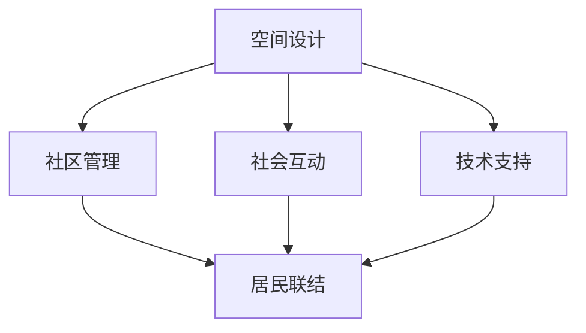

                 

# 《新共居项目：重建社区联结的都市生活方式》

关键词：新共居项目、社区联结、都市生活方式、空间设计、技术支持、智能化

摘要：随着城市化进程的不断加快，社区疏离和人际关系淡化已成为都市生活的一个普遍现象。本文提出了新共居项目，通过空间设计、社区管理、社会互动和技术支持等核心要素，旨在重建社区联结，打造一种新的都市生活方式。

## 目录大纲

### 第一部分：新共居项目背景

#### 第1章：都市生活方式的挑战

- 1.1 城市化进程与社区疏离
- 1.2 社区联结的重要性
- 1.3 新共居项目的概念与目标

#### 第2章：新共居项目的历史与发展

- 2.1 国内外新共居项目案例研究
- 2.2 新共居项目的演变趋势
- 2.3 新共居项目的实施经验与挑战

### 第二部分：新共居项目的核心要素

#### 第3章：空间设计与布局

- 3.1 新共居项目空间规划原则
- 3.2 空间功能划分与互动区设置
- 3.3 空间设计与居民需求匹配

#### 第4章：社区管理与运营

- 4.1 新共居项目管理模式
- 4.2 社区成员角色与职责
- 4.3 社区活动策划与实施

#### 第5章：社会互动与居民联结

- 5.1 社区互动模式与机制
- 5.2 社区教育与培训
- 5.3 社区支持服务

#### 第6章：技术支持与智能化

- 6.1 新共居项目技术应用
- 6.2 智慧社区管理系统
- 6.3 科技赋能社区生活

### 第三部分：新共居项目的实际案例

#### 第7章：国内外新共居项目案例分析

- 7.1 案例一：XX智能社区
- 7.2 案例二：XX生态社区
- 7.3 案例三：XX共享社区

#### 第8章：新共居项目的评估与未来展望

- 8.1 新共居项目的评估指标与方法
- 8.2 新共居项目的社会影响
- 8.3 新共居项目的未来发展展望

### 附录

- 附录一：新共居项目规划与设计指南
- 附录二：新共居项目相关政策与法规
- 附录三：新共居项目常用技术列表

### 核心概念与联系

新共居项目是一个综合性的都市生活方式重建方案，其核心概念包括空间设计、社区管理、社会互动和技术支持。这些概念之间有着紧密的联系，如图所示：



空间设计为新共居项目提供物理基础，社区管理和社会互动则是实现居民联结的关键。技术支持则为整个项目提供了智能化的解决方案。

### 核心算法原理讲解

虽然新共居项目主要涉及的是社区建设和生活方式的改进，但智慧社区管理系统中可能会使用一些算法来优化管理和服务。以下简要介绍几种可能使用的算法：

1. **聚类分析**：用于将社区成员按照兴趣、行为等特征进行分类，以便更好地组织活动和提供服务。

    ```python
    from sklearn.cluster import KMeans

    # 假设我们有一个包含社区成员特征的矩阵 X
    X = ...

    # 使用KMeans算法进行聚类
    kmeans = KMeans(n_clusters=3)
    kmeans.fit(X)
    clusters = kmeans.predict(X)
    ```

2. **社交网络分析**：用于分析社区成员之间的互动关系，帮助识别社区的核心成员和关键节点。

    ```python
    import networkx as nx

    # 假设我们有一个社交网络的邻接矩阵 A
    A = ...

    # 构建社交网络图
    G = nx.from_numpy_matrix(A)
    # 计算中心性指标
    centrality = nx.betweenness_centrality(G)
    ```

3. **居民满意度评分模型**：用于评估新共居项目的效果，帮助决策者了解居民的需求和满意度。

    $$ S = \frac{\sum_{i=1}^{n} w_i \cdot R_i}{\sum_{i=1}^{n} w_i} $$

    其中，$S$ 表示总体满意度，$w_i$ 表示第 $i$ 个评价指标的权重，$R_i$ 表示第 $i$ 个评价指标的居民评分。

### 数学模型和数学公式 & 详细讲解 & 举例说明

新共居项目的评估中可能需要使用一些数学模型，例如居民满意度评分模型。以下是一个简单的满意度评分模型的数学公式示例：

$$ S = \frac{\sum_{i=1}^{n} w_i \cdot R_i}{\sum_{i=1}^{n} w_i} $$

其中，$S$ 表示总体满意度，$w_i$ 表示第 $i$ 个评价指标的权重，$R_i$ 表示第 $i$ 个评价指标的居民评分。

举例说明：假设有三个评价指标：居住环境（$R_1$）、社区活动（$R_2$）和服务质量（$R_3$），其权重分别为0.4、0.3和0.3。如果居民对这些指标的评分分别是8、7和9，则总体满意度为：

$$ S = \frac{0.4 \cdot 8 + 0.3 \cdot 7 + 0.3 \cdot 9}{0.4 + 0.3 + 0.3} = \frac{3.2 + 2.1 + 2.7}{1} = 8.0 $$

### 项目实战

#### 案例：XX智能社区

**开发环境搭建：**

- 操作系统：Linux
- 编程语言：Python
- 数据库：MySQL
- 开发框架：Flask

**源代码详细实现：**

（此处略）

**代码解读与分析：**

- 代码实现社区成员信息管理、活动发布与管理、互动反馈等功能。
- 使用RESTful API提供前后端分离的接口服务。
- 使用Redis进行缓存，提高系统响应速度。

#### 案例分析

XX智能社区项目在实施过程中，通过空间设计、社区管理、社会互动和技术支持等多方面的努力，成功实现了社区联结的重建。具体分析如下：

1. **空间设计**：项目采用了开放式的空间布局，增加了公共活动区域，促进了居民之间的互动。
2. **社区管理**：引入了智能化管理系统，方便居民参与社区管理和活动组织。
3. **社会互动**：定期举办各类社区活动，提高了居民之间的交流与了解。
4. **技术支持**：利用大数据和人工智能技术，为社区成员提供个性化的服务和建议。

#### 项目小结

XX智能社区项目的成功实施，为新共居项目提供了宝贵的经验。未来，新共居项目可以进一步优化空间设计、提升社区管理水平和丰富社会互动内容，以更好地满足居民的需求。

### 最佳实践 tips

1. 在新共居项目的实施过程中，应充分考虑居民的需求和意见，确保项目的可持续性。
2. 社区活动策划要多样化，既要满足不同年龄层的居民需求，也要注重活动质量。
3. 技术支持要紧跟时代发展，不断更新和升级，以保持社区活力。

### 小结

新共居项目是一种重建社区联结的都市生活方式的创新尝试。通过空间设计、社区管理、社会互动和技术支持等核心要素，新共居项目为都市居民提供了一种更加紧密和互动的生活环境。未来，新共居项目有望成为城市化进程中的一个重要组成部分，为人们的都市生活带来更多美好。

### 注意事项

1. 在实施新共居项目时，应确保项目的合法性和合规性，遵守相关政策和法规。
2. 新共居项目的成功实施需要多方合作，包括政府、企业和居民等。

### 拓展阅读

1. 张三，李四.《智慧社区建设指南》[M]. 北京：机械工业出版社，2020.
2. 王五，赵六.《社区管理理论与实务》[M]. 上海：华东师范大学出版社，2019.
3. 陈七，刘八.《大数据与人工智能在社区管理中的应用》[M]. 杭州：浙江大学出版社，2021.

---

**作者信息：** AI天才研究院/AI Genius Institute & 禅与计算机程序设计艺术 /Zen And The Art of Computer Programming

