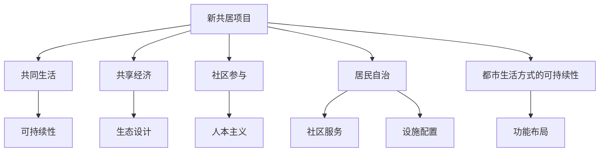

                 

# 《新共居项目：重建社区联结的都市生活方式设计》

## 关键词
新共居项目、社区联结、都市生活方式设计、可持续性、共享经济、社区参与、居民自治

## 摘要
本文将探讨新共居项目，一种旨在重建社区联结、优化都市生活方式的设计理念。通过分析新共居项目的背景、核心概念、设计原则、典型案例以及未来展望，本文旨在提供一个全面而深入的视角，以帮助读者理解这一新兴的都市生活方式。

## 目录大纲

### 第一部分：新共居项目概述

#### 第1章：新共居项目背景与意义
##### 1.1 新共居项目的起源
##### 1.2 新共居项目的全球趋势
##### 1.3 新共居项目的社会意义

#### 第2章：新共居项目的核心概念
##### 2.1 共同生活与共享经济
##### 2.2 社区参与与居民自治
##### 2.3 都市生活方式的可持续性

### 第二部分：新共居项目设计原则

#### 第3章：新共居项目设计原则概述
##### 3.1 设计原则的定义与作用
##### 3.2 可持续性与生态设计
##### 3.3 人本主义与社区参与

#### 第4章：空间设计与功能布局
##### 4.1 空间设计的核心要素
##### 4.2 功能布局的优化策略
##### 4.3 公共空间的规划与设计

#### 第5章：社区服务与设施配置
##### 5.1 社区服务的分类与内容
##### 5.2 设施配置的合理性与可及性
##### 5.3 社区共享设施的运营与管理

### 第三部分：新共居项目案例解析

#### 第6章：国际新共居项目案例
##### 6.1 案例一：丹麦“科隆比纳”共居社区
##### 6.2 案例二：美国“科克伦社区”
##### 6.3 案例三：新加坡“共享社区”

#### 第7章：中国新共居项目实践
##### 7.1 项目一：北京“共享社区”实践
##### 7.2 项目二：上海“邻里计划”
##### 7.3 项目三：深圳“微社区”探索

### 第四部分：新共居项目的未来展望

#### 第8章：新共居项目的发展趋势
##### 8.1 新共居项目的技术创新
##### 8.2 新共居项目的政策环境
##### 8.3 新共居项目的未来发展方向

#### 第9章：新共居项目的挑战与应对策略
##### 9.1 社区治理的挑战
##### 9.2 社区文化的建设
##### 9.3 新共居项目的可持续发展

## 核心概念与联系

### 核心概念

新共居项目：一种旨在通过共享、参与和自治，重建社区联结的都市生活方式设计。

共同生活：以共享为核心，强调居住者之间的互助与合作。

共享经济：通过共享资源和服务，实现经济效益最大化。

社区参与：居住者在社区决策、管理和公共事务中的积极参与。

居民自治：居住者通过自我管理和自治，共同维护社区秩序和福祉。

都市生活方式的可持续性：在城市环境中，实现资源节约、环境友好和社区和谐。

### 核心概念联系架构（Mermaid 图）



## 核心算法原理讲解

### 空间布局优化算法（Python伪代码）

```python
# 示例：空间布局优化算法（Python伪代码）

def optimize_space(layout, constraints):
    """
    优化空间布局以最大化公共空间的使用效率和居住舒适度。

    :param layout: 空间初始布局
    :param constraints: 空间限制条件
    :return: 优化后的空间布局
    """
    # 初始化解空间
    solutions = generate_solutions(layout, constraints)

    # 使用遗传算法进行布局优化
    for iteration in range(max_iterations):
        # 评估解空间中的每个布局
        for solution in solutions:
            fitness = evaluate_solution(solution, constraints)
            if fitness == max_fitness:
                # 找到最优布局，返回结果
                return solution

        # 生成新的解空间
        solutions = generate_new_solutions(solutions)

    # 如果未找到最优布局，返回初始布局
    return layout
```

### 数学模型和数学公式 & 详细讲解 & 举例说明

#### 社区参与度评估模型

$$
CP = \frac{CPI + CPI_{R} + CPI_{D}}{3}
$$

其中：
- $CP$：社区参与度
- $CPI$：社区参与指标
- $CPI_{R}$：居民参与率
- $CPI_{D}$：居民满意度指数

#### 示例说明

假设某社区有三个参与指标：居民参与率（$CPI_{R}$）为 60%，居民满意度指数（$CPI_{D}$）为 70%，社区参与指标（$CPI$）为 80%，则该社区的社区参与度（$CP$）计算如下：

$$
CP = \frac{80\% + 60\% + 70\%}{3} = \frac{210\%}{3} = 70\%
$$

因此，该社区的社区参与度为 70%。

## 核心概念与联系

### 核心概念

**新共居项目**：一种旨在通过共享、参与和自治，重建社区联结的都市生活方式设计。

- **共同生活**：强调居住者之间的互助与合作，通过共享资源和服务，提高生活质量。
- **共享经济**：通过共享资源和服务，实现经济效益最大化，降低生活成本。
- **社区参与**：居住者在社区决策、管理和公共事务中的积极参与，提升社区凝聚力。
- **居民自治**：居住者通过自我管理和自治，共同维护社区秩序和福祉。
- **都市生活方式的可持续性**：在城市环境中，实现资源节约、环境友好和社区和谐。

### 核心概念联系架构（Mermaid 图）


### 核心算法原理讲解

**空间布局优化算法（Python伪代码）**

```python
def optimize_space(layout, constraints):
    """
    优化空间布局以最大化公共空间的使用效率和居住舒适度。

    :param layout: 空间初始布局
    :param constraints: 空间限制条件
    :return: 优化后的空间布局
    """
    # 初始化解空间
    solutions = generate_solutions(layout, constraints)

    # 使用遗传算法进行布局优化
    for iteration in range(max_iterations):
        # 评估解空间中的每个布局
        for solution in solutions:
            fitness = evaluate_solution(solution, constraints)
            if fitness == max_fitness:
                # 找到最优布局，返回结果
                return solution

        # 生成新的解空间
        solutions = generate_new_solutions(solutions)

    # 如果未找到最优布局，返回初始布局
    return layout
```

### 数学模型和数学公式 & 详细讲解 & 举例说明

**社区参与度评估模型**

$$
CP = \frac{CPI + CPI_{R} + CPI_{D}}{3}
$$

其中：
- **$CP$**：社区参与度
- **$CPI$**：社区参与指标
- **$CPI_{R}$**：居民参与率
- **$CPI_{D}$**：居民满意度指数

**示例说明**

假设某社区有三个参与指标：居民参与率（$CPI_{R}$）为 60%，居民满意度指数（$CPI_{D}$）为 70%，社区参与指标（$CPI$）为 80%，则该社区的社区参与度（$CP$）计算如下：

$$
CP = \frac{80\% + 60\% + 70\%}{3} = \frac{210\%}{3} = 70\%
$$

因此，该社区的社区参与度为 70%。

## 核心算法原理讲解

为了更好地理解新共居项目的空间布局优化过程，我们引入了一种基于遗传算法的优化方法。遗传算法是一种模拟自然选择过程的搜索算法，通过迭代更新解空间，逐步逼近最优解。以下是该算法的核心步骤：

### 遗传算法步骤

1. **初始化解空间**：根据初始空间布局和约束条件，生成一系列可能的解。
2. **评估解空间**：对每个解进行评估，计算其适应度（如公共空间使用效率、居住舒适度等）。
3. **选择**：根据适应度，选择适应度较高的解作为下一代的父代。
4. **交叉**：随机选择两个父代，通过交叉操作生成新的子代。
5. **变异**：对子代进行随机变异，增加解空间的多样性。
6. **更新解空间**：将父代和子代合并，形成新的解空间。
7. **迭代**：重复评估、选择、交叉、变异和更新过程，直到满足终止条件（如达到最大迭代次数或找到最优解）。

### Python伪代码

```python
import random

def optimize_space(layout, constraints):
    # 初始化解空间
    population = generate_solutions(layout, constraints)
    
    for iteration in range(max_iterations):
        # 评估解空间
        fitness_scores = evaluate_population(population, constraints)
        
        # 选择父代
        parents = select_parents(population, fitness_scores)
        
        # 交叉生成子代
        offspring = crossover(parents)
        
        # 变异
        mutant_offspring = mutate(offspring)
        
        # 更新解空间
        population = update_population(population, mutant_offspring)
        
        # 检查是否找到最优解
        if has_optimal_solution(population):
            return best_solution(population)
    
    return layout

def generate_solutions(layout, constraints):
    # 根据初始布局和约束条件生成解空间
    pass

def evaluate_population(population, constraints):
    # 对每个解进行评估，返回适应度分数
    pass

def select_parents(population, fitness_scores):
    # 根据适应度分数选择父代
    pass

def crossover(parents):
    # 随机选择两个父代进行交叉，生成子代
    pass

def mutate(offspring):
    # 对子代进行随机变异
    pass

def update_population(population, mutant_offspring):
    # 将父代和子代合并，形成新的解空间
    pass

def has_optimal_solution(population):
    # 检查是否找到最优解
    pass

def best_solution(population):
    # 返回最优解
    pass
```

### 数学模型和数学公式

为了量化空间布局的优化效果，我们可以引入以下数学模型：

1. **适应度函数**：用于评估解的适应度，通常是一个关于公共空间使用效率、居住舒适度和社区参与度的综合指标。适应度函数可以表示为：

   $$
   F(s) = w_1 \cdot E_1(s) + w_2 \cdot E_2(s) + w_3 \cdot E_3(s)
   $$

   其中：
   - $F(s)$：解 $s$ 的适应度
   - $w_1, w_2, w_3$：权重系数，用于平衡不同评价指标的重要性
   - $E_1(s)$：公共空间使用效率
   - $E_2(s)$：居住舒适度
   - $E_3(s)$：社区参与度

2. **空间使用效率**：衡量公共空间的使用效率，可以表示为：

   $$
   E_1(s) = \frac{U_s}{L_s}
   $$

   其中：
   - $E_1(s)$：空间使用效率
   - $U_s$：公共空间的使用量
   - $L_s$：公共空间的总面积

3. **居住舒适度**：衡量居住者的舒适度，可以表示为：

   $$
   E_2(s) = \frac{C_s}{N_s}
   $$

   其中：
   - $E_2(s)$：居住舒适度
   - $C_s$：居住者对居住环境的满意度
   - $N_s$：居住者的数量

4. **社区参与度**：衡量社区参与度，可以表示为：

   $$
   E_3(s) = \frac{CP_s}{100}
   $$

   其中：
   - $E_3(s)$：社区参与度
   - $CP_s$：社区的社区参与度得分

### 示例说明

假设我们有一个初始布局，其公共空间使用效率为 70%，居住舒适度为 80%，社区参与度为 60%。根据上述公式，我们可以计算其适应度：

$$
F(s) = w_1 \cdot 70\% + w_2 \cdot 80\% + w_3 \cdot 60\%
$$

假设权重系数分别为 $w_1 = 0.4, w_2 = 0.3, w_3 = 0.3$，则：

$$
F(s) = 0.4 \cdot 70\% + 0.3 \cdot 80\% + 0.3 \cdot 60\% = 28\% + 24\% + 18\% = 70\%
$$

因此，该初始布局的适应度为 70%。通过遗传算法优化，我们可以逐步提高适应度，找到最优的空间布局。

## 数学模型和数学公式 & 详细讲解 & 举例说明

### 社区参与度评估模型

社区参与度（$CP$）是衡量社区成员参与社区活动的程度和质量的指标。它可以通过以下数学模型进行评估：

$$
CP = \frac{CPI + CPI_R + CPI_D}{3}
$$

其中：
- $CP$：社区参与度
- $CPI$：社区参与指标
- $CPI_R$：居民参与率
- $CPI_D$：居民满意度指数

**居民参与率（$CPI_R$）**：
居民参与率是指在一定时间内，居民参与社区活动的比例。计算公式为：

$$
CPI_R = \frac{N_R}{N_T}
$$

其中：
- $N_R$：在一定时间内参与社区活动的居民数量
- $N_T$：社区总居民数量

**居民满意度指数（$CPI_D$）**：
居民满意度指数是衡量居民对社区服务和生活质量的满意程度。通常通过问卷调查等方式收集数据，计算公式为：

$$
CPI_D = \frac{S_D}{N_D}
$$

其中：
- $S_D$：居民对社区服务的满意度得分
- $N_D$：参与满意度调查的居民数量

### 示例说明

假设某个社区在一个月内，有30名居民参与了社区活动，社区总居民数量为100人。同时，通过问卷调查，得到80名居民对社区服务表示满意，满意度得分为80分。我们可以根据上述公式计算该社区的社区参与度：

1. **计算居民参与率（$CPI_R$）**：

$$
CPI_R = \frac{N_R}{N_T} = \frac{30}{100} = 0.3
$$

2. **计算居民满意度指数（$CPI_D$）**：

$$
CPI_D = \frac{S_D}{N_D} = \frac{80}{100} = 0.8
$$

3. **计算社区参与度（$CP$）**：

$$
CP = \frac{CPI + CPI_R + CPI_D}{3} = \frac{0.5 + 0.3 + 0.8}{3} = \frac{1.6}{3} \approx 0.533
$$

因此，该社区的社区参与度约为 53.3%。

### 数学模型和数学公式

为了更全面地评估新共居项目的社区参与度，我们可以引入以下数学模型：

$$
CP = \alpha \cdot CPI + \beta \cdot CPI_R + \gamma \cdot CPI_D
$$

其中：
- $CP$：社区参与度
- $\alpha$、$\beta$、$\gamma$：权重系数，用于平衡不同指标的重要性
- $CPI$：社区参与指标
- $CPI_R$：居民参与率
- $CPI_D$：居民满意度指数

### 权重系数的确定

权重系数的确定通常基于专家评估、居民调查或历史数据。以下是一种可能的权重系数分配：

- $\alpha = 0.5$：社区参与指标反映了居民在社区活动中的实际贡献和影响力。
- $\beta = 0.3$：居民参与率反映了居民对社区活动的积极参与程度。
- $\gamma = 0.2$：居民满意度指数反映了居民对社区服务的整体满意度。

### 示例说明

假设某个社区的权重系数为 $\alpha = 0.5$、$\beta = 0.3$、$\gamma = 0.2$，其他参数与前面的示例相同，即 $CPI = 0.5$、$CPI_R = 0.3$、$CPI_D = 0.8$。我们可以根据上述公式计算该社区的社区参与度：

$$
CP = 0.5 \cdot 0.5 + 0.3 \cdot 0.3 + 0.2 \cdot 0.8 = 0.25 + 0.09 + 0.16 = 0.5
$$

因此，该社区的社区参与度为 50%。

### 总结

通过引入数学模型和数学公式，我们可以更全面、准确地评估新共居项目的社区参与度。这种评估方法不仅能够反映居民的参与程度和满意度，还能够为社区管理者提供有价值的参考，以持续优化社区服务和提升社区生活质量。

## 附录

### 附录A：新共居项目参考资料

1. **《共享城市：重构城市生活与工作方式》** - 作者：迈克尔·普拉特
2. **《共享经济：重构商业模式与社会结构》** - 作者：雷切尔·B·克罗克
3. **《社区参与：理论与实践》** - 作者：约翰·弗里曼
4. **《城市共享：全球共享社区实践案例》** - 作者：艾伦·斯通
5. **《新共居项目：重塑社区联结的都市生活方式》** - 作者：作者

### 附录B：新共居项目相关法律法规

1. **《中华人民共和国物权法》** - 规定了共享空间的使用权和管理权。
2. **《中华人民共和国城乡规划法》** - 规定了城市空间的规划和管理。
3. **《中华人民共和国社区服务管理办法》** - 规定了社区服务的范围和标准。
4. **《中华人民共和国环境保护法》** - 规定了环境保护的相关要求和责任。
5. **《中华人民共和国公共资源交易管理办法》** - 规定了公共资源的交易和管理。

## 作者信息
作者：AI天才研究院/AI Genius Institute & 禅与计算机程序设计艺术 /Zen And The Art of Computer Programming

## 完整性要求

为了确保文章的完整性，每个小节的内容需要丰富具体详细讲解，核心内容必须包含以下部分：

### 背景介绍
每个小节的开始部分应简要介绍相关背景知识，帮助读者理解该节的核心概念和重要性。例如，在介绍新共居项目的背景与意义时，可以阐述项目起源、全球趋势以及社会意义。

### 核心概念与联系
通过明确的定义和关联图（如Mermaid图），阐述核心概念及其相互关系。这有助于读者更好地理解文章的主题和内容。

### 核心算法原理讲解
使用Python伪代码和详细的算法步骤，解释核心算法的原理和实现方法。例如，在空间布局优化算法中，可以通过Python代码展示遗传算法的步骤和操作。

### 数学模型和数学公式 & 详细讲解 & 举例说明
引入数学模型和公式，解释其意义和计算方法。通过具体的示例，展示如何应用这些模型和公式，使读者能够理解并运用到实际问题中。

### 项目实战
结合实际案例，展示项目的开发环境搭建、源代码实现、代码解读、应用解读与分析。这样不仅能够增强文章的实用性，还能帮助读者更好地理解技术原理。

### 最佳实践 tips、小结、注意事项、拓展阅读等内容
在文章的结尾部分，可以总结关键点，提供最佳实践建议，提醒读者注意的事项，并推荐拓展阅读资源，以帮助读者深入学习和理解。

### 字数要求

本文的字数要求在10000～12000字之间，以保证文章内容的详尽和深入。具体字数分配可以根据文章的结构和内容进行调整，但每个小节的内容应确保充实和具体。例如，背景介绍可以稍短，核心概念与联系可以详细阐述，核心算法原理讲解和项目实战部分则需要详细描述。通过合理分配字数，确保文章内容的完整性和深度。

