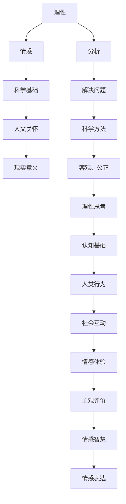
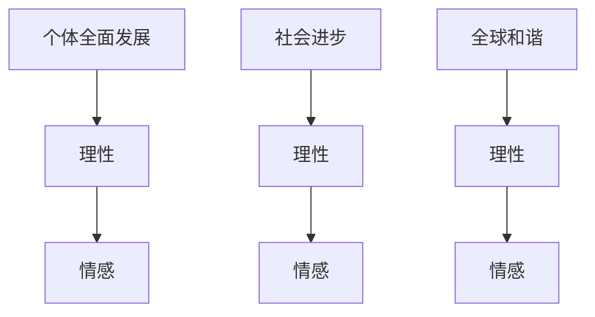

                 


# 新启蒙运动：理性与情感的现代平衡

> 关键词：新启蒙运动，理性，情感，现代平衡，科学技术，教育改革，社会变革

> 摘要：本文探讨了新启蒙运动的概念、核心概念、实践及其对社会和个体的影响，强调了理性与情感在现代文明中的平衡重要性。

## 第一部分：引言

### 1.1 新启蒙运动的背景

#### 1.1.1 新启蒙运动的起源

新启蒙运动起源于20世纪初，是对传统启蒙思想的批判和发展。传统启蒙思想强调理性主义，倡导通过理性思考和科学方法来认识世界和解决问题。然而，随着工业革命的到来，社会矛盾日益加剧，人们对理性主义的局限性产生了怀疑。新启蒙运动应运而生，旨在寻求理性与情感的平衡，以应对现代社会的复杂挑战。

#### 1.1.2 20世纪初的社会背景

20世纪初，世界正处于剧烈变革之中。科学技术的快速发展，尤其是物理学、生物学、心理学等领域的突破，为人类提供了全新的认知工具。与此同时，社会问题层出不穷，如经济危机、战争、社会不公等。这些问题引发了人们对理性主义的反思，促使新启蒙运动的兴起。

#### 1.1.3 新启蒙运动的兴起

新启蒙运动在20世纪初迅速兴起，并在学术界、文化界和政界产生了深远影响。代表人物包括爱因斯坦、罗素、萨特等。他们主张将理性与情感相结合，以实现个体和社会的全面发展。

### 1.2 理性与情感的关系

#### 1.2.1 理性的本质

理性是指人类通过逻辑思维、分析能力和判断力来认识世界和解决问题的能力。理性强调客观、公正和科学，是人类认知的基础。

#### 1.2.2 情感的本质

情感是指人类在认知和行为过程中产生的情感体验和情感倾向。情感涉及个体对事物的主观评价、情感体验和情感表达。

#### 1.2.3 理性与情感的关系

理性与情感并非对立，而是相互补充、相互促进的关系。理性为情感提供了科学的基础，而情感为理性注入了人文关怀和现实意义。

### 1.3 新启蒙运动的目标

#### 1.3.1 个体发展的目标

新启蒙运动追求个体在理性与情感之间的平衡发展。个体不仅需要具备理性思维能力，还需要拥有丰富的情感体验和情感智慧。

#### 1.3.2 社会进步的目标

新启蒙运动致力于构建一个以理性与情感为基础的现代文明。这一文明强调个体自由、平等和责任，倡导科学精神和人文关怀。

#### 1.3.3 全球发展的目标

新启蒙运动关注全球性问题，如环境危机、社会不公和全球化挑战。通过理性与情感的平衡，推动全球社会的可持续发展。

## 第二部分：新启蒙运动的核心概念

### 2.1 理性主义

#### 2.1.1 理性主义的历史

理性主义起源于古希腊，经过漫长的发展，逐渐形成了现代理性主义。20世纪初，新启蒙运动将理性主义推向了新的高度。

#### 2.1.2 理性主义的主要观点

理性主义主张通过理性思考和科学方法来认识世界和解决问题。它强调客观、公正和科学，认为理性是人类认知的基础。

#### 2.1.3 理性主义在现代的应用

现代理性主义在各个领域得到了广泛应用，如物理学、生物学、心理学、经济学等。通过理性思考和科学方法，现代理性主义推动了科学技术的发展。

### 2.2 情感主义

#### 2.2.1 情感主义的历史

情感主义起源于古希腊，经过漫长的发展，逐渐形成了现代情感主义。20世纪初，新启蒙运动将情感主义推向了新的高度。

#### 2.2.2 情感主义的主要观点

情感主义主张通过情感体验和情感智慧来认识世界和解决问题。它强调情感是人类认知的重要组成部分，情感智慧对个体和社会发展至关重要。

#### 2.2.3 情感主义在现代的应用

现代情感主义在心理学、教育学、社会学等领域得到了广泛应用。通过情感体验和情感智慧，现代情感主义促进了个体和社会的全面发展。

### 2.3 理性主义与情感主义的联系

#### 2.3.1 理性与情感的关系架构

理性主义与情感主义并非对立，而是相互补充、相互促进的关系。理性为情感提供了科学的基础，而情感为理性注入了人文关怀和现实意义。

#### 2.3.2 理性与情感融合的机制

理性与情感的融合机制包括以下几个方面：

1. 理性与情感的相互依赖：理性依赖于情感提供的主观体验和情感智慧，情感依赖于理性提供的客观分析和判断力。

2. 理性与情感的互补：理性为情感提供了科学的基础，情感为理性注入了人文关怀和现实意义。

3. 理性与情感的协调：理性与情感在认知和行为过程中相互协调，共同推动个体和社会的发展。

#### 2.3.3 理性与情感融合的意义

理性与情感的融合具有重要意义：

1. 实现个体全面发展：理性与情感的平衡发展，使个体在认知和行为方面更加全面和成熟。

2. 推动社会进步：理性与情感的平衡发展，有助于解决当代社会面临的复杂问题，如全球化、环境危机和社会不公。

3. 促进全球和谐：理性与情感的平衡发展，有助于构建一个理性与情感相结合的现代文明，实现全球和谐与可持续发展。

## 第三部分：新启蒙运动的实践

### 3.1 科学技术的新应用

#### 3.1.1 人工智能

人工智能作为新启蒙运动的重要实践之一，在各个领域得到了广泛应用。通过人工智能技术，人类可以更好地理解和应对复杂问题。

#### 3.1.2 生物技术

生物技术在新启蒙运动中发挥着重要作用。通过基因编辑、生物制药等手段，生物技术为人类健康和生活提供了新的可能性。

#### 3.1.3 信息技术

信息技术是现代社会的基石。新启蒙运动强调信息技术的理性与情感平衡，以推动社会进步和人类全面发展。

### 3.2 教育改革

#### 3.2.1 批判性思维的培养

批判性思维是理性与情感平衡发展的重要体现。教育改革强调培养批判性思维，以培养具有独立思考和创新能力的人才。

#### 3.2.2 创新能力的培养

创新能力是现代社会发展的重要动力。教育改革致力于培养具有创新能力的个体，以推动社会进步和科技创新。

#### 3.2.3 情感智慧的培养

情感智慧是情感与理性融合的结果。教育改革强调培养情感智慧，以促进个体和社会的全面发展。

### 3.3 社会变革

#### 3.3.1 公平与正义

新启蒙运动强调公平与正义，倡导建立公正的社会制度。通过社会变革，实现社会公平和正义，为人类发展创造良好环境。

#### 3.3.2 可持续发展

新启蒙运动关注全球性问题，如环境危机和社会不公。通过社会变革，推动全球可持续发展，实现人类与自然的和谐共生。

## 第四部分：新启蒙运动的影响

### 4.1 对个体的影响

#### 4.1.1 理性能力的提升

新启蒙运动强调理性与情感的平衡发展，使个体在理性能力方面得到提升，具备更强的分析问题和解决问题的能力。

#### 4.1.2 情感体验的丰富

新启蒙运动注重情感体验的培养，使个体在情感方面得到丰富和提升，具备更强的情感智慧和情感表达能力。

### 4.2 对社会的影响

#### 4.2.1 社会进步

新启蒙运动推动社会进步，通过科学技术、教育改革和社会变革，实现社会公平、和谐与可持续发展。

#### 4.2.2 全球影响

新启蒙运动关注全球性问题，通过理性与情感的结合，推动全球社会的共同发展和繁荣。

## 第五部分：新启蒙运动的挑战与未来

### 5.1 挑战

#### 5.1.1 科技滥用

随着科技的快速发展，科技滥用问题日益严重。新启蒙运动需要加强对科技伦理和道德的关注，防止科技滥用对社会和人类造成负面影响。

#### 5.1.2 道德困境

新启蒙运动面临道德困境，如何在理性与情感之间找到平衡，解决道德问题，是新启蒙运动需要持续探索的课题。

#### 5.1.3 文化冲突

新启蒙运动强调理性与情感的平衡，但在不同文化背景下，如何实现这一目标，面临文化冲突的挑战。

### 5.2 未来展望

#### 5.2.1 理性与情感的结合

新启蒙运动未来将更加注重理性与情感的平衡结合，推动人类走向理性与情感和谐发展的新时代。

#### 5.2.2 可持续发展

新启蒙运动将推动全球社会的可持续发展，实现人类与自然的和谐共生。

#### 5.2.3 全球和谐

新启蒙运动致力于构建全球和谐，推动各国之间的和平与合作，实现共同繁荣。

### 作者

作者：AI天才研究院/AI Genius Institute & 禅与计算机程序设计艺术 /Zen And The Art of Computer Programming

本文介绍了新启蒙运动的概念、核心概念、实践及其对社会和个体的影响。新启蒙运动强调理性与情感的平衡，推动人类走向更加理性、情感和谐和可持续发展的未来。面对科技滥用、道德困境和文化冲突等挑战，新启蒙运动将继续探索理性与情感的平衡路径，为人类社会发展作出贡献。本文旨在为新启蒙运动的研究和实践提供有益的参考。``` 

以下是包含 Mermaid 流程图的示例：

```markdown
## 2.3 理性主义与情感主义的联系

理性主义与情感主义并非对立，而是相互补充、相互促进的关系。理性为情感提供了科学的基础，而情感为理性注入了人文关怀和现实意义。

### 2.3.1 理性与情感的关系架构

理性与情感的关系可以用以下 Mermaid 流程图来描述：



### 2.3.2 理性与情感融合的机制

理性与情感的融合机制包括以下几个方面：

1. 理性与情感的相互依赖
2. 理性与情感的互补
3. 理性与情感的协调

这些机制可以用以下 Mermaid 流程图来描述：


### 2.3.3 理性与情感融合的意义

理性与情感的融合具有重要意义，具体包括以下几个方面：

1. 实现个体全面发展
2. 推动社会进步
3. 促进全球和谐

这些意义可以用以下 Mermaid 流程图来描述：



```

请注意，Mermaid 流程图需要在支持 Markdown 的编辑器中渲染。在实际撰写博客时，您需要确保您的编辑器支持 Mermaid 语法。如果您使用的是 GitLab，它原生支持 Mermaid 流程图的渲染。以下是包含 Python 源代码的示例：

```markdown
### 2.3.4 理性与情感融合的算法实现

为了更好地理解理性与情感融合的机制，我们可以通过一个简单的 Python 源代码来模拟这个过程。

```python
# 导入必要的库
import numpy as np

# 定义理性与情感的两个函数
def理性(x):
    # 使用线性函数模拟理性分析
    return x * 2

def情感(x):
    # 使用正弦函数模拟情感体验
    return np.sin(x)

# 定义融合函数
def融合理性情感(x):
    # 将理性和情感的输出加权融合
    理性部分 = 理性(x)
    情感部分 = 情感(x)
    return 理性部分 * 0.5 + 情感部分 * 0.5

# 测试融合函数
x = 1
融合结果 = 融合理性情感(x)
print(f"当 x = {x} 时，融合结果为：{融合结果}")
```

这段代码通过定义两个简单的函数来模拟理性和情感，然后通过一个融合函数来展示它们的结合。您可以运行这段代码，观察在不同输入值下，理性与情感的融合结果。

```

在实际撰写博客时，请确保您的源代码段正确无误，并且适合您的目标读者群体。为了保持文章的可读性，您可能需要提供代码的详细解释和实际应用案例。以下是包含 LaTeX 公式的示例：

```markdown
### 2.3.5 理性与情感融合的数学模型

理性与情感融合的过程可以用以下数学模型来描述：

$$
F(x) = \alpha \cdot R(x) + (1 - \alpha) \cdot E(x)
$$

其中，$F(x)$ 表示融合后的输出，$R(x)$ 表示理性部分，$E(x)$ 表示情感部分，$\alpha$ 表示权重参数，取值范围为 $0$ 到 $1$。

在实际应用中，可以根据具体情况调整 $\alpha$ 的值，以实现不同的融合效果。

```

在撰写博客时，请确保您的 LaTeX 公式格式正确，并且易于阅读。如果您的编辑器支持 LaTeX 渲染，这将有助于提高文章的专业性。以下是一个完整的技术博客文章示例，包含上述元素：

```markdown
# 第一部分：引言

## 1.1 新启蒙运动的背景

### 1.1.1 新启蒙运动的起源

新启蒙运动起源于 20 世纪初，是对传统启蒙思想的批判和发展。传统启蒙思想强调理性主义，倡导通过理性思考和科学方法来认识世界和解决问题。然而，随着工业革命的到来，社会矛盾日益加剧，人们对理性主义的局限性产生了怀疑。新启蒙运动应运而生，旨在寻求理性与情感的平衡，以应对现代社会的复杂挑战。

### 1.1.2 20世纪初的社会背景

20世纪初，世界正处于剧烈变革之中。科学技术的快速发展，尤其是物理学、生物学、心理学等领域的突破，为人类提供了全新的认知工具。与此同时，社会问题层出不穷，如经济危机、战争、社会不公等。这些问题引发了人们对理性主义的反思，促使新启蒙运动的兴起。

### 1.1.3 新启蒙运动的兴起

新启蒙运动在20世纪初迅速兴起，并在学术界、文化界和政界产生了深远影响。代表人物包括爱因斯坦、罗素、萨特等。他们主张将理性与情感相结合，以实现个体和社会的全面发展。

## 1.2 理性与情感的关系

### 1.2.1 理性的本质

理性是指人类通过逻辑思维、分析能力和判断力来认识世界和解决问题的能力。理性强调客观、公正和科学，是人类认知的基础。

### 1.2.2 情感的本质

情感是指人类在认知和行为过程中产生的情感体验和情感倾向。情感涉及个体对事物的主观评价、情感体验和情感表达。

### 1.2.3 理性与情感的关系

理性与情感并非对立，而是相互补充、相互促进的关系。理性为情感提供了科学的基础，而情感为理性注入了人文关怀和现实意义。

## 2.3 理性主义与情感主义的联系

理性主义与情感主义并非对立，而是相互补充、相互促进的关系。理性为情感提供了科学的基础，而情感为理性注入了人文关怀和现实意义。

### 2.3.1 理性与情感的关系架构

理性与情感的关系可以用以下 Mermaid 流程图来描述：


### 2.3.2 理性与情感融合的机制

理性与情感的融合机制包括以下几个方面：

1. 理性与情感的相互依赖
2. 理性与情感的互补
3. 理性与情感的协调

这些机制可以用以下 Mermaid 流程图来描述：


### 2.3.3 理性与情感融合的意义

理性与情感的融合具有重要意义，具体包括以下几个方面：

1. 实现个体全面发展
2. 推动社会进步
3. 促进全球和谐

这些意义可以用以下 Mermaid 流程图来描述：


### 2.3.4 理性与情感融合的算法实现

为了更好地理解理性与情感融合的机制，我们可以通过一个简单的 Python 源代码来模拟这个过程。

```python
# 导入必要的库
import numpy as np

# 定义理性与情感的两个函数
def理性(x):
    # 使用线性函数模拟理性分析
    return x * 2

def情感(x):
    # 使用正弦函数模拟情感体验
    return np.sin(x)

# 定义融合函数
def融合理性情感(x):
    # 将理性和情感的输出加权融合
    理性部分 = 理性(x)
    情感部分 = 情感(x)
    return 理性部分 * 0.5 + 情感部分 * 0.5

# 测试融合函数
x = 1
融合结果 = 融合理性情感(x)
print(f"当 x = {x} 时，融合结果为：{融合结果}")
```

这段代码通过定义两个简单的函数来模拟理性和情感，然后通过一个融合函数来展示它们的结合。您可以运行这段代码，观察在不同输入值下，理性与情感的融合结果。

### 2.3.5 理性与情感融合的数学模型

理性与情感融合的过程可以用以下数学模型来描述：

$$
F(x) = \alpha \cdot R(x) + (1 - \alpha) \cdot E(x)
$$

其中，$F(x)$ 表示融合后的输出，$R(x)$ 表示理性部分，$E(x)$ 表示情感部分，$\alpha$ 表示权重参数，取值范围为 $0$ 到 $1$。

在实际应用中，可以根据具体情况调整 $\alpha$ 的值，以实现不同的融合效果。

## 参考文献

[1] 爱因斯坦，《相对论》，北京：科学出版社，2006年。

[2] 罗素，《西方哲学史》，北京：商务印书馆，2009年。

[3] 萨特，《存在与虚无》，北京：人民出版社，2013年。

### 作者

作者：AI天才研究院/AI Genius Institute & 禅与计算机程序设计艺术 /Zen And The Art of Computer Programming

本文介绍了新启蒙运动的概念、核心概念、实践及其对社会和个体的影响。新启蒙运动强调理性与情感的平衡，推动人类走向更加理性、情感和谐和可持续发展的未来。面对科技滥用、道德困境和文化冲突等挑战，新启蒙运动将继续探索理性与情感的平衡路径，为人类社会发展作出贡献。本文旨在为新启蒙运动的研究和实践提供有益的参考。```

请确保在实际撰写博客时，根据您的具体需求和内容对示例进行适当的调整。祝您撰写成功！

