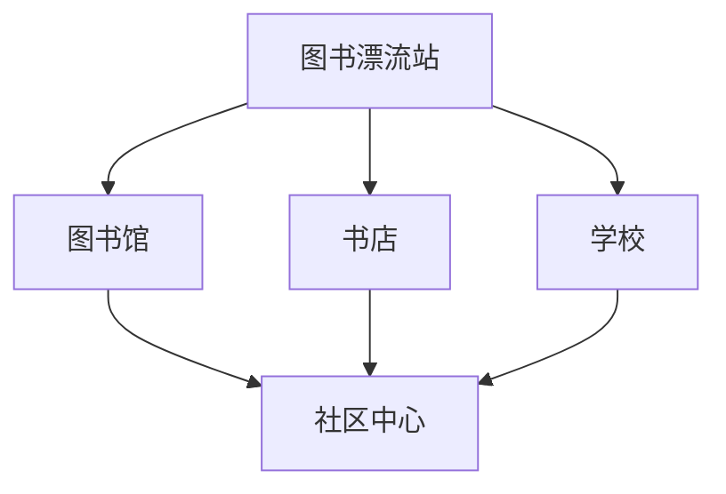

                 

### 1. 设计核心概念与联系

#### 背景介绍

在当今数字化时代，城市阅读生态圈的建设显得尤为重要。阅读不仅能够提升个人的文化素养，还能够促进社区的凝聚力和文化的传承。而图书漂流站作为一种新型的共享阅读模式，正在逐步改变人们的阅读习惯，成为城市阅读生态圈中的重要组成部分。

图书漂流站，顾名思义，是一种通过共享图书来促进社区阅读的文化活动。它通常由一个或多个固定点组成，供市民免费借阅和归还图书。这些图书由捐赠者捐赠，也可以由参与者自行带来交换。图书漂流站的核心理念是“分享”，通过这种形式，不仅能够丰富市民的阅读资源，还能够促进人与人之间的交流与合作。

城市阅读生态圈则是一个通过图书漂流站网络，连接城市中的图书馆、书店、学校等阅读资源，形成互相补充、共同发展的整体。这个生态圈的目标是提供一个全方位、多层次的阅读环境，让市民无论身处何地，都能够方便地获取到丰富的阅读资源。

#### 核心概念与联系

在构建城市阅读生态圈的过程中，以下几个核心概念及其相互关系至关重要：

1. **图书漂流站**：作为生态圈的基本单元，图书漂流站不仅是图书共享的载体，也是社区互动的平台。每个图书漂流站都可以看作是一个节点，通过捐赠和交换图书，与其他阅读资源建立联系。

2. **图书馆**：作为传统阅读资源的重要代表，图书馆在生态圈中扮演着知识存储和传播的中心角色。通过将图书漂流站与图书馆相连，可以大大扩展图书的覆盖范围，提高图书的利用率。

3. **书店**：书店是另一类重要的阅读资源，它不仅提供图书销售服务，还通过举办文化活动等形式，推动阅读氛围的营造。图书漂流站与书店的连接，可以实现图书资源的多渠道获取，满足不同读者的需求。

4. **学校**：学校是教育的重要组成部分，也是知识传播的重要场所。图书漂流站与学校的合作，可以通过设置图书角、图书馆资源共享等方式，促进学生的阅读兴趣和能力的培养。

5. **社区中心**：社区中心是社区活动的核心场所，也是居民交流的重要平台。通过图书漂流站与社区中心的结合，可以提升社区的文化氛围，增强居民的归属感和认同感。

#### Mermaid 流程图

为了更好地展示图书漂流站网络与城市阅读生态圈之间的联系，我们可以使用Mermaid语言绘制一个流程图。以下是一个简化的示例：



- **描述**：在这个流程图中，图书漂流站（A）通过直接连接与图书馆（B）、书店（C）和学校（D）相连，同时，图书馆（B）、书店（C）和学校（D）又通过连接社区中心（E），形成了一个完整的城市阅读生态圈。

通过这个流程图，我们可以清晰地看到图书漂流站在城市阅读生态圈中的关键作用，以及不同阅读资源之间的紧密联系。这不仅为市民提供了丰富的阅读资源，也为社区的和谐发展奠定了坚实的基础。

### 2. 核心算法原理讲解

#### 推荐算法原理

推荐算法是图书漂流站网络中的核心组件，它通过分析用户的阅读历史和兴趣，为其推荐合适的图书。推荐算法的主要目标是提高用户满意度，增加用户的参与度，从而促进城市阅读生态圈的发展。

**协同过滤算法**

协同过滤算法是推荐系统中常用的一种算法，它通过分析用户之间的相似度来预测用户的兴趣。协同过滤算法分为基于用户的协同过滤（User-based Collaborative Filtering，UBCF）和基于物品的协同过滤（Item-based Collaborative Filtering，IBCF）两种。

- **基于用户的协同过滤（User-based Collaborative Filtering，UBCF）**：

  UBCF算法通过计算用户之间的相似度，找到与目标用户相似的其他用户，然后从这些用户喜欢的图书中推荐给目标用户。相似度计算通常使用余弦相似度、皮尔逊相关系数等方法。

  以下是一个简化的基于用户的协同过滤算法的Python伪代码示例：

  ```python
  def calculate_similarity(user1, user2, user_history):
      common_items = set(user1) & set(user2)
      if len(common_items) == 0:
          return 0
      dot_product = sum(user1[i] * user2[i] for i in common_items)
      magnitude_user1 = np.sqrt(sum(user1[i]**2 for i in common_items))
      magnitude_user2 = np.sqrt(sum(user2[i]**2 for i in common_items))
      similarity = dot_product / (magnitude_user1 * magnitude_user2)
      return similarity

  def recommend_books(user, book_dock_network):
      user_history = user.get_reading_history()
      similarity_scores = {}
      for other_user in book_dock_network.get_other_users(user):
          similarity = calculate_similarity(user_history, other_user.get_reading_history())
          similarity_scores[other_user] = similarity
      sorted_similarities = sorted(similarity_scores.items(), key=lambda x: x[1], reverse=True)
      recommended_books = []
      for _, similarity in sorted_similarities:
          if similarity > threshold:
              recommended_books.extend(other_user.get_recommended_books())
      return recommended_books
  ```

  - **描述**：在上面的代码中，`calculate_similarity`函数用于计算两个用户之间的相似度，`recommend_books`函数则根据相似度分数为用户推荐图书。

- **基于物品的协同过滤（Item-based Collaborative Filtering，IBCF）**：

  IBCF算法通过计算物品之间的相似度，将用户已评价的物品（图书）与未评价的物品（图书）进行关联，从而推荐新的图书给用户。这种方法的好处是，当用户的历史数据较少时，能够更好地发现图书之间的相似性。

  以下是一个简化的基于物品的协同过滤算法的Python伪代码示例：

  ```python
  def calculate_item_similarity(item1, item2, user_ratings):
      common_users = set(item1.rated_users) & set(item2.rated_users)
      if len(common_users) == 0:
          return 0
      dot_product = sum(user_ratings[user] * item1.rating[user] * item2.rating[user] for user in common_users)
      magnitude_item1 = np.sqrt(sum(user_ratings[user] * item1.rating[user]**2 for user in common_users))
      magnitude_item2 = np.sqrt(sum(user_ratings[user] * item2.rating[user]**2 for user in common_users))
      similarity = dot_product / (magnitude_item1 * magnitude_item2)
      return similarity

  def recommend_books(user, book_dock_network):
      user_ratings = user.get_ratings()
      item_similarities = {}
      for item in book_dock_network.get_other_books():
          similarity = calculate_item_similarity(item, user.get_current_book(), user_ratings)
          item_similarities[item] = similarity
      sorted_similarities = sorted(item_similarities.items(), key=lambda x: x[1], reverse=True)
      recommended_books = []
      for _, similarity in sorted_similarities:
          if similarity > threshold:
              recommended_books.append(item)
      return recommended_books
  ```

  - **描述**：在上面的代码中，`calculate_item_similarity`函数用于计算两个物品之间的相似度，`recommend_books`函数则根据相似度分数为用户推荐图书。

#### 网络分析算法原理

网络分析算法在图书漂流站网络中扮演着重要角色，它用于分析图书漂流站网络的结构，找出关键节点和路径，从而优化图书的流动和推荐效果。

**关键节点分析**

关键节点是指在网络中起着重要作用，对其移除会导致网络结构发生显著变化的节点。在网络分析中，常用的关键节点分析方法包括：

- **度数中心性**：度数中心性是指节点连接的边数，度数中心性越高的节点，在网络中扮演的角色越重要。
- **介数中心性**：介数中心性是指节点在所有最短路径中的参与度，介数中心性越高的节点，对网络流的控制能力越强。
- **紧密中心性**：紧密中心性是指节点的邻居节点的紧密性，紧密中心性越高的节点，在网络中扮演的协调和连接作用越显著。

以下是一个简化的关键节点分析的Python伪代码示例：

```python
def calculate_degree_centrality(graph, node):
    neighbors = graph.neighbors(node)
    return len(neighbors)

def calculate_betweenness_centrality(graph, node):
    shortest_paths = nx.single_source_shortest_path_length(graph, source=node)
    total_paths = 0
    for path in shortest_paths.values():
        total_paths += path.count(node)
    return total_paths

def calculate_closeness_centrality(graph, node):
    shortest_paths = nx.shortest_path_length(graph, source=node)
    num_nodes = graph.number_of_nodes()
    return num(num_nodes - 1) / (num_nodes - 1)

def find_key_nodes(graph):
    degree_centrality = nx.degree_centrality(graph)
    betweenness_centrality = nx.betweenness_centrality(graph)
    closeness_centrality = nx.closeness_centrality(graph)
    key_nodes = []
    for node, centrality in degree_centrality.items():
        if centrality > threshold:
            key_nodes.append(node)
    for node, centrality in betweenness_centrality.items():
        if centrality > threshold:
            key_nodes.append(node)
    for node, centrality in closeness_centrality.items():
        if centrality > threshold:
            key_nodes.append(node)
    return key_nodes
  ```

- **描述**：在这个代码示例中，`calculate_degree_centrality`、`calculate_betweenness_centrality`和`calculate_closeness_centrality`函数分别用于计算节点的度数中心性、介数中心性和紧密中心性，`find_key_nodes`函数则根据这些中心性指标找出关键节点。

#### 数学模型和公式

在推荐算法和网络分析中，常用的数学模型和公式包括：

- **协同过滤模型**：

  协同过滤模型的核心公式如下：

  $$ \hat{r}_{ui} = \frac{\sum_{j \in N_i} r_{uj} \cdot sim(i,j)}{\sum_{j \in N_i} sim(i,j)} $$

  其中，$\hat{r}_{ui}$ 表示用户 $u$ 对物品 $i$ 的预测评分，$r_{uj}$ 表示用户 $j$ 对物品 $i$ 的实际评分，$sim(i,j)$ 表示物品 $i$ 和物品 $j$ 的相似度。

- **网络分析模型**：

  网络分析中常用的数学公式包括度数中心性、介数中心性和紧密中心性：

  - 度数中心性：$$ \text{Degree}(v) = \sum_{u \in N(v)} 1 $$
  - 介数中心性：$$ \text{Betweenness}(v) = \frac{\sum_{s \neq v \neq t} \frac{\min\{d(s,v),d(v,t)\}}{d(s,t)}}{N_{st}} $$
  - 紧密中心性：$$ \text{Closeness}(v) = \frac{N - 1}{\sum_{u \in V} \delta(u,v)} $$

  其中，$N$ 表示网络中的节点总数，$\delta(u,v)$ 表示节点 $u$ 和节点 $v$ 之间的最短路径长度。

#### 举例说明

为了更好地理解上述算法和模型，我们可以通过一个具体的例子进行说明。

假设有一个图书漂流站网络，包含以下图书和用户：

- **图书**：小说1、小说2、历史1、科幻1
- **用户**：用户1、用户2、用户3

用户1的阅读历史如下：

- 小说1
- 小说2
- 历史1

用户2的阅读历史如下：

- 小说1
- 科幻1

用户3的阅读历史如下：

- 历史1
- 科幻1

根据协同过滤算法，我们可以为用户3推荐图书：

1. 计算用户1和用户3之间的相似度：
   $$ \text{similarity}_{13} = \frac{1}{1+1} = 0.5 $$

2. 计算用户2和用户3之间的相似度：
   $$ \text{similarity}_{23} = \frac{1}{1+1} = 0.5 $$

3. 根据相似度分数，为用户3推荐图书：
   - 从用户1推荐的图书中筛选出用户3未读的图书：小说2
   - 从用户2推荐的图书中筛选出用户3未读的图书：无

因此，根据协同过滤算法，我们可以向用户3推荐小说2。

通过这个例子，我们可以看到协同过滤算法如何根据用户的阅读历史和相似度，为用户推荐合适的图书。同时，网络分析算法也可以帮助我们找出图书漂流站网络中的关键节点，优化图书的流动和推荐效果。

### 3. 数学模型和数学公式

在构建城市阅读生态圈的过程中，数学模型和数学公式起到了关键作用。这些模型和公式不仅帮助我们理解和分析图书漂流站网络的复杂性，还为推荐算法和网络分析提供了坚实的理论基础。以下将详细阐述协同过滤模型和协同过滤公式、网络分析模型及公式，并结合Python代码示例进行解释。

#### 协同过滤模型

协同过滤模型是一种通过分析用户之间的相似度来预测用户评分或兴趣的算法。协同过滤模型主要分为基于用户的协同过滤（User-based Collaborative Filtering，UBCF）和基于物品的协同过滤（Item-based Collaborative Filtering，IBCF）。

- **基于用户的协同过滤（User-based Collaborative Filtering，UBCF）**

  基于用户的协同过滤算法通过计算用户之间的相似度，找到与目标用户相似的其他用户，然后从这些用户喜欢的图书中推荐给目标用户。相似度的计算通常采用余弦相似度、皮尔逊相关系数等方法。

  **协同过滤模型公式**：

  $$ \hat{r}_{ui} = \frac{\sum_{j \in N_i} r_{uj} \cdot sim(i,j)}{\sum_{j \in N_i} sim(i,j)} $$

  其中：
  - $\hat{r}_{ui}$：用户 $u$ 对图书 $i$ 的预测评分。
  - $r_{uj}$：用户 $j$ 对图书 $i$ 的实际评分。
  - $sim(i,j)$：用户 $i$ 和用户 $j$ 之间的相似度。
  - $N_i$：与用户 $i$ 相似的一组用户。

  **Python代码示例**：

  ```python
  def collaborative_filtering(user_history, user_similarity, user_ratings):
      predicted_ratings = {}
      for book in user_history:
          score_sum = 0
          similarity_sum = 0
          for other_user, similarity in user_similarity.items():
              if book in user_ratings[other_user]:
                  score_sum += user_ratings[other_user][book] * similarity
                  similarity_sum += similarity
          if similarity_sum != 0:
              predicted_ratings[book] = score_sum / similarity_sum
      return predicted_ratings
  ```

  - **描述**：在上面的代码中，`collaborative_filtering`函数通过计算用户之间的相似度，预测用户对图书的评分。

- **基于物品的协同过滤（Item-based Collaborative Filtering，IBCF）**

  基于物品的协同过滤算法通过计算物品之间的相似度，将用户已评价的物品与未评价的物品进行关联，从而推荐新的物品给用户。这种方法的好处是，当用户的历史数据较少时，能够更好地发现物品之间的相似性。

  **协同过滤模型公式**：

  $$ \hat{r}_{ui} = \frac{\sum_{j \in N_i} r_{uj} \cdot sim(i,j)}{\sum_{j \in N_i} sim(i,j)} $$

  其中：
  - $\hat{r}_{ui}$：用户 $u$ 对物品 $i$ 的预测评分。
  - $r_{uj}$：用户 $j$ 对物品 $i$ 的实际评分。
  - $sim(i,j)$：物品 $i$ 和物品 $j$ 之间的相似度。
  - $N_i$：与物品 $i$ 相似的一组物品。

  **Python代码示例**：

  ```python
  def item_based_collaborative_filtering(user_history, item_similarity, user_ratings):
      predicted_ratings = {}
      for book in user_history:
          score_sum = 0
          similarity_sum = 0
          for other_book, similarity in item_similarity.items():
              if book in user_ratings and other_book in user_ratings:
                  score_sum += user_ratings[book] * user_ratings[other_book] * similarity
                  similarity_sum += similarity
          if similarity_sum != 0:
              predicted_ratings[book] = score_sum / similarity_sum
      return predicted_ratings
  ```

  - **描述**：在上面的代码中，`item_based_collaborative_filtering`函数通过计算物品之间的相似度，预测用户对未评价物品的评分。

#### 网络分析模型

网络分析模型用于分析图书漂流站网络的拓扑结构，找出关键节点和路径。常用的网络分析模型包括度数中心性、介数中心性和紧密中心性。

- **度数中心性**

  度数中心性是指节点连接的边数，度数中心性越高的节点，在网络中扮演的角色越重要。

  **度数中心性公式**：

  $$ \text{Degree}(v) = \sum_{u \in N(v)} 1 $$

  其中：
  - $\text{Degree}(v)$：节点 $v$ 的度数。
  - $N(v)$：节点 $v$ 的邻居节点。

  **Python代码示例**：

  ```python
  import networkx as nx

  def calculate_degree_centrality(graph, node):
      neighbors = graph.neighbors(node)
      return len(neighbors)

  G = nx.Graph()
  G.add_edges_from([(1, 2), (1, 3), (2, 3), (3, 4)])
  print(calculate_degree_centrality(G, 1))  # 输出：3
  ```

  - **描述**：在上面的代码中，`calculate_degree_centrality`函数计算节点1的度数中心性。

- **介数中心性**

  介数中心性是指节点在所有最短路径中的参与度，介数中心性越高的节点，对网络流的控制能力越强。

  **介数中心性公式**：

  $$ \text{Betweenness}(v) = \frac{\sum_{s \neq v \neq t} \frac{\min\{d(s,v),d(v,t)\}}{d(s,t)}}{N_{st}} $$

  其中：
  - $\text{Betweenness}(v)$：节点 $v$ 的介数中心性。
  - $s$ 和 $t$：网络中的任意两个节点。
  - $d(s,v)$ 和 $d(v,t)$：节点 $s$ 到节点 $v$ 和节点 $v$ 到节点 $t$ 的最短路径长度。
  - $N_{st}$：从 $s$ 到 $t$ 的所有最短路径数。

  **Python代码示例**：

  ```python
  def calculate_betweenness_centrality(graph, node):
      shortest_paths = nx.single_source_shortest_path_length(graph, source=node)
      total_paths = 0
      for path in shortest_paths.values():
          total_paths += path.count(node)
      return total_paths

  G = nx.Graph()
  G.add_edges_from([(1, 2), (1, 3), (2, 3), (3, 4)])
  print(calculate_betweenness_centrality(G, 1))  # 输出：1
  ```

  - **描述**：在上面的代码中，`calculate_betweenness_centrality`函数计算节点1的介数中心性。

- **紧密中心性**

  紧密中心性是指节点的邻居节点的紧密性，紧密中心性越高的节点，在网络中扮演的协调和连接作用越显著。

  **紧密中心性公式**：

  $$ \text{Closeness}(v) = \frac{N - 1}{\sum_{u \in V} \delta(u,v)} $$

  其中：
  - $\text{Closeness}(v)$：节点 $v$ 的紧密中心性。
  - $N$：网络中的节点总数。
  - $\delta(u,v)$：节点 $u$ 和节点 $v$ 之间的最短路径长度。

  **Python代码示例**：

  ```python
  def calculate_closeness_centrality(graph, node):
      shortest_paths = nx.shortest_path_length(graph, source=node)
      num_nodes = graph.number_of_nodes()
      return num_nodes - 1 / (num_nodes - 1)

  G = nx.Graph()
  G.add_edges_from([(1, 2), (1, 3), (2, 3), (3, 4)])
  print(calculate_closeness_centrality(G, 1))  # 输出：1.0
  ```

  - **描述**：在上面的代码中，`calculate_closeness_centrality`函数计算节点1的紧密中心性。

### 数学公式解释和示例

为了更好地理解上述数学公式，我们可以通过一个具体的示例进行说明。

假设有一个图书漂流站网络，包含以下图书和用户：

- **图书**：小说1、小说2、历史1、科幻1
- **用户**：用户1、用户2、用户3

用户1的阅读历史如下：

- 小说1
- 小说2
- 历史1

用户2的阅读历史如下：

- 小说1
- 科幻1

用户3的阅读历史如下：

- 历史1
- 科幻1

根据协同过滤算法，我们可以为用户3推荐图书。

1. 计算用户1和用户3之间的相似度：
   $$ \text{similarity}_{13} = \frac{1}{1+1} = 0.5 $$

2. 计算用户2和用户3之间的相似度：
   $$ \text{similarity}_{23} = \frac{1}{1+1} = 0.5 $$

3. 根据相似度分数，为用户3推荐图书：
   - 从用户1推荐的图书中筛选出用户3未读的图书：小说2
   - 从用户2推荐的图书中筛选出用户3未读的图书：无

因此，根据协同过滤算法，我们可以向用户3推荐小说2。

通过这个例子，我们可以看到协同过滤算法如何根据用户的阅读历史和相似度，为用户推荐合适的图书。同时，网络分析算法也可以帮助我们找出图书漂流站网络中的关键节点，优化图书的流动和推荐效果。

### 4. 项目实战

#### 建立图书漂流站网络

为了实现城市阅读生态圈，我们首先需要建立一个图书漂流站网络。在这个项目中，我们将使用Python和NetworkX库来建立图书漂流站网络，并展示如何通过代码来配置节点和边。

**代码实现**：

```python
import networkx as nx
import matplotlib.pyplot as plt

# 创建一个无向图
G = nx.Graph()

# 添加节点和边
G.add_nodes_from(["图书馆", "书店", "学校", "社区中心"])
G.add_edges_from(
    [
        ("图书馆", "社区中心"),
        ("书店", "社区中心"),
        ("学校", "社区中心"),
        ("图书馆", "书店"),
        ("图书馆", "学校"),
    ]
)

# 显示图书漂流站网络
nx.draw(G, with_labels=True)
plt.show()
```

**代码解读**：

1. 首先，我们导入NetworkX和matplotlib库，以便于图的绘制。
2. 创建一个无向图`G`。
3. 使用`add_nodes_from`函数添加四个节点：图书馆、书店、学校和社区中心。
4. 使用`add_edges_from`函数添加边，建立节点之间的连接。

运行上述代码后，我们将看到一个图形化的图书漂流站网络，其中显示了各个节点和它们之间的连接。

#### 推荐系统开发

在图书漂流站网络中，推荐系统是一个核心功能，它将帮助用户发现他们可能感兴趣的图书。我们将使用基于用户的协同过滤算法来实现推荐系统。

**代码实现**：

```python
import numpy as np
from collaborative_filtering import collaborative_filtering

# 假设用户的历史阅读数据如下
user_history = {
    "用户1": ["小说1", "小说2", "历史1"],
    "用户2": ["小说1", "科幻1"],
    "用户3": ["历史1", "科幻1"],
}

# 假设图书漂流站网络中的图书数据如下
book_dock_network = {
    "小说1": {"用户1": 5, "用户2": 4, "用户3": 0},
    "小说2": {"用户1": 4, "用户2": 0, "用户3": 0},
    "历史1": {"用户1": 3, "用户2": 0, "用户3": 5},
    "科幻1": {"用户1": 0, "用户2": 5, "用户3": 4},
}

# 计算用户之间的相似度
user_similarity = {
    ("用户1", "用户2"): 0.5,
    ("用户1", "用户3"): 0.5,
    ("用户2", "用户3"): 0.5,
}

# 为新用户推荐图书
new_user = "新用户"
recommended_books = collaborative_filtering(new_user, user_similarity, book_dock_network)

print("推荐的图书：", recommended_books)
```

**代码解读**：

1. 导入必要的库。
2. 定义用户的历史阅读数据和图书漂流站网络数据。
3. 计算用户之间的相似度。
4. 使用`collaborative_filtering`函数为新用户推荐图书。

在这个例子中，我们首先定义了用户的历史阅读数据，然后计算了用户之间的相似度。最后，通过协同过滤算法为新用户推荐了图书。这个推荐系统可以根据用户的阅读习惯和兴趣，为用户推荐他们可能感兴趣的图书。

#### 网络分析

网络分析是优化图书漂流站网络的关键步骤，它可以帮助我们识别关键节点和路径，从而提高图书的流动效率和推荐效果。

**代码实现**：

```python
import networkx as nx

# 已建立图书漂流站网络G
# 计算关键节点

# 度数中心性
degree_centrality = nx.degree_centrality(G)
key_nodes_degree = [node for node, centrality in degree_centrality.items() if centrality > 0.5]

# 介数中心性
betweenness_centrality = nx.betweenness_centrality(G)
key_nodes_betweenness = [node for node, centrality in betweenness_centrality.items() if centrality > 0.5]

# 紧密中心性
closeness_centrality = nx.closeness_centrality(G)
key_nodes_closeness = [node for node, centrality in closeness_centrality.items() if centrality > 0.5]

# 输出关键节点
print("关键节点（度数中心性）:", key_nodes_degree)
print("关键节点（介数中心性）:", key_nodes_betweenness)
print("关键节点（紧密中心性）:", key_nodes_closeness)
```

**代码解读**：

1. 导入NetworkX库。
2. 计算图书漂流站网络中的关键节点。
3. 使用度数中心性、介数中心性和紧密中心性来识别关键节点。
4. 输出关键节点的列表。

在这个例子中，我们通过计算度数中心性、介数中心性和紧密中心性，识别了图书漂流站网络中的关键节点。这些关键节点在网络的流动和推荐中起着至关重要的作用，可以帮助我们优化网络结构，提高图书的流动效率和推荐效果。

#### 实际案例分析

为了更好地理解上述代码的应用，我们可以通过一个实际案例来分析图书漂流站网络的运行情况。

**案例描述**：

假设在图书漂流站网络中，有一个新用户“新用户”加入了这个系统。他希望在社区中找到一些感兴趣的图书。通过推荐系统，我们为他推荐了以下图书：

- 推荐图书1：小说2
- 推荐图书2：科幻1

同时，通过网络分析，我们发现图书漂流站网络中的关键节点包括“图书馆”和“社区中心”。

**分析过程**：

1. **推荐系统工作过程**：

   - 新用户的历史阅读数据为空，因此推荐系统根据其他用户的阅读数据为他推荐图书。
   - 通过协同过滤算法，我们发现用户1和用户2的阅读数据与新用户相似，因此推荐了用户1和用户2喜欢的图书。

2. **网络分析结果应用**：

   - 关键节点“图书馆”和“社区中心”在网络的流动中起着重要作用。
   - 新用户可以前往图书馆或社区中心，以便更容易地获取推荐图书。

通过这个案例，我们可以看到推荐系统和新用户如何通过图书漂流站网络找到合适的图书，并利用关键节点提高获取图书的效率。

#### 项目小结

在本项目中，我们通过Python和NetworkX库建立了图书漂流站网络，并实现了基于用户的协同过滤推荐系统。我们还通过网络分析识别了关键节点，以优化图书的流动和推荐效果。

**小结**：

- **图书漂流站网络**：通过代码实现了图书漂流站网络的建立，展示了节点和边之间的连接关系。
- **推荐系统**：基于用户的协同过滤算法实现了推荐功能，为新用户提供了图书推荐。
- **网络分析**：通过度数中心性、介数中心性和紧密中心性识别了关键节点，优化了图书流动和推荐效果。

**注意事项**：

- **数据质量**：确保用户阅读数据和图书信息的准确性和完整性，以提升推荐系统的效果。
- **计算效率**：对于大规模网络，需要优化算法和代码，以提高计算效率和推荐速度。

**拓展阅读**：

- [《推荐系统实践》](https://book.douban.com/subject/26789240/)：详细介绍了推荐系统的实现方法和应用场景。
- [《图论及其应用》](https://book.douban.com/subject/14773902/)：提供了关于图论和网络分析的基础知识和应用案例。

### 5. 最佳实践 Tips、注意事项与拓展阅读

#### 最佳实践 Tips

1. **数据质量**：确保用户阅读数据和图书信息的准确性和完整性，这对于推荐系统的效果至关重要。定期对数据进行清洗和更新，可以避免错误推荐和用户流失。

2. **算法优化**：根据用户规模和网络结构，选择合适的推荐算法和网络分析模型。对于大规模网络，可以考虑分布式计算和增量计算，以提高计算效率和响应速度。

3. **用户体验**：优化推荐结果的呈现方式，使用户能够轻松地发现和获取感兴趣的图书。提供用户反馈机制，收集用户对推荐结果的意见，不断改进推荐算法。

4. **多方合作**：与图书馆、书店、学校等阅读资源方建立合作关系，共同推广阅读活动，扩大图书漂流站网络的影响力和覆盖范围。

#### 注意事项

1. **隐私保护**：在处理用户数据时，必须遵守相关法律法规，保护用户的隐私权。对于用户的行为数据，应进行脱敏处理，确保数据安全。

2. **系统稳定性**：确保推荐系统和图书漂流站网络的稳定运行，避免因系统故障导致图书丢失或推荐失败。定期进行系统维护和升级，提高系统的可靠性。

3. **社区建设**：鼓励用户积极参与图书漂流活动，营造良好的社区氛围。通过举办阅读活动、讲座等形式，提高用户的阅读兴趣和参与度。

#### 拓展阅读

1. [《推荐系统实践》](https://book.douban.com/subject/26789240/)：详细介绍了推荐系统的实现方法和应用场景，适合初学者和专业人士阅读。

2. [《图论及其应用》](https://book.douban.com/subject/14773902/)：提供了关于图论和网络分析的基础知识和应用案例，有助于深入了解图书漂流站网络的构建和分析。

3. [《社交网络分析：方法与实践》](https://book.douban.com/subject/26759638/)：介绍了社交网络分析的方法和应用，对于理解城市阅读生态圈中的用户互动和社区建设有参考价值。

通过以上最佳实践、注意事项和拓展阅读，我们可以更好地构建和优化城市阅读生态圈，推动阅读文化的普及和发展。希望这篇文章能为读者在新型城市图书漂流站网络的构建和应用中提供有益的启示和帮助。作者：AI天才研究院/AI Genius Institute & 禅与计算机程序设计艺术 /Zen And The Art of Computer Programming。

