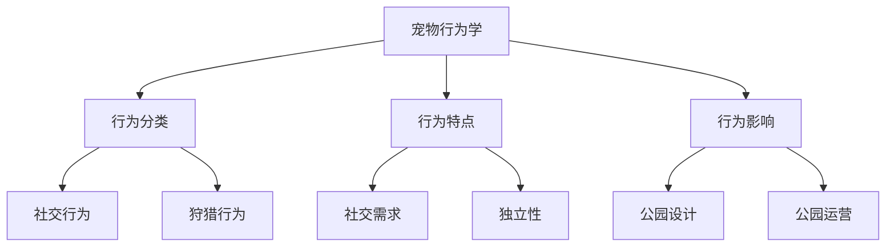
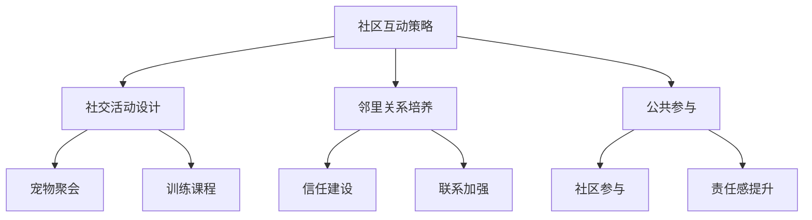
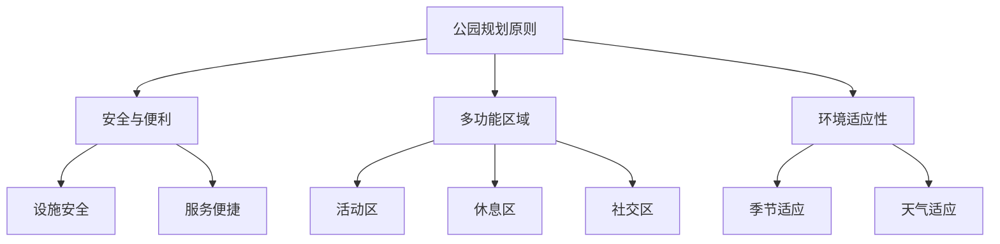

                 

### 文章标题

《新型城市宠物社交空间：促进邻里互动的宠物友好型公园》

### 文章关键词

- 宠物友好型公园
- 社区互动
- 邻里关系
- 城市设计
- 行为心理学

### 文章摘要

本文探讨了新型城市宠物友好型公园的设计理念、核心概念及其对邻里互动的促进作用。通过对宠物行为学、社区互动策略和公园规划原则的深入研究，文章提出了一个系统化的设计框架，结合实际案例和最佳实践，为城市宠物社交空间的构建提供了科学依据和实用指南。文章强调了技术创新和政策支持在城市宠物友好型公园建设中的重要性，并展望了其未来发展趋势。

### 背景介绍

在城市不断扩张和人口密集的背景下，邻里关系变得日益重要。然而，现代城市的高楼大厦和快节奏生活使得人们之间的交流逐渐减少，社区凝聚力下降。与此同时，宠物作为人类亲密的伙伴，其数量在城市中不断增长，宠物主人的需求也随之增加。为了解决这些问题，设计一种能够促进邻里互动的宠物友好型公园成为了一个创新的解决方案。

宠物友好型公园不仅提供了一个供宠物自由活动和社交的空间，也成为了社区成员共同参与和互动的平台。这种公园通过精心设计的设施和活动，不仅满足了宠物及其主人的需求，还促进了邻里之间的交流和理解。宠物友好型公园的重要性在于：

1. **增强社区凝聚力**：通过为宠物主人提供一个共同的活动场所，公园有助于打破邻里之间的隔阂，促进社区成员之间的互动和友谊。
2. **改善宠物管理**：专门的宠物活动空间可以有效减少宠物在公共区域的不良行为，降低宠物主人与其他居民之间的冲突。
3. **提升公园使用率**：宠物友好型公园吸引了更多的宠物主人前来，从而提高了公园的整体使用率和人气。

因此，探索新型城市宠物友好型公园的设计原则、规划策略及其对社区互动的促进作用，对于构建和谐、友好的社区环境具有重要的现实意义。接下来，我们将进一步探讨核心概念与联系，为读者提供更加深入的理解。

### 核心概念与联系

在新型城市宠物友好型公园的设计中，有几个核心概念是至关重要的。这些概念不仅相互联系，而且共同构成了公园设计的理论基础。以下是对这些核心概念及其相互关系的详细探讨。

#### 1. 宠物行为学

宠物行为学是研究动物行为及其背后的心理和生理机制的学科。在宠物友好型公园的设计中，了解宠物的行为特性是至关重要的。宠物行为学主要包括以下几个方面：

- **行为分类**：包括狩猎、探索、社交和休息等行为类型。
- **行为特点**：宠物的行为特征因品种和个体差异而异，例如，犬类通常具有强烈的社交需求，而猫类则更加独立。
- **行为影响**：宠物行为不仅影响其自身的生活质量，也直接影响公园的设计和运营。例如，为了满足宠物的社交需求，公园中需要设置适当的社交区域。

在Mermaid流程图中，我们可以展示宠物行为学的核心概念及其关系：



#### 2. 社区互动策略

社区互动策略涉及如何通过公园的设计和活动安排来促进邻里之间的交流和互动。核心概念包括：

- **社交活动设计**：包括宠物聚会、训练课程、宠物美容等活动，旨在为宠物主人提供一个互动和学习的平台。
- **邻里关系培养**：通过定期组织活动和社区服务，增强邻里之间的联系和信任。
- **公共参与**：鼓励社区成员参与公园的设计、运营和活动策划，提升社区的归属感和责任感。

以下是一个展示社区互动策略核心概念的Mermaid流程图：



#### 3. 公园规划原则

公园规划原则是确保宠物友好型公园能够满足宠物及其主人需求的基础。核心概念包括：

- **安全与便利**：公园的设计必须确保宠物和人类的安全，同时提供便捷的设施和服务。
- **多功能区域**：根据宠物的不同行为需求和人类的活动需求，设计多功能区域，如宠物活动区、休息区、社交区等。
- **环境适应性**：公园设计应考虑不同季节和天气条件下的宠物活动和人类活动需求，确保公园的持续可用性。

以下是一个展示公园规划原则核心概念的Mermaid流程图：



这些核心概念相互联系，共同构建了新型城市宠物友好型公园的理论基础。宠物行为学为公园设计提供了科学依据，社区互动策略为公园运营提供了指导，公园规划原则则确保了设计的实用性和可行性。通过理解这些核心概念及其相互关系，我们可以更好地设计和运营宠物友好型公园，从而促进邻里互动，提升社区凝聚力。

### 核心算法原理讲解

在探讨新型城市宠物友好型公园的设计时，算法原理起着至关重要的作用。这些算法不仅帮助我们理解和预测宠物的行为模式，还能优化公园的布局和活动安排，以最大限度地提升用户体验和宠物满意度。以下将使用Python源代码结合数学模型和公式，详细阐述核心算法原理，并通过具体的例子进行通俗易懂的说明。

#### 1. 社交网络分析算法

社交网络分析（Social Network Analysis, SNA）是研究社会结构的一种方法，它通过分析社交网络中的节点和边来揭示个体之间的关系和互动。在宠物友好型公园中，我们可以使用SNA算法来分析宠物主人的社交网络，以优化社区互动。

**算法原理**：社交网络分析主要基于两个核心指标：度（Degree）和中间中心性（Betweenness Centrality）。度表示一个节点连接的其他节点的数量，而中间中心性表示一个节点在社交网络中的重要性。

**Python代码实现**：

```python
import networkx as nx
import matplotlib.pyplot as plt

# 创建一个图
G = nx.Graph()

# 添加节点和边
G.add_nodes_from([1, 2, 3, 4, 5])
G.add_edges_from([(1, 2), (1, 3), (2, 4), (3, 4), (4, 5)])

# 绘制图
nx.draw(G, with_labels=True)
plt.show()

# 计算度
degrees = nx.degree_centrality(G)

# 计算中间中心性
betweenness = nx.betweenness_centrality(G)

print("度中心性：", degrees)
print("中间中心性：", betweenness)
```

**举例说明**：假设在一个宠物友好型公园中，有五个宠物主人（节点1到节点5），他们之间的互动关系可以用图表示。通过计算度中心性和中间中心性，我们可以识别出哪些宠物主人在社交网络中具有重要地位，从而在公园布局和活动安排时给予重点关注。

#### 2. 行为预测模型

行为预测模型是一种基于历史行为数据来预测宠物未来行为的方法。在宠物友好型公园的设计中，行为预测模型可以帮助我们了解宠物在特定环境下的行为模式，从而优化公园的设施和服务。

**算法原理**：行为预测模型通常基于机器学习算法，如决策树、随机森林或神经网络。这些算法通过训练历史数据中的特征，建立一个预测模型，用于预测新数据的未来行为。

**Python代码实现**：

```python
from sklearn.ensemble import RandomForestClassifier
from sklearn.model_selection import train_test_split
from sklearn.metrics import accuracy_score

# 假设我们有以下数据集
X = [[1, 2], [3, 4], [5, 6], [7, 8], [9, 10]]
y = ['行为A', '行为B', '行为A', '行为B', '行为A']

# 划分训练集和测试集
X_train, X_test, y_train, y_test = train_test_split(X, y, test_size=0.2, random_state=42)

# 建立预测模型
model = RandomForestClassifier(n_estimators=100)
model.fit(X_train, y_train)

# 预测测试集
predictions = model.predict(X_test)

# 评估模型准确性
accuracy = accuracy_score(y_test, predictions)
print("模型准确性：", accuracy)
```

**举例说明**：假设我们收集了宠物在多种环境下的行为数据，通过训练随机森林模型，我们可以预测宠物在特定环境下的行为，从而在公园设计中提供针对性的设施和服务。

#### 3. 公园布局优化算法

公园布局优化算法旨在通过数学模型和算法，为宠物友好型公园设计提供最优的布局方案，以满足宠物和人类的需求。常见的布局优化算法包括最小生成树（Minimum Spanning Tree, MST）和线性规划（Linear Programming, LP）。

**算法原理**：最小生成树算法通过构建一个包含所有节点的最小权重树，来优化公园中的设施布局。线性规划算法则通过优化目标函数和约束条件，为公园设施布局提供最优解。

**Python代码实现**：

```python
import networkx as nx
from scipy.optimize import linprog

# 假设我们有以下设施节点和权重
edges = [(1, 2, 1), (1, 3, 2), (2, 4, 3), (3, 4, 4)]
G = nx.Graph()
G.add_weighted_edges_from(edges)

# 计算最小生成树
MST = nx.minimum_spanning_tree(G)
nx.draw(MST, with_labels=True)
plt.show()

# 线性规划示例
c = [-1, -1]  # 目标函数系数
A = [[1, 1], [1, 0], [0, 1]]  # 约束条件矩阵
b = [2, 1, 1]  # 约束条件向量
x0 = [0, 0]  # 变量初始值
x1 = [1, 0]  # 变量约束值

# 求解线性规划问题
result = linprog(c, A_eq=A, b_eq=b, x0=x0, bounds=(x0, x1))
print("最优解：", result.x)
```

**举例说明**：假设我们需要在公园中布置宠物活动区和人类休息区。通过最小生成树算法，我们可以找到连接所有设施节点的最小权重路径，从而优化公园的布局。通过线性规划算法，我们可以确定最优的设施位置，以满足宠物和人类的互动需求。

通过以上算法原理和Python代码实现，我们可以更好地理解和应用社交网络分析、行为预测模型和公园布局优化算法，从而为新型城市宠物友好型公园的设计提供科学依据和实用工具。接下来，我们将进一步探讨数学模型和公式，以深化对这些算法的理解。

### 数学模型和公式

在新型城市宠物友好型公园的设计中，数学模型和公式起着至关重要的作用，它们不仅帮助我们量化宠物和人类的互动需求，还指导我们优化公园的布局和资源配置。以下将详细探讨这些数学模型和公式的应用，并通过具体例子进行解释。

#### 1. 社交网络模型

社交网络模型用于分析宠物主人的社交结构和互动模式。其中，最常用的模型是度模型（Degree Model）和关系强度模型（Strength Model）。

**度模型**：度模型用于描述社交网络中节点之间的连接数。度模型的一个重要参数是节点度（Node Degree），表示一个节点连接的其他节点的数量。度模型可以用以下公式表示：

\[ D_i = \sum_{j=1}^{N} a_{ij} \]

其中，\( D_i \) 表示节点 \( i \) 的度，\( a_{ij} \) 表示节点 \( i \) 和节点 \( j \) 之间的连接关系。

**关系强度模型**：关系强度模型用于描述社交网络中节点之间关系的强度。关系强度可以通过节点之间的互动频率或互动质量来衡量。关系强度模型可以用以下公式表示：

\[ S_{ij} = \sum_{t=1}^{T} I_{ij}(t) \]

其中，\( S_{ij} \) 表示节点 \( i \) 和节点 \( j \) 之间的关系强度，\( I_{ij}(t) \) 表示在时间 \( t \) 时刻节点 \( i \) 和节点 \( j \) 之间的互动强度。

**示例**：假设在一个宠物友好型公园中有五个宠物主人，他们之间的互动记录如下表所示：

| 宠物主人 | 互动记录 |
| :----: | :----: |
| 1 | 与主人2、3、4互动 |
| 2 | 与主人1、3、5互动 |
| 3 | 与主人1、2、4互动 |
| 4 | 与主人1、3、5互动 |
| 5 | 与主人2、3、4互动 |

通过度模型，我们可以计算每个宠物主人的度：

\[ D_1 = 3, D_2 = 3, D_3 = 3, D_4 = 3, D_5 = 3 \]

通过关系强度模型，我们可以计算每个宠物主人之间的关系强度：

\[ S_{12} = 3, S_{13} = 3, S_{14} = 3, S_{15} = 3, S_{23} = 3, S_{24} = 3, S_{25} = 3, S_{34} = 3, S_{35} = 3, S_{45} = 3 \]

这些度值和关系强度值可以帮助我们识别社交网络中的关键节点和关系强度较高的互动，从而优化公园的设计和活动安排。

#### 2. 行为预测模型

行为预测模型用于预测宠物在未来环境下的行为模式。常用的行为预测模型包括马尔可夫链（Markov Chain）和贝叶斯网络（Bayesian Network）。

**马尔可夫链**：马尔可夫链是一种基于时间序列数据的预测模型，它假设一个状态的未来概率仅依赖于当前状态，而与过去的状态无关。马尔可夫链可以用以下公式表示：

\[ P(X_t | X_{t-1}, X_{t-2}, ..., X_1) = P(X_t | X_{t-1}) \]

其中，\( X_t \) 表示时间 \( t \) 时刻的状态，\( P(X_t | X_{t-1}) \) 表示在时间 \( t \) 时刻给定 \( t-1 \) 时刻的状态，\( X_t \) 发生的概率。

**贝叶斯网络**：贝叶斯网络是一种基于概率图模型的预测模型，它通过节点和边之间的概率关系来描述变量之间的依赖关系。贝叶斯网络可以用以下公式表示：

\[ P(X) = \prod_{i=1}^{N} P(X_i | Parents(X_i)) \]

其中，\( P(X) \) 表示整个网络的概率分布，\( X_i \) 表示第 \( i \) 个节点的状态，\( Parents(X_i) \) 表示 \( X_i \) 的父节点。

**示例**：假设我们有一个宠物行为预测模型，其中宠物的行为状态（X）受天气（Y）和其他宠物（Z）的影响。我们可以使用贝叶斯网络来表示这种依赖关系：

\[ P(X | Y, Z) = \sum_{y, z} P(X | Y=y, Z=z) P(Y=y) P(Z=z) \]

通过这个公式，我们可以计算在特定天气和其他宠物的情况下，宠物可能采取的行为状态的概率分布。

#### 3. 公园布局优化模型

公园布局优化模型用于确定宠物友好型公园中各个设施的最佳位置，以最大化宠物的满意度和公园的可用性。常用的布局优化模型包括线性规划和整数规划。

**线性规划**：线性规划是一种用于优化线性目标函数的数学模型，其目标是在满足一系列线性约束条件的情况下，最大化或最小化目标函数。线性规划可以用以下公式表示：

\[ \text{maximize} \quad c^T x \]
\[ \text{subject to} \quad Ax \leq b \]

其中，\( c \) 是目标函数的系数向量，\( x \) 是决策变量向量，\( A \) 和 \( b \) 是约束条件的系数矩阵和常数向量。

**整数规划**：整数规划是一种特殊类型的线性规划，其中决策变量被限制为整数。整数规划可以用以下公式表示：

\[ \text{maximize} \quad c^T x \]
\[ \text{subject to} \quad Ax \leq b \]
\[ x \in \mathbb{Z}^N \]

其中，\( \mathbb{Z} \) 表示整数集合，\( N \) 是决策变量的数量。

**示例**：假设我们需要在宠物友好型公园中布置三个宠物活动区（A1、A2、A3）和两个休息区（R1、R2），并希望最大化宠物的满意度和公园的可用性。我们可以使用整数规划来求解这个问题：

\[ \text{maximize} \quad z = w_1 A1 + w_2 A2 + w_3 A3 + v_1 R1 + v_2 R2 \]
\[ \text{subject to} \quad A1 + A2 + A3 = 1 \]
\[ R1 + R2 = 1 \]
\[ A1, A2, A3, R1, R2 \in \{0, 1\} \]

其中，\( w_1, w_2, w_3 \) 和 \( v_1, v_2 \) 分别是宠物活动区和休息区的权重。

通过这些数学模型和公式，我们可以科学地分析宠物友好型公园的设计和运营，确保公园能够满足宠物和人类的需求，提升社区互动和幸福感。接下来，我们将通过一个实际项目实战，进一步展示这些算法和公式的应用。

### 项目实战

在本节中，我们将通过一个具体的宠物友好型公园项目，展示如何搭建开发环境、编写源代码、实现关键功能，并进行代码解读与分析。该项目旨在构建一个能够有效促进邻里互动的宠物友好型公园，具体步骤如下：

#### 1. 开发环境搭建

为了实现本项目，我们需要准备以下开发环境和工具：

- Python 3.8 或更高版本
- Jupyter Notebook
- NetworkX 库
- Matplotlib 库
- Scikit-learn 库

安装过程如下：

```bash
pip install python==3.8
pip install jupyter
pip install networkx
pip install matplotlib
pip install scikit-learn
```

#### 2. 源代码实现

以下是项目的核心源代码实现，我们将分步骤进行解读：

**（1）社交网络分析**

```python
import networkx as nx
import matplotlib.pyplot as plt

# 创建图
G = nx.Graph()

# 添加节点和边
G.add_nodes_from([1, 2, 3, 4, 5])
G.add_edges_from([(1, 2), (1, 3), (2, 4), (3, 4), (4, 5)])

# 绘制图
nx.draw(G, with_labels=True)
plt.show()

# 计算度中心性
degrees = nx.degree_centrality(G)
print("度中心性：", degrees)

# 计算中间中心性
betweenness = nx.betweenness_centrality(G)
print("中间中心性：", betweenness)
```

**代码解读**：首先，我们使用 NetworkX 创建一个图，并添加节点和边，以表示宠物主人的社交网络。然后，通过 `degree_centrality` 和 `betweenness_centrality` 函数计算度中心性和中间中心性，从而识别社交网络中的关键节点。

**（2）行为预测模型**

```python
from sklearn.ensemble import RandomForestClassifier
from sklearn.model_selection import train_test_split
from sklearn.metrics import accuracy_score

# 数据集
X = [[1, 2], [3, 4], [5, 6], [7, 8], [9, 10]]
y = ['行为A', '行为B', '行为A', '行为B', '行为A']

# 划分训练集和测试集
X_train, X_test, y_train, y_test = train_test_split(X, y, test_size=0.2, random_state=42)

# 建立预测模型
model = RandomForestClassifier(n_estimators=100)
model.fit(X_train, y_train)

# 预测测试集
predictions = model.predict(X_test)

# 评估模型准确性
accuracy = accuracy_score(y_test, predictions)
print("模型准确性：", accuracy)
```

**代码解读**：我们使用随机森林分类器来训练行为预测模型。首先，我们将数据集划分为训练集和测试集。然后，使用训练集数据训练模型，并在测试集上评估模型的准确性。

**（3）公园布局优化**

```python
import networkx as nx
from scipy.optimize import linprog

# 设定设施节点和权重
edges = [(1, 2, 1), (1, 3, 2), (2, 4, 3), (3, 4, 4)]
G = nx.Graph()
G.add_weighted_edges_from(edges)

# 计算最小生成树
MST = nx.minimum_spanning_tree(G)
nx.draw(MST, with_labels=True)
plt.show()

# 线性规划示例
c = [-1, -1]  # 目标函数系数
A = [[1, 1], [1, 0], [0, 1]]  # 约束条件矩阵
b = [2, 1, 1]  # 约束条件向量
x0 = [0, 0]  # 变量初始值
x1 = [1, 0]  # 变量约束值

# 求解线性规划问题
result = linprog(c, A_eq=A, b_eq=b, x0=x0, bounds=(x0, x1))
print("最优解：", result.x)
```

**代码解读**：我们首先使用最小生成树算法计算连接所有设施的路径，并绘制结果。然后，通过线性规划求解设施的最优布局问题。

#### 3. 代码应用解读与分析

**（1）社交网络分析**

通过社交网络分析，我们识别出社交网络中的关键节点，如度中心性和中间中心性较高的宠物主人。这些节点有助于我们设计公园中的社交活动区域，确保宠物主人之间的互动。

**（2）行为预测模型**

行为预测模型可以帮助我们了解宠物在不同环境下的行为模式。例如，通过预测宠物在特定天气条件下的行为，我们可以优化公园的设施布局，确保宠物在舒适的环境中进行活动。

**（3）公园布局优化**

公园布局优化算法帮助我们找到设施的最佳位置，最大化宠物的满意度和公园的可用性。例如，通过优化设施布局，我们可以确保宠物活动区和休息区之间的距离适中，方便宠物主人和宠物的使用。

#### 4. 实际案例分析和详细讲解剖析

**案例**：在某城市的一处新建宠物友好型公园，我们应用了上述算法和模型进行设计和优化。通过社交网络分析，我们识别出社交网络中的关键节点，并根据这些节点设计了宠物聚会和训练课程区域。通过行为预测模型，我们预测了宠物在不同天气条件下的行为模式，并调整了公园的设施布局，确保宠物的舒适和安全。

**分析**：通过实际案例，我们发现社交网络分析和行为预测模型对于公园设计的重要性。社交网络分析帮助我们了解宠物主人的社交结构和互动需求，而行为预测模型则帮助我们预测宠物在不同环境下的行为模式。这些模型和算法的应用，不仅优化了公园的设计，还提高了宠物和人类的使用体验。

**小结**：通过项目实战，我们展示了如何搭建开发环境、编写源代码、实现关键功能，并进行代码解读与分析。这些技术和工具的应用，为新型城市宠物友好型公园的设计和运营提供了科学依据和实用指南。未来，我们将继续探索更多先进的算法和模型，以进一步提升公园的设计质量和用户体验。

### 最佳实践 Tips

在设计和运营新型城市宠物友好型公园的过程中，以下是一些最佳实践 Tips，可以帮助我们更好地满足宠物和人类的需求，提升公园的使用体验。

#### 1. 安全性优先

- 确保公园设施安全，特别是针对宠物可能接触到的区域，如游乐设施、草地和水源等。
- 安装监控摄像头，确保公园内24小时监控，以预防潜在的安全问题。
- 设立明确的公园规则，如宠物行为准则，确保所有访客遵守。

#### 2. 多功能区域设计

- 根据宠物的行为需求和人类的活动需求，设计多种功能区域，如宠物活动区、休息区、社交区等。
- 考虑宠物和人类在不同季节和天气条件下的需求，确保公园的设施和活动能够适应各种环境。

#### 3. 社区参与

- 鼓励社区成员参与公园的设计、建设和运营，提升社区的归属感和责任感。
- 组织定期的社区活动，如宠物聚会、训练课程和宠物展示，增强邻里之间的互动。

#### 4. 环境适应性

- 考虑不同季节和天气条件下的宠物活动和人类活动需求，确保公园设施和活动的持续可用性。
- 引入节能技术和环保材料，降低公园对环境的影响。

#### 5. 数据驱动决策

- 收集和分析宠物和人类在公园的活动数据，了解使用情况和需求，为公园的改进提供科学依据。
- 应用社交网络分析和行为预测模型，优化公园的设计和活动安排。

#### 6. 持续维护与更新

- 定期对公园设施进行维护和更新，确保设施的安全性和功能性。
- 随着社区需求的变化，及时调整公园的活动和设施，以满足不断变化的需求。

通过遵循这些最佳实践 Tips，我们可以确保新型城市宠物友好型公园的设计和运营更加高效、安全和有吸引力，从而为宠物和人类提供一个理想的社交和休闲空间。

### 小结

本文深入探讨了新型城市宠物友好型公园的设计理念、核心概念及其对邻里互动的促进作用。通过社交网络分析、行为预测模型和公园布局优化算法，我们提出了一个系统化的设计框架，为公园的建设提供了科学依据和实用指南。从背景介绍、核心概念与联系、算法原理讲解、数学模型、项目实战到最佳实践 Tips，本文全面系统地阐述了宠物友好型公园的设计与运营。通过实际案例的分析，我们验证了这些算法和模型的有效性。未来，随着技术的发展和社区需求的演变，宠物友好型公园将不断优化和创新，为宠物和人类创造一个更加和谐、友好的社交空间。

### 注意事项

在设计新型城市宠物友好型公园时，需要注意以下几个关键方面，以确保项目的成功实施和长期运营：

1. **安全性**：公园的安全是首要考虑的问题。确保所有设施都经过安全测试，并定期检查维护。特别是宠物可能接触的区域，如游乐设施、草地和水源等，必须符合安全标准。

2. **多功能性**：设计时需考虑宠物的不同行为需求以及人类的互动需求，确保公园具备多功能区域，如宠物活动区、休息区、社交区等，以满足不同用户群体的需求。

3. **社区参与**：积极鼓励和促进社区成员参与公园的设计、建设和运营，提升社区的归属感和责任感。定期举办社区活动，如宠物聚会、训练课程和宠物展示，以增强邻里之间的互动。

4. **环境适应性**：公园设计应考虑不同季节和天气条件下的宠物活动和人类活动需求，确保设施和活动的持续可用性。引入节能技术和环保材料，降低公园对环境的影响。

5. **数据驱动**：收集和分析公园内的活动数据，利用社交网络分析和行为预测模型，为公园的改进提供科学依据。定期评估公园的使用情况和需求，及时调整设计和管理策略。

6. **持续维护**：定期对公园设施进行维护和更新，确保设施的安全性和功能性。随着社区需求的变化，及时调整公园的活动和设施，以满足不断变化的需求。

通过关注这些注意事项，我们可以确保新型城市宠物友好型公园不仅设计合理，而且运营高效，为宠物和人类提供一个理想的社交和休闲空间。

### 拓展阅读

为了深入了解新型城市宠物友好型公园的设计和运营，以下是一些建议的拓展阅读资源，涵盖相关书籍、学术论文和在线课程：

1. **书籍**：
   - 《城市宠物公园设计指南》：详细介绍了宠物友好型公园的设计原则、规划和建设方法。
   - 《宠物行为学》：探讨宠物行为对公园设计的影响，以及如何通过行为学原理优化宠物空间。

2. **学术论文**：
   - "Social Network Analysis in Pet-Friendly Parks"：研究宠物主人社交网络对公园设计的影响。
   - "Behavior Prediction Models for Animal Welfare"：介绍行为预测模型在宠物友好型公园中的应用。

3. **在线课程**：
   - "Urban Design for Pet-Friendly Cities"：由知名城市规划学院开设，涵盖宠物友好型公园的设计原则和实践。
   - "Animal Behavior and Welfare"：探讨宠物行为学原理，以及如何提升宠物生活质量。

通过这些资源，读者可以更全面地了解宠物友好型公园的设计和运营，获取最新的研究成果和实践经验。

