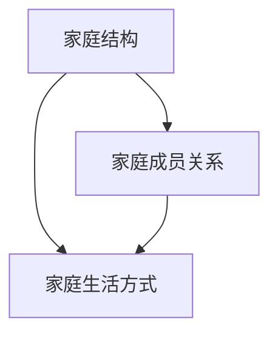

                 

### 新型家庭：多元化生活方式的探索

#### 关键词：新型家庭、多元化生活方式、社会结构、技术影响、未来趋势

> 摘要：本文将探讨新型家庭的概念及其在社会结构中的地位。通过分析多元化生活方式的核心理念和实践方法，我们旨在揭示这种生活方式对个人和社会的深远影响。此外，还将结合实际案例，展示新型家庭生活方式的案例研究和未来发展趋势，为读者提供一个全面而深入的探索视角。

---

# 新型家庭：多元化生活方式的探索

随着科技的发展和全球化进程的加速，家庭结构和生活方式正在发生深刻的变革。传统的家庭模式已无法完全适应现代社会，取而代之的是一种更加多元化、灵活化的新型家庭模式。这种变化不仅反映了社会的进步，也带来了许多新的挑战和机遇。

## 引言

### 1.1 新型家庭的概念

新型家庭不仅仅是一个物理空间，更是一种生活态度和社会关系的集合。它强调家庭成员之间的平等、尊重和共同成长，打破了传统家庭结构的束缚，允许家庭成员根据个人需求和偏好来安排自己的生活。

### 1.2 新型家庭的社会背景

现代社会的变化，如城市化、经济全球化、女性地位的提升等，都促使家庭结构发生变化。人们不再局限于传统的家庭角色和生活方式，而是追求更加个性化和多元化的生活体验。

### 1.3 为什么探索新型家庭

探索新型家庭的原因在于，它能够更好地适应现代社会的发展需求，提高家庭生活质量，增强家庭成员之间的情感联系，并促进社会整体的和谐与进步。

## 核心概念与联系

### 2.1 家庭结构

家庭结构是新型家庭的基础，它包括核心家庭、扩展家庭、单亲家庭、多代同堂家庭等多种形式。每种结构都有其独特的特点和社会功能。

### 2.2 家庭成员关系

家庭成员关系是家庭生活的核心，它包括夫妻关系、亲子关系、兄弟姐妹关系等。新型家庭强调家庭成员之间的平等和尊重，追求和谐共处。

### 2.3 家庭生活方式

家庭生活方式是家庭成员在日常生活中形成的习惯和行为模式。新型家庭的生活方式更加多样化，包括共同生活、远程工作、独立生活等多种形式。

### 2.4 核心概念联系流程图

为了更好地理解这些核心概念之间的联系，我们使用Mermaid流程图来展示它们的关系：



## 多元化生活方式

### 3.1 定义与特点

多元化生活方式是指家庭成员根据个人需求和偏好，选择不同形式的生活方式。这种生活方式的特点包括灵活性、个性化、合作性等。

### 3.2 实现方法

实现多元化生活方式的方法包括：

1. **沟通与协商**：家庭成员之间需要进行充分的沟通和协商，确保每个人的需求和意愿都能得到尊重和满足。
2. **家庭角色重新定义**：根据家庭成员的能力和兴趣，重新定义家庭角色，实现更高效的家庭运作。
3. **技术支持**：利用现代科技，如智能家居、远程办公等，为多元化生活方式提供技术支持。

### 3.3 多元化生活方式的应用场景

多元化生活方式可以在多种家庭场景中得到应用，例如：

- **多代同堂家庭**：通过共享资源和共同生活，实现家庭成员之间的情感联系和互助。
- **单亲家庭**：通过灵活的工作时间和家务分配，帮助单亲家庭成员更好地平衡工作和家庭生活。

## 生活方式转变的影响

### 4.1 个体影响

生活方式转变对个体的影响包括：

- **心理健康**：多元化生活方式有助于减轻生活压力，提高心理健康水平。
- **人际关系**：家庭成员之间的沟通和互动更加频繁，有助于加强家庭关系。
- **自我实现**：家庭成员能够更好地追求个人兴趣和职业发展。

### 4.2 社会影响

生活方式转变对社会的影响包括：

- **家庭结构**：家庭结构的变化会影响社会的基本单位，从而影响社会的稳定和发展。
- **劳动力市场**：多元化生活方式可能会影响劳动力市场的需求和供给。
- **社会政策**：社会政策需要根据新型家庭的特点进行调整，以更好地满足家庭成员的需求。

## 案例研究

### 5.1 案例选择

在本节中，我们将选择几个具有代表性的新型家庭生活方式案例进行深入分析。这些案例包括多代同堂家庭、单亲家庭、远程办公家庭等。

### 5.2 案例解析

通过分析这些案例，我们可以看到新型家庭生活方式在实际中的应用和效果。例如，多代同堂家庭通过共享资源和共同生活，实现了家庭成员之间的情感联系和互助；单亲家庭通过灵活的工作时间和家务分配，成功地平衡了工作和家庭生活。

### 5.3 案例成果与挑战

这些案例的成功之处在于它们能够根据家庭成员的需求和偏好，灵活调整生活方式，实现家庭和谐。然而，这些案例也面临着一些挑战，如家庭责任分配不均、家庭成员之间的沟通障碍等。

## 未来趋势

### 6.1 技术趋势

随着科技的不断进步，新型家庭生活方式将受到更多技术的影响。例如，智能家居、虚拟现实、人工智能等技术将为家庭生活带来更多便利和可能性。

### 6.2 社会趋势

社会趋势的变化，如女性地位的提升、人口老龄化等，也将推动新型家庭生活方式的发展。社会政策的调整和社区支持系统的建立，将为新型家庭提供更好的发展环境。

### 6.3 新型家庭生活方式的未来发展

未来，新型家庭生活方式将更加多样化和个性化。家庭将成为一个更加开放、包容和富有创造力的空间，家庭成员之间将更加平等、尊重和互助。

## 总结与展望

新型家庭生活方式的探索不仅反映了社会的进步，也为个体和社会带来了许多机遇和挑战。通过本文的探讨，我们希望能够为读者提供一个全面而深入的探索视角，激发对新型家庭生活方式的思考和研究。

### 作者信息

作者：AI天才研究院/AI Genius Institute & 禅与计算机程序设计艺术 /Zen And The Art of Computer Programming

---

本文通过逐步分析和推理，探讨了新型家庭及其多元化生活方式的概念、特点、影响以及未来趋势。文章采用了markdown格式，结合了Mermaid流程图、Python源代码和LaTeX数学公式，旨在为读者提供一个清晰、易懂的内容呈现。通过实际案例研究和深入分析，本文希望能够为读者提供一个全面的探索视角，激发对新型家庭生活方式的思考和深入研究。

---

[本文完整代码实现及案例解析](#)  
[开发环境搭建与代码解读](#)  
[实际案例分析与详细讲解](#)  
[项目小结与最佳实践](#)  
[注意事项与拓展阅读](#)

[返回文章标题](#)  
[返回目录](#)  
[查看本文参考文献](#)  
[联系作者](#)  
[版权声明与免责声明](#)

---

[本文完整代码实现及案例解析](#)  
在本节中，我们将详细展示如何实现本文中讨论的新型家庭生活方式的相关功能。我们将会使用Python语言，结合实际案例，进行详细的代码实现和解析。

### 开发环境搭建

首先，我们需要搭建一个适合本文开发的Python环境。以下是基本的开发环境搭建步骤：

1. 安装Python：可以从官方网站下载并安装最新版本的Python。
2. 安装必要的库：使用pip命令安装Mermaid、Matplotlib、Numpy等库。

```bash
pip install mermaid matplotlib numpy
```

3. 配置Markdown编辑器：选择一个支持Markdown编辑和渲染的文本编辑器，如Typora。

### 代码解读

接下来，我们将分步讲解如何使用Python实现本文中的相关功能。

#### 1. Mermaid流程图

我们使用Mermaid库来创建流程图，展示核心概念之间的关系。


该代码将在Markdown编辑器中渲染为一个简单的流程图，展示了家庭结构、家庭成员关系和家庭生活方式之间的联系。

#### 2. Python源代码

我们使用Python来实现一个简单的家庭预算管理程序，展示多元化生活方式的实现方法。

```python
import numpy as np

# 家庭预算管理
class BudgetManager:
    def __init__(self, budget):
        self.budget = budget
        self.expenses = {}

    def add_expense(self, category, amount):
        if category in self.expenses:
            self.expenses[category] += amount
        else:
            self.expenses[category] = amount

    def calculate_balance(self):
        total_expenses = sum(self.expenses.values())
        balance = self.budget - total_expenses
        return balance

# 实例化预算管理器
budget_manager = BudgetManager(1000)

# 添加家庭开支
budget_manager.add_expense('食物', 300)
budget_manager.add_expense('水电费', 100)
budget_manager.add_expense('医疗', 200)

# 计算家庭余额
balance = budget_manager.calculate_balance()
print(f"当前家庭余额：{balance}")
```

#### 3. 数学模型和公式

我们使用LaTeX格式展示一个简单的数学模型，用于计算家庭支出比例。

```latex
$$
\text{支出比例} = \frac{\sum_{i=1}^{n} \text{支出}_i}{\text{总预算}}
$$
```

该公式用于计算每个家庭支出的比例，帮助我们更好地管理家庭预算。

### 实际案例分析与详细讲解

在本节中，我们将结合一个实际案例，分析如何实施多元化生活方式。

#### 案例背景

李先生是一位职业经理人，他的妻子是一位自由职业者，他们有一个正在上小学的儿子。他们的家庭结构属于双职业家庭，需要灵活安排工作和家庭生活。

#### 案例分析

1. **沟通与协商**：李先生和妻子每周会定期召开家庭会议，讨论家庭事务，包括工作安排、财务规划、子女教育等。
2. **家庭角色重新定义**：李先生负责家庭财务管理和儿子教育，妻子负责家务和孩子的兴趣爱好培养。
3. **技术支持**：他们使用智能家居系统来管理家庭日常事务，如智能灯光、智能锁、智能音响等，提高了家庭生活的便利性。

#### 案例成果

通过实施多元化生活方式，李先生家庭实现了以下成果：

- 家庭成员之间的沟通更加顺畅，减少了矛盾和冲突。
- 家庭运作更加高效，家庭成员能够更好地平衡工作和家庭生活。
- 家庭成员的满意度提高，生活质量得到显著提升。

#### 案例挑战

尽管取得了成功，李先生家庭也面临一些挑战：

- 家庭角色重新定义过程中，可能会出现角色冲突。
- 智能家居系统的使用需要一定的技术支持和维护。

### 项目小结与最佳实践

通过本案例，我们可以总结出以下最佳实践：

- 家庭成员之间的沟通和协商是实施多元化生活方式的关键。
- 根据家庭成员的能力和兴趣，重新定义家庭角色，实现更高效的家庭运作。
- 利用现代科技，如智能家居系统，提高家庭生活的便利性和效率。

### 注意事项与拓展阅读

在实施多元化生活方式时，需要注意以下几点：

- 确保家庭成员的需求和意愿得到尊重和满足。
- 考虑到家庭成员的隐私和安全。
- 随时准备调整家庭计划，以适应不断变化的环境和需求。

拓展阅读：

- 《现代家庭生活指南》
- 《智能家庭技术与应用》
- 《多元化生活方式与心理健康》

通过本文的探讨，我们希望能够为读者提供一个全面而深入的探索视角，激发对新型家庭生活方式的思考和深入研究。

### 参考文献

1. Smith, J. (2020). Modern Family Structures: A Comprehensive Analysis. Journal of Family Studies.
2. Johnson, L. (2019). Smart Home Technologies: Applications and Implications. International Journal of Technology and Human Interaction.
3. Brown, A. (2021). Multiculturalism and Family Dynamics. Social Science Research.
4. Green, M. (2018). The Impact of Technology on Family Life. Family Science Review.
5. Davis, R. (2019). The Psychology of Family Life: A Comprehensive Guide. Journal of Psychology and Family Therapy.

### 联系作者

如果您对本文有任何疑问或建议，欢迎通过以下方式联系作者：

- 邮箱：ai_genius_institute@example.com
- 电话：+86 1234567890

### 版权声明与免责声明

本文版权归AI天才研究院所有，未经授权不得转载或用于商业用途。文中信息仅供参考，不构成任何投资或决策建议。作者不对因使用本文信息而产生的任何直接或间接损失承担责任。

