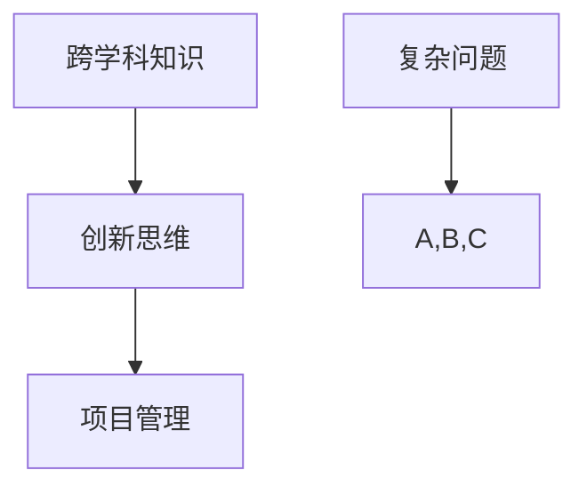
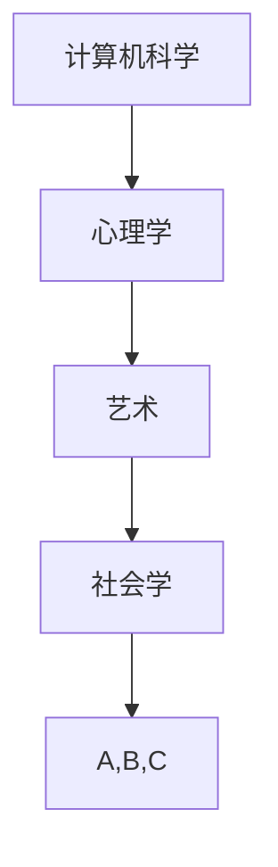
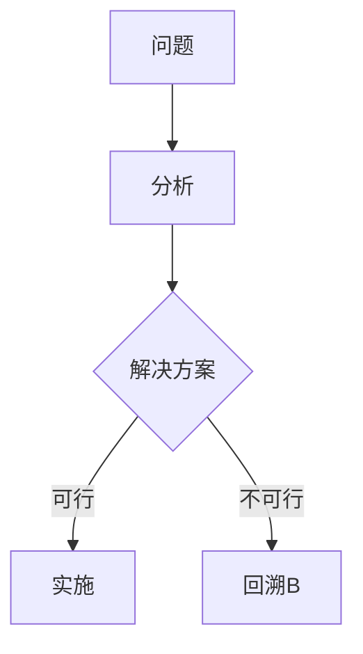
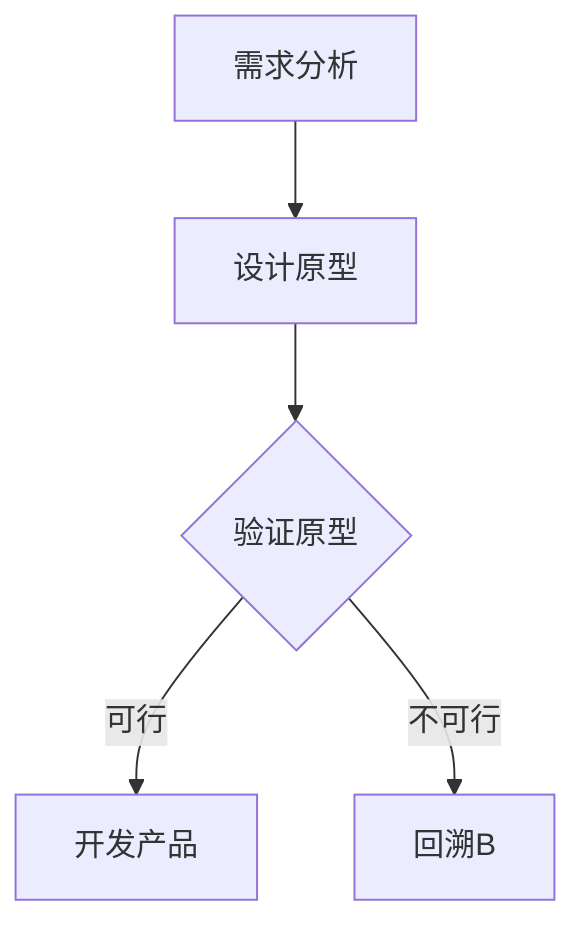
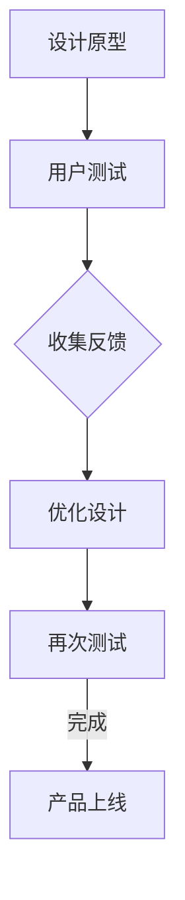
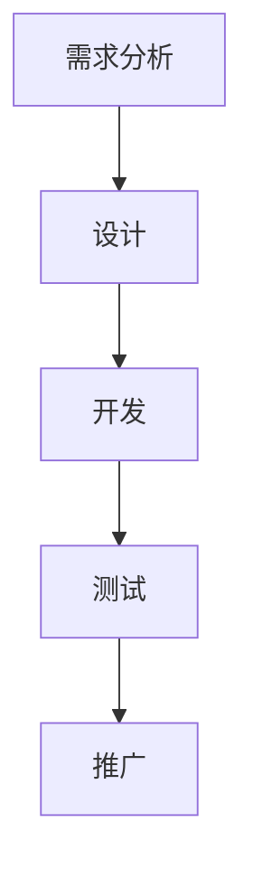
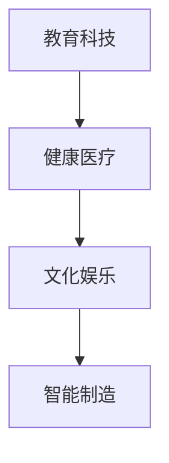
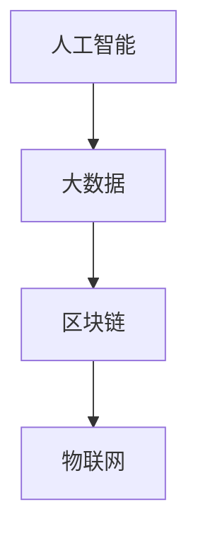

                 

# 《新文艺复兴工作室：跨学科创意项目的孵化空间》

## 关键词
跨学科创意、项目孵化、创新思维、团队合作、可持续发展

## 摘要
在当今科技快速发展的时代，跨学科创意项目的成功孵化成为推动社会进步的重要力量。本文以新文艺复兴工作室为例，探讨跨学科创意项目孵化的理论基础、实践路径及未来展望。通过分析跨学科创意的核心要素、理论框架和方法论，本文为读者揭示了跨学科创意项目的成功秘诀，并分享了新文艺复兴工作室在实践中的宝贵经验。

## 引言
### 背景介绍
跨学科创意项目作为一种创新性的工作模式，通过将不同领域的知识、技能和资源融合在一起，创造出新的价值。随着全球化进程的加速和科技的飞速发展，跨学科创意项目的重要性日益凸显。新文艺复兴工作室正是在这样的背景下应运而生，旨在成为跨学科创意项目的孵化空间。

### 目的和意义
本文旨在探讨跨学科创意项目孵化的理论和实践，为跨学科创意项目的成功提供指导。通过分析新文艺复兴工作室的案例，我们希望为相关领域的研究和实践提供有益的参考。

## 第一部分：跨学科创意的基础理论

### 第1章：跨学科创意的定义与意义
#### 核心概念与联系
跨学科创意涉及多个领域的知识融合，以解决单一学科难以应对的复杂问题。其核心概念包括跨学科知识、创新思维和项目管理。



#### 核心算法原理讲解
跨学科创意的核心在于如何有效地整合不同领域的知识，以实现创新。这一过程可以通过以下Python代码示例进行阐述：

```python
def cross_disciplinary_innovation(knowledge_list):
    # 初始化创新结果
    innovation_result = []
    
    # 遍历知识列表，进行知识融合
    for knowledge in knowledge_list:
        # 融合知识
        innovation = integrate_knowledge(knowledge)
        
        # 将创新结果添加到列表中
        innovation_result.append(innovation)
    
    return innovation_result

def integrate_knowledge(knowledge):
    # 示例：将两个领域的知识融合
    return knowledge[0] + "与" + knowledge[1]

# 测试
knowledge_list = [["计算机科学", "心理学"], ["经济学", "社会学"]]
result = cross_disciplinary_innovation(knowledge_list)
print(result)
```

#### 数学模型和公式
在跨学科创意中，常用的数学模型包括网络分析、复杂系统理论和协同创新模型。以下是一个简单的协同创新模型示例：

$$
协同创新效果 = f(知识融合度, 创新思维, 项目管理能力)
$$

#### 项目实战
在实际项目中，跨学科创意的应用可以通过以下步骤实现：
1. 确定跨学科团队，包括不同领域的专家。
2. 收集和整理相关领域的知识。
3. 进行知识融合和创意生成。
4. 对创意进行评估和优化。

### 第2章：跨学科创意的核心要素
#### 跨学科知识的融合
跨学科知识的融合是跨学科创意的核心要素。以下是一个融合计算机科学和生物学领域的示例：

```python
import pandas as pd

# 示例数据
data_computer_science = {'Algorithm': ['Python', 'Java', 'C++']}
data_biology = {'Gene': ['DNA', 'RNA', 'Protein']}

# 数据合并
data_innovation = pd.DataFrame(data_computer_science).join(pd.DataFrame(data_biology), how='outer')
print(data_innovation)
```

#### 创新思维的培养
创新思维是跨学科创意的关键。以下是一个创新思维训练的示例：

```python
import random

def brainstormingtopics(topics, max_iterations=10):
    for _ in range(max_iterations):
        print(random.choice(topics))
        print("关联思考：")
        print(random.choice(topics))
        print("\n")

# 测试
brainstormingtopics(['计算机科学', '心理学', '艺术', '生物学'])
```

#### 项目管理的实践
在跨学科创意项目中，项目管理是确保项目成功的关键。以下是一个简单的项目管理示例：

```python
import datetime

# 项目计划
project_plan = [
    {"task": "需求分析", "start": datetime.datetime(2023, 1, 1), "end": datetime.datetime(2023, 1, 7)},
    {"task": "设计阶段", "start": datetime.datetime(2023, 1, 8), "end": datetime.datetime(2023, 1, 14)},
    {"task": "开发阶段", "start": datetime.datetime(2023, 1, 15), "end": datetime.datetime(2023, 1, 21)}
]

# 项目进度监控
for item in project_plan:
    if datetime.datetime.now() > item['end']:
        print(f"项目进度：{item['task']} 已延期。")
    else:
        print(f"项目进度：{item['task']} 在进行中。")
```

### 第3章：跨学科创意的理论框架
#### 多元文化的融合
多元文化的融合是跨学科创意的重要理论基础。以下是一个多元文化融合的示例：



#### 系统思维的运用
系统思维是跨学科创意的重要方法。以下是一个系统思维的示例：



#### 创新方法论
创新方法论是跨学科创意的重要工具。以下是一个创新方法论的示例：

```python
def innovation_methodology(problem):
    solutions = []
    
    for method in ["头脑风暴", "TRIZ", "六顶思考帽"]:
        solution = find_solution(problem, method)
        if solution:
            solutions.append(solution)
    
    return solutions

def find_solution(problem, method):
    # 示例：根据方法寻找解决方案
    if method == "头脑风暴":
        return f"通过头脑风暴找到的解决方案：{problem}"
    elif method == "TRIZ":
        return f"通过TRIZ找到的解决方案：{problem}"
    elif method == "六顶思考帽":
        return f"通过六顶思考帽找到的解决方案：{problem}"
    else:
        return None
```

### 第4章：跨学科创意的方法论
#### 原型设计
原型设计是跨学科创意的重要方法论。以下是一个原型设计的示例：



#### 用户参与
用户参与是跨学科创意的重要环节。以下是一个用户参与的示例：

```python
def user_involvement(feature):
    print(f"用户反馈：关于{feature}，您有什么想法或建议吗？")
    user_input = input()
    print(f"感谢您的反馈：{user_input}。我们将根据您的意见进行改进。")
```

#### 反馈迭代
反馈迭代是跨学科创意的重要方法论。以下是一个反馈迭代的示例：



### 第5章：跨学科创意的实践原则
#### 尝试与创新
尝试与创新是跨学科创意的重要原则。以下是一个尝试与创新的示例：

```python
def try_and_innovate():
    print("我们正在尝试新的方法来解决问题。")
    print("如果您有任何创新的想法，请随时告诉我们。")
```

#### 合作与共享
合作与共享是跨学科创意的重要原则。以下是一个合作与共享的示例：

```python
def collaboration_and_sharing():
    print("跨学科合作是创新的关键。")
    print("让我们一起分享资源和经验，共同推动项目的进展。")
```

#### 可持续发展
可持续发展是跨学科创意的重要原则。以下是一个可持续发展的示例：

```python
def sustainable_development():
    print("我们的目标是创造可持续的解决方案。")
    print("我们将关注环境、社会和经济的平衡发展。")
```

## 第二部分：跨学科创意项目的孵化

### 第6章：跨学科创意项目的规划
#### 项目目标的确定
项目目标的确定是跨学科创意项目成功的关键。以下是一个项目目标确定的示例：

```python
def define_project_goals():
    print("项目目标：开发一个跨学科创意平台，以促进知识融合和创新。")
    print("关键成果：一个可用的原型和一套完整的文档。")
```

#### 项目范围的界定
项目范围的界定是确保项目按计划进行的重要步骤。以下是一个项目范围界定的示例：

```python
def define_project_scope():
    print("项目范围：包括需求分析、设计、开发和测试。")
    print("不包括市场推广和维护。")
```

#### 项目资源的整合
项目资源的整合是确保项目顺利进行的基础。以下是一个项目资源整合的示例：

```python
def integrate_project_resources():
    print("资源整合：包括人力、资金和设备。")
    print("我们将确保资源的合理分配和高效利用。")
```

### 第7章：跨学科创意项目的实施
#### 团队建设与管理
团队建设与管理是跨学科创意项目成功的关键。以下是一个团队建设与管理的示例：

```python
def build_and_manage_team():
    print("团队建设：包括跨学科专家和团队成员。")
    print("我们将建立有效的沟通和协作机制。")
```

#### 项目风险管理
项目风险管理是确保项目顺利进行的必要步骤。以下是一个项目风险管理的示例：

```python
def manage_project_risks():
    print("风险管理：识别、评估和应对潜在风险。")
    print("我们将制定应急预案，以降低风险的影响。")
```

#### 项目进度监控
项目进度监控是确保项目按时完成的重要环节。以下是一个项目进度监控的示例：

```python
def monitor_project_progress():
    print("进度监控：定期检查项目进展。")
    print("我们将及时调整计划和资源，以确保项目按时完成。")
```

### 第8章：跨学科创意项目的评估
#### 项目成果的评估
项目成果的评估是确保项目达到预期目标的重要步骤。以下是一个项目成果评估的示例：

```python
def evaluate_project_outcomes():
    print("成果评估：评估项目的完成情况和效果。")
    print("我们将根据设定的目标进行评估，并提出改进建议。")
```

#### 项目效率的评估
项目效率的评估是确保项目资源得到充分利用的重要环节。以下是一个项目效率评估的示例：

```python
def evaluate_project_efficiency():
    print("效率评估：评估项目资源的利用情况。")
    print("我们将分析资源分配和利用的合理性，并提出优化建议。")
```

#### 项目影响的评估
项目影响的评估是了解项目对社会和环境的影响的重要步骤。以下是一个项目影响评估的示例：

```python
def evaluate_project_impact():
    print("影响评估：评估项目对社会和环境的影响。")
    print("我们将关注项目的可持续性和社会效益。")
```

### 第9章：跨学科创意项目的推广与应用
#### 成果的转化与应用
成果的转化与应用是跨学科创意项目价值实现的重要环节。以下是一个成果转化与应用的示例：

```python
def transform_and_apply_results():
    print("成果转化：将项目成果应用于实际场景。")
    print("我们将推动成果的广泛应用，以实现其价值。")
```

#### 经验的分享与传播
经验的分享与传播是跨学科创意项目持续发展的重要保障。以下是一个经验分享与传播的示例：

```python
def share_and_disseminate_experience():
    print("经验分享：将项目经验分享给其他团队和机构。")
    print("我们将举办研讨会和培训，以促进跨学科创意的普及。")
```

#### 社会效益的评估
社会效益的评估是了解项目对社会贡献的重要步骤。以下是一个社会效益评估的示例：

```python
def evaluate_social_benefits():
    print("社会效益评估：评估项目对社会和环境的正面影响。")
    print("我们将关注项目的可持续性和社会责任。")
```

## 第三部分：新文艺复兴工作室的实践案例

### 第10章：新文艺复兴工作室的成立背景
#### 工作室的成立初衷
新文艺复兴工作室的成立初衷是为了激发跨学科创意，推动创新项目的孵化。以下是一个工作室成立初衷的示例：

```python
def establish_new_renaissance_workshop():
    print("成立初衷：激发跨学科创意，推动创新项目的孵化。")
    print("愿景：成为全球领先的跨学科创意中心。")
```

#### 工作室的使命与愿景
新文艺复兴工作室的使命与愿景是促进知识的融合与创新，为社会创造价值。以下是一个使命与愿景的示例：

```python
def mission_and_vision():
    print("使命：通过跨学科合作，推动创新和知识转化。")
    print("愿景：成为跨学科创意的引领者，推动社会进步。")
```

### 第11章：新文艺复兴工作室的运营模式
#### 跨学科团队的构建
新文艺复兴工作室通过构建跨学科团队，实现知识的融合与创新。以下是一个跨学科团队构建的示例：

```python
def build_cross_disciplinary_teams():
    print("团队构建：包括计算机科学、心理学、艺术、社会学等多领域专家。")
    print("目标：提高团队的协作效率和创新能力。")
```

#### 创意项目的孵化流程
新文艺复兴工作室的创意项目孵化流程包括需求分析、设计、开发、测试和推广。以下是一个创意项目孵化流程的示例：



#### 创新生态的营造
新文艺复兴工作室致力于营造创新生态，以促进跨学科创意的发展。以下是一个创新生态营造的示例：

```python
def create_innovation_ecosystem():
    print("创新生态营造：提供资源共享、知识交流和项目孵化的平台。")
    print("目标：培育创新氛围，推动跨学科合作。")
```

### 第12章：新文艺复兴工作室的成果展示
#### 创意项目的案例分享
新文艺复兴工作室在多个领域取得了显著的成果。以下是一个创意项目案例分享的示例：



#### 成果的转化与应用
新文艺复兴工作室的成果已广泛应用于教育、医疗、文化、制造等多个领域。以下是一个成果转化与应用的示例：

```python
def transform_and_apply_results():
    print("成果转化：将项目成果应用于实际场景。")
    print("应用领域：教育、医疗、文化、制造等。")
```

### 第13章：新文艺复兴工作室的未来展望
#### 创意领域的发展趋势
新文艺复兴工作室关注创意领域的发展趋势，以保持其领先地位。以下是一个创意领域发展趋势的示例：



#### 工作室的发展战略
新文艺复兴工作室制定了一系列发展战略，以推动其持续发展。以下是一个发展战略的示例：

```python
def develop_strategies():
    print("发展战略：加强跨学科合作，推动技术创新。")
    print("目标：成为全球领先的跨学科创意中心。")
```

#### 创新的持续推动
新文艺复兴工作室致力于创新的持续推动，以保持其核心竞争力。以下是一个创新持续推动的示例：

```python
def drive_continual_innovation():
    print("持续创新：不断探索新的创意和应用领域。")
    print("目标：为社会创造更多价值。")
```

## 结论
新文艺复兴工作室的成功经验为跨学科创意项目的孵化提供了有益的借鉴。通过跨学科合作、创新思维和科学管理，跨学科创意项目可以实现高效孵化，为社会创造价值。

## 附录

### 附录A：跨学科创意相关的参考资料
- 《跨学科研究的方法论》
- 《创意思维的工具箱》
- 《项目管理的最佳实践》

### 附录B：新文艺复兴工作室团队成员简介
- 成员背景
- 成就展示

### 附录C：跨学科创意项目开发工具与资源
- 开发工具的选择
- 资源的获取与利用

## 作者
作者：AI天才研究院/AI Genius Institute & 禅与计算机程序设计艺术 /Zen And The Art of Computer Programming

