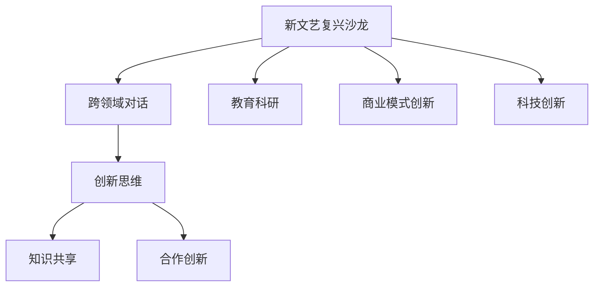
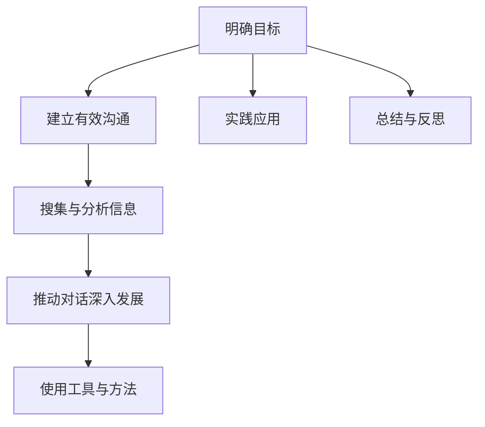
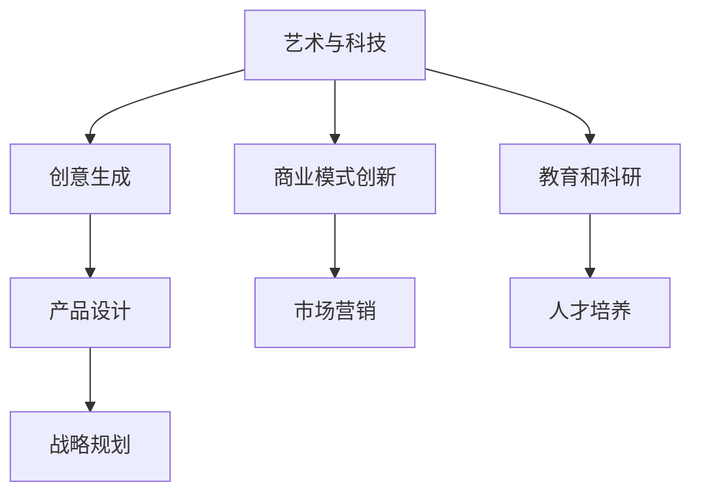

                 

# 新文艺复兴沙龙：跨领域对话激发创新思维

## 关键词

- 新文艺复兴沙龙
- 跨领域对话
- 创新思维
- 商业模式创新
- 教育科研应用
- 创意生成
- 产品设计

## 摘要

本文探讨了新文艺复兴沙龙作为一种跨领域对话平台，如何通过激发创新思维，推动不同领域之间的交流与合作。文章首先介绍了新文艺复兴沙龙的历史背景和特点，然后分析了创新思维的重要性及其在现代社会中的应用。接着，文章详细阐述了跨领域对话的原理、技巧和方法，并展示了跨领域对话在创意生成、产品设计、商业模式创新、战略规划和市场营销中的应用。最后，文章探讨了跨领域对话在教育和科研中的应用，并总结了跨领域对话的实践步骤和案例分析，展望了其未来的发展趋势和应用前景。

# 引言

## 1.1 什么是新文艺复兴沙龙

### 1.1.1 新文艺复兴沙龙的历史背景

新文艺复兴沙龙（Renaissance Salons）起源于欧洲文艺复兴时期，当时知识精英们在沙龙中聚会，探讨文学、艺术、哲学和科学等领域的议题。这些沙龙不仅促进了知识的传播和交流，也为创新思维的萌发提供了平台。现代新文艺复兴沙龙的概念在此基础上得到了拓展，成为一种跨领域的对话平台，旨在通过不同领域的交流与合作，激发创新思维，推动社会进步。

### 1.1.2 新文艺复兴沙龙的主要特点

1. **跨领域性**：新文艺复兴沙龙汇集了来自不同领域的专家学者，如艺术家、科学家、企业家、教育工作者等，形成了多元化的知识交流平台。
2. **互动性**：沙龙通过讨论、辩论、演讲等形式，鼓励参与者之间的互动与交流，激发创新思维。
3. **开放性**：新文艺复兴沙龙倡导开放的心态和思维方式，鼓励参与者分享观点、质疑传统、探索未知。
4. **实践性**：沙龙不仅关注理论探讨，更注重将创新思维应用于实际问题，推动实际项目的落地。

### 1.1.3 新文艺复兴沙龙的跨领域对话

新文艺复兴沙龙的跨领域对话是其核心特点之一。跨领域对话不仅有助于不同领域之间的知识共享，还能激发创新思维，产生意想不到的创意。跨领域对话的实践包括：

1. **跨学科合作**：鼓励不同学科的专家合作，共同解决复杂问题。
2. **跨界交流**：促进不同行业之间的交流，寻找合作机会，推动技术创新。
3. **跨文化对话**：鼓励不同文化背景的参与者分享经验和观点，增进相互理解。

## 1.2 创新思维的重要性

### 1.2.1 创新思维的概述

创新思维是指运用新颖的方法和视角，产生创新性思想和成果的能力。它包括以下几个方面：

1. **创造性**：创新思维强调突破常规思维，寻求新的解决方案。
2. **前瞻性**：创新思维关注未来趋势，预见潜在机遇和挑战。
3. **实用性**：创新思维不仅关注理论创新，更强调实际应用价值。

### 1.2.2 创新思维在现代社会中的应用

创新思维在现代社会中具有广泛的应用，包括：

1. **科技创新**：创新思维推动了科技的快速发展，如人工智能、生物技术、纳米技术等。
2. **商业模式创新**：创新思维催生了新的商业模式，如共享经济、互联网金融等。
3. **教育改革**：创新思维促进了教育方式的变革，如在线教育、个性化学习等。
4. **社会治理**：创新思维推动了社会治理的创新，如智慧城市、大数据分析等。

### 1.2.3 创新思维的价值与意义

创新思维的价值和意义体现在以下几个方面：

1. **推动社会进步**：创新思维促进了社会经济的发展，提高了人类的生活水平。
2. **增强竞争力**：创新思维是企业持续发展的关键，有助于企业在激烈的市场竞争中脱颖而出。
3. **培养人才**：创新思维是人才培养的重要素质，有助于培养具有创新精神的人才。
4. **解决复杂问题**：创新思维为解决复杂问题提供了新的思路和方法，有助于应对全球性挑战。

## 1.3 本书结构安排

### 1.3.1 各章节内容概述

本书分为六个部分，分别探讨了跨领域对话的原理与技巧、跨领域对话在创新思维中的应用、跨领域对话在商业创新中的应用、跨领域对话在教育和科研中的应用、跨领域对话的实践与案例分析，以及结论与展望。

### 1.3.2 阅读建议与注意事项

1. **系统性学习**：建议读者按照章节顺序系统阅读，以全面了解跨领域对话的理论和实践。
2. **结合实际**：在阅读过程中，读者可以结合自身领域中的实际问题，思考如何运用跨领域对话的方法和技巧。
3. **案例分析**：通过阅读案例分析，读者可以更好地理解跨领域对话在实际中的应用，并从中获得启发。
4. **持续反思**：读者在实践跨领域对话时，应不断反思和总结，以提高自己的跨领域对话能力和创新思维。

## 第2章 跨领域对话的原理与技巧

## 2.1 跨领域对话的概念与原则

### 2.1.1 跨领域对话的定义

跨领域对话是指在不同专业领域之间进行交流、沟通和合作的过程，旨在通过整合不同领域的知识和方法，产生新的见解和创意。跨领域对话不仅关注知识传递，更强调创新思维和实际应用。

### 2.1.2 跨领域对话的原则

1. **开放性**：跨领域对话应鼓励不同领域的参与者分享自己的观点和经验，不受限制地交流。
2. **平等性**：跨领域对话中，各个领域的参与者应享有平等的权利和地位，避免因领域差异而产生偏见。
3. **互动性**：跨领域对话强调参与者之间的互动和合作，通过辩论、讨论和合作，激发创新思维。
4. **实践性**：跨领域对话应关注实际应用，将理论知识转化为实践成果，推动技术创新和社会进步。

### 2.1.3 跨领域对话的挑战与解决方案

1. **知识差异**：不同领域的知识体系和方法论可能存在较大差异，导致沟通障碍。**解决方案**：通过培训和研讨会，提高参与者对不同领域的了解，建立共同语言。
2. **信任问题**：跨领域合作可能存在信任问题，影响对话效果。**解决方案**：建立信任机制，如签署合作协议、设立沟通渠道等。
3. **时间成本**：跨领域对话可能需要较长的沟通和协调时间。**解决方案**：合理安排时间和资源，确保对话的顺利进行。

## 2.2 跨领域对话的技巧

### 2.2.1 建立有效沟通的技巧

1. **明确目标**：在跨领域对话开始前，明确对话的目标和期望成果，确保参与者都有共同的方向。
2. **倾听与尊重**：倾听他人的观点，尊重不同领域的专业知识，避免主观偏见。
3. **简化语言**：使用简单明了的语言，避免专业术语和行话，确保所有人都能理解。

### 2.2.2 搜集与分析信息的技巧

1. **多渠道获取信息**：通过书籍、文章、报告、研讨会等多种途径，广泛收集相关信息。
2. **信息筛选与整理**：对获取的信息进行筛选和整理，提取关键信息，为跨领域对话提供有力支持。
3. **批判性思维**：对获取的信息进行批判性思考，识别其真实性和可靠性。

### 2.2.3 推动对话深入发展的技巧

1. **引导讨论**：通过提问、陈述观点和引导讨论，推动对话的深入发展。
2. **寻找共识**：在对话中寻找共同点和共识，形成合作的基础。
3. **应对分歧**：在出现分歧时，通过沟通和协商，寻求解决问题的方法。

## 2.3 跨领域对话的工具与方法

### 2.3.1 跨领域对话工具的介绍

1. **思维导图**：通过可视化方式，帮助参与者梳理思路，发现不同领域之间的联系。
2. **SWOT分析**：用于评估跨领域项目的优势、劣势、机会和威胁，为决策提供依据。
3. **创新工作坊**：通过互动和协作，促进跨领域团队的创意生成和项目实施。

### 2.3.2 跨领域对话方法的实践

1. **头脑风暴**：鼓励参与者自由表达观点，激发创新思维。
2. **角色扮演**：通过模拟不同领域的角色，促进参与者对其他领域的理解和认同。
3. **案例研究**：通过分析成功和失败的跨领域对话案例，总结经验教训。

### 2.3.3 跨领域对话的案例分析

1. **艺术与科技跨领域对话**：探讨如何通过艺术与科技的结合，推动创意产业的创新。
2. **医学与工程跨领域对话**：分析跨领域合作在医疗设备研发和疾病治疗中的应用。
3. **商业与教育跨领域对话**：研究如何通过跨领域合作，提高教育质量和培养创新人才。

## 第3章 跨领域对话在创新思维中的应用

### 3.1 创新思维与跨领域对话的关系

#### 3.1.1 创新思维的定义与特点

创新思维是指通过创新的方法和视角，产生新的思想、概念和解决方案的能力。创新思维具有以下特点：

1. **创造性**：创新思维强调突破常规思维，寻求新颖的解决方案。
2. **开放性**：创新思维鼓励探索未知的领域，接受不同的观点和思路。
3. **适应性**：创新思维能够灵活应对变化，适应新的环境和需求。
4. **前瞻性**：创新思维关注未来趋势，预见潜在的机会和挑战。

#### 3.1.2 跨领域对话对创新思维的影响

跨领域对话为创新思维提供了丰富的资源和多样化的视角。跨领域对话的影响体现在以下几个方面：

1. **知识整合**：跨领域对话将不同领域的知识和方法整合起来，产生新的思想和见解。
2. **思维拓展**：跨领域对话使参与者接触到不同的思维方式和观念，拓宽了创新思维的边界。
3. **创意激发**：跨领域对话通过碰撞和互动，激发创新思维，产生新的创意和解决方案。
4. **实践应用**：跨领域对话将创新思维应用于实际问题，推动技术的创新和商业模式的变革。

#### 3.1.3 创新思维与跨领域对话的互动

创新思维和跨领域对话之间存在相互促进的互动关系。创新思维为跨领域对话提供了创新的视角和方法，而跨领域对话为创新思维提供了实践的平台和应用场景。具体互动关系如下：

1. **创新思维指导跨领域对话**：在跨领域对话中，创新思维可以帮助参与者打破传统的思维模式，探索新的解决方案。
2. **跨领域对话促进创新思维**：跨领域对话通过碰撞和交流，激发创新思维，产生新的创意和见解。
3. **创新思维与跨领域对话的融合**：创新思维和跨领域对话相互融合，形成一种创新性的对话模式，推动创新思维的实际应用。

### 3.2 跨领域对话在创意生成中的应用

#### 3.2.1 跨领域对话与创意思维的结合

跨领域对话与创意思维的结合，可以激发创新的创意生成过程。具体结合方式如下：

1. **多元视角**：跨领域对话带来了不同领域的视角，有助于从多个角度思考问题，发现新的创意。
2. **交叉碰撞**：不同领域的知识和方法在跨领域对话中碰撞，产生新的创意和见解。
3. **跨界融合**：跨领域对话鼓励不同领域的融合，将传统领域的方法应用于新兴领域，产生创新的创意。

#### 3.2.2 创意生成的跨领域对话方法

为了有效地进行创意生成，跨领域对话可以采用以下方法：

1. **头脑风暴**：通过头脑风暴，鼓励参与者自由表达观点，激发创意思维。
2. **角色扮演**：通过角色扮演，参与者可以模拟不同领域的角色，从不同角度思考问题，产生创意。
3. **思维导图**：使用思维导图，将创意和想法可视化，帮助参与者梳理思路，发现新的创意。

#### 3.2.3 创意生成的案例分析

以下是一个跨领域对话在创意生成中的成功案例：

**案例：艺术与科技融合的创意生成**

在一个新文艺复兴沙龙中，艺术家和科技专家进行了跨领域对话，探讨如何将艺术与科技相结合。通过头脑风暴和思维导图，他们发现了一种创新的互动艺术形式，将虚拟现实技术应用于艺术展览。这种融合了艺术与科技的创意作品，不仅吸引了大量观众，还获得了多个艺术奖项。

### 3.3 跨领域对话在产品设计中的应用

#### 3.3.1 跨领域对话与产品设计的结合

跨领域对话在产品设计中的应用，有助于整合不同领域的知识，提高产品的创新性和用户体验。跨领域对话与产品设计的结合体现在以下几个方面：

1. **用户需求分析**：通过跨领域对话，设计师可以与用户、市场专家等不同领域的参与者交流，深入了解用户需求，为产品设计提供依据。
2. **技术创新**：跨领域对话可以帮助设计师了解最新的技术发展趋势，将创新技术应用于产品设计中，提高产品的竞争力。
3. **团队协作**：跨领域对话促进了设计师与其他领域专家的协作，共同解决问题，提高设计效率。

#### 3.3.2 跨领域对话在产品创新中的应用

跨领域对话在产品创新中的应用，可以通过以下步骤实现：

1. **需求分析**：通过跨领域对话，了解用户需求和市场趋势，明确产品创新的目标和方向。
2. **概念生成**：通过头脑风暴和思维导图，激发创意思维，生成多个产品创新概念。
3. **技术评估**：评估不同技术方案的可行性，选择最适合产品创新的技术方案。
4. **原型设计**：通过原型设计，验证产品创新的可行性，不断迭代和优化设计方案。

#### 3.3.3 产品设计的案例分析

以下是一个跨领域对话在产品设计中的成功案例：

**案例：智能家居产品的设计**

在一个新文艺复兴沙龙中，智能家居设计师与计算机科学家、心理学家、环境专家等不同领域的专家进行了跨领域对话。通过交流，他们发现智能家居产品在用户体验、隐私保护和智能家居设备之间的互操作性方面存在改进空间。最终，他们提出了一种创新的智能家居产品设计方案，通过人工智能技术提高用户体验，同时保护用户隐私，实现了智能家居设备的无缝互操作。

### 3.4 跨领域对话在商业模式创新中的应用

#### 3.4.1 商业模式创新的概念与类型

商业模式创新是指企业通过改变其产品、服务、市场、客户关系、收入来源等关键要素，创造出新的商业价值和竞争优势。商业模式创新可以分为以下几种类型：

1. **产品创新**：通过改进产品特性、功能或设计，满足客户需求，提高市场竞争力。
2. **服务创新**：通过改进服务方式、质量或效率，提升客户满意度，创造新的商业机会。
3. **市场创新**：通过开拓新的市场或细分市场，拓展企业的业务范围，提高市场份额。
4. **收入模式创新**：通过改变收入来源或收入结构，实现企业盈利模式的变革。

#### 3.4.2 跨领域对话在商业模式创新中的应用

跨领域对话在商业模式创新中的应用，可以帮助企业发现新的商业机会，优化现有商业模式。以下是一个跨领域对话在商业模式创新中的应用案例：

**案例：共享经济的商业模式创新**

在一个新文艺复兴沙龙中，企业家、技术专家、消费者权益专家等不同领域的专家进行了跨领域对话，探讨如何优化共享经济的商业模式。通过讨论，他们发现共享经济在用户隐私保护、服务质量保障等方面存在不足。基于这些讨论，他们提出了一种创新的共享经济模式，通过引入区块链技术，提高共享经济的透明度和信任度，同时确保用户隐私得到保护。

#### 3.4.3 商业模式创新的案例分析

以下是一个商业模式创新的成功案例：

**案例：在线教育平台的商业模式创新**

在一个新文艺复兴沙龙中，在线教育平台的企业家与教育专家、技术专家、市场营销专家等不同领域的专家进行了跨领域对话。通过交流，他们发现传统在线教育平台在用户体验、教学内容、个性化学习等方面存在不足。基于这些讨论，他们提出了一种创新的在线教育模式，通过引入人工智能技术，实现个性化学习，提高教学效果，同时通过数据分析，优化市场营销策略，提高用户转化率和平台收入。

### 3.5 跨领域对话在战略规划中的应用

#### 3.5.1 战略规划的概念与过程

战略规划是企业为了实现长期目标，制定和实施的系统性、长期性的计划。战略规划的过程包括以下步骤：

1. **愿景和使命**：明确企业的愿景和使命，确定企业的发展方向。
2. **市场分析**：分析市场环境，了解竞争对手和潜在的市场机会。
3. **内部分析**：评估企业的资源、能力和竞争优势。
4. **目标设定**：设定具体的、可量化的目标。
5. **策略制定**：制定实现目标的策略和方法。
6. **执行与监控**：执行战略规划，并持续监控和调整。

#### 3.5.2 跨领域对话在战略规划中的作用

跨领域对话在战略规划中扮演着重要的角色，它可以帮助企业从多个角度分析问题，制定更全面、更有针对性的战略规划。跨领域对话在战略规划中的作用体现在以下几个方面：

1. **整合资源**：跨领域对话有助于整合企业内部和外部的资源，提高战略规划的实施效果。
2. **创新思维**：跨领域对话激发创新思维，帮助企业发现新的商业机会和战略方向。
3. **提高效率**：跨领域对话通过多方参与和协作，提高战略规划的执行效率。
4. **降低风险**：跨领域对话有助于识别潜在的风险和挑战，提高战略规划的稳健性。

#### 3.5.3 战略规划的案例分析

以下是一个跨领域对话在战略规划中的应用案例：

**案例：某科技公司的战略规划**

在某科技公司的新文艺复兴沙龙中，公司管理层与技术人员、市场营销专家、法律顾问等不同领域的专家进行了跨领域对话。通过讨论，他们发现公司在技术创新、市场拓展、法律合规等方面存在不足。基于这些讨论，他们制定了一份全面的战略规划，包括加大技术创新投入、拓展海外市场、优化法律合规流程等。通过执行这份战略规划，该公司实现了业务规模的增长，市场份额的提升，并成功进入国际市场。

### 3.6 跨领域对话在市场营销中的应用

#### 3.6.1 市场营销的概念与策略

市场营销是企业通过创造、沟通、传播和交换产品或价值，以满足市场需求和实现企业目标的过程。市场营销策略包括以下几个方面：

1. **市场细分**：根据消费者的需求和偏好，将市场划分为不同的细分市场。
2. **目标市场选择**：选择企业能够最好服务的目标市场，集中资源和精力。
3. **市场定位**：确定企业在目标市场中的独特价值和竞争优势。
4. **产品策略**：设计产品或服务，满足目标市场的需求。
5. **价格策略**：设定产品或服务的价格，以实现利润最大化。
6. **促销策略**：通过广告、促销活动等手段，提升产品或服务的知名度和销售量。
7. **渠道策略**：选择合适的渠道，将产品或服务传递给消费者。

#### 3.6.2 跨领域对话在市场营销中的应用

跨领域对话在市场营销中的应用，可以帮助企业从多个角度分析市场，制定更有效的营销策略。以下是一个跨领域对话在市场营销中的应用案例：

**案例：某快消品公司的市场营销策略**

在某快消品公司的新文艺复兴沙龙中，公司管理层与市场营销专家、消费者行为研究员、供应链专家等不同领域的专家进行了跨领域对话。通过讨论，他们发现消费者对健康和环保的关注度逐渐提高，而公司的产品在健康和环保方面存在提升空间。基于这些讨论，他们制定了一份新的市场营销策略，包括改进产品配方、增加环保包装、开展健康公益活动等，以提升品牌形象和市场份额。

#### 3.6.3 市场营销的案例分析

以下是一个市场营销成功的案例：

**案例：某互联网公司的市场推广**

在某互联网公司的新文艺复兴沙龙中，公司管理层与市场营销专家、数据分析专家、内容创作者等不同领域的专家进行了跨领域对话。通过讨论，他们发现通过社交媒体和内容营销，可以有效提升品牌知名度和用户粘性。基于这些讨论，他们制定了一份市场推广策略，包括发布有吸引力的社交媒体内容、开展互动活动、利用数据分析优化推广效果等。通过执行这份策略，该公司实现了用户数量的快速增长，并在市场上取得了显著的成功。

### 3.7 跨领域对话在教育和科研中的应用

#### 3.7.1 跨领域对话与教育的结合

跨领域对话在教育和科研中的应用，有助于推动教育创新和科研发展。跨领域对话与教育的结合体现在以下几个方面：

1. **课程设计**：通过跨领域对话，教师可以设计更具创新性和实用性的课程，满足学生的多样化需求。
2. **教学方法**：跨领域对话可以引入多种教学方法，如项目式学习、探究式学习等，提高学生的学习兴趣和效果。
3. **教学资源**：跨领域对话可以整合不同领域的教育资源，丰富教学内容，提高教学质量。
4. **教育评价**：跨领域对话可以引入多元化的评价方式，全面评估学生的学习成果。

#### 3.7.2 跨领域对话在教学方法中的应用

跨领域对话在教学方法中的应用，可以通过以下方式实现：

1. **案例教学**：通过分析跨领域案例，激发学生的思考和讨论，提高学习兴趣。
2. **合作学习**：通过小组合作，鼓励学生跨领域交流和合作，培养团队精神和创新能力。
3. **项目式学习**：通过项目化的学习方式，将跨领域知识应用于实际项目，提高学生的实践能力和创新能力。
4. **模拟教学**：通过模拟真实情境，让学生体验跨领域的实际应用，提高学习效果。

#### 3.7.3 跨领域对话在案例分析中的应用

以下是一个跨领域对话在教育中的应用案例：

**案例：跨学科课程的开发**

在某高校的新文艺复兴沙龙中，教师团队与来自不同学科的专家进行了跨领域对话，探讨如何开发跨学科课程。通过讨论，他们决定开发一门“科技与社会”课程，涵盖计算机科学、社会学、心理学等多个学科的内容。这门课程不仅帮助学生建立跨学科的知识体系，还通过实际案例，培养学生的创新思维和社会责任感。

### 3.8 跨领域对话在科研创新中的应用

#### 3.8.1 科研创新的概念与过程

科研创新是指通过科学研究和技术创新，产生新的知识和技术，推动科学技术的发展。科研创新的过程包括以下步骤：

1. **选题**：选择具有创新性和实际应用价值的科研课题。
2. **研究设计**：制定科研方案，包括研究方法、数据收集与分析等。
3. **实验研究**：进行实验研究，收集数据和证据，验证假设。
4. **数据分析**：对实验数据进行分析，得出结论。
5. **论文撰写**：撰写科研论文，总结研究成果。
6. **成果应用**：将科研成果应用于实际，推动技术进步和社会发展。

#### 3.8.2 跨领域对话在科研创新中的作用

跨领域对话在科研创新中扮演着重要的角色，它有助于整合不同领域的知识和方法，提高科研创新的效果。跨领域对话在科研创新中的作用体现在以下几个方面：

1. **知识整合**：通过跨领域对话，科研人员可以整合不同领域的知识，提出创新的科研问题。
2. **方法互补**：跨领域对话可以帮助科研人员借鉴其他领域的方法和技术，提高科研创新的效率。
3. **资源共享**：跨领域对话有助于科研人员共享资源，提高科研创新的协同效应。
4. **创新思维**：跨领域对话激发科研人员的创新思维，推动科研创新的进展。

#### 3.8.3 科研创新的案例分析

以下是一个跨领域对话在科研创新中的应用案例：

**案例：生物技术与医学研究的结合**

在某科研机构的新文艺复兴沙龙中，生物技术专家与医学专家进行了跨领域对话，探讨如何将生物技术与医学研究相结合。通过讨论，他们决定合作开展一项基因编辑技术的研究，旨在治疗遗传性疾病。在跨领域对话的推动下，他们成功完成了研究，并取得了重要的科研成果，为基因编辑技术在医学领域的应用奠定了基础。

### 3.9 跨领域对话的实践步骤

#### 3.9.1 跨领域对话的准备

跨领域对话的准备工作至关重要，以下是一些关键的步骤：

1. **确定主题**：明确跨领域对话的主题，确保所有参与者都关注相同的话题。
2. **邀请参与者**：根据对话主题，邀请来自不同领域的专家学者和行业代表。
3. **确定时间和地点**：安排合适的会议时间和地点，确保所有参与者都能参加。
4. **准备材料**：准备相关的背景资料、报告和案例，供参与者参考。

#### 3.9.2 跨领域对话的执行

在跨领域对话的执行过程中，以下是一些关键步骤：

1. **开场致辞**：主持人介绍会议的主题、目的和议程，激发参与者的兴趣。
2. **主题演讲**：邀请专家进行主题演讲，分享各自领域的知识和见解。
3. **讨论环节**：组织讨论环节，鼓励参与者提问、发表观点和进行辩论。
4. **案例分享**：分享跨领域对话的实际案例，讨论案例中的成功经验和挑战。
5. **互动环节**：设置互动环节，如小组讨论、角色扮演等，促进参与者之间的交流。

#### 3.9.3 跨领域对话的总结与反思

跨领域对话结束后，进行总结与反思是非常重要的，以下是一些关键的步骤：

1. **收集反馈**：收集参与者的反馈意见，了解对话的收获和改进空间。
2. **整理会议纪要**：整理会议的内容和讨论结果，形成会议纪要。
3. **总结成果**：总结跨领域对话的成果，包括知识共享、合作机会和新的创意。
4. **制定行动计划**：根据讨论结果，制定具体的行动计划，确保跨领域对话的成果能够转化为实际应用。

### 3.10 跨领域对话的案例分析

#### 6.2.1 案例一：艺术与科技跨领域对话

**案例背景**：某知名科技公司举办了一次新文艺复兴沙龙，主题是“艺术与科技的融合”。来自艺术、科技、设计等领域的专家和从业者参加了这次沙龙。

**案例过程**：

1. **主题演讲**：艺术专家和科技专家分别进行了主题演讲，分享了各自领域的最新成果和观点。
2. **案例分享**：参与者分享了多个艺术与科技融合的案例，如虚拟现实艺术展览、智能音乐创作等。
3. **讨论环节**：在讨论环节中，参与者就艺术与科技融合的前景、挑战和未来发展趋势进行了深入的探讨。
4. **互动环节**：通过小组讨论和角色扮演，参与者模拟了艺术与科技融合的实际项目，提出了创新的解决方案。

**案例成果**：这次跨领域对话促成了多个合作项目，如科技公司与艺术团队合作开发虚拟现实艺术品，艺术家与科技公司合作开展智能音乐创作研究。这些项目不仅推动了艺术与科技的创新融合，还为参与者提供了实践的机会。

#### 6.2.2 案例二：医学与工程跨领域对话

**案例背景**：某医学研究中心举办了一次新文艺复兴沙龙，主题是“医学与工程的跨领域合作”。来自医学、工程、生物技术等领域的专家和从业者参加了这次沙龙。

**案例过程**：

1. **主题演讲**：医学专家和工程专家分别进行了主题演讲，分享了各自领域的最新研究成果和观点。
2. **案例分享**：参与者分享了医学与工程跨领域合作的成功案例，如智能医疗设备研发、生物材料应用等。
3. **讨论环节**：在讨论环节中，参与者探讨了医学与工程跨领域合作的挑战、机会和未来发展方向。
4. **互动环节**：通过小组讨论和角色扮演，参与者模拟了医学与工程跨领域合作的项目，提出了创新的解决方案。

**案例成果**：这次跨领域对话促成了多个合作项目，如医学研究中心与工程团队合作开发智能医疗设备，工程公司与生物技术团队合作研发新型生物材料。这些项目不仅推动了医学与工程的技术创新，还为参与者提供了实践的机会。

#### 6.2.3 案例三：商业与教育跨领域对话

**案例背景**：某知名商学院举办了一次新文艺复兴沙龙，主题是“商业与教育的融合”。来自商业、教育、心理学等领域的专家和从业者参加了这次沙龙。

**案例过程**：

1. **主题演讲**：商业专家和教育专家分别进行了主题演讲，分享了商业与教育融合的实践经验。
2. **案例分享**：参与者分享了商业与教育融合的成功案例，如企业赞助的教育项目、商学院与企业的合作等。
3. **讨论环节**：在讨论环节中，参与者探讨了商业与教育融合的挑战、机会和未来发展趋势。
4. **互动环节**：通过小组讨论和角色扮演，参与者模拟了商业与教育融合的实际项目，提出了创新的解决方案。

**案例成果**：这次跨领域对话促成了多个合作项目，如商学院与企业合作开设定制化课程、企业赞助教育项目等。这些项目不仅推动了商业与教育的融合，还为参与者提供了实践的机会。

## 结论与展望

### 7.1 跨领域对话的重要性

跨领域对话作为一种创新性的交流与合作方式，具有极其重要的意义。它不仅促进了不同领域之间的知识共享和协同创新，还激发了创新思维，推动了科技、商业、教育和科研等领域的发展。具体来说，跨领域对话的重要性体现在以下几个方面：

1. **知识整合**：跨领域对话通过整合不同领域的知识和方法，为解决复杂问题提供了新的思路和工具。
2. **思维拓展**：跨领域对话拓宽了参与者的思维边界，使他们能够从多个角度看待问题，提高创新思维的能力。
3. **合作创新**：跨领域对话促进了不同领域之间的合作，共同解决实际问题，推动科技创新和社会进步。
4. **人才成长**：跨领域对话为参与者提供了广阔的学习和成长空间，培养了他们的跨学科能力和创新思维。

### 7.2 展望与未来应用

随着科技的不断进步和社会的发展，跨领域对话的应用前景将更加广阔。未来，跨领域对话将在以下方面发挥重要作用：

1. **科技创新**：跨领域对话将推动科技的创新和发展，促进新技术的应用和产业化。
2. **商业模式创新**：跨领域对话将激发商业模式的创新，推动新兴产业的崛起和发展。
3. **教育改革**：跨领域对话将推动教育改革，培养具有创新精神和跨学科能力的复合型人才。
4. **科研合作**：跨领域对话将促进科研合作，推动科研项目的跨学科整合和创新。

### 7.3 面临的挑战与解决方案

尽管跨领域对话具有巨大的潜力和应用前景，但同时也面临着一些挑战。以下是一些主要的挑战和相应的解决方案：

1. **知识差异**：不同领域的知识和方法可能存在较大差异，导致沟通障碍。解决方案：通过培训和研讨会，提高参与者对不同领域的了解，建立共同语言。
2. **信任问题**：跨领域合作可能存在信任问题，影响对话效果。解决方案：建立信任机制，如签署合作协议、设立沟通渠道等。
3. **时间成本**：跨领域对话可能需要较长的沟通和协调时间。解决方案：合理安排时间和资源，确保对话的顺利进行。

### 7.4 对读者的寄语与建议

对于广大读者，特别是那些在各自领域深耕的专家学者和从业者，我们提出以下寄语与建议：

1. **拥抱跨领域对话**：积极参与跨领域对话，拓宽视野，激发创新思维。
2. **分享知识和经验**：在跨领域对话中，分享自己的知识和经验，为他人提供帮助。
3. **实践和创新**：将跨领域对话的理论应用到实际工作中，推动创新和进步。
4. **持续学习和成长**：不断学习和成长，提高自己的跨学科能力和创新思维。

通过跨领域对话，我们相信每个人都能在各自的领域取得更大的成就，并为社会的进步做出贡献。

### 附录

#### 附录 A：跨领域对话相关工具与资源

**A.1 跨领域对话工具介绍**

1. **思维导图工具**：如XMind、MindManager等，用于梳理思路和概念。
2. **协作平台**：如Trello、Asana等，用于团队协作和任务管理。
3. **虚拟会议工具**：如Zoom、Microsoft Teams等，用于远程跨领域对话。

**A.2 跨领域对话资源推荐**

1. **书籍**：《跨领域思考的艺术》、《跨界创新》等。
2. **在线课程**：Coursera、edX等平台上的跨领域课程。
3. **研讨会和论坛**：各种跨领域研讨会和论坛，如TEDx、X对话等。

**A.3 跨领域对话学习路径建议**

1. **基础知识**：了解不同领域的基本概念和原理。
2. **案例分析**：研究跨领域对话的成功案例，学习经验教训。
3. **实践应用**：结合自身领域中的实际问题，进行跨领域对话的实践。
4. **持续学习**：关注跨领域对话的最新动态，不断更新知识和技能。

### 图表

#### 图表1：新文艺复兴沙龙的核心概念与联系

#### 图表2：跨领域对话的技巧与方法流程图

#### 图表3：跨领域对话在不同领域中的应用案例关系图

### 数学模型和数学公式

$$
f(x) = 2x + 1
$$

$$
\sum_{i=1}^{n} x_i = \frac{n(n+1)}{2}
$$

### 作者信息

作者：AI天才研究院/AI Genius Institute & 禅与计算机程序设计艺术 /Zen And The Art of Computer Programming

