                 

# 新文艺复兴自学计划：全方位发展的个人教育方案

## 摘要

在数字化和信息化的时代浪潮中，传统的教育模式逐渐显露出其局限性。新文艺复兴自学计划应运而生，旨在通过全方位发展的个人教育方案，助力个人在知识、能力、情感和社会等多个维度实现自我提升和全面发展。本文将探讨新文艺复兴的背景与意义、核心概念、个人教育目标、知识体系构建、学科交叉与创新、自我认知与提升、社交与人际交往能力的培养，以及身心健康与平衡发展等方面，为读者提供一套系统、全面的自学方案。同时，本文还将展望未来教育的发展趋势和个人职业规划，帮助读者更好地适应时代变迁，实现个人价值的最大化。

## 前言

### 1. 新文艺复兴的背景与意义

#### 1.1 新文艺复兴的时代背景

随着互联网、大数据、人工智能等技术的迅猛发展，信息传播方式、知识获取途径和人们的生活方式发生了深刻变革。传统的教育模式逐渐无法满足个体多样化的学习需求和社会对高素质人才的需求。在此背景下，新文艺复兴应运而生，它不仅是对文艺复兴的继承和发扬，更是对现代教育的一次深刻反思和改革。

新文艺复兴倡导的是一种跨学科、跨领域、跨文化的综合性教育理念，强调个体在知识、能力、情感和社会等多个维度上的全面发展。这种教育理念与当今社会对人才的复合型需求高度契合，有助于培养具备创新能力、批判性思维和跨文化沟通能力的复合型人才。

#### 1.2 新文艺复兴的教育意义

新文艺复兴的教育意义主要体现在以下几个方面：

1. **促进知识整合与创新**：新文艺复兴倡导跨学科的学习，鼓励学生在不同领域之间寻找关联和联系，从而促进知识的整合和创新。这种学习方式有助于学生形成系统性的知识结构和多元化的思维方式。

2. **提升个人综合素质**：新文艺复兴不仅关注学生的学术成绩，更注重培养学生的综合素质，包括批判性思维、沟通能力、团队合作能力和创新能力等。这些素质是未来社会对人才的基本要求。

3. **增强社会适应性**：新文艺复兴教育注重学生的社会参与和实践能力，通过社区服务、社会实践等途径，帮助学生更好地适应社会生活，增强社会责任感和公民意识。

4. **实现个性化发展**：新文艺复兴教育强调尊重个体的差异，鼓励学生根据自己的兴趣和特长进行学习，实现个性化发展。

#### 1.3 新文艺复兴对个人的影响

新文艺复兴对个人的影响是深远和广泛的。通过新文艺复兴的教育，个人可以获得以下几方面的提升：

1. **知识面的拓展**：新文艺复兴教育鼓励学生涉猎多个学科领域，从而拓展知识面，形成多元化的知识结构。

2. **思维能力的提升**：跨学科的学习有助于培养学生的批判性思维和创造性思维，提高其解决问题的能力。

3. **能力的提升**：新文艺复兴教育注重培养学生的实践能力和创新能力，这些能力在未来的职业发展中具有极高的价值。

4. **情感的升华**：通过新文艺复兴教育，个人可以更好地理解自我，建立积极的人际关系，提升情感素质。

5. **社会贡献的提升**：新文艺复兴教育鼓励学生积极参与社会实践，为社会做出贡献，实现个人价值。

综上所述，新文艺复兴自学计划为个人提供了一种全新的教育理念和实践路径，有助于实现全方位的个人发展。在接下来的章节中，我们将进一步探讨新文艺复兴的核心概念、个人教育目标、知识体系构建等方面，为读者提供更具体、更有操作性的指导。

## 第1章 新文艺复兴的核心概念

### 1.1 新文艺复兴的定义

#### 1.1.1 新文艺复兴的起源与发展

新文艺复兴（Neo-Renaissance）一词源自文艺复兴（Renaissance），其字面意义为“新的文艺复兴”。文艺复兴是14世纪至17世纪发生在欧洲的一场文化运动，它标志着中世纪结束和现代社会的开始。文艺复兴时期，人们开始重视人文主义，追求知识的广博和艺术的繁荣。新文艺复兴则是在这一概念的基础上，结合现代社会的特点，提出的一种新的教育理念和生活方式。

新文艺复兴的起源可以追溯到20世纪初，当时一些教育家和思想家开始反思传统教育模式，认为其过于强调学科分割和知识记忆，忽视了个体的全面发展。他们提出，教育应当培养具有批判性思维、创新能力和社会责任感的个体。随着信息化和全球化的发展，新文艺复兴的理念逐渐被更多人接受和推广。

#### 1.1.2 新文艺复兴的特点

新文艺复兴具有以下几个显著特点：

1. **跨学科学习**：新文艺复兴强调跨学科的学习，鼓励学生涉猎多个领域，从而形成多元化的知识结构和思维方式。

2. **综合素养提升**：新文艺复兴不仅关注学生的学术成绩，更注重培养学生的批判性思维、沟通能力、团队合作能力和创新能力等综合素养。

3. **个性化发展**：新文艺复兴尊重个体的差异，鼓励学生根据自己的兴趣和特长进行学习，实现个性化发展。

4. **实践与理论相结合**：新文艺复兴强调实践与理论相结合，通过项目实践、社会实践等途径，将知识应用于实际问题中。

5. **全球视野**：新文艺复兴教育鼓励学生具备全球视野，了解不同文化，培养跨文化沟通能力。

#### 1.1.3 新文艺复兴的教育理念

新文艺复兴的教育理念可以概括为以下几点：

1. **以人为本**：教育应当以人为本，尊重个体的差异，关注个体的全面发展。

2. **终身学习**：新文艺复兴认为学习不仅仅发生在学校，而是贯穿人的一生。个体应当具备终身学习的能力和习惯。

3. **创新驱动**：新文艺复兴鼓励学生创新，培养其创新思维和创新能力。

4. **社会参与**：教育应当与社会相结合，鼓励学生参与社会实践，培养社会责任感和公民意识。

5. **全球化视野**：全球化背景下，教育应当具备全球视野，培养学生的跨文化沟通能力和国际竞争力。

### 1.2 新文艺复兴与传统教育的区别

#### 1.2.1 新文艺复兴与传统教育的差异

新文艺复兴与传统教育在多个方面存在显著差异：

1. **教育目标**：传统教育更注重知识的传授和技能的培养，而新文艺复兴则强调个体的全面发展，包括知识、能力、情感和社会等多方面的提升。

2. **课程设置**：传统教育通常以学科为中心，注重学科内的系统性和逻辑性；而新文艺复兴教育强调跨学科的学习，鼓励学生在多个领域之间寻找关联和联系。

3. **教学方法**：传统教育多以讲授为主，学生被动接受知识；而新文艺复兴教育强调学生的主动参与和实践，通过项目实践、社会实践等途径进行学习。

4. **评价标准**：传统教育通常以考试成绩为主要评价标准，而新文艺复兴教育则更加注重学生的综合素质和个体发展，评价标准更加多元。

#### 1.2.2 新文艺复兴的优势与挑战

新文艺复兴教育具有以下优势：

1. **促进全面发展**：新文艺复兴教育注重学生的全面发展，有助于培养具备综合素质的人才。

2. **提高创新能力**：跨学科的学习和项目实践有助于培养学生的创新思维和创新能力。

3. **增强社会适应性**：新文艺复兴教育鼓励学生参与社会实践，增强其社会适应能力。

4. **实现个性化发展**：新文艺复兴教育尊重个体差异，鼓励学生根据自己的兴趣和特长进行学习。

然而，新文艺复兴教育也面临一些挑战：

1. **教育资源分配不均**：由于新文艺复兴教育需要跨学科和多样化的教育资源，因此在一些地区和学校，教育资源可能不足。

2. **教学难度增加**：跨学科的学习和项目实践对教师和学生的要求较高，教学难度增加。

3. **评价体系不完善**：新文艺复兴教育的评价标准多元，但现有的评价体系可能不够完善，难以全面衡量学生的综合素质。

总之，新文艺复兴教育是一种全新的教育理念和模式，它在促进个体全面发展、提高创新能力、增强社会适应性等方面具有显著优势，但也面临一些挑战。在接下来的章节中，我们将进一步探讨如何设定个人教育目标，以实现新文艺复兴教育的理念。

### 1.3 新文艺复兴与传统的区别

#### 1.3.1 新文艺复兴与传统教育的差异

新文艺复兴与传统教育在教育理念、课程设置、教学方法等方面存在显著差异。

1. **教育理念**：
   - **新文艺复兴**：注重个体全面发展，包括知识、能力、情感和社会等方面，强调终身学习和个性化发展。
   - **传统教育**：主要关注知识的传授和技能的培养，以学科为中心，较少涉及学生的情感和社会能力培养。

2. **课程设置**：
   - **新文艺复兴**：课程设置更加多样化，跨学科、跨领域，注重知识的整合和应用。
   - **传统教育**：课程设置以学科为基础，注重学科内部的系统性和逻辑性。

3. **教学方法**：
   - **新文艺复兴**：鼓励学生主动参与和实践，通过项目实践、社会实践等方式进行学习。
   - **传统教育**：以讲授为主，学生被动接受知识，较少实践和应用。

4. **评价标准**：
   - **新文艺复兴**：评价标准多元，注重学生的综合素质和个体发展。
   - **传统教育**：主要评价学生的考试成绩，较少考虑学生的综合能力和个体差异。

#### 1.3.2 新文艺复兴的优势与挑战

新文艺复兴教育具有以下优势：

1. **促进全面发展**：新文艺复兴教育注重学生的全面发展，有助于培养具备综合素质的人才。
2. **提高创新能力**：跨学科的学习和项目实践有助于培养学生的创新思维和创新能力。
3. **增强社会适应性**：新文艺复兴教育鼓励学生参与社会实践，增强其社会适应能力。
4. **实现个性化发展**：新文艺复兴教育尊重个体差异，鼓励学生根据自己的兴趣和特长进行学习。

然而，新文艺复兴教育也面临一些挑战：

1. **教育资源分配不均**：由于新文艺复兴教育需要跨学科和多样化的教育资源，因此在一些地区和学校，教育资源可能不足。
2. **教学难度增加**：跨学科的学习和项目实践对教师和学生的要求较高，教学难度增加。
3. **评价体系不完善**：新文艺复兴教育的评价标准多元，但现有的评价体系可能不够完善，难以全面衡量学生的综合素质。

通过对比可以看出，新文艺复兴教育在促进个体全面发展、提高创新能力、增强社会适应性和实现个性化发展等方面具有显著优势，但也面临一些挑战。在接下来的章节中，我们将深入探讨如何设定个人教育目标，以更好地实现新文艺复兴教育的理念。

## 第2章 全方位发展的个人教育目标

### 2.1 全方位发展的定义

全方位发展是指个体在知识、能力、情感、社会等多个维度上实现均衡和持续的提升。这种发展不仅包括学术成就，还涵盖个人的身心健康、人际交往、创新能力和社会责任感等方面。全方位发展的教育目标旨在培养具备综合素质的个体，使其能够在复杂多变的社会环境中适应和成长。

### 2.1.1 全方位发展的内涵

全方位发展具有以下几个核心内涵：

1. **知识广度与深度**：个体需要具备广泛的知识面，能够在多个学科领域内进行思考和探索，同时也要深入掌握某一领域的专业知识。

2. **批判性思维与创新能力**：个体需要具备批判性思维能力，能够对信息进行独立分析、评估和判断。同时，创新能力是现代社会对人才的重要要求，个体需要能够提出新想法、新方案，解决实际问题。

3. **情感素养**：情感素养包括自我认知、情感管理和情感表达等方面。个体需要能够正确理解和管理自己的情绪，同时能够与他人建立良好的情感关系。

4. **社交与人际交往能力**：社交与人际交往能力对于个体的职业发展和生活幸福至关重要。个体需要具备良好的沟通技巧、团队合作能力和冲突解决能力。

5. **社会责任感与公民意识**：个体需要具备社会责任感和公民意识，能够关心社会问题，积极参与社会实践，为社会发展贡献力量。

### 2.1.2 全方位发展的要素

全方位发展涉及多个要素，以下是其中的几个关键要素：

1. **学习动力与习惯**：个体需要具备强烈的求知欲和自我驱动力，养成良好的学习习惯，持续不断地进行学习和自我提升。

2. **自我认知与反思**：个体需要能够正确认识自己，了解自己的优点和不足，通过反思和调整，不断优化自己的行为和思维方式。

3. **实践能力**：个体需要通过实践活动，将所学知识应用于实际问题的解决中，提高自己的实践能力和创新能力。

4. **跨文化沟通能力**：全球化背景下，跨文化沟通能力对于个体的发展至关重要。个体需要能够理解和尊重不同的文化，具备跨文化沟通的能力。

5. **心理素质**：个体需要具备良好的心理素质，能够面对压力和挑战，保持积极乐观的态度，有效应对各种困难和挑战。

### 2.2 设定个人教育目标

设定个人教育目标是实现全方位发展的重要步骤。以下是几个关键步骤：

1. **自我评估**：首先，个体需要通过自我评估，了解自己的兴趣、特长、优势与不足，为设定教育目标提供依据。

2. **确定目标方向**：基于自我评估的结果，个体可以明确自己的教育目标方向，例如在某一专业领域深造、提升跨文化沟通能力、培养创新思维等。

3. **具体目标设定**：在目标方向的基础上，个体需要设定具体、可衡量、可实现的教育目标。例如，学习一门新的编程语言、参加某个国际交流活动等。

4. **制定行动计划**：为实现教育目标，个体需要制定详细的行动计划，包括学习资源、时间安排、实践机会等。

5. **定期评估与调整**：个体需要定期评估自己的教育进展，根据实际情况调整目标和行动计划，确保教育目标的实现。

通过设定和实现个人教育目标，个体可以更好地实现全方位发展，提升自身的综合素质，为未来的职业和生活打下坚实基础。

## 第3章 知识体系的构建与拓展

### 3.1 知识体系的定义与重要性

知识体系是指个体在特定领域内对知识进行系统化、结构化整合的方式。一个良好的知识体系能够帮助个体高效地获取、存储、运用知识，从而提高学习效率和工作能力。知识体系的重要性体现在以下几个方面：

1. **提高学习效率**：知识体系使得个体能够有条不紊地学习，避免零散和无序的知识积累，从而提高学习效率。

2. **增强思维能力**：知识体系有助于培养个体的逻辑思维和批判性思维，使个体能够更好地分析和解决问题。

3. **促进知识创新**：良好的知识体系能够激发个体的创新能力，使个体能够在现有知识的基础上进行创新和拓展。

4. **提升职业竞争力**：一个完整、系统的知识体系有助于个体在职场中更好地应对挑战，提升职业竞争力。

### 3.2 如何构建个人知识体系

构建个人知识体系是一个系统而复杂的过程，以下是一些关键步骤和策略：

#### 3.2.1 确定个人兴趣与需求

构建知识体系的第一步是确定个人的兴趣和需求。个体需要深入思考自己在哪些领域有浓厚的兴趣，以及希望通过学习获得哪些知识和技能。这一步骤有助于明确知识体系的构建方向，避免盲目学习。

#### 3.2.2 收集与整合知识资源

在确定兴趣和需求后，个体需要积极收集相关领域的知识资源。这些资源可以包括书籍、学术论文、在线课程、讲座视频等。在收集过程中，个体需要注意资源的质量，选择权威、可靠的信息来源。

收集到知识资源后，个体需要对其进行整合。整合的过程包括对资源进行分类、整理和标注，使其形成一个结构化的知识框架。常用的工具包括思维导图、笔记软件和在线文档等。

#### 3.2.3 优化知识体系

知识体系不是一成不变的，个体需要不断地对知识体系进行优化和更新。以下是一些优化策略：

1. **定期回顾**：定期回顾所学知识，检查知识体系的完整性和准确性，确保没有遗漏或错误。

2. **更新知识**：随着新知识和新技术的不断涌现，个体需要及时更新知识体系，吸纳新的观点和成果。

3. **实践应用**：通过实践应用所学知识，验证知识体系的实用性和有效性，从而对其进行调整和优化。

4. **跨学科整合**：在知识体系中融入跨学科的知识，促进知识的整合和创新。

### 3.3 知识体系构建的具体方法

以下是一些具体的方法，可以帮助个体构建和优化知识体系：

1. **构建思维导图**：通过思维导图，将相关概念、知识点和关系进行可视化展示，有助于个体理解和记忆知识。

2. **制作笔记**：制作详细的笔记，记录学习过程中的重要信息，包括定义、原理、案例和思考等。

3. **参与学术讨论**：参与学术讨论和交流活动，与同行交流观点和知识，有助于拓展知识面和深化理解。

4. **阅读经典文献**：阅读经典文献，掌握领域内的核心理论和观点，为知识体系提供坚实的基础。

5. **实践与项目**：通过参与实际项目和实践活动，将知识应用于实际问题中，提高实践能力和解决问题的能力。

通过以上方法和策略，个体可以逐步构建一个完整、系统、动态的知识体系，为全方位发展打下坚实基础。

## 第4章 学科交叉与创新能力培养

### 4.1 学科交叉的概念与意义

学科交叉是指不同学科之间的知识融合和互动，旨在通过跨学科的研究和实践，解决单一学科难以应对的复杂问题。学科交叉的概念起源于20世纪初，随着科学技术的迅猛发展和信息时代的到来，学科间的界限逐渐变得模糊。学科交叉的意义主要体现在以下几个方面：

1. **推动知识创新**：学科交叉有助于发现新的理论和方法，推动知识创新。通过跨学科的视角，研究者可以在不同领域之间寻找新的联系和解释，从而产生新的研究突破。

2. **解决复杂问题**：许多现实问题具有跨学科的特性，单一学科的方法难以有效解决。学科交叉能够整合多学科的知识和技能，提供综合性的解决方案。

3. **培养综合素质**：学科交叉教育有助于培养学生的综合素质，包括批判性思维、创新能力、团队合作能力和跨文化沟通能力。这些素质是现代社会对人才的基本要求。

4. **提升创新能力**：学科交叉鼓励学生从不同角度思考问题，培养其创新思维和解决问题的能力。这种能力在科技、经济、文化等领域具有重要意义。

### 4.2 创新能力培养策略

创新能力是现代社会对人才的关键要求。以下是一些培养创新能力的策略：

1. **跨学科学习**：通过跨学科的课程和学习，学生可以接触到不同领域的知识，培养多元的思维方式和创新能力。

2. **问题导向学习**：鼓励学生以实际问题为导向，进行自主学习和探究。这种学习方式有助于培养学生的批判性思维和解决问题的能力。

3. **项目实践**：通过参与实际项目和实践活动，学生可以将所学知识应用于实际问题中，提高实践能力和创新能力。

4. **团队合作**：团队合作是培养创新能力的重要途径。通过团队合作，学生可以互相学习、分享思路，激发创新灵感。

5. **创新教育环境**：学校和教育机构应创造一个鼓励创新的教育环境，提供丰富的资源和支持，激发学生的创新潜能。

### 4.3 创新能力培养案例

以下是一个创新能力培养的案例：

#### 案例背景

某高校计算机科学和生物医学工程两个学科合作，开展了一个跨学科研究项目，旨在利用计算机科学的技术手段，分析生物医学数据，为疾病诊断和治疗提供新的方法。

#### 项目实施

1. **需求分析**：项目团队首先分析了生物医学领域的需求，确定了项目的目标和方向。

2. **知识整合**：团队成员分别来自计算机科学和生物医学工程，他们整合了两学科的知识，制定了详细的研究计划。

3. **数据收集**：项目团队收集了大量生物医学数据，包括基因组数据、临床数据等。

4. **算法设计**：计算机科学团队成员设计了适用于生物医学数据处理的算法，用于数据分析和模式识别。

5. **模型训练**：生物医学工程团队成员利用计算机科学的技术，对算法进行训练，提高了其准确性和效率。

6. **结果验证**：项目团队将研究成果应用于实际病例，验证了算法的有效性和实用性。

#### 项目成果

通过这一跨学科项目，项目团队成功开发了一套用于疾病诊断和治疗的新方法，为临床医学提供了有力支持。这一案例展示了学科交叉在推动知识创新和解决实际问题方面的巨大潜力。

总之，学科交叉与创新能力培养是现代社会对人才的重要要求。通过跨学科学习、项目实践和团队合作，学生可以培养创新能力，为未来的职业和生活打下坚实基础。

## 第5章 自我认知与自我提升

### 5.1 自我认知的重要性

自我认知是指个体对自己的认知和理解，包括自己的性格、能力、兴趣、价值观等方面。自我认知在个人发展中具有至关重要的意义，主要体现在以下几个方面：

1. **明确自身优势与不足**：通过自我认知，个体可以清楚地了解自己的优点和缺点，从而更好地发挥自身优势，弥补不足。

2. **设定合理的目标**：自我认知有助于个体设定符合自身实际的目标，避免盲目设定不切实际的目标，提高达成目标的几率。

3. **提升自我驱动力**：自我认知能够激发个体的自我驱动力，使其更有动力去实现个人目标和提升自我。

4. **改善人际关系**：了解自己的性格和价值观，个体可以更好地与他人沟通和合作，改善人际关系。

5. **增强自信心**：自我认知有助于个体建立自信，面对挑战和困难时，能够保持积极乐观的态度。

### 5.2 自我认知的方法

以下是几种常见的自我认知方法：

1. **反思日记**：通过写反思日记，个体可以记录自己的所思所感，分析自己的行为和情绪，从而更好地了解自己。

2. **自我评估问卷**：使用自我评估问卷，个体可以系统化地评估自己在各个方面的表现和特点，获得全面的自我认知。

3. **他人反馈**：向身边的朋友、同事或家人寻求反馈，了解他们在不同方面对自己的评价，有助于个体从外部视角看待自己。

4. **心理咨询**：通过专业的心理咨询，个体可以获得更深入的自我认知，了解自己的心理状况和潜在问题。

### 5.3 自我提升的策略

自我提升是个人发展的关键步骤，以下是一些有效的自我提升策略：

1. **设定明确的目标**：个体需要设定具体、可衡量、可实现的目标，并制定详细的行动计划，确保目标的实现。

2. **持续学习和成长**：个体应保持持续学习的态度，通过阅读书籍、参加培训课程、参加讲座等方式，不断提升自己的知识和技能。

3. **挑战自我**：通过接受新的挑战，个体可以锻炼自己的能力和心理素质，实现自我突破。

4. **建立良好的生活习惯**：保持健康的生活习惯，如规律作息、合理饮食、适量运动等，有助于提高个人的整体素质。

5. **积极心态**：保持积极的心态，面对困难和挫折时，能够保持乐观和坚定的态度，有助于克服困难，实现自我提升。

6. **与他人交流与协作**：与他人进行积极的交流和合作，可以学习他人的经验和优点，拓宽自己的视野，提升自己的能力。

通过自我认知和自我提升，个体可以更好地理解自己，设定合理的目标，不断提升自己的能力和素质，实现个人价值的最大化。在接下来的章节中，我们将探讨社交与人际交往能力的培养，以帮助个体在人际互动中实现更好的自我提升。

### 5.4 自我提升的策略

#### 5.4.1 培养良好的学习习惯

良好的学习习惯是自我提升的基础。以下是一些培养良好学习习惯的策略：

1. **制定学习计划**：制定详细的学习计划，包括学习目标、时间安排和学习资源。通过计划，可以确保学习有针对性、连续性和系统性。

2. **定时复习**：定期复习所学知识，巩固记忆，避免遗忘。可以采用番茄工作法等时间管理技巧，提高学习效率。

3. **主动学习**：主动寻找学习资源，如在线课程、学术论文、专业书籍等。主动学习有助于拓宽知识面和提升学习能力。

4. **记录笔记**：在学习过程中，及时记录重要知识点和心得体会。良好的笔记有助于回顾和复习，提高学习效果。

5. **多样化学习方式**：采用多种学习方式，如阅读、讨论、实践等，增强学习的趣味性和实用性。

#### 5.4.2 增强自我驱动能力

自我驱动能力是指个体在没有外部压力的情况下，自主设定目标并努力实现目标的能力。以下是一些增强自我驱动能力的策略：

1. **设定内在动机**：明确自己的学习目标和兴趣点，将学习与个人的兴趣和价值观相结合，提高学习的内在动机。

2. **制定明确的计划**：制定详细的学习计划，设定短期和长期目标，分解任务，逐步实现。

3. **建立奖励机制**：为自己设定奖励机制，如在达成阶段性目标后给予自己一定的奖励，如休息一天、购买心仪的物品等。

4. **保持积极心态**：面对困难和挫折时，保持积极的心态，相信自己有能力克服困难，实现目标。

5. **建立支持系统**：与家人、朋友或同事建立支持系统，相互鼓励、分享经验和资源，共同成长。

通过培养良好的学习习惯和增强自我驱动能力，个体可以更好地实现自我提升，为全方位发展打下坚实基础。

### 5.5 自我认知与自我提升的实际应用

自我认知与自我提升不仅是理论上的概念，更需要在实际生活中得到应用。以下是一些实际应用场景和策略：

#### 5.5.1 职场应用

1. **自我评估**：在职场中，定期进行自我评估，了解自己的工作表现和职业发展状况，找出改进的方向。

2. **设定职业目标**：根据自我评估的结果，设定明确的职业目标，并制定实现目标的计划。例如，提高某项专业技能或晋升到更高职位。

3. **持续学习**：通过参加培训课程、阅读专业书籍、参加行业会议等方式，不断提升自己的专业技能和知识储备。

4. **反馈与改进**：主动寻求同事和领导的反馈，了解自己在工作中的优点和不足，并据此进行改进。

#### 5.5.2 学习与生活

1. **兴趣探索**：在生活中，尝试不同的活动和兴趣，通过实践了解自己的喜好和潜能，从而选择适合自己的发展道路。

2. **时间管理**：合理安排时间，确保有足够的时间进行自我提升和学习。例如，利用碎片时间阅读、听课程或练习技能。

3. **健康生活方式**：保持良好的生活习惯，如规律作息、健康饮食、适量运动等，以保持身心健康，提高学习和工作效率。

4. **心理健康**：关注自己的心理健康，通过心理咨询、运动、社交等方式，缓解压力和焦虑，保持积极乐观的心态。

通过自我认知和自我提升，个体可以在职场和生活中更好地发挥自己的潜力，实现个人价值的最大化。在未来的章节中，我们将探讨社交与人际交往能力的培养，以进一步提升个人的综合素质。

## 第6章 社交与人际交往能力的培养

### 6.1 社交与人际交往的重要性

社交与人际交往能力是个人在现代社会中不可或缺的素质，它对个人的职业发展、心理健康和生活质量都有着深远的影响。以下是社交与人际交往能力的重要性：

1. **职业发展**：良好的社交与人际交往能力有助于个体在职场中建立广泛的人脉，获得更多的职业机会和资源。

2. **心理健康**：积极的人际关系能够增强个体的自信心和归属感，有助于缓解压力和焦虑，提高心理健康水平。

3. **生活质量**：良好的人际交往能力能够提升个人的生活体验，使其更快乐、更满足。

4. **创新能力**：社交与人际交往过程中，个体可以交流思想、分享经验，从而激发创新思维，提高创新能力。

### 6.2 人际交往的基本原则

为了在人际交往中取得成功，个体需要遵循一些基本原则：

1. **尊重他人**：尊重他人的意见和感受，是建立良好人际关系的基础。

2. **诚信待人**：诚实守信，保持言行一致，是赢得他人信任的关键。

3. **倾听与表达**：倾听他人的意见和需求，同时清晰、准确地表达自己的想法和感受。

4. **适度关心**：关心他人，但不过度干涉，给予他人足够的空间和自由。

5. **同理心**：设身处地为他人着想，理解他人的情感和需求。

### 6.3 提升社交与人际交往能力的策略

以下是一些提升社交与人际交往能力的策略：

1. **参加社交活动**：积极参与各种社交活动，如聚会、俱乐部、志愿者活动等，扩展社交圈，增加与人交往的机会。

2. **学习沟通技巧**：学习有效的沟通技巧，如主动倾听、清晰表达、适当反馈等，提高沟通效果。

3. **建立人脉关系**：通过工作、学习、社交活动等途径，主动结识新朋友，建立和维护良好的人脉关系。

4. **提高情商**：情商是指个体识别、理解和管理自己情绪的能力。通过提高情商，个体可以更好地处理人际冲突，增强人际交往能力。

5. **培养同理心**：通过阅读、观察和体验，培养同理心，更好地理解他人，建立深厚的人际关系。

6. **实践与反思**：通过实践人际交往技巧，并在实践中不断反思和改进，逐步提升自己的社交与人际交往能力。

### 6.4 社交与人际交往能力的培养案例

以下是一个社交与人际交往能力培养的案例：

#### 案例背景

李明是一名刚进入职场的年轻工程师，由于性格内向，他在工作中遇到了一些困难。他意识到自己需要提升社交与人际交往能力，以便更好地融入职场环境。

#### 案例实施

1. **参加社交活动**：李明开始积极参加公司的团队建设活动、行业交流会等，扩大自己的社交圈。

2. **学习沟通技巧**：他参加了一些沟通技巧培训课程，学习如何主动倾听、清晰表达等技巧。

3. **建立人脉关系**：李明主动与同事交流，了解他们的工作内容和兴趣爱好，建立良好的人际关系。

4. **提高情商**：李明通过阅读心理学书籍、观看相关视频，提高了自己的情商，学会了更好地处理职场中的冲突和压力。

5. **实践与反思**：在工作中，李明积极应用所学的沟通技巧和情商管理方法，并在实践中不断反思和改进。

#### 案例成果

通过持续的努力和实践，李明的社交与人际交往能力得到了显著提升。他在团队中逐渐变得活跃和自信，获得了同事的认可和领导的赞赏，工作效率也得到了提高。

总之，社交与人际交往能力对个人的职业和生活发展至关重要。通过参加社交活动、学习沟通技巧、建立人脉关系和提高情商，个体可以逐步提升自己的社交与人际交往能力，实现更好的职业和生活质量。

### 6.5 培养社交与人际交往能力的具体方法

#### 6.5.1 提升沟通技巧

沟通技巧是社交与人际交往能力的重要组成部分，以下是一些提升沟通技巧的方法：

1. **倾听**：倾听是沟通的基础，通过积极倾听，能够更好地理解对方的意图和需求。具体方法包括：保持眼神接触、点头表示认同、耐心等待对方表达完毕等。

2. **表达清晰**：清晰的表达能够确保信息的准确传达。具体方法包括：使用简单的语言、避免使用专业术语、确保语言简洁明了。

3. **非语言沟通**：非语言沟通如肢体语言、面部表情、声音语调等，对沟通效果有重要影响。具体方法包括：保持自然放松的肢体语言、微笑、使用适当的语调和音量。

4. **提问与反馈**：通过提问和反馈，能够促进双方的理解和互动。具体方法包括：开放性问题、肯定性反馈、提出建设性意见。

#### 6.5.2 扩大社交圈

扩大社交圈是培养社交与人际交往能力的重要途径，以下是一些具体方法：

1. **参加社交活动**：积极参与公司、社区或兴趣小组的社交活动，如聚会、讲座、运动会等，结识新朋友。

2. **主动交流**：在社交场合，主动与他人交流，介绍自己，了解对方的背景和兴趣。

3. **线上社交**：利用社交媒体平台，如微信、LinkedIn等，与朋友和同事保持联系，扩大线上社交圈。

4. **专业网络**：加入专业组织或协会，参加行业会议和研讨会，结识同行和潜在合作伙伴。

#### 6.5.3 提高情商

情商是指个体识别、理解和管理自己情绪的能力，以下是一些提高情商的方法：

1. **自我认知**：了解自己的情绪，识别情绪产生的原因，具体方法包括：记录情绪日志、进行情绪反思。

2. **情绪管理**：学会控制自己的情绪，避免情绪对行为和决策产生负面影响。具体方法包括：深呼吸、放松训练、正念练习。

3. **同理心**：培养同理心，设身处地为他人着想，理解他人的情感和需求。具体方法包括：换位思考、倾听和理解对方。

4. **冲突解决**：学会有效解决冲突，避免情绪恶化。具体方法包括：沟通技巧、协商和妥协。

通过以上方法，个体可以逐步提升自己的社交与人际交往能力，更好地适应社会环境，实现个人价值和职业发展。

## 第7章 身心健康与平衡发展

### 7.1 身心健康的重要性

身心健康是指个体在身体和心理两个层面都保持良好的状态。身心健康对于个人的整体发展和生活质量至关重要，主要体现在以下几个方面：

1. **提高工作效率**：良好的身心健康有助于提高个体的专注力和工作效率，减少工作压力和疲劳。

2. **增强抵抗力**：健康的身体能够增强个体的免疫力，减少生病的风险，从而保证生活和工作正常进行。

3. **提升生活质量**：身心健康使个体能够更好地享受生活，增加生活的幸福感和满足感。

4. **促进人际关系**：身心健康有助于个体建立积极的人际关系，增强社会支持和归属感。

5. **延缓衰老**：良好的身心健康有助于延缓生理和心理的衰老过程，保持年轻的心态和活力。

### 7.2 健康生活方式的构建

构建健康的生活方式是保持身心健康的关键，以下是一些健康生活方式的建议：

1. **合理饮食**：保持均衡的饮食，摄入充足的蛋白质、维生素和矿物质，减少高糖、高脂食物的摄入。

2. **适量运动**：定期进行适量的运动，如散步、跑步、游泳等，增强心肺功能，提高身体素质。

3. **充足睡眠**：保持良好的睡眠习惯，确保每晚7-9小时的高质量睡眠，有助于身体和大脑的恢复。

4. **心理健康**：通过心理咨询、社交活动、兴趣爱好等方式，保持心理健康，缓解压力和焦虑。

5. **规律作息**：保持规律的作息时间，避免熬夜和过度劳累，有助于身体和心理的平衡发展。

### 7.3 平衡发展的实现

平衡发展是指个体在事业、家庭、个人兴趣和身心健康等多个方面实现均衡的发展。以下是一些实现平衡发展的策略：

1. **时间管理**：合理规划时间，确保有足够的时间用于工作、家庭和个人兴趣，避免过度劳累。

2. **设定目标**：设定清晰的短期和长期目标，分阶段实现，避免目标过多导致压力过大。

3. **学会放松**：通过冥想、瑜伽、音乐等方式，学会放松身心，缓解压力。

4. **家庭关系**：重视家庭关系，与家人保持良好的沟通和互动，创造温馨的家庭氛围。

5. **兴趣爱好**：培养个人兴趣爱好，通过参与兴趣爱好活动，丰富生活，提高生活质量。

通过构建健康生活方式和实现平衡发展，个体可以更好地保持身心健康，提高生活质量，实现全面的发展。

### 7.4 身心健康与平衡发展的实际应用

#### 7.4.1 工作中的应用

在职场中，身心健康和平衡发展的重要性不言而喻。以下是一些实际应用策略：

1. **合理的工作安排**：合理安排工作时间，避免长时间加班和工作压力过大。通过制定详细的工作计划和目标，确保工作的高效性和连续性。

2. **定期体检**：定期进行体检，及时发现并处理身体问题，确保身体健康。

3. **心理健康支持**：公司可以提供心理健康支持服务，如心理咨询、压力管理培训等，帮助员工保持心理健康。

4. **工作与生活平衡**：鼓励员工在工作与生活之间找到平衡，通过灵活的工作安排、远程工作等方式，确保员工有足够的时间照顾家庭和个人生活。

#### 7.4.2 生活中的应用

在日常生活中，保持身心健康和平衡发展同样重要。以下是一些实际应用策略：

1. **健康饮食**：保持健康的饮食习惯，多吃蔬菜、水果和全谷物，少吃油腻和高糖食物。

2. **定期运动**：定期参加运动，如散步、跑步、瑜伽等，增强身体素质和抵抗力。

3. **充足睡眠**：保持良好的睡眠习惯，确保每晚7-9小时的高质量睡眠。

4. **心理调适**：通过冥想、阅读、旅行等方式，缓解生活压力和焦虑。

5. **家庭和谐**：重视家庭关系，与家人保持良好的沟通和互动，共同度过美好的时光。

通过在工作和生活中应用这些策略，个体可以更好地保持身心健康，实现事业、家庭和个人兴趣的平衡发展。

### 7.5 平衡发展的实践与案例分析

平衡发展不仅是一个理论概念，更需要在实践中得到具体落实。以下是一个关于平衡发展的实践案例：

#### 案例背景

张女士是一名软件工程师，工作繁忙且经常加班。在意识到身心健康的重要性后，她决定采取行动，实现工作与生活的平衡。

#### 实践步骤

1. **设定明确目标**：张女士为自己设定了短期和长期目标，包括提高工作效率、完成工作项目、锻炼身体、陪伴家人等。

2. **合理规划时间**：她制定了详细的时间表，确保每天有固定的锻炼时间、家庭时间和个人兴趣时间。

3. **提高工作效率**：通过学习时间管理技巧，张女士提高了工作效率，减少了加班时间。

4. **定期体检**：张女士定期进行体检，及时发现并处理身体问题。

5. **心理调适**：她通过冥想和瑜伽等方式，缓解工作压力，保持心理健康。

#### 案例成果

通过以上实践，张女士显著提高了工作效率，减少了工作压力，身体健康状况也得到了改善。同时，她与家人的关系更加和谐，个人兴趣也得到了充分的发展。

总之，平衡发展需要通过具体的实践行动来实现。通过设定目标、合理规划时间、提高工作效率、定期体检和心理调适，个体可以在工作与生活之间找到平衡，实现全面的发展。

## 第8章 未来教育与职业规划的探索

### 8.1 未来教育的发展趋势

未来教育正面临着前所未有的变革，受到技术进步、全球化和社会发展的深刻影响。以下是未来教育发展的几个主要趋势：

1. **在线教育与混合学习**：随着互联网和信息技术的发展，在线教育已经成为教育领域的重要组成部分。未来的教育将更加注重线上线下结合的混合学习模式，提供更加灵活和个性化的学习体验。

2. **个性化学习**：未来教育将更加注重个性化学习，通过大数据和人工智能技术，为学生提供定制化的学习路径和资源，满足不同学生的个性化需求。

3. **跨学科整合**：未来教育将打破学科界限，更加注重跨学科整合，培养学生的综合能力和创新思维。这种教育模式有助于学生更好地应对复杂多变的社会问题。

4. **实践导向**：未来教育将更加注重实践，通过项目式学习和社会实践，培养学生的实际操作能力和解决问题的能力。

5. **终身学习**：随着知识更新的速度加快，未来教育将更加注重终身学习，鼓励学生不断更新知识和技能，以适应不断变化的社会需求。

### 8.2 职业规划的意义与步骤

职业规划对于个人的职业发展具有重要意义，它有助于明确职业目标、提升竞争力、优化职业路径。以下是制定职业规划的基本步骤：

1. **自我评估**：了解自己的兴趣、优势、价值观和职业目标，明确个人职业发展方向。

2. **市场调研**：了解当前就业市场的需求和趋势，为自己的职业选择提供参考。

3. **设定目标**：根据自我评估和市场调研的结果，设定明确的职业目标，包括短期和长期目标。

4. **制定行动计划**：为实现职业目标，制定详细的行动计划，包括学习计划、工作计划和实践计划。

5. **实施与调整**：根据实施过程中的反馈和变化，及时调整职业规划，确保目标的实现。

### 8.3 未来职业规划的建议

在快速变化的时代，未来的职业规划需要具备前瞻性和灵活性。以下是一些建议：

1. **持续学习与更新**：在知识更新迅速的时代，个体需要保持持续学习的能力，不断更新知识和技能，以适应职业发展的需求。

2. **跨领域技能培养**：未来的职业竞争不仅仅是单一技能的竞争，更是跨领域、综合能力的竞争。个体应积极培养跨领域技能，提升综合竞争力。

3. **适应变化与灵活应变**：未来职业环境变化迅速，个体需要具备适应变化和灵活应变的能力，能够快速适应新环境和新挑战。

4. **建立良好人脉**：在职业发展中，建立良好的人脉关系至关重要。通过积极参加行业活动、专业网络等，扩大人脉资源，为职业发展提供支持。

5. **关注职业健康**：职业健康包括身体和心理的健康，个体需要注重职业健康，确保在职业发展过程中保持身心健康。

通过以上建议，个体可以更好地适应未来职业发展的需求，实现职业目标。

### 8.4 未来职业规划的实际应用案例

为了更好地理解未来职业规划的实际应用，以下是一个具体的案例：

#### 案例背景

王先生是一名计算机科学专业的大四学生，即将面临毕业和职业选择。他希望通过合理的职业规划，找到一条适合自己的职业发展道路。

#### 案例步骤

1. **自我评估**：王先生通过自我反思和职业性格测试，明确了自己的兴趣和优势，确定了对技术挑战和创新有强烈兴趣，适合从事软件开发和系统设计工作。

2. **市场调研**：王先生通过调研，了解到当前市场对软件开发和系统设计的需求较高，尤其是在人工智能和大数据领域。

3. **设定目标**：基于自我评估和市场调研，王先生设定了短期目标（在毕业后找到一份软件开发工作）和长期目标（成为某个领域的专家，参与重大项目）。

4. **制定行动计划**：
   - **学习计划**：王先生制定了详细的学习计划，包括学习最新的编程语言、框架和技术，参加在线课程和认证考试。
   - **实习计划**：王先生积极寻找实习机会，通过实习积累实际工作经验，提高自己的技能水平。
   - **职业网络**：王先生加入了一些技术社区和职业网络，扩大人脉资源，获取行业信息和职业机会。

5. **实施与调整**：
   - 王先生在实习期间，通过实践不断调整和优化自己的职业规划，明确了自己的职业方向。
   - 他也定期评估职业规划的进展，根据实际情况调整目标和行动计划。

#### 案例成果

通过系统的职业规划，王先生成功找到了一份软件开发工作，并逐步实现了自己的职业目标。他在工作中不断学习和成长，最终成为了一名技术专家，参与了多个重大项目。

总之，通过明确的自我评估、市场调研、设定目标和制定行动计划，王先生成功地实现了自己的职业规划，为未来的职业发展奠定了坚实基础。

### 8.5 未来职业规划的展望

未来职业规划不仅需要应对当前的就业市场和技术变革，还必须具备前瞻性，以适应未来社会的变化。以下是几个未来职业规划的展望：

1. **终身学习**：随着技术的迅速发展，知识更新速度加快，个体需要具备终身学习的能力，不断更新和提升自己的知识和技能。

2. **适应变化**：未来职业环境变化迅速，个体需要具备适应变化的能力，能够快速适应新技术、新市场和新的工作方式。

3. **跨领域能力**：未来职业竞争不仅仅是单一技能的竞争，更是跨领域、综合能力的竞争。个体需要培养跨领域技能，提高自己的综合竞争力。

4. **创新能力**：未来社会对创新人才的需求不断增加，个体需要培养创新能力，能够提出新想法、新方案，解决复杂问题。

5. **全球视野**：全球化背景下，个体需要具备全球视野，了解不同文化，具备跨文化沟通能力，适应国际化的工作环境。

通过以上展望，个体可以更好地规划自己的职业道路，为未来的职业发展做好充分准备。

## 总结

### 9. 新文艺复兴自学计划的核心要点

新文艺复兴自学计划的核心要点在于通过全方位发展的个人教育方案，帮助个体在知识、能力、情感和社会等多个维度上实现自我提升。以下是该计划的核心要点：

1. **跨学科学习**：鼓励个体涉猎多个学科领域，形成多元化的知识结构和思维方式。

2. **综合素质提升**：注重培养个体的批判性思维、沟通能力、团队合作能力和创新能力。

3. **个性化发展**：尊重个体的差异，鼓励根据个人兴趣和特长进行学习。

4. **实践与理论相结合**：通过项目实践、社会实践等途径，将知识应用于实际问题中。

5. **全球视野**：培养个体的跨文化沟通能力和国际竞争力。

6. **终身学习**：鼓励个体具备终身学习的能力和习惯。

通过以上要点，新文艺复兴自学计划为个体提供了一个系统、全面的自学方案，有助于实现全面发展。

### 9.2 展望未来：全面发展的个人教育前景

展望未来，全面发展的个人教育前景充满机遇与挑战。随着信息技术的迅猛发展，知识获取和传播的方式将更加便捷，个体可以更加灵活地选择学习内容和方式。以下是几个发展趋势：

1. **个性化教育**：随着大数据和人工智能技术的发展，个性化教育将更加普及，教育资源将更加精准地满足个体需求。

2. **终身学习体系**：终身学习将成为个体发展的重要保障，社会各界将更加重视和支持终身教育，提供丰富的学习资源和机会。

3. **全球教育合作**：全球化背景下，教育合作将更加紧密，跨国教育项目和交流将促进知识的全球传播和融合。

4. **创新能力培养**：创新将成为未来教育的重要目标，学校和社会将更加注重培养学生的创新思维和创新能力。

5. **跨学科学习**：跨学科学习将成为教育的主流，个体需要具备跨领域的知识和技能，以适应复杂多变的社会环境。

通过全面发展的个人教育，个体将能够更好地应对未来的挑战，实现个人价值的最大化。新文艺复兴自学计划为个体提供了一个行之有效的学习路径，助力其在未来的发展中不断进步和成长。

### 10. 资源与工具推荐

为了更好地实施新文艺复兴自学计划，以下是一些建议的教育资源和工具：

#### 10.1 教育资源推荐

1. **在线课程平台**：
   - **Coursera**：提供世界顶级大学的在线课程，涵盖计算机科学、数据科学、人工智能等多个领域。
   - **edX**：由哈佛大学和麻省理工学院共同创立，提供丰富的在线课程，包括人文科学、自然科学和工程技术等。
   - **Udacity**：专注于实用技能的培养，提供计算机编程、数据科学、机器学习等领域的课程。

2. **专业书籍**：
   - **《深度学习》（Deep Learning）**：由Ian Goodfellow、Yoshua Bengio和Aaron Courville合著，是深度学习领域的经典教材。
   - **《算法导论》（Introduction to Algorithms）**：由Thomas H. Cormen、Charles E. Leiserson、Ronald L. Rivest和Clifford Stein合著，是算法领域的权威教材。
   - **《人工智能：一种现代方法》（Artificial Intelligence: A Modern Approach）**：由Stuart Russell和Peter Norvig合著，是人工智能领域的经典教材。

3. **学术论文数据库**：
   - **Google Scholar**：提供广泛的学术文献搜索服务，包括期刊文章、学位论文和学术书籍。
   - **IEEE Xplore**：提供电气和电子工程领域的学术论文和会议记录。
   - **ACM Digital Library**：提供计算机科学领域的学术论文和书籍。

#### 10.2 学习工具推荐

1. **思维导图软件**：
   - **MindManager**：一款功能强大的思维导图软件，适用于知识管理和项目管理。
   - **XMind**：免费的开源思维导图工具，界面友好，支持多种导图类型。

2. **笔记软件**：
   - **Evernote**：一款强大的笔记和组织工具，支持文本、图片、音频等多种形式。
   - **OneNote**：微软出品的笔记软件，与Office系列产品紧密集成。

3. **在线协作工具**：
   - **Trello**：一款简单易用的项目管理工具，适用于团队协作和任务管理。
   - **Slack**：一款团队沟通工具，支持实时消息、文件共享和集成第三方服务。

#### 10.3 实践项目推荐

1. **开源项目**：
   - **GitHub**：全球最大的开源代码托管平台，可以参与各种开源项目，提升编程能力。
   - **GitHub Copilot**：由GitHub推出的AI编程助手，可以辅助编写代码，提高开发效率。

2. **编程挑战平台**：
   - **LeetCode**：提供各种编程挑战题目，适合编程技能的提升和面试准备。
   - **HackerRank**：提供编程挑战和在线编程测试，适用于各种编程语言。

3. **创新竞赛**：
   - **Google AI Challenge**：由Google主办的人工智能竞赛，鼓励学生和开发者参与人工智能项目。
   - **Hackathon**：一种短期编程竞赛，通常围绕特定主题或问题进行项目开发。

通过以上资源与工具的推荐，读者可以更好地实施新文艺复兴自学计划，实现个人全面发展。

### 11. 新文艺复兴自学计划流程图

```mermaid
graph TB

    A[新文艺复兴自学计划] --> B[背景与意义]
    B --> C{新时代背景}
    B --> D{教育变革}
    B --> E{个人影响}

    A --> F[核心概念]
    F --> G[定义]
    F --> H[特点]
    F --> I[教育理念]

    A --> J[个人教育目标]
    J --> K[全面发展]
    J --> L[知识体系]
    J --> M[能力培养]

    A --> N[知识体系的构建与拓展]
    N --> O[知识体系定义]
    N --> P[构建策略]

    A --> Q[学科交叉与创新能力培养]
    Q --> R[学科交叉概念]
    Q --> S[创新能力培养]

    A --> T[自我认知与自我提升]
    T --> U[重要性]
    T --> V[方法与策略]

    A --> W[社交与人际交往能力培养]
    W --> X[重要性]
    W --> Y[基本原则]
    W --> Z[培养策略]

    A --> AA[身心健康与平衡发展]
    AA --> BB[重要性]
    AA --> CC[健康生活方式]
    AA --> DD[平衡发展]

    A --> EE[未来教育与职业规划]
    EE --> FF[发展趋势]
    EE --> GG[职业规划意义]
    EE --> HH[规划步骤]

    A --> II[资源与工具推荐]
    II --> JJ[教育资源]
    II --> KK[学习工具]
    II --> LL[实践项目]
```

这个流程图清晰地展示了新文艺复兴自学计划的各个步骤和核心内容，帮助读者更好地理解和实施这一计划。

## 作者信息

作者：AI天才研究院/AI Genius Institute & 禅与计算机程序设计艺术 /Zen And The Art of Computer Programming

### 结语

新文艺复兴自学计划为个体提供了一条全面发展的教育路径，它不仅关注知识的积累，更注重能力的培养、情感的升华和人际交往能力的提升。通过这一计划，读者可以逐步构建自己的知识体系，培养创新思维和跨学科能力，实现个人价值的最大化。

在未来，随着科技的不断进步和社会的快速发展，新文艺复兴自学计划将发挥越来越重要的作用。它不仅为个人发展提供了有力支持，也为社会的进步和繁荣贡献了重要力量。

让我们携手共进，以新文艺复兴自学计划为引领，迈向更加美好和充实的人生。在知识、能力、情感和社会等多个维度上实现全面发展的同时，为个人和社会创造更多价值。

愿新文艺复兴自学计划成为您人生道路上的重要指引，助力您在未来的征程中不断前行，成就卓越。

