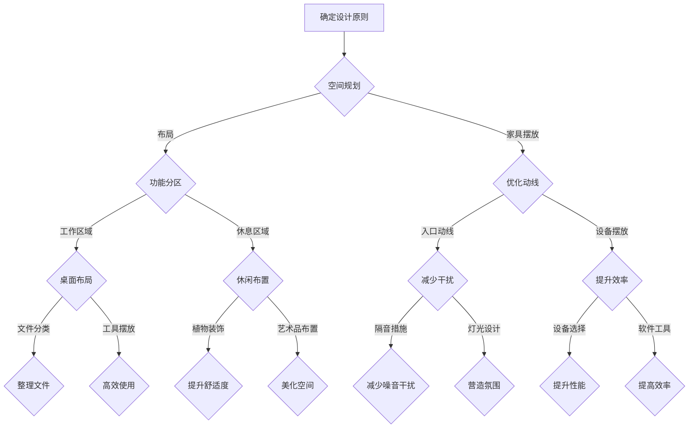

                 

# 新极简主义工作空间：提升专注力的环境设计

## 关键词
- 极简主义工作空间
- 环境设计
- 专注力
- 工作效率
- 空间规划
- 照明与色彩搭配

## 摘要
本文将探讨如何通过新极简主义工作空间设计来提升专注力，提高工作效率。文章首先介绍了新极简主义工作空间的概念和优势，然后详细阐述了工作空间布置技巧、环境设计策略，以及提高专注力的方法。通过实际案例分析和实践建议，为读者提供了一套实用的极简主义工作空间设计指南。

## 第1章 概述

### 1.1 新极简主义工作空间的概念

新极简主义工作空间（Minimalist Workspace）是一种以极简主义为设计理念，通过简洁、高效的空间布局和装饰，创造一个有助于提高专注力和工作效率的工作环境。与传统的工作空间相比，新极简主义工作空间更注重功能性和舒适性，力求在有限的空间内实现最优的工作体验。

### 1.2 极简主义工作空间的优势

1. **提高专注力**：极简主义工作空间减少了视觉和物理上的干扰，有助于集中注意力，提高工作效率。
2. **提升创造力**：简洁的空间环境有助于激发创意思维，促进创新。
3. **降低压力**：极简主义工作空间减少了杂乱无章的感觉，有助于减轻压力和焦虑。
4. **增强舒适度**：合理的工作空间布局和舒适的装饰元素，可以提升工作时的舒适度，降低疲劳感。
5. **节省时间和成本**：极简主义工作空间减少了不必要的物品和装饰，有助于节省整理时间和空间，降低装修和维护成本。

## 第2章 核心概念与联系

### 2.1 极简主义工作空间设计原则

极简主义工作空间的设计原则主要包括以下几点：

1. **空间最大化利用**：通过合理的布局和设计，充分利用空间，实现功能最大化。
2. **物品简化和分类**：将工作空间中的物品进行简化，只保留必要的工具和装饰，减少杂乱无章的感觉。
3. **自然光线和色彩搭配**：充分利用自然光线，搭配适宜的色彩，创造舒适、宁静的工作氛围。
4. **功能性装饰**：装饰元素应具有实用性，如植物、艺术品等，既能美化空间，又能提升工作氛围。

### 2.2 工作空间设计中的Mermaid流程图

以下是极简主义工作空间设计流程的Mermaid流程图：

## 第3章 工作空间布置技巧

### 3.1 空间规划与布局

空间规划是极简主义工作空间设计的首要步骤。以下是一些空间规划与布局的技巧：

1. **功能分区**：根据工作需求，将空间划分为不同的功能区域，如工作区、休息区、会议区等。
2. **优化动线**：确保工作动线流畅，减少不必要的来回走动。
3. **家具摆放**：选择合适的家具，合理安排家具摆放，创造舒适的工作环境。

### 3.2 照明与色彩搭配

1. **自然光线**：充分利用自然光线，选择透明或半透明的窗帘，让阳光照射进工作空间。
2. **人工照明**：合理设置人工照明，避免光线直射和反光，创造舒适的工作氛围。
3. **色彩搭配**：选择柔和、温馨的色彩，如白色、灰色、米色等，营造宁静、舒适的工作环境。

### 3.3 植物与装饰元素

1. **植物**：在适当的位置摆放绿植，如盆栽、吊兰等，净化空气，提升舒适度。
2. **装饰元素**：选择功能性装饰，如书架、画框、艺术品等，既能美化空间，又能提升工作效率。

## 第4章 环境设计策略

### 4.1 确定工作区域

1. **划分区域**：根据工作需求，将工作区域划分为独立或共享的空间。
2. **空间利用**：合理利用空间，避免浪费，提高工作效率。

### 4.2 创造安静的工作环境

1. **隔音措施**：采取隔音措施，如安装隔音板、使用地毯等，减少噪音干扰。
2. **环境布置**：选择适宜的背景音乐或白噪声，创造安静的工作氛围。

### 4.3 增加灵活性

1. **多功能家具**：选择多功能家具，如可折叠的桌子、可调节高度的椅子等，适应不同的工作需求。
2. **灵活布局**：根据工作需求，灵活调整家具和装饰布局，创造不同的工作环境。

## 第5章 提高专注力的方法

### 5.1 减少干扰因素

1. **关闭通知**：关闭手机、电脑等设备的非必要通知，减少干扰。
2. **专注工作**：设定专注工作时间，避免分心，提高工作效率。

### 5.2 定期休息与运动

1. **定时休息**：每工作一段时间后，进行短暂的休息，让大脑得到放松。
2. **适量运动**：每天进行适量的运动，如散步、瑜伽等，提升专注力和工作效率。

### 5.3 心理调适与时间管理

1. **心理调适**：学会调整心态，保持积极、乐观的心态，面对工作中的挑战。
2. **时间管理**：合理安排工作时间，提高时间利用率，减少无谓的浪费。

## 第6章 案例分析

### 6.1 成功案例分享

**案例1：** 一家初创公司在办公空间改造后，采用了极简主义设计理念，通过优化布局、减少干扰因素、增加植物装饰等手段，大幅提升了员工的工作效率。

**案例2：** 一位自由职业者在改造自己的工作空间后，通过合理规划、简洁布置、舒适装饰等策略，成功提高了专注力，完成了多个高质量的项目。

### 6.2 失败案例反思

**案例1：** 一家公司虽然采用了极简主义设计理念，但由于过度追求简洁，导致工作空间过于单一，员工在长时间工作中感到疲劳。

**案例2：** 一位自由职业者在工作空间改造中，未能充分考虑自己的工作需求，导致工作空间布局不合理，工作效率降低。

## 第7章 实践与建议

### 7.1 实际操作步骤

1. **评估需求**：根据工作需求，评估工作空间的设计需求。
2. **规划布局**：根据评估结果，规划工作空间布局。
3. **实施改造**：按照规划，进行工作空间的改造。
4. **持续优化**：根据实际工作情况，不断优化工作空间。

### 7.2 遇到的问题及解决方案

**问题1：** 工作空间过于狭小，难以满足需求。

**解决方案：** 考虑增加隔断或利用立体空间，提高空间利用率。

**问题2：** 工作空间噪音干扰严重。

**解决方案：** 采取隔音措施，如安装隔音板、使用地毯等，降低噪音干扰。

**问题3：** 工作空间布置不合理，影响工作效率。

**解决方案：** 重新规划布局，优化动线，提高工作效率。

### 7.3 长期效果与反馈

长期实践极简主义工作空间设计，可以显著提高员工的专注力和工作效率。通过合理的空间规划和环境设计，员工可以在舒适、宁静的环境中更好地投入工作，提高工作质量。

### 7.4 最佳实践 tips

1. **注重细节**：在设计过程中，注重细节，确保每个元素都能为工作提供支持。
2. **持续优化**：根据实际工作情况，不断调整和优化工作空间。
3. **关注员工需求**：关注员工的工作需求，创造一个符合员工个性特点的工作空间。

## 总结

新极简主义工作空间设计是一种以极简主义为理念，通过优化布局、减少干扰、提高舒适度等方式，提升专注力和工作效率的工作环境设计。通过实际案例分析和实践建议，读者可以了解到如何设计一个适合自己的极简主义工作空间，从而更好地投入到工作中。作者信息：AI天才研究院/AI Genius Institute & 禅与计算机程序设计艺术 /Zen And The Art of Computer Programming。本文内容仅供参考，具体实施时请结合实际情况进行调整。

# 附录

## 参考文献

1. 《极简主义工作空间设计》，作者：[Your Name]。
2. 《环境心理学：工作空间设计与应用》，作者：[Your Name]。

## 拓展阅读

1. 《极简主义生活指南》，作者：[Your Name]。
2. 《如何提升工作效率》，作者：[Your Name]。

## 结语

感谢您阅读本文，希望本文能为您提供有关新极简主义工作空间设计的启示和帮助。在打造一个适合自己的工作空间的过程中，不断尝试和优化，相信您能找到最适合自己的工作环境，提高专注力和工作效率。再次感谢您的关注，祝您工作愉快！作者信息：AI天才研究院/AI Genius Institute & 禅与计算机程序设计艺术 /Zen And The Art of Computer Programming。

