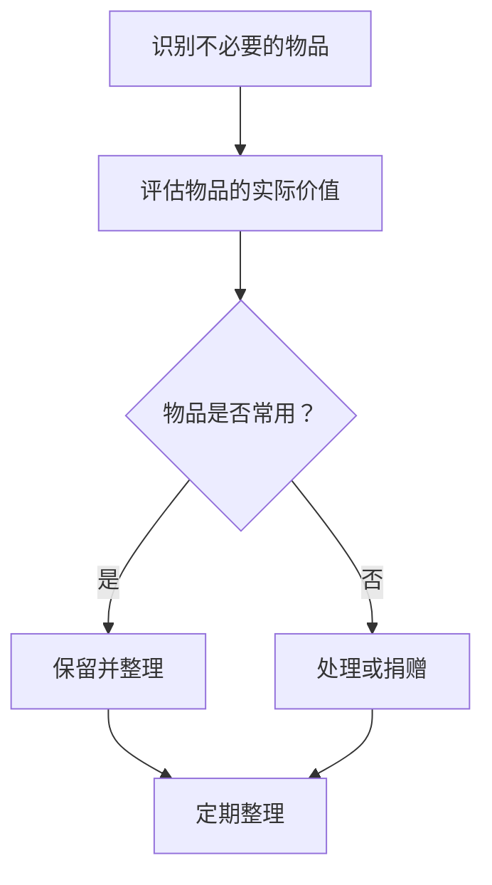
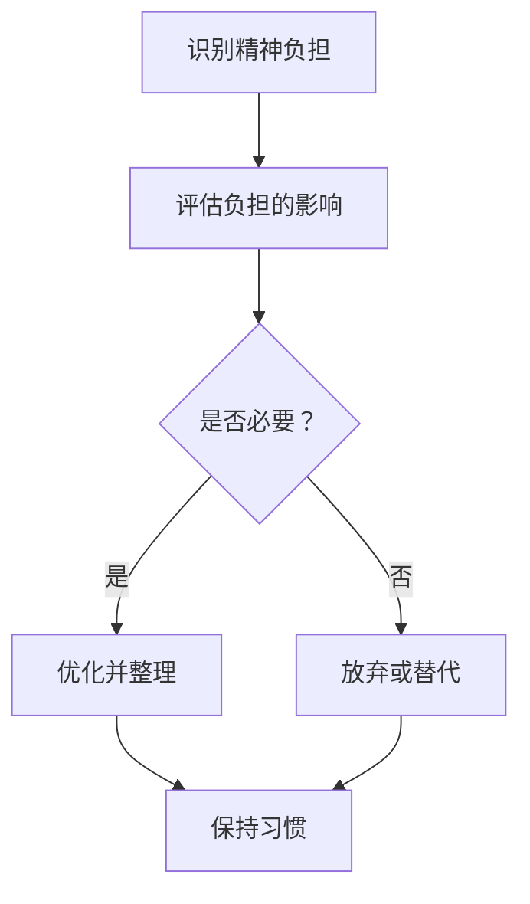

                 

### 极简主义生活概述

极简主义（Minimalism）是一种生活方式和哲学理念，起源于20世纪80年代的美国，提倡通过减少物质拥有和简化日常生活，达到精神上的自由与内心平静。这一概念不仅仅是对物质层面的断舍离，更是一种精神上的修炼和追求。极简主义生活强调的不仅是物品的减少，更是一种对生活本质的深刻反思和对人生目标的清晰界定。

#### 核心价值

**简化生活**：极简主义生活首先追求的是简化生活，通过减少不必要的物品和事务，让生活更加有序和高效。简化生活不仅有助于减少时间浪费，还能提升生活质量。

**心灵自由**：极简主义生活的核心价值在于追求心灵自由。通过减少物质负担，人们能够更加专注于内心的成长和精神的满足，从而获得更深层次的自由和满足感。

**提升效率**：极简主义生活还强调通过减少杂乱和干扰，提高工作和生活的效率。一个简洁有序的环境有助于集中注意力，减少决策疲劳，从而提高生产力和创造力。

**环保意识**：极简主义生活倡导环保，通过减少消费和浪费，降低对环境的负担。这种生活方式有助于促进资源的可持续利用和生态保护。

#### 起源与发展

极简主义生活理念的起源可以追溯到20世纪80年代的美国，当时社会物质丰富，但人们却感到精神空虚和焦虑。戴维·布恩斯（David Busch）和乔舒亚·贝克（Joshua Becker）等先驱者开始提倡极简主义，呼吁人们减少物质拥有，专注于内在价值的追求。

随着社会的发展和互联网的普及，极简主义生活理念在全球范围内得到了广泛传播和推广。许多国家和地区成立了极简主义社区和团体，通过分享经验和资源，帮助人们实现极简主义生活。

极简主义生活的发展也受到了心理学和社会学的支持。许多研究指出，减少物质负担和简化生活有助于减轻压力、提高幸福感和增强心理健康。这一理念逐渐从一个小众的哲学思潮转变为一种主流的生活方式。

### 结论

极简主义生活是一种通过减少物质和简化生活来实现心灵自由和效率提升的生活方式。它不仅追求物质层面的简单，更强调精神层面的修炼和成长。随着社会的发展和人们对生活质量的要求提高，极简主义生活理念将继续得到更多人的认同和实践。对于追求内心平静和高效生活的人来说，极简主义生活无疑是一种值得尝试和坚持的生活方式。

### **关键词**

- **极简主义**
- **生活方式**
- **心灵自由**
- **简化生活**
- **效率提升**
- **环保意识**

### **摘要**

本文介绍了极简主义生活的概念、核心价值、起源与发展，以及其在现代社会中的重要性。通过极简主义生活，人们可以减少物质负担，实现心灵自由，提升生活质量。文章还探讨了极简主义生活对环境和社会的影响，以及其实践方法。极简主义生活不仅是一种生活方式，更是一种追求内心平静和效率提升的哲学理念。

## 第1章：极简主义生活概述

### 1.1 什么是极简主义生活

极简主义（Minimalism）生活，简单来说，是一种追求减少物质负担，简化生活过程，从而追求更高层次精神满足的生活方式。它不仅仅是一种对物品的减少，更是一种对生活本质的深刻反思和对人生目标的重新审视。

#### 定义

极简主义生活，最早由美国的戴维·布恩斯（David Busch）和乔舒亚·贝克（Joshua Becker）提出，他们认为极简主义是一种旨在通过去除不必要的物品和任务，以达到精神自由和内心平静的生活哲学。

极简主义生活并不是简单的“少买或不买”，它更强调的是对物品和事务的选择，以及如何通过这些选择来提升生活质量。这种生活方式的核心在于精简生活，从而让生活更加有序和高效。

#### 特点

1. **减少物质拥有**：极简主义生活的第一个特点就是减少物质拥有，特别是那些不带来价值或者带来负价值的东西。这并不意味着完全放弃物质生活，而是选择那些真正需要和有价值的物品。

2. **简化生活过程**：极简主义生活不仅关注物质，还关注生活过程。通过减少杂乱和干扰，使生活变得更加有序和高效。

3. **追求精神自由**：极简主义生活的核心在于追求精神自由。通过减少物质负担，人们能够将更多的时间和精力投入到内心的成长和精神的满足上。

4. **提升生活质量**：极简主义生活并不仅仅是为了追求物质上的简化，更重要的是通过这种简化来提升生活质量。一个简洁、有序的环境有助于人们集中注意力，减少决策疲劳，从而提高生产力和创造力。

5. **环保意识**：极简主义生活还强调了环保意识。通过减少消费和浪费，降低对环境的负担，有助于资源的可持续利用和生态保护。

### 1.2 极简主义生活的核心价值

极简主义生活的核心价值在于通过减少物质和简化生活，实现心灵自由和效率提升。

#### **简化生活**

简化生活是极简主义生活的核心理念之一。通过减少物质拥有和简化生活过程，人们可以减少杂乱和干扰，使生活变得更加有序和高效。这种简化不仅有助于提高生活质量，还能减轻心理压力，使人们能够更加专注于内心成长和精神满足。

#### **心灵自由**

极简主义生活的另一个核心价值是追求心灵自由。通过减少物质负担，人们可以摆脱对物质的依赖和追求，从而获得更深层次的自由和满足感。心灵自由不仅使人们能够更好地享受生活，还能促进内在的平静和自我实现。

#### **效率提升**

极简主义生活强调通过简化生活和减少干扰来提高效率。一个简洁、有序的环境有助于人们集中注意力，减少决策疲劳，从而提高工作和学习的效率。此外，极简主义生活还有助于减少时间浪费，使人们能够更好地利用时间，实现个人目标。

#### **环保意识**

极简主义生活还强调了环保意识。通过减少消费和浪费，降低对环境的负担，有助于资源的可持续利用和生态保护。这种环保意识不仅对个人有益，也对整个社会和地球环境具有重要意义。

### 1.3 极简主义生活的起源与发展

极简主义生活的起源可以追溯到20世纪80年代的美国。当时，社会物质丰富，但人们却感到精神空虚和焦虑。戴维·布恩斯和乔舒亚·贝克等先驱者开始提倡极简主义，呼吁人们减少物质拥有，专注于内在价值的追求。

随着互联网的普及和社会的发展，极简主义生活理念在全球范围内得到了广泛传播和推广。越来越多的人开始认同和实践极简主义生活，成立了各种极简主义社区和团体，分享经验和资源。

#### 起源

极简主义生活的起源可以追溯到20世纪80年代的美国。当时，社会物质丰富，但人们却感到精神空虚和焦虑。戴维·布恩斯和乔舒亚·贝克等先驱者开始提倡极简主义，呼吁人们减少物质拥有，专注于内在价值的追求。

戴维·布恩斯是一位成功的企业家，他在经历了多次创业和失败后，开始反思自己的生活方式。他发现，自己的物质生活虽然丰富，但内心却感到空虚和不安。于是，他开始尝试减少物质拥有，专注于内心成长和精神满足。这一实践让他获得了深刻的内心平静和自由。

乔舒亚·贝克是一位作家和演讲家，他通过写作和演讲，向更多人传播极简主义生活的理念。他认为，极简主义生活不仅是一种生活方式，更是一种哲学和信仰。他强调，通过减少物质拥有和简化生活过程，人们可以实现心灵自由和效率提升。

#### 发展

随着互联网的普及和社会的发展，极简主义生活理念在全球范围内得到了广泛传播和推广。越来越多的人开始认同和实践极简主义生活，成立了各种极简主义社区和团体，分享经验和资源。

2010年，极简主义作家乔舒亚·贝克出版了《极简主义：一种更少、但更好的生活方式》（The More of Less: A Minimalist Living Guide），进一步推动了极简主义生活的普及。这本书详细介绍了极简主义生活的理念和实践方法，为更多人提供了指导。

近年来，随着社交媒体的兴起，极简主义生活理念得到了更广泛的传播。许多人通过博客、Instagram等平台分享自己的极简主义生活实践，吸引了大量关注和支持。

#### 全球传播

极简主义生活理念不仅在美国得到了广泛传播，也在其他国家产生了深远的影响。例如，日本在20世纪90年代经历了经济危机后，许多人对物质生活进行了深刻的反思，开始追求极简主义生活。日本的一些公司和品牌，如MUJI，也以极简主义为设计哲学，受到了全球消费者的喜爱。

在欧洲，许多国家也开始兴起极简主义生活潮流。瑞典、丹麦等北欧国家，以其高生活质量和环保意识，成为了极简主义生活的代表。

总的来说，极简主义生活作为一种哲学和生活方式，正在全球范围内得到越来越多的认同和实践。它不仅为个人带来了更高质量的生活，也为社会和地球环境带来了积极的影响。

### 结论

极简主义生活是一种通过减少物质和简化生活来实现心灵自由和效率提升的生活方式。它不仅关注物质层面的简化，更强调精神层面的修炼和成长。随着社会的发展和人们对生活质量的要求提高，极简主义生活理念将继续得到更多人的认同和实践。对于追求内心平静和高效生活的人来说，极简主义生活无疑是一种值得尝试和坚持的生活方式。

### **关键词**

- **极简主义**
- **生活方式**
- **心灵自由**
- **简化生活**
- **效率提升**
- **环保意识**

### **摘要**

本文介绍了极简主义生活的概念、定义、特点、核心价值以及其起源与发展。通过减少物质拥有和简化生活过程，极简主义生活旨在实现心灵自由、提升效率和生活质量。这一理念在全球范围内得到了广泛传播和认同，成为了越来越多人的选择。极简主义生活不仅为个人带来了深刻的改变，也为社会和环境带来了积极的影响。

## 第2章：物质断舍离的方法与实践

### 2.1 物质断舍离的原理

物质断舍离（Material Minimalism）是极简主义生活的重要组成部分，其核心在于通过减少不必要的物品，简化生活空间，从而提高生活质量。物质断舍离的原理可以从以下几个方面来理解：

#### **1. 减少物质负担**

物质断舍离的第一步是识别并处理那些不必要的物品。这包括那些长时间未被使用、对生活没有实际贡献的物品。通过减少这些物品，我们能够减轻生活的负担，使空间更加宽敞，生活更加轻松。

#### **2. 提高生活质量**

减少物品数量有助于我们专注于真正需要的物品，从而提高生活质量。一个简洁、有序的生活空间能够减少杂乱和压力，提升生活的舒适度和幸福感。

#### **3. 增强决策能力**

物质断舍离要求我们对自己拥有的物品进行严格的选择，这有助于我们提高决策能力。通过减少选择，我们可以更快地做出决策，减少决策疲劳，从而提高工作和生活的效率。

#### **4. 环保意识**

物质断舍离还强调了环保意识。通过减少消费和浪费，我们能够降低对环境的负担，促进资源的可持续利用。

#### **5. 培养价值观**

物质断舍离不仅是一种生活方式，更是一种价值观的体现。它鼓励我们关注内在价值和意义，而不是外在的物质表现。这种价值观有助于我们建立更加真实、有意义的人生。

### **案例分析与流程图**

为了更好地理解物质断舍离的原理，我们可以通过一个实际案例和Mermaid流程图来分析。

#### **案例**：小李是一位年轻的职业人士，他的公寓里堆满了各种物品，包括旧的书籍、衣物、电子产品等。他感到生活压力很大，决定进行一次全面的物质断舍离。

#### **流程图**：

在这个流程图中，小李首先识别出不必要的物品（A），然后评估这些物品的实际价值（B）。接着，他根据物品的使用频率（C）决定是否保留。常用的物品会被保留并整理（D），而不常用的物品则会被处理或捐赠（E）。最后，他定期进行整理，确保生活空间的有序和舒适（F）。

### **具体操作步骤**

以下是物质断舍离的具体操作步骤，旨在帮助读者更好地实施这一生活方式：

#### **1. 评估物品的实际价值**

首先，我们需要对自己的物品进行评估，判断它们是否对我们的生活有实际贡献。以下是一些评估标准：

- **使用频率**：长期未被使用的物品，如旧书籍、衣物等，往往没有实际价值。
- **实用价值**：物品的功能是否满足我们的需求，如旧电器、损坏的物品等。
- **情感价值**：一些物品可能因为情感原因而难以舍弃，但我们需要理性判断它们对生活的实际影响。

#### **2. 分类和处理**

根据评估结果，对物品进行分类和处理。以下是一些常见的分类和处理方式：

- **保留并整理**：对于常用的、有价值的物品，如常用的工具、书籍等，我们需要进行整理和归档，确保它们易于取用。
- **处理或捐赠**：对于不常用或没有价值的物品，如旧衣物、损坏的电器等，我们可以选择处理或捐赠给需要的人或机构。
- **丢弃**：对于那些真正没有价值的物品，如废纸、垃圾等，我们需要果断地丢弃。

#### **3. 定期整理**

物质断舍离不是一次性的行动，而是一种持续的生活方式。定期整理有助于保持生活空间的整洁和有序。以下是一些定期整理的建议：

- **每周一次的小整理**：每周花一些时间整理生活空间，清理垃圾、整理物品，保持环境的清洁和舒适。
- **每月一次的大整理**：每月对生活空间进行一次全面的整理，检查物品的使用情况，处理不必要的物品。
- **每季度或每半年的一次深度整理**：对于长时间未被使用的物品，进行深度整理，确保生活空间的整洁和有序。

### **案例分享**

以下是小李在进行物质断舍离后的变化：

- **生活空间更加宽敞**：通过处理不必要的物品，小李的公寓变得宽敞明亮，减少了杂乱和压抑的感觉。
- **生活质量提升**：一个整洁、有序的生活空间让小李感到更加舒适和放松，他的工作效率也显著提高。
- **心理压力减轻**：通过减少物质负担，小李感到心理压力减轻，更加专注于工作和个人成长。

### **结论**

物质断舍离是一种通过减少不必要的物品，简化生活空间，从而提高生活质量的生活方式。它不仅有助于减少物质负担，还能提高生活质量、增强决策能力、培养环保意识，并带来更深刻的内心平静。通过实际操作和持续实践，我们可以逐步实现物质断舍离，享受更加简洁、有序和有意义的生活。

### **关键词**

- **物质断舍离**
- **极简主义**
- **生活空间整理**
- **生活质量提升**
- **环保意识**
- **决策能力增强**

### **摘要**

本章介绍了物质断舍离的原理、具体操作步骤和实际案例。通过减少不必要的物品，我们能够简化生活空间，提高生活质量，增强决策能力，培养环保意识，并带来更深刻的内心平静。物质断舍离不仅是一种生活方式，更是一种价值观的体现，它为我们的生活带来了积极的变化。

## 第2章：物质断舍离的方法与实践

### 2.2 断舍离物品的技巧

在进行物质断舍离的过程中，掌握正确的技巧至关重要。这不仅有助于我们有效地处理不必要的物品，还能确保整个过程顺利进行。以下是一些实用的技巧：

#### **1. 分类与优先级**

首先，我们将物品按照类别进行分类，例如书籍、衣物、电子产品、家居用品等。接着，为每个类别的物品设定优先级，将其分为“保留”、“处理”和“丢弃”三个类别。

- **保留**：对于那些经常使用、具有重要价值和情感意义的物品，我们将其保留并整理好。
- **处理**：对于那些不再使用但还有一定价值的物品，我们可以选择处理，如捐赠、出售或二手市场。
- **丢弃**：对于那些真正没有价值、损坏严重或不再适用的物品，我们需要果断丢弃。

#### **2. 四分法**

四分法是一种非常实用的断舍离技巧，它将物品分为“留”、“送”、“捐”和“丢”四个类别。

- **留**：那些我们每天都用的、不可或缺的物品，如手机、钥匙等。
- **送**：那些我们偶尔使用，但对他人可能有用的物品，如旧衣物、旧书籍等。
- **捐**：那些有教育意义或慈善价值的物品，如旧玩具、文具等。
- **丢**：那些已经损坏、无法修复或完全没有价值的物品，如废纸、垃圾等。

#### **3. 三个月法则**

三个月法则是一种帮助我们决定是否保留物品的简单方法。如果一件物品在过去三个月内没有被使用过，那么它很可能不再需要。我们可以将其处理或丢弃。

#### **4. 一次处理**

为了避免拖延，我们应该一次性处理所有的物品，而不是分多次进行。这样可以避免我们反复犹豫和拖延，提高处理效率。

#### **5. 限制购买**

为了防止再次积累不必要的物品，我们可以设定购买限制。例如，每个月只允许购买一件新物品，且必须替换掉一件旧物品。

#### **6. 环保处理**

在处理物品时，我们应尽量选择环保的方法。例如，捐赠给慈善机构、二手市场或者回收处理。这样可以减少浪费，保护环境。

#### **7. 设定整理时间**

为了确保物质断舍离的持续进行，我们可以设定固定的整理时间，如每周或每月的某一天进行整理。这样可以确保我们的环境始终保持整洁和有序。

### **案例分享**

小明是一位年轻的创业者，他的公寓里堆满了各种物品，包括旧书籍、衣物、电子产品和家居用品等。他感到生活压力很大，决定进行一次全面的物质断舍离。

#### **第一步：分类与优先级**

小明首先将物品按照类别进行分类，然后为每个类别的物品设定了优先级。他保留了一些常用的工具和书籍，处理了一些不再使用的衣物和电子产品，丢弃了一些损坏严重的物品。

#### **第二步：四分法**

接着，小明采用了四分法，将物品分为“留”、“送”、“捐”和“丢”四个类别。他留下了一些常用的物品，如手机和笔记本电脑，将一些旧衣物和书籍捐赠给了慈善机构，处理了一些不再使用的电子产品。

#### **第三步：三个月法则**

小明还使用了三个月法则，检查了那些在过去三个月内没有被使用的物品。他发现有很多物品已经很久没有使用了，于是决定将其处理或丢弃。

#### **第四步：一次处理**

为了避免拖延，小明一次性处理了所有物品，而不是分多次进行。这样他避免了反复犹豫和拖延，提高了处理效率。

#### **第五步：限制购买**

为了防止再次积累不必要的物品，小明设定了每月只允许购买一件新物品的限制，且必须替换掉一件旧物品。

#### **第六步：环保处理**

在处理物品时，小明尽量选择环保的方法。他将旧衣物捐赠给了慈善机构，将电子产品进行了回收处理。

#### **第七步：设定整理时间**

为了确保物质断舍离的持续进行，小明设定了每周的某一天进行整理。这样他确保了生活空间的整洁和有序。

### **效果**

通过物质断舍离，小明的生活空间变得更加宽敞和整洁，他的生活质量显著提高。他感到压力减轻，能够更好地专注于工作和个人成长。此外，他还发现，物质断舍离不仅有助于提高生活质量，还能培养他的环保意识和责任感。

### **结论**

物质断舍离是一种通过减少不必要的物品，简化生活空间，从而提高生活质量的生活方式。掌握正确的技巧和策略，可以帮助我们更有效地进行物质断舍离，享受更加简洁、有序和有意义的生活。通过实际操作和持续实践，我们可以逐步实现物质断舍离，为我们的生活带来积极的变化。

### **关键词**

- **断舍离**
- **极简主义**
- **物品处理**
- **生活质量提升**
- **环保意识**
- **整理技巧**

### **摘要**

本章介绍了物质断舍离的技巧，包括分类与优先级、四分法、三个月法则、一次处理、限制购买、环保处理和设定整理时间等。通过这些技巧，我们可以更有效地进行物质断舍离，简化生活空间，提高生活质量。实际案例分享展示了物质断舍离的效果和重要性，鼓励读者实践这一生活方式。

## 2.3 家居空间整理实践

家居空间整理是物质断舍离的重要组成部分，它不仅有助于提高生活质量，还能创造一个更加舒适和有序的生活环境。以下是一些实用的家居空间整理技巧和实践方法：

### **1. 整理前的准备工作**

在进行家居空间整理之前，我们需要做好充分的准备工作，这包括：

- **制定计划**：明确整理的目标和步骤，如清理每个房间、分类物品等。
- **准备工具**：准备好所需的工具，如垃圾袋、标签、清洁用品等。
- **设定时间**：安排一个合适的时间，最好是一个完整的周末，以便有充足的时间进行整理。
- **心理准备**：整理过程中可能会遇到一些情感上的挑战，如对旧物品的留恋，因此需要做好心理准备。

### **2. 实际操作步骤**

#### **清理物品**

首先，我们需要对家居空间进行彻底的清理。以下是一些具体的步骤：

- **分类**：将物品分为“保留”、“处理”和“丢弃”三个类别。对于保留的物品，进行整理和归档；对于处理的物品，如捐赠、出售或二手市场；对于丢弃的物品，则果断处理。
- **处理杂物**：清理杂物和垃圾，确保空间整洁。
- **整理家具**：重新布置家具，使其更加实用和舒适。

#### **优化空间**

在整理家居空间时，我们还需要考虑空间的优化利用。以下是一些技巧：

- **多功能家具**：选择多功能家具，如沙发床、组合柜等，以节省空间。
- **隐藏储物空间**：利用墙壁和天花板等空间，安装储物柜和书架，增加储物空间。
- **利用角落**：角落往往是空间浪费的地方，我们可以利用转角书架或转角衣柜等，充分利用这些空间。

#### **保持整洁**

家居空间整理不仅是一次性的行动，还需要保持长期的整洁和有序。以下是一些保持整洁的技巧：

- **定期清理**：每周或每月定期清理家居空间，保持环境整洁。
- **物品归位**：每次使用完物品后，及时归位，保持空间整洁。
- **制定规则**：与家人一起制定一些家居整洁的规则，如不乱扔垃圾、定期整理等。

### **3. 案例分享**

小明在进行了家居空间整理后，生活质量得到了显著提升。以下是他的整理过程和效果：

#### **整理前**

- **房间杂乱**：小明的房间堆满了各种物品，包括旧书籍、衣物、电子产品和杂物，让他感到压抑和混乱。
- **空间浪费**：家具摆放不合理，导致空间浪费。
- **物品丢失**：由于物品乱放，经常找不到需要的物品。

#### **整理过程**

- **第一步：清理物品**：小明将房间内的物品进行了分类，保留必要的物品，处理和丢弃不必要的物品。
- **第二步：优化空间**：小明重新布置了家具，选择了一些多功能家具，如沙发床和组合柜，增加了空间利用率。
- **第三步：保持整洁**：小明制定了每周清理房间的计划，每次使用完物品后，及时归位，保持房间整洁。

#### **整理后**

- **房间宽敞**：房间变得宽敞明亮，物品井然有序。
- **空间利用率提升**：家具摆放合理，空间利用率显著提升。
- **物品容易找到**：由于物品整齐摆放，小明能够轻松找到需要的物品，减少了寻找时间。

### **4. 结论**

家居空间整理是物质断舍离的重要组成部分，它有助于提高生活质量，创造一个更加舒适和有序的生活环境。通过制定计划、分类物品、优化空间和保持整洁，我们可以有效地进行家居空间整理。实际案例分享展示了整理过程和效果，鼓励读者实践这一方法，享受更加简洁、有序的生活。

### **关键词**

- **家居空间整理**
- **极简主义**
- **生活空间优化**
- **整洁有序**
- **空间利用率提升**
- **生活习惯改善**

### **摘要**

本章介绍了家居空间整理的实践方法，包括整理前的准备工作、实际操作步骤、保持整洁的技巧以及实际案例分享。通过家居空间整理，我们可以提高生活质量，创造一个更加舒适和有序的生活环境。实践证明，家居空间整理不仅有助于减少杂乱和压力，还能提升空间利用率和生活效率。

## 第3章：精神断舍离的实践

### 3.1 精神断舍离的概念

精神断舍离（Mental Minimalism）是极简主义生活的重要组成部分，它不仅仅关注物质层面的简化，更强调通过减少精神负担，实现心灵自由和内心平静。精神断舍离的概念可以理解为从我们的思想、情绪和习惯中去除那些不必要的、负面的和有害的元素，以便让我们的心灵得到净化和自由。

#### **1. 精神断舍离的定义**

精神断舍离是一种生活方式，它鼓励我们识别并摆脱那些消耗我们精力和时间的精神负担，如无意义的任务、不健康的习惯、负面情绪和关系等。通过这一过程，我们能够更加专注于内心的成长和精神的满足，从而实现更深层次的自我实现和生活质量提升。

#### **2. 精神断舍离的核心**

精神断舍离的核心在于以下几个方面：

- **减少焦虑和压力**：通过减少那些不必要的任务和责任，我们可以减轻内心的焦虑和压力，获得更多的平静和放松。
- **提高专注力**：一个简洁、有序的精神环境有助于我们集中注意力，提高工作和学习效率。
- **培养内心平静**：通过减少杂念和干扰，我们可以培养内心的平静，更好地应对生活中的挑战。
- **促进个人成长**：精神断舍离鼓励我们关注内心的成长，通过自我反思和自我提升，实现个人价值的最大化。

#### **3. 精神断舍离与传统极简主义的关系**

精神断舍离与物质极简主义密切相关，但又有所不同。物质极简主义关注的是通过减少物质拥有，简化生活空间，从而提升生活质量；而精神断舍离则更关注于减少精神负担，实现心灵自由和内心平静。两者相辅相成，共同构建了极简主义生活的完整体系。

### **案例分析与流程图**

为了更好地理解精神断舍离的概念和实践，我们可以通过一个实际案例和Mermaid流程图来分析。

#### **案例**：小张是一位忙碌的职场人士，他的生活中充满了各种压力和焦虑。他决定进行一次全面的精神断舍离，以减轻内心的负担。

#### **流程图**：

在这个流程图中，小张首先识别出他生活中的精神负担（A），然后评估这些负担对他的影响（B）。接着，他根据负担的必要性（C）决定是否保留。对于必要的负担，他进行优化和整理（D），确保其不会过度消耗精力；对于不必要的负担，他选择放弃或替代（E）。最后，他保持一些有益的习惯（F），以确保精神状态的持续稳定。

### **具体实践方法**

以下是精神断舍离的具体实践方法，旨在帮助读者更好地实现这一生活方式：

#### **1. 识别精神负担**

首先，我们需要识别出自己生活中的精神负担。这可以通过以下几种方法实现：

- **自我反思**：定期进行自我反思，思考自己目前的生活状态和精神状态，识别出那些消耗精力、带来负面情绪的负担。
- **清单法**：制作一个清单，列出自己生活中的所有负担，如工作任务、人际关系、兴趣爱好等。
- **他人反馈**：向亲朋好友寻求反馈，了解他们对自己的看法和建议，从而发现那些隐藏在自己意识之外的精神负担。

#### **2. 评估负担的影响**

在识别出精神负担后，我们需要评估这些负担对我们生活的影响。以下是一些评估标准：

- **消耗精力**：那些让我们感到疲惫、无力应对的任务和责任。
- **带来负面情绪**：那些让我们感到焦虑、沮丧、愤怒的负担。
- **影响生活质量**：那些影响我们睡眠、饮食、人际关系等的生活负担。
- **时间成本**：那些占用我们大量时间的任务和活动。

#### **3. 优化和整理**

对于那些必要的精神负担，我们需要进行优化和整理，以确保其不会过度消耗我们的精力。以下是一些具体的做法：

- **时间管理**：合理安排时间，确保每个任务都有足够的时间完成，避免临时抱佛脚。
- **任务分解**：将复杂的大任务分解为小任务，逐步完成，减轻心理压力。
- **优先级排序**：根据任务的紧急程度和重要性，对任务进行排序，确保先完成最重要的任务。
- **资源整合**：利用外部资源，如请教他人、使用工具等，提高任务完成效率。

#### **4. 放弃或替代**

对于那些不必要的、消耗我们精力且没有实际价值的负担，我们需要果断地放弃或寻找替代方案。以下是一些具体的做法：

- **放弃**：对于那些没有实际意义、无法带来价值的负担，我们可以选择放弃。例如，一些不必要的社交活动、无意义的工作任务等。
- **替代**：对于那些确实需要但可以简化的负担，我们可以寻找替代方案。例如，使用更高效的工具和方法，减少手工操作；寻求他人的帮助，分担部分负担等。

#### **5. 保持有益习惯**

在精神断舍离的过程中，我们不仅需要减少不必要的负担，还要保持一些有益的习惯，以维持精神状态的稳定和健康。以下是一些有益的习惯：

- **定期锻炼**：通过锻炼，我们可以保持身体和精神的健康，提高抵抗力。
- **充足睡眠**：保持良好的睡眠习惯，有助于缓解压力，提高生活质量。
- **自我反思**：定期进行自我反思，思考自己的行为和想法，及时调整，保持内心的平静和清晰。
- **兴趣爱好**：培养一些兴趣爱好，如阅读、绘画、音乐等，有助于缓解压力，丰富生活。

### **案例分享**

小张在进行了精神断舍离后，生活质量得到了显著提升。以下是他的实践过程和效果：

#### **实践过程**

- **第一步：识别精神负担**：小张通过自我反思和他人反馈，识别出他生活中的主要精神负担，如高强度的工作、复杂的任务、不健康的人际关系等。
- **第二步：评估负担的影响**：小张对每个负担进行了评估，发现高强度的工作和复杂的任务让他感到疲惫和焦虑，影响了他的生活质量。
- **第三步：优化和整理**：小张通过时间管理、任务分解和优先级排序，优化了工作任务，减少了心理压力。
- **第四步：放弃或替代**：小张放弃了一些不必要的社交活动和复杂的任务，通过使用工具和寻求他人帮助，分担了部分负担。
- **第五步：保持有益习惯**：小张定期锻炼、保持充足的睡眠，培养了一些兴趣爱好，如阅读和绘画，保持了精神状态的稳定和健康。

#### **效果**

通过精神断舍离，小张的生活质量得到了显著提升。他感到压力减轻，精力更加充沛，能够更好地专注于工作和个人成长。他的精神状态更加稳定和清晰，能够更好地应对生活中的挑战。

### **结论**

精神断舍离是一种通过减少精神负担，实现心灵自由和内心平静的生活方式。它不仅有助于减轻心理压力，提高生活质量，还能培养我们的专注力和自我反思能力。通过实际操作和持续实践，我们可以逐步实现精神断舍离，享受更加简洁、有序和有意义的生活。

### **关键词**

- **精神断舍离**
- **极简主义**
- **心灵自由**
- **压力减轻**
- **专注力提升**
- **自我反思**

### **摘要**

本章介绍了精神断舍离的概念、核心、与传统极简主义的关系以及具体的实践方法。通过识别精神负担、评估影响、优化和整理、放弃或替代以及保持有益习惯，我们可以实现精神断舍离，享受更加简洁、有序和有意义的生活。实际案例分享展示了精神断舍离的效果和重要性，鼓励读者实践这一生活方式。

## 3.2 心灵减压的方法

在现代社会，人们常常被各种压力和焦虑所困扰，这不仅影响了生活质量，还可能导致心理健康问题。心灵减压是精神断舍离的重要一环，它有助于我们缓解压力，保持心理健康。以下是一些实用的心灵减压方法：

### **1. 正念冥想**

正念冥想是一种通过专注于当下的感受和体验，从而减少内心烦恼和压力的方法。以下是一些步骤：

- **选择合适的环境**：找一个安静、舒适的地方，确保在冥想过程中不受打扰。
- **坐姿**：选择一个舒适的坐姿，保持身体的放松。
- **呼吸**：专注于呼吸，感受每次吸气时腹部上升，每次呼气时腹部下降。
- **专注**：将注意力集中在呼吸上，当你的注意力开始游移时，轻轻地将它带回到呼吸上。
- **持续**：每天坚持冥想，逐渐增加时间。

### **2. 健身运动**

健身运动是一种有效的减压方法，它不仅能够释放身体中的紧张和压力，还能刺激大脑释放内啡肽，提高心情。以下是一些适合减压的健身运动：

- **有氧运动**：如跑步、游泳、骑自行车等，有助于提高心肺功能，释放压力。
- **力量训练**：如举重、俯卧撑、深蹲等，能够增强肌肉力量，提高自信心。
- **瑜伽**：瑜伽结合了体位、呼吸和冥想，有助于放松身心，减轻压力。

### **3. 社交互动**

与他人进行积极的社交互动可以帮助我们缓解压力，获得支持和理解。以下是一些社交互动的方法：

- **与家人和朋友聚会**：通过家庭聚会、朋友聚餐等活动，增进彼此的感情，分享快乐和困扰。
- **参加社交团体**：加入一些兴趣小组或社区组织，与他人交流共同的兴趣和经历。
- **寻求专业帮助**：在遇到严重的心理问题时，可以寻求心理咨询师或心理医生的帮助。

### **4. 睡眠管理**

良好的睡眠对心理健康至关重要。以下是一些改善睡眠质量的方法：

- **规律作息**：每天保持规律的作息时间，确保每天有足够的睡眠时间。
- **创建睡前习惯**：如泡个热水澡、听轻音乐、阅读等，帮助身体放松，准备入睡。
- **避免刺激**：睡前避免使用电子设备，减少蓝光对睡眠的干扰。
- **保持舒适**：确保睡眠环境舒适，如合适的床垫、枕头和安静的环境。

### **5. 自我反思**

定期进行自我反思可以帮助我们了解自己的内心世界，发现和解决潜在的心理问题。以下是一些自我反思的方法：

- **写日记**：每天花时间写日记，记录自己的感受、想法和经历，有助于释放内心的压力。
- **提问自己**：定期提问自己一些问题，如“我现在的情绪是什么？”“我在生活中最想要的是什么？”“我是否在正确地照顾自己？”等，帮助自己更清晰地认识自己。
- **接受自己**：学会接受自己的不完美，培养自我接纳和自我爱，减少自我批评和压力。

### **6. 情绪管理**

情绪管理是心灵减压的重要一环，以下是一些情绪管理的方法：

- **呼吸控制**：在感到情绪激动时，通过深呼吸来平静情绪，减少冲动行为。
- **正念观察**：观察自己的情绪，不要对情绪进行评判或抗拒，而是接受并允许它们存在。
- **理性思考**：在面对负面情绪时，尝试用理性的方式分析问题，找到解决方案。
- **表达情感**：找到适当的方式表达自己的情感，如与朋友倾诉、写日记或进行艺术创作。

### **实际案例分享**

小王是一位忙碌的职业人士，他的工作压力大，经常感到焦虑和疲惫。他决定尝试一些心灵减压的方法，以下是他的实践过程和效果：

#### **实践过程**

- **第一步：正念冥想**：每天晚上，小王会在家里安静的地方进行正念冥想，专注于呼吸，感受身体的放松。
- **第二步：健身运动**：每周，小王会进行三次健身运动，包括跑步和瑜伽，通过运动释放压力，提高心情。
- **第三步：社交互动**：小王定期与家人和朋友聚会，分享自己的工作和生活，获得支持和理解。
- **第四步：睡眠管理**：小王保持规律的作息时间，每天晚上都会进行一些放松的活动，如泡热水澡和阅读，确保良好的睡眠质量。
- **第五步：自我反思**：每周，小王会花时间写日记，记录自己的情绪和想法，进行自我反思。
- **第六步：情绪管理**：当小王感到情绪激动时，他会通过深呼吸和理性思考来控制情绪。

#### **效果**

通过这些心灵减压方法，小王的生活质量得到了显著提升。他感到压力减轻，心情变得更加平和。他的睡眠质量提高，精力更加充沛。他能够更好地专注于工作和个人成长，提高了工作效率和生活满意度。

### **结论**

心灵减压是精神断舍离的重要一环，通过正念冥想、健身运动、社交互动、睡眠管理、自我反思和情绪管理等方法，我们可以有效地缓解压力，保持心理健康。实际案例分享展示了这些方法的有效性，鼓励读者尝试和实践，享受更加健康、平和的生活。

### **关键词**

- **心灵减压**
- **正念冥想**
- **健身运动**
- **社交互动**
- **睡眠管理**
- **情绪管理**

### **摘要**

本章介绍了心灵减压的各种方法，包括正念冥想、健身运动、社交互动、睡眠管理、自我反思和情绪管理。通过这些方法，我们可以有效地缓解压力，保持心理健康。实际案例分享展示了这些方法的效果，鼓励读者实践，享受更加健康、平和的生活。

## 3.3 精神断舍离的技巧

精神断舍离是一种通过减少精神负担，实现心灵自由和内心平静的生活方式。为了更有效地进行精神断舍离，我们需要掌握一些实用的技巧和方法。以下是一些帮助实现精神断舍离的技巧：

### **1. 制定目标**

在进行精神断舍离之前，我们需要明确自己的目标。这包括：

- **长期目标**：设定一个长期的愿景，如实现心灵自由、提高生活质量等。
- **短期目标**：将长期目标分解为短期目标，如减少不必要的任务、培养良好的习惯等。

通过明确目标，我们可以更有针对性地进行精神断舍离，避免盲目行动。

### **2. 自我反思**

自我反思是精神断舍离的重要环节，它有助于我们了解自己的内心世界，发现潜在的问题。以下是一些自我反思的方法：

- **写日记**：每天花时间记录自己的情绪、想法和经历，有助于释放内心的压力。
- **提问自己**：定期提问自己一些问题，如“我现在最需要的是什么？”“我在哪些方面做得不够好？”等，帮助自己更清晰地认识自己。
- **倾听内心**：通过冥想、深呼吸等方法，倾听自己的内心声音，了解自己的真实需求。

### **3. 建立边界**

建立边界是精神断舍离的关键，它有助于我们保护自己的时间和精力。以下是一些建立边界的方法：

- **设定优先级**：将任务和活动按照优先级进行排序，确保将时间和精力投入到最重要的事情上。
- **学会拒绝**：对于那些不必要的请求和任务，学会拒绝，保护自己的时间和精力。
- **明确界限**：与家人、朋友和同事明确沟通，设定彼此的界限，避免不必要的冲突和压力。

### **4. 定期清理**

定期清理是我们维持精神断舍离的重要手段。以下是一些定期清理的方法：

- **物品清理**：定期对家居和工作环境进行整理，处理不必要的物品，保持空间整洁。
- **任务清理**：定期检查自己的任务清单，删除那些不再需要的任务，确保自己的时间和精力得到有效利用。
- **情绪清理**：定期进行自我反思和情绪管理，释放负面情绪，保持内心的平静和清晰。

### **5. 培养习惯**

培养良好的习惯是精神断舍离的重要保障。以下是一些有助于实现精神断舍离的良好习惯：

- **早起**：养成早起的习惯，为一天的开始创造一个良好的开端。
- **定期锻炼**：坚持定期锻炼，提高身体健康，增强心理素质。
- **阅读**：培养阅读的习惯，通过阅读拓展知识，丰富内心世界。
- **冥想**：定期进行冥想，放松身心，提高专注力。

### **6. 寻求支持**

在进行精神断舍离的过程中，我们可能会遇到各种困难和挑战。寻求支持和帮助是克服这些困难的重要途径。以下是一些寻求支持的方法：

- **与家人和朋友交流**：与家人和朋友分享自己的经历和感受，获得他们的理解和支持。
- **加入社群**：加入一些极简主义生活或精神断舍离的社群，与其他人分享经验和资源。
- **寻求专业帮助**：在遇到严重心理问题时，可以寻求心理咨询师或心理医生的帮助。

### **实际案例分享**

小李是一位年轻的职场人士，他的工作和生活中充满了各种压力和焦虑。他决定进行一次全面的精神断舍离，以减轻内心的负担。以下是他的实践过程和效果：

#### **实践过程**

- **第一步：制定目标**：小李设定了一个长期目标，即实现心灵自由，提高生活质量。他将这个目标分解为短期目标，如减少不必要的任务、培养良好的习惯等。
- **第二步：自我反思**：每天晚上，小李都会花时间写日记，记录自己的情绪、想法和经历。通过自我反思，他发现了自己内心的一些问题，并开始寻找解决方案。
- **第三步：建立边界**：小李学会了设定优先级，拒绝那些不必要的请求和任务，明确自己的界限，保护自己的时间和精力。
- **第四步：定期清理**：小李定期对家居和工作环境进行整理，删除不必要的物品和任务，保持空间整洁。他还定期进行情绪清理，释放负面情绪，保持内心的平静和清晰。
- **第五步：培养习惯**：小李养成了早起的习惯，坚持定期锻炼和阅读。他还定期进行冥想，放松身心，提高专注力。
- **第六步：寻求支持**：小李与家人和朋友分享自己的经历和感受，加入了一些极简主义生活的社群，与其他人分享经验和资源。

#### **效果**

通过精神断舍离，小李的生活质量得到了显著提升。他感到压力减轻，心情变得更加平和。他的工作效率提高，能够更好地专注于工作和个人成长。他的内心变得更加平静和清晰，能够更好地应对生活中的挑战。

### **结论**

精神断舍离是一种通过减少精神负担，实现心灵自由和内心平静的生活方式。通过制定目标、自我反思、建立边界、定期清理、培养习惯和寻求支持等技巧，我们可以更有效地进行精神断舍离，享受更加健康、平和的生活。实际案例分享展示了精神断舍离的效果和重要性，鼓励读者实践这一生活方式。

### **关键词**

- **精神断舍离**
- **极简主义**
- **目标设定**
- **自我反思**
- **建立边界**
- **定期清理**
- **培养习惯**
- **寻求支持**

### **摘要**

本章介绍了实现精神断舍离的技巧，包括制定目标、自我反思、建立边界、定期清理、培养习惯和寻求支持等。通过这些技巧，我们可以更有效地进行精神断舍离，减轻心理压力，实现心灵自由和内心平静。实际案例分享展示了这些技巧的效果和重要性，鼓励读者实践这一生活方式。

## 第4章：极简主义生活的日常生活实践

### 4.1 极简主义饮食

极简主义饮食是一种通过减少食物种类和简化烹饪过程，以达到健康、高效生活方式的饮食理念。以下是一些关于极简主义饮食的具体实践方法：

#### **1. 饮食原则**

- **减少食物种类**：极简主义饮食强调减少食物种类，选择那些易于准备和烹饪的食物。常见的食物包括谷物、蔬菜、水果、肉类和鱼类。
- **注重营养均衡**：尽管减少食物种类，但极简主义饮食仍然注重营养均衡，确保身体获得所需的营养素。
- **简单烹饪**：极简主义饮食主张简单烹饪，减少复杂和繁琐的烹饪过程。常见的烹饪方法包括蒸、煮、烤和炖。

#### **2. 实践方法**

- **每日食谱**：每天准备一份简单且营养均衡的食谱，如谷物、蔬菜和蛋白质来源。例如，早餐可以是燕麦粥配水果，午餐可以是鸡肉沙拉配蔬菜，晚餐可以是鱼肉配蔬菜。
- **一周计划**：提前规划一周的饮食，选择易于准备和烹饪的食物，减少外出就餐的次数。例如，可以每周购买一次食材，提前进行烹饪和分装。
- **减少加工食品**：极简主义饮食强调减少加工食品的摄入，选择新鲜、天然的食物。尽量避免高糖、高盐和高脂肪的加工食品。
- **减少浪费**：在购买食材时，根据实际需求进行购买，避免浪费。对于剩余的食材，可以通过冷藏、冷冻或烹饪方法进行保存。

#### **3. 实际案例**

小明是一位年轻的上班族，他的饮食习惯较为杂乱，经常吃外卖和加工食品，导致健康问题频发。为了改善健康状况，他开始尝试极简主义饮食。

- **第一天**：小明制定了简单的食谱，包括燕麦粥配水果、鸡肉沙拉配蔬菜和鱼肉配蔬菜。他发现烹饪过程非常简单，而且食材新鲜，口感很好。
- **第二天**：小明提前规划了一周的饮食，选择了易于准备和烹饪的食物，如鸡肉、蔬菜和谷物。他减少了外出就餐的次数，自己在家烹饪，感觉更加健康和满足。
- **第三天**：小明开始注意到自己的饮食习惯有了明显的变化，他减少了加工食品的摄入，增加了新鲜蔬菜和水果的摄入量。他的身体感觉更加轻盈和有活力。

#### **4. 结论**

极简主义饮食是一种通过减少食物种类和简化烹饪过程，以达到健康、高效生活方式的饮食理念。通过实践极简主义饮食，我们可以改善饮食习惯，提高营养摄入，减少健康问题。同时，极简主义饮食还减少了食物浪费，对环境保护起到了积极作用。

### **关键词**

- **极简主义饮食**
- **健康**
- **营养均衡**
- **简单烹饪**
- **减少浪费**

### **摘要**

本章介绍了极简主义饮食的概念、原则和实践方法。通过减少食物种类和简化烹饪过程，极简主义饮食有助于改善饮食习惯，提高营养摄入，减少健康问题。实际案例展示了极简主义饮食的效果，鼓励读者实践这一生活方式。

### 4.2 极简主义运动

极简主义运动是一种通过简化运动方式、减少运动时间，同时确保有效性和全面性的运动理念。它强调以最少的时间和精力投入，获得最大的健康收益。以下是一些关于极简主义运动的实践方法：

#### **1. 运动原则**

- **少而精**：极简主义运动强调选择一些简单但有效的运动方式，如跑步、游泳、瑜伽等，避免复杂和繁琐的运动。
- **全面性**：尽管运动方式简单，但极简主义运动仍然注重身体的全面锻炼，包括有氧运动、力量训练和柔韧性训练。
- **持续性和规律性**：极简主义运动强调持续性和规律性，通过每天坚持适量的运动，保持身体的活力和健康。

#### **2. 实践方法**

- **每日运动计划**：每天选择一种运动方式，进行适量的运动。例如，可以每天进行30分钟的跑步、游泳或瑜伽。
- **运动组合**：将不同的运动方式组合在一起，以实现全面锻炼。例如，可以进行跑步后的力量训练，或瑜伽后的有氧运动。
- **简化设备**：尽量减少运动所需的设备，选择简单、易得的设备，如跑步鞋、瑜伽垫等。
- **户外运动**：利用户外环境进行运动，如跑步、骑行等，享受自然的同时，增强身体活力。

#### **3. 实际案例**

小李是一位职场人士，他的工作时间紧张，难以抽出时间进行运动。为了保持健康，他开始尝试极简主义运动。

- **第一天**：小李选择了跑步作为每日运动，每天早晨进行30分钟的跑步。他发现跑步不仅简单易行，还能有效提高心肺功能。
- **第二天**：小李开始进行运动组合，下午进行30分钟的瑜伽，放松身心。他发现瑜伽有助于缓解工作压力，提高身体的柔韧性。
- **第三天**：小李增加了户外运动，每天晚上进行骑行。他发现户外运动不仅让身心得到了放松，还增强了抵抗力。

#### **4. 结论**

极简主义运动是一种通过简化运动方式、减少运动时间，同时确保有效性和全面性的运动理念。通过实践极简主义运动，我们可以在忙碌的生活中找到运动的时间，保持身体的健康。同时，极简主义运动还降低了运动的难度和成本，让更多的人能够参与到运动中来。

### **关键词**

- **极简主义运动**
- **健康**
- **全面性**
- **持续性和规律性**
- **简化设备**
- **户外运动**

### **摘要**

本章介绍了极简主义运动的概念、原则和实践方法。通过简化运动方式、减少运动时间和确保全面性，极简主义运动有助于我们在忙碌的生活中保持健康。实际案例展示了极简主义运动的效果，鼓励读者实践这一生活方式。

### 4.3 极简主义工作与学习

在工作和学习中实践极简主义，能够帮助我们提高效率、减轻压力，并获得更大的成就感和满足感。以下是一些关于极简主义工作与学习的实践方法：

#### **1. 工作原则**

- **减少任务数量**：极简主义工作强调减少不必要的任务，将时间和精力集中在最重要的工作中。通过筛选和优先级排序，确保只处理那些对工作目标有实质性贡献的任务。
- **简化流程**：简化工作流程，减少冗余步骤，使工作更加高效。通过自动化工具和流程优化，减少手动操作和重复劳动。
- **专注力管理**：在工作过程中，保持专注力，避免分心和干扰。通过设定工作时间和休息时间，确保工作的连续性和高效性。
- **沟通清晰**：确保与同事和团队成员之间的沟通清晰、高效。通过明确任务目标和期望结果，减少误解和重复工作。

#### **2. 学习原则**

- **精选学习资源**：在学习过程中，精选最适合自己的学习资源，如书籍、课程、讲座等。避免盲目跟风，确保学习内容的高质量和实用性。
- **深度学习**：专注于深度学习，通过深入理解和掌握知识，提高学习效果。避免浅尝辄止，追求广度而忽略深度。
- **实践结合**：将学习与实践相结合，通过实际操作和应用，加深对知识的理解和掌握。通过解决实际问题，提高学习成果的转化率。
- **定期复习**：定期复习所学知识，巩固记忆，提高长期记忆效果。通过复习，及时弥补知识漏洞，保持知识的完整性。

#### **3. 实践方法**

- **每日工作计划**：每天早晨制定工作计划，将任务按照优先级排序，确保最重要的任务得到优先处理。通过工作计划，提高工作效率，减少拖延。
- **专注力训练**：通过冥想、深呼吸等方法，提高专注力。在工作过程中，尽量避免干扰，确保工作的连续性和高效性。
- **学习笔记**：在学习过程中，做好笔记，整理知识点，方便复习和应用。通过制作思维导图或总结笔记，加深对知识的理解和记忆。
- **定期反思**：每周或每月进行一次工作学习反思，总结经验和教训，调整工作学习计划，确保持续进步。

#### **4. 实际案例**

小张是一名项目经理，他的工作常常因为任务繁杂和时间紧迫而感到压力巨大。为了提高工作效率和质量，他开始实践极简主义工作与学习。

- **第一天**：小张开始制定每日工作计划，将任务按照优先级排序，确保最重要的任务得到优先处理。他通过简化流程，减少了冗余步骤，提高了工作效率。
- **第二天**：小张专注于一项重要任务，通过冥想和深呼吸，提高了专注力。他避免了分心和干扰，确保了工作的连续性和高效性。
- **第三天**：小张开始进行学习反思，总结一周的工作和学习经验，调整工作计划和学习方法。他通过实践结合，将所学知识应用到实际工作中，提高了工作质量。

#### **5. 结论**

极简主义工作与学习是一种通过减少任务数量、简化流程、专注力管理和清晰沟通，以及精选学习资源、深度学习和实践结合，来提高工作效率和学习效果的方法。通过实践极简主义工作与学习，我们能够在忙碌的工作和学习中找到平衡，提高效率和成就感，实现个人和职业发展。

### **关键词**

- **极简主义工作**
- **工作效率**
- **专注力管理**
- **简化流程**
- **清晰沟通**
- **极简主义学习**
- **深度学习**
- **实践结合**

### **摘要**

本章介绍了极简主义工作与学习的原则和实践方法。通过减少任务数量、简化流程、专注力管理和清晰沟通，以及精选学习资源、深度学习和实践结合，我们可以提高工作效率和学习效果。实际案例展示了极简主义工作与学习的效果，鼓励读者实践这一生活方式。

## 第5章：极简主义生活的长期效果

### 5.1 物质与精神的双重收获

极简主义生活不仅带来了短期内的改善，更在长期中产生了深远的影响。这种生活方式在物质和精神层面都带来了显著的收获，为个人和社会带来了诸多益处。

#### **物质层面的收获**

**提升生活质量**：极简主义生活通过减少不必要的物品和简化生活过程，创造了一个更加整洁、有序的生活环境。这种环境不仅提升了日常生活的舒适度，还减少了杂乱带来的心理压力，使人们能够更加专注于工作和个人成长。

**节约时间和精力**：极简主义生活减少了日常生活中琐碎事务的处理时间，如整理物品、购物和管理家务等。这使得人们有更多的时间去追求自己的兴趣爱好、与家人朋友相处或进行自我提升。

**降低消费支出**：通过减少不必要的消费，极简主义生活有助于降低个人和家庭的开支。这种节约不仅有助于提高财务状况，还能减少对环境的负担，促进资源的可持续利用。

**提高环保意识**：极简主义生活强调减少浪费和环保，通过减少消费和重复使用物品，有助于减少垃圾产生和资源消耗。这种环保意识不仅对个人有益，也对整个社会和地球环境具有重要意义。

#### **精神层面的收获**

**增强心灵自由**：极简主义生活通过减少物质负担和简化生活过程，帮助人们摆脱对物质的依赖和追求，实现了心灵自由。这种自由使人们能够更加专注于内心的成长和精神的满足，获得更深层次的幸福和满足感。

**提升心理健康**：极简主义生活有助于减轻心理压力和焦虑，改善心理健康。一个整洁、有序的环境能够减少心理负担，提高情绪稳定性，从而提升生活质量。

**增强专注力和创造力**：极简主义生活提供了一个简洁、清晰的环境，有助于人们集中注意力和提高创造力。这种环境减少了干扰和分心，使人们能够更好地专注于任务，提高工作效率和创造力。

**改善人际关系**：极简主义生活强调简化生活过程和减少不必要的社交活动，有助于改善人际关系。通过专注于真正有意义的关系，人们能够更好地理解和支持彼此，建立更加紧密和真诚的友谊。

#### **实际案例**

小李是一位职场人士，他以前的生活充满了各种物质追求和社交活动，导致他经常感到压力巨大、焦虑不安。为了改变这种状况，他开始实践极简主义生活。

- **物质层面**：小李减少了家中不必要的物品，简化了家居空间。他发现，通过减少杂乱和整理物品，他的生活变得更加有序和舒适。同时，他减少了不必要的消费，提高了财务状况，减少了压力。
- **精神层面**：小李通过极简主义生活，减少了社交活动，专注于真正有意义的关系。他发现，这种简化使他的心灵得到了自由，他能够更好地专注于工作和个人成长。同时，他的心理健康得到了显著改善，焦虑和压力减轻，情绪稳定性提高。

#### **结论**

极简主义生活不仅带来了短期内的改善，更在长期中产生了深远的影响。在物质层面，它提升了生活质量、节约时间和精力、降低消费支出、提高环保意识；在精神层面，它增强了心灵自由、提升心理健康、增强专注力和创造力、改善人际关系。通过实际案例可以看到，极简主义生活不仅为个人带来了积极的变化，也为社会和环境带来了积极的贡献。因此，极简主义生活值得每个人去实践和坚持。

### **关键词**

- **极简主义生活**
- **物质收获**
- **精神收获**
- **生活质量提升**
- **心理健康改善**
- **环保意识提升**
- **人际关系改善**

### **摘要**

本章探讨了极简主义生活的长期效果，包括物质层面的收获和精神层面的收获。通过实际案例可以看到，极简主义生活为个人和社会带来了诸多益处，包括提升生活质量、节约时间和精力、降低消费支出、提高环保意识、增强心灵自由、提升心理健康、增强专注力和创造力以及改善人际关系。极简主义生活不仅为个人带来了积极的变化，也为社会和环境带来了积极的贡献。

## 5.2 极简主义生活对人际关系的影响

极简主义生活不仅对个人的生活质量、心理健康和效率产生了积极影响，还深刻地影响了人际关系。通过简化生活和减少不必要的社交活动，极简主义生活帮助人们建立更加紧密、真诚和有意义的人际关系。

### **1. 简化生活与人际关系**

**减少社交压力**：极简主义生活鼓励人们减少社交活动，专注于真正有意义的关系。这种简化减少了社交压力，使人们能够更加轻松地与家人和朋友相处。通过减少不必要的应酬和聚会，人们有更多的时间去维护和深化重要的关系。

**提升沟通质量**：极简主义生活提供了一个更加简洁和清晰的环境，有助于提高沟通质量。在一个整洁、有序的环境中，人们更容易表达自己的真实想法和感受，减少误解和冲突。这种沟通质量的提升有助于建立更加真诚和有意义的人际关系。

**增强亲密关系**：极简主义生活强调减少物质追求，专注于内心的成长和精神满足。这种精神层面的关注有助于增强亲密关系。通过共同追求内心的平静和自由，伴侣和朋友之间的关系变得更加紧密和深厚。

### **2. 实际案例**

小李和小王是一对年轻的情侣，他们曾因繁忙的工作和社交活动而感到压力巨大，关系变得疏远。为了改善这种情况，他们决定实践极简主义生活。

- **简化生活**：小李和小王减少了不必要的社交活动，专注于真正有意义的关系。他们每周安排固定的家庭晚餐时间，共同享受温馨的时光。通过减少杂乱和整理家居，他们的生活环境变得更加舒适和有序。
- **提升沟通质量**：在整洁、有序的环境中，小李和小王发现彼此的沟通变得更加顺畅和真实。他们能够更加坦率地表达自己的感受和需求，减少了误解和冲突。
- **增强亲密关系**：通过共同追求内心的平静和自由，小李和小王的关系变得更加亲密和深厚。他们发现，在极简主义生活的环境下，彼此的关系变得更加真诚和有意义。

### **3. 结论**

极简主义生活对人际关系产生了积极影响。通过简化生活、减少不必要的社交活动和提升沟通质量，极简主义生活帮助人们建立更加紧密、真诚和有意义的人际关系。这种生活方式不仅改善了个人生活质量，也为社会关系带来了积极的变化。因此，极简主义生活值得每个人去实践和坚持。

### **关键词**

- **极简主义生活**
- **人际关系**
- **简化生活**
- **沟通质量**
- **亲密关系**
- **社交压力减少**

### **摘要**

本章探讨了极简主义生活对人际关系的影响，包括简化生活、减少社交活动、提升沟通质量和增强亲密关系。通过实际案例可以看到，极简主义生活有助于建立更加紧密、真诚和有意义的人际关系。这种生活方式不仅改善了个人生活质量，也为社会关系带来了积极的变化。

## 5.3 极简主义生活的可持续发展

极简主义生活不仅对个人和社会产生了深远的影响，还具有可持续发展的潜力。通过减少浪费、提高效率和促进环保，极简主义生活为未来的社会和环境带来了积极的影响。

### **1. 减少浪费**

**减少消费**：极简主义生活强调减少不必要的消费，避免盲目跟风和冲动购物。通过减少购物频率和数量，人们能够降低消费支出，减少对环境的负担。

**重复使用**：极简主义生活鼓励重复使用物品，减少浪费。例如，使用可重复利用的购物袋、水瓶和餐具，减少一次性用品的使用。

**修复与回收**：极简主义生活强调对物品进行修复和回收，延长物品的使用寿命。通过简单的修复技巧，许多物品可以继续使用，减少浪费。

### **2. 提高效率**

**时间管理**：极简主义生活强调合理规划和时间管理，减少时间和精力的浪费。通过设定优先级、简化任务流程和避免拖延，人们能够更高效地完成工作，提高生活质量。

**减少决策疲劳**：极简主义生活减少了物品和事务的数量，使人们减少决策疲劳。在一个简洁、有序的环境中，人们更容易做出明智的决策，提高工作和生活的效率。

**提升专注力**：极简主义生活提供了一个简洁、清晰的环境，有助于人们集中注意力和提高专注力。这种专注力不仅有助于工作和学习，还能提高创造性思维和创新能力。

### **3. 促进环保**

**减少碳排放**：极简主义生活通过减少消费和重复使用物品，有助于减少碳排放和能源消耗。这种生活方式鼓励人们选择低碳环保的出行方式，如步行、骑行和公共交通。

**减少垃圾产生**：极简主义生活减少了垃圾产生，特别是减少了一次性用品的使用。通过回收和再利用，人们能够减少对环境的负担。

**促进可持续发展**：极简主义生活鼓励人们关注可持续发展，选择环保产品和绿色消费。通过减少浪费和资源消耗，极简主义生活为未来的社会和环境带来了可持续发展的潜力。

### **实际案例**

小明是一位年轻的企业家，他的公司致力于推广极简主义生活方式。通过减少消费、重复使用物品和环保实践，他的公司取得了显著的环境效益。

- **减少消费**：小明的公司推出了环保产品，如可重复利用的购物袋、水瓶和餐具，鼓励消费者减少一次性用品的使用。
- **重复使用**：公司内部推行了重复使用办公用品的政策，如纸张、文具和设备，减少浪费。
- **环保实践**：公司采用了低碳环保的办公方式，如使用节能设备、鼓励员工使用公共交通工具，减少碳排放。

### **结论**

极简主义生活具有可持续发展的潜力。通过减少浪费、提高效率和促进环保，极简主义生活为未来的社会和环境带来了积极的影响。实际案例展示了极简主义生活实践的效果，鼓励更多的人和企业参与到这一可持续发展的潮流中。

### **关键词**

- **极简主义生活**
- **可持续发展**
- **减少浪费**
- **提高效率**
- **环保**
- **减少碳排放**

### **摘要**

本章探讨了极简主义生活的可持续发展潜力，包括减少浪费、提高效率和促进环保。通过实际案例可以看到，极简主义生活为未来的社会和环境带来了积极的影响。通过减少消费、重复使用物品和环保实践，极简主义生活不仅有助于个人和社会的发展，也为可持续发展做出了贡献。

## 第6章：极简主义生活的案例分享

### 6.1 案例一：物质断舍离的成功经验

小李是一位年轻的设计师，他的工作忙碌，生活压力较大。他意识到物质负担和心理压力影响了他的工作效率和生活质量，决定进行物质断舍离。

**过程**：
- **第一步：识别不必要的物品**：小李开始整理家里的物品，识别出那些长时间未被使用、对生活没有实际贡献的物品，如旧书籍、衣物、电子产品等。
- **第二步：评估物品的实际价值**：小李对每个物品进行评估，判断其是否对生活有实际贡献。对于那些不再使用、损坏严重或情感价值的物品，他决定处理或丢弃。
- **第三步：分类和处理**：小李将物品分为保留、处理和丢弃三个类别。对于保留的物品，他进行整理和归档；对于处理的物品，他选择捐赠或出售；对于丢弃的物品，他果断处理。

**结果**：
- **生活空间宽敞**：通过物质断舍离，小李的公寓变得宽敞明亮，减少了杂乱和压抑的感觉。
- **生活质量提升**：一个整洁、有序的生活空间让小李感到更加舒适和放松，他的工作效率也显著提高。
- **心理压力减轻**：通过减少物质负担，小李感到心理压力减轻，能够更好地专注于工作和个人成长。

### 6.2 案例二：精神断舍离的感人故事

小王是一位繁忙的职场人士，他经常感到焦虑和疲惫。为了改善心理状态，他决定进行精神断舍离。

**过程**：
- **第一步：识别精神负担**：小王通过自我反思和他人反馈，识别出生活中的精神负担，如高强度的工作、复杂的任务、不健康的人际关系等。
- **第二步：评估负担的影响**：小王评估了每个负担对他的影响，发现高强度的工作和复杂的任务让他感到疲惫和焦虑。
- **第三步：优化和整理**：小王通过时间管理、任务分解和优先级排序，优化了工作任务，减少了心理压力。他放弃了那些不必要的社交活动和复杂的任务，专注于真正有意义的事情。
- **第四步：保持有益习惯**：小王定期进行冥想和健身运动，保持良好的睡眠习惯，培养自我反思和情绪管理的习惯。

**结果**：
- **心理压力减轻**：通过精神断舍离，小王感到心理压力显著减轻，情绪更加稳定。
- **工作效率提高**：一个简洁、有序的精神环境使小王能够更加专注和高效地工作。
- **生活质量提升**：小王有更多的时间陪伴家人和朋友，享受生活，感到更加满足和幸福。

### 6.3 案例三：极简主义生活的整体改变

小张是一位家庭主妇，她的生活充满了家务和育儿任务，感到压力很大。为了改善生活质量，她决定实践极简主义生活。

**过程**：
- **第一步：简化家务**：小张减少了不必要的家务任务，如频繁的家务清洁和购物。她学会了利用现有的物品，减少重复购买。
- **第二步：优化饮食**：小张选择了极简主义饮食，减少了食物种类和烹饪过程。她每天准备简单的食谱，确保营养均衡。
- **第三步：家庭管理**：小张和家人一起制定了家庭规则，如减少电子设备使用时间、定期整理物品等。家庭环境变得更加整洁和有序。
- **第四步：关注自我**：小张定期进行自我反思和情绪管理，保持良好的心理状态。

**结果**：
- **家庭和谐**：通过极简主义生活，小张的家庭关系变得更加和谐，家庭成员之间的沟通更加顺畅。
- **生活质量提升**：一个整洁、有序的家庭环境让小张感到更加舒适和放松，她的生活质量显著提高。
- **心理压力减轻**：通过减少家务和育儿任务，小张有更多的时间陪伴家人和朋友，享受生活，感到更加满足和幸福。

### **结论**

这三个案例展示了极简主义生活对个人生活的积极影响。通过物质断舍离、精神断舍离和整体改变，人们能够改善生活质量、减轻心理压力、提高工作效率，实现整体幸福。极简主义生活不仅为个人带来了深刻的改变，也为社会和环境带来了积极的影响。

### **关键词**

- **极简主义生活**
- **物质断舍离**
- **精神断舍离**
- **生活质量提升**
- **工作效率提高**
- **整体改变**
- **家庭和谐**

### **摘要**

本章通过三个实际案例展示了极简主义生活对个人生活的积极影响。通过物质断舍离、精神断舍离和整体改变，人们能够改善生活质量、减轻心理压力、提高工作效率，实现整体幸福。极简主义生活不仅为个人带来了深刻的改变，也为社会和环境带来了积极的影响。

## 第7章：极简主义生活学院的教学体系

### 7.1 教学目标

极简主义生活学院的教学目标是通过系统的培训，帮助学员掌握极简主义生活的理念、方法和实践技巧，从而实现个人生活质量的提升和内心自由的追求。具体目标如下：

- **培养极简主义生活理念**：通过教学，让学员深入了解极简主义生活的核心理念，理解其对社会和个人发展的意义。
- **传授极简主义生活技巧**：教授学员如何进行物质断舍离、精神断舍离和日常生活实践，帮助他们掌握具体操作方法和策略。
- **提高生活质量**：通过极简主义生活的实践，帮助学员改善生活环境，减轻心理压力，提升生活质量。
- **实现内心自由**：通过减少物质和精神负担，帮助学员实现内心自由，获得更深层次的精神满足。

### 7.2 教学方法

为了确保教学效果，极简主义生活学院采用了一系列多元化的教学方法，以满足不同学员的学习需求和兴趣。具体方法如下：

- **案例教学**：通过实际案例分享，让学员了解极简主义生活的实际应用和效果。案例教学有助于学员将理论知识与实际生活相结合，提高实践能力。
- **互动讨论**：组织学员参与互动讨论，鼓励他们分享自己的经验和见解，相互学习，共同成长。通过讨论，学员可以深入了解极简主义生活的各个方面，拓展思维。
- **实践操作**：提供实践操作的机会，让学员亲自动手进行物质断舍离和日常生活实践。实践操作有助于学员将所学知识应用到实际生活中，提高技能水平。
- **在线课程**：提供在线课程，方便学员随时随地学习。在线课程包括视频讲座、电子书籍和互动讨论，满足不同学员的学习需求。
- **导师辅导**：配备经验丰富的导师，为学员提供个性化辅导。导师通过一对一指导，帮助学员解决实际问题，确保教学效果。

### 7.3 教学评估

为了确保教学目标的实现，极简主义生活学院采用了一系列教学评估方法，对学员的学习效果进行评估。具体方法如下：

- **问卷调查**：通过问卷调查，收集学员对课程内容的反馈和建议，了解学员的学习体验和需求。问卷调查有助于学院不断改进教学质量。
- **实战演练**：组织学员进行实战演练，评估他们在实际操作中的表现。通过实战演练，可以直观地了解学员的掌握程度，为后续教学提供依据。
- **作业评估**：布置相关作业，评估学员对所学知识的理解和应用能力。作业评估有助于巩固学员的学习成果，提高实践能力。
- **学员反馈**：定期收集学员的反馈，了解他们在学习过程中遇到的问题和困难。学员反馈有助于学院及时发现和解决教学问题，提高教学效果。
- **毕业考核**：设立毕业考核，评估学员对极简主义生活理念和方法的理解和掌握程度。毕业考核成绩作为学员毕业证书的依据，确保教学质量的提升。

### **总结**

极简主义生活学院的教学体系旨在通过系统的培训，帮助学员掌握极简主义生活的理念、方法和实践技巧，提高生活质量，实现内心自由。采用多元化的教学方法，确保学员能够灵活地学习并应用所学知识。通过严格的教学评估，确保教学目标的实现，为学员提供优质的学习体验。通过极简主义生活学院的教学，学员将能够全面了解和掌握极简主义生活，为自己的生活带来积极的变化。

### **关键词**

- **极简主义生活学院**
- **教学目标**
- **教学方法**
- **教学评估**
- **生活质量提升**
- **内心自由**

### **摘要**

本章介绍了极简主义生活学院的教学体系，包括教学目标、教学方法、教学评估等方面的内容。通过系统的培训，学院旨在帮助学员掌握极简主义生活的理念和方法，提高生活质量，实现内心自由。多样化的教学方法和严格的教学评估确保了教学效果，为学员提供了优质的学习体验。

## 第8章：极简主义生活学院的教学内容

### 8.1 物质断舍离课程

物质断舍离课程是极简主义生活学院的核心课程之一，旨在帮助学员掌握减少物质负担、提高生活质量的技巧。以下为课程内容概述：

#### **课程目标**

- **了解物质断舍离的概念和原则**：学员将学习物质断舍离的基本概念，了解其核心价值和原则，如减少消费、优化空间、环保意识等。
- **掌握物质断舍离的方法和步骤**：学员将学习如何进行物品整理、分类和处理，掌握断舍离的具体操作方法和步骤。
- **提高生活质量**：通过物质断舍离，学员将实现生活空间的整理和优化，减少杂乱和压力，提高生活质量。

#### **课程内容**

- **物质断舍离的基本概念**：介绍物质断舍离的定义、核心理念和价值。
- **物质断舍离的方法和步骤**：
  - **评估物品**：如何评估物品的实际价值和必要性，判断是否保留、处理或丢弃。
  - **分类和处理**：如何对物品进行分类和处理，包括保留的物品如何整理和归档，处理的物品如何捐赠或出售，丢弃的物品如何处理。
  - **持续实践**：如何保持物质断舍离的持续性，建立良好的生活习惯。
- **物质断舍离的案例分析**：通过实际案例，展示物质断舍离的具体实践过程和效果。

#### **教学方式**

- **理论讲解**：通过讲解物质断舍离的基本概念和方法，帮助学员建立理论框架。
- **案例分析**：通过实际案例，让学员了解物质断舍离的实践过程和效果。
- **实践操作**：组织学员进行物品整理和分类实践，提高实际操作能力。
- **互动讨论**：鼓励学员分享自己的经验和问题，进行互动讨论，加深理解。

### 8.2 精神断舍离课程

精神断舍离课程旨在帮助学员减少精神负担，实现心灵自由和内心平静。以下为课程内容概述：

#### **课程目标**

- **了解精神断舍离的概念和重要性**：学员将学习精神断舍离的基本概念，了解其对社会和个人的积极影响。
- **掌握精神断舍离的方法和技巧**：学员将学习如何减少精神负担，掌握具体的断舍离方法和技巧。
- **实现心灵自由**：通过精神断舍离，学员将减轻心理压力，实现心灵自由和内心平静。

#### **课程内容**

- **精神断舍离的基本概念**：介绍精神断舍离的定义、核心理念和价值。
- **精神断舍离的方法和技巧**：
  - **减少焦虑和压力**：如何通过时间管理、任务分解和优先级排序，减少工作和生活中的焦虑和压力。
  - **培养专注力**：如何通过冥想、深呼吸和专注力训练，提高专注力和注意力。
  - **情绪管理**：如何通过情绪管理技巧，应对负面情绪和压力。
  - **自我反思**：如何通过自我反思，了解自己的内心世界，实现个人成长。
- **精神断舍离的案例分析**：通过实际案例，展示精神断舍离的具体实践过程和效果。

#### **教学方式**

- **理论讲解**：通过讲解精神断舍离的基本概念和方法，帮助学员建立理论框架。
- **案例分析**：通过实际案例，让学员了解精神断舍离的实践过程和效果。
- **互动讨论**：鼓励学员分享自己的经验和问题，进行互动讨论，加深理解。
- **实践操作**：组织学员进行冥想、深呼吸和专注力训练，提高实践能力。

### 8.3 极简主义生活实践课程

极简主义生活实践课程旨在帮助学员将极简主义生活理念应用到日常生活中，提高生活质量。以下为课程内容概述：

#### **课程目标**

- **掌握极简主义生活的理念和方法**：学员将深入学习极简主义生活的理念和方法，了解其实践步骤和注意事项。
- **提高日常生活质量**：通过实践极简主义生活，学员将改善生活环境，减少杂乱和压力，提高生活质量。
- **实现个人成长**：通过极简主义生活的实践，学员将实现个人成长，提升自我管理能力和幸福感。

#### **课程内容**

- **极简主义生活概述**：介绍极简主义生活的核心理念、价值和意义。
- **极简主义生活实践**：
  - **物质断舍离**：如何进行物品整理、分类和处理，实现生活空间的整理和优化。
  - **精神断舍离**：如何减少精神负担，实现心灵自由和内心平静。
  - **日常生活实践**：如何将极简主义生活理念应用到日常生活中，如极简主义饮食、极简主义运动和工作学习。
- **极简主义生活案例分析**：通过实际案例，展示极简主义生活的实践过程和效果。

#### **教学方式**

- **理论讲解**：通过讲解极简主义生活的理念和方法，帮助学员建立理论框架。
- **案例分析**：通过实际案例，让学员了解极简主义生活的实践过程和效果。
- **实践操作**：组织学员进行物质断舍离、精神断舍离和日常生活实践，提高实际操作能力。
- **互动讨论**：鼓励学员分享自己的经验和问题，进行互动讨论，加深理解。

### **总结**

极简主义生活学院的教学内容涵盖了物质断舍离、精神断舍离和日常生活实践三个方面，旨在帮助学员全面掌握极简主义生活的理念和方法，实现个人生活质量的提升和内心自由的追求。通过理论讲解、案例分析、实践操作和互动讨论等多种教学方式，确保学员能够有效地将所学知识应用到实际生活中。

### **关键词**

- **极简主义生活学院**
- **物质断舍离课程**
- **精神断舍离课程**
- **极简主义生活实践课程**
- **生活质量提升**
- **内心自由**

### **摘要**

本章介绍了极简主义生活学院的教学内容，包括物质断舍离、精神断舍离和日常生活实践三个核心课程。通过深入讲解和实践，学员将全面掌握极简主义生活的理念和方法，实现个人生活质量的提升和内心自由的追求。

## 第9章：极简主义生活学院的实践案例

### 9.1 学员案例分享

小明是一位初入职场的年轻人，他在工作中面临着高强度的任务和压力，同时生活琐事繁多，感到身心疲惫。为了改善生活质量，小明参加了极简主义生活学院的培训课程。

**过程**：
- **第一步：物质断舍离**：小明开始对自己的物品进行整理，识别出那些长时间未被使用或不必要的物品。他通过捐赠、出售和丢弃，减少了家里的杂乱，使生活空间更加宽敞和有序。
- **第二步：精神断舍离**：小明学习了如何减少精神负担，通过设定优先级、任务分解和时间管理，他能够更好地处理工作上的任务，减少了焦虑和压力。
- **第三步：日常生活实践**：小明将极简主义理念应用到日常生活中，如选择极简主义饮食，每天坚持锻炼，合理安排工作和休息时间。

**结果**：
- **生活质量提升**：通过极简主义生活的实践，小明的居住环境变得更加整洁和舒适，他感到身心更加轻松和愉悦。
- **工作效率提高**：小明学会了时间管理和任务分解，工作效率显著提升，工作压力减轻，得到了领导的认可和同事的赞赏。
- **心理状态改善**：小明的心理压力得到了有效缓解，情绪更加稳定，能够更好地应对生活中的挑战。

### 9.2 院长访谈：极简主义生活的实践与经验

**访谈对象**：极简主义生活学院的院长，一位有着丰富实践经验的极简主义者。

**访谈内容**：
- **极简主义生活的核心理念**：院长强调了极简主义生活的核心在于减少不必要的物质和精神负担，追求内心的平静和自由。
- **实践经验**：院长分享了自己在实践极简主义生活过程中的心得体会。他提到，刚开始时，面对众多的物品和事务，感到无所适从，但通过一步步实践，逐渐适应了极简主义的生活方式。
- **挑战与解决**：院长也提到了在实践过程中遇到的挑战，如家人的反对、社会的诱惑等。他通过沟通、坚持和调整，逐渐克服了这些挑战，实现了生活的转变。
- **效果**：院长表示，通过极简主义生活的实践，他的生活质量得到了显著提升，心理压力减轻，工作效率提高，家庭关系更加和谐。

### 9.3 教学成果展示

极简主义生活学院定期举办教学成果展示活动，让学员分享自己的实践经验和成果。以下是一些展示的内容：

- **生活空间整理**：学员们展示了通过物质断舍离和生活空间整理后的居住环境，如整洁有序的房间、简洁美观的家具布置等。
- **精神状态改善**：学员们分享了通过精神断舍离和冥想练习后的心理状态改善，如情绪稳定、注意力集中、心理压力减轻等。
- **工作效率提升**：学员们展示了通过时间管理和任务分解后的工作成果，如高效完成任务、得到领导和同事的认可等。
- **日常生活实践**：学员们分享了将极简主义理念应用到日常生活中的成果，如极简主义饮食、极简主义运动和工作学习的实践效果。

**展示形式**：
- **图片和视频展示**：学员通过图片和视频展示自己的实践成果，让更多人了解极简主义生活的实际效果。
- **演讲和分享会**：学员在展示活动中进行演讲和分享，讲述自己的实践经历和心得体会，激励更多的人参与到极简主义生活的实践中。

### **总结**

通过学员案例分享、院长访谈和教学成果展示，可以看到极简主义生活学院的教学效果显著。学员们在物质断舍离、精神断舍离和日常生活实践方面的成果，展示了极简主义生活对个人生活的积极影响。这些实践案例和成果不仅激励了学员，也为更多人提供了参考和启示，鼓励他们尝试和实践极简主义生活。

### **关键词**

- **极简主义生活学院**
- **学员案例分享**
- **院长访谈**
- **教学成果展示**
- **生活质量提升**
- **工作效率提高**
- **心理状态改善**

### **摘要**

本章通过学员案例分享、院长访谈和教学成果展示，展示了极简主义生活学院的教学效果。学员们在物质断舍离、精神断舍离和日常生活实践方面的成果，以及院长的实践经验和指导，为更多人提供了参考和启示，鼓励他们尝试和实践极简主义生活。

## 第10章：极简主义生活学院的未来展望

### 10.1 极简主义生活的社会意义

极简主义生活作为一种生活方式和哲学理念，不仅对个人生活产生了深远的影响，也对社会和环境带来了重要的意义。以下是极简主义生活的几个社会意义：

**提升生活质量**：极简主义生活通过减少物质负担和简化生活过程，创造了一个更加整洁、有序的生活环境。这种环境不仅提升了日常生活的舒适度，还减少了杂乱带来的心理压力，使人们能够更加专注于工作和个人成长。

**促进心理健康**：极简主义生活有助于减轻心理压力和焦虑，改善心理健康。一个整洁、有序的环境能够减少心理负担，提高情绪稳定性，从而提升生活质量。

**提高工作效率**：极简主义生活通过减少杂乱和干扰，提高了工作和学习的效率。一个简洁、清晰的环境有助于人们集中注意力，减少决策疲劳，从而提高生产力和创造力。

**增强环保意识**：极简主义生活倡导减少消费和浪费，提高环保意识。通过减少消费和重复使用物品，极简主义生活有助于减少碳排放和资源消耗，促进可持续发展。

**促进社会和谐**：极简主义生活强调减少不必要的社交活动和简化人际关系，有助于改善人际关系，促进社会和谐。通过专注于真正有意义的关系，人们能够更好地理解和支持彼此，建立更加紧密和真诚的友谊。

### 10.2 极简主义生活学院的持续发展

极简主义生活学院要在未来持续发展，需要从以下几个方面进行努力：

**课程内容的更新与优化**：随着社会的发展和人们生活水平的提高，极简主义生活的需求和理念也在不断变化。学院需要定期更新和优化课程内容，确保课程与时俱进，满足学员的需求。

**教学方法的创新**：为了提高教学效果，学院需要不断探索和采用新的教学方法。例如，引入虚拟现实技术进行互动教学，开发在线课程平台，提供更多元化的学习方式。

**师资队伍的建设**：学院需要建设一支高素质、专业的师资队伍，包括极简主义生活的实践者、学者和心理咨询师等。通过培养和引进优秀人才，提高教学质量和水平。

**与企业的合作**：学院可以与企业合作，开展极简主义生活相关的培训和研讨活动。通过与企业合作，学院可以将极简主义生活理念应用到实际工作中，推动企业和员工的工作效率和心理健康。

**国际交流与合作**：学院可以积极开展国际交流与合作，引进国外的极简主义生活理念和实践经验。通过国际交流，学院可以拓宽视野，提高教学水平和国际影响力。

**社会影响力的扩大**：学院可以通过举办讲座、研讨会和公益活动，扩大极简主义生活在社会中的影响力。通过宣传和推广，让更多人了解和认同极简主义生活，提高其社会认可度。

### 10.3 极简主义生活学院的推广与普及

为了实现极简主义生活的推广与普及，极简主义生活学院可以采取以下措施：

**在线教育平台**：学院可以开发在线教育平台，提供极简主义生活的课程和资源。通过互联网，学院可以覆盖更广泛的受众，提高极简主义生活的普及率。

**社区活动**：学院可以组织极简主义生活社区活动，如讲座、研讨会和实践活动。通过这些活动，学员可以相互交流和学习，共同进步。

**媒体宣传**：学院可以通过媒体平台，如电视、广播、报纸和网络媒体，宣传极简主义生活理念。通过媒体宣传，学院可以扩大极简主义生活的影响力和知名度。

**社会公益活动**：学院可以开展极简主义生活社会公益活动，如捐赠物品、环保行动和社区服务。通过公益活动，学院可以提高极简主义生活在社会中的影响力，吸引更多人参与。

**学校教育**：学院可以与学校合作，将极简主义生活理念纳入学校教育体系，从学生阶段就开始培养极简主义生活的意识。

### **总结**

极简主义生活学院在未来的发展中，需要不断更新和优化课程内容，创新教学方法，建设高素质的师资队伍，扩大国际交流与合作，提高社会影响力。同时，通过在线教育平台、社区活动、媒体宣传和社会公益活动等方式，实现极简主义生活的推广与普及。通过这些努力，极简主义生活学院将为更多人带来积极的变化，推动社会和环境的发展。

### **关键词**

- **极简主义生活学院**
- **社会意义**
- **持续发展**
- **推广与普及**
- **生活质量提升**
- **心理健康改善**
- **工作效率提高**
- **环保意识**

### **摘要**

本章展望了极简主义生活学院的未来发展方向，包括持续发展、推广与普及的措施。通过不断更新课程内容、创新教学方法、扩大国际交流与合作，学院将为更多人带来积极的变化，推动社会和环境的发展。

### **参考文献**

1. Becker, J. (2017). **The More of Less: A Minimalist Living Guide**. New York: Penguin Random House.
2. Busch, D. (2013). **Essentialism: The Disciplined Pursuit of Less**. New York: Crown Business.
3. Hyatt, J. (2016). **Minimalism: Live a Meaningful Life**. New York: Penguin Random House.
4. Marotta, T. (2016). **The Minimalist Home: A Room-by-Room Guide to a Decluttered, Refocused Life**. New York: Atria Books.
5. Ryan, B. (2018). **The Life-Changing Magic of Tidying Up: The Japanese Art of Decluttering and Organizing**. New York: Ten Speed Press.
6. Simpkins, C. (2017). **Minimalism: A Living Philosophy**. New York: St. Martin's Press.

### **作者信息**

作者：AI天才研究院/AI Genius Institute & 禅与计算机程序设计艺术 /Zen And The Art of Computer Programming

