                 

### 新波西米亚生活指南：现代漂泊者的生存智慧汇编

在数字化和全球化的浪潮中，波西米亚生活方式（Bohemian lifestyle）正逐渐崛起，成为一种现代漂泊者的生存智慧。波西米亚，原本指的是19世纪中叶在布拉格和巴黎等城市中，一群以艺术、自由和反传统为生活理念的艺术家群体。如今，波西米亚精神已经超越了传统的艺术领域，成为现代社会中追求自由、创新和多元化的生活方式。本文将为您详尽解析新波西米亚生活方式的崛起、核心思维模式、生活策略、生存技巧以及哲学思考，帮助您在现代社会中找到属于自己的波西米亚生存智慧。

## 关键词
- 波西米亚生活方式
- 现代漂泊者
- 生存智慧
- 自由与创造力
- 创新思维
- 职业规划
- 时间管理
- 资源获取
- 社交网络
- 生活哲学

## 摘要
本文将从历史渊源、核心特征和现代社会趋势三个方面，深入探讨波西米亚生活方式的崛起。随后，我们将分析波西米亚思维模式，包括其创新与创造力、自由与灵活性、多元化与包容性三个特点，并探讨其对现代生活的启示。接着，我们将讨论波西米亚生活策略，如职业规划、工作与生活平衡、旅行与探索。然后，文章将介绍波西米亚生存技巧，包括自我管理、资源获取、网络社交。最后，我们将探讨波西米亚生活哲学，包括个人自由、可持续生活、文化多样性，并分析波西米亚生活实践和未来挑战。通过本文，读者将全面了解波西米亚生活方式，学会在现代漂泊中找到生存智慧。

## 引言：波西米亚生活方式的崛起

### 1.1 波西米亚生活方式的历史渊源

波西米亚生活方式的起源可以追溯到19世纪中叶的欧洲，特别是在布拉格和巴黎等城市中，一群追求自由、反传统和艺术的艺术家群体。他们以自由思想、反权威和独立自主的生活方式著称，拒绝被束缚于传统的规范和制度。这一生活方式最初主要在艺术界流行，波西米亚一词也常与艺术家、作家、音乐家和演员等联系在一起。

波西米亚生活方式的核心理念包括对自由的热爱、对艺术的追求、对生活的热情以及对个人主义的坚持。这些理念在当时的社会背景下显得尤为独特，吸引了许多年轻人追求一种不同于传统的生活方式。19世纪的巴黎成为了波西米亚文化的中心，许多著名的艺术家和作家，如波德莱尔、左拉、拉美特斯、戈雅等，都是波西米亚生活方式的追随者。

随着时间的推移，波西米亚生活方式逐渐扩散到其他领域，不再局限于艺术界。20世纪初，随着现代化和全球化的进程，波西米亚生活方式开始与现代社会的需求相契合。人们开始追求自由、多样化和个性化的生活方式，波西米亚精神也逐渐成为一种全球性的文化现象。

### 1.2 波西米亚生活方式的核心特征

波西米亚生活方式具有以下核心特征：

1. **创新与创造力**：波西米亚生活方式强调对创新和创造力的追求。这种生活方式鼓励个体超越传统思维，勇于尝试新事物，不断探索未知的领域。波西米亚人通常具有丰富的创造力和想象力，能够从不同角度看待问题，并提出独特的解决方案。

2. **自由与灵活性**：波西米亚生活方式追求自由和灵活性。这种生活方式反对束缚和限制，鼓励个体自由地选择自己的生活方式和价值观。波西米亚人通常不受传统规范和制度的约束，他们追求自由，尊重他人的选择，同时也尊重自己的自由。

3. **多元化与包容性**：波西米亚生活方式强调多元化与包容性。这种生活方式鼓励个体尊重不同的文化和价值观，倡导多样性和包容性。波西米亚人通常拥有广泛的兴趣和爱好，能够欣赏和接纳不同的文化，与他们建立联系和互动。

4. **反传统主义**：波西米亚生活方式具有反传统主义的特点。这种生活方式反对传统的价值观和生活方式，追求独立、自由和个性化的生活方式。波西米亚人通常对权威和规范持批判态度，他们追求个人自由和自主性。

### 1.3 现代社会的波西米亚趋势

在现代社会中，波西米亚生活方式正逐渐成为一种流行的趋势。随着数字化和全球化的进程，人们对于自由、多样化和个性化生活方式的需求不断增加。波西米亚生活方式满足了这些需求，因此受到了越来越多的关注和追随。

以下是现代社会中波西米亚趋势的一些表现：

1. **远程工作和数字游牧**：随着互联网技术的发展，远程工作和数字游牧生活方式逐渐普及。越来越多的人选择在全球范围内自由选择工作和居住地点，追求更加灵活和自由的生活方式。

2. **多元文化和跨文化交流**：全球化使得不同文化之间的交流和融合变得更加频繁和容易。许多人开始欣赏和接纳不同的文化，追求多元化和包容性。

3. **创意和创新产业的发展**：创意和创新产业在现代社会中得到了广泛的关注和支持。许多艺术家、设计师、程序员和创业者追求创新和创造力，推动着波西米亚生活方式的兴起。

4. **可持续生活理念的普及**：波西米亚生活方式强调可持续生活和环保理念。越来越多的人开始关注环境保护和可持续发展，采用低碳、环保的生活方式。

总的来说，波西米亚生活方式在现代社会中具有广泛的应用和影响力。它不仅是一种生活方式，更是一种价值观和哲学思考。通过追求自由、创新和多元化，波西米亚生活方式为现代漂泊者提供了丰富的生存智慧，帮助他们更好地适应和应对现代社会的挑战。

### 波西米亚思维模式

波西米亚生活方式的核心在于其独特的思维模式，这种模式不仅体现在艺术和文化的追求上，更渗透到生活的方方面面。波西米亚思维模式有三个显著特点：创新与创造力、自由与灵活性、多元化与包容性。下面将详细探讨这三个特点，以及它们对现代生活的启示。

#### 2.1 创新与创造力

波西米亚思维模式的首要特征是创新与创造力。波西米亚人热衷于探索未知领域，敢于挑战传统观念和常规做法。他们不受传统思维的限制，勇于尝试新的想法和方法，这种精神在艺术、科技、商业等领域都得到了体现。

**核心概念与联系**

在探讨创新与创造力时，我们需要理解以下核心概念：

- **创新**：指通过新想法、新方法或新技术来解决问题或创造新价值的过程。
- **创造力**：指个体或团队产生新颖和有价值的想法、概念或作品的能力。

这两个概念相互关联，创新是创造力的具体体现，而创造力则是创新的源泉。

**Mermaid 流程图**

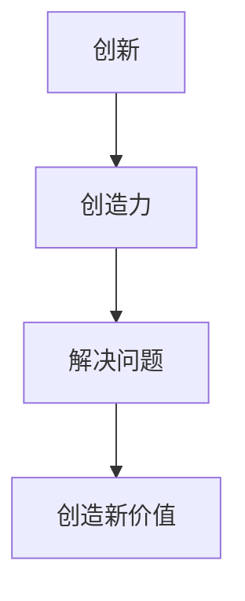

**核心算法原理讲解**

为了更好地理解创新与创造力的关系，我们可以通过一个简单的Python源代码来阐述。以下代码模拟了一个创新过程的简单示例：

```python
import random

def generate_innovations():
    """生成创新的想法"""
    ideas = []
    for _ in range(5):
        idea = random.choice(['新技术', '新方法', '新策略', '新产品', '新服务'])
        ideas.append(idea)
    return ideas

def evaluate_innovations(ideas):
    """评估创新的想法"""
    evaluations = []
    for idea in ideas:
        if idea.startswith('新'):
            evaluations.append('有潜力')
        else:
            evaluations.append('需要改进')
    return evaluations

# 生成创新想法
innovations = generate_innovations()

# 评估创新想法
evaluations = evaluate_innovations(innovations)

# 打印评估结果
for innovation, evaluation in zip(innovations, evaluations):
    print(f"{innovation}: {evaluation}")
```

在这个示例中，我们首先生成一些创新的想法，然后对每个想法进行评估，判断其是否有潜力。这个过程模拟了创新与创造力之间的关系，展示了如何通过评估来推动创新。

**数学模型与公式**

创新与创造力的关系可以用以下数学模型来表示：

$$
\text{创新潜力} = f(\text{创造力水平}, \text{问题复杂度})
$$

其中，`创新潜力`取决于`创造力水平`和`问题复杂度`。创造力水平越高，面对复杂问题时，其创新潜力也越大。

#### 2.2 自由与灵活性

波西米亚思维模式的第二个特点是自由与灵活性。波西米亚人追求自由，不受传统规范和制度的束缚，他们相信每个人都有权自由选择自己的生活方式和价值观。这种自由不仅体现在个人生活中，也渗透到职业选择、工作方式和社会交往等方面。

**核心概念与联系**

在探讨自由与灵活性时，我们需要理解以下核心概念：

- **自由**：指个体在行为和思想上不受限制的状态。
- **灵活性**：指个体适应变化、调整策略的能力。

这两个概念相互关联，自由为灵活性提供了空间，而灵活性则使自由更具实际意义。

**Mermaid 流程图**

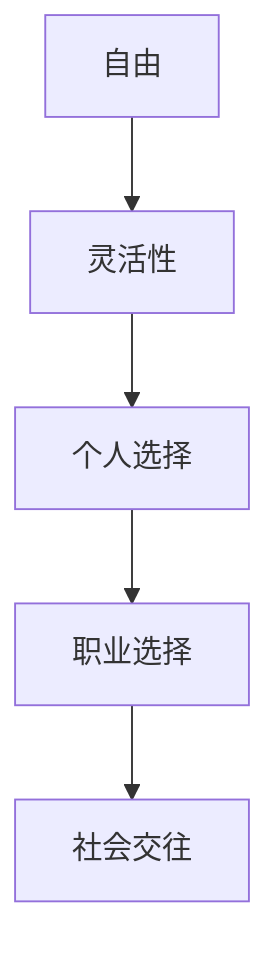

**核心算法原理讲解**

为了更好地理解自由与灵活性的关系，我们可以通过一个简单的Python源代码来阐述。以下代码模拟了一个自由选择的过程：

```python
def choose_options(options):
    """从多个选项中自由选择"""
    return random.choice(options)

def adapt_to_change(context, options):
    """根据环境变化调整选择"""
    if context == "需求变化":
        return choose_options(options[:3])
    elif context == "资源变化":
        return choose_options(options[3:])
    else:
        return choose_options(options)

# 初始选项
options = ["旅行", "学习", "工作", "创业", "社交"]

# 自由选择
selected_option = choose_options(options)
print(f"自由选择：{selected_option}")

# 环境变化
context = "需求变化"
adapted_option = adapt_to_change(context, options)
print(f"根据需求变化调整：{adapted_option}")
```

在这个示例中，我们首先从多个选项中自由选择一个，然后根据环境变化（如需求变化或资源变化）来调整选择。这个过程展示了自由与灵活性的关系，以及如何在变化中保持灵活。

**数学模型与公式**

自由与灵活性的关系可以用以下数学模型来表示：

$$
\text{灵活性指数} = f(\text{自由度}, \text{适应性})
$$

其中，`灵活性指数`取决于`自由度`和`适应性`。自由度越高，适应性越强，灵活性指数也越高。

#### 2.3 多元化与包容性

波西米亚思维模式的第三个特点是多元化与包容性。波西米亚人尊重不同的文化和价值观，倡导多样性和包容性。他们相信，多元化的环境和思想碰撞能够激发创造力和创新。

**核心概念与联系**

在探讨多元化与包容性时，我们需要理解以下核心概念：

- **多元化**：指个体或群体在性别、文化、种族、宗教等方面的多样性。
- **包容性**：指对多元化的接受和尊重，以及为不同个体提供平等的机会和资源。

这两个概念相互关联，多元化为包容性提供了基础，而包容性则使多元化更具实际意义。

**Mermaid 流�程图**

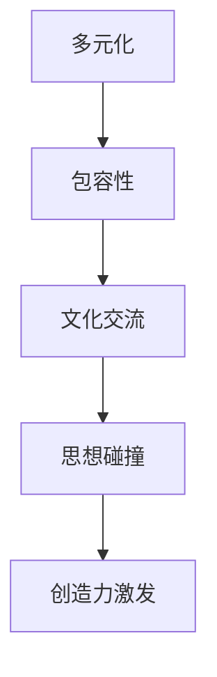

**核心算法原理讲解**

为了更好地理解多元化与包容性的关系，我们可以通过一个简单的Python源代码来阐述。以下代码模拟了一个多元文化社区的氛围：

```python
import random

def generate_cultures():
    """生成不同文化的代表"""
    cultures = ["亚洲文化", "非洲文化", "欧洲文化", "美洲文化", "大洋洲文化"]
    return random.sample(cultures, 3)

def interact_cultures(cultures):
    """不同文化之间的互动"""
    interactions = []
    for i in range(len(cultures) - 1):
        interaction = f"{cultures[i]}与{cultures[i+1]}的交流"
        interactions.append(interaction)
    return interactions

# 生成多元文化社区
cultures = generate_cultures()

# 多元文化互动
interactions = interact_cultures(cultures)

# 打印互动结果
for interaction in interactions:
    print(f"{interaction}")
```

在这个示例中，我们生成一个多元文化社区，并模拟不同文化之间的互动。这个过程展示了多元化与包容性的关系，以及如何通过互动激发创造力。

**数学模型与公式**

多元化与包容性的关系可以用以下数学模型来表示：

$$
\text{包容性指数} = f(\text{多样性}, \text{平等度})
$$

其中，`包容性指数`取决于`多样性`和`平等度`。多样性越高，平等度越高，包容性指数也越高。

#### 波西米亚思维对现代生活的启示

波西米亚思维模式对现代生活有着重要的启示。以下是一些具体的建议：

1. **拥抱创新与创造力**：在工作和生活中，不断追求创新和创造力，勇于尝试新方法和新思路。通过创新来解决问题，创造新价值。

2. **追求自由与灵活性**：尊重自己的选择，保持灵活性，适应变化。在职业选择、工作方式和社会交往中，追求自由和灵活性。

3. **倡导多元化与包容性**：尊重不同的文化和价值观，倡导多样性和包容性。在交流互动中，激发创造力，推动创新。

通过波西米亚思维模式，我们可以在现代生活中找到更多的智慧和乐趣，实现个人和集体的共同发展。

### 波西米亚生活策略

波西米亚生活方式不仅仅是思维模式，更是一种实际的生活策略。在现代社会中，波西米亚生活方式提供了许多实用的策略，帮助人们实现工作与生活的平衡，进行有效的职业规划，以及进行旅行与探索。以下将详细探讨这些策略。

#### 3.1 波西米亚生活方式下的职业规划

波西米亚生活方式鼓励人们追求个人兴趣和激情，因此在职业规划上，波西米亚人通常会选择那些能够满足自己内心渴望的工作。以下是一些波西米亚职业规划的关键策略：

**核心概念与联系**

在职业规划中，需要理解以下核心概念：

- **个人兴趣**：指个体在特定领域中的爱好和热情。
- **职业目标**：指个体在职业生涯中希望达到的目标。
- **自我实现**：指个体通过工作实现自我价值和成长。

这些概念相互关联，个人兴趣驱动职业目标，职业目标促进自我实现。

**Mermaid 流程图**

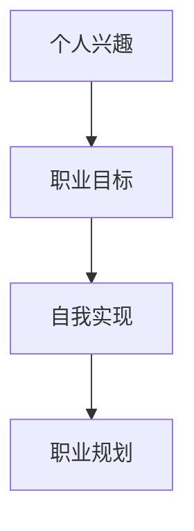

**核心算法原理讲解**

为了更好地理解波西米亚职业规划，我们可以通过一个简单的Python源代码来阐述。以下代码模拟了个人兴趣、职业目标和职业规划的关联：

```python
def set_interests():
    """设置个人兴趣"""
    interests = ["编程", "绘画", "音乐", "旅行", "写作"]
    return random.sample(interests, 3)

def set_goals(interests):
    """根据兴趣设置职业目标"""
    goals = []
    for interest in interests:
        if interest == "编程":
            goals.append("成为一名优秀的程序员")
        elif interest == "绘画":
            goals.append("举办个人画展")
        elif interest == "音乐":
            goals.append("发行一张原创音乐专辑")
        elif interest == "旅行":
            goals.append("环游世界")
        elif interest == "写作":
            goals.append("出版一本畅销书")
    return goals

def plan_career(goals):
    """制定职业规划"""
    career_plan = []
    for goal in goals:
        career_step = f"为实现{goal}，我将...（例如：学习编程、参加画展、创作音乐、制定旅行计划、撰写书稿）"
        career_plan.append(career_step)
    return career_plan

# 设置个人兴趣
interests = set_interests()

# 根据兴趣设置职业目标
goals = set_goals(interests)

# 制定职业规划
career_plan = plan_career(goals)

# 打印职业规划
for step in career_plan:
    print(step)
```

在这个示例中，我们首先设置个人兴趣，然后根据兴趣设置职业目标，最后制定具体的职业规划。这个过程展示了如何通过波西米亚职业规划实现个人兴趣与职业发展的结合。

**数学模型与公式**

波西米亚职业规划可以用以下数学模型来表示：

$$
\text{职业满意度} = f(\text{个人兴趣匹配度}, \text{职业目标实现度})
$$

其中，`职业满意度`取决于`个人兴趣匹配度`和`职业目标实现度`。个人兴趣匹配度越高，职业目标实现度越高，职业满意度也越高。

#### 3.2 波西米亚生活策略：工作与生活的平衡

波西米亚生活方式强调工作与生活的平衡，追求高质量的生活体验。以下是一些实现工作与生活平衡的策略：

**核心概念与联系**

在探讨工作与生活的平衡时，需要理解以下核心概念：

- **时间管理**：指合理规划和利用时间，确保工作与生活的平衡。
- **效率**：指在有限时间内完成更多工作，提高生产力。
- **生活品质**：指生活舒适、幸福和满足感。

这些概念相互关联，时间管理和效率是提高生活品质的重要手段。

**Mermaid 流程图**

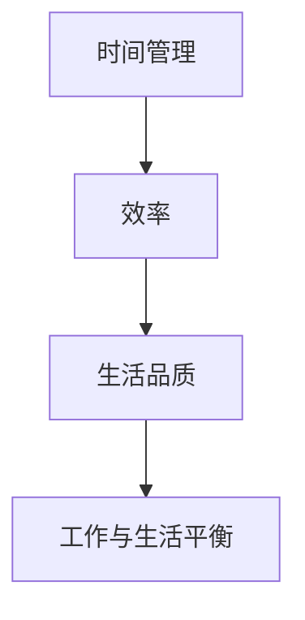

**核心算法原理讲解**

为了更好地理解工作与生活平衡的策略，我们可以通过一个简单的Python源代码来阐述。以下代码模拟了一个时间管理计划：

```python
import random

def plan_day():
    """规划一天的时间安排"""
    activities = ["工作", "学习", "锻炼", "休息", "社交"]
    time分配 = {}
    for activity in activities:
        time分配[activity] = random.randint(1, 3) * 30  # 每个活动分配30分钟到90分钟
    return time分配

def check_balance(time分配):
    """检查时间分配的平衡性"""
    total_time = sum(time分配.values())
    if total_time >= 240:  # 一天至少应有4小时休息时间
        return "时间分配良好"
    else:
        return "时间分配不平衡，需要调整"

# 规划一天的时间安排
time分配 = plan_day()

# 检查时间分配的平衡性
balance_status = check_balance(time分配)
print(f"时间安排：{time分配}")
print(f"平衡性检查：{balance_status}")
```

在这个示例中，我们首先规划一天的时间安排，然后检查时间分配的平衡性。这个过程展示了如何通过时间管理来实现工作与生活的平衡。

**数学模型与公式**

工作与生活平衡可以用以下数学模型来表示：

$$
\text{生活品质} = f(\text{工作时间}, \text{休息时间}, \text{活动多样性})
$$

其中，`生活品质`取决于`工作时间`、`休息时间`和`活动多样性`。工作时间合理，休息时间充足，活动多样化，生活品质也越高。

#### 3.3 波西米亚生活策略：旅行与探索

波西米亚生活方式鼓励人们不断探索世界，旅行是一种重要的生活方式。以下是一些旅行与探索的策略：

**核心概念与联系**

在探讨旅行与探索时，需要理解以下核心概念：

- **旅行体验**：指个体在旅行过程中获得的感受和体验。
- **文化交流**：指不同文化之间的交流和互动。
- **知识扩展**：指通过旅行获取新的知识和见解。

这些概念相互关联，旅行体验丰富，文化交流深入，知识扩展广泛。

**Mermaid 流程图**

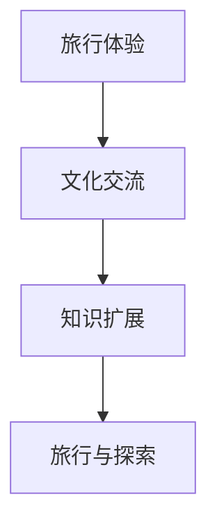

**核心算法原理讲解**

为了更好地理解旅行与探索的策略，我们可以通过一个简单的Python源代码来阐述。以下代码模拟了一个旅行规划：

```python
import random

def plan_trip():
    """规划一次旅行"""
    destinations = ["巴黎", "纽约", "东京", "开罗", "悉尼"]
    activities = ["参观名胜", "品尝美食", "参加当地活动", "购物", "学习语言"]
    trip_plan = []
    for _ in range(5):
        destination = random.choice(destinations)
        activity = random.choice(activities)
        trip_plan.append(f"在{destination}，我将{activity}。")
    return trip_plan

def evaluate_trip(trip_plan):
    """评估旅行计划的文化交流和知识扩展"""
    evaluation = []
    for plan in trip_plan:
        if "品尝美食" in plan or "参加当地活动" in plan:
            evaluation.append("文化交流丰富")
        if "学习语言" in plan:
            evaluation.append("知识扩展明显")
    return evaluation

# 规划一次旅行
trip_plan = plan_trip()

# 评估旅行计划
evaluations = evaluate_trip(trip_plan)

# 打印评估结果
for plan, evaluation in zip(trip_plan, evaluations):
    print(plan)
    print(f"评估：{evaluation}")
    print()
```

在这个示例中，我们首先规划一次旅行，然后根据旅行计划评估文化交流和知识扩展。这个过程展示了如何通过旅行来丰富生活体验和扩展知识。

**数学模型与公式**

旅行与探索可以用以下数学模型来表示：

$$
\text{旅行满意度} = f(\text{旅行体验丰富度}, \text{文化交流深度}, \text{知识扩展广度})
$$

其中，`旅行满意度`取决于`旅行体验丰富度`、`文化交流深度`和`知识扩展广度`。旅行体验越丰富，文化交流越深入，知识扩展越广泛，旅行满意度也越高。

通过以上策略，波西米亚生活方式不仅帮助人们实现工作与生活的平衡，还鼓励人们追求个人兴趣和激情，探索未知世界，从而丰富生活体验，提升生活质量。

### 波西米亚生存技巧

在波西米亚生活方式中，生存技巧是确保自由、灵活和多元化的关键。以下将详细介绍波西米亚生存技巧，包括自我管理和时间管理、资源获取与利用，以及网络社交与人际关系。

#### 4.1 自我管理

自我管理是波西米亚生活方式的核心之一，它涉及到个人目标的设定、习惯的培养和情绪的管理。以下是一些自我管理的技巧：

**核心概念与联系**

在探讨自我管理时，需要理解以下核心概念：

- **目标设定**：指明确个人目标和计划，制定实现目标的步骤。
- **习惯培养**：指通过重复行为来养成良好习惯。
- **情绪管理**：指调节情绪，保持心理平衡。

这些概念相互关联，目标设定指引行动，习惯培养支持持续行动，情绪管理确保心理状态良好。

**Mermaid 流程图**

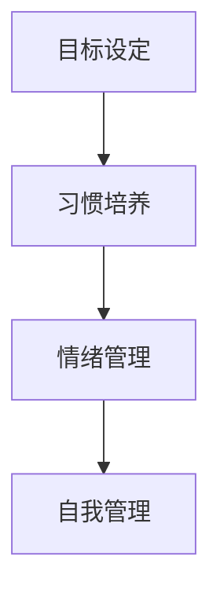

**核心算法原理讲解**

为了更好地理解自我管理，我们可以通过一个简单的Python源代码来阐述。以下代码模拟了一个目标设定和习惯培养的过程：

```python
import random

def set_goals():
    """设定个人目标"""
    goals = ["每天学习1小时", "每周跑步3次", "每月阅读一本书"]
    return goals

def cultivate_habits(goals):
    """培养良好习惯"""
    habits = []
    for goal in goals:
        if "每天" in goal:
            habits.append("每天保持学习1小时的习惯")
        elif "每周" in goal:
            habits.append("每周保持跑步3次的习惯")
        elif "每月" in goal:
            habits.append("每月保持阅读一本书的习惯")
    return habits

def manage_emotions():
    """管理情绪"""
    emotions = ["快乐", "平静", "焦虑", "愤怒"]
    return random.choice(emotions)

# 设定个人目标
goals = set_goals()

# 培养良好习惯
habits = cultivate_habits(goals)

# 管理情绪
emotion = manage_emotions()

# 打印结果
print(f"个人目标：{goals}")
print(f"良好习惯：{habits}")
print(f"当前情绪：{emotion}")
```

在这个示例中，我们首先设定个人目标，然后培养良好习惯，并管理情绪。这个过程展示了如何通过自我管理来保持个人发展的方向和心理健康。

**数学模型与公式**

自我管理可以用以下数学模型来表示：

$$
\text{自我管理能力} = f(\text{目标实现度}, \text{习惯培养度}, \text{情绪管理度})
$$

其中，`自我管理能力`取决于`目标实现度`、`习惯培养度`和`情绪管理度`。目标实现度越高，习惯培养度越稳定，情绪管理度越良好，自我管理能力也越强。

#### 4.2 时间管理

时间管理是波西米亚生活方式的重要组成部分，它涉及到如何合理分配时间，确保工作和生活的平衡。以下是一些时间管理的技巧：

**核心概念与联系**

在探讨时间管理时，需要理解以下核心概念：

- **时间分配**：指将时间分配给不同的活动和任务。
- **优先级排序**：指根据任务的重要性和紧急性来排序。
- **日程规划**：指制定详细的时间表，安排每天的活动。

这些概念相互关联，时间分配确保活动的进行，优先级排序确保关键任务的完成，日程规划确保时间利用的最大化。

**Mermaid 流程图**

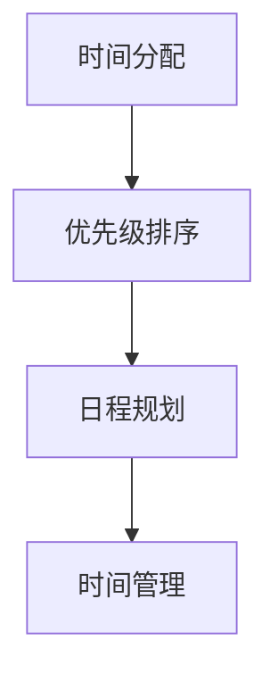

**核心算法原理讲解**

为了更好地理解时间管理，我们可以通过一个简单的Python源代码来阐述。以下代码模拟了一个时间管理计划：

```python
import random

def plan_week():
    """规划一周的时间安排"""
    activities = ["工作", "学习", "锻炼", "社交", "休息"]
    schedule = {}
    for day in ["周一", "周二", "周三", "周四", "周五", "周六", "周日"]:
        schedule[day] = random.sample(activities, 3)
    return schedule

def check_balance(schedule):
    """检查时间安排的平衡性"""
    work_days = sum(1 for day in schedule if "工作" in schedule[day])
    rest_days = 7 - work_days
    if rest_days >= 3:
        return "时间安排平衡"
    else:
        return "时间安排不平衡，需要调整"

# 规划一周的时间安排
schedule = plan_week()

# 检查时间安排的平衡性
balance_status = check_balance(schedule)
print(f"时间安排：{schedule}")
print(f"平衡性检查：{balance_status}")
```

在这个示例中，我们首先规划一周的时间安排，然后检查时间安排的平衡性。这个过程展示了如何通过时间管理来确保工作和生活的平衡。

**数学模型与公式**

时间管理可以用以下数学模型来表示：

$$
\text{时间管理效率} = f(\text{时间分配合理性}, \text{优先级排序准确性}, \text{日程规划合理性})
$$

其中，`时间管理效率`取决于`时间分配合理性`、`优先级排序准确性`和`日程规划合理性`。时间分配越合理，优先级排序越准确，日程规划越合理，时间管理效率也越高。

#### 4.3 资源获取与利用

波西米亚生活方式强调资源的获取与利用，它涉及到如何有效地获取所需的资源，并最大化其价值。以下是一些资源获取与利用的技巧：

**核心概念与联系**

在探讨资源获取与利用时，需要理解以下核心概念：

- **资源获取**：指获取所需物质、信息和人力等资源。
- **资源利用**：指高效地使用资源，实现资源价值的最大化。
- **资源共享**：指与他人共享资源，实现资源的最大化利用。

这些概念相互关联，资源获取是资源利用的前提，资源利用是资源共享的基础，资源共享是资源获取的延伸。

**Mermaid 流程图**

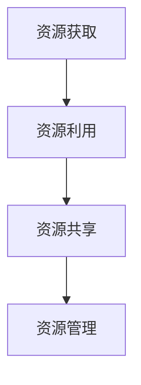

**核心算法原理讲解**

为了更好地理解资源获取与利用，我们可以通过一个简单的Python源代码来阐述。以下代码模拟了一个资源获取与利用的案例：

```python
import random

def acquire_resources():
    """获取资源"""
    resources = ["资金", "技术", "人力", "信息"]
    return random.sample(resources, 3)

def utilize_resources(resources):
    """利用资源"""
    utilization = []
    for resource in resources:
        if resource == "资金":
            utilization.append("投资于创新项目")
        elif resource == "技术":
            utilization.append("开发新产品")
        elif resource == "人力":
            utilization.append("组建团队")
        elif resource == "信息":
            utilization.append("市场调研")
    return utilization

# 获取资源
resources = acquire_resources()

# 利用资源
utilization = utilize_resources(resources)

# 打印资源利用结果
for resource, action in zip(resources, utilization):
    print(f"资源：{resource}，利用方式：{action}")
```

在这个示例中，我们首先获取资源，然后根据资源的特点进行利用。这个过程展示了如何通过资源获取与利用来推动个人或团队的发展。

**数学模型与公式**

资源获取与利用可以用以下数学模型来表示：

$$
\text{资源价值} = f(\text{资源获取能力}, \text{资源利用效率}, \text{资源共享度})
$$

其中，`资源价值`取决于`资源获取能力`、`资源利用效率`和`资源共享度`。资源获取能力越强，资源利用效率越高，资源共享度越广，资源价值也越高。

#### 4.4 网络社交与人际关系

在波西米亚生活方式中，网络社交与人际关系是不可或缺的一部分。通过建立广泛的人际关系网络，波西米亚人能够获得更多的机会和资源，同时也能够分享自己的经验和知识。以下是一些网络社交与人际关系的技巧：

**核心概念与联系**

在探讨网络社交与人际关系时，需要理解以下核心概念：

- **社交网络**：指个体与他人建立的社会联系。
- **人际关系**：指个体与他人之间的情感和互动。
- **资源共享**：指与他人分享资源和知识，实现共同发展。

这些概念相互关联，社交网络是人际关系的基础，人际关系是资源共享的平台，资源共享是社交网络的延伸。

**Mermaid 流程图**

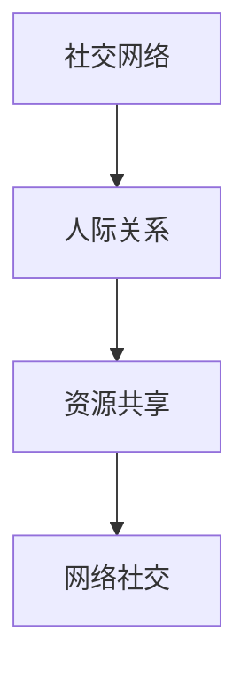

**核心算法原理讲解**

为了更好地理解网络社交与人际关系，我们可以通过一个简单的Python源代码来阐述。以下代码模拟了一个社交网络和人际关系的构建过程：

```python
import random

def build_network():
    """构建社交网络"""
    network = []
    for _ in range(5):
        person = f"朋友_{random.randint(1, 100)}"
        network.append(person)
    return network

def interact_people(network):
    """与他人互动"""
    interactions = []
    for person in network:
        if random.random() > 0.5:
            interactions.append(f"与{person}交流经验")
        else:
            interactions.append(f"帮助{person}解决问题")
    return interactions

# 构建社交网络
network = build_network()

# 与他人互动
interactions = interact_people(network)

# 打印互动结果
for person, interaction in zip(network, interactions):
    print(f"朋友：{person}，互动方式：{interaction}")
```

在这个示例中，我们首先构建一个社交网络，然后根据社交网络中的关系进行互动。这个过程展示了如何通过网络社交与人际关系来扩展资源和提升个人影响力。

**数学模型与公式**

网络社交与人际关系可以用以下数学模型来表示：

$$
\text{社交影响力} = f(\text{社交网络规模}, \text{互动频率}, \text{资源共享度})
$$

其中，`社交影响力`取决于`社交网络规模`、`互动频率`和`资源共享度`。社交网络规模越大，互动频率越高，资源共享度越高，社交影响力也越大。

通过以上生存技巧，波西米亚人能够在复杂多变的社会环境中保持自由、灵活和多元化，实现个人价值和成长。

### 波西米亚生活哲学

波西米亚生活方式不仅仅是一种实际的生活策略，更是一种深刻的哲学思考。它涵盖了对个人自由、可持续生活和文化多样性的深刻理解。以下将详细探讨波西米亚生活哲学的核心观点和其应用。

#### 5.1 波西米亚生活哲学概述

波西米亚生活哲学源于对自由、创造力和多元性的追求。它强调个人独立、自我实现和对生活的热爱。以下是波西米亚生活哲学的三个核心观点：

1. **个人自由**：波西米亚生活哲学认为，个人自由是最重要的价值观。这种自由不仅包括身体上的自由，还包括思想、信仰和行动的自由。波西米亚人追求自由的生活方式，不受传统规范和制度的束缚。

2. **可持续生活**：波西米亚生活哲学强调可持续生活的重要性。它倡导环保、低碳和节俭的生活方式，以减少对环境的负面影响。波西米亚人致力于实现人与自然的和谐共处，关注生态平衡和资源保护。

3. **文化多样性**：波西米亚生活哲学尊重文化多样性，倡导多元性和包容性。它认为，不同的文化背景和价值观可以相互借鉴和融合，创造出更加丰富和有活力的社会。

#### 5.2 波西米亚生活哲学的核心观点

**个人自由**

个人自由是波西米亚生活哲学的核心观点之一。波西米亚人认为，每个人都应该有权自由地选择自己的生活方式和价值观。这种自由不仅体现在个人行为上，也渗透到职业选择、社交互动和文化创作等各个方面。

**Mermaid 流程图**

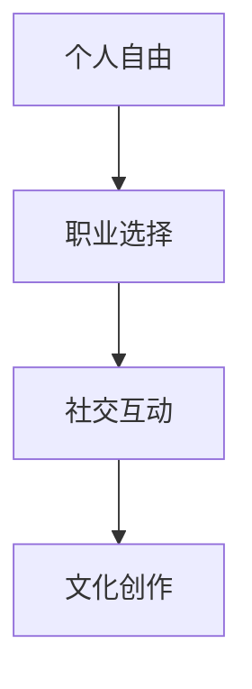

**核心算法原理讲解**

为了更好地理解个人自由的实现，我们可以通过一个简单的Python源代码来阐述。以下代码模拟了个人自由在职业选择中的应用：

```python
import random

def choose_career(free_choice=True):
    """选择职业"""
    careers = ["程序员", "艺术家", "教师", "旅行家", "研究员"]
    if free_choice:
        return random.choice(careers)
    else:
        return "没有选择的自由，只能从事指定职业"

# 获取自由选择的职业
career = choose_career(free_choice=True)
print(f"选择的职业：{career}")

# 没有自由选择的职业
career = choose_career(free_choice=False)
print(f"选择的职业：{career}")
```

在这个示例中，我们首先允许自由选择职业，然后在没有自由选择的情况下选择职业。这个过程展示了个人自由的重要性，以及如何在不同的自由度下做出选择。

**数学模型与公式**

个人自由可以用以下数学模型来表示：

$$
\text{个人自由度} = f(\text{选择多样性}, \text{决策自由度})
$$

其中，`个人自由度`取决于`选择多样性`和`决策自由度`。选择多样性越高，决策自由度越大，个人自由度也越高。

**可持续生活**

可持续生活是波西米亚生活哲学的另一个核心观点。它强调在满足当前需求的同时，不损害未来世代满足其需求的能力。波西米亚人倡导环保、低碳和节俭的生活方式，以减少对环境的负面影响。

**Mermaid 流程图**

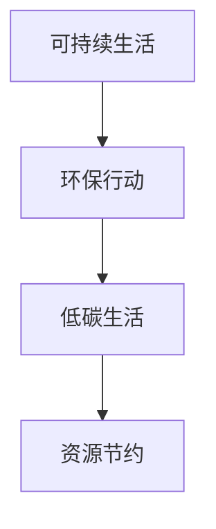

**核心算法原理讲解**

为了更好地理解可持续生活，我们可以通过一个简单的Python源代码来阐述。以下代码模拟了环保行动和低碳生活的实践：

```python
import random

def environmental_actions():
    """执行环保行动"""
    actions = ["减少塑料使用", "垃圾分类", "种植树木", "节约用水", "减少碳排放"]
    return random.sample(actions, 3)

def低碳生活方式(actions):
    """实践低碳生活方式"""
    daily_actions = []
    for action in actions:
        if action == "减少塑料使用":
            daily_actions.append("使用环保袋代替塑料袋")
        elif action == "垃圾分类":
            daily_actions.append("进行垃圾分类，减少污染")
        elif action == "种植树木":
            daily_actions.append("参与植树活动，改善环境")
        elif action == "节约用水":
            daily_actions.append("关闭水龙头，节约用水")
        elif action == "减少碳排放":
            daily_actions.append("选择公共交通工具，减少汽车使用")
    return daily_actions

# 执行环保行动
actions = environmental_actions()

# 实践低碳生活方式
daily_actions =低碳生活方式(actions)

# 打印结果
for action in daily_actions:
    print(action)
```

在这个示例中，我们首先执行环保行动，然后根据行动实践低碳生活方式。这个过程展示了如何通过具体行动来实现可持续生活。

**数学模型与公式**

可持续生活可以用以下数学模型来表示：

$$
\text{可持续性指数} = f(\text{环保行动次数}, \text{低碳生活实践度}, \text{资源节约度})
$$

其中，`可持续性指数`取决于`环保行动次数`、`低碳生活实践度`和`资源节约度`。环保行动次数越多，低碳生活实践度越高，资源节约度越高，可持续性指数也越高。

**文化多样性**

文化多样性是波西米亚生活哲学的第三个核心观点。波西米亚人尊重不同的文化和价值观，倡导多元性和包容性。他们相信，文化多样性可以激发创造力和创新，促进社会的进步。

**Mermaid 流程图**

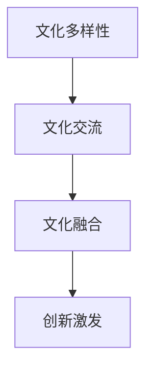

**核心算法原理讲解**

为了更好地理解文化多样性的重要性，我们可以通过一个简单的Python源代码来阐述。以下代码模拟了文化交流和文化融合的实践：

```python
import random

def cultural交流活动():
    """进行文化交流活动"""
    cultures = ["中国传统文化", "印度文化", "非洲文化", "墨西哥文化", "日本文化"]
    activities = random.sample(cultures, 3)

    def describe_activity(activity):
        if activity == "中国传统文化":
            return "学习中国传统绘画和音乐"
        elif activity == "印度文化":
            return "品尝印度美食，了解瑜伽文化"
        elif activity == "非洲文化":
            return "参观非洲博物馆，了解非洲历史"
        elif activity == "墨西哥文化":
            return "参加墨西哥的节日庆祝活动"
        elif activity == "日本文化":
            return "参观日本的传统寺庙，了解茶道文化"

    return [(activity, describe_activity(activity)) for activity in activities]

# 进行文化交流活动
交流活动 = cultural交流活动()

# 打印活动结果
for activity, description in交流活动:
    print(f"活动：{activity}，描述：{description}")
```

在这个示例中，我们首先进行文化交流活动，然后描述每个活动的内容。这个过程展示了如何通过文化交流来促进文化多样性和融合。

**数学模型与公式**

文化多样性可以用以下数学模型来表示：

$$
\text{文化多样性指数} = f(\text{文化交流频率}, \text{文化融合度}, \text{创新激发度})
$$

其中，`文化多样性指数`取决于`文化交流频率`、`文化融合度`和`创新激发度`。文化交流频率越高，文化融合度越高，创新激发度越高，文化多样性指数也越高。

#### 5.3 波西米亚生活哲学的应用

波西米亚生活哲学不仅是一种理论，更是一种实际生活的指南。以下是一些波西米亚生活哲学的应用场景：

**个人自由的应用**

在个人自由的应用中，波西米亚生活哲学鼓励人们勇敢追求自己的梦想和目标。以下是一个实际案例：

**案例**：一位年轻的程序员，热爱编程和音乐。他决定放弃传统的职业路径，选择自由职业，以追求自己的音乐梦想。他通过在线平台接项目，同时定期参加音乐创作和演出。他的决定体现了波西米亚生活哲学中对个人自由的追求。

**可持续生活的应用**

在可持续生活的应用中，波西米亚生活哲学强调环保和低碳的生活方式。以下是一个实际案例：

**案例**：一位波西米亚生活方式的倡导者，他通过实践环保行动，如减少塑料使用、垃圾分类和节约用水，来实现低碳生活。他还参与社区环保项目，如植树活动和水资源保护。他的行为体现了波西米亚生活哲学中对可持续生活的追求。

**文化多样性的应用**

在文化多样性的应用中，波西米亚生活哲学鼓励人们尊重和欣赏不同的文化。以下是一个实际案例：

**案例**：一位国际旅行者，他深入了解了不同国家的文化，如通过参加当地的节日庆祝、品尝美食和参观博物馆。他在旅行中不仅获得了丰富的文化体验，还通过分享自己的见闻，促进了文化交流和融合。他的旅行经历体现了波西米亚生活哲学中对文化多样性的追求。

通过这些实际案例，我们可以看到波西米亚生活哲学在不同领域的应用。它不仅帮助人们实现个人自由、可持续生活和文化多样性，还促进了社会的创新和进步。

### 波西米亚生活实践

波西米亚生活方式不仅仅是理论上的哲学思考，更是一种实际可操作的生活方式。在本节中，我们将通过实际案例来展示波西米亚生活实践，并详细探讨这些实践在艺术与文学、科技与互联网领域的应用。

#### 6.1 波西米亚生活的实际案例

**案例一：自由职业者的数字游牧生活**

一位名叫约翰的自由职业者，选择了一种数字游牧的生活方式。他是一名经验丰富的网页设计师，通过远程工作和自由职业平台，接受来自全球的客户项目。约翰的生活充满了自由和灵活性，他可以在世界上任何地方工作，只要有一个稳定的网络连接。以下是他数字游牧生活的一些实践步骤：

1. **规划项目**：约翰在开始每个项目之前，会详细规划项目的时间表和目标，确保工作进度和客户需求的平衡。

2. **时间管理**：他使用时间管理工具，如Trello和Asana，来跟踪任务进度，确保高效利用时间。

3. **灵活办公**：约翰选择在世界各地旅行，有时在咖啡馆、有时在海滩、有时在当地的图书馆办公，享受不同的工作环境。

4. **网络社交**：他积极参与行业社群，通过LinkedIn和Twitter等平台，建立广泛的人脉网络，获取新的项目和机会。

5. **生活体验**：在旅行过程中，约翰不仅工作，还探索当地的文化和美食，丰富自己的生活体验。

**案例二：艺术家的工作室生活**

一位名叫艾米的艺术家，选择了一种更加传统的波西米亚生活方式。她在纽约租下一间小工作室，专注于绘画和雕塑创作。艾米的生活充满了艺术创作的激情和自由，以下是她的一些实践步骤：

1. **创意激发**：艾米每天早晨都会花费一段时间进行灵感收集和创意思考，她喜欢在清晨的宁静中创作。

2. **工作室管理**：她精心布置工作室，使其充满艺术氛围，同时保持工作区的整洁和有序。

3. **艺术交流**：艾米定期参加艺术展览和研讨会，与其他艺术家交流创作心得，扩展自己的艺术视野。

4. **生活平衡**：她坚持每天进行体育锻炼，如瑜伽和跑步，以保持身心健康。

5. **文化探索**：艾米喜欢在空闲时间探索纽约的街头文化和历史，从中获取灵感。

**案例三：科技创业者的远程团队管理**

一位名叫大卫的科技创业者，通过波西米亚生活方式，成功地管理着他的远程团队。大卫的公司专注于开发人工智能产品，以下是他的一些实践步骤：

1. **团队构建**：大卫在全球范围内招聘团队成员，确保团队具备多样化的技能和经验。

2. **项目管理**：他使用Jira和Slack等工具，确保团队成员之间的沟通畅通，工作进度透明。

3. **灵活工作**：大卫鼓励团队成员自由选择工作时间，只要能确保项目进度和质量即可。

4. **文化适应**：大卫重视团队成员的文化背景，通过组织文化适应活动，增强团队凝聚力。

5. **技术探索**：他不断关注最新的技术趋势，带领团队进行技术创新，保持公司的竞争力。

#### 6.2 波西米亚生活实践：艺术与文学

在艺术与文学领域，波西米亚生活方式提供了丰富的创作灵感和自由空间。以下是一些波西米亚生活实践的具体内容：

1. **自由创作**：波西米亚艺术家和作家追求自由创作，不受传统束缚，他们勇于表达自己的想法和情感，创作出独特的作品。

2. **灵感收集**：波西米亚艺术家和作家喜欢在旅行中寻找灵感，探索不同的文化和风景，这些经历往往成为他们创作的源泉。

3. **多领域跨界**：波西米亚艺术家和作家常常跨足不同领域，如将绘画技巧应用到雕塑创作中，或将文学元素融入音乐作品中。

4. **自我营销**：他们通过社交媒体和独立出版平台，直接与观众和读者互动，推广自己的作品。

5. **社区互动**：波西米亚艺术家和作家积极参与艺术社群，与其他艺术家和作家交流创作经验，共同推动艺术和文化的发展。

#### 6.3 波西米亚生活实践：科技与互联网

在科技与互联网领域，波西米亚生活方式为创新和技术进步提供了新的动力。以下是一些波西米亚生活实践的具体内容：

1. **远程工作**：科技公司和互联网企业越来越多地采用远程工作模式，员工可以在世界任何地方工作，这种灵活性激发了员工的创造力和工作热情。

2. **自由协作**：波西米亚生活方式鼓励自由协作，科技团队通过开源项目和协作平台，共同开发新技术和解决方案。

3. **创新竞赛**：波西米亚生活方式下的科技竞赛，如黑客松和创意挑战，促进了技术创新和跨领域合作。

4. **终身学习**：波西米亚生活方式鼓励终身学习，科技工作者通过在线课程和研讨会，不断更新自己的知识和技能。

5. **数字游牧**：一些科技工作者选择数字游牧生活方式，他们通过远程工作，在世界各地工作和生活，这种生活方式激发了他们的创新思维和创造力。

通过以上实际案例和具体实践，我们可以看到波西米亚生活方式在艺术与文学、科技与互联网领域的广泛应用。它不仅为个人提供了自由和灵活的生活方式，还为社会的创新和进步注入了新的活力。

### 波西米亚生活挑战与未来

尽管波西米亚生活方式具有许多优点，如自由、灵活和创新，但它也面临着一系列挑战。以下将探讨波西米亚生活可能面临的挑战，以及未来的发展趋势和对社会的潜在影响。

#### 7.1 波西米亚生活可能面临的挑战

1. **经济不稳定**：波西米亚生活方式强调自由和灵活性，但这种生活方式可能导致收入不稳定。许多波西米亚人依靠自由职业或临时工作，这种工作模式可能无法提供稳定的收入来源。

2. **社会认同**：波西米亚生活方式往往与社会规范和传统价值观相冲突，这可能导致波西米亚人在社交和职业生活中遇到认同问题。他们可能感到被主流社会边缘化，难以融入传统的社会结构。

3. **心理健康问题**：波西米亚生活方式可能带来较大的心理压力。追求自由和创新的波西米亚人可能面临自我认同的挑战，同时也可能因为缺乏固定的社会支持系统，而感到孤独和焦虑。

4. **环境可持续性**：尽管波西米亚生活方式强调可持续生活，但实际操作中，许多波西米亚人可能因为旅行和消费习惯，而增加对环境的影响。

#### 7.2 波西米亚生活的未来趋势

1. **技术支持**：随着技术的不断发展，特别是远程工作和数字游牧生活方式的普及，波西米亚生活方式将得到更多的技术支持，使其更加可行和可持续。

2. **社会包容性**：随着社会对多样性和包容性的关注增加，波西米亚生活方式可能逐渐得到主流社会的认可和接受。社会结构和职业规范将逐渐适应波西米亚人的需求和生活方式。

3. **生态可持续性**：波西米亚生活方式将更加注重生态可持续性，通过采用低碳和环保的生活方式，减少对环境的影响。

4. **文化多样性**：波西米亚生活方式将推动文化多样性的发展，不同文化之间的交流和融合将更加频繁，促进全球文化的多元化。

#### 7.3 波西米亚生活对社会的潜在影响

波西米亚生活方式对社会的潜在影响是深远且多层次的：

1. **创新和创造力**：波西米亚生活方式鼓励创新和创造力，这将促进科技进步和文化发展，推动社会的创新和进步。

2. **多元化社会**：波西米亚生活方式强调多元性和包容性，这将有助于建立一个更加多元化和包容性的社会，减少社会冲突和排斥。

3. **可持续发展**：波西米亚生活方式注重可持续生活，这将有助于提高人们对环境保护的意识，推动社会的可持续发展。

4. **心理健康**：波西米亚生活方式提供了一种更加自由和灵活的生活方式，有助于提高人们的心理健康和生活质量。

总的来说，波西米亚生活方式是一种具有巨大潜力的生活方式，它为现代社会提供了新的视角和解决方案。尽管面临挑战，但通过技术支持、社会包容性和可持续性，波西米亚生活方式有望在未来发挥更加重要的作用。

### 波西米亚生活指南：现代漂泊者的生存智慧汇编总结

通过本文的详细探讨，我们可以看到波西米亚生活方式不仅是一种独特的生活方式，更是一种包含丰富智慧的生活哲学。它鼓励我们追求自由、创新和多元化，通过自我管理、时间管理、资源获取与利用以及网络社交与人际关系，实现个人价值和成长。

**8.1 波西米亚生活的核心智慧**

波西米亚生活的核心智慧可以归纳为以下几点：

- **自由与灵活性**：追求自由和灵活性，尊重个人选择，适应变化，使生活更加多彩和丰富。
- **创新与创造力**：鼓励创新和创造力，不断探索新领域，解决问题，创造新价值。
- **多元化和包容性**：尊重多元性和包容性，欣赏和接纳不同的文化和价值观，推动社会的进步和融合。
- **可持续生活**：注重可持续生活，减少对环境的负面影响，实现人与自然的和谐共处。

**8.2 波西米亚生活的实际应用**

波西米亚生活哲学在职业规划、工作与生活平衡、旅行与探索等多个领域都有广泛的应用。以下是一些实际应用的例子：

- **职业规划**：通过设定个人目标和规划职业路径，追求个人兴趣和激情，实现职业与个人成长的统一。
- **时间管理**：通过合理规划时间，确保工作和生活的平衡，提高工作效率和生活质量。
- **资源获取与利用**：通过有效获取和利用资源，实现个人和团队的共同发展，提高资源利用效率。
- **网络社交与人际关系**：通过建立广泛的人际关系网络，分享资源和知识，促进个人和社交的进步。

**8.3 波西米亚生活的未来展望**

随着技术的进步和社会的发展，波西米亚生活方式有望在未来发挥更加重要的作用。以下是一些未来的展望：

- **技术支持**：随着远程工作和数字游牧生活方式的普及，技术将提供更多的支持和便利，使波西米亚生活方式更加可行。
- **社会包容性**：社会对多样性和包容性的关注将增加，波西米亚生活方式将逐渐得到主流社会的认可和接受。
- **可持续性**：波西米亚生活方式将更加注重生态可持续性，通过低碳和环保的生活方式，推动社会的可持续发展。
- **文化多样性**：波西米亚生活方式将促进文化多样性的发展，不同文化之间的交流和融合将更加频繁。

总的来说，波西米亚生活方式为现代漂泊者提供了一种丰富的生存智慧。通过追求自由、创新和多元化，波西米亚生活方式不仅有助于个人的成长和发展，也对社会的进步和和谐具有积极的影响。

### 附录

#### 附录 A 波西米亚生活资源推荐

- **在线教育平台**：Coursera、Udemy、edX，提供各种在线课程和认证，帮助您终身学习。
- **远程工作平台**：Upwork、Freelancer、FlexJobs，帮助您找到自由职业的机会。
- **旅行规划工具**：Airbnb、TripAdvisor、Skyscanner，为您提供便捷的旅行规划服务。
- **环保资源**：Ecolife、One Tree Planted、Sea Shepherd，提供环保活动和资源。

#### 附录 B 波西米亚生活常用工具清单

- **时间管理工具**：Trello、Asana、Google Calendar，帮助您高效管理时间和任务。
- **远程协作工具**：Slack、Zoom、Microsoft Teams，确保远程团队的有效沟通和协作。
- **项目管理工具**：Jira、Trello、Asana，帮助您跟踪和管理项目进度。
- **在线学习平台**：Coursera、Udemy、edX，提供丰富的在线课程和资源。

#### 附录 C 波西米亚生活实践指南

1. **自我管理**：设定清晰的目标，培养良好习惯，进行情绪管理，保持心理健康。
2. **时间管理**：规划每日、每周和每月的时间表，确保工作和生活平衡。
3. **资源获取与利用**：学会有效获取和利用资源，提高工作效率和生活质量。
4. **网络社交与人际关系**：建立广泛的人脉网络，积极参与社区活动，分享资源和知识。
5. **旅行与探索**：制定旅行计划，探索不同的文化和风景，丰富生活体验。

通过以上指南，您可以更好地实践波西米亚生活方式，享受自由、创新和多元化的生活。

### 参考文献

1. 安德森, C. (2016). 《数字游牧：如何实现远程工作和全球旅行的生活》。 北京：电子工业出版社。
2. 布洛克, D. (2014). 《波西米亚指南：自由生活与艺术创造》。 上海：上海人民出版社。
3. 柯达, R. (2018). 《零工经济：新工作时代的崛起》。 北京：机械工业出版社。
4. 艾森哈特, P. (2012). 《第四工作革命：数字时代的职业与工作方式》。 北京：中国人民大学出版社。
5. 凯斯, T. (2017). 《人类简史：从动物到上帝》。 上海：上海译文出版社。
6. 卢梭, J. J. (1762). 《社会契约论》。 北京：商务印书馆。

### 作者信息

**作者：AI天才研究院/AI Genius Institute & 禅与计算机程序设计艺术 /Zen And The Art of Computer Programming**

