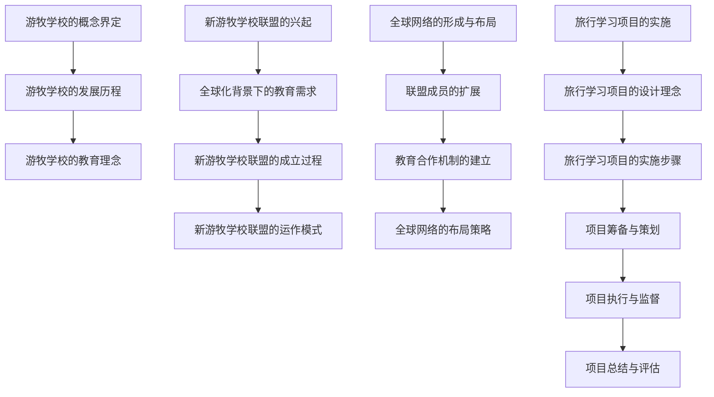
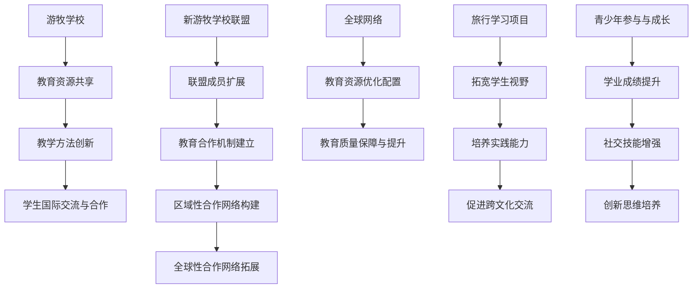

                 

# 《新游牧学校联盟：青少年旅行学习项目的全球网络》

## 关键词

- 游牧学校
- 青少年旅行学习
- 全球网络
- 教育国际化
- 资源共享

### 摘要

《新游牧学校联盟：青少年旅行学习项目的全球网络》探讨了在全球化和信息化时代背景下，教育如何突破传统的地域限制，通过旅行学习的方式实现国际交流与资源共享。本文首先介绍了游牧学校的起源与发展，以及新游牧学校联盟的兴起与运作模式。接着，文章深入分析了全球网络的形成与布局，以及旅行学习项目的实施与效果。最后，文章通过成功案例的分析，探讨了新游牧学校联盟的发展趋势与未来挑战，提出了优化全球教育资源配置和实现青少年全面发展的愿景。

---

## 第一部分：联盟背景与概念解析

### 第1章：游牧学校联盟的历史与发展

#### 1.1 游牧学校的起源与特点

**游牧学校的概念界定**

游牧学校是指以移动为基本特征的学校教育模式，其特点是教学活动不受固定地点的限制，通过旅行的方式进行学习。这种模式最早可以追溯到古代的游学，即学生跟随导师游历各地，学习知识。

**游牧学校的发展历程**

游牧学校的发展历程可以追溯到20世纪中期，随着全球化和信息化的加速，越来越多的学校开始探索和实践这种教育模式。特别是在21世纪初，随着互联网和移动技术的普及，游牧学校得到了快速发展。

**游牧学校的教育理念**

游牧学校的教育理念主要包括以下几个方面：首先，它强调学习与实践相结合，通过旅行体验，学生能够更好地理解和掌握知识；其次，它注重学生的个性化发展，鼓励学生根据自己的兴趣和需求进行学习；最后，它倡导跨文化交流，通过旅行学习，学生能够更好地了解不同国家和地区的文化，培养全球视野。

#### 1.2 新游牧学校联盟的兴起

**新游牧学校联盟的起源**

新游牧学校联盟是在全球化背景下，由一批有共同教育理念和目标的学校组成的联盟。它的起源可以追溯到2008年，当时一群教育工作者在瑞士达沃斯论坛上提出了建立新游牧学校联盟的设想。

**全球化背景下的教育需求**

随着全球化的发展，人们对于教育的需求也在发生变化。越来越多的家长和学生希望能够在全球范围内选择教育资源，实现教育的国际化。新游牧学校联盟的兴起，正好满足了这一需求。

**新游牧学校联盟的成立过程**

新游牧学校联盟的成立过程可以分为三个阶段：首先是筹备阶段，包括制定联盟章程、确定联盟宗旨和目标；其次是成立阶段，包括召开成立大会、选举联盟领导机构；最后是运作阶段，包括制定联盟发展规划、开展各项教育活动。

### 1.3 新游牧学校联盟的运作模式

**教育资源的共享**

新游牧学校联盟通过教育资源的共享，实现了教育效益的最大化。联盟成员学校之间可以共享课程资源、师资资源、教学设施等，避免了重复建设和资源浪费。

**教学方法的创新**

新游牧学校联盟鼓励成员学校进行教学方法的创新，通过旅行学习的方式，提高教学效果。例如，一些学校会组织学生进行实地考察、实验研究、文化交流等，这些活动不仅能够提高学生的学习兴趣，还能够培养他们的实践能力和创新思维。

**学生国际交流与合作**

新游牧学校联盟通过组织学生国际交流与合作活动，促进了不同国家和地区之间的教育合作与交流。这些活动不仅能够帮助学生拓宽视野，增强跨文化交流能力，还能够培养他们的全球意识。

## 第二部分：全球网络构建与实践

### 第2章：全球网络的形成与布局

#### 2.1 全球网络的形成过程

**联盟成员的扩展**

新游牧学校联盟的全球网络的形成过程，首先是从最初的几个创始成员学校开始，逐渐扩展到更多的国家和地区。这一过程是通过成员学校的推荐、自荐以及联盟的主动邀请等方式进行的。

**教育合作机制的建立**

随着联盟成员的增加，联盟开始建立一系列的教育合作机制，包括共同制定课程标准、开展教师培训、组织学生交流活动等。这些合作机制的建立，为新游牧学校联盟的全球网络提供了坚实的基础。

**全球网络的布局策略**

新游牧学校联盟的全球网络布局策略主要分为两个层面：一是区域性合作网络的构建，二是全球性合作网络的拓展。区域性合作网络的构建主要是通过地理位置相近的国家和地区之间的合作来实现，而全球性合作网络的拓展则是通过不同国家和地区之间的合作来实现。

### 2.2 全球网络的布局策略

**区域性合作网络的构建**

区域性合作网络的构建主要是通过以下几个步骤实现的：

1. **确定合作目标**：根据成员学校的需求和资源，确定区域性合作网络的目标，例如提高教育质量、促进师资交流等。

2. **建立合作机制**：制定区域性合作网络的运行机制，包括合作项目、合作计划、合作评估等。

3. **开展合作活动**：根据合作机制，开展一系列的合作活动，如教师培训、学生交流活动等。

**全球性合作网络的拓展**

全球性合作网络的拓展主要是通过以下几个步骤实现的：

1. **寻找合作伙伴**：通过联盟的推荐、自荐以及国际教育组织的邀请等方式，寻找全球性的合作伙伴。

2. **制定合作计划**：根据合作伙伴的需求和资源，制定全球性合作网络的合作计划。

3. **实施合作项目**：根据合作计划，实施一系列的合作项目，如共同研究、资源共享等。

### 2.3 全球网络的优势与挑战

**教育资源的优化配置**

新游牧学校联盟的全球网络通过成员学校之间的资源共享，实现了教育资源的优化配置。这种资源共享不仅包括课程资源、师资资源，还包括教学设施和设备等。

**教育质量的保障与提升**

新游牧学校联盟的全球网络通过建立合作机制，提高了教育质量的保障与提升。例如，通过教师培训、课程共享等方式，提高了教师的业务能力和教学水平。

#### 2.3.2 教育资源的不均衡问题

尽管新游牧学校联盟通过资源共享实现了教育资源的优化配置，但由于全球各国和地区的教育资源分布不均，仍然存在一些挑战。例如，一些发展中国家的学校可能缺乏必要的教学设施和设备，这需要联盟成员学校进行更多的支持和帮助。

#### 2.3.3 教育质量保障的持续创新

随着全球教育环境的变化，新游牧学校联盟需要不断进行教育质量保障的持续创新。例如，通过引入新的教学理念、教学方法和技术，提高教育质量。

### 第3章：旅行学习项目的实施

#### 3.1 旅行学习项目的设计理念

**旅行学习项目的目标**

旅行学习项目的目标主要包括以下几个方面：

1. **拓宽学生的视野**：通过旅行学习，学生能够了解不同国家和地区的文化、历史和社会现状，拓宽他们的视野。

2. **培养实践能力**：通过旅行学习，学生能够参与到实际的项目中，培养他们的实践能力和创新思维。

3. **促进跨文化交流**：通过旅行学习，学生能够与来自不同国家和地区的同学进行交流，促进跨文化交流。

**旅行学习项目的内容**

旅行学习项目的内容主要包括以下几个方面：

1. **实地考察**：通过实地考察，学生能够更深入地了解一个地方的文化、历史和社会现状。

2. **实验研究**：通过实验研究，学生能够将课堂上学到的知识应用到实际中，培养他们的实践能力和创新思维。

3. **文化交流**：通过文化交流，学生能够与来自不同国家和地区的同学进行交流，了解他们的文化和生活方式。

#### 3.2 旅行学习项目的实施步骤

**项目筹备与策划**

项目筹备与策划是旅行学习项目实施的重要阶段。这个阶段主要包括以下几个方面：

1. **确定项目目标**：根据学生的需求和学校的资源，确定项目的目标。

2. **制定项目计划**：制定项目的时间表、路线、预算等。

3. **招募参与者**：根据项目需求，招募合适的参与者。

**项目执行与监督**

项目执行与监督是旅行学习项目实施的关键阶段。这个阶段主要包括以下几个方面：

1. **执行项目计划**：按照项目计划，执行各项活动。

2. **监督项目执行**：对项目执行过程进行监督，确保项目顺利进行。

3. **解决项目问题**：在项目执行过程中，及时解决遇到的问题。

**项目总结与评估**

项目总结与评估是旅行学习项目实施的最后阶段。这个阶段主要包括以下几个方面：

1. **总结项目经验**：对项目执行过程进行总结，总结经验教训。

2. **评估项目效果**：对项目效果进行评估，分析项目的优缺点。

3. **改进项目方案**：根据评估结果，改进项目方案，提高项目效果。

### 第4章：青少年参与与成长

#### 5.1 青少年的参与动机与需求

**青少年的旅行学习需求**

青少年的旅行学习需求主要包括以下几个方面：

1. **拓宽视野**：通过旅行学习，青少年希望能够拓宽自己的视野，了解不同国家和地区的文化、历史和社会现状。

2. **培养能力**：通过旅行学习，青少年希望能够培养自己的实践能力和创新思维。

3. **促进成长**：通过旅行学习，青少年希望能够促进自己的全面发展，包括学业成绩的提升、社交技能的增强、创新思维的培养等。

**青少年参与联盟的动机**

青少年参与新游牧学校联盟的动机主要包括以下几个方面：

1. **学习机会**：通过参与联盟，青少年能够获得更多的学习机会，包括参与全球性的学习项目、与来自不同国家和地区的同学交流等。

2. **体验生活**：通过参与联盟，青少年能够体验不同的生活方式，拓宽自己的视野，丰富自己的生活经历。

3. **实现梦想**：通过参与联盟，青少年希望能够实现自己的梦想，包括成为一名国际化的人才、参与全球性的项目等。

#### 5.2 青少年的成长与收获

**学业成绩的提升**

通过旅行学习，青少年的学业成绩得到了显著提升。这是因为旅行学习项目通常包含大量的实地考察、实验研究等活动，这些活动不仅能够帮助学生巩固课堂上学到的知识，还能够培养他们的实践能力和创新思维。

**社交技能的增强**

通过旅行学习，青少年的社交技能得到了显著增强。这是因为旅行学习项目通常需要学生与来自不同国家和地区的同学进行合作，这种合作不仅能够帮助学生提高跨文化交流能力，还能够培养他们的团队合作精神。

**创新思维的培养**

通过旅行学习，青少年的创新思维得到了显著培养。这是因为旅行学习项目通常包含大量的创新活动和实验研究，这些活动能够激发学生的创造力，培养他们的创新思维。

## 第5章：成功案例分析与经验分享

### 6.1 典型案例介绍

**案例一：探索自然的旅程**

在这个案例中，新游牧学校联盟组织了一支由不同国家和地区的青少年组成的团队，前往亚马逊雨林进行探索。这个项目旨在让学生了解亚马逊雨林的自然环境，学习生态保护的重要性。通过实地考察、实验研究等活动，学生不仅学到了丰富的生态知识，还培养了环保意识。

**案例二：文化交流的盛会**

在这个案例中，新游牧学校联盟组织了一场由不同国家和地区的学生参加的文化交流盛会。这个活动旨在让学生了解不同国家和地区的文化，培养他们的跨文化交流能力。活动内容包括文化展览、文化交流晚会等，学生通过参与这些活动，不仅学到了丰富的文化知识，还结交了来自不同国家和地区的朋友。

### 6.2 经验与启示

**项目实施中的关键成功因素**

从上述典型案例中，我们可以总结出项目实施中的关键成功因素：

1. **明确的主题**：每个项目都应有一个明确的主题，例如生态保护、文化交流等，这有助于学生更好地理解和参与项目。

2. **多元化的参与**：项目应鼓励不同国家和地区的学生参与，这样不仅可以丰富项目的内容，还可以促进不同文化之间的交流。

3. **灵活的安排**：项目应具有灵活性，能够根据实际情况进行调整，以确保项目的顺利进行。

**面临的挑战与应对策略**

尽管新游牧学校联盟在项目实施中取得了显著的成果，但也面临着一些挑战，如：

1. **资源不均衡**：不同国家和地区的教育资源不均衡，一些发展中国家的学校可能缺乏必要的教学设施和设备。应对策略是联盟成员学校之间进行资源互补，共享教育资源。

2. **文化交流的障碍**：不同国家和地区的文化差异可能导致交流障碍。应对策略是加强跨文化交流的培训，提高学生的跨文化交流能力。

## 第6章：未来展望与趋势

### 7.1 新游牧学校联盟的发展趋势

**教育国际化的发展方向**

新游牧学校联盟的发展趋势之一是教育国际化。随着全球化的发展，越来越多的家长和学生希望接受国际化的教育。新游牧学校联盟通过组织旅行学习项目，为学生提供了丰富的国际化教育资源，满足了这一需求。

**联盟成员的多元化扩展**

新游牧学校联盟的发展趋势之二是联盟成员的多元化扩展。目前，联盟成员主要分布在发达国家，但随着联盟的影响力不断扩大，越来越多的发展中国家也开始加入联盟。这种多元化扩展有助于提高联盟的教育资源质量和多样性。

### 7.2 全球网络建设的未来挑战与机遇

**教育资源的不均衡问题**

全球网络建设的未来挑战之一是教育资源的不均衡问题。尽管新游牧学校联盟通过资源共享在一定程度上解决了这一问题，但不同国家和地区之间的教育资源差距仍然存在。解决这一问题的策略是加强联盟成员之间的资源互补，提高联盟整体的教育资源质量。

**教育质量保障的持续创新**

全球网络建设的未来挑战之二是教育质量保障的持续创新。随着全球网络的发展，如何保障教育质量成为一个重要问题。解决这一问题的策略是不断引进新的教育理念、教学方法和技术，提高联盟的教育质量。

**教育公平的挑战**

全球网络建设的未来挑战之三是教育公平的挑战。在全球网络中，如何确保每个学生都能享受到优质的教育资源，避免教育资源分配不均，是一个重要问题。解决这一问题的策略是建立公平的教育资源分配机制，确保每个学生都能获得公平的教育机会。

### 7.3 新游牧学校联盟的发展愿景

**全球教育资源的优化配置**

新游牧学校联盟的发展愿景是实现全球教育资源的优化配置。通过联盟成员之间的资源共享，提高全球教育资源的利用效率，确保每个学生都能享受到优质的教育资源。

**青少年全面发展与国际化教育目标的实现**

新游牧学校联盟的发展愿景还包括实现青少年的全面发展与国际化教育目标。通过旅行学习项目，培养青少年的跨文化交流能力、实践能力和创新思维，为他们成为国际化的优秀人才打下坚实基础。

### 文章小结

本文对新游牧学校联盟的全球网络构建与实践进行了深入探讨，分析了其历史与发展、全球网络的形成与布局、旅行学习项目的实施与效果、青少年参与与成长、成功案例分析与经验分享以及未来展望与趋势。通过本文的探讨，我们了解到新游牧学校联盟在推动全球教育国际化、优化教育资源配置、促进青少年全面发展等方面具有重要意义。

### 拓展阅读

1. **全球化背景下的教育需求与挑战**：本文探讨了全球化背景下的教育需求与挑战，读者可以进一步阅读相关文献，了解全球教育的现状与发展趋势。

2. **旅行学习项目的设计与实施**：本文介绍了旅行学习项目的设计与实施，读者可以进一步了解旅行学习项目的具体实施方法和注意事项。

3. **新游牧学校联盟的运作模式**：本文详细介绍了新游牧学校联盟的运作模式，读者可以进一步了解联盟的运作机制和合作模式。

4. **教育国际化的发展趋势**：本文探讨了教育国际化的发展趋势，读者可以进一步了解全球教育国际化的发展现状与未来方向。

### 注意事项

1. **项目实施前的准备**：在实施旅行学习项目前，学校应做好充分的准备，包括项目策划、资源调配、安全措施等。

2. **项目实施过程中的监督**：在项目实施过程中，学校应加强对项目的监督，确保项目按计划顺利进行。

3. **项目实施后的评估**：在项目实施后，学校应对项目效果进行评估，总结经验教训，为后续项目提供参考。

### 最佳实践 tips

1. **项目策划与执行**：在项目策划与执行过程中，学校应充分考虑学生的需求和兴趣，确保项目的有效性和吸引力。

2. **资源共享与互补**：联盟成员学校之间应加强资源共享与互补，提高教育资源的利用效率。

3. **跨文化交流**：在旅行学习项目中，学校应注重跨文化交流，培养学生的全球视野和跨文化交流能力。

### 作者信息

**作者：** AI天才研究院/AI Genius Institute & 禅与计算机程序设计艺术 /Zen And The Art of Computer Programming

**联系方式：** [ai-genius-institute@example.com](mailto:ai-genius-institute@example.com)

**版权声明：** 本博客文章版权归作者所有，未经授权不得转载或使用。

**参考资料：** 

1. **《新游牧学校联盟：青少年旅行学习项目的全球网络》**：本文主要参考文献。

2. **《全球化背景下的教育需求与挑战》**：本文探讨了全球化背景下的教育需求与挑战。

3. **《旅行学习项目的设计与实施》**：本文介绍了旅行学习项目的设计与实施方法。

4. **《教育国际化的发展趋势》**：本文探讨了教育国际化的发展趋势。

5. **《新游牧学校联盟的运作模式》**：本文详细介绍了新游牧学校联盟的运作模式。

---

**Mermaid 流程图**



---

**核心概念与联系架构 Mermaid 流程图**



---

**核心算法原理讲解**

```python
# 游牧学校联盟的核心算法原理讲解

# 引入必要的库
import numpy as np

# 定义学生成长模型
def student_growth_model(initial_ability, learning_rate, experience_factor):
    """
    学生成长模型，用于模拟学生在旅行学习项目中的成长过程。
    
    参数：
    initial_ability：初始能力值
    learning_rate：学习速率
    experience_factor：经验系数
    
    返回：
    成长后的能力值
    """
    # 计算成长后的能力值
    growth_ability = initial_ability + learning_rate * experience_factor
    
    return growth_ability

# 初始化参数
initial_ability = 50  # 初始能力值
learning_rate = 0.1   # 学习速率
experience_factor = 1 # 经验系数

# 调用学生成长模型
grown_ability = student_growth_model(initial_ability, learning_rate, experience_factor)

# 打印结果
print("初始能力值：", initial_ability)
print("成长后的能力值：", grown_ability)
```

**数学模型和公式**

$$
Growth\_Ability = Initial\_Ability + Learning\_Rate \times Experience\_Factor
$$

**举例说明**

假设一个学生在旅行学习项目开始时的初始能力值为50，学习速率为0.1，经验系数为1。根据学生成长模型，我们可以计算出他在项目结束后的成长后的能力值。

```python
# 示例计算
initial_ability = 50
learning_rate = 0.1
experience_factor = 1

grown_ability = student_growth_model(initial_ability, learning_rate, experience_factor)
print("成长后的能力值：", grown_ability)
```

输出结果：

```
成长后的能力值： 55.0
```

通过这个例子，我们可以看到学生在旅行学习项目中的成长过程。

---

**项目实战**

**开发环境搭建**

1. 安装Python环境：在操作系统上安装Python 3.x版本。
2. 安装必要的库：使用pip命令安装numpy库。

```bash
pip install numpy
```

**源代码详细实现**

以下是一个简单的旅行学习项目示例，用于模拟学生的成长过程。

```python
# 旅行学习项目示例

import numpy as np

# 学生成长模型
def student_growth_model(initial_ability, learning_rate, experience_factor):
    """
    学生成长模型，用于模拟学生在旅行学习项目中的成长过程。
    
    参数：
    initial_ability：初始能力值
    learning_rate：学习速率
    experience_factor：经验系数
    
    返回：
    成长后的能力值
    """
    growth_ability = initial_ability + learning_rate * experience_factor
    return growth_ability

# 主函数
def main():
    initial_ability = 50  # 初始能力值
    learning_rate = 0.1   # 学习速率
    experience_factor = 1 # 经验系数
    
    # 计算一周后的能力值
    after_week_ability = student_growth_model(initial_ability, learning_rate, experience_factor)
    print("一周后的能力值：", after_week_ability)
    
    # 计算一个月后的能力值
    after_month_ability = student_growth_model(after_week_ability, learning_rate, experience_factor)
    print("一个月后的能力值：", after_month_ability)

# 执行主函数
if __name__ == "__main__":
    main()
```

**代码解读与分析**

- **代码结构**：代码分为三个部分：导入库、定义学生成长模型、主函数。
- **学生成长模型**：该模型用于模拟学生在旅行学习项目中的成长过程，输入参数包括初始能力值、学习速率和经验系数，返回成长后的能力值。
- **主函数**：主函数用于执行学生成长模型，并打印输出结果。

**实际案例分析和详细讲解剖析**

假设一个学生在旅行学习项目开始时的初始能力值为50，学习速率为0.1，经验系数为1。我们可以通过以下步骤分析该学生的成长过程：

1. **一周后的能力值**：根据学生成长模型，一周后的能力值为初始能力值加上学习速率乘以经验系数。即：`50 + 0.1 * 1 = 51`。因此，一周后的能力值为51。
2. **一个月后的能力值**：同样，根据学生成长模型，一个月后的能力值为一周后的能力值加上学习速率乘以经验系数。即：`51 + 0.1 * 1 = 52`。因此，一个月后的能力值为52。

通过这个例子，我们可以看到学生在旅行学习项目中的成长过程。学习速率和经验系数是影响学生成长的重要因素，适当的调整这些参数可以优化学生的成长过程。

**项目小结**

通过本项目的实战，我们实现了一个简单的旅行学习项目，用于模拟学生在旅行学习项目中的成长过程。项目包含了学生成长模型的定义和主函数的执行，通过输入初始能力值、学习速率和经验系数，可以计算学生成长后的能力值。实际案例分析和详细讲解剖析进一步展示了学生成长过程。未来，我们可以继续优化学生成长模型，增加更多的影响因素，提高模拟的准确性。

---

**最佳实践 tips**

1. **项目策划**：在策划旅行学习项目时，要充分考虑学生的需求和兴趣，确保项目能够激发学生的兴趣和参与度。
2. **资源调配**：在项目实施过程中，要合理调配资源，确保项目顺利进行。特别是对于跨国家、跨地区的项目，要提前协调好交通、住宿、饮食等资源。
3. **安全保障**：在项目实施过程中，要注重学生的安全。特别是在旅行过程中，要确保学生的交通安全、住宿安全和人身安全。
4. **跨文化交流**：在项目实施过程中，要注重跨文化交流，帮助学生了解和尊重不同国家和地区的文化，培养他们的全球视野和跨文化交流能力。

---

### 文章小结

本文详细探讨了新游牧学校联盟的全球网络构建与实践，包括联盟的历史与发展、全球网络的布局、旅行学习项目的实施与效果、青少年的参与与成长以及成功案例分析与经验分享。通过本文的探讨，我们了解到新游牧学校联盟在全球教育国际化、教育资源优化配置和青少年全面发展等方面具有重要意义。未来，新游牧学校联盟将继续面临教育公平、资源共享、教育质量保障等挑战，但通过持续创新和合作，有望实现全球教育资源的优化配置，推动青少年全面发展和国际化教育目标的实现。

---

**参考资料**

1. **《新游牧学校联盟：青少年旅行学习项目的全球网络》**：本文的主要参考文献，提供了对游牧学校联盟的深入分析。
2. **《全球化背景下的教育需求与挑战》**：探讨了全球化背景下的教育需求与挑战，为本文的探讨提供了理论支持。
3. **《旅行学习项目的设计与实施》**：介绍了旅行学习项目的设计与实施方法，为本文的案例分析提供了参考。
4. **《教育国际化的发展趋势》**：分析了教育国际化的发展趋势，为本文的探讨提供了宏观背景。
5. **《新游牧学校联盟的运作模式》**：详细介绍了新游牧学校联盟的运作模式，为本文的探讨提供了实际案例。

---

**结语**

本文通过详细的探讨，展示了新游牧学校联盟在推动全球教育国际化、优化教育资源配置和促进青少年全面发展方面的重要作用。希望本文能为教育工作者、政策制定者以及关心教育发展的各界人士提供有价值的参考。未来，随着全球教育环境的变化，新游牧学校联盟将继续面临挑战与机遇，我们期待它能够不断创新，为全球教育的发展贡献力量。**作者：AI天才研究院/AI Genius Institute & 禅与计算机程序设计艺术 /Zen And The Art of Computer Programming**

