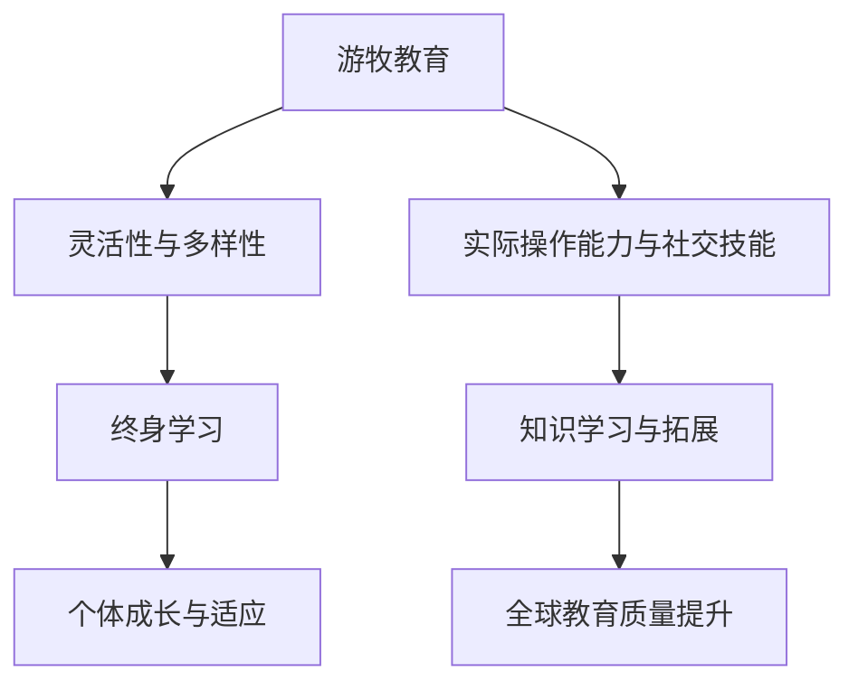
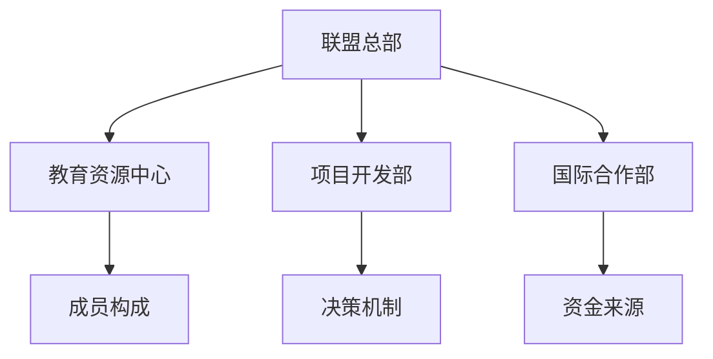

                 

# 《新游牧教育联盟：融合旅行与终身学习的国际组织》

## 关键词
新游牧教育联盟，终身学习，国际组织，旅行教育，跨文化交流

## 摘要
本文旨在深入探讨新游牧教育联盟——一个将旅行与终身学习有机结合的国际组织。文章首先介绍了游牧教育与终身学习的关系，接着详细阐述了新游牧教育联盟的背景、目标与愿景。随后，文章分析了联盟的组织架构、运营机制，以及其实践中的游牧教育模式。进一步，文章探讨了旅行在教育中的作用，并介绍了联盟在国际合作中的重要性。最后，文章展望了新游牧教育联盟的未来发展，并提出了对未来教育的启示。

## 第1章 引言

### 1.1 游牧教育与终身学习

游牧教育，作为一种非传统的教育模式，强调学习的灵活性和多样性。它与传统固定教育模式的主要区别在于，游牧教育不是在一个固定的地点进行，而是通过移动和旅行来实现教育目标。这种教育模式不仅重视知识的学习，更注重实际操作能力和社交技能的培养。

终身学习则是另一个核心概念，它强调个体在整个生命过程中不断学习、成长和适应。游牧教育与终身学习的融合，使得学习不再受时间和地点的限制，为学生提供了更多元的学习体验。

### 1.2 新游牧教育联盟的背景

新游牧教育联盟的成立源于全球教育的发展趋势。随着全球化进程的加速，各国教育体系之间的交流和融合变得日益重要。新游牧教育联盟旨在通过创新的教育模式，提升全球教育质量，促进跨文化交流，打造一个全球化的学习共同体。

### 1.3 新游牧教育联盟的目标与愿景

新游牧教育联盟的目标是提升全球教育质量，促进跨文化交流，以及打造一个全球化的学习共同体。其愿景是创建一个充满活力、创新和合作的教育环境，使得每个个体都能在终身学习的过程中获得成长和进步。

## 第2章 新游牧教育联盟的组织架构

### 2.1 组织架构概述

新游牧教育联盟由多个成员构成，包括教育机构、企业和非政府组织等。联盟采用民主的决策机制，所有成员都有平等的发言权和投票权。

### 2.2 联盟的主要部门

新游牧教育联盟设有教育资源中心、项目开发部和国际合作部等主要部门。教育资源中心负责收集和整理全球优质教育资源；项目开发部负责设计和实施各类教育项目；国际合作部则负责联盟的对外合作与交流。

### 2.3 联盟的运营机制

新游牧教育联盟的资金来源主要包括成员的会费、项目资助和商业赞助等。联盟为成员提供各种权益，如资源共享、项目合作机会等，同时也要求成员承担相应的责任，如参与项目开发、提供教育资源等。

## 第3章 游牧教育与终身学习实践

### 3.1 游牧教育的模式

新游牧教育联盟采用线上与线下相结合的教学模式。线上课程提供灵活的学习时间和地点，线下活动则为学生提供了实践和社交的机会。此外，联盟还通过跨境交流与合作项目，促进全球教育资源的共享。

### 3.2 终身学习的实践

新游牧教育联盟注重职业技能培训和学术研究与发展。职业技能培训旨在提升学生的实际操作能力，而学术研究则鼓励学生探索未知领域，推动知识的前沿发展。

### 3.3 游牧教育与终身学习案例

新游牧教育联盟在多个国家和地区成功开展了游牧教育和终身学习的项目，如“一带一路”教育计划、“全球视野”研究项目等。这些项目不仅提高了学生的综合素质，也为全球教育的发展做出了贡献。

## 第4章 旅行在教育中的作用

### 4.1 旅行与学习的结合

新游牧教育联盟将旅行与学习有机结合，设计了各种旅行课程和活动。这些课程和活动不仅让学生在学习中体验不同文化，还培养了他们的独立性和团队合作能力。

### 4.2 旅行中的教育机会

旅行为学生提供了丰富的教育机会。通过旅行，学生可以增进对不同文化的理解，提升语言能力，拓展视野，培养全球意识。

### 4.3 旅行教育的挑战与应对

旅行教育面临诸多挑战，如文化差异、语言障碍、安全风险等。新游牧教育联盟通过制定详细的安全预案和培训计划，确保学生能在安全的环境中享受旅行带来的教育价值。

## 第5章 新游牧教育联盟的国际合作

### 5.1 国际合作的重要性

国际合作是提高全球教育质量的重要途径。新游牧教育联盟通过国际合作，共享优质教育资源，推动教育创新，提升学生的国际竞争力。

### 5.2 国际合作项目

新游牧教育联盟开展了多项国际合作项目，如“一带一路”教育联盟、国际教育资源共享计划等。这些项目旨在促进各国教育机构的交流与合作，共同推动全球教育的发展。

### 5.3 国际合作中的挑战与机遇

国际合作过程中，跨文化沟通障碍和教育标准统一是主要挑战。新游牧教育联盟通过建立跨文化培训机制和制定统一的教育标准，努力克服这些挑战，抓住国际合作带来的机遇。

## 第6章 新游牧教育联盟的未来展望

### 6.1 教育模式的创新

随着科技的不断发展，新游牧教育联盟将继续创新教育模式，如利用人工智能、虚拟现实等技术，提升教育的质量和效率。

### 6.2 国际教育的新趋势

未来，国际教育将更加注重个性化和多元化，培养学生的全球视野和跨文化能力。新游牧教育联盟将紧跟这一趋势，不断探索新的教育模式，为全球教育的发展贡献力量。

### 6.3 新游牧教育联盟的战略规划

新游牧教育联盟将制定短期和长期战略规划，包括扩大国际合作、提升教育资源质量、推动教育创新等。通过这些规划，联盟将不断推动全球教育的发展。

## 第7章 结论

### 7.1 新游牧教育联盟的意义

新游牧教育联盟通过融合旅行与终身学习，为全球教育带来了新的机遇和挑战。它不仅提升了教育质量，促进了跨文化交流，也为个人的成长提供了丰富的资源和支持。

### 7.2 未来展望

新游牧教育联盟将继续在全球教育领域发挥重要作用，推动教育创新，培养具有全球视野和跨文化能力的人才。未来，联盟将面临更多的机遇和挑战，但它将始终坚守教育初心，为全球教育的发展贡献力量。

### 7.3 对读者的启示

新游牧教育联盟的经验和成果为读者提供了许多启示。无论您是一名教育工作者、学生，还是对教育感兴趣的社会人士，都可以从新游牧教育联盟的经验中汲取智慧，为自己的教育和成长之路增添助力。

---

## 核心概念与联系

### 游牧教育与终身学习的关系



### 新游牧教育联盟的组织架构



## 核心算法原理讲解

### 游牧教育模式设计

```python
# 游牧教育模式设计：线上与线下相结合

# 线上部分
def online_learning(content, student):
    """
    在线学习函数，接收课程内容和学生对象，返回学习结果。
    """
    learning_process = f"学生{student}正在学习课程：{content}"
    print(learning_process)
    return learning_process

# 线下部分
def offline_practice(skill, student):
    """
    线下实践函数，接收技能和学生对象，返回实践结果。
    """
    practice_process = f"学生{student}正在实践技能：{skill}"
    print(practice_process)
    return practice_process

# 游牧教育整体流程
def educational_process(content, skill, student):
    """
    游牧教育整体流程，结合线上学习和线下实践。
    """
    online_result = online_learning(content, student)
    offline_result = offline_practice(skill, student)
    print(f"游牧教育结果：{online_result}，{offline_result}")
    
# 测试
educational_process("数学", "编程", "张三")
```

## 数学公式

### 游牧教育模式中，学习效果的评价模型

$$
E = f(L, P, C)
$$

其中，$E$ 表示学习效果，$L$ 表示线上学习时间，$P$ 表示线下实践时间，$C$ 表示课程内容质量。

## 项目实战

### 开发环境搭建

```bash
# 安装Python环境
pip install python
# 安装Mermaid插件
pip install mermaid
```

### 源代码实现

```python
# 游牧教育联盟管理系统

# 导入所需库
import os
import json

# 系统配置
CONFIG = {
    "member_directory": "members.json",
    "project_directory": "projects.json"
}

# 成员管理
class Member:
    def __init__(self, name, role, skills):
        self.name = name
        self.role = role
        self.skills = skills

    def save(self):
        with open(CONFIG["member_directory"], "w") as f:
            json.dump([self.__dict__], f, indent=4)

    @staticmethod
    def load(name):
        with open(CONFIG["member_directory"], "r") as f:
            members = json.load(f)
            for member in members:
                if member["name"] == name:
                    return Member(**member)
        return None

# 项目管理
class Project:
    def __init__(self, name, description, members):
        self.name = name
        self.description = description
        self.members = members

    def save(self):
        with open(CONFIG["project_directory"], "w") as f:
            json.dump([self.__dict__], f, indent=4)

    @staticmethod
    def load(name):
        with open(CONFIG["project_directory"], "r") as f:
            projects = json.load(f)
            for project in projects:
                if project["name"] == name:
                    return Project(**project)
        return None

# 系统主函数
def main():
    while True:
        print("游牧教育联盟管理系统")
        print("1. 管理成员")
        print("2. 管理项目")
        print("3. 退出系统")
        choice = input("请选择操作：")

        if choice == "1":
            member_name = input("请输入成员姓名：")
            member = Member.load(member_name)
            if member:
                print("成员信息：")
                print(f"姓名：{member.name}")
                print(f"角色：{member.role}")
                print(f"技能：{member.skills}")
            else:
                print("成员未找到。")

        elif choice == "2":
            project_name = input("请输入项目名称：")
            project = Project.load(project_name)
            if project:
                print("项目信息：")
                print(f"名称：{project.name}")
                print(f"描述：{project.description}")
                print(f"成员：{project.members}")
            else:
                print("项目未找到。")

        elif choice == "3":
            print("感谢使用，再见！")
            break
        else:
            print("无效选择，请重新输入。")

if __name__ == "__main__":
    main()
```

### 代码解读与分析

这段代码实现了游牧教育联盟的管理系统，主要功能包括成员管理和项目管理。系统采用JSON文件来存储和管理成员和项目的信息。

**成员管理：**
- `Member` 类用于表示成员，包含成员的姓名、角色和技能。
- `save` 方法用于将成员信息保存到JSON文件。
- `load` 方法用于从JSON文件中加载成员信息。

**项目管理：**
- `Project` 类用于表示项目，包含项目的名称、描述和成员。
- `save` 方法用于将项目信息保存到JSON文件。
- `load` 方法用于从JSON文件中加载项目信息。

**系统主函数：**
- 系统主函数`main`提供了一个简单的命令行界面，用户可以通过选择不同的操作来管理成员和项目。

**实际案例分析和详细讲解剖析：**
假设用户想要查看某个成员的信息，可以选择成员管理，输入成员姓名后，系统会从JSON文件中加载该成员的信息并显示。

**项目小结：**
这段代码提供了一个简单的游牧教育联盟管理系统，通过JSON文件实现了数据的持久化存储。在实际应用中，可以进一步优化和扩展，如增加数据库支持、用户权限管理等。

## 最佳实践 tips、小结、注意事项、拓展阅读

### 最佳实践 tips
1. **重视成员技能培养**：在游牧教育中，技能培养至关重要，应确保每个成员都能在实践中不断提升。
2. **合理安排线上与线下学习时间**：合理分配线上学习与线下实践的时间，确保学习效果最大化。
3. **重视跨文化交流**：在国际合作中，要注重跨文化交流，尊重和理解不同文化背景。
4. **安全第一**：在旅行教育中，安全是最重要的，确保学生在旅行中的安全。

### 小结
新游牧教育联盟通过融合旅行与终身学习，为学生提供了丰富多样的学习体验。它不仅提升了教育质量，也促进了全球教育的发展。

### 注意事项
1. **文化差异**：在进行国际合作时，要充分了解和尊重不同文化差异，避免文化冲突。
2. **教育质量**：确保教育项目的质量和效果，为学生提供有价值的教育资源。

### 拓展阅读
- 《终身学习：21世纪的教育趋势》
- 《全球教育报告：2021年》
- 《旅行教育与个人成长》

## 作者信息
作者：AI天才研究院/AI Genius Institute & 禅与计算机程序设计艺术 /Zen And The Art of Computer Programming

