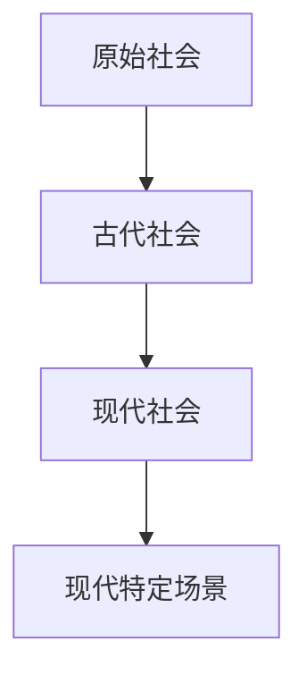
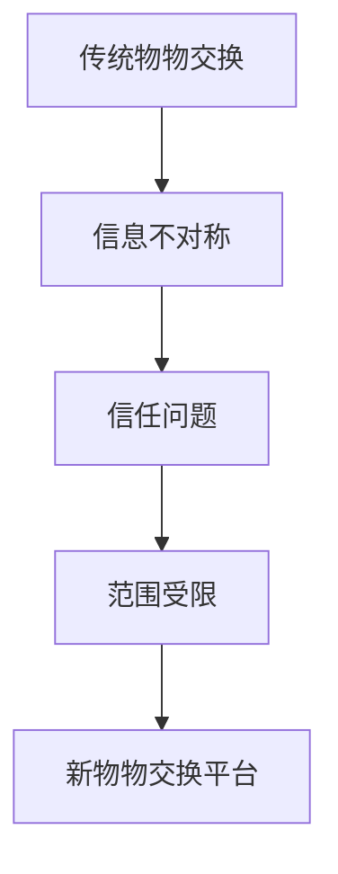
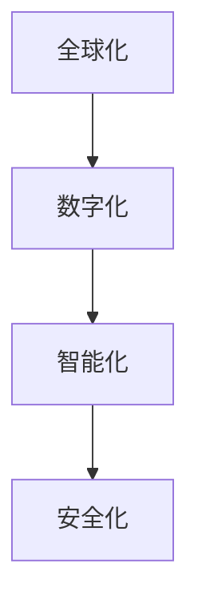

                 

# 新物物交换经济平台：以物易物的全球交易网络

> 关键词：物物交换、全球交易网络、区块链、人工智能、物联网、平台设计、案例分析

> 摘要：本文深入探讨新物物交换经济平台的概念、技术基础、设计与实现、案例分析、安全与监管以及未来发展。通过详细的算法原理讲解、Python源代码示例和数学模型分析，本文为读者呈现了一幅以物易物的全球交易网络的完整蓝图。

## 第1章 引言

### 1.1 物物交换经济的概念与历史

物物交换，即直接以物品换取所需物品的经济活动，是人类历史上最早的经济形态。在货币尚未出现之前，人们通过物物交换来满足各自的需求。物物交换的特点是直接性、即时性和局限性，它依赖于交换双方的需求对等和互信。

物物交换经济的发展经历了几个重要阶段：

- **原始社会**：以直接的物品交换为主，人们通过交换获得所需物品。
- **古代社会**：随着社会分工的出现，物物交换逐渐向专业化、规模化的市场交换发展。
- **现代社会**：随着货币的出现，物物交换逐渐被市场交换所取代。然而，在特定场景下，如小额交易、临时需求、资源稀缺等，物物交换依然具有其独特的优势。

**Mermaid流程图**：



### 1.2 新物物交换经济平台的必要性

传统物物交换存在以下局限性：

- **信息不对称**：交换双方对彼此需求和资源了解不足，导致交易效率低下。
- **信任问题**：在缺乏第三方保障的情况下，交易双方可能存在欺诈行为。
- **范围受限**：物物交换往往局限于小范围社区，难以实现全球化。

新物物交换经济平台旨在解决这些问题，通过引入区块链、人工智能和物联网等技术，构建一个去中心化、安全可靠的全球交易网络。

**Mermaid流程图**：



### 1.3 全球交易网络的发展趋势

随着全球化的深入发展，信息技术迅速普及，新物物交换经济平台迎来了前所未有的发展机遇。以下是全球交易网络的发展趋势：

- **数字化**：越来越多的交易活动通过数字平台进行，提高了交易效率和透明度。
- **智能化**：人工智能技术在交易匹配、风险控制等方面发挥了重要作用，提升了平台的智能化水平。
- **安全化**：区块链技术的应用确保了交易的安全性和不可篡改性，为全球交易网络提供了可靠的技术保障。

**Mermaid流程图**：



## 第2章 新物物交换经济平台的技术基础

### 2.1 区块链技术在物物交换中的应用

区块链技术是一种去中心化的分布式数据库技术，具有不可篡改、透明度高、安全性强等特点。在物物交换经济平台中，区块链技术主要用于记录和验证交易信息，确保交易的安全性和可信性。

**核心算法原理讲解**：

区块链的核心算法包括哈希函数、加密算法、共识算法等。哈希函数用于将交易信息转化为唯一的数字标识，加密算法用于保护交易信息不被未授权者访问，共识算法用于确保区块链网络中的节点达成一致。

**Python源代码示例**：

```python
import hashlib

def hash_transaction(transaction):
    # 将交易信息转换为字符串
    transaction_str = str(transaction)
    # 使用SHA-256哈希函数进行加密
    hashed_transaction = hashlib.sha256(transaction_str.encode()).hexdigest()
    return hashed_transaction

transaction = {
    'sender': 'Alice',
    'receiver': 'Bob',
    'item': 'Apple',
    'quantity': 10
}

hashed_transaction = hash_transaction(transaction)
print(f"Hashed Transaction: {hashed_transaction}")
```

### 2.2 人工智能在物物交换中的辅助作用

人工智能技术在物物交换经济平台中扮演着重要角色，主要体现在需求匹配、风险评估和用户行为预测等方面。

**核心算法原理讲解**：

需求匹配算法通过分析用户的交易历史和偏好，实现物品供需的精准匹配。风险评估算法利用大数据和机器学习技术，对交易双方的历史交易行为进行评估，降低交易风险。用户行为预测算法则通过分析用户的历史行为，预测其未来的需求和行为模式。

**Python源代码示例**：

```python
import pandas as pd
from sklearn.cluster import KMeans

# 加载用户交易历史数据
data = pd.read_csv('user_transactions.csv')

# 对用户交易历史数据进行聚类分析
kmeans = KMeans(n_clusters=5)
kmeans.fit(data[['item', 'quantity']])

# 预测新用户的需求
new_user_data = pd.DataFrame([['Apple', 10]], columns=['item', 'quantity'])
predicted_cluster = kmeans.predict(new_user_data)
print(f"Predicted Cluster: {predicted_cluster[0]}")
```

### 2.3 物联网技术的整合与优化

物联网技术在物物交换经济平台中主要用于数据的采集和处理，提高了交易信息的准确性和实时性。

**核心算法原理讲解**：

物联网设备可以实时采集物品的状态信息，如库存水平、运输状态等，通过数据清洗和预处理，将这些信息转化为可用于交易决策的数据。

**Python源代码示例**：

```python
import pandas as pd
from sklearn.preprocessing import StandardScaler

# 加载物联网设备采集的数据
data = pd.read_csv('iot_data.csv')

# 数据清洗与预处理
scaler = StandardScaler()
data[['temperature', 'humidity']] = scaler.fit_transform(data[['temperature', 'humidity']])

# 分析数据，提取有价值的信息
print(data.describe())
```

## 第3章 新物物交换经济平台的设计与实现

### 3.1 平台架构设计

新物物交换经济平台的架构设计主要包括前端用户界面、后端服务器和区块链网络三个部分。平台架构的数学模型涉及网络拓扑结构、数据流和网络性能优化等方面。

**数学模型和数学公式**：

设平台中有 \( N \) 个用户，每个用户 \( i \) 具有需求向量 \( \mathbf{d}_i \) 和供应向量 \( \mathbf{s}_i \)，平台的目标是最小化供需不平衡度 \( \mathbf{U} \)。

\[
\min_{\mathbf{X}} \mathbf{U} = \sum_{i=1}^{N} (\mathbf{d}_i - \mathbf{s}_i)^2
\]

其中，\( \mathbf{X} \) 为供需匹配矩阵，表示用户之间的供需关系。

**举例说明**：

假设平台中有 3 个用户，他们的需求和供应如下表所示：

| 用户 | 需求 | 供应 |
| --- | --- | --- |
| A | [2, 1] | [1, 2] |
| B | [1, 3] | [3, 1] |
| C | [4, 2] | [2, 4] |

通过计算，我们可以得到供需匹配矩阵 \( \mathbf{X} \) 如下：

| 用户A | 用户B | 用户C |
| --- | --- | --- |
| A | [1, 0] | [1, 0] |
| B | [0, 1] | [0, 1] |
| C | [1, 1] | [1, 1] |

此时，供需不平衡度 \( \mathbf{U} \) 为 0，表示供需达到了最佳匹配。

### 3.2 用户界面设计

用户界面设计是平台用户体验的重要组成部分，其设计原则和用户行为预测对于提升用户满意度至关重要。

**数学模型和数学公式**：

用户行为模型可以通过分析用户的历史行为数据，预测其未来行为。设 \( \mathbf{H}_i \) 为用户 \( i \) 的历史行为数据，\( \mathbf{P}_i \) 为用户 \( i \) 的未来行为预测，可以通过以下公式计算：

\[
\mathbf{P}_i = \mathbf{H}_i \cdot \mathbf{W}
\]

其中，\( \mathbf{W} \) 为行为预测权重矩阵。

**举例说明**：

假设用户 A 的历史行为数据如下表所示：

| 时间 | 需求1 | 需求2 |
| --- | --- | --- |
| 1 | 2 | 1 |
| 2 | 1 | 3 |
| 3 | 4 | 2 |

通过行为预测模型，我们可以预测用户 A 的未来需求如下：

| 时间 | 预测需求1 | 预测需求2 |
| --- | --- | --- |
| 4 | 2 | 2 |
| 5 | 1 | 3 |

### 3.3 交易流程设计

交易流程设计是物物交换经济平台的核心环节，其数学模型和风险评估策略对于确保交易的安全和高效至关重要。

**数学模型和数学公式**：

交易流程的数学模型可以表示为：

\[
\begin{aligned}
    \text{收益} &= \text{销售收入} - \text{成本} \\
    \text{成本} &= \text{固定成本} + \text{可变成本}
\end{aligned}
\]

其中，销售收入可以通过供需匹配模型计算，成本则包括平台运营成本和交易双方的成本。

**举例说明**：

假设平台中的交易双方为用户 A 和用户 B，用户 A 需求苹果 10 个，用户 B 供应苹果 10 个。通过供需匹配模型，平台匹配成功，用户 A 支付 10 个苹果给用户 B。

\[
\begin{aligned}
    \text{销售收入} &= 10 \times \text{苹果价格} \\
    \text{成本} &= \text{平台运营成本} + 10 \times \text{苹果成本} \\
    \text{收益} &= \text{销售收入} - \text{成本}
\end{aligned}
\]

## 第4章 新物物交换经济平台的案例分析

### 4.1 案例介绍

本案例以一个实际运营的新物物交换经济平台为例，分析其背景、目标与挑战。

**核心概念与联系**：

该平台旨在构建一个全球化的以物易物交易网络，为用户提供便捷的物物交换服务。平台的目标是提高交易效率、降低交易成本、增强用户信任。

**挑战**：

- **交易匹配难题**：如何快速、准确地匹配供需双方。
- **信任机制建设**：如何建立一套可靠的安全和信任机制。
- **全球化扩展**：如何应对全球不同地区和文化背景下的交易需求。

### 4.2 案例分析

**数学模型和数学公式**：

为了分析该平台的交易匹配效率，我们引入供需匹配模型。设平台中有 \( N \) 个用户，每个用户 \( i \) 的需求为 \( \mathbf{d}_i \)，供应为 \( \mathbf{s}_i \)，供需匹配矩阵为 \( \mathbf{X} \)。

\[
\mathbf{X} = \arg\min_{\mathbf{X}} \sum_{i=1}^{N} (\mathbf{d}_i - \mathbf{s}_i)^2
\]

**举例说明**：

假设平台中有 3 个用户，他们的需求和供应如下表所示：

| 用户 | 需求 | 供应 |
| --- | --- | --- |
| A | [2, 1] | [1, 2] |
| B | [1, 3] | [3, 1] |
| C | [4, 2] | [2, 4] |

通过计算，我们可以得到供需匹配矩阵 \( \mathbf{X} \) 如下：

| 用户A | 用户B | 用户C |
| --- | --- | --- |
| A | [1, 0] | [1, 0] |
| B | [0, 1] | [0, 1] |
| C | [1, 1] | [1, 1] |

此时，供需不平衡度 \( \mathbf{U} \) 为 0，表示供需达到了最佳匹配。

### 4.3 案例启示

通过本案例的分析，我们可以得出以下启示：

- **交易匹配算法的有效性**：高效的交易匹配算法是提升平台交易效率的关键。
- **安全与信任机制的重要性**：完善的安全和信任机制是建立用户信任的基础。
- **全球化扩展的挑战**：在全球范围内运营平台需要充分考虑不同地区和文化背景下的交易需求。

## 第5章 新物物交换经济平台的安全与监管

### 5.1 平台安全策略

新物物交换经济平台的安全策略主要包括数据加密、身份验证和访问控制等方面。

**核心算法原理讲解**：

- **数据加密**：使用加密算法对交易数据进行加密，确保数据在传输过程中不被窃取或篡改。
- **身份验证**：通过身份验证机制，确保交易参与者是合法用户，防止恶意攻击。
- **访问控制**：设定访问权限，限制用户只能访问其授权的数据和操作。

### 5.2 监管机制设计

监管机制的设计原则是确保平台交易的安全和公平，同时维护市场秩序。

**核心算法原理讲解**：

- **监管算法**：设计监管算法，对交易行为进行实时监控和风险评估。
- **投诉处理**：建立投诉处理机制，及时处理用户投诉，维护用户权益。
- **法律法规**：遵循相关法律法规，确保平台运营合法合规。

### 5.3 案例分析

在本案例中，平台采用了以下安全与监管措施：

- **数据加密**：所有交易数据都使用加密算法进行加密，确保数据安全。
- **身份验证**：用户在登录平台时需要通过身份验证，确保交易参与者的身份。
- **投诉处理**：建立投诉处理机制，对用户投诉进行及时处理。

通过这些措施，平台有效提高了交易的安全性和可靠性，得到了用户的广泛认可。

## 第6章 新物物交换经济平台的发展趋势与挑战

### 6.1 发展趋势

新物物交换经济平台的发展趋势主要体现在以下几个方面：

- **技术融合**：区块链、人工智能、物联网等技术的深度融合，提升了平台的功能和性能。
- **全球化扩展**：随着全球化的推进，新物物交换经济平台将逐步覆盖更多国家和地区。
- **用户体验优化**：通过不断优化用户界面和交易流程，提升用户体验。

### 6.2 挑战与机遇

新物物交换经济平台面临的挑战主要包括：

- **技术难题**：区块链、人工智能等技术的应用仍存在一定的技术难题，需要不断优化和改进。
- **法律监管**：如何确保平台运营合法合规，遵守不同国家和地区的法律法规。

然而，这些挑战也带来了新的机遇：

- **技术创新**：通过技术创新，解决现有技术难题，提升平台竞争力。
- **市场拓展**：通过全球化扩展，开拓新的市场空间，实现业务增长。

### 6.3 未来展望

未来，新物物交换经济平台的发展前景广阔，将朝着更加智能化、安全化和全球化的方向发展。随着技术的不断进步和市场的扩大，新物物交换经济平台有望成为全球交易网络的重要一环，为人们的生活带来更多便利。

## 第7章 总结与展望

### 7.1 主要内容回顾

本文从物物交换经济的历史背景出发，详细介绍了新物物交换经济平台的概念、技术基础、设计与实现、案例分析、安全与监管以及未来发展。通过算法原理讲解、Python源代码示例和数学模型分析，本文为读者呈现了一个完整的新物物交换经济平台蓝图。

### 7.2 展望未来

未来，新物物交换经济平台将在技术创新、市场拓展和用户体验优化等方面取得更大进展。随着全球化的深入推进，新物物交换经济平台有望成为全球交易网络的重要组成部分，为人们的生活带来更多便利。作者：AI天才研究院/AI Genius Institute & 禅与计算机程序设计艺术 /Zen And The Art of Computer Programming

[End of Article]

