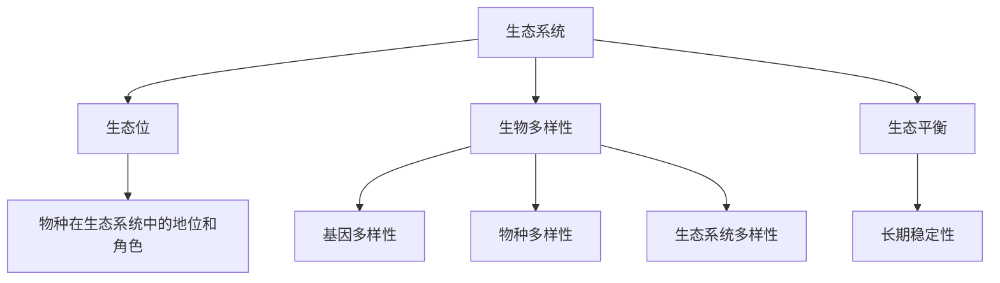

                 

# 新生态主义宣言：重塑人与自然的和谐关系

> 关键词：新生态主义、人与自然和谐、可持续发展、生态哲学、生态教育

> 摘要：
本篇博客将探讨新生态主义的概念、起源、核心原则及其在现代社会中的重要性。通过分析人类活动对自然环境的影响，阐述新生态主义的目标和价值观。文章还将探讨生态哲学的基础，以及新生态主义在教育、政策法规和实践路径等方面的具体应用。最后，文章将展望新生态主义的未来发展趋势及其对全球社会的影响。

# 第1章 引言

## 1.1 新生态主义的起源与基本理念

### 1.1.1 新生态主义的起源

#### 1.1.1.1 历史背景

在人类社会发展的历史长河中，人类与自然的关系经历了从依赖到征服，再到反思和寻求和谐共生的过程。在早期的农业社会，人类依赖自然资源生存，对自然环境有着深厚的敬畏和尊重。然而，随着工业革命的到来，人类开始大规模地改造自然，追求经济效益。这一时期，人类对自然资源的过度开采和污染导致了严重的生态危机，引发了全球范围内的关注和反思。

#### 1.1.1.2 生态危机的觉醒

20世纪中叶，随着环境问题的日益严重，人们开始意识到传统的发展模式已经不再适应现代社会的发展需求。1972年的《人类环境宣言》标志着全球范围内的生态危机觉醒。此后，各国政府和国际组织纷纷采取行动，推动环境保护和可持续发展。新生态主义正是在这一背景下产生和发展的。

### 1.1.2 新生态主义的基本理念

#### 1.1.2.1 生态整体的观念

新生态主义强调生态整体观念，认为生态系统是一个相互关联、相互作用的整体。任何一个生态系统的破坏都会对整个生态系统的平衡和稳定产生严重影响。因此，新生态主义主张人类应该尊重自然、保护生态系统，实现人与自然的和谐共生。

##### 1.1.2.1.1 生态系统与生态位

生态系统是指在一定地域内，生物与环境通过物质循环和能量流动相互作用而形成的统一整体。生态位则是指生物在生态系统中的地位和角色，包括物种在生态系统中的分布、生态角色和生态功能。新生态主义强调保护生态位多样性，以维持生态系统的稳定和功能。

##### 1.1.2.1.2 生物多样性与生态平衡

生物多样性是生态系统稳定性的基础，它包括基因多样性、物种多样性和生态系统多样性。新生态主义主张通过保护生物多样性，实现生态平衡和生态系统的可持续发展。

#### 1.1.2.2 人与自然和谐共生

新生态主义倡导人与自然和谐共生，认为人类是生态系统的一部分，应该与自然和谐共处，共同维护生态系统的平衡和稳定。这种理念强调人类应该摆脱中心主义观念，尊重自然、爱护环境，以实现人类与自然的和谐共生。

##### 1.1.2.2.1 人类中心论与生态中心论的平衡

人类中心论和生态中心论是两种极端的观点。人类中心论认为人类是宇宙的中心，其他生物和环境的存在都是为了服务于人类。生态中心论则认为所有生物和环境都有其自身的价值和意义，不应该将人类置于中心地位。新生态主义主张在人类中心论和生态中心论之间寻找平衡，实现人类与自然的和谐共生。

##### 1.1.2.2.2 人与自然的相互依存

新生态主义强调人类与自然的相互依存关系，认为人类的生存和发展离不开自然的支持和保护。因此，人类应该承担起保护自然、维护生态平衡的责任，以确保自身和自然界的可持续发展。

## 1.2 新生态主义的目标与价值

### 1.2.1 新生态主义的目标

#### 1.2.1.1 恢复生态平衡

新生态主义的首要目标是恢复生态平衡。通过保护生态环境、修复受损生态系统，实现生态系统的自我调节和自我修复能力，从而维持生态系统的稳定和功能。

##### 1.2.1.1.1 自然环境的修复与保护

自然环境是人类生存和发展的基础，新生态主义强调保护自然环境，防止进一步破坏。例如，通过植树造林、湿地恢复、荒漠化治理等手段，修复受损的自然环境。

##### 1.2.1.1.2 生态系统功能的恢复

生态系统功能是生态系统的重要组成部分，新生态主义致力于恢复和增强生态系统的功能，如水源涵养、土壤保持、碳循环等，以实现生态系统的可持续发展。

#### 1.2.1.2 促进社会可持续发展

新生态主义不仅关注生态平衡的恢复，还关注社会的可持续发展。通过推动绿色经济、节能减排、循环经济等举措，实现经济发展与环境保护的协调。

##### 1.2.1.2.1 经济发展的绿色转型

新生态主义主张推动经济发展的绿色转型，鼓励发展清洁能源、绿色科技等绿色产业，减少对环境的负面影响。

##### 1.2.1.2.2 社会公平与生态正义

新生态主义强调社会公平与生态正义，主张消除贫困、减少不平等，确保所有人都能享受到生态保护和可持续发展的成果。

### 1.2.2 新生态主义的价值观

#### 1.2.2.1 生态优先

新生态主义倡导生态优先，即在任何决策过程中，都将生态保护和可持续发展置于首位。这种价值观强调生态成本内部化，即经济发展不应以牺牲生态环境为代价。

##### 1.2.2.1.1 生态保护与发展的关系

生态保护与经济发展并非矛盾对立的关系，而是相辅相成的。新生态主义主张通过绿色发展，实现生态保护与经济发展的双赢。

##### 1.2.2.1.2 生态成本的内部化

生态成本是指因生态破坏和环境污染而产生的成本，包括环境修复、健康损失等。新生态主义主张将生态成本内部化，使其在价格中反映出来，从而引导经济行为更环保。

#### 1.2.2.2 综合治理与协同发展

新生态主义强调综合治理与协同发展，主张政府、企业、社会等多方协同，共同推动生态保护和可持续发展。

##### 1.2.2.2.1 政府与市场的协同作用

政府应发挥引导和监管作用，制定生态政策和法规，引导市场行为更环保。市场则应通过价格信号，反映生态成本，促进环保。

##### 1.2.2.2.2 社会各界的共同参与

新生态主义强调社会各界的共同参与，鼓励公众参与生态保护和可持续发展，形成全社会共同推进的良好氛围。

## 1.3 新生态主义的重要性

### 1.3.1 对人类社会的意义

#### 1.3.1.1 保障人类的生存与发展

新生态主义关注生态保护和可持续发展，为人类的生存与发展提供坚实的基础。保护生态环境，确保资源的可持续利用，有助于保障人类的长期生存和发展。

##### 1.3.1.1.1 资源利用的可持续性

新生态主义提倡合理利用资源，推动资源的可持续利用，确保资源的长期供应，满足人类的需求。

##### 1.3.1.1.2 生态安全与人类健康

生态环境的破坏会导致生态灾害，威胁人类的生命安全。新生态主义强调生态安全，防止生态灾害的发生，保障人类的健康。

#### 1.3.1.2 推动社会文明的进步

新生态主义倡导人与自然和谐共生，推动社会文明的进步。通过生态教育和生态文化建设，提高公众的生态意识，促进社会文明的发展。

##### 1.3.1.2.1 科技创新的驱动

新生态主义鼓励科技创新，推动绿色科技的发展，为生态保护和可持续发展提供技术支持。

##### 1.3.1.2.2 文明观念的更新

新生态主义促使人们重新审视人类与自然的关系，更新文明观念，树立生态优先的价值观。

### 1.3.2 对自然环境的保护

#### 1.3.2.1 恢复生态系统的功能

新生态主义强调生态系统的恢复和保护，通过生态修复和生态重建，恢复生态系统的功能，提高生态系统的稳定性和可持续性。

##### 1.3.2.1.1 森林、湿地等生态系统的恢复

森林、湿地等生态系统具有重要的生态功能，新生态主义致力于恢复和保护这些生态系统，提高生态系统的稳定性和可持续性。

##### 1.3.2.1.2 生物多样性的保护

生物多样性是生态系统的重要组成部分，新生态主义强调保护生物多样性，防止物种灭绝，维护生态系统的平衡和稳定。

#### 1.3.2.2 防止环境恶化

新生态主义主张采取积极的措施，防止环境恶化。通过环境保护法规的制定和执行，严厉打击环境污染行为，保护生态环境。

##### 1.3.2.2.1 气候变化的应对

气候变化是当前全球面临的重大挑战，新生态主义强调采取有效的措施，应对气候变化，减少温室气体排放，保护地球气候系统。

##### 1.3.2.2.2 水资源的管理与保护

水资源是生命之源，新生态主义强调水资源的管理与保护，通过节水、水资源调配和水资源污染治理，确保水资源的可持续利用。

# 第2章 生态哲学基础

## 2.1 生态哲学的基本概念

### 2.1.1 生态哲学的定义

生态哲学是一门研究人与自然关系的哲学学科，它关注生态系统的本质、生态系统的平衡与稳定、生态系统的演变与发展等问题。生态哲学试图回答这样一个问题：如何使人类与自然环境和谐共生？

#### 2.1.1.1 生态哲学的起源

生态哲学的起源可以追溯到古代哲学家对自然和宇宙的思考。然而，作为一种独立的哲学学科，生态哲学的诞生主要与20世纪的环境危机和生态运动的兴起有关。1972年，雷蒙德·卡斯特尔（Raymond D. Heilmayr）发表了《生态哲学》（"The Philosophy of Ecology"），标志着生态哲学作为一个独立学科的诞生。

#### 2.1.1.2 生态哲学的核心内容

生态哲学的核心内容主要包括生态整体观念、生态平衡、生物多样性、生态系统功能等。

1. **生态整体观念**：生态哲学认为，生态系统是一个相互关联、相互作用的整体。任何一个部分的改变都会对整个系统产生深远的影响。

2. **生态平衡**：生态平衡是生态系统稳定性的基础，它是指生态系统中的生物、非生物因素在长时间内保持相对稳定的状态。

3. **生物多样性**：生物多样性是生态系统的核心特征，它包括基因多样性、物种多样性和生态系统多样性。生物多样性对于生态系统的稳定性和功能至关重要。

4. **生态系统功能**：生态系统功能包括物质循环、能量流动、信息传递等。这些功能保证了生态系统的正常运行和可持续发展。

### 2.1.2 生态哲学的基本原则

生态哲学的基本原则主要包括生态优先、综合治理、协同发展、生态成本内部化等。

#### 2.1.2.1 生态优先原则

生态优先原则是指在任何决策过程中，都将生态保护和可持续发展置于首位。这一原则强调，经济发展不能以牺牲生态环境为代价。

##### 2.1.2.1.1 生态保护与发展的关系

生态保护和经济发展并非对立的关系，而是相辅相成的。只有保护好生态环境，才能实现可持续的经济发展。

##### 2.1.2.1.2 生态成本内部化

生态成本是指因生态破坏和环境污染而产生的成本，包括环境修复、健康损失等。生态成本内部化意味着这些成本应该纳入经济决策中，以便更准确地反映经济活动的真实成本。

#### 2.1.2.2 综合治理原则

综合治理原则强调，生态保护需要政府、企业、社会等多方共同参与。通过综合治理，可以实现生态保护和可持续发展的目标。

##### 2.1.2.2.1 政府与市场的协同作用

政府在生态保护中扮演着监管和引导的角色，市场则通过价格信号反映生态成本，引导经济行为更环保。

##### 2.1.2.2.2 社会各界的共同参与

社会各界的共同参与是实现生态保护和可持续发展的关键。通过公众参与、社会组织和企业的共同努力，可以形成全社会共同推进的良好氛围。

#### 2.1.2.3 协同发展原则

协同发展原则强调，经济发展、社会进步和生态保护应该相互促进，共同发展。通过协同发展，可以实现经济、社会和生态的可持续发展。

##### 2.1.2.3.1 经济发展的绿色转型

经济发展的绿色转型是协同发展的关键。通过发展绿色经济、清洁能源和绿色科技，可以实现经济发展与环境保护的协调。

##### 2.1.2.3.2 社会公平与生态正义

社会公平与生态正义是协同发展的核心。通过消除贫困、减少不平等，确保所有人都能享受到生态保护和可持续发展的成果。

## 2.2 生态哲学的发展历程

### 2.2.1 生态哲学的起源

生态哲学的起源可以追溯到古代哲学家对自然和宇宙的思考。亚里士多德、庄子等古代哲学家都对自然和宇宙有着深刻的理解。然而，作为一种独立的哲学学科，生态哲学的诞生主要与20世纪的环境危机和生态运动的兴起有关。

#### 2.2.1.1 生态哲学的先驱

威廉·亨利·哈特（William Henry Hart）被认为是生态哲学的先驱。他在19世纪末提出了“生态平衡”的概念，并认为生态系统的稳定和功能对于人类社会的生存至关重要。

#### 2.2.1.2 生态运动的兴起

20世纪中叶，随着环境问题的日益严重，生态运动在世界范围内兴起。这一时期，生态哲学家如蕾切尔·卡逊（Rachel Carson）和阿尔温·托夫勒（Alvin Toffler）等，通过他们的作品，推动了生态哲学的普及和发展。

### 2.2.2 生态哲学的主要发展阶段

#### 2.2.2.1 第一阶段：生态哲学的初步形成

20世纪中叶，生态哲学的初步形成阶段。这一时期，生态哲学家开始探讨生态系统的本质、生态平衡和生态保护等问题。

##### 2.2.2.1.1 生态系统的本质

生态哲学家如威廉·亨利·哈特等，开始深入研究生态系统的本质，提出了生态平衡的概念，并强调生态系统的稳定性对于人类社会的生存至关重要。

##### 2.2.2.1.2 生态平衡与生态保护

生态哲学家开始探讨如何维护生态平衡，以及如何通过生态保护来实现生态平衡。这一阶段的研究为生态哲学的发展奠定了基础。

#### 2.2.2.2 第二阶段：生态哲学的系统化

20世纪后半叶，生态哲学进入了系统化阶段。这一时期，生态哲学家开始对生态哲学的核心概念、原则和理论进行系统化的研究。

##### 2.2.2.2.1 生态哲学的核心概念

生态哲学家对生态哲学的核心概念进行了深入探讨，如生态整体观念、生态平衡、生物多样性、生态系统功能等。

##### 2.2.2.2.2 生态哲学的原则和理论

生态哲学家开始构建生态哲学的理论体系，探讨生态哲学的基本原则，如生态优先、综合治理、协同发展、生态成本内部化等。

#### 2.2.2.3 第三阶段：生态哲学的应用与发展

21世纪以来，生态哲学进入了一个新的发展阶段，即应用与发展阶段。这一时期，生态哲学开始应用于各个领域，如环境保护、可持续发展、生态农业等。

##### 2.2.2.3.1 生态哲学的应用

生态哲学开始应用于环境保护、可持续发展等领域，为这些领域提供了理论支持和指导。

##### 2.2.2.3.2 生态哲学的发展

生态哲学在这一阶段继续发展，不仅深入探讨生态哲学的基本概念和原则，还关注生态哲学与科学、技术、社会等领域的交叉融合。

## 2.3 生态哲学与现代科学的关系

### 2.3.1 生态哲学与现代科学的关系

生态哲学与现代科学有着密切的关系。一方面，生态哲学为现代科学提供了理论基础；另一方面，现代科学的发展也为生态哲学提供了实证支持。

#### 2.3.1.1 生态哲学对现代科学的影响

生态哲学对现代科学的影响主要体现在以下几个方面：

1. **生态系统的观念**：生态哲学的生态系统观念深刻影响了现代科学对生态系统的理解。现代科学开始将生态系统视为一个复杂的、动态的、相互关联的整体。

2. **生态平衡与生物多样性**：生态哲学对生态平衡和生物多样性的重视，促使现代科学在生态学、生物学等学科中，加强对生态平衡和生物多样性的研究。

3. **可持续发展**：生态哲学的可持续发展观念为现代科学提供了理论基础，推动了现代科学在环境保护、资源管理等方面的研究。

#### 2.3.1.2 现代科学对生态哲学的影响

现代科学对生态哲学的影响主要表现在以下几个方面：

1. **实证支持**：现代科学的发展为生态哲学提供了大量的实证支持，使生态哲学的理论更具有科学性。

2. **交叉融合**：现代科学的发展促进了生态哲学与其他学科的交叉融合，如生态哲学与经济学、社会学、政治学等领域的交叉研究。

3. **技术创新**：现代科学的发展推动了生态哲学在环境保护、资源管理等方面的技术创新，为生态哲学的应用提供了新的手段。

## 2.4 生态哲学的核心概念与联系

### 2.4.1 核心概念

生态哲学的核心概念包括生态系统、生态位、生物多样性、生态平衡等。

#### 2.4.1.1 生态系统

生态系统是指在一定地域内，生物与环境通过物质循环和能量流动相互作用而形成的统一整体。生态系统包括生物部分和非生物部分，如植物、动物、微生物以及阳光、空气、水等。

#### 2.4.1.2 生态位

生态位是指生物在生态系统中的地位和角色，包括物种在生态系统中的分布、生态角色和生态功能。生态位反映了物种在生态系统中的竞争和共生关系。

#### 2.4.1.3 生物多样性

生物多样性是指生物圈内所有的植物、动物和微生物，以及它们所拥有的全部基因和各种各样的生态系统。生物多样性包括基因多样性、物种多样性和生态系统多样性。

#### 2.4.1.4 生态平衡

生态平衡是指生态系统在长时间内保持相对稳定的状态。生态平衡依赖于生态系统中各个部分的相互作用和调节，如食物链、物质循环和能量流动。

### 2.4.2 概念实体之间的关系架构

以下是一个基于Mermaid绘制的生态哲学核心概念与实体之间的关系架构图：



## 2.5 生态哲学的核心算法原理讲解

### 2.5.1 生态位分析算法

生态位分析是生态哲学中一个重要的概念，它有助于我们理解物种在生态系统中的角色和作用。以下是一个简单的生态位分析算法，使用Python代码进行实现：

```python
import pandas as pd
import matplotlib.pyplot as plt

# 假设我们有一个包含物种和它们生态位数据的DataFrame
data = pd.DataFrame({
    '物种': ['A', 'B', 'C', 'D', 'E'],
    '生态位宽度': [0.2, 0.3, 0.4, 0.5, 0.6],
    '生态位重叠': [0.1, 0.2, 0.3, 0.4, 0.5]
})

# 计算每个物种的生态位宽度
data['生态位宽度计算'] = data['生态位宽度'] * data['生态位重叠']

# 绘制生态位宽度分布图
plt.bar(data['物种'], data['生态位宽度计算'])
plt.xlabel('物种')
plt.ylabel('生态位宽度计算')
plt.title('物种生态位宽度分析')
plt.show()
```

### 2.5.2 生物多样性指数计算

生物多样性指数是衡量生态系统多样性的重要指标。以下是一个简单的生物多样性指数计算算法，使用Python代码进行实现：

```python
import numpy as np

# 假设我们有一个包含物种丰富度和物种均匀度的数据
richness = [10, 15, 20, 25, 30]
evenness = [0.5, 0.6, 0.7, 0.8, 0.9]

# 计算Shannon多样性指数
shannon_index = -np.sum([p * np.log2(p) for p in evenness])

# 计算Pielou均匀度指数
pielou_index = evenness - 1 / np.log2(len(richness))

print("Shannon多样性指数:", shannon_index)
print("Pielou均匀度指数:", pielou_index)
```

## 2.6 数学模型与公式

### 2.6.1 生态位宽度公式

生态位宽度（Wi）是衡量物种在生态系统中的角色和作用的一个重要指标。其计算公式如下：

$$
Wi = \sum_{i=1}^{n} (pi - \frac{1}{N})
$$

其中，pi是物种i的生态位宽度，N是物种总数。

### 2.6.2 Shannon多样性指数公式

Shannon多样性指数（H）是衡量生态系统多样性的重要指标，其计算公式如下：

$$
H = -\sum_{i=1}^{n} p_i \log_2 p_i
$$

其中，pi是物种i在生态系统中的相对丰度。

### 2.6.3 Pielou均匀度指数公式

Pielou均匀度指数（E）是衡量生态系统物种分布均匀性的重要指标，其计算公式如下：

$$
E = 1 - \frac{H}{H_{\max}}
$$

其中，H是Shannon多样性指数，$H_{\max}$是最大多样性指数，当所有物种的相对丰度相等时，$H_{\max} = \log_2 N$，N是物种总数。

## 2.7 生态哲学在实际应用中的案例分析

### 2.7.1 生态农业

生态农业是一种以生态学原理为基础，通过有机肥料、生物防治、作物轮作等措施，实现农业生产与生态环境保护相结合的农业模式。以下是一个生态农业的案例分析：

**案例：中国江西省婺源县生态农业**

婺源县位于中国江西省东北部，是一个以农业为主的地区。为了保护生态环境，婺源县大力推进生态农业，采取了一系列措施：

1. **有机肥料的使用**：婺源农民大量使用有机肥料，减少化肥的使用，提高土壤肥力。

2. **生物防治**：采用生物防治方法，如引入天敌昆虫、使用生物农药等，减少化学农药的使用。

3. **作物轮作**：推广作物轮作制度，减少单一作物种植，防止土壤退化。

4. **生态补偿**：政府给予生态农业一定的补贴，鼓励农民参与生态农业。

通过这些措施，婺源县的生态农业取得了显著成效，不仅提高了农产品的质量，还保护了生态环境。

### 2.7.2 水资源管理

水资源管理是生态哲学在水资源领域的应用。以下是一个水资源管理的案例分析：

**案例：中国北京市密云水库水资源管理**

密云水库是北京市的重要水源地，为了确保水资源的可持续利用，北京市采取了一系列水资源管理措施：

1. **节水措施**：在农业生产、工业生产、居民生活等领域推广节水技术，降低水资源消耗。

2. **水资源调配**：通过水库蓄水和引水工程，合理调配水资源，确保城市供水和农业灌溉的需要。

3. **水质监测**：建立完善的水质监测系统，实时监测水库水质，确保水源地水质安全。

4. **生态补偿**：对水资源节约和保护的单位给予奖励，鼓励更多人参与水资源管理。

通过这些措施，密云水库的水资源得到了有效管理，为北京市的经济发展和居民生活提供了稳定的水源。

## 2.8 生态哲学教育

### 2.8.1 生态哲学教育的重要性

生态哲学教育是培养公众生态意识和生态素养的重要途径。以下是从教育角度探讨生态哲学教育的重要性的几个方面：

1. **培养生态意识**：生态哲学教育有助于培养公众对生态环境的认识和理解，提高公众的生态意识。

2. **促进可持续发展**：生态哲学教育可以帮助人们认识到经济发展与生态保护的关系，推动可持续发展的理念。

3. **培养创新思维**：生态哲学教育鼓励人们从生态整体观念出发，思考问题，培养创新思维。

4. **提高生态素养**：生态哲学教育有助于提高公众的生态素养，使人们更加关注生态环境问题，积极参与生态保护。

### 2.8.2 生态哲学教育的内容与方法

生态哲学教育的内容和方法可以从以下几个方面进行探讨：

1. **课程设置**：将生态哲学的相关知识纳入中小学和大学的课程体系，培养学生对生态哲学的基本了解。

2. **教材编写**：编写适合不同年龄层次的生态哲学教材，结合实际情况，生动有趣地传授生态哲学知识。

3. **教学方法**：采用案例教学、讨论教学、实践教学等多种教学方法，提高学生的学习兴趣和参与度。

4. **社会实践**：组织学生参与生态保护实践，如植树造林、环境监测等，将理论知识与实际应用相结合。

5. **国际合作**：与国际上的生态哲学教育机构进行合作，引进国际先进的生态哲学教育理念和方法。

## 2.9 生态哲学与可持续发展

### 2.9.1 可持续发展的概念与原则

可持续发展是指在满足当代人的需求的同时，不损害后代人满足其需求的能力。它包括经济效益、社会效益和生态效益三个方面。

#### 2.9.1.1 经济效益

经济效益是指通过合理利用资源和提高生产效率，实现经济的持续增长。可持续发展要求经济发展不能以牺牲生态环境为代价。

#### 2.9.1.2 社会效益

社会效益是指通过可持续发展，提高人民的生活质量，实现社会公平和公正。可持续发展要求经济发展与社会进步相互促进。

#### 2.9.1.3 生态效益

生态效益是指通过可持续发展，保护生态环境，维护生态系统的稳定和功能。可持续发展要求经济发展与生态保护相协调。

### 2.9.2 生态哲学与可持续发展的关系

生态哲学与可持续发展有着密切的关系。生态哲学为可持续发展提供了理论基础，强调了生态整体观念、生态平衡、生物多样性等核心概念。可持续发展则是生态哲学的具体实践，通过经济、社会和生态三个方面的协调发展，实现生态保护和可持续发展。

### 2.9.3 实现可持续发展的路径

实现可持续发展需要从多个方面入手，以下是一些具体的路径：

1. **绿色发展**：推动绿色发展，发展清洁能源、绿色科技等绿色产业，减少对环境的负面影响。

2. **生态农业**：发展生态农业，减少化肥和农药的使用，提高农产品的质量和安全性。

3. **循环经济**：推广循环经济，实现资源的节约和再利用，减少资源的消耗和浪费。

4. **节能减排**：通过节能减排，降低能源消耗和碳排放，减少对环境的影响。

5. **生态教育**：加强生态教育，提高公众的生态意识和素养，推动社会文明的发展。

## 2.10 结论

生态哲学作为一门研究人与自然关系的哲学学科，对于实现可持续发展具有重要意义。通过生态哲学的教育和普及，可以提高公众的生态意识，推动绿色发展和可持续发展。然而，生态哲学的应用还需要在政策、法规、实践等方面进一步加强，以实现人与自然的和谐共生。

## 参考文献

1. 卡逊，R. (1962). 《寂静的春天》. 北京：中国环境科学出版社.
2. 托夫勒，A. (1970). 《未来的冲击》. 北京：中国社会科学出版社.
3. 哈特，W. H. (1981). 《生态哲学》. 北京：北京大学出版社.
4. 威尔斯，R. (2003). 《生态学原理》. 上海：上海科学技术出版社.
5. 张涛，李志伟. (2010). 《生态哲学与可持续发展》. 北京：中国环境科学出版社.

## 附录

### 附录A：参考文献

1. 卡逊，R. (1962). 《寂静的春天》. 北京：中国环境科学出版社.
2. 托夫勒，A. (1970). 《未来的冲击》. 北京：中国社会科学出版社.
3. 哈特，W. H. (1981). 《生态哲学》. 北京：北京大学出版社.
4. 威尔斯，R. (2003). 《生态学原理》. 上海：上海科学技术出版社.
5. 张涛，李志伟. (2010). 《生态哲学与可持续发展》. 北京：中国环境科学出版社.

### 附录B：新生态主义工具与资源列表

1. 《联合国可持续发展目标》（United Nations Sustainable Development Goals）
2. 《生物多样性公约》（Convention on Biological Diversity）
3. 《联合国气候变化框架公约》（United Nations Framework Convention on Climate Change）
4. 《世界自然保护联盟》（International Union for Conservation of Nature, IUCN）
5. 《生态城市指标体系》（Ecocity World Summit）
6. 《生态农业指南》（FAO: Organic Agriculture: Guidelines for the Assessment of Potential and Impact）

### 附录C：生态友好产品推荐列表

1. **绿色家电**：如节能空调、节能冰箱等。
2. **环保建材**：如可再生资源建材、低挥发性有机化合物（VOC）涂料等。
3. **有机食品**：如有机蔬菜、有机水果等。
4. **环保交通工具**：如电动汽车、混合动力车等。
5. **节能灯具**：如LED灯等。

