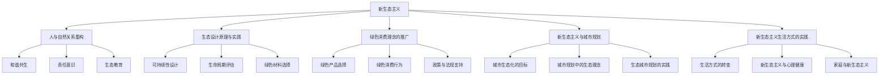

                 

### 新生态主义概述

新生态主义，作为一种新型的生态哲学和生活方式，强调人类与自然和谐共生，倡导通过可持续的方式生活，以达到生态平衡与环境保护的目的。这一理念源于对传统工业化模式所带来的环境问题的深刻反思，以及对未来人类与地球共同命运的共同关切。

#### **1.1 新生态主义的起源与发展**

新生态主义并不是一夜之间诞生的，它有着深厚的历史背景和理论基础。其根源可以追溯到20世纪初，当时全球范围内生态运动刚刚兴起，人们对工业化对自然环境造成的破坏开始有了更深刻的认识。著名的生态学家如蕾切尔·卡逊（Rachel Carson）在她的著作《寂静的春天》（"Silent Spring"）中，揭示了化学农药对环境的危害，从而引发了公众对环境保护的广泛关注。

随着时间的推移，新生态主义在理论和实践上不断发展和完善。它吸收了生态学、环境科学、社会学等多学科的研究成果，形成了一套完整的理论体系。在21世纪，随着全球气候变化和环境问题日益严峻，新生态主义逐渐成为全球范围内的一种重要生活方式和社会运动。

#### **1.2 新生态主义的核心原则**

新生态主义的核心原则可以总结为以下几点：

**1. 和谐共生：** 新生态主义强调人类与自然、生态系统的和谐相处。这种和谐不仅仅是保护环境，更是一种深层次的共生关系，即人类需要依赖自然环境才能生存，而自然环境也需要人类的尊重和保护。

**2. 可持续性：** 新生态主义倡导通过可持续的方式生活，包括资源的节约、环境的保护和生态平衡的维护。这种可持续性不仅体现在生产领域，也体现在消费领域，即每个人都需要以环保和节约为准则来安排自己的生活。

**3. 整体观：** 新生态主义认为，人类和自然环境是一个不可分割的整体。任何局部的、短期的行为，都可能对整体环境造成长期的、不可逆转的影响。因此，新生态主义强调整体思维，鼓励人们在行动之前考虑整体的、长期的后果。

**4. 共享与公平：** 新生态主义倡导资源和社会成果的公平分配，反对过度消费和不平等现象。它认为，只有当每个人都能公平地享受到自然资源和福利时，才能真正实现生态平衡和社会和谐。

#### **1.3 新生态主义的重要议题**

新生态主义涵盖了许多重要的议题，其中最为关键的是生态设计、绿色消费和生态教育。

**1. 生态设计：** 生态设计是产品设计和生产过程中的生态考虑。它不仅仅关注产品的性能和成本，更关注产品在其生命周期中对环境的影响。生态设计的目标是实现产品与环境之间的和谐共生，包括使用环保材料、减少污染、降低能耗等。

**2. 绿色消费：** 绿色消费是指消费者在购买和使用产品时，考虑产品的环保性能和可持续性。绿色消费倡导减少浪费、循环利用和选择环保产品。通过改变消费习惯，消费者可以在日常生活中为环境保护做出贡献。

**3. 生态教育：** 生态教育是推广新生态主义的重要手段。它通过教育系统，培养公众的生态意识和可持续生活方式。生态教育的内容包括生态知识、环境问题、可持续发展等，旨在提高人们的环保意识和责任感。

#### **总结**

新生态主义生活方式设计不仅是对环境保护的一种回应，更是一种全新的生活方式的探索。它要求我们从根本上改变对自然的态度和行为方式，以实现人与自然的和谐共生。通过生态设计、绿色消费和生态教育，我们可以逐步实现这一目标，为未来的地球和人类创造一个更加美好的家园。

### 1.1 新生态主义的起源与发展

新生态主义作为一种新兴的生活理念和哲学体系，其起源可以追溯到20世纪初期，那时人类对工业化带来的环境问题有了初步的认识。然而，真正引发广泛关注的标志性事件是蕾切尔·卡逊（Rachel Carson）于1962年出版的《寂静的春天》（"Silent Spring"）。这本书详细阐述了化学农药对环境生态系统的破坏，引起了公众对环境保护的巨大反响，被视为新生态主义运动的发端。

**概念界定：**

新生态主义，作为一种生态哲学，旨在通过可持续的方式生活，以实现人与自然环境的和谐共生。它不仅仅关注环境保护，更强调人类社会的整体福祉和地球生态系统的健康。新生态主义的核心是可持续性、和谐共生、整体观和公平性。

**发展历程：**

1. **萌芽阶段（20世纪初至1960年代）：** 在这一时期，工业革命带来的环境问题开始引起人们的关注。早期的环保主义者开始倡导减少污染和保护自然。

2. **成熟阶段（1970-1990年代）：** 随着全球环境问题的加剧，尤其是《寂静的春天》的出版，环保运动逐渐形成规模。政府开始制定环境保护法规，环境科学逐渐成为一门独立的学科。

3. **扩展阶段（2000年代至今）：** 新生态主义在这一时期得到了更为广泛和深入的发展。生态设计、绿色消费、生态教育等理念逐渐融入到人们的日常生活中，成为一种普遍的生活方式和价值观。

**核心思想：**

新生态主义的核心思想包括以下几点：

- **人与自然和谐共生：** 新生态主义认为，人类与自然环境是一个相互依存的系统，人类应该尊重自然、保护生态，以实现长期的可持续发展。

- **可持续性：** 新生态主义强调通过节约资源、减少污染、维护生态平衡来实现可持续性。这种可持续性不仅体现在经济领域，也体现在社会和文化领域。

- **整体观：** 新生态主义主张从整体视角看待环境问题，认为局部和短期的行为可能对整体环境造成长期的影响。因此，新生态主义鼓励人们采取整体思维，以全局为重。

- **公平性：** 新生态主义强调资源和社会成果的公平分配。它反对过度消费和不平等现象，倡导人人享有公平的资源分配和环境保护权益。

**理论基础：**

新生态主义的理论基础融合了生态学、环境科学、社会学等多个学科的研究成果。它不仅吸收了生态学的基本原理，如生态平衡、生物多样性等，还借鉴了环境科学中的污染控制、资源管理等内容。此外，社会学中的可持续发展理论、公平性原则等也为新生态主义提供了重要的理论支持。

**新生态主义的意义：**

新生态主义的兴起标志着人类对自然观念的深刻变革。它不仅有助于解决当前的环境问题，还为人类社会的未来发展提供了新的方向。新生态主义的生活方式强调节约、环保和可持续发展，有助于减少对自然资源的依赖，降低环境污染，提高人类生活质量。

**未来展望：**

随着全球环境问题的日益严峻，新生态主义将继续发挥重要作用。未来，新生态主义的发展将更加注重科技创新、国际合作和社会参与。通过推广生态设计、绿色消费和生态教育，人类将能够在保护环境的同时，实现经济社会的可持续发展。

### 1.2 新生态主义的核心原则

新生态主义作为一门生态哲学和生活理念，其核心原则贯穿于人类与自然的互动之中，旨在实现生态系统的平衡和人类社会的可持续发展。以下是新生态主义的核心原则及其具体内容：

#### **和谐共生**

和谐共生是新生态主义的首要原则，强调人类与自然、生态系统之间的和谐相处。这一原则要求人类尊重自然规律，保护生物多样性，维护生态平衡。具体来说，和谐共生包括以下几个方面：

1. **人与自然的相互尊重：** 人类应当认识到自己只是地球生态系统的一部分，而非地球的主宰。尊重自然，就是尊重生命，尊重生态系统的完整性和稳定性。
2. **保护生物多样性：** 生物多样性是地球生态系统健康的重要标志。新生态主义倡导通过保护野生动植物栖息地、恢复生态系统等方式，维护生物多样性。
3. **生态系统的稳定性：** 新生态主义强调，人类活动应尽量避免对生态系统的破坏，维持生态系统的稳定性和自我修复能力。

#### **可持续性**

可持续性是新生态主义的另一个核心原则，它强调资源的节约利用、环境的保护和生态平衡。可持续性不仅关注当前的需求，还考虑未来世代的利益。以下是可持续性的几个关键要素：

1. **资源节约：** 资源是人类生存和发展的基础。新生态主义倡导减少资源消耗，推广资源的循环利用和再生利用，以减少对自然资源的依赖。
2. **环境保护：** 环境是人类赖以生存的基石。新生态主义主张通过减少污染、治理环境、保护生态系统等方式，确保环境的健康和可持续性。
3. **生态平衡：** 生态平衡是生态系统稳定运行的基础。新生态主义强调，人类活动应与自然生态系统的承载能力相匹配，避免过度开发和资源消耗。

#### **整体观**

整体观是新生态主义的第三个核心原则，主张从整体视角看待生态问题，认为局部和短期的行为可能对整体环境产生长期影响。整体观的核心内容包括：

1. **整体思维：** 新生态主义鼓励人们采取整体思维，综合考虑生态、经济和社会等多个方面的因素，制定全面的可持续发展策略。
2. **长远规划：** 新生态主义强调，决策和行动应考虑长期的生态和社会影响，避免短视行为，确保可持续发展目标的实现。
3. **协同合作：** 新生态主义倡导不同领域、不同利益群体之间的协同合作，共同应对生态挑战，实现共同目标。

#### **共享与公平**

共享与公平是新生态主义的第四个核心原则，强调资源和社会成果的公平分配，反对过度消费和不平等现象。以下是共享与公平的几个关键要素：

1. **公平分配：** 资源和社会成果的分配应当公平合理，确保每个人都能享受到基本的环境资源和福利。
2. **减少不平等：** 新生态主义反对因资源分配不均导致的社会不平等现象，倡导通过政策和社会改革，减少贫富差距，实现社会公平。
3. **社会责任：** 企业和个人都有责任参与环境保护和可持续发展，通过履行社会责任，共同维护生态平衡和社会公平。

#### **原则之间的联系**

新生态主义的核心原则之间存在着紧密的联系，共同构成一个完整的理论体系。和谐共生是目标，可持续性是手段，整体观是方法论，共享与公平是保障。这些原则相互支持、相互促进，共同推动人类与自然和谐共生的实现。

通过和谐共生，人类认识到自己在生态系统中的角色，从而采取可持续性的生活方式。整体观则指导人类从全局出发，制定长远规划，确保可持续发展目标的实现。而共享与公平则保障了这一目标在实践中的落实，确保每个人都能公平地享受到生态保护和可持续发展的成果。

### 1.3 新生态主义的重要议题

新生态主义不仅仅是一种生活理念，更是一种系统的实践，涵盖了生态设计、绿色消费、生态教育等多个重要议题。这些议题共同构成了新生态主义的核心内容，旨在推动人类与自然的和谐共生。

#### **生态设计**

生态设计是新生态主义的重要组成部分，它关注产品在其生命周期中对环境的影响。生态设计的核心理念是减少资源消耗、降低污染、提高产品可持续性。以下是生态设计的关键要素和实施方法：

**1. 可持续性设计：**

可持续性设计是生态设计的核心目标，它要求产品在整个生命周期内，从原材料选择、生产制造、使用维护到废弃处理，都考虑其环境影响。具体措施包括：

- **绿色材料选择：** 选择环保、可再生的材料，减少对自然资源的依赖。
- **减少能源消耗：** 在产品设计和生产过程中，尽量使用节能技术和工艺，降低能耗。
- **减少污染排放：** 通过优化生产工艺，减少污染物排放，保护环境。

**2. 生命周期评估：**

生命周期评估（Life Cycle Assessment，LCA）是生态设计的重要工具，用于评估产品在其整个生命周期中的环境影响。LCA包括以下几个阶段：

- **原材料的采集和加工：** 评估原材料获取过程中的环境影响，包括资源消耗和污染排放。
- **生产阶段：** 评估生产过程中能源消耗、废物排放等环境影响。
- **使用阶段：** 评估产品在使用过程中的环境影响，如能源消耗、废弃物产生等。
- **废弃处理：** 评估产品废弃处理过程中的环境影响，包括回收利用和最终处置。

**3. 案例分析：**

**案例1：** 瑞士的碧可公司（BIC）在制造圆珠笔时采用了生物降解塑料材料，大大减少了传统塑料对环境的污染。通过生命周期评估，碧可公司发现这种新型材料的总环境影响显著降低，从而实现了生态设计的可持续性目标。

**案例2：** 日本的松下公司（Panasonic）在电子产品设计上采用模块化设计，使产品易于维修和升级，延长了产品使用寿命，减少了电子废弃物。

#### **绿色消费**

绿色消费是新生态主义在消费领域的具体体现，它鼓励消费者在购买和使用产品时，优先考虑产品的环保性能和可持续性。以下是绿色消费的核心内容和实际案例：

**1. 绿色产品选择：**

绿色产品是指在其生命周期内对环境影响较小的产品。消费者可以通过以下几个途径识别和选择绿色产品：

- **环保标志和认证：** 许多国家和地区都有环保标志和认证体系，如欧盟的“蓝天使”（Blue Angel）标志，美国的“绿色印章”（Green Seal）认证等。
- **产品标签：** 了解产品标签上的环保信息，如材料成分、能耗指标、回收标志等。
- **消费者评价：** 参考其他消费者的评价和反馈，选择环保性能较好的产品。

**2. 绿色消费行为：**

绿色消费行为包括以下几个方面：

- **减少浪费：** 通过减少不必要的消费，减少废弃物产生，如减少塑料袋的使用、节约用水等。
- **循环利用：** 通过回收利用废弃物，减少资源消耗和环境污染，如废旧电子产品回收、废旧衣物再利用等。
- **可持续采购：** 在购买产品时，优先考虑环保和可持续性的因素，如选择有机食品、可再生能源等。

**3. 案例分析：**

**案例1：** 德国消费者在购买洗衣粉时，会优先选择含有环保成分、无磷的洗衣产品，以减少对水体的影响。

**案例2：** 日本消费者在购买食品时，会关注食品的生产来源，优先选择有机、无农药残留的食品，以减少对健康和环境的危害。

#### **生态教育**

生态教育是新生态主义的重要组成部分，它通过教育系统培养公众的生态意识和可持续生活方式。以下是生态教育的主要内容和实施方法：

**1. 生态知识普及：**

生态教育首先需要普及生态知识，让公众了解生态系统的基本原理和人类活动对环境的影响。具体内容包括：

- **生态学原理：** 教授生态平衡、生物多样性、生态系统服务等基本概念。
- **环境问题：** 分析当前全球环境问题，如气候变化、水资源短缺等，提高公众的环境危机意识。
- **可持续发展：** 解释可持续发展的概念和目标，让公众了解如何通过可持续的生活方式减少对环境的负面影响。

**2. 生态文明培养：**

生态文明是指人与自然和谐共生、可持续发展的文明。生态教育旨在培养公众的生态文明意识，具体措施包括：

- **生态文明课程：** 在学校、社区等场所开设生态文明课程，向公众传授生态文明的理念和实践方法。
- **实践活动：** 组织环保活动、生态旅游等，让公众亲身体验生态保护的重要性，培养环保行为习惯。
- **媒体宣传：** 通过电视、网络、报刊等媒体，宣传生态文明的理念和实践案例，提高公众的生态文明意识。

**3. 案例分析：**

**案例1：** 中国在小学和中学阶段开设了《生态文明教育》课程，通过课堂教学、实践活动等多种形式，培养学生的环保意识和生态文明素养。

**案例2：** 瑞典在高中阶段开设了“环境与可持续发展”课程，学生通过研究本地和全球的环境问题，提出解决方案，培养解决实际问题的能力。

通过生态设计、绿色消费和生态教育，新生态主义为实现人与自然的和谐共生提供了具体的实践路径。这些议题相互关联，共同推动新生态主义理念在社会各领域的深入实施，为构建可持续发展的未来奠定坚实基础。

### 2.1 人类活动对自然的影响

人类活动对自然环境的影响是深远而广泛的，特别是在工业化、城市化的进程中，这种影响愈发显著。以下是人类活动对自然造成的主要环境问题和其对生态系统的影响：

#### **工业化带来的环境问题**

工业化是推动现代社会发展的关键力量，但同时也带来了严重的环境问题。主要问题包括：

1. **大气污染：** 工业化过程中，大量燃烧化石燃料释放出二氧化碳、二氧化硫、氮氧化物等有害气体，导致空气污染。空气污染不仅影响人类健康，还会破坏大气层中的臭氧层，加剧地球温室效应。

2. **水污染：** 工业生产过程中产生的废水、废气和固体废弃物，未经处理直接排放到河流、湖泊和海洋中，导致水体污染。水污染不仅破坏了水生生态系统，还威胁到人类的饮水安全和食品安全。

3. **土壤污染：** 长期使用农药、化肥等化学制品，导致土壤污染和生态失衡。土壤污染会影响农作物的产量和质量，进而影响人类的健康和粮食安全。

4. **生态系统破坏：** 工业化带来了大规模的土地开发和资源开采，破坏了原有的自然生态系统。森林砍伐、草原退化、湿地减少等问题严重破坏了生态系统的平衡和生物多样性。

#### **城市化带来的环境问题**

城市化是现代社会发展的另一大趋势，但城市化过程同样带来了诸多环境问题。主要问题包括：

1. **交通拥堵和空气污染：** 城市化带来了人口的急剧增加和交通需求的剧增，导致交通拥堵和空气污染问题。车辆尾气排放的有害物质，如一氧化碳、氮氧化物和颗粒物，严重污染了城市空气。

2. **水资源短缺：** 随着城市化进程的推进，城市对水资源的需求不断增加，而水资源污染和过度开采导致水资源短缺问题日益严重。城市居民面临的水资源供应不足，不仅影响生活质量，还对农业生产和工业生产造成影响。

3. **城市热岛效应：** 城市化带来了大量的建筑物和道路，这些人工结构吸收和储存了大量的热量，导致城市温度高于周边乡村地区，形成城市热岛效应。城市热岛效应加剧了城市空气质量问题，增加了能源消耗和气候变化的风险。

4. **垃圾处理问题：** 随着城市化进程的加速，城市垃圾产量不断增加，垃圾处理成为一大难题。未经处理的垃圾和废弃物不仅污染土壤和水源，还会释放有害气体，影响城市居民的健康。

#### **生态系统破坏的影响**

1. **生物多样性减少：** 人类活动对自然环境的破坏导致了大量物种的灭绝和生态系统的退化，生物多样性大幅减少。生物多样性减少不仅影响生态系统的稳定性，还削弱了生态系统的服务功能，如土壤保持、水源净化和气候调节等。

2. **生态平衡失调：** 生态系统的破坏和污染导致生态平衡失调，一些物种数量急剧减少或灭绝，而另一些物种则因环境适宜而迅速扩张，可能导致生态系统中的食物链和食物网结构发生变化，进而影响生态系统的稳定性。

3. **环境服务功能减弱：** 生态系统的破坏使许多重要的环境服务功能减弱，如土壤保持、水源净化和气候调节等。环境服务功能的减弱不仅影响生态系统的健康，还增加了人类应对气候变化和自然灾害的难度。

4. **人类健康风险增加：** 人类活动对自然环境的破坏导致空气、水和土壤污染，增加了人类接触有害物质的风险，导致各种健康问题，如呼吸系统疾病、心血管疾病和癌症等。

总之，人类活动对自然环境的破坏带来了严重的环境问题和生态危机，影响了生态系统的健康和人类的生存质量。为了实现可持续发展，我们需要采取有效措施，减少人类活动对自然环境的负面影响，保护和恢复生态系统。

### 2.2 人类角色转变

面对日益严重的环境问题，人类逐渐意识到自己不能再作为自然的主宰，而应转变为生态系统的积极参与者和守护者。这种角色的转变不仅是对自然环境破坏的反思，更是对未来人类与自然和谐共生的一种新期待。

#### **从控制者到参与者**

在过去，人类常常以征服者和控制者的姿态对待自然。工业革命以来，人类通过大规模的自然资源开发和污染排放，试图从自然界获取无限的财富和资源。然而，这种过度开发和无节制的消费方式导致了严重的环境问题，如气候变化、生物多样性减少和生态系统失衡。因此，人类开始认识到，单纯的“控制”并不能解决环境问题，反而需要更加积极地参与到生态系统中，与自然和谐共处。

**1. 尊重自然规律：** 人类需要重新认识自然规律，尊重生态系统的自我调节能力。例如，农业生产应顺应自然节律，避免过度使用化肥和农药，减少对土壤和水源的污染。

**2. 减少人为干扰：** 在自然环境中，人类活动应尽量减少对生态系统的干扰。例如，在森林采伐、湿地开发和土地开垦等过程中，应采取科学的规划和生态补偿措施，以减少对生态系统的破坏。

**3. 恢复自然生态：** 通过植树造林、湿地恢复和海洋保护等措施，人类可以积极参与生态系统的修复工作，恢复自然生态系统的完整性和稳定性。

#### **责任意识**

人类角色的转变不仅是一种行为方式的改变，更是一种责任意识的提升。作为生态系统的参与者，人类有责任保护自然、维护生态平衡，为后代留下一个健康的环境。

**1. 环境责任：** 人类活动对环境的负面影响是当前全球面临的最紧迫问题之一。人类有责任采取积极措施，减少污染排放、节约资源，推动绿色发展。

**2. 社会责任：** 人类不仅需要对自己的行为负责，还需要对社会和环境负责。例如，企业应履行社会责任，采用环保技术和绿色生产方式，减少对环境的负面影响。

**3. 国际责任：** 环境问题是全球性的，没有哪个国家可以独善其身。因此，人类有责任在全球化背景下，加强国际合作，共同应对全球环境问题，如气候变化、生物多样性保护等。

#### **生态意识培养**

生态意识的培养是转变人类角色的重要一环。通过教育、宣传和实践活动，提高公众的生态意识和责任感，是实现人与自然和谐共生的基础。

**1. 生态教育：** 教育系统应将生态教育纳入课程体系，从小培养儿童的生态意识。通过生态学原理、环境问题和可持续发展等课程，使学生了解生态系统的基本原理和人类活动对环境的影响。

**2. 环境宣传：** 利用媒体、网络和社区活动等多种形式，广泛宣传环境保护的重要性和方法，提高公众的环境意识。

**3. 生态实践活动：** 组织公众参与植树造林、垃圾分类、水资源保护等生态实践活动，通过实际行动体验生态保护的意义，增强生态责任感。

总之，人类角色的转变是从控制者到参与者和责任意识的提升。通过尊重自然规律、减少人为干扰、恢复自然生态，人类可以更好地与自然和谐共处，共同守护地球这个共同的家园。

### 2.3 生态教育

生态教育是推广新生态主义理念的重要手段，通过教育系统培养公众的生态意识和可持续生活方式。以下是生态教育的具体内容和实施方法：

**1. 生态知识普及：**

生态知识普及是生态教育的基础，旨在让公众了解生态系统的基本原理和人类活动对环境的影响。具体内容包括：

- **生态学原理：** 教授生态平衡、生物多样性、生态系统服务等基本概念。
- **环境问题：** 分析当前全球面临的主要环境问题，如气候变化、水资源短缺、生物多样性减少等。
- **可持续发展：** 解释可持续发展的概念和目标，让公众了解如何通过可持续的生活方式减少对环境的负面影响。

**2. 生态文明培养：**

生态文明培养是生态教育的核心目标，旨在培养公众的生态文明意识和行为习惯。具体措施包括：

- **生态文明课程：** 在学校、社区等场所开设生态文明课程，通过课堂教学、讨论和实践等多种形式，向公众传授生态文明的理念和方法。
- **实践活动：** 组织环保活动、生态旅游、社区服务等活动，让公众亲身体验生态保护的重要性，培养环保行为习惯。
- **媒体宣传：** 利用电视、网络、报刊等媒体，宣传生态文明的理念和实践案例，提高公众的生态文明意识。

**3. 教育体系整合：**

生态教育应贯穿于整个教育体系，从幼儿园到大学，逐步培养学生的生态意识和可持续生活方式。具体措施包括：

- **幼儿园教育：** 通过游戏、绘画等互动形式，培养幼儿的环保意识和初步的生态知识。
- **中小学教育：** 将生态教育纳入课程体系，开设环境科学、生物多样性等课程，培养学生的实践能力和创新精神。
- **高等教育：** 在大学开设环境科学、生态学等相关专业，培养具备专业知识和实践能力的高层次人才。

**4. 家庭教育支持：**

家庭教育在新生态主义推广中起着重要作用，家长应当积极参与生态教育，培养孩子的环保意识和行为习惯。具体措施包括：

- **家庭活动：** 组织家庭环保活动，如垃圾分类、节水减排等，让孩子在家庭环境中体验生态保护的重要性。
- **亲子互动：** 通过亲子阅读、亲子游戏等方式，向孩子传授生态知识，培养他们的环保意识。
- **家庭氛围：** 营造家庭环保氛围，如减少使用一次性用品、节约能源等，让孩子在日常生活中养成环保习惯。

**5. 社会参与与合作：**

生态教育不仅是学校和家庭的责任，也需要社会各界的广泛参与与合作。具体措施包括：

- **社会组织参与：** 环保组织、公益组织等可以与学校、社区合作，共同开展生态教育活动。
- **企业社会责任：** 企业应履行社会责任，支持生态教育的开展，通过环保宣传、生态实践等活动，推动新生态主义理念的传播。
- **政府支持：** 政府应制定相关政策，支持生态教育的开展，提供资金和资源支持，确保生态教育的有效实施。

通过生态教育，我们可以培养公众的生态意识和可持续生活方式，推动新生态主义理念在社会各领域的深入实施，为构建可持续发展的未来奠定坚实基础。

### 3.1 生态设计的理论基础

生态设计是一种旨在减少产品在整个生命周期中对环境负面影响的设计方法，其理论基础涵盖了可持续性设计、生命周期评估和绿色材料选择等多个方面。以下是对这些理论基础的详细探讨：

#### **可持续性设计**

可持续性设计是生态设计的核心原则，它强调在产品的整个生命周期内考虑环境、社会和经济因素。可持续性设计的理论基础包括以下几个方面：

1. **生命周期视角：** 可持续性设计要求将产品从设计、制造、使用到废弃的整个生命周期都纳入考虑。通过分析每个阶段的环境影响，设计师可以优化产品的设计，减少资源消耗和污染排放。

2. **资源效率：** 可持续性设计注重提高资源使用效率，通过优化设计、材料选择和生产工艺，减少原材料的使用和能源消耗。例如，采用轻量化设计、模块化设计等策略，可以有效降低资源消耗。

3. **环境影响评估：** 在产品设计和开发过程中，进行环境影响评估是确保产品可持续性的关键步骤。通过生命周期评估（LCA）等工具，设计师可以全面评估产品在整个生命周期中的环境影响，从而优化设计，减少对环境的负面影响。

#### **生命周期评估（LCA）**

生命周期评估是一种系统评估方法，用于评估产品或服务在其整个生命周期中的环境、社会和经济影响。生命周期评估的理论基础包括以下几个关键步骤：

1. **定义功能单元：** 确定产品或服务的功能单元，这是LCA的基础。功能单元通常是一个具有特定使用价值的单位，如一个电池或一辆汽车。

2. **边界设定：** 确定生命周期评估的范围，包括产品的原材料采集、生产制造、使用和维护、废弃处理等各个阶段。边界设定的目的是确保评估的全面性和一致性。

3. **数据收集：** 收集与产品生命周期相关的数据，包括能源消耗、原材料使用、污染排放等。这些数据可以从文献、统计数据、实验测量等多种来源获取。

4. **影响分析：** 分析收集到的数据，评估产品在生命周期各个阶段的环境、社会和经济影响。影响分析通常涉及多种影响指标，如温室气体排放、资源消耗、生态足迹等。

5. **结果解释：** 解释和分析结果，评估产品或服务的环境影响，并提出改进建议。结果解释有助于设计师优化产品设计和开发过程，降低环境影响。

#### **绿色材料选择**

绿色材料选择是生态设计的重要组成部分，它涉及选择对环境影响较小、可再生或可降解的材料。绿色材料选择的理论基础包括以下几个方面：

1. **材料可持续性：** 绿色材料应具有高的可持续性，即在使用过程中消耗较少的资源，且能够在使用后易于回收或降解。例如，生物基材料、可再生资源等。

2. **环境影响评估：** 选择绿色材料时，应进行环境影响评估，确保所选材料在整个生命周期中的环境影响最小。评估指标可以包括温室气体排放、资源消耗、生态足迹等。

3. **性能要求：** 绿色材料不仅应满足环境影响要求，还应满足产品的性能要求。例如，耐用性、强度、安全性等。

4. **供应链管理：** 绿色材料的选择需要考虑供应链的可持续性，确保材料来源合法、透明，且能够实现循环利用。

#### **综合理论框架**

生态设计的理论基础是一个综合性的框架，涵盖了可持续性设计、生命周期评估和绿色材料选择等多个方面。这个框架不仅提供了评估产品环境影响的方法，还指导设计师如何在设计过程中考虑环境因素，实现生态设计的目标。

**综合理论框架的核心观点：**

- **系统性：** 生态设计要求从系统视角看待产品设计和开发，综合考虑环境、社会和经济因素。
- **生命周期思维：** 生态设计强调在整个产品生命周期内考虑环境影响，而不是仅仅关注产品使用阶段。
- **性能与可持续性平衡：** 生态设计追求在满足产品性能要求的同时，实现环境可持续性。
- **创新驱动：** 通过不断探索新的设计理念、材料和工艺，推动生态设计的发展。

通过理解和应用生态设计的理论基础，设计师可以在产品设计和开发过程中实现环境保护和可持续发展的目标，为构建更加绿色和可持续的未来做出贡献。

### 3.2 生态设计的实践方法

生态设计不仅仅是一种理念，更需要在实践中具体落实。以下将详细探讨生态设计的实践方法，包括材料选择、生产流程和产品设计等方面的具体措施。

#### **材料选择**

材料选择是生态设计的重要一环，直接影响产品的环境影响。以下是一些关键的实践方法：

**1. 绿色材料：** 选择环保、可再生或可降解的材料，减少对自然资源的依赖。例如，使用生物基材料、回收材料、可降解塑料等。

**2. 材料生命周期评估：** 对选定的材料进行生命周期评估（LCA），以评估其整体环境影响，包括资源消耗、能源使用和污染排放等。

**3. 性能与可持续性平衡：** 材料的选择不仅要考虑环保性能，还要满足产品的性能要求，如强度、耐用性等。

**4. 供应链管理：** 优化供应链管理，确保材料来源的可持续性和透明性，减少对环境的不利影响。

#### **生产流程**

生产流程的生态设计旨在减少能源消耗、减少污染排放和提高资源利用效率。以下是一些具体方法：

**1. 节能技术：** 应用节能技术和设备，如高效电机、智能控制系统等，减少能源消耗。

**2. 清洁生产：** 推广清洁生产技术，减少生产过程中的废水、废气和固体废弃物排放。例如，通过废水循环利用、废气净化和固废回收等措施。

**3. 循环利用：** 在生产过程中尽量回收和再利用废弃物，减少资源浪费和环境污染。

**4. 精益生产：** 实施精益生产方法，通过优化生产流程和减少浪费，提高生产效率和资源利用率。

#### **产品设计**

产品设计是生态设计的核心环节，以下是一些具体的实践方法：

**1. 模块化设计：** 采用模块化设计，使产品易于维修、升级和再利用，延长产品使用寿命，减少废弃物的产生。

**2. 减量化设计：** 通过优化产品设计和结构，减少材料的使用量和产品体积，降低对环境的影响。

**3. 可降解和可回收设计：** 设计产品使其在使用寿命结束后易于降解或回收，减少对环境的影响。例如，使用生物降解材料和可回收设计。

**4. 用户参与设计：** 让用户参与产品设计过程，了解用户需求和环保意识，设计出既满足用户需求又具有环保性能的产品。

**5. 周期性评估：** 定期对产品设计进行周期性评估，以持续优化设计，减少环境影响。

#### **案例分析**

**案例1：** 苹果公司（Apple）在产品设计上采用了模块化设计，使产品易于维修和升级，延长了产品使用寿命，减少了电子废弃物的产生。

**案例2：** 瑞典的家具制造商宜家（IKEA）在材料选择上使用了大量的回收材料和可再生资源，如回收木料、纸张等，减少了资源消耗和环境污染。

通过以上实践方法，生态设计可以在材料选择、生产流程和产品设计等多个环节实现环境保护和资源节约的目标，为构建可持续发展的未来做出积极贡献。

### 3.3 生态设计的案例分析

生态设计作为一种旨在减少产品生命周期内环境影响的设计方法，已经在全球范围内得到了广泛应用。以下是国内外生态设计的成功案例，以及这些案例中的关键成功因素和面临的挑战。

#### **国内成功案例**

**1. 菲利普·斯塔克（Philippe Starck）设计的ECO-PLANTE智能灌溉系统：**

菲利普·斯塔克设计的ECO-PLANTE智能灌溉系统是一款集高效灌溉、智能控制和环保材料于一体的创新产品。该系统利用传感器和物联网技术，根据土壤湿度自动调节灌溉，减少了水资源浪费。同时，ECO-PLANTE使用环保材料，如可回收塑料和再生金属，降低了产品对环境的影响。

**成功因素：** 该案例的成功在于将生态设计理念与高科技融合，实现了水资源的高效利用。此外，环保材料的使用也符合可持续发展的要求。

**面临的挑战：** 智能灌溉系统的推广面临高昂的安装成本和维护费用，这可能会限制其在普通消费者中的普及。

**2. 三星（Samsung）的回收电子产品项目：**

三星在全球范围内实施了一项回收电子产品项目，通过回收旧手机、电脑等电子产品，重新加工利用其中的零部件和材料。该项目不仅减少了电子废弃物的产生，还通过循环利用资源，降低了生产成本。

**成功因素：** 三星回收项目的成功在于其完善的回收网络和高效的处理流程。此外，企业社会责任（CSR）的履行也提升了品牌形象。

**面临的挑战：** 电子产品的回收和处理需要大量的技术和资金投入，企业需要持续优化回收流程，以降低成本。

#### **国际成功案例**

**1. 宜家（IKEA）的绿色家居产品：**

宜家是一家全球知名的家具和家居用品零售商，其绿色家居产品以环保材料和使用寿命长而著称。例如，宜家的马尔姆（Malm）床架使用了可再生木材和可回收金属，同时设计简洁，易于拆卸和回收。

**成功因素：** 宜家的成功在于其坚持绿色设计和可持续发展理念，并通过大规模生产降低产品成本，使环保家居产品更易于消费者接受。

**面临的挑战：** 绿色家居产品的生产成本较高，如何在保证环保性能的同时控制成本，是宜家面临的挑战。

**2. 沃尔玛（Walmart）的可持续产品认证项目：**

沃尔玛推出的可持续产品认证项目，通过对供应商的产品进行环保性能评估，认证出符合环保标准的产品。该项目旨在激励供应商采用更环保的生产方式，同时也为消费者提供透明的环保产品信息。

**成功因素：** 沃尔玛的认证项目通过建立标准的评估体系，提高了供应链的环保水平。此外，项目的透明性和公正性也增强了消费者的信任。

**面临的挑战：** 认证项目的实施需要大量的人力和资源投入，同时如何确保认证过程的公正性和有效性，是沃尔玛需要持续关注的问题。

#### **总结**

生态设计在国内外的成功案例表明，通过创新设计和可持续发展策略，企业可以在保护环境的同时实现商业成功。然而，生态设计在实践中也面临着诸如成本高、技术难度大等问题。为了进一步推广生态设计，企业和政府需要共同努力，通过政策支持和技术创新，解决这些挑战，推动生态设计在全球范围内的普及。

### 3.3 生态设计的挑战与解决方案

尽管生态设计在环境保护和可持续发展方面展现了巨大的潜力，但其实践过程中也面临着诸多挑战。以下是生态设计面临的主要挑战及相应的解决方案：

#### **挑战一：成本问题**

**1. 成本高：** 生态设计要求使用环保材料和生产工艺，这些通常成本较高。例如，生物降解材料、可再生资源等成本高于传统材料。

**2. 投资回报周期长：** 采用生态设计的产品可能在短期内成本较高，但长期来看，其环保效益和环境成本节约可能并不明显。

**解决方案：**

- **政府补贴和税收优惠：** 政府可以通过补贴和税收优惠等措施，降低企业采用生态设计的成本。
- **技术创新和规模效应：** 通过技术创新和规模化生产，降低生态设计的成本。例如，研发更高效的绿色生产工艺，提高资源利用率。
- **生命周期成本分析：** 对产品进行生命周期成本分析，从长远角度评估生态设计的经济性。

#### **挑战二：技术难度**

**1. 环保材料有限：** 当前市场上可用的环保材料种类和性能仍有限，难以完全替代传统材料。

**2. 绿色生产工艺复杂：** 绿色生产工艺往往更加复杂，需要更多的技术支持，对技术人员的要求更高。

**解决方案：**

- **加强科研投入：** 加大对生态设计相关领域的科研投入，推动新材料和新技术的研发。
- **跨学科合作：** 鼓励不同学科间的合作，如生态学家、化学家、工程师等共同攻克生态设计中的技术难题。
- **技能培训：** 为技术人员提供相关的培训，提高其对生态设计技术和环保材料的应用能力。

#### **挑战三：消费者认知和接受度**

**1. 消费者意识不足：** 许多消费者对生态设计了解有限，对其成本和性能的疑虑较大。

**2. 市场推广困难：** 生态设计产品在市场上的推广面临挑战，消费者对环保产品的接受度相对较低。

**解决方案：**

- **公众教育：** 通过宣传和教育活动，提高公众对生态设计的认知，增强其环保意识。
- **品牌营销：** 企业可以通过品牌营销策略，突出生态设计产品的环保特性，提升消费者认可度。
- **政策支持：** 政府可以制定政策，鼓励消费者购买生态设计产品，如提供环保补贴、建立环保标志等。

#### **挑战四：供应链管理**

**1. 材料供应链不稳定：** 环保材料的供应链可能不如传统材料稳定，存在供应风险。

**2. 废弃物处理问题：** 生态设计产品的回收和处理需要专门的设施和技术，废弃物的处理成本较高。

**解决方案：**

- **建立稳定的供应链：** 与环保材料供应商建立长期合作关系，确保材料的稳定供应。
- **废弃物回收体系：** 建立健全的废弃物回收和处理体系，通过政府、企业和社区的共同参与，降低废弃物处理成本。
- **循环利用技术：** 研发和应用废弃物循环利用技术，提高资源利用效率，减少环境负担。

总之，生态设计在实践中面临着多种挑战，但通过技术创新、政策支持、市场推广和供应链管理等多方面的努力，可以有效应对这些挑战，推动生态设计的普及和发展，为实现可持续发展的目标作出贡献。

### 4.1 绿色消费的重要性

绿色消费作为一种生活方式和消费模式，对于环境保护和可持续发展具有深远的意义。它不仅有助于减少环境污染，提高资源利用效率，还能推动社会经济的绿色转型。以下将详细探讨绿色消费的重要性及其在经济和社会层面的影响。

#### **环境保护**

绿色消费的核心在于减少对环境的负面影响。通过选择环保产品、改变消费习惯，消费者可以在日常生活中为环境保护贡献力量。以下是绿色消费在环境保护方面的几个重要方面：

1. **减少污染排放：** 绿色消费鼓励消费者选择低污染、低能耗的产品。例如，选择节能电器、环保交通工具，减少二氧化碳和其他有害气体的排放。

2. **资源节约：** 绿色消费倡导减少资源的浪费，鼓励循环利用和再生利用。通过选择可再生资源制成的产品，如有机食品、可再生材料等，可以减少对自然资源的依赖。

3. **减少废弃物：** 绿色消费鼓励减少不必要的消费和废弃物的产生。通过选择可重复使用和易于回收的产品，消费者可以减少垃圾填埋和焚烧带来的环境问题。

4. **生态系统保护：** 绿色消费支持对生态系统的保护和恢复。例如，选择生态友好型农业产品和有机食品，可以减少农药和化肥的使用，保护农田生态系统。

#### **经济影响**

绿色消费不仅对环境保护具有积极影响，还在经济层面产生了一系列效应。以下是绿色消费对经济的影响：

1. **促进绿色产业发展：** 绿色消费需求的增加，会推动绿色产业的发展，如可再生能源、环保材料和绿色建筑等。这些产业的发展不仅提供了新的就业机会，还推动了技术进步和经济增长。

2. **推动产业升级：** 绿色消费促使企业进行技术改造和产品升级，以适应市场需求。这种升级有助于提高企业的竞争力，推动产业向高附加值、高技术含量的方向发展。

3. **增加经济活动：** 绿色消费创造了新的市场需求，带动了相关产业链的活跃。从生产到销售，再到服务，绿色消费带动了整个经济活动的增长。

4. **减少环境成本：** 通过绿色消费，可以减少企业因环境污染而承担的环境成本。例如，减少废水排放和处理费用，降低因环境污染导致的健康问题和法律风险。

#### **社会影响**

绿色消费在社会层面产生了广泛的影响，促进了社会文化的转变和公众生活质量的提升。以下是绿色消费在社会影响方面的几个方面：

1. **公众意识提升：** 绿色消费使公众更加关注环境保护和可持续发展问题。通过日常生活中的选择和行动，消费者逐渐形成了环保意识，推动了社会文化的绿色转型。

2. **生活方式改变：** 绿色消费促使消费者改变传统的消费观念和行为习惯。越来越多的人开始注重环保、健康和可持续发展，生活方式变得更加绿色和低碳。

3. **社会公正：** 绿色消费倡导资源的公平分配和社会公正。通过选择环保产品，消费者支持公平贸易和可持续发展的企业，有助于减少社会不平等现象。

4. **健康生活：** 绿色消费鼓励选择健康、安全的产品，提高了公众的生活质量。例如，选择有机食品、无毒日用品等，可以减少对健康的危害。

总之，绿色消费在环境保护、经济影响和社会影响方面具有重要意义。通过推动绿色消费，我们可以实现生态保护与经济发展的双赢，为构建可持续发展的未来奠定坚实基础。

### 4.2 绿色消费的具体行动

实现绿色消费不仅需要理念的传播，还需要具体的行动。以下是一些具体措施，帮助消费者在日常生活中践行绿色消费，从而减少环境负担，促进可持续发展：

**1. 选择绿色产品：**

绿色产品是指在其生命周期内对环境影响较小的产品。消费者可以通过以下途径识别和选择绿色产品：

- **环保标志与认证：** 许多国家和地区都有环保标志和认证体系，如欧盟的“蓝天使”（Blue Angel）标志、美国的“绿色印章”（Green Seal）认证等。这些标志和认证可以提供产品的环保性能信息，帮助消费者做出更环保的选择。
- **产品标签：** 关注产品标签上的环保信息，如材料成分、能耗指标、回收标志等。一些产品会明确标示其环保性能，如“无农药残留”、“可回收材料”等。
- **品牌信誉：** 选择那些在环保领域有良好声誉和记录的品牌。这些品牌通常会有更严格的生产标准和环保政策。

**2. 改变消费习惯：**

改变消费习惯是绿色消费的重要组成部分。以下是一些具体建议：

- **减少一次性用品：** 尽量避免使用一次性塑料袋、餐具和吸管等。选择可重复使用的替代品，如布袋、玻璃餐具等。
- **节约用水和能源：** 洗澡时尽量缩短时间，使用节水淋浴头；关闭水龙头，避免不必要的浪费；使用节能灯具和电器，减少能源消耗。
- **减少食品浪费：** 通过合理规划和购物，减少食品浪费。剩余食品可以通过烹饪、储存和回收利用等方式进行再利用。
- **购买当地和有机食品：** 选择当地生产的食品，可以减少运输过程中的能源消耗和碳排放。有机食品通常未使用化学农药和化肥，对环境和健康更加友好。

**3. 增强环保意识：**

提高环保意识是绿色消费的重要基础。以下是一些提高环保意识的途径：

- **教育和培训：** 参加环保课程和工作坊，了解环保知识，提高环保意识。
- **媒体和宣传：** 关注环保新闻和宣传，了解环境问题和解决方案。
- **社区活动：** 参与社区环保活动，如垃圾分类、清洁河流等，通过实际行动体验环保的重要性。
- **社交网络：** 通过社交媒体分享环保信息和经验，鼓励他人也加入绿色消费的行列。

**4. 支持环保企业：**

消费者可以通过选择环保产品和支持环保企业，为环境保护贡献力量。以下是一些具体建议：

- **购买环保认证产品：** 选择那些经过环保认证的产品，如FSC认证的木材、公平贸易认证的咖啡等。
- **购买社会责任投资（SRI）产品：** 投资于那些在环保、社会和治理方面有良好记录的企业，通过资本市场支持环保和可持续发展。
- **参与绿色采购：** 政府和企业可以通过绿色采购政策，优先采购环保产品和服务，推动整个供应链的绿色转型。

通过这些具体行动，消费者可以在日常生活中减少环境负担，践行绿色消费，为保护地球和实现可持续发展做出贡献。

### 4.3 政策与法规支持

政策与法规在推动绿色消费和环境保护中起着至关重要的作用。政府通过制定和实施相关法律法规，可以为绿色消费提供制度保障，引导企业和消费者采取环保行动。以下是政策与法规在绿色消费中的具体作用和措施：

**1. 法律法规的制定**

政府通过立法手段，制定环保法律和法规，为绿色消费提供法律依据。这些法律和法规通常包括以下几个方面：

- **环境保护法：** 明确环境保护的基本原则和责任，规定污染物排放标准、环境保护措施等。
- **资源节约法：** 规定资源的合理利用和节约措施，鼓励循环利用和可再生资源的使用。
- **清洁生产法：** 鼓励企业采用清洁生产工艺，减少污染排放和资源浪费。
- **废物处理法：** 规定废物的分类、收集、运输和处置标准，推动废物的减量和资源化利用。

**2. 绿色消费政策的实施**

政府通过一系列政策措施，激励和引导消费者进行绿色消费。具体措施包括：

- **环保补贴：** 提供环保产品的购买补贴，鼓励消费者选择节能、环保的产品，如节能电器、新能源汽车等。
- **税收优惠：** 对生产和使用环保产品的企业给予税收减免，降低企业的环保成本，激励企业进行绿色生产和创新。
- **绿色信贷：** 银行为绿色项目提供优惠贷款，帮助企业实现环保目标。
- **绿色采购：** 政府部门在采购过程中优先选择环保产品和绿色服务，树立示范作用。

**3. 法规执行的监督与处罚**

为确保政策法规的有效实施，政府需要建立完善的监督和处罚机制。具体措施包括：

- **监督检查：** 定期对企业的环保措施和产品进行监督检查，确保其符合环保标准和法规要求。
- **信息披露：** 要求企业公开其环保信息，如排放数据、环保措施等，增强社会监督。
- **法律处罚：** 对违反环保法规的企业和个人进行法律处罚，如罚款、责令停产等，强化法律威慑力。

**4. 国际合作与交流**

环境保护是全球性的问题，需要各国共同努力。政府通过国际合作和交流，共同应对全球环境挑战。具体措施包括：

- **国际公约与协议：** 加入和履行国际环境保护公约和协议，如《巴黎协定》、《蒙特利尔议定书》等。
- **技术交流与培训：** 开展国际技术交流与合作，引进和推广先进的环保技术和理念。
- **共同研究：** 与其他国家共同进行环保研究，分享经验，共同解决全球性环境问题。

**5. 社会参与**

政府鼓励社会各界积极参与绿色消费和环境保护，形成政府、企业、社会和公众共同参与的环保格局。具体措施包括：

- **公众参与：** 鼓励公众参与环保决策和监督，通过公众咨询、听证会等形式，提高政策的科学性和透明度。
- **非政府组织（NGO）：** 支持和鼓励非政府组织参与环保工作，发挥其在环境保护和社会监督中的作用。
- **企业社会责任（CSR）：** 鼓励企业履行社会责任，参与环保公益事业，推动绿色生产和可持续发展。

通过政策与法规的支持，政府可以为绿色消费提供良好的制度环境，引导企业和消费者采取环保行动，共同推动环境保护和可持续发展。

### 5.1 城市生态化的目标

城市生态化，即在城市规划和建设中融入生态理念，旨在通过生态手段实现城市的可持续发展。其核心目标是实现资源节约、环境友好和居民健康，从而提高城市的宜居性和可持续性。以下是城市生态化的主要目标：

#### **1. 资源节约**

资源节约是城市生态化的首要目标，它包括以下几个方面：

- **水资源节约：** 通过节水措施、水资源循环利用和雨水收集系统，减少水资源的浪费，提高水资源利用效率。
- **能源节约：** 推广节能建筑、绿色交通和可再生能源使用，减少能源消耗和碳排放。
- **土地节约：** 通过紧凑型城市设计和立体化布局，优化土地使用，减少土地浪费。

#### **2. 环境友好**

环境友好是城市生态化的关键目标，旨在通过生态手段改善城市环境质量，提高居民的生活质量。具体包括：

- **空气质量改善：** 通过减少污染排放、推广绿色出行和增加绿地面积，改善城市空气质量。
- **水质改善：** 通过污水处理和循环利用，提高城市水环境质量，确保居民饮用水的安全和卫生。
- **噪声控制：** 通过交通管理和噪声治理，减少城市噪声污染，提高居民的生活舒适度。

#### **3. 居民健康**

居民健康是城市生态化的最终目标之一，通过改善城市生态环境，提高居民的健康水平和生活质量。具体包括：

- **绿色空间：** 增加城市绿地、公园和休闲场所，为居民提供良好的户外活动空间，促进身心健康。
- **空气质量：** 通过减少污染物排放和增加绿地，改善城市空气质量，减少呼吸系统疾病和其他健康问题的发生。
- **水资源：** 通过提供安全、充足的水资源，保障居民的饮水健康。

#### **4. 可持续发展**

城市生态化的最终目标是实现城市的可持续发展，即在满足当前需求的同时，不损害子孙后代满足其需求的能力。具体包括：

- **经济可持续发展：** 通过绿色经济和绿色产业，促进城市经济的可持续发展。
- **社会可持续发展：** 通过改善社会公平、增强社区凝聚力和提升居民幸福感，实现社会可持续发展。
- **环境可持续发展：** 通过生态保护和环境治理，确保城市环境的健康和稳定。

城市生态化的目标是多方面的，通过资源节约、环境友好、居民健康和可持续发展，实现城市与自然环境的和谐共生，为居民创造一个宜居、健康和可持续的生活环境。

### 5.2 城市规划中的生态理念

在城市规划中融入生态理念是推动城市可持续发展的关键。生态理念强调通过生态网络和生态廊道的建设，实现城市与自然环境的有机结合，从而提高城市的生态承载能力和居民的生活质量。以下是城市规划中生态理念的具体内容：

#### **绿色基础设施**

绿色基础设施（Green Infrastructure，GI）是指通过自然或半自然的生态系统，如绿地、湿地、河流和森林等，来提供城市环境服务。绿色基础设施在城市规划中发挥着重要作用，具体包括以下几个方面：

1. **生态网络建设：** 建立由城市绿地、公园、湿地和河流等组成的生态网络，形成城市生态系统的骨架。这些生态网络不仅提供生态服务，如水源保护、水质净化和生物多样性保护，还能改善城市气候、减少热岛效应。

2. **生态廊道：** 生态廊道是连接城市内外生态系统的通道，如河流、林地和绿地等。生态廊道有助于生物迁徙、物种交流和保护，同时还能提供居民休闲和户外活动的场所。

3. **城市绿洲：** 城市绿洲是城市中的小型绿地和公园，如社区公园、城市广场和城市绿地等。这些绿洲为居民提供休闲娱乐的空间，同时改善城市微气候，提升居民生活质量。

#### **绿色建筑**

绿色建筑（Green Building）是指通过设计、建造和使用过程中，减少对环境的负面影响，提高能源利用效率和居住舒适度。绿色建筑在城市规划中的具体应用包括：

1. **节能设计：** 通过优化建筑设计，采用自然通风、太阳能利用和节能材料等，减少建筑能耗，降低碳排放。

2. **环保材料：** 使用可再生材料、低挥发性有机化合物（VOC）材料和可回收材料，减少建筑过程中的环境污染。

3. **室内空气质量：** 采用空气净化技术，确保室内空气的清新和健康，提高居民的生活质量。

4. **雨水管理：** 通过屋顶绿化、雨水收集和渗透设施等，减少城市排水系统的负担，提高雨水的利用效率。

#### **可持续交通**

可持续交通（Sustainable Transportation）是城市生态规划的重要组成部分，旨在通过多种交通方式的有效整合，实现能源节约、减少污染和改善城市环境。具体措施包括：

1. **公共交通优先：** 建设和完善公共交通系统，提高公共交通的便利性和吸引力，减少私家车的使用。

2. **非机动交通：** 发展自行车道和步行系统，鼓励居民采用自行车和步行等低碳出行方式。

3. **智能交通系统：** 利用智能交通管理系统，优化交通流量，减少拥堵和排放。

4. **共享交通：** 推广共享交通工具，如共享单车、共享汽车等，提高交通资源利用效率。

#### **生态恢复与保护**

在城市规划中，生态恢复与保护是确保城市生态环境健康的重要措施。具体包括：

1. **生态修复：** 对受损的生态系统进行修复，如恢复湿地、治理污染河流和恢复退化森林等。

2. **生物多样性保护：** 保护和恢复城市内的生物多样性，建设生态保护区和生物多样性热点区域。

3. **环境保护区：** 设立环境保护区，限制人类活动对敏感生态区域的干扰，确保生态系统的自然恢复。

通过在城市规划中融入绿色基础设施、绿色建筑、可持续交通和生态恢复与保护等生态理念，我们可以实现城市与自然环境的和谐共生，为居民创造一个宜居、健康和可持续的生活环境。

### 5.3 生态城市规划的实践

生态城市规划在全球范围内取得了显著成果，以下通过国内外成功案例，展示生态城市规划的实施过程、关键成功因素和经验教训。

#### **国内外成功案例**

**1. 哥本哈根，丹麦：**

哥本哈根被誉为“欧洲绿色首都”，其生态城市规划以绿色基础设施和可持续交通为核心。主要实践包括：

- **绿色基础设施：** 建设大量绿地和公园，提高城市绿化覆盖率，改善城市微气候。
- **可持续交通：** 通过自行车道、电动公交车和共享单车等，鼓励市民使用低碳出行方式，减少交通拥堵和污染。
- **能源管理：** 采用太阳能、风能等可再生能源，建设智能电网，提高能源利用效率。

**关键成功因素：**

- **政府支持：** 哥本哈根市政府高度重视生态城市规划，提供政策支持和资金投入。
- **公众参与：** 市民的广泛参与和环保意识是生态城市规划成功的关键。
- **技术创新：** 引入先进的生态技术和智能管理系统，提高城市规划的可持续性。

**经验教训：**

- **长期规划：** 生态城市规划需要长期的规划和持续的努力，不能一蹴而就。
- **整合各部门：** 实施生态城市规划需要各部门的协同合作，形成统一的规划和行动方案。

**2. 上海，中国：**

上海市在生态城市规划方面也取得了显著成果，以崇明岛为典型案例。主要实践包括：

- **生态修复：** 对崇明岛进行大规模的生态修复，恢复湿地和植被，提高生物多样性。
- **绿色发展：** 推广绿色建筑和可再生能源，减少污染和能源消耗。
- **智慧管理：** 利用物联网和大数据技术，实现生态资源的智能管理和监控。

**关键成功因素：**

- **政策支持：** 上海市政府制定了一系列生态保护政策，为生态城市规划提供了有力保障。
- **科技创新：** 通过引入先进的技术手段，提高生态资源的管理和利用效率。
- **公众参与：** 公众的广泛参与和环保意识是生态城市规划成功的重要因素。

**经验教训：**

- **生态系统平衡：** 生态修复过程中要注意生态系统的平衡，避免过度干预。
- **综合管理：** 生态城市规划需要综合考虑生态、经济和社会等多个方面，实现协调发展。

**3. 维也纳，奥地利：**

维也纳的生态城市规划以“城市生态空间规划”为特色，主要实践包括：

- **生态走廊：** 建设生态走廊，连接城市内外的重要生态系统，促进生物迁徙和物种交流。
- **绿色建筑：** 推广绿色建筑标准，提高建筑能效和环保性能。
- **可持续交通：** 发展公共交通和共享交通，减少私家车使用，降低交通污染。

**关键成功因素：**

- **城市设计：** 维也纳的城市设计注重生态空间的布局和功能，实现人与自然的和谐共生。
- **社会参与：** 维也纳市民积极参与生态城市规划，提出建议和意见，共同推动城市规划的落实。
- **国际合作：** 维也纳积极与国际组织和机构合作，借鉴全球先进的生态城市规划经验。

**经验教训：**

- **政策连贯性：** 生态城市规划需要政策连贯性和长期稳定性，确保规划的持续实施。
- **公众参与：** 公众参与是生态城市规划成功的重要保障，需要建立有效的参与机制和沟通渠道。

#### **总结**

生态城市规划在全球范围内取得了显著成果，通过成功案例的实践，我们可以总结出以下关键成功因素和经验教训：

- **政府支持：** 政府的政策支持和资金投入是生态城市规划成功的关键。
- **科技创新：** 引入先进的科技手段，提高生态资源的管理和利用效率。
- **公众参与：** 公众的广泛参与和环保意识是生态城市规划成功的重要保障。
- **综合管理：** 生态城市规划需要综合考虑生态、经济和社会等多个方面，实现协调发展。

通过学习和借鉴国内外成功案例，我们可以不断优化生态城市规划的实践，推动城市与自然环境的和谐共生，实现可持续发展目标。

### 5.3 中国城市生态规划的未来

中国城市生态规划在未来发展中面临着诸多挑战和机遇。随着经济的快速发展和城市化进程的推进，生态环境保护成为城市发展的重要课题。以下是中国城市生态规划的未来展望，包括挑战、机遇、政策导向和社会参与等方面：

#### **挑战**

1. **资源环境压力：** 中国城市在快速发展过程中，面临土地资源紧张、水资源短缺、空气污染等问题。如何在城市化进程中实现生态保护与经济发展平衡，是一个重大挑战。

2. **生态补偿机制不完善：** 当前，中国的生态补偿机制尚不完善，生态补偿标准低，补偿范围有限，难以充分调动地方政府和企业的生态保护积极性。

3. **基础设施建设滞后：** 一些城市的生态基础设施建设滞后，缺乏完善的绿色基础设施和生态廊道，生态功能难以充分发挥。

#### **机遇**

1. **政策支持：** 中国政府高度重视生态保护，出台了一系列政策法规，如《生态文明体制改革总体方案》、《绿色生活创建行动实施方案》等，为城市生态规划提供了政策保障。

2. **科技创新：** 随着科技的进步，特别是物联网、大数据、人工智能等技术在生态领域的应用，为城市生态规划提供了新的技术手段，提高了生态管理的科学性和效率。

3. **市场需求：** 绿色建筑、绿色交通和绿色消费等市场需求不断增长，为企业提供了广阔的发展空间，也为城市生态规划提供了新的动力。

#### **政策导向**

1. **绿色发展理念：** 中国政府倡导绿色发展理念，强调在城市化进程中，坚持生态优先、绿色发展，将生态保护纳入经济社会发展总体规划。

2. **生态补偿机制：** 加强生态补偿机制建设，完善生态补偿政策，提高补偿标准和范围，调动地方政府和企业的生态保护积极性。

3. **绿色基础设施建设：** 加大对绿色基础设施建设的投入，如公园、绿地、生态廊道、湿地等，提升城市的生态承载能力。

4. **绿色技术创新：** 支持绿色技术创新，鼓励企业研发和应用环保技术和绿色产品，提高资源利用效率，减少环境污染。

#### **社会参与**

1. **公众参与：** 增强公众参与生态规划，通过公众咨询、听证会等形式，提高生态规划的科学性和民主性，增强公众的环保意识。

2. **企业责任：** 鼓励企业履行社会责任，参与生态保护和绿色发展的实践，推动绿色生产和可持续发展。

3. **非政府组织（NGO）：** 支持和鼓励非政府组织参与生态规划，发挥其在环境保护和社会监督中的作用。

总之，中国城市生态规划在未来发展中，需要在政策导向、科技创新和社会参与等多方面共同努力，克服挑战，抓住机遇，实现城市与自然环境的和谐共生，推动经济社会的可持续发展。

### 6.1 生活方式的转变

新生态主义生活方式设计倡导通过一系列具体措施，实现从传统生活方式向更可持续、更环保的生活方式转变。以下是新生态主义生活方式转变的具体方法及其应用实例。

#### **1. 可持续消费**

**概念解释：** 可持续消费是指在满足当前需求的同时，不损害后代满足其需求的能力。它强调在消费过程中，考虑产品生命周期全过程中的环境影响，鼓励选择环保、节能和资源节约的产品。

**具体方法：**
- **选择绿色产品：** 选择具有环保标志和认证的产品，如有机食品、节能电器、可再生材料制品等。
- **减少浪费：** 通过减少不必要的消费、使用可重复利用的物品、节约资源等方式，减少浪费。
- **循环利用：** 回收和再利用废弃物，如废纸、塑料瓶、电子产品等。

**应用实例：**
- **购物袋：** 使用布袋或可重复使用的购物袋，减少一次性塑料袋的使用。
- **电子设备：** 选择节能电器，减少能耗；对废旧电子产品进行回收再利用。

#### **2. 环保出行**

**概念解释：** 环保出行是指通过选择低碳、环保的交通方式，减少对环境的污染。它包括步行、骑自行车、使用公共交通工具等。

**具体方法：**
- **步行和骑自行车：** 在短距离出行时，选择步行或骑自行车，减少汽车尾气排放。
- **公共交通：** 使用公共交通工具，如公交车、地铁、火车等，减少私家车使用。
- **共享出行：** 鼓励使用共享单车、共享汽车等共享出行方式，提高交通资源利用效率。

**应用实例：**
- **上班通勤：** 选择骑自行车或乘坐公共交通工具，减少私家车使用。
- **周末出行：** 利用公共交通工具进行短途旅行，减少自驾带来的环境污染。

#### **3. 绿色家居**

**概念解释：** 绿色家居是指通过采用环保材料、节能技术和绿色生活方式，营造健康、舒适、环保的居住环境。

**具体方法：**
- **环保材料：** 使用可再生材料、低挥发性有机化合物（VOC）材料和环保涂料等。
- **节能设备：** 安装节能灯具、节能电器和智能控制系统，提高能源利用效率。
- **绿色园艺：** 在家中种植绿色植物，利用雨水收集系统，营造生态友好的家居环境。

**应用实例：**
- **装修材料：** 选择环保建材，减少装修过程中的污染。
- **能源管理：** 安装太阳能板，利用太阳能供电；使用智能温控系统，节约能源。

#### **4. 生态饮食**

**概念解释：** 生态饮食是指通过选择健康、环保的食品，减少对环境的影响。它包括选择有机食品、本地食品、减少肉类消费等。

**具体方法：**
- **选择有机食品：** 选择有机认证的食品，减少农药和化肥的使用。
- **本地食品：** 选择本地生产的食品，减少运输过程中的能源消耗和碳排放。
- **减少肉类消费：** 减少肉类消费，增加蔬菜和豆类等植物性食品的摄入。

**应用实例：**
- **购物篮：** 选择有机蔬菜、水果和全麦面包等健康食品。
- **饮食习惯：** 每周至少有一天选择纯素食，减少肉类消费。

通过以上具体措施，新生态主义生活方式设计不仅有助于减少环境负担，还能提高生活质量和健康水平。每个人都可以从日常生活中的小改变开始，逐步实现生活方式的转变，为保护地球和实现可持续发展贡献自己的力量。

### 6.2 新生态主义与心理健康

新生态主义生活方式不仅关注环境与资源的可持续发展，还深刻影响着人类的心理健康。自然环境的美好和生态平衡对人类的心理健康有着不可忽视的作用，通过生态体验和自然疗愈，人们可以在心理上获得巨大的收益。

#### **生态体验**

生态体验是一种通过直接参与自然活动，与自然环境互动，从而获得身心放松和愉悦感的过程。这种体验不仅能够帮助人们远离都市的喧嚣和压力，还能让他们在自然环境中找到内心的宁静和平衡。

**1. 生态体验的重要性：**

- **缓解压力：** 自然环境中的绿色空间和清新空气有助于缓解心理压力，降低焦虑和紧张情绪。
- **提升幸福感：** 通过生态体验，人们可以感受到自然的美丽和生命的力量，增强幸福感和满足感。
- **增强归属感：** 在自然环境中，人们更容易产生对自然的热爱和归属感，从而提升生活的整体幸福感。

**2. 生态体验的具体形式：**

- **户外活动：** 如徒步、登山、露营、划船等户外活动，让人们与自然亲密接触，享受运动带来的快乐。
- **生态旅游：** 有意识地选择生态旅游目的地，参与生态游、生态教育旅游等活动，感受自然的魅力。
- **自然观察：** 如观鸟、观星、自然绘画等，通过观察和记录自然现象，增强对自然的认识和欣赏。

#### **自然疗愈**

自然疗愈是一种利用自然环境来促进身心健康的方法。它基于“自然疗法”的理念，认为自然环境中的一些元素，如阳光、空气、水和声音，能够对身心产生积极的治疗效果。

**1. 自然疗愈的原理：**

- **阳光：** 阳光中的紫外线有助于合成维生素D，促进钙的吸收，对骨骼健康有益。阳光还能激发体内内啡肽的分泌，提升心情。
- **空气：** 自然环境中的空气往往含有较少的污染物质，新鲜空气有助于改善呼吸系统健康，缓解心理压力。
- **水：** 水的接触和声音对身心有放松作用。例如，游泳、泡温泉、听水声都有助于缓解紧张情绪。
- **声音：** 自然环境中的鸟鸣、水流声等自然声音有助于缓解噪音污染带来的压力，促进睡眠和放松。

**2. 自然疗愈的具体应用：**

- **森林疗法：** 在森林中散步、呼吸新鲜空气，感受树木和花草带来的宁静和舒适，有助于减轻心理压力。
- **海滨疗法：** 在海边感受海风的清新和海浪的声音，对缓解焦虑和抑郁情绪有显著效果。
- **自然冥想：** 通过在自然环境中进行冥想，人们可以更好地放松身心，提高自我意识和精神状态。

#### **新生态主义与心理健康的关系**

新生态主义生活方式强调人与自然的和谐共生，通过倡导可持续生活方式和生态体验，直接或间接地影响着人们的心理健康。以下是新生态主义与心理健康之间的关系：

- **心理平衡：** 新生态主义强调在日常生活中融入自然元素，通过生态体验和自然疗愈，帮助人们达到心理平衡，减少心理疾病的发生。
- **情感稳定：** 新生态主义生活方式有助于提升人们的幸福感，增强情感的稳定性，减少焦虑和抑郁等负面情绪。
- **身心健康：** 新生态主义生活方式强调身心健康并重，通过健康饮食、环保出行和绿色家居等措施，提高整体健康水平。

总之，新生态主义生活方式不仅有助于环境保护和资源节约，还能在心理层面为人们带来积极的影响。通过生态体验和自然疗愈，人们可以在繁忙的都市生活中找到内心的宁静和平衡，实现身心健康的全面发展。

### 6.3 家庭与新生态主义

新生态主义生活方式设计不仅影响着个人和社会层面，也在家庭层面发挥着重要作用。家庭作为社会的基本单位，承担着培养下一代和维持社会稳定的重要职责。以下将探讨家庭如何践行新生态主义生活方式，以及绿色家居和生态育儿等方面的具体措施。

#### **绿色家居**

绿色家居是家庭新生态主义生活方式的重要一环，它通过选择环保材料、节能设备和绿色生活方式，为家庭成员创造一个健康、舒适、环保的生活环境。

**1. 选择环保材料：**

- **家具和装饰材料：** 选择可再生材料和低挥发性有机化合物（VOC）含量的家具和装饰材料，如竹子、木材、羊毛等。这些材料不仅环保，还具有优良的耐用性和美观性。
- **地板和墙面：** 使用环保地板和墙面材料，如再生木地板、低VOC油漆和涂料。这些材料在生产和使用过程中对环境的污染较小，有利于家庭成员的健康。

**2. 节能设备：**

- **家电：** 选择节能冰箱、洗衣机、空调等家用电器，降低家庭能源消耗。这些家电通常具有高效能、低耗电的特点，有助于减少家庭碳足迹。
- **照明：** 采用LED灯泡和智能照明系统，提高照明效率，降低电费支出。智能照明系统可以根据家庭成员的需求自动调节亮度，实现节能效果。

**3. 绿色生活方式：**

- **垃圾分类：** 实行垃圾分类，减少垃圾的产生和对环境的影响。家庭成员可以积极参与垃圾分类，培养环保习惯。
- **节约用水：** 在家庭中推广节水措施，如安装节水龙头、节水马桶和节水淋浴头，减少水资源的浪费。

#### **生态育儿**

生态育儿是家庭新生态主义生活方式的重要组成部分，它通过培养孩子的环保意识和行为，帮助孩子成长为具有社会责任感和可持续发展意识的公民。

**1. 环保教育：**

- **日常生活中的环保教育：** 家庭成员可以通过日常生活中的小事，如节约用水、减少废物产生等，向孩子传授环保知识。通过实际行动，孩子可以更直观地理解环保的重要性。
- **生态知识学习：** 家庭可以定期阅读生态书籍、观看生态纪录片，参与环保活动和社区环保项目，增强孩子的生态意识。

**2. 绿色活动：**

- **户外活动：** 鼓励孩子参与户外活动，如徒步、露营、观鸟等，让孩子在自然环境中感受大自然的美好，培养对自然的热爱和保护意识。
- **家庭环保项目：** 家庭可以开展垃圾分类、节约能源、绿色出行等环保项目，让孩子亲身参与其中，体验环保实践的乐趣。

**3. 社会参与：**

- **社区活动：** 家庭可以参与社区组织的环保活动，如社区清洁、绿色种植等，与邻居一起为环境保护贡献力量。
- **环保志愿活动：** 鼓励孩子参与环保志愿活动，如植树造林、河流清洁等，培养孩子的社会责任感和公益精神。

通过绿色家居和生态育儿，家庭可以在日常生活中践行新生态主义生活方式，培养下一代的环保意识和行为，为建设可持续发展的未来做出贡献。

### 7.1 新生态主义的发展趋势

新生态主义作为一种致力于实现人与自然和谐共生的理念和生活方式，正面临着一系列显著的发展趋势。以下从科技创新、国际合作、政策支持和社会参与等多个角度，探讨新生态主义的发展趋势及其对未来社会的潜在影响。

#### **科技创新**

科技创新在新生态主义的发展中扮演着至关重要的角色，它为生态保护和可持续发展提供了新的解决方案。以下是一些关键科技趋势：

1. **智能生态技术：** 智能生态技术，如物联网、大数据和人工智能等，正在被广泛应用于生态保护和可持续发展领域。这些技术能够实时监控环境状况，提供科学决策支持，优化资源管理。例如，通过物联网设备监测水质和空气质量，可以及时发现问题并采取相应的环保措施。

2. **绿色能源技术：** 绿色能源技术的发展，如太阳能、风能、水能和生物质能等，正逐渐替代传统的化石能源，减少碳排放和环境污染。这些绿色能源技术的进步，不仅有助于实现能源的可持续利用，还能推动经济结构的绿色转型。

3. **生物技术：** 生物技术在农业、环境保护和生态修复中的应用日益广泛。例如，通过生物农药和生物肥料减少农业对环境的污染，通过基因工程培育抗病虫害的农作物，提高农业生产效率，同时减少对环境的破坏。

#### **国际合作**

新生态主义强调全球合作，共同应对环境挑战。国际合作在新生态主义发展中发挥着重要作用，主要体现在以下几个方面：

1. **国际公约和协议：** 全球范围内的环境保护公约和协议，如《巴黎协定》、《生物多样性公约》等，为各国提供了一个共同遵循的环境保护框架。这些协议通过规定各国环境保护责任和义务，推动全球环境保护行动的协调一致。

2. **跨国合作项目：** 跨国合作项目，如全球环境基金（GEF）和联合国环境规划署（UNEP）等，通过资金支持和技术合作，推动全球环境问题的解决。这些项目促进了不同国家和地区在生态保护领域的合作，共享经验和资源。

3. **科技交流与合作：** 国际间的科技交流和合作，促进了新生态主义相关技术的传播和应用。通过国际会议、研讨会和科研合作，各国科学家和专家可以共同探讨生态保护的新技术、新方法，推动全球生态保护技术的发展。

#### **政策支持**

政策支持是新生态主义发展的重要保障。各国政府通过制定和实施相关政策，为新生态主义提供制度保障。以下是一些政策趋势：

1. **环境保护法规：** 各国政府不断加强环境保护法律法规的制定和实施，通过法律手段确保环境保护措施的落实。这些法规涵盖了污染物排放标准、资源节约和循环利用、生态修复等多个方面。

2. **绿色经济政策：** 政府通过绿色经济政策，鼓励企业采用绿色技术、发展绿色产业。例如，提供税收优惠、补贴和贷款支持，鼓励企业投资绿色项目，推动经济向绿色转型。

3. **生态补偿政策：** 政府通过生态补偿政策，为生态保护和修复提供资金支持。这些政策包括生态补偿基金、生态补偿机制和生态补偿项目等，旨在激励企业和个人积极参与生态保护。

#### **社会参与**

社会参与是新生态主义发展的重要驱动力，公众的广泛参与和环保意识对新生态主义的推广至关重要。以下是一些社会参与趋势：

1. **公众教育：** 各国政府和非政府组织通过公众教育活动，提高公众的生态保护意识和知识水平。这些活动包括环保宣传、生态教育课程、环保竞赛等，旨在培养公众的环保行为习惯。

2. **社区参与：** 社区参与在新生态主义发展中发挥着重要作用。社区可以通过组织环保活动、建立绿色社区项目，促进居民参与生态保护和可持续发展。社区参与不仅有助于提升居民的环保意识，还能增强社区的凝聚力和归属感。

3. **企业社会责任（CSR）：** 企业通过履行社会责任，积极参与生态保护和可持续发展。许多企业通过环保项目、公益活动和绿色供应链管理，推动绿色生产和可持续发展。

#### **潜在影响**

新生态主义的发展趋势将对未来社会产生深远的影响：

1. **环境保护：** 通过科技创新和国际合作，新生态主义将推动环境保护措施的实施，减少环境污染和资源浪费，提高生态系统的健康水平。

2. **经济转型：** 绿色经济的发展将推动传统产业向绿色产业转型，创造新的就业机会，促进经济增长和社会进步。

3. **社会文明：** 新生态主义倡导的和谐共生理念将提升社会的整体文明水平，增强人们对自然环境的尊重和保护意识，促进社会的和谐发展。

4. **全球合作：** 新生态主义的发展将加强各国在环境保护和可持续发展方面的合作，推动全球环境治理的进程，为全球生态安全作出贡献。

总之，新生态主义的发展趋势将推动人类与自然环境的和谐共生，为构建可持续发展的未来奠定坚实基础。

### 7.2 新生态主义在中国

新生态主义在中国得到了广泛的应用和推广，成为中国可持续发展战略的重要组成部分。以下将探讨中国在新生态主义实践中的政策导向、政府与企业的作用以及社会参与等方面的内容。

#### **政策导向**

中国政府高度重视新生态主义的理念和实践，制定了一系列政策和法规，推动新生态主义在中国的实施。以下是一些重要的政策导向：

1. **生态文明体制改革：** 中国政府发布了《生态文明体制改革总体方案》，明确了生态文明建设的总体目标和具体任务，为新生态主义提供了政策框架和指导。

2. **绿色发展理念：** 中国政府倡导绿色发展理念，强调在经济社会发展中坚持生态优先、绿色发展的原则。这一理念贯穿于国家发展规划、产业政策、环境保护法规等各个方面。

3. **绿色经济政策：** 中国政府通过实施一系列绿色经济政策，如绿色金融、绿色采购、绿色税收等，鼓励企业采用绿色技术和绿色生产方式，推动经济结构的绿色转型。

4. **生态补偿机制：** 中国政府建立了生态补偿机制，通过财政转移支付、生态补偿基金等方式，为生态保护和修复提供资金支持，激励地方政府和企业积极参与生态保护。

#### **政府与企业的作用**

在中国，政府和企业在新生态主义实践中发挥着重要作用：

1. **政府作用：** 政府在新生态主义实践中主要负责制定政策法规、提供资金支持和技术指导。具体措施包括：
   - **政策法规制定：** 制定环境保护法规和行业标准，规范企业行为，确保新生态主义理念的实施。
   - **资金支持：** 提供财政资金支持，用于生态保护和修复项目，如湿地恢复、森林保护等。
   - **技术指导：** 开展新技术研发和推广，提供技术支持和培训，帮助企业实现绿色生产和可持续发展。

2. **企业作用：** 企业在新生态主义实践中主要负责绿色生产和可持续发展。具体措施包括：
   - **绿色技术创新：** 企业通过研发和应用绿色技术，提高生产效率和资源利用效率，减少污染排放。
   - **绿色供应链管理：** 企业通过优化供应链管理，减少资源浪费和环境污染，实现绿色生产和可持续发展。
   - **社会责任履行：** 企业通过履行社会责任，积极参与公益事业和环保项目，提升品牌形象，推动新生态主义理念的传播。

#### **社会参与**

社会参与在新生态主义实践中至关重要，公众的广泛参与和环保意识是推动新生态主义发展的重要动力。以下是一些社会参与的具体形式：

1. **公众教育：** 通过宣传教育和环保活动，提高公众的生态意识和环保知识。学校、社区和企业可以开展各种形式的生态教育活动，如环保课程、环保竞赛、环保志愿者活动等。

2. **社区参与：** 社区可以通过组织绿色社区项目，如垃圾分类、节能减排、生态公园建设等，促进居民参与生态保护。社区参与不仅有助于提升居民的环保意识，还能增强社区的凝聚力和归属感。

3. **非政府组织（NGO）：** 非政府组织在新生态主义实践中发挥着重要作用，通过开展环保项目、提供环保咨询和技术支持，推动新生态主义理念的实施。

4. **媒体宣传：** 媒体在新生态主义宣传中发挥着重要作用，通过新闻报道、专题节目、网络宣传等形式，提高公众对新生态主义的关注和理解。

#### **总结**

中国在新生态主义实践中的政策导向、政府与企业的作用以及社会参与，共同推动了新生态主义在中国的发展。通过政策法规的制定和实施，政府为企业提供了良好的发展环境；通过绿色技术创新和社会参与，企业实现了可持续发展；通过公众教育和社区参与，公众的环保意识得到了提升。这些举措共同推动了中国新生态主义的实践，为中国的可持续发展作出了重要贡献。

### 7.3 新生态主义生活方式的传播

新生态主义生活方式的传播不仅需要理论的倡导，还需要实践中的推广和普及。以下将探讨新生态主义理念在教育和宣传、社区参与等方面的传播途径，以及如何通过这些途径提升公众对新生态主义生活方式的认知和实践。

#### **教育和宣传**

教育和宣传是推广新生态主义生活方式的重要手段。通过系统的教育体系和多样化的宣传活动，可以提高公众的生态意识和环保知识。

1. **学校教育：** 学校教育是培养下一代生态意识和可持续生活方式的基础。学校可以通过以下方式推广新生态主义：
   - **开设生态课程：** 在中小学课程中纳入生态学、环境科学等课程，让学生了解生态系统的基本原理和人类活动对环境的影响。
   - **开展生态实践活动：** 组织学生参与植树造林、垃圾分类、水资源保护等环保活动，通过实践体验提升学生的环保意识。
   - **环保主题教育：** 通过环保主题班会、主题演讲和校园文化节等活动，提高学生对新生态主义生活方式的认知。

2. **公众宣传：** 公众宣传是提升全社会生态意识的重要途径。可以通过以下方式进行宣传：
   - **媒体宣传：** 利用电视、网络、报纸等媒体平台，开展环保公益广告、专题报道和专栏，提高公众对新生态主义生活方式的关注。
   - **宣传材料：** 制作和分发环保宣传手册、海报、宣传册等，通过社区、学校和企业等渠道，普及新生态主义理念。
   - **线上平台：** 利用社交媒体、微信公众号等线上平台，发布环保资讯和案例，鼓励公众参与讨论和互动。

#### **社区参与**

社区参与是新生态主义生活方式传播的重要环节。通过社区活动，可以增强居民的环保意识和参与感，推动新生态主义理念在社区中的普及。

1. **绿色社区项目：** 社区可以通过以下绿色社区项目，促进新生态主义生活方式的传播：
   - **垃圾分类：** 开展垃圾分类宣传活动，指导居民正确分类垃圾，提高垃圾分类的准确率。
   - **节能减排：** 组织节能减排宣传活动，鼓励居民采取节能措施，减少能源消耗。
   - **生态修复：** 开展社区生态修复项目，如植树造林、河流清洁等，提高社区的生态质量。

2. **环保志愿者活动：** 鼓励居民参与环保志愿者活动，通过实际行动体验新生态主义生活方式。环保志愿者活动可以包括：
   - **环境监测：** 定期监测社区环境质量，如空气质量、水质等，为环保决策提供数据支持。
   - **环境教育：** 在学校和社区开展环保知识讲座、环保培训等活动，提高公众的环保意识。
   - **生态项目：** 参与社区生态建设项目，如公园建设、生态廊道建设等，提升社区的生态环境。

#### **公众认知和实践**

提升公众对新生态主义生活方式的认知和实践，是传播新生态主义的关键。以下是一些具体措施：

1. **环保标识和认证：** 推广环保标识和认证体系，如绿色产品标识、环保认证等，帮助消费者识别和选择环保产品，鼓励环保消费。

2. **环保知识普及：** 通过宣传和教育活动，普及环保知识，提高公众对新生态主义生活方式的理解和认同。

3. **环保行为激励：** 鼓励和奖励公众参与环保行动，如设立环保奖项、发放环保优惠券等，激励公众积极参与环保实践。

4. **社区交流与合作：** 加强社区间的交流和合作，分享环保经验和成功案例，推动新生态主义生活方式的普及和推广。

通过教育和宣传、社区参与等途径，新生态主义生活方式可以在全社会范围内得到传播和普及，为建设可持续发展的未来奠定坚实基础。

### 附录：新生态主义参考资料与工具

在新生态主义的探索和实践过程中，丰富的参考资料和工具为研究者、实践者提供了宝贵的资源。以下将介绍几类主要的参考资料和工具，包括相关书籍、学术论文、研究报告以及生态设计与绿色消费的实用工具和资源链接。

#### **参考文献**

1. **经典书籍：**
   - **《寂静的春天》** （Rachel Carson）：被誉为现代环境保护运动的奠基石，揭示了化学农药对环境的危害。
   - **《人类世》** （John Rodwan Moore）：探讨了人类活动对地球生态系统的深远影响，提出了人类世的概念。
   - **《地球的未来：一场生态革命》** （Paul Ehrlich）：深入探讨了人类活动对地球生态系统的潜在威胁，以及应对策略。

2. **学术著作：**
   - **《生态设计：理论与实践》** （Walter Stahel & Zurich University of Applied Sciences）：系统介绍了生态设计的原则和方法。
   - **《绿色经济：理论与实践》** （Kazuhiko Takeuchi）：阐述了绿色经济的理念和实践，探讨了经济与生态的协调发展。

3. **政策文献：**
   - **《中国生态文明体制改革总体方案》**：中国关于生态文明建设的顶层设计文件，明确了生态文明建设的总体目标和具体路径。
   - **《绿色生活创建行动实施方案》**：中国关于推动绿色生活方式的指导性文件，提出了绿色生活创建的具体措施和目标。

#### **学术论文与研究报告**

1. **学术论文：**
   - **《可持续消费：挑战与策略》** （Journal of Cleaner Production）：探讨可持续消费的理论与实践。
   - **《生态设计：从理念到实践》** （Design Studies）：详细分析生态设计的实施路径和案例分析。

2. **研究报告：**
   - **《联合国可持续发展解决方案网络（SDSN）报告》**：定期发布关于全球可持续发展状况的报告，涵盖生态设计、绿色消费等多方面的内容。
   - **《全球环境监测报告》** （Global Environment Monitoring Report）：提供关于全球环境变化的数据和趋势分析。

#### **生态设计与绿色消费工具**

1. **环保认证与标识：**
   - **欧盟“蓝天使”标志（Blue Angel）**：认证产品对环境的影响。
   - **美国“绿色印章”认证（Green Seal）**：认证环保产品。

2. **绿色产品推荐：**
   - **绿色和平组织（Greenpeace）**：提供绿色产品推荐和环保消费指南。
   - **可持续消费指南（Sustainable Consumption Guide）**：提供关于可持续产品和消费的详细介绍。

3. **资源链接：**
   - **联合国环境规划署（UNEP）**：提供关于环境保护和可持续发展的最新资讯和资源。
   - **世界资源研究所（World Resources Institute，WRI）**：提供关于资源管理和环境保护的研究报告和工具。

通过这些参考资料与工具，读者可以更深入地了解新生态主义的理论与实践，为推动生态保护和可持续发展提供理论支持和实践指导。

### **附录 C：新生态主义实践案例**

新生态主义在国内外有着丰富的实践案例，以下将介绍几项具体的新生态主义实践案例，并分析这些案例中的成功经验与反思。

#### **案例 1：瑞典马尔默的生态城市规划**

**背景与目标：** 瑞典马尔默市在20世纪90年代开始实施生态城市规划，旨在通过生态手段改善城市环境质量，提高居民生活质量。

**成功经验：**
- **绿色基础设施：** 马尔默市通过建设公园、湿地和绿色走廊，形成了一个良好的城市生态网络，提升了城市的生态环境。
- **可持续交通：** 市政府大力发展公共交通和自行车道，鼓励市民使用低碳出行方式，显著降低了城市交通污染。
- **能源管理：** 马尔默市采用可再生能源，建设了智能电网，实现了能源的高效利用和减少碳排放。

**反思与启示：** 马尔默市的成功在于政府、企业和公众的广泛参与，以及长期规划和持续投入。然而，生态城市规划的实施需要大量的资金和技术支持，这对一些中小城市可能存在挑战。

#### **案例 2：中国浙江省的“千村示范、万村整治”工程**

**背景与目标：** 中国浙江省自2003年开始实施“千村示范、万村整治”工程，旨在通过生态修复和农村环境整治，提高农村生态环境质量，改善农民生活质量。

**成功经验：**
- **生态修复：** 工程通过植树造林、河道整治、废弃物处理等措施，恢复了农村生态环境，提升了农村的美丽度和宜居性。
- **村民参与：** 工程鼓励村民积极参与生态建设和环境整治，提升了村民的环保意识和责任感。
- **政策支持：** 政府提供了大量的财政支持和政策激励，为工程提供了有力保障。

**反思与启示：** “千村示范、万村整治”工程的成功在于政策支持和村民的积极参与。然而，农村环境的改善需要长期的维护和管理，如何确保工程的长效运行是一个重要的问题。

#### **案例 3：德国弗莱堡的零废弃城市计划**

**背景与目标：** 德国弗莱堡市自20世纪70年代开始实施零废弃城市计划，目标是实现城市垃圾的“零废弃”，通过资源回收和循环利用，减少对环境的污染。

**成功经验：**
- **垃圾分类与回收：** 弗莱堡市建立了完善的垃圾分类和回收系统，通过鼓励居民分类垃圾，提高了垃圾回收率。
- **资源循环利用：** 市政府与私营企业合作，建立了多个资源回收中心，实现了废物的资源化利用。
- **公众教育：** 弗莱堡市通过广泛的环保教育，提高了居民的环保意识和参与度。

**反思与启示：** 弗莱堡市的零废弃城市计划展示了通过系统性的垃圾分类和资源回收，实现垃圾减量和资源循环利用的潜力。然而，这一计划的实施需要大量的人力和资金投入，如何平衡经济效益和环保效益是一个需要持续探讨的问题。

#### **总结**

以上案例展示了新生态主义在不同领域的成功实践。它们共同的成功经验包括政府政策支持、公众广泛参与和系统的生态管理。然而，每个案例在实践中也面临着不同的挑战，如资金投入、技术支持和管理维护等。通过总结这些案例的经验与反思，我们可以为未来的新生态主义实践提供有益的借鉴和指导。

### **核心概念与联系 Mermaid 流程图**

通过上述Mermaid流程图，我们可以清晰地看到新生态主义的核心概念及其相互联系，展示了新生态主义在各个方面的应用和实践。每个核心概念都与其他相关概念紧密相连，共同构成了新生态主义的理论与实践体系。这种结构化的表达方式有助于我们更深入地理解新生态主义的内涵和逻辑关系，为推广和实践新生态主义提供指导。

