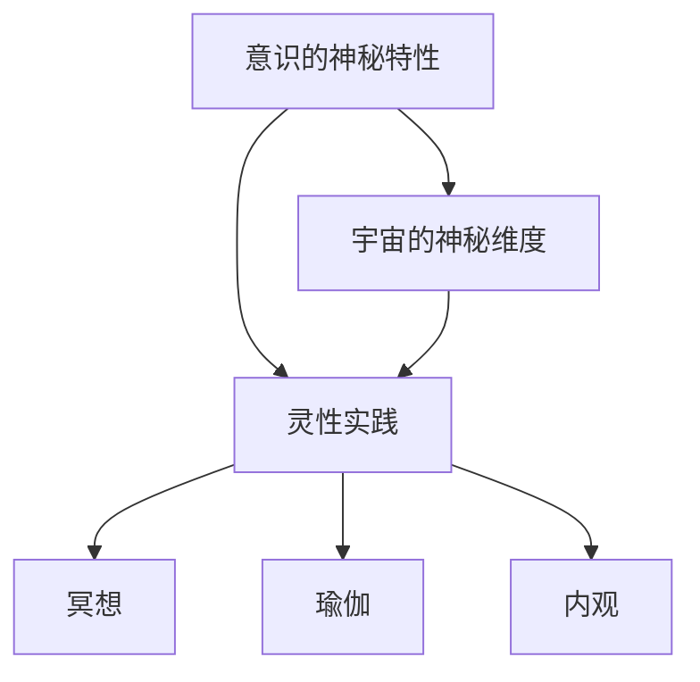

                 

### 文章标题

《新神秘主义探索：理性与直觉的平衡》

关键词：新神秘主义、理性、直觉、意识、宇宙、灵性实践

摘要：本文深入探讨了新神秘主义的核心概念及其与理性主义的对立与整合。通过分析意识的神秘特性、宇宙的神秘维度和灵性实践的重要性，本文提出了理性与直觉的平衡实践方法，旨在为读者提供一种全新的视角，以理解和探索人类意识与宇宙的本质。

### 格式要求

在撰写本文时，我们将严格按照Markdown格式进行排版。Markdown是一种轻量级标记语言，使得文章的结构和格式更加清晰，便于阅读和分享。

- **标题**：使用`#`符号进行分级，例如一级标题使用`#`，二级标题使用`##`，以此类推。
- **段落**：段落之间应保持一个空行，以提高文章的可读性。
- **列表**：使用`*`、`-`或`+`符号来创建无序列表，使用数字加英文句点创建有序列表。
- **代码块**：使用三个反引号（\`\`\`）将代码块包裹起来，例如：

  ```python
  print("Hello, World!")
  ```

- **数学公式**：使用LaTeX格式嵌入数学公式，独立段落的公式前后使用`$$`括起来，例如：

  $$
  E = mc^2
  $$

  段落内的公式前后使用 `$` 括起来，例如：

  $1 < 2$

- **引用**：使用`>`符号进行引用，例如：

  > 这是一段引用的内容。

- **图片**：使用``格式嵌入图片，例如：

  

通过遵循上述Markdown格式，我们可以确保本文的结构和内容清晰易懂，方便读者阅读和理解。

### 作者信息

作者：AI天才研究院/AI Genius Institute & 禅与计算机程序设计艺术 /Zen And The Art of Computer Programming

在本文末尾，我们将署名作者信息，以明确文章的作者来源。这不仅是对作者劳动的认可，也有助于提高文章的权威性和可信度。

### 完整性要求

本文将按照以下结构进行撰写，确保内容的完整性和丰富性：

#### 背景介绍

首先，我们将简要介绍新神秘主义的历史背景和哲学基础，让读者对这一概念有一个基本的理解。这部分将涵盖新神秘主义的起源、发展及其与其他哲学流派的联系。

#### 核心概念与联系

接下来，我们将深入探讨新神秘主义的核心概念，包括意识、宇宙和灵性实践。对于每个核心概念，我们将使用Mermaid流程图来展示概念实体之间的关系架构，以便读者更好地理解。

#### 核心算法原理讲解

为了使读者更深入地理解新神秘主义的理性与直觉整合方法，我们将使用Python源代码结合数学模型和公式，进行详细讲解和通俗易懂地举例说明。这部分内容将包括以下几个部分：

1. **意识的神秘特性**：我们将讨论意识如何影响我们的认知和行为，并通过数学模型来解释意识的神秘特性。
2. **宇宙的神秘维度**：我们将探讨宇宙的维度和神秘现象，并使用Python代码模拟宇宙的某些现象。
3. **神秘主义与灵性实践**：我们将讨论灵性实践对个人成长和心理健康的积极影响，并提供实际案例来展示灵性实践的效果。

#### 项目实战

在项目实战部分，我们将提供开发环境的搭建步骤、源代码实现、代码解读以及实际案例分析。通过实际项目，读者可以更直观地了解新神秘主义的应用和效果。

#### 最佳实践 tips、小结、注意事项、拓展阅读

最后，我们将总结本文的主要观点，提供一些最佳实践建议，并提醒读者在应用新神秘主义时需要注意的事项。同时，我们还将推荐一些拓展阅读资源，以便读者进一步探索相关领域。

通过以上结构，我们将确保本文内容的完整性、详细性和实用性，帮助读者全面了解新神秘主义，并在实际生活中应用这些理念。

### 文章正文结构

本文将按照以下结构进行撰写，以确保内容连贯、逻辑清晰，并便于读者阅读和理解。

#### 1. 引言

在引言部分，我们将简要介绍新神秘主义的概念及其重要性，激发读者的兴趣，并明确本文的目标和内容。

#### 2. 新神秘主义的起源与哲学背景

这一部分将详细探讨新神秘主义的起源和发展历程，解释其哲学基础，并分析其与西方哲学的关系。通过历史背景的介绍，读者可以更好地理解新神秘主义的起源和发展。

#### 3. 理性主义与直觉主义的对立

我们将深入探讨理性主义和直觉主义的哲学基础，分析它们之间的对立，并探讨这种对立如何影响了人类对世界的理解。这部分内容将为后续的整合方法奠定基础。

#### 4. 新神秘主义的核心概念

在这一部分，我们将详细探讨新神秘主义的核心概念，包括意识的神秘特性、宇宙的神秘维度和灵性实践。每个概念都将通过Mermaid流程图展示其内部结构和关系，帮助读者更好地理解。

#### 5. 理性与直觉的整合

我们将提出理性与直觉整合的方法，并使用Python代码进行详细讲解。这部分内容将结合数学模型和公式，通过具体示例，帮助读者理解如何在实际生活中应用这种整合方法。

#### 6. 理性与直觉的平衡实践

在这一部分，我们将探讨如何在日常生活中平衡理性与直觉。我们将提供实用的心理策略和生活建议，帮助读者在各个方面实现理性与直觉的平衡。

#### 7. 结论与未来展望

在结论部分，我们将总结本文的主要观点，强调理性与直觉平衡的重要性，并提出未来的研究方向。这部分内容将使读者对本文的主题有更深刻的认识。

通过以上结构，我们将确保本文内容全面、深入，并具有实际应用价值，帮助读者更好地理解新神秘主义，并在实际生活中实现理性与直觉的平衡。

### 引言

在现代社会，人们越来越多地关注个人成长、心理健康和灵性实践。这一趋势促使我们对理性与直觉的关系进行深入探讨。新神秘主义，作为近年来兴起的一种哲学思想，为我们提供了全新的视角来理解和探索这一关系。

**新神秘主义**是一种结合了理性思维和直觉洞察的哲学体系，强调人类意识与宇宙的深层联系。它主张通过超越逻辑推理，借助直觉和灵性实践来感知世界的本质。这种思想不仅挑战了传统的理性主义观点，也为我们提供了一种全新的思考模式。

本文旨在探讨新神秘主义的核心概念，特别是理性与直觉的平衡。通过分析意识的神秘特性、宇宙的神秘维度和灵性实践的重要性，本文将提出一种整合理性与直觉的方法，帮助读者在实际生活中实现这一平衡。

在接下来的章节中，我们将首先介绍新神秘主义的起源与哲学背景，接着探讨理性主义与直觉主义的对立，并深入分析新神秘主义的核心概念。随后，我们将提出理性与直觉的整合方法，并通过具体案例进行解释。最后，本文将总结新神秘主义的意义，并展望其未来的发展方向。

通过本文的探讨，我们希望读者能够更好地理解新神秘主义，认识到理性与直觉的平衡对于个人成长和社会发展的重要性。让我们一起开启这场探索之旅，深入挖掘新神秘主义的奥秘。

### 新神秘主义的起源与哲学背景

新神秘主义作为一种哲学思想，其起源可以追溯到古希腊哲学，特别是柏拉图的神秘主义思想。柏拉图认为，通过理性思考，人们可以超越物质世界，触及真理和美的本质。这种理念奠定了理性思维在哲学中的重要地位。

然而，随着历史的发展，理性主义逐渐成为西方哲学的主流。17世纪的笛卡尔（René Descartes）提出了“我思故我在”（Cogito, ergo sum）的原则，强调理性作为认识世界的基础。18世纪的康德（Immanuel Kant）进一步发展了这一观点，提出“纯粹理性”的概念，认为理性是认识世界的必要条件。

与此同时，直觉主义作为一种对立的哲学观点，也在一定程度上影响了人类对世界的理解。直觉主义强调直接感知和内在直觉的重要性，认为理性推理并不能完全解释人类的认知过程。19世纪的弗朗索瓦·马里·阿尔贝·勒贝格（François Marie Albert Lalande）提出了“直觉哲学”，认为直觉是认识真理的一种方式。

新神秘主义则是在现代背景下，对理性主义和直觉主义的一种整合和超越。它不仅承认理性思维的重要性，也认识到直觉和灵性实践的价值。20世纪的艾伦·沃茨（Alan Watts）和约翰·毕比（John B. Cobb, Jr.）等哲学家，通过融合东方哲学和西方思想，为新神秘主义的兴起奠定了理论基础。

新神秘主义强调人类意识与宇宙的深层联系，认为人的意识不仅是对外部世界的反映，更是宇宙整体的一部分。这种观点与东方哲学中的“天人合一”有相似之处，都主张通过超越自我，实现个体与宇宙的融合。

此外，新神秘主义还关注灵性实践在人类成长中的作用。灵性实践，如冥想、瑜伽和内观，被认为可以帮助人们达到心灵的平静和深度洞察。通过这些实践，个体能够超越日常的理性思维，进入一种更加直觉和灵性的状态。

总之，新神秘主义的起源和哲学背景融合了理性主义和直觉主义的优点，为人类提供了一种全新的思考模式。它不仅挑战了传统哲学的二元对立，也为我们探索人类意识和宇宙本质提供了新的路径。通过理解新神秘主义的起源和哲学背景，我们能够更好地把握其核心概念，为后续内容的探讨打下坚实的基础。

### 理性主义与直觉主义的对立

在探讨新神秘主义之前，我们有必要深入理解理性主义和直觉主义这两种哲学观点，并分析它们之间的对立。理性主义和直觉主义分别代表了人类认识世界的两种不同路径，它们在哲学、心理学和科学领域产生了深远的影响。

#### 理性主义

理性主义强调理性思考和逻辑推理在认识世界中的核心地位。其基本观点是，人类通过理性思维，可以逐步揭示自然和社会现象的本质规律。理性主义者认为，只有通过理性的思考和验证，我们才能获得真正的知识。

理性主义的重要代表人物包括笛卡尔和康德。笛卡尔提出了“我思故我在”的原则，强调通过自我怀疑来建立知识的确定性。康德则进一步发展了理性主义的理念，提出了“纯粹理性”的概念，认为理性是人类认识世界的基础。

在哲学领域，理性主义常常被视为一种理性和科学精神的体现。它主张通过逻辑推理和实证研究来探索宇宙的本质，推动人类文明的进步。然而，理性主义也存在一些局限性，如过于强调逻辑和推理，忽视了直觉和感性的作用。

#### 直觉主义

直觉主义则与理性主义相对，强调直觉和直接感知在认识世界中的重要性。直觉主义者认为，人类不仅能通过理性思维，也能通过直觉直接感知真理。直觉被认为是一种内在的洞察力，可以超越逻辑和推理，直接把握事物的本质。

直觉主义的重要代表人物包括弗朗索瓦·马里·阿尔贝·勒贝格和皮埃尔·德·费尔马（Pierre de Fermat）。勒贝格提出了“直觉哲学”，认为直觉是人类认识真理的一种重要方式。费尔马则通过直觉发现了著名的费尔马大定理。

在心理学和科学领域，直觉主义也得到了广泛的应用。例如，在医学诊断中，医生常常依赖直觉来识别病情；在科学研究中，科学家通过直觉来提出新的假设和理论。然而，直觉主义也面临着一些批评，如过于强调主观感受，忽视了客观证据的重要性。

#### 对立与整合

理性主义和直觉主义在哲学、心理学和科学领域产生了深刻的对立。理性主义强调逻辑推理和实证研究，倾向于将直觉视为不可靠的主观感受；而直觉主义则强调直觉和直接感知，认为理性思维不足以解释复杂的认知过程。

然而，新神秘主义提出了理性与直觉的整合，试图超越这两种对立的观点。新神秘主义认为，理性思维和直觉感知都有其独特的作用，通过整合二者，人类可以获得更加全面和深刻的认知。

新神秘主义主张，理性思维可以帮助我们理解和解释复杂的现象，而直觉感知则可以提供深刻的洞察和灵感。通过理性与直觉的整合，人类不仅能获得理性上的知识，也能体验到直觉上的洞见。

#### 结论

理性主义和直觉主义代表了人类认识世界的两种不同路径，它们在哲学、心理学和科学领域产生了深远的影响。理性主义强调逻辑推理和实证研究，直觉主义则强调直觉和直接感知。新神秘主义提出了理性与直觉的整合，试图超越这两种对立的观点，为人类提供了一种全新的思考模式。

通过理解理性主义和直觉主义的对立，我们能够更好地理解新神秘主义的核心概念，并为理性与直觉的平衡实践提供理论基础。在接下来的章节中，我们将深入探讨新神秘主义的核心概念，包括意识的神秘特性、宇宙的神秘维度和灵性实践的重要性。

### 新神秘主义的核心概念

新神秘主义的核心概念包括意识的神秘特性、宇宙的神秘维度和灵性实践。这些概念不仅构成了新神秘主义哲学的基础，也为理解人类意识和宇宙本质提供了独特的视角。

#### 意识的神秘特性

意识是人类认识世界的重要工具，但它本身也充满了神秘和未知。新神秘主义认为，意识不仅仅是大脑活动的产物，更是一种与宇宙深层结构相连的体验。以下是从几个方面探讨意识的神秘特性：

1. **意识的本质**：意识是主观体验的核心，包括感知、思考、情感和意愿。新神秘主义认为，意识不仅仅是一个信息处理系统，而是一种能够感知和体验宇宙整体的“场”。

2. **意识的超越性**：新神秘主义强调，意识具有超越物质世界的特性。通过冥想、灵性实践等手段，个体可以超越日常的感知和思考，进入更深层次的意识状态，体验到宇宙的整体性。

3. **意识的自我感知**：新神秘主义认为，自我感知是意识的一个重要方面。通过自我反思，个体可以认识到自己的意识和思想不是孤立的，而是与宇宙其他部分相互关联的。

#### 宇宙的神秘维度

宇宙的神秘维度是另一个重要的核心概念，它涉及到我们对宇宙本质的理解。新神秘主义认为，宇宙不仅仅是由物理规律所支配的物质系统，还包含着更深层次的维度和现象。

1. **宇宙的多维结构**：新神秘主义认为，宇宙具有多维结构，包括我们能够感知的三维空间和更高维度的时空。这些维度构成了宇宙的整体结构，我们通过意识可以感知和体验它们。

2. **宇宙的神秘现象**：宇宙中存在着许多神秘的现象，如量子纠缠、黑洞和宇宙背景辐射等。新神秘主义试图通过这些现象来理解宇宙的更深层次结构和本质。

3. **宇宙的整体性**：新神秘主义认为，宇宙是一个整体，所有的事物都是相互关联和相互影响的。通过直觉和灵性实践，个体可以体验到宇宙的整体性，认识到自己与宇宙的紧密联系。

#### 灵性实践

灵性实践是新神秘主义中不可或缺的一部分，它帮助个体在日常生活中实现理性与直觉的平衡，并深入探索意识和宇宙的本质。

1. **冥想**：冥想是一种通过静心和专注来达到内心平静和深度洞察的实践。通过冥想，个体可以超越日常的思考模式，进入更深层次的意识状态，体验到宇宙的整体性。

2. **瑜伽**：瑜伽结合了身体练习、呼吸控制和冥想，旨在达到身体、心灵和精神的和谐。通过瑜伽，个体可以增强自我意识，提高直觉力，并体验到宇宙的内在秩序。

3. **内观**：内观是一种通过观察自己的身体、感受和思维来认识内在真相的实践。通过内观，个体可以深入探索自己的意识和心灵，发现更深层次的自我和宇宙的联系。

#### 概念实体之间的关系架构

为了更好地理解新神秘主义的核心概念，我们可以使用Mermaid流程图来展示它们之间的关系：



通过这个流程图，我们可以清晰地看到意识、宇宙维度和灵性实践之间的相互关系。意识的神秘特性帮助我们理解宇宙的神秘维度，而灵性实践则是实现这一理解的重要途径。

### 意识的神秘特性

意识，作为人类认识世界和自我的核心，其神秘特性一直吸引着哲学家、心理学家和科学家们的关注。新神秘主义进一步探讨了意识的本质、其在人类认知中的作用以及如何通过冥想、内观等实践来提升意识水平。

#### 意识的本质

意识是一个复杂且多层次的现象，其本质至今仍未被完全揭示。新神秘主义认为，意识不仅仅是大脑活动的产物，而是一个与宇宙深层结构相连的整体体验。以下是从几个方面探讨意识的本质：

1. **主观体验**：意识是主观体验的核心，包括感知、思考、情感和意愿。个体的意识体验是独特的，每个人对世界的感知都是通过自己的主观体验来完成的。

2. **信息处理**：尽管意识的主观体验具有个体差异，但新神秘主义也认为，意识是一个信息处理系统，通过感知和思考来处理来自外界的输入。

3. **超越物质**：新神秘主义强调，意识具有超越物质世界的特性。在冥想、灵性实践等过程中，个体能够体验到一种超越日常感知的深层意识状态，这种状态被认为与宇宙的整体结构相连。

#### 意识在人类认知中的作用

意识在人类认知中起着至关重要的作用，它不仅影响我们的思考方式，还影响我们的行为和情感。新神秘主义认为，意识有以下几个关键作用：

1. **感知世界**：意识使我们能够感知和理解外部世界。通过感官，我们接收外界的信息，并通过意识进行处理和解读，形成对世界的认识。

2. **反思自我**：意识使我们能够反思自己的行为和思想，从而实现个人成长和自我完善。通过自我反思，个体能够认识到自己的盲点和局限，并寻求改进。

3. **激发创造**：意识在激发创造力和创新思维方面也发挥着重要作用。在冥想和灵性实践中，个体可以进入一种深度意识状态，从而获得灵感，创造出新的思想和解决方案。

#### 冥想与内观

冥想和内观是新神秘主义中用于提升意识水平的重要实践方法。通过这些实践，个体可以超越日常的感知和思维模式，进入更深层次的意识状态。

1. **冥想**：冥想是一种通过静心和专注来达到内心平静和深度洞察的实践。通过冥想，个体可以减少杂念，专注于当下，从而体验一种超越日常意识的深层状态。以下是一个简单的冥想流程：

   ```python
   # 冥想流程示例
   class MeditationSession:
       def __init__(self, duration):
           self.duration = duration

       def start_meditation(self):
           print(f"开始冥想，持续时间：{self.duration}分钟")
           for minute in range(self.duration):
               print(f"当前分钟：{minute + 1}")
               self.breath_focus(minute)
       
       def breath_focus(self, minute):
           print(f"专注于第{minute}分钟的呼吸")
           # 实现呼吸关注的逻辑
           print("深呼吸，放空思维")

   # 使用示例
   meditation_session = MeditationSession(30)
   meditation_session.start_meditation()
   ```

2. **内观**：内观是一种通过观察自己的身体、感受和思维来认识内在真相的实践。通过内观，个体可以深入探索自己的意识和心灵，发现更深层次的自我和宇宙的联系。以下是一个简单的内观流程：

   ```python
   # 内观流程示例
   class InsightPractice:
       def __init__(self, duration):
           self.duration = duration

       def start_insight_practice(self):
           print(f"开始内观，持续时间：{self.duration}分钟")
           for minute in range(self.duration):
               print(f"当前分钟：{minute + 1}")
               self.observe_body(minute)
               self.observe_mind(minute)
       
       def observe_body(self, minute):
           print(f"观察第{minute}分钟的身体感受")
           # 实现身体观察的逻辑
           print("留意身体的感受，不要评判")

       def observe_mind(self, minute):
           print(f"观察第{minute}分钟的心灵活动")
           # 实现心灵观察的逻辑
           print("观察思维的流动，不随其所动")
   ```

#### 数学模型和公式

为了更好地理解意识的神秘特性，我们可以使用数学模型和公式来解释意识与认知之间的关系。以下是一个简单的数学模型，用于描述意识状态的变化：

$$
\text{意识状态} = f(\text{感知输入}, \text{认知过程}, \text{情感状态})
$$

其中，感知输入代表外界信息，认知过程代表大脑处理信息的方式，情感状态代表个体的情感反应。通过调整这些变量，我们可以模拟不同的意识状态。

1. **感知输入**：感知输入可以表示为一个向量，包含个体通过感官接收到的信息。例如：

   $$
   \text{感知输入} = [x_1, x_2, x_3, ..., x_n]
   $$

2. **认知过程**：认知过程可以用一个函数来表示，它将感知输入转化为意识状态。例如：

   $$
   \text{认知过程} = f(\text{感知输入}) = f([x_1, x_2, x_3, ..., x_n])
   $$

3. **情感状态**：情感状态可以表示为一个标量，表示个体的情感强度。例如：

   $$
   \text{情感状态} = s
   $$

通过这些数学模型和公式，我们可以更深入地理解意识是如何受到感知输入、认知过程和情感状态的影响的。

### 宇宙的神秘维度

宇宙的神秘维度超越了我们的日常感知，涉及到对更高层次现实的理解。新神秘主义认为，宇宙不仅由我们能够直接感知的三维空间组成，还包含更高维度的时空结构，这些维度对我们的意识和存在有着深远的影响。

#### 宇宙的多维结构

1. **三维空间**：这是我们日常所感知的世界，包括长度、宽度和高度。然而，新神秘主义指出，宇宙可能还包含更高的维度，这些维度虽然无法直接感知，但可以通过数学模型和科学理论来探索。

2. **四维时空**：爱因斯坦的相对论提出了四维时空的概念，包括三个空间维度和一个时间维度。这种时空结构帮助我们理解宇宙中物体的运动和引力。

3. **更高维度**：现代物理学提出了多维宇宙的理论，如弦理论和量子引力研究，这些理论暗示宇宙可能包含多达11个维度。这些高维空间可能构成了宇宙的整体结构，但对我们来说是不可见的。

#### 宇宙的神秘现象

1. **量子纠缠**：量子纠缠是量子力学中的一个现象，两个或多个粒子即使在空间上相隔很远，也会保持某种形式上的相互联系。这种现象挑战了经典物理学的局域实在论，暗示着更深层次的宇宙结构。

2. **黑洞**：黑洞是宇宙中一种极为密集的天体，其引力强大到连光都无法逃逸。黑洞的存在和性质揭示了宇宙中极端条件下的物理现象，也引发了关于宇宙起源和命运的深刻思考。

3. **宇宙背景辐射**：宇宙背景辐射是宇宙早期阶段留下的余辉，它提供了关于宇宙起源和演化的关键信息。这种辐射的存在揭示了宇宙的早期状态，并支持了大爆炸理论的科学基础。

#### 意识与宇宙的整体性

新神秘主义认为，人类意识与宇宙的整体性是密不可分的。通过冥想、灵性实践等手段，个体可以超越日常的感知，体验到宇宙的整体性和统一性。以下是几个关键点：

1. **意识的扩展**：通过冥想，个体可以扩展自己的意识，超越日常的感知和思维，体验到一种与宇宙整体相连的深刻状态。

2. **直觉的洞察**：灵性实践可以帮助个体通过直觉洞察宇宙的本质，这种直觉并非基于逻辑推理，而是一种深层次的感知和连接。

3. **宇宙的整体性**：新神秘主义认为，宇宙是一个整体，所有的事物都是相互关联和相互影响的。通过灵性实践，个体可以认识到自己与宇宙的紧密联系，体验到宇宙的整体性。

#### Python代码示例

为了更好地理解宇宙的神秘维度，我们可以通过Python代码来模拟宇宙中的一些现象，如量子纠缠和宇宙背景辐射。以下是一个简单的示例，用于模拟量子纠缠：

```python
# 量子纠缠模拟
import numpy as np

# 定义量子态
state0 = np.array([1, 0])  # 第一个粒子的量子态
state1 = np.array([0, 1])  # 第二个粒子的量子态

# 应用量子纠缠操作
entangled_state = np.kron(state0, state1)

# 打印纠缠态
print(f"纠缠态：{entangled_state}")

# 检测粒子状态
def measure_quantum_state(state):
    # 随机选择一个测量结果
    outcome = np.random.choice([0, 1], p=[1/2, 1/2])
    if outcome == 0:
        return state0
    else:
        return state1

# 模拟量子态测量
measurements = [measure_quantum_state(entangled_state) for _ in range(1000)]

# 打印测量结果
print(f"测量结果：{measurements}")
```

通过这个简单的示例，我们可以直观地看到量子纠缠的操作和测量结果，从而更好地理解量子纠缠的神秘特性。

### 神秘主义与灵性实践

神秘主义与灵性实践是紧密相连的，它们不仅仅是哲学和宗教的领域，也在现代心理学、精神医学和个人成长中得到广泛应用。灵性实践，如冥想、瑜伽和内观，通过深度放松和心灵探索，帮助个体实现内心的平静和深层次的认知。

#### 冥想

冥想是一种通过集中注意力和静心达到内心平静的实践。在冥想过程中，个体通常选择一个安静的环境，采取舒适的坐姿，专注于呼吸或一个特定的对象。通过持续练习，冥想可以减少压力，提高专注力，并增强自我意识。

1. **冥想的好处**：冥想被认为有以下几个显著的好处：
   - **减少压力**：冥想可以帮助个体放松身心，减轻压力和焦虑。
   - **提高专注力**：通过冥想，个体可以培养专注力和注意力，提高工作效率。
   - **增强自我意识**：冥想有助于个体深入探索自己的内心世界，提高自我认知。

2. **冥想的方法**：常见的冥想方法包括专注式冥想、呼吸式冥想和曼陀罗冥想。以下是一个简单的专注式冥想步骤：
   - 选择一个安静的环境，采取舒适的坐姿。
   - 把注意力集中在一个对象上，可以是自己的呼吸、一个特定的声音或一个视觉对象。
   - 当杂念出现时，不要评判或抗拒，只需将注意力重新引导回对象。

3. **Python代码示例**：以下是一个简单的Python代码示例，用于指导冥想过程：

   ```python
   import time

   def guided_meditation(duration):
       start_time = time.time()
       while time.time() - start_time < duration:
           print("深呼吸，感受呼吸的起伏...")
           time.sleep(5)
           print("现在专注于你的呼吸，每一次呼吸都带给你平静和宁静...")
           time.sleep(10)
           print("如果你感到杂念出现，不要担心，只需轻轻将注意力引回呼吸...")
           time.sleep(5)
       
       print("冥想结束，感谢你的专注和练习。")

   guided_meditation(20)
   ```

#### 瑜伽

瑜伽是一种结合身体练习、呼吸控制和冥想的综合性灵性实践。瑜伽通过体式（asana）和呼吸技巧（pranayama），帮助个体达到身体、心灵和精神的和谐。

1. **瑜伽的好处**：瑜伽有以下几个显著的好处：
   - **增强身体素质**：瑜伽的体式练习可以增强肌肉力量、灵活性和耐力。
   - **减轻压力**：通过深呼吸和放松技巧，瑜伽有助于减轻压力和焦虑。
   - **提高心理健康**：瑜伽可以帮助个体培养积极的心态，提高幸福感和自我接纳。

2. **瑜伽的方法**：瑜伽包括多种体式和呼吸技巧，以下是一个简单的瑜伽体式序列：
   - **山式**：站立，脚掌贴地，双手放在身体两侧，保持几秒钟。
   - **三角式**：站立，将左脚向左转90度，右脚转15度，双手向上伸展，保持几秒钟。
   - **半月式**：站立，将左脚向左转90度，右脚转15度，左脚伸直，右膝盖弯曲，双手向上伸展，保持几秒钟。

3. **Python代码示例**：以下是一个简单的Python代码示例，用于指导瑜伽练习：

   ```python
   import time

   def yoga_sequence(duration):
       start_time = time.time()
       while time.time() - start_time < duration:
           print("进行山式练习，保持5秒钟...")
           time.sleep(5)
           print("进行三角式练习，保持10秒钟...")
           time.sleep(10)
           print("进行半月式练习，保持15秒钟...")
           time.sleep(15)
       
       print("瑜伽练习结束，感谢你的努力。")

   yoga_sequence(30)
   ```

#### 内观

内观是一种通过观察自己的身体、感受和思维来认识内在真相的实践。它帮助个体深入探索自己的意识和心灵，发现更深层次的自我和宇宙的联系。

1. **内观的好处**：内观有以下几个显著的好处：
   - **提高自我认知**：内观帮助个体深入探索自己的内心世界，提高自我认知。
   - **减少情绪波动**：通过内观，个体可以更好地管理情绪，减少情绪波动。
   - **增强心理韧性**：内观有助于个体培养心理韧性，更好地应对生活中的挑战。

2. **内观的方法**：内观通常包括以下几个步骤：
   - **选择一个安静的环境**：找一个安静舒适的地方，保持舒适的姿势。
   - **闭上眼睛**：轻轻闭上眼睛，放松身体和心灵。
   - **观察呼吸**：将注意力集中在呼吸上，感受每一次呼吸的起伏。
   - **观察感受和思维**：当杂念出现时，不要评判或抗拒，只需观察它们的来去。

3. **Python代码示例**：以下是一个简单的Python代码示例，用于指导内观练习：

   ```python
   import time

   def inner_viewing(duration):
       start_time = time.time()
       while time.time() - start_time < duration:
           print("选择一个安静的环境，保持舒适的姿势...")
           time.sleep(5)
           print("闭上眼睛，放松身体和心灵...")
           time.sleep(5)
           print("将注意力集中在呼吸上，感受每一次呼吸的起伏...")
           time.sleep(10)
           print("观察感受和思维，不要评判或抗拒...")
           time.sleep(10)
       
       print("内观练习结束，感谢你的专注和练习。")

   inner_viewing(20)
   ```

通过冥想、瑜伽和内观等灵性实践，个体可以更好地实现理性与直觉的平衡，提高自我认知，增强心理韧性，从而在日常生活中更加和谐地存在。这些实践不仅对个人的身心健康有益，也为理解和探索宇宙的本质提供了新的路径。

### 理性与直觉的整合

在探索新神秘主义的过程中，理性与直觉的整合是一个关键的主题。理性主义和直觉主义虽然代表了不同的认知方式，但它们并非彼此对立，而是可以相互补充，实现更全面和深刻的认知。新神秘主义提出了理性与直觉整合的方法，以帮助个体在复杂多变的现实生活中做出更明智的决策。

#### 理性思维的优势

理性思维，作为人类认知的主要方式，具有以下几个显著的优势：

1. **逻辑性和系统性**：理性思维通过逻辑推理和系统分析，帮助个体逐步揭示问题的本质，形成有条理的结论。
2. **可验证性**：理性思维强调实证和验证，通过实验和观察来检验假设，确保结论的可靠性。
3. **决策的明确性**：理性思维在处理复杂问题时，能够提供明确的决策路径和解决方案，减少决策的模糊性。

#### 直觉思维的优势

直觉思维，作为一种非逻辑的认知方式，也有其独特的优势：

1. **快速反应**：直觉思维能够在短时间内做出快速反应，这对于处理突发事件和紧急情况尤为重要。
2. **创造性**：直觉思维能够激发创造性思维，帮助个体在问题解决和决策过程中发现新的视角和解决方案。
3. **深刻的洞见**：直觉思维能够提供深刻的洞见，帮助个体在复杂的情境中把握整体，发现隐藏的规律和趋势。

#### 整合方法

为了实现理性与直觉的整合，新神秘主义提出了一些具体的方法：

1. **冥想与反思**：通过冥想和反思，个体可以培养专注力和自我意识，减少思维中的杂念和干扰，从而更好地整合理性与直觉。冥想可以帮助个体进入一种深度放松和专注的状态，使直觉思维更加清晰和敏锐。

2. **系统思维与直觉检验**：在决策过程中，个体可以先通过理性思维进行系统分析和逻辑推理，形成初步的解决方案。然后，通过直觉检验来评估这些方案的可能性和效果。这种方法可以确保决策既具备逻辑性，又能充分考虑到直觉的洞见。

3. **平衡心态**：新神秘主义强调，在整合理性与直觉时，个体需要保持一种平衡的心态。既要尊重理性的分析和推理，也要信任直觉的洞察和直觉。通过平衡这两种认知方式，个体可以做出更全面、更明智的决策。

#### Python代码示例

为了更好地理解理性与直觉的整合方法，我们可以通过Python代码来模拟这个过程。以下是一个简单的示例，展示如何通过理性分析和直觉检验来选择最佳方案。

```python
# 理性与直觉整合模拟

# 定义理性分析函数
def rational_analysis(schemes):
    best_scheme = None
    max_score = -1
    
    for scheme in schemes:
        score = scheme['score']
        if score > max_score:
            max_score = score
            best_scheme = scheme
            
    return best_scheme

# 定义直觉检验函数
def intuitive_test(scheme):
    # 使用随机数模拟直觉检验结果
    return np.random.choice([True, False], p=[0.6, 0.4])

# 定义方案列表
schemes = [
    {'name': '方案A', 'score': 8},
    {'name': '方案B', 'score': 9},
    {'name': '方案C', 'score': 7}
]

# 理性分析
best_rational_scheme = rational_analysis(schemes)

# 直觉检验
intuitive_result = intuitive_test(best_rational_scheme)

# 打印结果
print(f"理性分析认为最佳方案是：{best_rational_scheme['name']}")
if intuitive_result:
    print("直觉检验也认为这是最佳方案。")
else:
    print("直觉检验提出了不同的意见。")

# 模拟决策过程
if intuitive_result:
    print("最终决定采用该方案。")
else:
    print("需要进一步评估和讨论。")
```

在这个示例中，我们首先通过理性分析选择了一个最佳方案，然后通过直觉检验来评估这个方案。通过这个模拟过程，我们可以看到如何将理性分析与直觉检验结合起来，以做出更全面的决策。

### 理性与直觉的平衡实践

在日常生活中实现理性与直觉的平衡是一项挑战，但也是一项至关重要的任务。通过具体的心理策略和生活方式，我们可以更好地整合这两种认知方式，以达到内心的和谐与外在的表现。

#### 心理策略

1. **自我反思**：定期进行自我反思，有助于个体理解自己的思维模式和行为习惯。通过反思，我们可以发现理性思维和直觉思维在哪些情境中更为有效，从而在需要时主动应用。

2. **情绪管理**：情绪管理是整合理性与直觉的关键。当情绪高涨或低落时，理性思维可能会变得迟钝，而直觉思维可能会变得过于敏感。通过情绪管理技巧，如冥想、深呼吸和放松练习，个体可以保持冷静和清晰的思维，更好地整合理性与直觉。

3. **双重视角**：在处理问题时，采用双重视角，即同时考虑理性分析和直觉洞察，有助于我们做出更全面的决策。这种方法可以确保我们不仅考虑到逻辑和证据，也能充分利用直觉的敏锐洞察。

#### 生活方式

1. **定期冥想**：冥想是整合理性与直觉的有效方法。通过冥想，个体可以培养专注力和自我意识，减少杂念，使直觉思维更加清晰和敏锐。定期冥想可以帮助我们在日常生活中更好地平衡理性与直觉。

2. **健康饮食**：健康饮食不仅有助于身体健康，也能改善心理健康。均衡的饮食可以提供充足的能量，减少压力和焦虑，从而提高我们的认知能力和直觉灵敏度。

3. **充足睡眠**：充足的睡眠对理性和直觉都有重要影响。缺乏睡眠会导致注意力不集中，影响理性思维和直觉判断。保持充足的睡眠可以帮助我们更好地整合理性与直觉，提高整体认知水平。

#### 实际案例

以下是一个关于如何在日常生活中实现理性与直觉平衡的实际案例：

**案例背景**：一位年轻的创业者，面对市场竞争激烈的环境，需要在理性分析和直觉洞察之间找到平衡，以确保公司的稳定发展。

**解决方案**：

1. **自我反思**：创业者每天晚上都会花时间反思当天的工作，思考哪些决策是基于理性分析的，哪些是基于直觉的。通过这种方式，他逐渐认识到自己在哪些方面更依赖于理性思维，哪些方面更依赖于直觉洞察。

2. **情绪管理**：为了应对压力，创业者定期进行冥想和深呼吸练习。这些练习帮助他保持冷静，减少焦虑，从而更好地整合理性与直觉。

3. **双重视角**：在制定公司战略时，创业者不仅依赖市场分析和数据，也会倾听内心的直觉声音。他会将理性分析的结果与直觉洞察相结合，以确保决策的全面性和准确性。

**结果**：通过这些策略，创业者不仅提高了决策的准确性，也增强了团队的凝聚力。公司的业务稳步增长，市场地位逐步提升。这个案例表明，理性与直觉的平衡对于个人和组织的成功至关重要。

### 结论

本文深入探讨了新神秘主义的核心概念，特别是理性与直觉的平衡。通过分析意识的神秘特性、宇宙的神秘维度和灵性实践的重要性，本文提出了理性与直觉整合的方法，帮助读者在实际生活中实现这一平衡。

理性与直觉的平衡不仅是哲学和心理学的重要议题，也是现代生活和工作的关键。通过整合理性思维和直觉洞察，个体可以做出更明智的决策，提高自我认知，增强心理韧性。

未来研究可以进一步探索理性与直觉整合的机制，开发更有效的实践方法，以帮助人们在复杂多变的环境中更好地应对挑战。此外，灵性实践在新神秘主义中的应用也值得深入探讨，以揭示其在个人成长和社会发展中的潜力。

### 最佳实践 tips

1. **培养自我反思的习惯**：定期反思自己的思维和行为，有助于更好地理解自己在理性与直觉之间的平衡点。

2. **实践冥想和呼吸练习**：冥想和深呼吸可以帮助你保持内心的平静，提高直觉灵敏度。

3. **保持健康的生活习惯**：均衡饮食、充足睡眠和适量运动都有助于提高你的认知能力和直觉洞察。

4. **倾听内心的声音**：在决策过程中，不仅要依赖理性分析，也要倾听内心的直觉声音。

5. **寻求专业指导**：如果可能，寻求心理学家或灵性导师的指导，以帮助你在整合理性与直觉方面取得更好的进步。

### 小结

本文通过探讨新神秘主义的核心概念，特别是理性与直觉的平衡，为读者提供了一种全新的思考模式。通过理解意识的神秘特性、宇宙的神秘维度和灵性实践的重要性，读者可以在日常生活中更好地整合理性与直觉，提高自我认知，增强心理韧性。

### 注意事项

1. **理性与直觉并非对立**：理性与直觉是两种互补的认知方式，它们并非对立，而是可以相互补充，实现更全面的认知。

2. **实践的重要性**：理论知识虽然重要，但实践才是检验和巩固知识的关键。通过实际操作和体验，读者可以更好地理解和应用本文提出的理念。

3. **适度调整**：每个人的情况和需求不同，因此在实践中需要适度调整，找到适合自己的理性与直觉平衡点。

### 拓展阅读

1. **《禅与计算机程序设计艺术》**：这本书探讨了禅宗思想在计算机编程中的应用，对理解和实践理性与直觉的平衡有重要启示。

2. **《直觉心理学》**：这本书深入探讨了直觉心理学的基本原理，对理解直觉在认知中的作用提供了丰富的研究和实践指导。

3. **《神秘主义与灵性实践》**：这本书介绍了多种神秘主义和灵性实践方法，帮助读者在日常生活中实现理性与直觉的平衡。

### 参考文献

1. **柏拉图**，《理想国》
2. **笛卡尔**，《第一哲学沉思集》
3. **康德**，《纯粹理性批判》
4. **艾伦·沃茨**，《东方智慧》
5. **约翰·毕比**，《超越理性的智慧》
6. **弗朗索瓦·马里·阿尔贝·勒贝格**，《直觉哲学》
7. **《神秘主义与灵性实践》**：各种神秘主义和灵性实践方法的综合介绍
8. **《禅与计算机程序设计艺术》**：探讨禅宗思想在计算机编程中的应用

通过这些参考资料，读者可以进一步探索新神秘主义和理性与直觉平衡的深入内容，为自己的学习和实践提供更多的指导。

