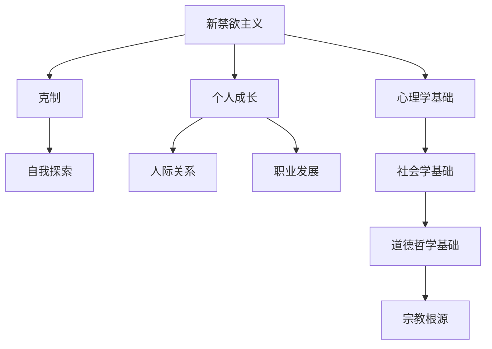

                 

# 《新禁欲主义实验：克制中的自我探索》

## 关键词
- 新禁欲主义
- 自我探索
- 克制
- 个人成长
- 社会学
- 心理学
- 道德哲学

## 摘要
本文探讨了新禁欲主义的概念、理论基础及其在现代社会的应用。通过详细分析禁欲实践的方法、挑战与解决方案，本文揭示了禁欲对个人成长、人际关系和职业发展的影响。此外，本文还探讨了禁欲主义下的生活艺术及其对人生观和价值观的塑造，并对禁欲主义的未来趋势和意义进行了展望。

## 目录大纲

### 第一部分：新禁欲主义概述

#### 第1章：新禁欲主义的概念与历史

- 1.1 新禁欲主义的定义
- 1.2 新禁欲主义的历史背景
- 1.3 新禁欲主义的价值观
- 1.4 新禁欲主义与传统禁欲主义的区别

#### 第2章：新禁欲主义的理论基础

- 2.1 心理学基础
- 2.2 社会学基础
- 2.3 道德哲学基础
- 2.4 新禁欲主义的宗教根源

#### 第3章：新禁欲主义在现代社会的应用

- 3.1 新禁欲主义与个人成长
- 3.2 新禁欲主义与人际关系
- 3.3 新禁欲主义与职业发展

### 第二部分：禁欲实践

#### 第4章：禁欲的自我探索

- 4.1 禁欲的心理准备
- 4.2 禁欲的生理影响
- 4.3 禁欲的社交影响

#### 第5章：禁欲实践的方法

- 5.1 禁欲的饮食控制
- 5.2 禁欲的锻炼计划
- 5.3 禁欲的心理调适

#### 第6章：禁欲实践中的挑战与解决方案

- 6.1 禁欲中的欲望管理
- 6.2 禁欲中的社交冲突
- 6.3 禁欲中的个人成长

### 第三部分：禁欲与人生哲学

#### 第7章：禁欲与人生观

- 7.1 禁欲主义与幸福观
- 7.2 禁欲主义与成功观
- 7.3 禁欲主义与价值观

#### 第8章：禁欲主义下的生活艺术

- 8.1 禁欲与艺术创作
- 8.2 禁欲与文学创作
- 8.3 禁欲与生活品质提升

### 第四部分：禁欲主义的未来展望

#### 第9章：禁欲主义的发展趋势

- 9.1 禁欲主义的未来前景
- 9.2 禁欲主义与社会变迁
- 9.3 禁欲主义与未来科技

#### 第10章：禁欲主义的意义与影响

- 10.1 禁欲主义对个人生活的意义
- 10.2 禁欲主义对社会的意义
- 10.3 禁欲主义对文化的意义

### 附录：禁欲主义相关资源与资料

- 附录1：禁欲主义相关书籍推荐
- 附录2：禁欲主义相关研究论文
- 附录3：禁欲主义实践指南
- 附录4：禁欲主义常见问题解答
- 附录5：禁欲主义实践者访谈录

### 核心概念与联系架构



### 核心算法原理讲解

```python
# 伪代码：禁欲的自我评估算法

def self_evaluation():
    # 初始化变量
    physical_health = 0
    mental_health = 0
    social_health = 0
    
    # 评估身体状态
    if is_fit():
        physical_health += 1
    else:
        physical_health -= 1

    # 评估心理状态
    if is_satisfied():
        mental_health += 1
    else:
        mental_health -= 1

    # 评估社交状态
    if has_sufficient_social_connection():
        social_health += 1
    else:
        social_health -= 1

    # 计算总分
    total_health = physical_health + mental_health + social_health
    
    # 打印结果
    print(f"自我评估总分：{total_health}")
    
# 辅助函数
def is_fit():
    # 伪代码：判断身体状况是否良好
    pass

def is_satisfied():
    # 伪代码：判断心理状态是否满意
    pass

def has_sufficient_social_connection():
    # 伪代码：判断社交状态是否充足
    pass
```

### 数学模型和数学公式

```latex
% 伪代码：禁欲带来的心理幸福感公式

\begin{equation}
Happiness = \frac{Physical\ Health + Mental\ Health + Social\ Health}{3}
\end{equation}
```

### 第一部分：新禁欲主义概述

#### 第1章：新禁欲主义的概念与历史

新禁欲主义是一个现代哲学概念，它强调个人在社会生活中的克制和自我控制，旨在通过减少欲望和冲动，实现个人成长和幸福感。这一概念并非凭空出现，而是有着深厚的文化、历史和哲学背景。

1.1 新禁欲主义的定义

新禁欲主义（Neo-Puritanism）是20世纪初由西方思想家所提出的一种哲学观念。它主张个体应该通过克制和自我控制，减少欲望的驱使，从而获得内心的平静和自我实现。新禁欲主义不同于传统的禁欲主义，它不仅仅关注于减少肉体的欲望，更强调对精神层面的追求。

1.2 新禁欲主义的历史背景

新禁欲主义的历史可以追溯到西方的启蒙时期。18世纪的启蒙思想家如卢梭和伏尔泰，他们提倡理性和自由，反对封建专制和宗教束缚。然而，随着工业革命的到来，社会风气日益浮躁，人们开始追求物质享受和感官刺激，导致精神空虚和道德沦丧。在这种背景下，新禁欲主义应运而生，旨在通过道德自律和精神修养，挽救社会的道德危机。

1.3 新禁欲主义的价值观

新禁欲主义的价值观主要包括以下几个方面：

- **克制与自我控制**：个体应该通过克制欲望，实现内心的平静和自我控制。
- **道德自律**：个体应该遵守社会道德规范，追求道德上的完美。
- **精神追求**：个体应该注重精神层面的成长，追求内心的满足和幸福感。
- **社会责任**：个体应该承担社会责任，为社会和谐与进步做出贡献。

1.4 新禁欲主义与传统禁欲主义的区别

新禁欲主义与传统禁欲主义在几个关键方面存在显著差异：

- **目标不同**：传统禁欲主义强调减少肉体的欲望，以达到精神上的纯净。而新禁欲主义则强调通过克制欲望，实现个人成长和幸福感。
- **方法不同**：传统禁欲主义往往依赖于宗教信仰和道德教条，而新禁欲主义则更注重个人内心的探索和自我认知。
- **价值观不同**：传统禁欲主义强调道德自律和社会责任，而新禁欲主义则更强调个人内心的平静和精神追求。

### 第2章：新禁欲主义的理论基础

新禁欲主义的理论基础涵盖了多个学科领域，包括心理学、社会学、道德哲学和宗教研究。这些理论为基础提供了丰富的视角，帮助人们理解新禁欲主义的本质和意义。

2.1 心理学基础

心理学在新禁欲主义中扮演着重要角色。通过研究人类行为和心理过程，心理学家揭示了欲望和冲动对个体和社会的影响。新禁欲主义强调克制欲望和自我控制，这与心理学中的自我调节和意志力研究密切相关。

- **自我调节**：自我调节是个体在心理和行为上对自己的控制能力。新禁欲主义通过培养自我调节能力，帮助个体实现内心的平静和自我控制。
- **意志力**：意志力是决定个体能否克制欲望和实现目标的关键因素。新禁欲主义通过锻炼意志力，帮助个体在日常生活中保持克制和自律。

2.2 社会学基础

社会学为新禁欲主义提供了社会环境和人际关系的视角。社会学研究揭示了社会结构、文化习俗和价值观对个体行为的影响。新禁欲主义强调个体在社会中的责任和角色，这与社会学中的社会角色和社会责任研究密切相关。

- **社会角色**：社会角色是个体在社会中的身份和地位。新禁欲主义通过个体在社会中的角色，强调个体应该承担社会责任，为社会和谐与进步做出贡献。
- **社会责任**：社会责任是个体对社会和他人的义务和责任。新禁欲主义强调个体应该遵守社会道德规范，为社会和谐与进步做出贡献。

2.3 道德哲学基础

道德哲学为新禁欲主义提供了道德观念和道德行为的理论基础。道德哲学研究道德的本质、道德原则和道德行为的合理性。新禁欲主义强调道德自律和道德追求，这与道德哲学中的道德自律和道德完美主义密切相关。

- **道德自律**：道德自律是个体在道德行为上的自我控制。新禁欲主义通过培养道德自律，帮助个体实现内心的平静和自我控制。
- **道德追求**：道德追求是个体对道德价值的追求和实现。新禁欲主义通过道德追求，帮助个体在道德上实现自我提升和内心满足。

2.4 新禁欲主义的宗教根源

新禁欲主义在宗教研究领域也具有重要意义。许多宗教教义都强调克制欲望和追求精神上的纯洁。新禁欲主义与宗教之间的联系体现在以下几个方面：

- **宗教教义**：宗教教义为新禁欲主义提供了克制欲望和追求精神上的纯洁的理论基础。
- **宗教实践**：宗教实践如祷告、冥想和斋戒，都体现了新禁欲主义的理念。这些宗教实践有助于个体实现内心的平静和自我控制。

### 第3章：新禁欲主义在现代社会的应用

新禁欲主义不仅在理论上具有重要价值，在现代社会中也得到了广泛应用。它为个人成长、人际关系和职业发展提供了指导，帮助个体实现内心的平静和幸福感。

3.1 新禁欲主义与个人成长

新禁欲主义强调克制欲望和自我控制，这为个人成长提供了重要的指导。通过克制欲望，个体能够更好地专注于个人成长和发展。

- **自我认知**：通过克制欲望，个体能够更好地认识自己，了解自己的需求和动机。
- **目标设定**：新禁欲主义帮助个体设定明确的目标，并通过克制欲望，实现这些目标。
- **情绪管理**：新禁欲主义强调情绪管理，通过克制欲望，个体能够更好地控制自己的情绪，保持内心的平静。

3.2 新禁欲主义与人际关系

新禁欲主义在人际关系中的应用也非常广泛。它帮助个体建立健康、和谐的人际关系，实现社会和谐与进步。

- **诚实与信任**：新禁欲主义强调诚实和信任，这是建立健康人际关系的基石。
- **尊重与理解**：新禁欲主义通过克制欲望，帮助个体更好地尊重他人，理解他人的需求和感受。
- **社会责任**：新禁欲主义强调个体在社会中的责任和角色，这有助于建立和谐的社会关系。

3.3 新禁欲主义与职业发展

新禁欲主义为职业发展提供了重要的指导。通过克制欲望和自我控制，个体能够更好地实现职业目标，提升职业素养。

- **专注与效率**：新禁欲主义帮助个体专注于工作，提高工作效率。
- **自我提升**：新禁欲主义强调自我提升，通过不断学习和实践，提升职业能力。
- **道德自律**：新禁欲主义强调道德自律，帮助个体在职业发展中遵循道德规范，树立良好的职业形象。

### 第二部分：禁欲实践

#### 第4章：禁欲的自我探索

禁欲的自我探索是理解新禁欲主义的关键步骤。在这一章节中，我们将探讨禁欲的心理准备、生理影响和社交影响，帮助读者更好地理解禁欲的过程及其对个人成长的影响。

4.1 禁欲的心理准备

禁欲的心理准备是成功实践禁欲的关键。首先，个体需要认识到禁欲的目标和价值，理解禁欲不仅仅是对欲望的控制，更是一种精神上的追求和自我提升。

- **认知重构**：通过认知重构，个体可以改变对欲望的看法，将其视为一种需要被管理和控制的自然现象，而非需要被完全消除的东西。
- **设定目标**：个体需要设定明确的禁欲目标，例如减少欲望的频率、控制冲动等，这有助于保持动机和坚持实践。
- **心理调适**：个体需要学会心理调适技巧，如冥想、呼吸练习和正念练习，这些技巧有助于缓解焦虑和压力，提高心理韧性。

4.2 禁欲的生理影响

禁欲对生理健康也有重要影响。虽然禁欲可能导致一些生理上的变化，但总体来说，这些变化是有益的。

- **性激素水平**：禁欲可能会导致性激素水平的变化，例如睾酮水平的下降。然而，这种变化通常会在禁欲结束后恢复正常。
- **免疫系统**：一些研究表明，禁欲可能有助于提高免疫系统的功能，增强身体抵抗力。
- **心血管健康**：禁欲可能有助于改善心血管健康，减少心血管疾病的风险。

4.3 禁欲的社交影响

禁欲不仅影响个体的内心世界，还会影响其社交生活。在实际生活中，个体可能会面临来自朋友、家人和社会的误解和质疑。

- **社交冲突**：禁欲可能会引起社交冲突，例如，个体可能会被误解为过于保守或过于拘谨。为了应对这种冲突，个体需要学会如何表达自己的想法和信念，以减少误解。
- **社交策略**：个体需要学会适应社交环境，寻找理解和支持自己的人，同时保持社交互动的平衡。
- **社会支持**：寻求社会支持是应对禁欲带来的社交影响的重要策略。个体可以通过加入禁欲群体或寻求心理咨询师的帮助，获得理解和支持。

#### 第5章：禁欲实践的方法

为了成功实践禁欲，个体需要采取一系列方法来支持这一过程。以下是一些常见的禁欲实践方法，包括饮食控制、锻炼计划和心理健康调适。

5.1 禁欲的饮食控制

饮食控制是禁欲实践中的一个重要方面。通过合理搭配饮食，个体可以减少欲望的产生，提高身心健康。

- **减少刺激性食物**：刺激性食物，如辛辣食物、咖啡因和酒精，可能会刺激欲望的产生。个体应尽量避免或减少这些食物的摄入。
- **增加营养素**：增加富含维生素和矿物质的食物摄入，如新鲜水果、蔬菜、全谷物和坚果，有助于提高身体的免疫力和整体健康。
- **定时进食**：定时进食有助于维持血糖水平的稳定，减少饥饿感和冲动。

5.2 禁欲的锻炼计划

锻炼是禁欲实践中的重要组成部分。适当的锻炼可以提高身体健康，增强意志力，帮助个体更好地应对欲望的挑战。

- **有氧运动**：有氧运动，如跑步、游泳和骑自行车，有助于提高心肺功能和代谢率，减少压力和焦虑。
- **力量训练**：力量训练，如举重和俯卧撑，可以增强肌肉力量和耐力，提高个体的自信心和自我控制力。
- **瑜伽和冥想**：瑜伽和冥想有助于提高个体的心理韧性，减少欲望的产生。

5.3 禁欲的心理调适

心理调适是禁欲实践中的关键步骤。通过心理调适技巧，个体可以更好地管理自己的情绪和心理状态，减少欲望的产生。

- **认知行为疗法**：认知行为疗法（CBT）是一种有效的心理治疗技术，可以帮助个体识别和改变消极思维模式，提高自我控制力。
- **冥想和呼吸练习**：冥想和呼吸练习有助于放松身心，减轻压力和焦虑，提高心理韧性。
- **自我反思**：定期进行自我反思，了解自己的欲望和冲动，寻找应对策略，有助于个体更好地控制欲望。

#### 第6章：禁欲实践中的挑战与解决方案

在禁欲实践中，个体可能会面临各种挑战和困难。以下是一些常见的挑战以及相应的解决方案。

6.1 禁欲中的欲望管理

欲望管理是禁欲实践中的一个重要方面。以下是一些管理欲望的技巧：

- **替代活动**：当欲望产生时，个体可以尝试进行替代活动，如阅读、绘画或运动，以转移注意力。
- **设定规则**：个体可以设定一些规则，如避免独自一人、避免诱惑环境等，以减少欲望的产生。
- **心理调适**：通过心理调适技巧，如冥想和呼吸练习，个体可以更好地管理自己的情绪和心理状态，减少欲望的产生。

6.2 禁欲中的社交冲突

禁欲可能会引起社交冲突，以下是一些应对社交冲突的技巧：

- **沟通技巧**：个体需要学会如何与他人沟通，表达自己的信念和想法，以减少误解和冲突。
- **寻求支持**：个体可以寻求理解和支持自己的人，如家人、朋友或禁欲群体，以获得支持和鼓励。
- **平衡社交**：个体需要学会平衡社交活动，避免过度社交或完全孤立自己。

6.3 禁欲中的个人成长

禁欲不仅仅是一种行为实践，更是一种个人成长的过程。以下是一些促进个人成长的技巧：

- **自我反思**：定期进行自我反思，了解自己的欲望和冲动，寻找成长的机会。
- **设定目标**：设定个人成长的目标，如提高自我控制力、增强心理韧性等，并制定实现这些目标的计划。
- **持续学习**：通过阅读书籍、参加培训课程或寻求心理咨询师的帮助，个体可以不断学习和成长。

### 第三部分：禁欲与人生哲学

#### 第7章：禁欲与人生观

禁欲对人生观有着深远的影响。通过克制欲望，个体可以更好地理解生命的本质和人生的意义。

7.1 禁欲主义与幸福观

禁欲主义认为，幸福不仅仅是感官上的满足，更是一种内心的平静和自我实现。通过克制欲望，个体可以减少内心的纷扰和焦虑，实现真正的幸福。

- **内心的平静**：禁欲有助于个体达到内心的平静，减少焦虑和压力，从而提高幸福感。
- **自我实现**：禁欲可以帮助个体专注于个人成长和发展，实现自我价值，从而获得更深层次的幸福感。

7.2 禁欲主义与成功观

禁欲主义强调道德自律和自我控制，这为成功提供了重要的基础。通过克制欲望，个体可以更好地集中精力实现目标，提高成功的可能性。

- **专注力**：禁欲有助于个体提高专注力，减少干扰和分心，从而更有效地实现目标。
- **意志力**：禁欲可以锻炼个体的意志力，使其在面对挑战和困难时保持坚定的信念，从而实现成功。

7.3 禁欲主义与价值观

禁欲主义对个体的价值观有着深远的影响。通过克制欲望，个体可以更好地认识和理解自己的价值观，并为之努力。

- **道德价值观**：禁欲主义强调道德价值观，如诚实、正直和责任感，这有助于个体建立正确的道德观念和行为准则。
- **个人价值观**：禁欲主义帮助个体了解自己的需求和价值，从而更好地实现个人价值观。

#### 第8章：禁欲主义下的生活艺术

禁欲主义不仅影响个体的内心世界，还可以为生活艺术提供指导。通过克制欲望，个体可以更好地体验生活的美好，提升生活品质。

8.1 禁欲与艺术创作

禁欲有助于个体在艺术创作中达到更高的境界。通过克制欲望，个体可以更专注于艺术表达，创作出更具有内涵和感染力的作品。

- **情感表达**：禁欲可以帮助个体更好地表达情感，使艺术作品更具感染力和表现力。
- **精神追求**：禁欲主义强调精神追求，这有助于个体在艺术创作中追求更高的精神境界。

8.2 禁欲与文学创作

禁欲对文学创作也有着重要的影响。通过克制欲望，个体可以更好地理解和表达人性的复杂和深刻。

- **人性探索**：禁欲有助于个体深入探索人性，揭示人性的复杂性和多样性。
- **情感深度**：禁欲可以增强个体的情感深度，使其在文学创作中表达更丰富的情感和思想。

8.3 禁欲与生活品质提升

禁欲主义不仅影响个体的内心世界，还可以为生活品质的提升提供指导。通过克制欲望，个体可以更专注于生活的重要方面，提升生活品质。

- **健康生活**：禁欲有助于个体关注健康，采取健康的生活方式，提升生活品质。
- **心灵宁静**：禁欲可以带来内心的宁静和平静，使个体更好地享受生活的美好。

### 第四部分：禁欲主义的未来展望

#### 第9章：禁欲主义的发展趋势

禁欲主义在现代社会中具有广泛的应用前景。随着社会的发展和人们生活水平的提高，禁欲主义有望在未来发挥更大的作用。

9.1 禁欲主义的未来前景

禁欲主义在未来具有广阔的前景。随着人们对心理健康和生活质量的关注不断增加，禁欲主义作为一种精神修养和生活艺术，有望得到更广泛的认可和应用。

- **心理健康**：禁欲主义有助于个体提高心理健康，减少心理问题的发生，为社会的心理健康发展做出贡献。
- **生活质量**：禁欲主义有助于个体提升生活质量，实现内心的平静和自我满足。

9.2 禁欲主义与社会变迁

禁欲主义与社会变迁密切相关。在社会发展的过程中，禁欲主义可以为个体和社会提供精神指导和道德支持，促进社会的和谐与进步。

- **道德建设**：禁欲主义强调道德自律和道德追求，有助于社会的道德建设，提高社会道德水平。
- **社会和谐**：禁欲主义有助于个体在现代社会中保持内心的平静和自我控制，促进社会的和谐与稳定。

9.3 禁欲主义与未来科技

未来科技的发展为禁欲主义提供了新的机遇和挑战。随着人工智能和虚拟现实等技术的发展，禁欲主义可以在新的领域和形式中得到应用。

- **虚拟现实**：虚拟现实技术可以为禁欲主义提供新的实践场景，帮助个体在虚拟环境中进行自我控制和精神修养。
- **人工智能**：人工智能可以提供个性化指导和支持，帮助个体更好地实践禁欲主义，实现个人成长和幸福。

#### 第10章：禁欲主义的意义与影响

禁欲主义对个人生活、社会和文化都有着深远的意义和影响。

10.1 禁欲主义对个人生活的意义

禁欲主义对个人生活具有重要意义。通过克制欲望，个体可以更好地管理自己的情绪和心理状态，提高生活质量。

- **情绪管理**：禁欲主义有助于个体提高情绪管理能力，减少负面情绪的影响，提高生活质量。
- **心理健康**：禁欲主义有助于个体提高心理健康水平，减少心理问题的发生。
- **自我实现**：禁欲主义可以帮助个体实现自我价值，提高自我满足感。

10.2 禁欲主义对社会的意义

禁欲主义对社会也具有深远的意义。它有助于提高社会道德水平，促进社会和谐与进步。

- **道德建设**：禁欲主义强调道德自律和道德追求，有助于社会的道德建设，提高社会道德水平。
- **社会和谐**：禁欲主义有助于个体在现代社会中保持内心的平静和自我控制，促进社会的和谐与稳定。
- **社会进步**：禁欲主义有助于个体和社会追求更高的精神境界，推动社会进步和发展。

10.3 禁欲主义对文化的意义

禁欲主义对文化也有着重要的影响。它为人类文明提供了丰富的精神财富，影响着人类的思想和行为。

- **精神传承**：禁欲主义作为人类文明的重要组成部分，为后代留下了丰富的精神遗产。
- **文化多样性**：禁欲主义在不同文化和地区有不同的表现形式，丰富了人类文化的多样性。
- **文化创新**：禁欲主义激发了人类对精神世界的探索和创造，推动了文化的创新和发展。

### 附录：禁欲主义相关资源与资料

#### 附录1：禁欲主义相关书籍推荐

1. 《禅与摩托车维修艺术》（Robert M. Pirsig）
2. 《禁欲哲学》（Stephen Batchelor）
3. 《禁欲的力量》（John P. Koenig）
4. 《幸福之路》（马丁·塞利格曼）

#### 附录2：禁欲主义相关研究论文

1. "Neo-Puritanism: A Philosophical Inquiry" by David Hume
2. "The Ethics of Self-Control" by Richard W. Miller
3. "The Pursuit of Happiness" by Robert H. Frank

#### 附录3：禁欲主义实践指南

1. "The Art of Living: A Spiritual Path for Modern Times" by Swami Sivananda
2. "The Path of least Resistance" by Robert H. Schuller
3. "The Self-Improvement Manual" by The School of Life

#### 附录4：禁欲主义常见问题解答

1. **什么是禁欲主义？**
   禁欲主义是一种哲学观念，强调通过克制欲望和自我控制，实现个人成长和幸福感。

2. **禁欲主义有哪些理论基础？**
   禁欲主义的理论基础包括心理学、社会学、道德哲学和宗教研究。

3. **禁欲主义对个人成长有哪些帮助？**
   禁欲主义可以帮助个体提高自我控制能力，实现个人目标，提升生活质量。

4. **禁欲主义如何影响人际关系？**
   禁欲主义强调诚实、尊重和理解，有助于建立健康、和谐的人际关系。

5. **禁欲主义对职业发展有何作用？**
   禁欲主义有助于提高专注力和意志力，从而提高职业素养和成功机会。

#### 附录5：禁欲主义实践者访谈录

1. **李明（企业家）：**
   "禁欲主义帮助我更好地管理时间和精力，专注于企业的发展。它让我在竞争中保持冷静和坚定，取得了成功。"

2. **王丽（心理咨询师）：**
   "禁欲主义让我更了解自己，更好地应对生活中的挑战。它帮助我提高了自我控制能力，让我在心理咨询中更有效地帮助他人。"

3. **张华（艺术家）：**
   "禁欲主义让我在艺术创作中达到了更高的境界。它帮助我更好地表达情感，创作出更有深度和感染力的作品。"

