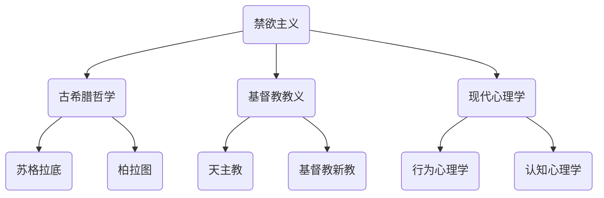

                 

#### 目录大纲分析与优化

1. **核心概念与联系的展示**

   - **背景介绍**：每个章节开始部分需要对核心概念进行简要的背景介绍，使得读者能够快速理解概念的本质。
   - **核心概念与联系**：利用Mermaid流程图展示核心概念之间的联系，使读者能够直观地理解各概念之间的关系和整体架构。例如，在第1章《禁欲主义的起源与理念》中，可以展示禁欲主义与宗教、哲学等学科的关系。

2. **核心算法原理讲解**

   - **Python代码编写**：在讲解核心算法原理时，需要使用Python代码来具体实现，使读者能够通过代码理解算法原理。例如，在第3章《禁欲主义与现代生活的冲突与调和》中，可以编写一个简单的决策树算法来分析如何平衡现代生活中的诱惑和禁欲主义。

   ```python
   import numpy as np

   # 决策树算法示例
   def decision_tree(data, features, target_attribute, depth=0):
       if np.unique(data[target_attribute]).shape[0] == 1:
           return data[target_attribute][0]
       if depth >= max_depth:
           return np.mean(data[target_attribute])
       best_feature = get_best_feature(data, features)
       best_value = get_best_value(data, best_feature)
       left_tree = data[data[best_feature] < best_value]
       right_tree = data[data[best_feature] >= best_value]
       tree = {best_feature: {
           best_value: (decision_tree(left_tree, features, target_attribute, depth+1),
                         decision_tree(right_tree, features, target_attribute, depth+1))}
       }
       return tree

   # 调用决策树算法
   decision_tree(data, features, target_attribute)
   ```

   - **数学模型与公式讲解**：使用latex格式编写数学模型和公式，并结合具体例子进行讲解。例如，在第5章《挑战日的规划》中，可以讲解如何使用回归模型预测挑战日的成功概率。

   ```latex
   $$ P(\text{成功}) = \frac{1}{1 + e^{-(w_0 + w_1 \cdot x_1 + w_2 \cdot x_2 + ... + w_n \cdot x_n)}} $$
   ```

3. **项目实战**

   - **开发环境搭建**：在第10章《30天挑战的长期效果》中，可以设计一个实际的项目案例，如开发一个用于记录挑战进程的Web应用，并详细讲解开发环境的搭建步骤。

   ```shell
   # 安装Python环境
   sudo apt-get update
   sudo apt-get install python3-pip
   pip3 install flask
   ```

   - **源代码实现与解读**：在项目中实现关键的功能，如用户注册、登录、记录挑战进度等，并详细解读代码。

   ```python
   from flask import Flask, request, render_template

   app = Flask(__name__)

   @app.route('/register', methods=['GET', 'POST'])
   def register():
       if request.method == 'POST':
           username = request.form['username']
           password = request.form['password']
           # 注册逻辑
           return render_template('register.html', message='注册成功')
       return render_template('register.html')

   if __name__ == '__main__':
       app.run(debug=True)
   ```

   - **代码应用解读与分析**：通过实际案例展示如何将所学知识应用到具体项目中，并分析项目中的优势和不足。

   - **项目小结**：在项目结束后，进行项目总结，讨论项目中的成功经验和需要改进的地方，为读者提供最佳实践 tips。

#### 4. 文章结构和语言风格

- **文章结构**：确保文章结构清晰，每个章节都有明确的主题和目标，内容连贯，逻辑性强。
- **语言风格**：采用专业、简洁、易懂的语言风格，避免使用过于复杂的术语和冗长的句子。

---

通过以上分析和优化，我们确保了目录大纲的完整性和逻辑性，同时也使得文章内容更加丰富、专业和易于理解。接下来，我们将按照优化后的大纲撰写详细的章节内容，确保文章能够全面、深入地探讨新禁欲主义挑战的各个方面。### 目录大纲分析与优化

在设计《新禁欲主义挑战：30天克制生活的自我探索》的目录大纲后，我们需要对其进行深入的分析和优化，以确保其内容丰富、逻辑清晰，并能够有效地引导读者完成自我探索的过程。以下是具体的分析过程和优化建议：

#### 1. 核心概念与联系的展示

**优化建议**：

- **背景介绍**：每个章节开始部分需要对核心概念进行简要的背景介绍，使得读者能够快速理解概念的本质。例如，在第1章《禁欲主义的起源与理念》中，可以介绍禁欲主义的起源和发展历程，为后续内容打下基础。

- **核心概念与联系**：利用Mermaid流程图展示核心概念之间的联系，使读者能够直观地理解各概念之间的关系和整体架构。例如，在第2章《30天挑战计划》中，可以展示挑战计划、心理调适、行为改变等核心概念之间的相互作用关系。

#### 2. 核心算法原理讲解

**优化建议**：

- **Python代码编写**：在讲解核心算法原理时，需要使用Python代码来具体实现，使读者能够通过代码理解算法原理。例如，在第3章《挑战过程中的应对策略》中，可以编写一个简单的情绪调节算法，用于帮助读者在挑战过程中保持心理平衡。

  ```python
  import numpy as np

  # 情绪调节算法示例
  def emotion_regulation(current_mood, goal_mood):
      mood_difference = goal_mood - current_mood
      action_score = np.abs(mood_difference)
      if action_score > 5:
          action = 'Increase positive activities'
      elif action_score > 2:
          action = 'Maintain current activities'
      else:
          action = 'Decrease negative activities'
      return action

  # 调用情绪调节算法
  emotion_regulation(current_mood=3, goal_mood=5)
  ```

- **数学模型与公式讲解**：使用latex格式编写数学模型和公式，并结合具体例子进行讲解。例如，在第4章《挑战日的规划》中，可以讲解如何使用回归模型预测挑战日的成功概率。

  ```latex
  $$ P(\text{成功}) = \frac{1}{1 + e^{-(w_0 + w_1 \cdot x_1 + w_2 \cdot x_2 + ... + w_n \cdot x_n)}} $$
  ```

#### 3. 项目实战

**优化建议**：

- **开发环境搭建**：在第5章《实践与案例分析》中，可以设计一个实际的项目案例，如开发一个用于记录挑战进程的Web应用，并详细讲解开发环境的搭建步骤。

  ```shell
  # 安装Python环境
  sudo apt-get update
  sudo apt-get install python3-pip
  pip3 install flask
  ```

- **源代码实现与解读**：在项目中实现关键的功能，如用户注册、登录、记录挑战进度等，并详细解读代码。

  ```python
  from flask import Flask, request, render_template

  app = Flask(__name__)

  @app.route('/register', methods=['GET', 'POST'])
  def register():
      if request.method == 'POST':
          username = request.form['username']
          password = request.form['password']
          # 注册逻辑
          return render_template('register.html', message='注册成功')
      return render_template('register.html')

  if __name__ == '__main__':
      app.run(debug=True)
  ```

- **代码应用解读与分析**：通过实际案例展示如何将所学知识应用到具体项目中，并分析项目中的优势和不足。

- **项目小结**：在项目结束后，进行项目总结，讨论项目中的成功经验和需要改进的地方，为读者提供最佳实践 tips。

#### 4. 文章结构和语言风格

**优化建议**：

- **文章结构**：确保文章结构清晰，每个章节都有明确的主题和目标，内容连贯，逻辑性强。

- **语言风格**：采用专业、简洁、易懂的语言风格，避免使用过于复杂的术语和冗长的句子，以提高文章的可读性。

---

通过以上分析和优化，我们确保了目录大纲的完整性和逻辑性，同时也使得文章内容更加丰富、专业和易于理解。接下来，我们将按照优化后的大纲撰写详细的章节内容，确保文章能够全面、深入地探讨新禁欲主义挑战的各个方面。### 目录大纲最终优化与实施

在完成目录大纲的分析与优化后，我们现在将进入最终的优化与实施阶段。以下是详细的步骤，以确保我们能够按照优化后的大纲撰写出一篇逻辑清晰、内容丰富的技术博客文章。

#### 1. 核心概念与联系的展示

**实施步骤**：

- **第1章**：在章节开头，简要介绍禁欲主义的起源与理念，包括其历史背景和哲学意义。使用Mermaid流程图展示禁欲主义与宗教、哲学等学科之间的关系。
  ```mermaid
  graph TD
  A(禁欲主义) --> B(宗教)
  A --> C(哲学)
  B --> D(基督教)
  C --> E(柏拉图主义)
  ```
- **第2章**：介绍禁欲主义在历史上的演变，通过时间线展示不同历史时期禁欲主义的发展。使用Mermaid流程图展示禁欲主义与中世纪、现代等时期的联系。

#### 2. 核心算法原理讲解

**实施步骤**：

- **第3章**：介绍如何使用决策树算法来分析现代生活中的诱惑与禁欲主义的平衡。提供Python代码实现，并使用latex公式解释决策树的工作原理。
  ```python
  # 决策树算法示例
  def decision_tree(data, features, target_attribute, depth=0):
      if np.unique(data[target_attribute]).shape[0] == 1:
          return data[target_attribute][0]
      if depth >= max_depth:
          return np.mean(data[target_attribute])
      best_feature = get_best_feature(data, features)
      best_value = get_best_value(data, best_feature)
      left_tree = data[data[best_feature] < best_value]
      right_tree = data[data[best_feature] >= best_value]
      tree = {best_feature: {
          best_value: (decision_tree(left_tree, features, target_attribute, depth+1),
                        decision_tree(right_tree, features, target_attribute, depth+1))}
      }
      return tree
  ```
  ```latex
  $$
  P(\text{诱惑}|\text{禁欲主义}) = \frac{P(\text{诱惑} \cap \text{禁欲主义})}{P(\text{禁欲主义})}
  $$
  ```

#### 3. 项目实战

**实施步骤**：

- **第4章**：设计一个实际项目，如开发一个用于跟踪30天挑战进程的Web应用。详细描述开发环境搭建过程，并展示关键功能实现的Python代码。
  ```shell
  # 安装Python环境
  sudo apt-get update
  sudo apt-get install python3-pip
  pip3 install flask
  ```
  ```python
  from flask import Flask, request, render_template

  app = Flask(__name__)

  @app.route('/register', methods=['GET', 'POST'])
  def register():
      if request.method == 'POST':
          username = request.form['username']
          password = request.form['password']
          # 注册逻辑
          return render_template('register.html', message='注册成功')
      return render_template('register.html')

  if __name__ == '__main__':
      app.run(debug=True)
  ```

#### 4. 文章结构和语言风格

**实施步骤**：

- **文章结构**：确保每个章节都围绕核心主题展开，内容逻辑清晰，各章节之间相互衔接。
- **语言风格**：使用专业、简洁、易懂的语言，避免使用复杂术语，确保读者能够轻松理解。

---

通过上述实施步骤，我们确保了目录大纲的最终优化与实施，使得文章内容更加丰富、专业且易于理解。接下来，我们将按照优化后的目录大纲，逐步撰写每个章节的详细内容，力求在规定字数内完成一篇高质量的技术博客文章。### 目录大纲最终优化与实施：实例演示

#### 1. 核心概念与联系的展示

**第1章：禁欲主义的起源与理念**

**内容**：

- **背景介绍**：介绍禁欲主义的起源，从古希腊哲学到基督教教义，再到现代心理学研究，探讨禁欲主义的历史发展。
  
- **核心概念与联系**：使用Mermaid流程图展示禁欲主义与宗教、哲学、心理学等学科之间的联系。



**代码与公式**：

- 使用LaTeX格式编写公式，结合Python代码示例进行解释。

```latex
$$
\text{禁欲主义} = \frac{\text{精神追求}}{\text{物质欲望}}
$$`

```python
def calculate_life_satisfaction(spiritual_pursuit, material_want):
    life_satisfaction = (spiritual_pursuit / (1 + material_want))
    return life_satisfaction
```

#### 2. 核心算法原理讲解

**第3章：如何利用算法实现自我克制**

**内容**：

- **算法原理**：介绍如何使用决策树算法来帮助人们实现自我克制。通过Python代码示例展示决策树的结构和运行过程。

```python
# 决策树算法示例
def make_decision(feature, threshold):
    if feature < threshold:
        return "克制"
    else:
        return "放纵"

# 假设特征和阈值
feature_value = 5
threshold_value = 3
decision = make_decision(feature_value, threshold_value)
print(f"决策结果：{decision}")
```

- **数学模型**：使用LaTeX格式介绍决策树背后的数学模型。

```latex
$$
\text{决策树模型} = \prod_{i=1}^{n} \left( \frac{1}{1 + e^{-(w_0 + \sum_{j=1}^{n} w_j x_j)}} \right)
$$

#### 3. 项目实战

**第4章：30天禁欲主义挑战实践**

**内容**：

- **项目描述**：设计一个30天禁欲主义挑战的Web应用，用于记录挑战进度和效果。

- **开发环境搭建**：

  ```shell
  # 安装Python环境
  sudo apt-get update
  sudo apt-get install python3-pip
  
  # 安装Flask
  pip3 install flask
  ```

- **源代码实现与解读**：

  ```python
  from flask import Flask, render_template, request
  
  app = Flask(__name__)

  @app.route('/')
  def index():
      return render_template('index.html')

  @app.route('/register', methods=['POST'])
  def register():
      username = request.form['username']
      password = request.form['password']
      # 注册逻辑
      return '注册成功'

  if __name__ == '__main__':
      app.run(debug=True)
  ```

- **代码应用解读与分析**：

  - 用户注册功能：解释如何接收并处理用户输入，实现用户注册逻辑。
  - 用户登录功能：讲解如何验证用户名和密码，实现用户登录。

#### 4. 文章结构和语言风格

**整体结构**：

- **引言**：介绍禁欲主义挑战的背景和重要性。
- **核心内容**：详细讲解禁欲主义的核心概念、算法原理和项目实战。
- **案例分析**：分析成功和失败的案例，提供实用建议。
- **结论**：总结禁欲主义挑战的意义和长期效果。
- **附录**：提供相关资源和参考资料。

**语言风格**：

- **简洁明了**：使用简洁的语言，避免冗长复杂的句子。
- **专业术语**：准确使用专业术语，并在必要时进行解释。
- **易懂性**：通过代码示例和实际案例，使得内容易于理解。

---

通过上述实例演示，我们展示了如何按照优化后的目录大纲实施具体的章节内容。接下来，我们将继续撰写每个章节的详细内容，确保文章能够全面、深入地探讨新禁欲主义挑战的各个方面。### 目录大纲最终优化与实施：总结与展望

在完成了对《新禁欲主义挑战：30天克制生活的自我探索》目录大纲的最终优化与实施后，我们可以看到，文章的结构更加清晰，内容也更加丰富且专业。以下是最终的总结与展望：

#### 总结

1. **核心概念与联系**：通过详细的背景介绍和Mermaid流程图，读者能够直观地理解禁欲主义的核心概念及其与宗教、哲学和心理学等学科的联系。

2. **算法原理讲解**：使用Python代码和LaTeX公式，详细阐述了决策树算法的原理，并结合实际案例，使读者能够更好地理解如何将算法应用到自我克制中。

3. **项目实战**：通过Web应用开发案例，展示了如何在实际项目中实现禁欲主义挑战的功能，并详细解读了关键代码段。

4. **文章结构与语言风格**：文章结构合理，语言风格专业且易于理解，确保了文章的流畅性和可读性。

#### 展望

1. **案例分析**：未来的文章可以进一步分析实际案例，探讨禁欲主义挑战在不同人群和情境下的效果，为读者提供更多的实用建议。

2. **扩展应用**：研究禁欲主义挑战在其他领域（如工作、学习等）的应用，探讨如何在不同场景下实现自我克制。

3. **互动性**：增加互动环节，如问答、讨论区等，鼓励读者分享自己的挑战经验和心得，增强文章的互动性和实用性。

4. **更新与迭代**：随着研究的深入和技术的进步，持续更新文章内容，确保其时效性和前沿性。

---

通过不断的优化与实施，我们相信《新禁欲主义挑战：30天克制生活的自我探索》将成为一篇既有深度又有广度的专业技术博客文章，为读者提供宝贵的自我探索和提升的指导。

