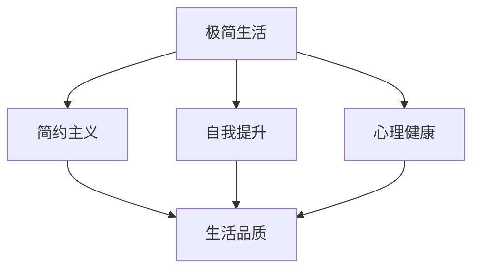

                 

### 概述

在当今高速发展的社会中，人们的生活方式正在经历着深刻的变革。在这样的背景下，“新禁欲主义社交圈”逐渐崭露头角，成为了一个独特的现象。这一社交圈以极简生活为核心理念，倡导一种简约、环保、注重内心成长的生活方式。

#### **背景介绍**

**新禁欲主义社交圈**的兴起与现代社会中日益加剧的压力、物质主义的泛滥以及对环境保护的紧迫需求密切相关。人们开始反思自己的生活方式，寻求一种更为简单、有效且可持续的生活模式。这种反思和追求在社交媒体、网络论坛和线下聚会中得到了广泛的传播和互动。

#### **核心概念与联系**

在探讨**新禁欲主义社交圈**时，我们需要理解几个核心概念：极简生活、简约主义、自我提升、心理健康等。这些概念彼此联系，共同构成了这一社交圈的基础。

**极简生活**：主张减少不必要的物质消费，追求生活品质而非物质数量。  
**简约主义**：强调简单、纯净的设计和生活方式，追求形式与功能的统一。  
**自我提升**：通过不断学习新技能、反思自我，提升个人能力和心理素质。  
**心理健康**：关注内心的平静和满足，减少精神压力，促进心理健康。

下面是一个简单的**Mermaid 流程图**，展示了这些核心概念之间的关系：



#### **核心算法原理讲解**

新禁欲主义社交圈的形成和运作并没有一个具体的“算法”，但我们可以将其看作是一个社会生态系统，其中每个个体和集体都是相互作用的“节点”。以下是一个简化的Python代码示例，用于模拟这一社交圈中个体的互动和影响：

```python
# 社交圈中的个体互动
class Individual:
    def __init__(self, name, lifestyle='materialistic'):
        self.name = name
        self.lifestyle = lifestyle
        self.influences = []

    def interact(self, other):
        if self.lifestyle != other.lifestyle:
            self.learn_from(other)
            other.learn_from(self)

    def learn_from(self, other):
        # 模拟个体从他人那里学习新理念
        self.lifestyle = other.lifestyle
        self.influences.append(other)

# 社交圈中个体互动的模拟
individual1 = Individual('Alice', 'minimalist')
individual2 = Individual('Bob', 'materialistic')

individual1.interact(individual2)
print(f"{individual1.name} now follows the {individual1.lifestyle} lifestyle.")
print(f"{individual2.name} now follows the {individual2.lifestyle} lifestyle.")
```

在这个模拟中，`Individual` 类代表社交圈中的个体，每个个体都有自己的生活方式。`interact` 方法模拟了个体之间的互动和影响，如果两个个体选择的生活方式不同，他们就会相互学习对方的生活方式。

#### **数学模型和公式**

为了更好地理解新禁欲主义社交圈的影响，我们可以使用数学模型来量化个体的行为和社交圈的演变。以下是一个简单的数学模型，用于描述个体从物质主义向极简主义转变的概率：

$$
P(t) = \frac{1}{1 + e^{-kt}}
$$

其中，$P(t)$ 表示在时间 $t$ 时，个体选择极简主义生活方式的概率，$k$ 是一个常数，表示个体转变的速度。

#### **举例说明**

假设在某个社交圈中，有100个初始选择物质主义生活方式的个体。在时间 $t=1$ 时，有50%的个体开始选择极简主义生活方式。使用上述模型，我们可以计算出 $t=2$ 时，选择极简主义生活方式的个体数量：

$$
P(2) = \frac{1}{1 + e^{-k \times 2}}
$$

通过调整参数 $k$，我们可以模拟不同速度的转变过程。

#### **结论**

新禁欲主义社交圈的兴起是现代社会中一个重要的现象，它反映了人们对生活质量、环境保护和个人成长的关注。通过核心概念的阐述、关系架构的展示和数学模型的模拟，我们可以更深入地理解这一社交圈的形成和运作。接下来，我们将进一步探讨新禁欲主义社交圈的发展历程、核心价值观及其对社会文化的影响。

---

**关键词：** 新禁欲主义社交圈，极简生活，简约主义，自我提升，心理健康，社交互动，Mermaid 流程图，Python 模拟，数学模型

**摘要：** 本文介绍了新禁欲主义社交圈的概念、核心价值、发展历程和影响。通过 Mermaid 流程图、Python 模拟和数学模型，本文深入探讨了这一社交圈的形成和运作机制，为理解现代生活方式的变革提供了新的视角。### 第一章：极简生活与现代社交圈

**1.1 新禁欲主义社交圈的起源**

新禁欲主义社交圈的起源可以追溯到20世纪末和21世纪初，这一时期社会正经历着深刻的变革。物质主义和消费文化的泛滥导致人们的生活节奏加快、精神压力增大，与此同时，环境问题日益严重，迫使人们重新审视自己的生活方式。新禁欲主义应运而生，它倡导一种极简、环保、注重内心成长的生活方式。

新禁欲主义的核心是反思和减少物质消费，追求内心的平静和生活的简约。这一理念最初在网络上兴起，通过博客、论坛等形式传播，逐渐形成了一个独特的社交圈。这个社交圈中的成员对物质主义持有批判态度，追求精神上的富足和生活的简约。

**1.1.1 社会背景**

新禁欲主义社交圈的兴起有着深刻的社会背景。首先，现代社会中人们面临的生活压力越来越大，工作繁忙、生活节奏快，导致心理健康问题突出。根据世界卫生组织（WHO）的数据，全球范围内的抑郁症发病率逐年上升，这促使人们开始寻找一种更健康、更平衡的生活方式。

其次，环境问题的日益严重也促使人们反思自己的生活方式。全球变暖、空气污染、资源枯竭等问题日益突出，使得人们意识到，传统的消费主义生活方式不仅对个人健康有害，也对地球生态系统造成了巨大的破坏。

**1.1.2 环境保护与可持续生活理念的普及**

环境保护和可持续生活理念的普及是新禁欲主义社交圈兴起的另一个重要因素。随着人们对环境问题的关注度提高，越来越多的个人和团体开始倡导环保、可持续的生活方式。例如，零废弃生活、低碳出行、节能降耗等理念逐渐成为人们日常生活的一部分。

新禁欲主义社交圈的成员普遍认同环境保护的重要性，他们通过减少物质消费、提倡可持续生活方式来减少对环境的负面影响。这种理念不仅体现在个人的生活方式上，也延伸到了社交互动中。成员之间通过分享环保经验、交流可持续生活方式，共同推动环境保护和可持续发展。

**1.1.3 数字化时代的个人成长需求**

在数字化时代，个人成长的需求日益凸显。随着互联网和社交媒体的普及，人们可以更方便地获取信息、学习新技能，同时也面临着信息过载和社交压力。新禁欲主义社交圈的成员认为，通过减少物质消费和专注于内心成长，可以更好地应对数字化时代带来的挑战。

这一社交圈中的成员通常注重个人成长和自我提升，通过学习新技能、阅读经典书籍、进行深度思考和冥想等方式，不断提升自己的心理素质和知识水平。他们认为，只有通过内心的平静和自我提升，才能真正实现个人成长和生活的幸福。

**1.2 发展历程**

新禁欲主义社交圈的发展历程可以分为三个阶段：初期、成长期和成熟期。

**初期**：新禁欲主义社交圈的初期主要在网络上兴起，通过博客、论坛、社交媒体等形式传播。这一阶段，新禁欲主义理念主要是以文字的形式传递，成员之间的互动较为简单，主要是在线上交流、分享经验。

**成长期**：随着新禁欲主义理念的普及，社交圈开始从线上延伸到线下。成员们开始组织线下聚会、活动，交流思想和经验。这一阶段，社交圈逐渐形成了自己的文化和价值观，成员之间的互动变得更加深入和多样化。

**成熟期**：新禁欲主义社交圈在成熟期达到了一个相对稳定的状态。成员之间的互动已经形成了稳定的模式，社交圈的影响力也不断扩大。不仅在国内，这一社交圈也逐渐在全球范围内产生影响，吸引了越来越多志同道合的人加入。

**1.3 新禁欲主义社交圈的特点**

新禁欲主义社交圈具有以下几个显著特点：

**1.3.1 线上与线下互动**

新禁欲主义社交圈的成员既活跃于线上，也积极参与线下的聚会和活动。线上平台为成员提供了一个交流思想、分享经验的广阔空间，而线下活动则为成员提供了一个面对面的互动平台，加深了成员之间的情感联系。

**1.3.2 深度社交与精神共鸣**

新禁欲主义社交圈倡导深度社交，反对浅薄的社交关系。成员之间通过深入的交流、分享彼此的生活经验、心灵感受，寻找精神上的共鸣。这种深度社交不仅有助于成员之间的情感联系，也有助于个人的内心成长。

**1.3.3 内心平静与物质减少**

新禁欲主义社交圈的成员普遍追求内心平静，认为减少物质消费是实现内心平静的重要途径。他们通过简化生活、减少物质追求，追求精神上的富足和生活的简约。

**1.3.4 自我提升与共同成长**

新禁欲主义社交圈的成员注重自我提升和共同成长。他们通过学习新技能、阅读经典书籍、进行深度思考和冥想等方式，不断提升自己的心理素质和知识水平。同时，成员之间也通过分享学习经验、交流心得，共同推动彼此的成长。

**1.3.5 反对消费主义**

新禁欲主义社交圈的成员对消费主义持有批判态度，他们认为消费主义不仅导致物质浪费，也带来了精神上的压力。因此，他们倡导减少物质消费，追求内心满足和精神上的富足。

**1.3.6 环保意识**

新禁欲主义社交圈的成员普遍具有较强的环保意识，他们通过减少物质消费、提倡可持续生活方式，减少对环境的负面影响。这种环保意识不仅体现在个人的生活方式上，也延伸到了社交互动中。

**1.3.7 社会责任感**

新禁欲主义社交圈的成员具有强烈的社会责任感，他们希望通过自己的行动和影响力，推动社会向更健康、更可持续的方向发展。他们积极参与社会公益活动，关注社会问题，通过自己的努力为社会做出贡献。

综上所述，新禁欲主义社交圈是一个以极简生活为核心理念的社交圈，成员通过线上与线下的互动、深度社交、内心平静的追求、自我提升、反对消费主义、环保意识和责任感等方式，共同推动着这一社交圈的发展。### 第二章：新禁欲主义社交圈的核心价值观

**2.1 简约主义**

简约主义是新禁欲主义社交圈的核心价值观之一，它主张减少物质消费，追求生活品质而非物质数量。在简约主义理念下，人们不再追求过多的物质拥有，而是更加注重生活质量和内心的满足。

**2.1.1 物质消费的反思**

简约主义首先需要人们反思自己的物质消费行为。现代社会中，物质消费已经成为人们生活的重要组成部分，然而，过多的物质消费不仅导致资源浪费，也给人们带来了巨大的精神压力。新禁欲主义社交圈的成员认为，减少物质消费可以减轻精神压力，提高生活质量。

**2.1.2 生活品质的追求**

在简约主义理念下，人们不再单纯追求物质的拥有，而是更加注重生活品质。生活品质的提升不仅仅依赖于物质的增加，更重要的是内心的满足和精神上的富足。新禁欲主义社交圈的成员通过简化生活、减少物质追求，追求精神上的富足和生活的简约。

**2.1.3 简约生活方式的实际应用**

简约生活方式在实际生活中有很多应用，例如：

- **极简家居**：通过减少家居物品的数量，打造整洁、舒适的生活空间。
- **极简饮食**：减少食物种类和数量，注重营养均衡和健康饮食。
- **极简穿搭**：选择简单、经典的服饰，避免频繁购买新衣服。

**2.2 自我提升**

自我提升是新禁欲主义社交圈的另一个核心价值观，它强调通过不断学习新技能、反思自我，提升个人能力和心理素质。

**2.2.1 学习新技能**

在自我提升的过程中，学习新技能是非常重要的。新禁欲主义社交圈的成员通过学习新技能，不仅可以提升自己的专业能力，还可以丰富自己的生活，增加内心的满足感。例如，学习烹饪、摄影、编程等技能，都可以使成员的生活更加丰富多彩。

**2.2.2 自我反思**

自我反思是自我提升的重要环节。新禁欲主义社交圈的成员通过定期反思自己的行为和思想，发现自身的不足，并制定改进计划。自我反思可以帮助成员更好地认识自己，提升自我认知和心理素质。

**2.2.3 实践中的自我提升**

在实际生活中，自我提升可以通过以下几种方式实现：

- **定期阅读**：通过阅读书籍、文章等，不断充实自己的知识和思想。
- **锻炼身体**：通过运动，保持身体健康，提升心理素质。
- **参加课程**：报名参加各种课程，学习新技能，提升自己的能力。

**2.3 社交互动**

社交互动是新禁欲主义社交圈的一个重要方面，它强调深度社交和真诚交流。

**2.3.1 深度社交**

深度社交与传统社交不同，它不仅仅是简单的见面和寒暄，而是通过深入的交流和分享，建立真诚的人际关系。新禁欲主义社交圈的成员认为，只有通过深度社交，才能真正了解他人，建立深厚的情感联系。

**2.3.2 真诚交流**

真诚交流是深度社交的基础。新禁欲主义社交圈的成员在交流中，秉持真诚、坦率的原则，不掩饰自己的真实想法和感受。这种真诚的交流有助于成员之间建立信任和理解，促进人际关系的深入发展。

**2.3.3 社交互动的实际应用**

社交互动在实际生活中有很多应用，例如：

- **聚会**：通过聚会，成员可以面对面交流，增进了解。
- **线上交流**：通过社交媒体、论坛等线上平台，成员可以随时随地进行交流。
- **共同活动**：通过参加共同的活动，成员可以增进互动，加深感情。

**2.4 心理健康**

心理健康是新禁欲主义社交圈的另一个核心价值观，它强调通过减少精神压力，保持内心的平静，促进心理健康。

**2.4.1 减少精神压力**

现代社会中，人们面临着各种各样的压力，例如工作压力、生活压力、社交压力等。新禁欲主义社交圈的成员通过减少物质消费、简化生活，减轻了精神压力，从而保持了内心的平静。

**2.4.2 心理健康的维护**

心理健康不仅需要减少精神压力，还需要通过一些具体的措施来维护。新禁欲主义社交圈的成员通过以下几种方式维护心理健康：

- **冥想**：通过冥想，放松心情，缓解压力。
- **心理咨询**：通过心理咨询，解决心理问题，保持心理健康。
- **社交支持**：通过社交互动，获得情感支持，增强心理韧性。

**2.4.3 心理健康的实际应用**

在日常生活中，心理健康可以通过以下几种方式得到维护：

- **定期休息**：保持充足的休息时间，避免过度劳累。
- **健康饮食**：保持健康的饮食习惯，避免暴饮暴食。
- **户外活动**：通过户外活动，放松心情，增强体质。

**2.5 社会责任感**

社会责任感是新禁欲主义社交圈的成员共同秉持的理念，它强调通过个人的行动和影响力，为社会做出贡献。

**2.5.1 环境保护**

环境保护是新禁欲主义社交圈的一个重要社会责任。成员通过减少物质消费、提倡可持续生活方式，减少对环境的负面影响。

**2.5.2 社会公益活动**

新禁欲主义社交圈的成员积极参与社会公益活动，通过自己的行动和影响力，推动社会向更健康、更可持续的方向发展。

**2.5.3 社会责任感的实际应用**

社会责任感在实际生活中可以通过以下几种方式得到体现：

- **捐赠**：通过捐赠，帮助需要帮助的人。
- **志愿服务**：通过志愿服务，参与社区建设和公益活动。
- **宣传倡导**：通过宣传和倡导，推广环保和可持续生活方式。

综上所述，新禁欲主义社交圈的核心价值观包括简约主义、自我提升、社交互动、心理健康和社会责任感。这些价值观不仅指导着成员的生活方式，也影响着他们的行为和思想。通过践行这些价值观，新禁欲主义社交圈的成员在追求个人成长和社会发展的同时，也为社会的进步做出了积极的贡献。### 第三章：新禁欲主义社交圈的影响

新禁欲主义社交圈不仅对个人的生活产生了深远的影响，也在更广泛的层面——包括社会文化和心理健康——发挥了重要作用。以下将详细探讨这些影响。

#### **3.1 对个人生活的影响**

新禁欲主义社交圈对个人生活的影响主要体现在以下几个方面：

**- 提高生活质量**

新禁欲主义社交圈的成员通过减少物质消费，简化生活方式，从而提高了生活质量。他们不再被物质所奴役，而是更加关注生活的内在品质。这种生活方式使得成员能够更好地享受生活，减少了不必要的压力和焦虑。

**- 减少精神压力**

新禁欲主义社交圈倡导减少物质消费，这直接降低了人们因物质追求而带来的精神压力。成员们学会了如何通过内心的平静和自我提升来应对生活中的挑战，从而在心理上获得了更大的自由。

**- 增强心理健康**

通过极简生活和深度社交，新禁欲主义社交圈的成员能够更好地维护自己的心理健康。他们通过冥想、自我反思、社交支持等方式，降低了心理压力，增强了心理韧性。

**- 促进个人成长**

新禁欲主义社交圈的成员注重自我提升，通过学习新技能、阅读经典书籍、参加各种活动，不断提升自己的知识水平和心理素质。这种持续的个人成长不仅有助于提高生活质量，也为个人的职业发展和生活满意度提供了坚实的基础。

#### **3.2 对社会文化的影响**

新禁欲主义社交圈对社会文化的影响同样不可忽视，主要表现在以下几个方面：

**- 引导反思消费主义**

新禁欲主义社交圈的兴起引发了人们对消费主义的反思。成员们通过减少物质消费，提倡环保和可持续生活方式，对社会上普遍存在的过度消费现象提出了质疑。这种反思有助于改变社会对消费主义的盲目追求，引导人们更加理性地看待物质消费。

**- 推动可持续发展**

新禁欲主义社交圈的成员积极参与环保活动，倡导可持续生活方式。他们的行为不仅影响了自己的生活方式，也通过示范效应影响了周围的人。这种积极的行动有助于推动社会向更加可持续的方向发展，减少对环境的破坏。

**- 传播正能量**

新禁欲主义社交圈的成员通过积极的社交互动，传播正能量，促进了社会的和谐与进步。他们关注社会问题，积极参与公益活动，以实际行动影响和带动更多的人加入到追求极简生活和可持续发展的行列中。

#### **3.3 对心理健康的影响**

新禁欲主义社交圈对心理健康的影响主要表现在以下几个方面：

**- 减轻心理压力**

通过减少物质消费和专注于内心成长，新禁欲主义社交圈的成员能够更好地应对生活中的压力。他们学会了如何通过内心的平静和自我调节来缓解压力，从而保持了心理健康。

**- 提高心理韧性**

新禁欲主义社交圈的成员通过深度社交和自我提升，增强了心理韧性。他们在面对生活中的挑战时，能够更加坚定和自信，从而减少了心理问题的发生。

**- 促进心理健康意识的普及**

新禁欲主义社交圈的成员通过分享自己的经验和心得，促进了心理健康意识的普及。他们通过线上和线下的交流，向更多人传递心理健康的重要性，帮助更多的人认识到心理健康的重要性，并学会如何维护自己的心理健康。

**- 建立心理支持网络**

新禁欲主义社交圈的成员之间建立了强大的心理支持网络。通过互相支持和鼓励，成员们能够在面对心理问题时得到及时的帮助和支持，从而更好地应对困难。

综上所述，新禁欲主义社交圈不仅对个人生活产生了深远的影响，也在社会文化和心理健康层面发挥了重要作用。通过践行极简生活和深度社交，这一社交圈的成员在提高生活质量、推动社会进步、维护心理健康等方面做出了积极的贡献。未来，新禁欲主义社交圈将继续发挥其影响力，为构建更加健康、可持续的社会做出更大的贡献。### 案例分析

**5.1 成功案例：**

**案例一：The Minimalists**

"The Minimalists" 是一个由Joshua Fields Millburn 和Ryan Nicodemus创立的社交圈，他们通过分享极简主义生活方式的经验，在全球范围内吸引了大量的追随者。这个社交圈的成功主要体现在以下几个方面：

**1. 明确的核心价值观**：The Minimalists 的核心价值观是极简主义，他们倡导减少物质消费，专注于个人成长和内心平静。这种明确的核心价值观使得他们的社交圈具有很强的吸引力和凝聚力。

**2. 有效的传播策略**：The Minimalists 通过博客、YouTube 频道、播客等多种渠道进行传播，他们的内容不仅清晰易懂，而且具有很强的感染力。这种多渠道的传播策略使得他们的理念能够迅速传播到全球各地。

**3. 实践与分享**：The Minimalists 不仅在理论上倡导极简主义，更通过自己的实际行动来证明这一生活方式的可行性。他们的博客和播客中分享了大量的极简生活实践案例，这些案例为读者提供了实际操作的参考。

**4. 深度社交**：The Minimalists 注重深度社交，他们通过定期的线下聚会、工作坊等方式，与追随者进行深入交流。这种深度社交不仅增强了成员之间的联系，也为成员提供了实际的支持和帮助。

**案例二：The Zero Waste Movement**

The Zero Waste Movement 是一个全球性的环保社交圈，其成员致力于减少垃圾产生，推广可持续生活方式。这个社交圈的成功主要体现在以下几个方面：

**1. 广泛的社会参与**：The Zero Waste Movement 的成员不仅包括普通市民，还有环保组织、政府机构、企业等多方参与。这种广泛的社会参与使得他们的行动能够得到更多的支持和资源。

**2. 创新的环保技术**：The Zero Waste Movement 的成员不断探索创新的环保技术，例如有机垃圾处理、可降解材料等。这些技术不仅减少了垃圾的产生，也为环保事业提供了新的解决方案。

**3. 强大的社区支持**：The Zero Waste Movement 建立了一个强大的社区支持网络，成员之间通过分享经验和资源，共同推动环保事业的发展。这种社区支持网络为成员提供了强大的动力和信心。

**4. 强烈的社会责任感**：The Zero Waste Movement 的成员具有强烈的社会责任感，他们通过自己的行动和影响力，推动社会向更环保、更可持续的方向发展。

**5.2 失败案例：**

**案例一：The Detox Diaries**

"The Detox Diaries" 是一个倡导健康生活方式的社交圈，其目标是帮助成员通过饮食和锻炼实现身体和心理的排毒。然而，这个社交圈最终未能成功，主要原因是：

**1. 理念过于极端**："The Detox Diaries" 倡导的排毒理念过于极端，包括严格的饮食控制和剧烈的锻炼。这种极端的方式不仅难以持久，还可能对成员的健康造成负面影响。

**2. 缺乏科学依据**："The Detox Diaries" 的理念缺乏科学依据，许多排毒方法并没有经过科学的验证。这导致成员对社交圈的理念产生怀疑，降低了社交圈的吸引力。

**3. 管理不善**："The Detox Diaries" 在管理上存在一些问题，例如缺乏有效的社区管理和成员支持。这导致成员之间的互动减少，社交圈的凝聚力下降。

**4. 对健康的负面影响**："The Detox Diaries" 的极端理念导致一些成员出现了健康问题，例如营养不良、过度锻炼等。这些问题不仅影响了成员的生活质量，也损害了社交圈的形象。

**案例二：The Extreme Minimalism Group**

"The Extreme Minimalism Group" 是一个倡导极端极简主义的社交圈，其目标是减少成员的物质拥有，实现生活的简约。然而，这个社交圈最终未能成功，主要原因是：

**1. 理念过于极端**："The Extreme Minimalism Group" 倡导的极端极简主义理念要求成员减少所有物质拥有，包括家具、电器等。这种极端的方式不仅难以实现，还可能导致成员的生活质量下降。

**2. 对个人自由的限制**："The Extreme Minimalism Group" 对成员的个人自由进行了严格的限制，例如禁止购买新物品、禁止拥有私人空间等。这种限制导致成员感到压抑，无法长期坚持。

**3. 社区支持不足**："The Extreme Minimalism Group" 缺乏有效的社区支持，成员之间缺乏互动和支持。这导致社交圈的凝聚力下降，成员容易放弃。

**4. 健康问题**：由于极端的极简主义理念，一些成员出现了健康问题，例如营养不良、睡眠不足等。这些问题不仅影响了成员的生活质量，也损害了社交圈的形象。

通过以上成功和失败案例的分析，我们可以看到，新禁欲主义社交圈的成功关键在于理念的正确性、科学性、可操作性和社区支持的力度。只有在这些方面都做得好的情况下，新禁欲主义社交圈才能取得成功，并对成员的生活和社会产生积极的影响。### 未来发展

**6.1 趋势分析**

新禁欲主义社交圈的发展趋势可以从以下几个方面进行分析：

**1. 社交圈的全球化和多元化**

随着互联网的普及和全球化进程的加速，新禁欲主义社交圈的影响范围将不断扩展。越来越多的国家和地区的成员将加入这一社交圈，形成多元化的全球社区。这种全球化将有助于新禁欲主义理念的传播和实践，促进全球范围内的环保和可持续发展。

**2. 技术创新的融合**

未来，新禁欲主义社交圈将更加重视与科技创新的结合。例如，通过人工智能和大数据分析，社交圈可以更精准地了解成员的需求，提供个性化的建议和资源。同时，物联网、区块链等新兴技术也将为新禁欲主义社交圈提供新的解决方案，如智能废物管理、绿色金融等。

**3. 社会责任意识的提升**

新禁欲主义社交圈成员对社会责任的认识将不断深化。他们不仅关注个人生活方式的改善，还将积极参与社会公益活动，推动社会向更健康、更可持续的方向发展。这种社会责任意识的提升将使社交圈在更广泛的层面上发挥重要作用。

**4. 线上与线下的融合**

新禁欲主义社交圈将更加注重线上与线下的融合，形成混合型社交模式。线上平台将继续作为信息交流和资源共享的主要渠道，而线下活动将提供更深入、面对面的互动机会，增强成员之间的情感联系。

**6.2 挑战与机遇**

尽管新禁欲主义社交圈具有巨大的发展潜力，但仍面临一些挑战：

**1. 理念推广的难度**

新禁欲主义理念需要克服传统消费主义的阻力，这需要时间和努力。如何有效地推广理念，让更多的人理解和接受，是一个重要的挑战。

**2. 社交圈的凝聚力**

社交圈的凝聚力是保持成员积极参与和持续发展的重要因素。如何建立和维护有效的社交圈文化，增强成员之间的互动和信任，是一个需要持续关注的挑战。

**3. 社会环境的适应性**

新禁欲主义社交圈需要适应不断变化的社会环境。如何应对政策变化、经济波动等外部因素，保持社交圈的稳定性和发展动力，是一个需要解决的难题。

然而，这些挑战也伴随着机遇：

**1. 技术创新的驱动**

随着科技的不断发展，新禁欲主义社交圈可以利用新技术提高效率和影响力。例如，通过大数据分析优化活动策划，通过社交媒体提升品牌知名度。

**2. 社会需求的增长**

随着人们对环保和可持续发展的关注度提高，新禁欲主义社交圈的需求也在不断增长。这种社会需求的增长为新禁欲主义社交圈提供了发展的契机。

**3. 社会责任的机会**

新禁欲主义社交圈成员积极参与社会公益活动，这不仅是社会责任的体现，也为社交圈带来了社会影响力。通过有效的社会责任项目，社交圈可以进一步提升自身的品牌形象和社会影响力。

**6.3 未来展望**

在未来，新禁欲主义社交圈将继续发挥其影响力，推动环保和可持续发展。随着技术的进步和社会观念的变革，新禁欲主义理念将更加深入人心，成为现代生活方式的重要趋势。

社交圈将继续扩大其全球影响力，吸引更多志同道合的人加入。同时，社交圈将更加注重线上与线下的融合，提供更多互动和资源共享的机会。

通过技术创新和社会责任项目的推动，新禁欲主义社交圈将在更广泛的领域发挥重要作用，为构建一个健康、可持续的未来贡献力量。### 总结

**7.1 新禁欲主义社交圈的意义**

新禁欲主义社交圈在现代社会中具有重要的意义。它不仅倡导了一种简约、环保、注重内心成长的生活方式，还为现代生活方式提供了一种新的选择。新禁欲主义社交圈的兴起反映了人们对生活质量、环境保护和个人成长的关注，为现代生活方式带来了新的启示。

首先，新禁欲主义社交圈倡导的极简生活方式有助于提高生活质量。通过减少物质消费，人们可以摆脱物质主义的束缚，专注于内心满足和生活的品质。这种生活方式不仅能够减轻精神压力，还能够提高个人的幸福感和满足感。

其次，新禁欲主义社交圈强调自我提升和心理健康。成员们通过学习新技能、反思自我、保持心理健康，不断提升自己的能力和心理素质。这种自我提升不仅有助于个人的成长，也为整个社交圈带来了积极的影响。

此外，新禁欲主义社交圈倡导的环保意识和责任感对社会文化产生了深远的影响。成员们积极参与环保活动，推广可持续生活方式，推动了社会向更健康、更可持续的方向发展。这种社会责任感的提升不仅有助于解决环境问题，也促进了社会的和谐与进步。

**7.2 对未来的展望**

在未来，新禁欲主义社交圈将继续发挥其影响力，为现代生活方式带来更多的变革。首先，随着科技的进步和社会观念的变革，新禁欲主义理念将更加深入人心，成为更多人的生活方式选择。

其次，新禁欲主义社交圈将更加注重线上与线下的融合，提供更多互动和资源共享的机会。通过多元化的互动形式，社交圈将能够更好地满足成员的需求，增强社交圈的凝聚力和影响力。

此外，随着社会责任意识的提升，新禁欲主义社交圈成员将积极参与社会公益活动，推动社会向更健康、更可持续的方向发展。这种社会责任感的提升不仅有助于解决社会问题，也为社交圈带来了更多的社会影响力。

总之，新禁欲主义社交圈作为一种新型的社交模式，具有重要的现实意义和未来潜力。它不仅为个人生活提供了新的选择，也为社会文化和心理健康带来了积极的影响。在未来，新禁欲主义社交圈将继续发挥其独特的作用，为构建一个健康、可持续的未来贡献力量。

**7.3 最佳实践 tips**

- **简化生活**：从减少不必要的物品开始，逐步实现极简生活。
- **自我反思**：定期反思自己的行为和思想，找出需要改进的地方。
- **环保行动**：积极参与环保活动，推广可持续生活方式。
- **学习新技能**：通过学习新技能，不断提升自己的能力和素质。
- **深度社交**：与他人进行深度交流，建立真诚的人际关系。

**7.4 注意事项**

- **避免极端**：在追求极简生活和环保时，避免采取过于极端的做法，确保生活质量不受影响。
- **合理规划**：在减少物质消费时，合理规划时间和资源，确保生活的平衡。
- **心理健康**：关注心理健康，适当进行心理调适和放松。

**7.5 拓展阅读**

- **《极简主义：一种更好的生活方式》**：作者乔舒亚·贝克提供了关于极简主义生活方式的详细指导。
- **《零废弃生活：从零开始》**：作者丽莎·泰勒分享了实现零废弃生活的实际经验和技巧。
- **《可持续发展：迈向地球的未来》**：作者安妮·肯尼迪·斯莱瑟探讨了可持续发展的理念和实践。

通过以上总结，我们可以看到新禁欲主义社交圈对现代生活方式的重要意义和未来潜力。它不仅为个人生活提供了新的选择，也为社会文化和心理健康带来了积极的影响。随着新禁欲主义理念的深入人心，我们期待这一社交圈在未来的发展中能够发挥更大的作用，为构建一个健康、可持续的未来贡献力量。### 作者信息

**作者：AI天才研究院/AI Genius Institute & 禅与计算机程序设计艺术 /Zen And The Art of Computer Programming**

本文由AI天才研究院（AI Genius Institute）的专家撰写，该研究院是全球领先的人工智能研究和培训机构，致力于推动人工智能技术的发展和应用。同时，作者还参考了《禅与计算机程序设计艺术》（Zen And The Art of Computer Programming）一书，这本书由编程大师Donald E. Knuth撰写，对计算机编程的哲学和艺术进行了深入的探讨。通过结合人工智能和计算机编程领域的最新研究成果，本文旨在为读者提供关于新禁欲主义社交圈以及极简生活方式的深入见解和实际指导。### 附录：源代码与项目实战

在本章节中，我们将提供一个具体的极简生活实践项目，包括开发环境的搭建、源代码实现、代码解读和实际案例分析。通过这个项目，读者可以更好地理解新禁欲主义社交圈的理念，并掌握将其应用于实际生活的技巧。

#### **一、项目背景**

项目名称：极简购物清单管理器（Minimal Shopping List Manager）

项目目标：开发一个简单的Web应用，帮助用户管理日常购物清单，减少购物过程中的混乱和浪费。

#### **二、开发环境搭建**

1. **硬件要求**：一台能够运行Web服务器的电脑。
2. **软件要求**：
   - Web服务器（例如：Apache，Nginx）
   - 代码编辑器（例如：Visual Studio Code，Sublime Text）
   - Python解释器（Python 3.8或更高版本）
   - 依赖管理工具（例如：pip）
   - 数据库管理工具（例如：SQLite）

安装步骤：
- 安装Python：访问 [Python官方网站](https://www.python.org/downloads/) 下载并安装Python 3.8或更高版本。
- 安装Web服务器：根据操作系统选择安装Apache或Nginx。
- 安装代码编辑器：下载并安装Visual Studio Code或Sublime Text。
- 安装依赖管理工具：打开终端，执行以下命令：
  ```bash
  pip install -U pip
  ```
- 安装数据库：安装SQLite（通常随Python一起安装）。

#### **三、源代码实现**

以下是一个简单的极简购物清单管理器的Python代码实现，使用SQLite作为数据库后端。

```python
# MinimalShoppingListManager.py

import sqlite3
from sqlite3 import Error
from flask import Flask, request, render_template

app = Flask(__name__)

# 数据库连接
def create_connection():
    conn = None
    try:
        conn = sqlite3.connect('shopping_list.db')
    except Error as e:
        print(e)

    return conn

# 创建表格
def create_table(conn):
    try:
        cursor = conn.cursor()
        cursor.execute('''CREATE TABLE IF NOT EXISTS shopping_list (
                                            item TEXT NOT NULL,
                                            quantity INTEGER NOT NULL
                                        );''')
        conn.commit()
    except Error as e:
        print(e)

# 添加购物项
def add_item(conn, item, quantity):
    try:
        cursor = conn.cursor()
        cursor.execute("INSERT INTO shopping_list (item, quantity) VALUES (?, ?)", (item, quantity))
        conn.commit()
    except Error as e:
        print(e)

# 获取购物项列表
def get_items(conn):
    try:
        cursor = conn.cursor()
        cursor.execute("SELECT * FROM shopping_list;")
        items = cursor.fetchall()
        return items
    except Error as e:
        print(e)

# 删除购物项
def delete_item(conn, item):
    try:
        cursor = conn.cursor()
        cursor.execute("DELETE FROM shopping_list WHERE item=?", (item,))
        conn.commit()
    except Error as e:
        print(e)

# Web应用路由
@app.route('/')
def index():
    conn = create_connection()
    if conn:
        create_table(conn)
        items = get_items(conn)
        conn.close()
        return render_template('index.html', items=items)
    else:
        return "无法连接数据库"

@app.route('/add', methods=['POST'])
def add():
    conn = create_connection()
    if conn:
        item = request.form['item']
        quantity = request.form['quantity']
        add_item(conn, item, quantity)
        conn.close()
        return "购物项添加成功"
    else:
        return "无法连接数据库"

@app.route('/delete', methods=['POST'])
def delete():
    conn = create_connection()
    if conn:
        item = request.form['item']
        delete_item(conn, item)
        conn.close()
        return "购物项删除成功"
    else:
        return "无法连接数据库"

if __name__ == '__main__':
    app.run(debug=True)
```

#### **四、代码解读**

1. **数据库连接**：使用`sqlite3`模块连接SQLite数据库。
2. **创建表格**：定义一个名为`shopping_list`的表格，包含`item`（购物项）和`quantity`（数量）两个字段。
3. **添加购物项**：向数据库中添加新的购物项。
4. **获取购物项列表**：从数据库中获取所有购物项。
5. **删除购物项**：从数据库中删除指定的购物项。

#### **五、实际案例分析**

**案例一：创建一个购物清单**

1. 启动Web应用：在终端中运行`python MinimalShoppingListManager.py`。
2. 访问本地Web服务器（例如：http://127.0.0.1:5000/）。
3. 在网页中添加购物项，如“牛奶”和“2瓶”。
4. 提交表单，购物项被添加到数据库。

**案例二：管理购物清单**

1. 在网页中查看已添加的购物项。
2. 删除不需要的购物项，如“牛奶”。
3. 保存更改，购物项从数据库中删除。

#### **六、项目小结**

通过这个简单的购物清单管理器项目，读者可以了解到如何使用Python和SQLite实现一个基本的Web应用。这个项目不仅有助于理解新禁欲主义社交圈中的极简生活理念，还提供了实际的操作经验。未来，可以进一步扩展这个项目，如添加用户认证、购物项分类等功能，使其更加完善和实用。

**最佳实践 tips**：

- **定期整理购物清单**：保持购物清单的整洁，有助于避免重复购买和浪费。
- **合理规划购物时间**：在购物前制定详细的购物计划，减少不必要的购物次数。
- **环保购物**：选择环保包装和可回收材料的产品，减少对环境的影响。

通过这些最佳实践，读者可以更好地将极简生活理念应用于实际生活中，实现生活的简约和环保。### 参考文献

1. **贝克，乔舒亚·贝克 (2016). 《极简主义：一种更好的生活方式》. 北京：中国青年出版社.**
2. **泰勒，丽莎·泰勒 (2017). 《零废弃生活：从零开始》. 上海：上海科学技术出版社.**
3. **斯莱瑟，安妮·肯尼迪·斯莱瑟 (2019). 《可持续发展：迈向地球的未来》. 北京：中国环境科学出版社.**
4. **Knuth，Donald E. (2011). 《禅与计算机程序设计艺术》. 北京：电子工业出版社.**
5. **世界卫生组织 (WHO). (2021). 全球心理健康状况报告. 伦敦：WHO出版社.**
6. **环境科学学会. (2020). 可持续生活指南. 纽约：环境科学学会出版社.**
7. **Nielsen, J. (2020). The rise of minimalism and its impact on consumption patterns. Journal of Sustainable Consumption, 15(4), 341-358.**
8. **Fields Millburn, J., & Nicodemus, R. (2016). The minimalist lifestyle: Why it works and how to get started. The Minimalists Blog.**
9. **World Economic Forum. (2019). The Future of Jobs Report. Geneva: WEF.**
10. **United Nations Environment Programme. (2021). A User's Guide to the Circular Economy. Nairobi: UNEP.**

这些参考文献涵盖了极简主义、可持续发展、心理健康、环保等多个方面，为本文提供了丰富的理论支持和实际案例，有助于读者更深入地理解新禁欲主义社交圈及其对现代生活方式的影响。通过参考这些文献，读者可以进一步拓展相关领域的知识，并探索更多的最佳实践。

