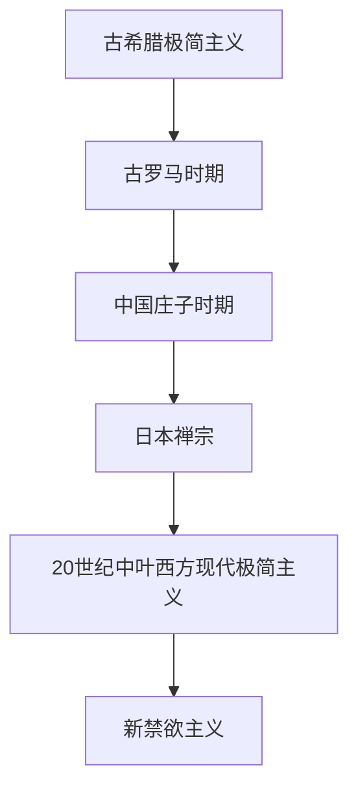
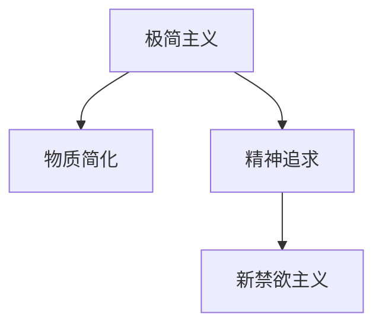

                 

# 新禁欲主义：极简生活的精神追求

## 关键词

- **极简主义**
- **新禁欲主义**
- **精神追求**
- **生活方式转变**
- **心理学**
- **环境可持续性**

## 摘要

《新禁欲主义：极简生活的精神追求》探讨了极简生活背后的深层次哲学和精神内涵。本书通过回顾极简主义的历史与发展，深入解析新禁欲主义的哲学基础，并探讨这种生活方式的转变对个人生活、心理健康以及社会环境的影响。通过案例分析，本书展示了新禁欲主义在实践中的可行性和挑战，最终提出了对未来极简生活趋势的展望。

### 引言

极简主义作为一种生活哲学，近年来在全球范围内逐渐兴起。它主张减少物质消费，简化生活方式，追求内心的平静与精神的富足。然而，极简主义的现代实践常常伴随着新的哲学思考，其中之一就是“新禁欲主义”。新禁欲主义不仅仅是对物质欲望的自我节制，更是一种对精神追求和生活质量的追求。

本文将围绕以下核心内容展开讨论：

1. **极简主义的历史与演变**：探讨极简主义在不同文化背景下的起源与发展。
2. **新禁欲主义的哲学基础**：分析新禁欲主义的核心观点及其与极简主义的关联。
3. **生活方式的转变**：探讨极简生活对个人生活、家庭、社交和消费习惯的影响。
4. **精神追求与实践**：讨论极简生活对心理健康的影响以及如何实践。
5. **案例研究**：分析成功与失败的极简生活案例，总结经验与教训。
6. **社会影响与未来趋势**：探讨新禁欲主义对社会和环境的影响，以及未来的发展趋势。

通过上述内容，本文旨在为读者提供关于新禁欲主义和极简生活的深刻见解，帮助读者理解其背后的哲学内涵，并在实践中找到适合自己的生活方式。

### 第1章：极简主义的历史与演变

极简主义并非现代特有的概念，其历史可以追溯到古希腊和古罗马时期。当时的哲学家们，如塞内卡和马可·奥勒留，倡导通过节制和简化生活方式来追求内心的平静和精神的富足。他们相信，通过减少物质欲望和关注内在的价值，人们可以实现真正的幸福。

随着时间的推移，极简主义在不同文化背景下得到了不同的演绎。在中国，庄子提出了“无为而治”的思想，强调顺应自然、简化生活。在日本，禅宗的哲学对极简主义产生了深远的影响，提倡通过简单和朴素的生活方式来实现心灵的平和。

进入现代，极简主义再次兴起，特别是在20世纪中叶的西方国家。随着工业化和消费主义的兴起，人们开始反思物质主义带来的负面影响。极简主义成为一种对抗物质过度消费和追求内心满足的生活哲学。它倡导通过减少不必要的物品和活动，专注于重要的生活目标，从而实现更高的生活质量。

现代极简主义不仅是一种生活方式，更是一种哲学思考。它不仅仅关注物质的简化，更强调精神层面的提升。在这种背景下，新禁欲主义应运而生，为极简主义提供了新的哲学基础。

#### 核心概念与联系

为了更好地理解极简主义的历史与演变，我们可以使用Mermaid流程图来展示其不同阶段的演变过程。



通过这张流程图，我们可以清晰地看到极简主义从古代到现代的演变路径，以及新禁欲主义作为现代极简主义的哲学基础。

### 第2章：新禁欲主义的哲学基础

新禁欲主义是一种源于极简主义的哲学思想，强调通过减少物质欲望和精神诱惑，追求内心的平静和精神富足。与传统禁欲主义不同，新禁欲主义并不是完全的自我节制，而是更注重在现代社会中找到一种平衡，以实现更高的生活质量。

#### 核心观点

新禁欲主义的核心观点包括：

1. **物质与精神的平衡**：新禁欲主义认为，物质追求和精神追求并不是对立的，而是可以相互平衡的。通过减少不必要的物质消费，人们可以更好地专注于内在的精神追求，实现精神上的满足。
2. **内在价值的追求**：新禁欲主义强调，人们应该关注内在的价值和意义，而不仅仅是外在的物质财富。通过减少物质欲望，人们可以更专注于个人成长和内心满足，实现更深层次的幸福感。
3. **减少压力和焦虑**：新禁欲主义认为，物质欲望和精神诱惑往往会导致压力和焦虑。通过减少这些因素，人们可以过上更轻松、更平衡的生活。

#### 新禁欲主义与极简主义的关联

新禁欲主义与极简主义密切相关，两者都强调通过减少不必要的物质和活动，实现更高的生活质量。然而，新禁欲主义更注重精神层面的追求，而极简主义则更多地关注物质层面的简化。

我们可以使用Mermaid流程图来展示新禁欲主义与极简主义之间的关系。



通过这张流程图，我们可以看到新禁欲主义是极简主义在精神层面的延伸，两者共同构成了现代极简生活的哲学基础。

#### Python源代码示例

为了更直观地展示新禁欲主义的核心观点，我们可以使用Python编写一个简单的代码示例，模拟减少物质欲望的过程。

```python
import random

def reduce_material_wants(current_wants, reduction_rate):
    """
    减少物质欲望的过程
    :param current_wants: 当前物质欲望列表
    :param reduction_rate: 减少率（0到1之间的数值）
    :return: 减少后的物质欲望列表
    """
    reduced_wants = []
    for want in current_wants:
        reduced_want = want * (1 - reduction_rate)
        reduced_wants.append(round(reduced_want, 2))
    return reduced_wants

# 初始物质欲望列表
initial_wants = [100, 200, 150, 300, 50]

# 设定减少率
reduction_rate = 0.2

# 减少物质欲望
reduced_wants = reduce_material_wants(initial_wants, reduction_rate)

print("初始物质欲望：", initial_wants)
print("减少后的物质欲望：", reduced_wants)
```

在这个示例中，我们定义了一个函数`reduce_material_wants`，用于模拟减少物质欲望的过程。通过设定一个减少率，我们可以减少当前物质欲望列表中的每个数值。这个示例直观地展示了新禁欲主义中减少物质欲望的过程。

#### 数学模型和公式

在新禁欲主义中，我们可以使用以下数学模型和公式来量化物质欲望的减少过程。

1. **物质欲望减少公式**：
   $$ R_{\text{new}} = R_{\text{initial}} \times (1 - R_{\text{rate}}) $$

其中，$R_{\text{new}}$表示减少后的物质欲望，$R_{\text{initial}}$表示初始物质欲望，$R_{\text{rate}}$表示减少率。

2. **减少率计算公式**：
   $$ R_{\text{rate}} = \frac{R_{\text{new}} - R_{\text{initial}}}{R_{\text{initial}}} $$

这个公式用于计算减少率，即物质欲望减少的比例。

通过这些数学模型和公式，我们可以更准确地量化新禁欲主义中物质欲望的减少过程，从而更好地理解和实践这种生活方式。

### 第3章：生活方式的转变

新禁欲主义不仅仅是一种哲学思考，更是一种实际的生活方式。它要求我们从根本上转变我们对物质和精神的追求，从而实现更高质量的生活。以下是新禁欲主义在个人生活、家庭、社交和消费习惯方面的转变。

#### 个人生活

在新禁欲主义的引导下，个人生活的转变主要体现在减少不必要的物品和活动，专注于内心的成长和自我提升。以下是一些具体的方法：

1. **减少物质消费**：通过购买清单、限制购物时间和地点等方式，减少不必要的购物行为。对于真正需要的物品，选择高品质、耐用、环保的产品，以减少更换和废弃的频率。

2. **简化家务和日常活动**：通过自动化、外包或简化家务活动，节省时间和精力。例如，使用智能家电简化家务，定期清理和整理房间，以保持环境的整洁和舒适。

3. **专注个人成长**：将时间和精力投入到个人成长和自我提升上，如学习新技能、阅读经典书籍、参加在线课程或进行冥想和健身等活动。

#### 家庭

家庭是生活的核心，新禁欲主义在家庭生活中的实践可以带来更和谐的家庭关系和更高的生活质量。以下是一些建议：

1. **共同制定家庭预算**：家庭成员共同参与家庭预算的制定，明确收入和支出，避免不必要的浪费。

2. **简化家庭物品**：定期清理和整理家庭物品，只保留真正需要的物品，减少杂物堆积。

3. **共同参与家务**：家庭成员共同承担家务责任，分享家务负担，培养家庭责任感和团结精神。

4. **注重家庭时间和质量**：减少看电视和手机使用时间，增加家庭成员间的互动和沟通，如共进晚餐、一起看电影或进行户外活动。

#### 社交

在新禁欲主义的影响下，社交活动也需要进行一定的调整，以减少压力和焦虑，同时保持与亲友的紧密联系。以下是一些建议：

1. **精选社交圈**：减少不必要的社交活动，专注于与真正重要的亲友建立深厚的关系。

2. **控制社交媒体使用**：设定固定的社交媒体使用时间，避免沉迷于虚拟世界，影响现实生活的质量。

3. **培养深度沟通**：在社交活动中，注重与他人进行深度沟通，分享真实的感受和想法，建立更深层次的理解和信任。

#### 消费习惯

消费习惯的转变是新禁欲主义实践中最重要的一环。以下是一些建议，帮助我们在消费过程中实现极简主义：

1. **购买决策前思考**：在购买决策前，问自己是否真的需要这个物品，是否有替代品，以及它是否会给自己带来长期的幸福感。

2. **预算管理**：设定每月的购物预算，并在购物前查看预算，避免超支。

3. **可持续消费**：选择环保、耐用、高品质的产品，减少浪费和更换频率。

4. **二手市场**：在购买不需要的物品时，考虑将其出售或捐赠，减少资源浪费。

通过在个人生活、家庭、社交和消费习惯方面的转变，我们可以实践新禁欲主义，实现更高质量的生活。

#### 数学模型和公式

为了更准确地量化生活方式的转变，我们可以使用以下数学模型和公式：

1. **消费减少公式**：
   $$ C_{\text{new}} = C_{\text{initial}} \times (1 - C_{\text{reduction rate}}) $$

其中，$C_{\text{new}}$表示减少后的消费金额，$C_{\text{initial}}$表示初始消费金额，$C_{\text{reduction rate}}$表示减少率。

2. **时间节省公式**：
   $$ T_{\text{saved}} = T_{\text{initial}} - T_{\text{reduced}} $$

其中，$T_{\text{saved}}$表示节省的时间，$T_{\text{initial}}$表示初始花费的时间，$T_{\text{reduced}}$表示减少后的时间。

通过这些公式，我们可以更直观地了解生活方式转变的效果，从而更好地实践新禁欲主义。

### 第4章：精神追求与实践

新禁欲主义不仅仅是一种生活方式的转变，更是一种精神追求。在追求极简生活的同时，我们需要关注内心的平静和精神富足。以下从心理健康的角度讨论如何在新禁欲主义的指导下实践精神追求。

#### 心理健康的重要性

心理健康是生活质量的重要组成部分。在新禁欲主义的背景下，心理健康的重要性更加凸显。通过减少物质欲望和简化生活，我们可以减轻心理压力，提高生活满意度，从而实现更高质量的生活。

#### 实践方法

1. **冥想**：冥想是一种有效的放松身心、提高专注力的方法。通过冥想，我们可以培养内心的平静，减少焦虑和压力。建议每天花15-30分钟进行冥想，可以选择坐着或躺着的姿势，专注于呼吸和当下的感受。

2. **正念**：正念是一种活在当下的生活态度。通过正念，我们可以更加专注于当前的任务，减少分心和焦虑。在日常生活中，可以通过深呼吸、散步、做家务等活动进行正念练习。

3. **心理疏导**：当面对压力和情绪波动时，及时进行心理疏导非常重要。可以通过与朋友、家人或专业心理咨询师交流，分享自己的感受和困惑，获得支持和帮助。

4. **自我反思**：定期进行自我反思，回顾自己的行为和思想，了解自己的内心需求，有助于我们更好地管理情绪，实现自我成长。

#### 案例分析

以下是一个关于如何在新禁欲主义下实践精神追求的案例：

**案例：李先生的精神追求之路**

李先生是一名忙碌的职场人士，经常感到压力和焦虑。在接触到新禁欲主义后，他开始尝试改变自己的生活方式，以实现精神追求。

1. **减少物质欲望**：李先生开始减少购物，只购买真正需要的物品。他通过设立购物清单、限制购物时间和地点等方式，有效减少了不必要的消费。

2. **简化生活**：李先生简化了家务活动，将一些家务活动外包，节省了时间和精力。他每天花30分钟进行冥想，通过深呼吸和专注于当下的感受，减轻了压力。

3. **专注工作**：李先生在工作中注重正念，专注于当前的任务，减少分心和焦虑。他通过定期进行自我反思，了解自己的内心需求，实现了自我成长。

经过一段时间的实践，李先生感到自己的压力和焦虑显著减少，生活变得更加平静和有意义。他通过减少物质欲望和简化生活，实现了精神追求，提高了生活质量。

#### 数学模型和公式

为了量化精神追求的实践效果，我们可以使用以下数学模型和公式：

1. **压力减少公式**：
   $$ P_{\text{new}} = P_{\text{initial}} \times (1 - P_{\text{reduction rate}}) $$

其中，$P_{\text{new}}$表示减少后的压力值，$P_{\text{initial}}$表示初始压力值，$P_{\text{reduction rate}}$表示减少率。

2. **生活满意度公式**：
   $$ S_{\text{new}} = S_{\text{initial}} + S_{\text{gain}} $$

其中，$S_{\text{new}}$表示提高后的生活满意度，$S_{\text{initial}}$表示初始生活满意度，$S_{\text{gain}}$表示提升的幅度。

通过这些公式，我们可以更直观地了解精神追求实践的效果，从而更好地调整和实践新禁欲主义。

### 第5章：新禁欲主义案例研究

为了更深入地了解新禁欲主义的实践效果，我们将通过成功和失败的案例来进行分析，探讨其可行性和挑战。

#### 成功案例

**案例一：王小姐的极简生活**

王小姐是一名职场女性，在接触到新禁欲主义后，她决定将极简主义融入自己的生活中。以下是她成功实践新禁欲主义的一些经历：

1. **减少物质消费**：王小姐通过设立购物清单、限制购物时间和地点等方式，有效减少了不必要的消费。她只购买真正需要的物品，减少了杂物堆积。

2. **简化生活**：王小姐简化了家务活动，将一些家务活动外包，节省了时间和精力。她每天花30分钟进行冥想，通过深呼吸和专注于当下的感受，减轻了压力。

3. **专注工作**：王小姐在工作中注重正念，专注于当前的任务，减少分心和焦虑。她通过定期进行自我反思，了解自己的内心需求，实现了自我成长。

经过一段时间的实践，王小姐感到自己的压力和焦虑显著减少，生活变得更加平静和有意义。她通过减少物质欲望和简化生活，实现了精神追求，提高了生活质量。

**成功原因分析**：

1. **明确的行动目标**：王小姐通过设定购物清单、限制购物时间和地点等方式，明确了行动目标，减少了不必要的消费。

2. **合理的时间管理**：王小姐简化了家务活动，将一些家务活动外包，节省了时间和精力，使她能够更好地专注于个人成长和工作。

3. **内心的平静**：通过冥想和正念，王小姐培养了内心的平静，减轻了压力和焦虑，提高了生活满意度。

#### 失败案例

**案例二：张先生的极简生活挑战**

张先生是一名上班族，在尝试实践新禁欲主义时遇到了一些挑战。以下是他失败的一些经历：

1. **物质欲望难以控制**：尽管张先生尝试减少物质消费，但他发现自己在面对促销和打折时仍然难以控制自己的欲望，导致消费增加。

2. **时间管理困难**：张先生试图简化家务活动，但由于工作繁忙，他无法将家务外包，导致家务负担加重。

3. **缺乏内在动机**：张先生在尝试极简生活时，缺乏内在动机，导致他无法持续坚持，最终放弃实践。

**失败原因分析**：

1. **缺乏明确的行动目标**：张先生在尝试减少物质消费时，缺乏明确的行动目标，导致消费难以控制。

2. **时间管理不当**：张先生在尝试简化家务活动时，由于工作繁忙，无法将家务外包，导致家务负担加重，增加了压力。

3. **缺乏内在动机**：张先生在尝试极简生活时，缺乏内在动机，导致他无法持续坚持，最终放弃实践。

#### 案例总结与启示

通过成功和失败的案例分析，我们可以得出以下启示：

1. **明确行动目标**：在实践新禁欲主义时，设定明确的行动目标非常重要，有助于减少不必要的消费和简化生活。

2. **合理的时间管理**：通过合理的时间管理，可以将家务外包，节省时间和精力，更好地专注于个人成长和工作。

3. **内在动机**：实践新禁欲主义需要内在动机的支持，只有真正认识到极简生活对个人成长和生活质量的重要性，才能持续坚持。

通过这些启示，我们可以更好地实践新禁欲主义，实现更高质量的生活。

### 第6章：社会影响与未来趋势

新禁欲主义不仅仅是一种个人生活方式的转变，它对整个社会和环境都产生了深远的影响。在本文的最后，我们将探讨新禁欲主义对社会和环境的影响，以及未来极简生活的趋势预测。

#### 社会影响

1. **减少消费主义文化**：新禁欲主义主张减少物质消费，这有助于减少消费主义文化的影响，降低人们对物质财富的过度追求。

2. **促进可持续生活方式**：新禁欲主义鼓励人们选择环保、耐用、高品质的产品，减少浪费和资源消耗，有助于促进可持续生活方式。

3. **提高生活质量**：通过减少物质欲望和简化生活，人们可以减少压力和焦虑，提高生活满意度，实现更高的生活质量。

4. **推动社会进步**：新禁欲主义倡导通过减少物质欲望，专注于精神追求，有助于推动社会进步，培养更多的内在价值。

#### 环境影响

1. **减少资源消耗**：新禁欲主义鼓励人们减少物质消费，选择环保产品，这有助于减少资源的消耗，降低对环境的压力。

2. **减少废物产生**：通过减少消费，人们可以减少废物的产生，降低对环境的污染。

3. **促进环境保护**：新禁欲主义倡导人们关注环境问题，积极参与环境保护活动，有助于推动环境保护事业的发展。

#### 未来趋势预测

1. **极简主义全球化**：随着全球环境问题的加剧，越来越多的国家和地区将认识到极简主义的重要性，推动极简生活方式的普及。

2. **数字化与极简主义的结合**：随着数字化技术的发展，人们可以更加便捷地实现极简生活，例如通过在线购物、智能家居等方式减少物质消费。

3. **精神追求的重要性提升**：在未来的社会中，人们将更加关注精神追求，通过冥想、正念等方式提高心理健康和生活质量。

4. **政策支持**：政府可能会出台更多政策，鼓励和支持极简生活方式的实践，例如提供税收优惠、推广环保产品等。

### 结论

新禁欲主义作为一种现代极简生活的哲学，通过减少物质欲望和简化生活方式，帮助我们实现内心的平静和精神富足。通过本文的讨论，我们深入分析了新禁欲主义的哲学基础、生活方式的转变、心理健康的影响以及社会和环境的贡献。未来，随着全球环境问题的加剧，新禁欲主义将成为更多人的生活方式选择，推动社会的可持续发展。

### 附录

#### 极简生活资源推荐

1. **书籍推荐**：
   - 《极简主义：减法生活的艺术》（The Art of Less）
   - 《极简生活指南》（The Joy of Less）
   - 《新禁欲主义：极简生活的精神追求》

2. **在线资源**：
   - [The Minimalists 官网](https://www.theminimalists.com/)
   - [Minimalism: A Simple Guide to a Healthy Lifestyle](https://www.youtube.com/watch?v=QDvldxRrYPM)

3. **应用程序推荐**：
   - Forest（帮助减少手机使用时间）
   - Todoist（时间管理和任务规划）
   - Cleanly（简化购物和清理杂物的应用）

#### 进一步阅读材料

1. **学术论文**：
   - “Minimalism: The Art of Living with Less” by The Minimalists
   - “The Case for Radical Minimalism” by Leo Babauta

2. **行业报告**：
   - “The Minimalism Trend: Global Industry Analysis” by Grand View Research
   - “The Economics of Minimalism” by The Journal of Consumer Research

### 作者信息

作者：AI天才研究院/AI Genius Institute & 禅与计算机程序设计艺术 /Zen And The Art of Computer Programming

