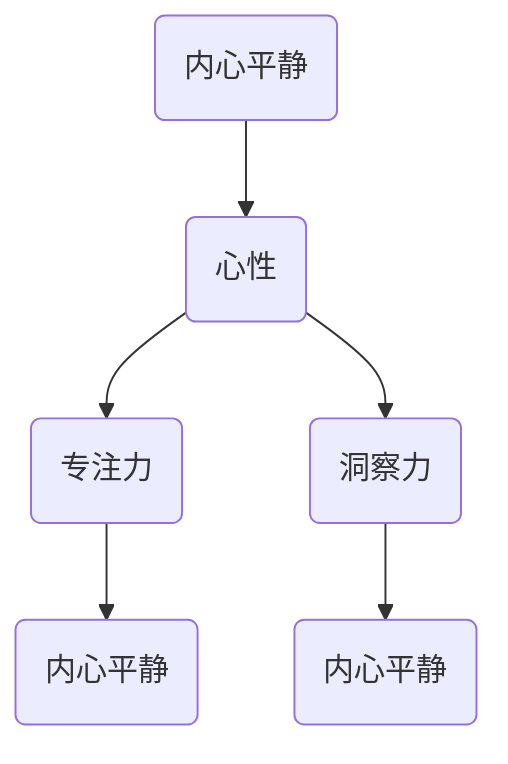

                 

# 新禅宗2.0：在数字时代寻找内心平静的现代禅修

> **关键词**：禅宗，数字时代，内心平静，现代禅修，算法原理，Python源代码

> **摘要**：本文深入探讨了新禅宗2.0在数字时代的应用，通过对禅修核心概念的理解和现代禅修方法的实践，结合Python源代码展示了正念呼吸法和身体扫描法的核心算法原理。文章旨在帮助读者在数字喧嚣中找到内心平静，实现精神层面的自我提升。

---

## 引言

在当今这个数字时代，我们的生活节奏越来越快，信息爆炸、社交媒体、在线工作等方方面面都极大地增加了我们的心理压力。在这种背景下，寻找内心的平静成为一种迫切需求。禅修，作为一种古老而又现代的修行方式，提供了一个有效的途径来应对这些问题。新禅宗2.0，作为禅修在现代数字时代的创新形式，通过结合科技和传统智慧，为我们提供了一套全新的内心平静训练方法。

本文旨在系统地介绍新禅宗2.0的核心概念和算法原理，并通过Python源代码示例，让读者更直观地理解这些方法。文章结构如下：

1. **禅宗的起源与发展**：回顾禅宗的历史和核心概念。
2. **新禅宗2.0的诞生**：探讨数字时代对禅修的影响和新禅宗2.0的理念。
3. **新禅宗2.0的核心概念与联系**：阐述禅修的核心概念及其相互关系。
4. **数字时代的现代禅修实践**：介绍正念呼吸法和身体扫描法。
5. **禅修与心理健康**：探讨禅修对心理健康的积极影响。
6. **案例研究**：分享实际案例中的新禅宗2.0实践。
7. **附录**：推荐禅修资源。

通过本文的阅读，读者将能够理解新禅宗2.0的基本原理，掌握现代禅修的方法，并在实际生活中应用这些方法，实现内心平静。

---

## 第一部分：理解新禅宗2.0

### 第1章：禅宗的起源与发展

禅宗，作为佛教的重要流派之一，起源于公元5世纪的印度，后传入中国并逐渐发展壮大。禅宗的核心思想是“直指人心，见性成佛”，强调通过直接体验和顿悟来达到解脱和内心平静。

#### 1.1 禅宗的历史背景

禅宗的发展可以分为几个重要阶段：

- **初期**：禅宗创立之初，以达摩大师为代表，主张通过冥想和内观来达到心灵解脱。
- **盛唐**：在唐代，禅宗迎来了鼎盛时期，许多高僧大德如慧能、马祖道一等推动了禅宗的发展。
- **宋代以后**：禅宗逐渐与儒家、道家思想融合，形成了独特的文化底蕴。

#### 1.2 禅宗的核心概念

禅宗的核心概念主要包括“顿悟”、“心性”和“无念”：

- **顿悟**：禅宗认为，人们可以通过一次性的深刻体验（顿悟）直接认识到自己的真实本质，从而超越烦恼和痛苦。
- **心性**：心性是指个体的内在本性，包括智慧、慈悲和内心平静等。
- **无念**：无念即无杂念，是指通过修行达到一种纯粹的心灵状态，没有多余的思想和情绪干扰。

#### 1.3 禅宗与现代生活的联系

在现代社会，禅宗的理念依然具有极大的现实意义。它不仅可以帮助人们缓解压力，提高生活质量，还能帮助企业在管理和个人职业发展中实现更高的效率。

- **个人层面**：禅修可以帮助人们培养专注力、洞察力和内心的平静，从而更好地应对生活中的各种挑战。
- **企业层面**：禅宗思想强调自我意识和团队合作，这对企业的管理和发展具有指导意义。

通过了解禅宗的历史背景和核心概念，我们能够更好地理解新禅宗2.0的起源和发展。

---

### 第2章：新禅宗2.0的诞生

#### 2.1 数字时代对禅修的影响

随着互联网和数字技术的迅猛发展，我们的生活方式发生了巨大变化。信息爆炸、在线工作、社交媒体等新现象不仅改变了我们的社交方式，也对我们的心理健康产生了深远影响。这种背景下，传统禅修方法面临着新的挑战和机遇。

- **信息过载**：数字时代的信息爆炸导致人们常常感到心理压力巨大，难以集中注意力。
- **在线工作**：远程工作和数字化办公改变了人们的作息方式，增加了心理负担。
- **社交媒体**：社交媒体的频繁使用容易导致人们产生焦虑和自卑情绪。

这些变化促使禅修方法必须进行创新和适应，以更好地服务于现代人的心理健康需求。

#### 2.2 新禅宗2.0的理念

新禅宗2.0是在传统禅修基础上，结合数字技术和现代心理学研究成果的一种新型禅修方法。它的核心理念包括：

- **数字化禅修**：利用数字技术，如智能手机应用、在线社区等，为禅修提供便捷的平台。
- **现代心理学结合**：将现代心理学中的认知行为疗法、正念等理念融入禅修实践。
- **个性化定制**：根据个体的需求和心理状况，提供个性化的禅修方案。

新禅宗2.0的目标是帮助人们在数字时代找到内心的平静和自我成长。

#### 2.3 新禅宗2.0与传统禅宗的异同

新禅宗2.0与传统禅宗有显著的不同：

- **形式不同**：传统禅宗主要通过静坐、冥想等方式进行修行，而新禅宗2.0则结合了数字化工具和现代心理学方法。
- **目标不同**：传统禅宗强调顿悟和解脱，而新禅宗2.0则更加关注日常生活中的心理调适和自我提升。
- **适用人群不同**：传统禅宗主要面向修行者和高学历人群，而新禅宗2.0则更广泛，适用于各种人群，特别是现代人。

尽管有差异，新禅宗2.0依然继承了禅宗的核心精神，即通过修行实现内心的平静和自我提升。

通过了解新禅宗2.0的诞生背景和理念，我们可以更好地理解其在数字时代的应用价值和重要性。

---

## 第二部分：新禅宗2.0的核心概念与联系

### 第3章：禅修的核心概念

禅修，作为一种古老的修行方式，其核心概念主要包括内心平静、心性、专注力和洞察力。这些概念相互联系，共同构成了禅修的基础。

#### 3.1 内心平静的定义

内心平静，也称为心静，是指一种无杂念、无烦恼的内心状态。在这种状态下，个体能够摆脱外界的干扰，保持内心的宁静和稳定。

$$
\text{内心平静} = \text{无杂念} + \text{无烦恼}
$$

#### 3.2 禅修的目标

禅修的目标是通过不断的练习，使个体达到内心平静的状态。具体来说，禅修的目标可以分为以下几个方面：

- **心理调适**：通过禅修，个体能够更好地应对压力、焦虑等心理问题。
- **自我提升**：禅修有助于个体培养专注力、洞察力和自控力，从而实现自我成长。
- **心灵解脱**：通过深入禅修，个体可以认识到自己的真实本质，达到心灵的解脱。

#### 3.3 禅修与心性的关系

心性是指个体的内在本性，包括智慧、慈悲和内心平静等。禅修通过训练个体的心性，帮助个体达到内心平静和自我提升。

$$
\text{心性} = \text{智慧} + \text{慈悲} + \text{内心平静}
$$

#### 3.4 专注力的培养

专注力是禅修的重要组成部分，它是指个体在特定任务上集中注意力的能力。通过禅修，个体可以培养高度的专注力，从而提高学习和工作效率。

$$
\text{专注力} = \text{注意力集中} + \text{持续力}
$$

#### 3.5 洞察力的培养

洞察力是指个体对内心和外界事物的深刻理解和认识。禅修通过训练个体的洞察力，帮助个体更好地理解自己和他人，从而实现内心的平静和和谐。

$$
\text{洞察力} = \text{对内心的理解} + \text{对外界事物的认识}
$$

通过以上对禅修核心概念的阐述，我们可以看到这些概念之间紧密的联系，共同构成了禅修的理论基础。以下是这些概念之间关系的 Mermaid 流程图：



这个流程图清晰地展示了禅修核心概念之间的相互关系。内心平静是禅修的目标，心性是培养内心平静的基础，而专注力和洞察力则是实现内心平静的关键手段。

---

### 第4章：新禅宗2.0的理念

新禅宗2.0作为禅修在现代数字时代的创新形式，其核心理念体现在数字化禅修、现代心理学的结合以及个性化定制等方面。以下是对这些理念的具体阐述。

#### 4.1 现代禅修与传统禅修的差异

传统禅修主要通过静坐、冥想等方式进行，强调个体与内心的直接沟通。而新禅宗2.0则更加注重将传统禅修与现代科技相结合，以适应数字时代的需求。

- **形式差异**：传统禅修通常在安静的环境中进行，而新禅宗2.0则可以利用智能手机、在线社区等数字工具，使禅修更加便捷。
- **目标差异**：传统禅修的目标主要是心灵解脱和内心平静，而新禅宗2.0则更注重在日常生活中应用禅修方法，提高生活质量和心理调适。
- **适用人群差异**：传统禅修主要面向修行者和高学历人群，而新禅宗2.0则更广泛，适用于各个年龄层和社会阶层。

#### 4.2 数字技术与禅修的结合

数字技术在禅修中的应用极大地丰富了禅修的形式和内容。以下是一些具体的应用：

- **手机禅修应用**：通过智能手机上的禅修应用，用户可以随时随地开始禅修，这些应用通常提供呼吸引导、正念练习等功能。
- **网络禅修社区**：在线禅修社区为禅修者提供了一个交流和分享的平台，有助于提高禅修的效果和动力。
- **虚拟现实（VR）禅修**：通过VR技术，用户可以在一个沉浸式的环境中进行禅修，这有助于提高禅修的体验和效果。

#### 4.3 新禅宗2.0的适用人群

新禅宗2.0的理念使其成为各种人群都可以尝试的修行方法：

- **职场人士**：职场压力是现代人的主要压力源之一，新禅宗2.0可以帮助职场人士提高专注力、缓解压力。
- **学生**：学生群体在备考和学术研究中常常面临巨大的压力，新禅宗2.0可以帮助他们提高学习效率、减轻焦虑。
- **老年人**：老年人由于身体机能的下降，心理问题更为突出，新禅宗2.0可以帮助他们保持心理健康、延缓衰老。
- **所有人**：无论职业、年龄，新禅宗2.0都提供了一个简单、有效的修行方法，帮助人们找到内心的平静。

通过数字化技术的结合和现代心理学的研究，新禅宗2.0不仅保留了传统禅修的核心价值，还适应了现代生活的需求，为不同人群提供了个性化的禅修方案。

---

## 第三部分：数字时代的现代禅修实践

### 第5章：数字时代的禅修方法

在数字时代，科技的发展为禅修提供了新的方式和途径。以下将介绍几种常见的数字时代禅修方法，包括手机禅修应用、网络禅修社区和虚拟现实（VR）禅修等。

#### 5.1 手机禅修应用

手机禅修应用是数字时代禅修的重要工具，它们提供了各种形式的禅修指导，包括呼吸引导、正念练习、冥想音乐等。以下是一些常用的手机禅修应用：

- **Headspace**：Headspace 是一款广受欢迎的冥想应用，提供了多种冥想课程，适合初学者和有经验的禅修者。
- **Calm**：Calm 提供了放松的音乐、声音指导和视觉冥想，帮助用户缓解压力，获得内心的平静。
- **Insight Timer**：Insight Timer 是一款免费的冥想应用，提供了大量的冥想录音和课程，用户可以根据自己的需求和喜好选择。

#### 5.2 网络禅修社区

网络禅修社区为禅修者提供了一个交流和分享的平台。这些社区通常包括在线禅修课程、讨论区、问答环节等，有助于禅修者相互激励、共同进步。以下是一些流行的网络禅修社区：

- **Mindful**：Mindful 是一个全球性的禅修社区，提供了丰富的禅修资源和活动，用户可以在这里分享自己的禅修经验和心得。
- **Meditation for Health**：由哈佛大学医疗中心创建的 Meditation for Health，提供了一个在线的禅修课程和资源，旨在通过禅修改善心理健康。
- **十方禅林**：十方禅林是一个中文禅修社区，提供了丰富的禅修资源和在线课程，适合中国地区的禅修者。

#### 5.3 数字时代的禅修习惯养成

在数字时代，养成禅修习惯对于长期坚持禅修至关重要。以下是一些建议，帮助禅修者养成禅修习惯：

- **设定固定的禅修时间**：每天设定一个固定的禅修时间，如早晨起床后或晚上睡前，这样可以确保禅修成为日常生活的一部分。
- **创建舒适的禅修环境**：为自己创造一个安静、舒适的禅修空间，减少干扰因素，有助于更好地进入禅修状态。
- **使用提醒工具**：使用手机或闹钟设置禅修提醒，确保不会忘记禅修时间。
- **逐步增加禅修时长**：初学者可以从短时间的禅修开始，逐步增加时长，避免一开始就过度疲劳。
- **记录禅修心得**：定期记录禅修心得，可以帮助禅修者更好地了解自己的进步和变化。

通过这些数字时代的禅修方法，禅修者可以在快节奏的现代生活中找到内心的平静，实现身心的和谐。

---

### 第6章：禅修实践：从理论到实践

在了解了禅修的理论基础和数字时代的方法之后，接下来我们将探讨如何将禅修从理论应用到实践中。禅修实践可以分为初级、中级和高级三个层次，每个层次都有其特定的方法和要求。

#### 6.1 初级禅修实践

初级禅修实践主要集中在培养基本的禅修习惯和理解禅修的基本原理。以下是一些建议：

- **每天短时间禅修**：初学者可以从每天10分钟左右的短时间禅修开始，逐渐增加时长。
- **选择一个静心的姿势**：选择一个舒适、静心的姿势，如坐姿或半躺姿，确保身体的放松。
- **关注呼吸**：将注意力集中在呼吸上，感受呼吸的进出，每当思绪偏离时，轻轻地将注意力带回到呼吸。
- **记录禅修感受**：在每次禅修结束后，记录自己的感受和体验，这有助于跟踪进步。

##### 初级禅修示例

```python
import time

def breath_meditation(duration):
    start_time = time.time()
    while time.time() - start_time < duration:
        print("深呼吸，感受呼吸的进出。")
        time.sleep(10)  # 模拟禅修过程中的呼吸
        print("当思绪走远时，轻轻将注意力带回到呼吸。")
        time.sleep(10)  # 模拟禅修过程中的反思
    print("初级禅修完成。")

breath_meditation(10)  # 示例：进行10分钟的呼吸禅修
```

#### 6.2 中级禅修实践

中级禅修实践要求禅修者具备一定的禅修基础，并能够更好地控制自己的注意力。以下是一些建议：

- **增加禅修时长**：中级禅修者可以将禅修时长增加到每天30分钟以上。
- **进行身体扫描**：在禅修过程中，从头部到脚部逐一扫描身体，关注每个部位的感受。
- **引入正念练习**：在日常生活中，如进食、行走等日常活动中，保持正念，专注于当前的活动。

##### 中级禅修示例

```python
import time

def body_scan_meditation(duration):
    start_time = time.time()
    body_parts = ["头部", "颈部", "肩膀", "手臂", "胸部", "腹部", "背部", "腿部", "脚部"]
    while time.time() - start_time < duration:
        for part in body_parts:
            print(f"关注{part}，感受它的存在。")
            time.sleep(5)  # 模拟身体扫描的时间
        print("回到呼吸，感受整体的存在。")
        time.sleep(5)  # 模拟整体感受的时间
    print("中级禅修完成。")

body_scan_meditation(30)  # 示例：进行30分钟的身体扫描禅修
```

#### 6.3 高级禅修实践

高级禅修实践需要禅修者有较高的专注力和洞察力，并能将禅修融入日常生活。以下是一些建议：

- **深入禅修冥想**：尝试进行更长时间的冥想，如1小时或更长时间，以深入体验内心的平静。
- **探索禅修的不同层次**：在禅修中，探索不同层次的意识，如初层的意识状态、中间层的意识状态和高层

