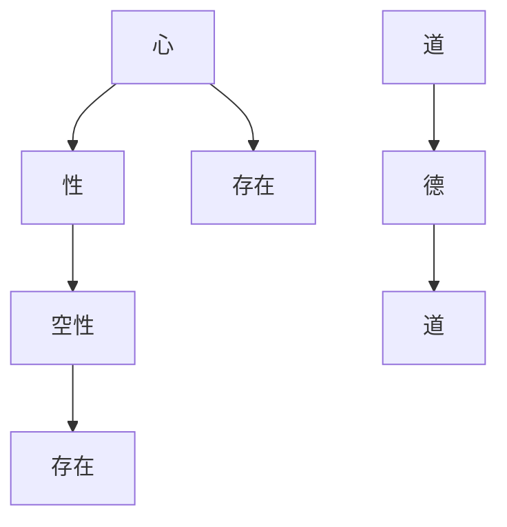

                 

### 引言

在现代快节奏的生活中，人们常常感到压力和疲惫，似乎被琐碎的事务所淹没，难以找到内心的平静。这种现状引发了人们对生活质量和精神层次的关注。于是，《新禅宗主义工作坊：在日常琐事中寻找顿悟》应运而生，旨在通过禅宗的哲学和修行方法，帮助人们在日常琐事中发现生活的真谛，实现内心的宁静与平和。

禅宗，源自于佛教，是一种强调直接体验和内在觉醒的修行方式。其核心理念是“心即佛”，强调通过内心的修炼，达到与宇宙万物合一的境界。禅宗的修行方法多样，包括静坐、冥想、观心等，这些方法在日常生活中都可以进行，从而帮助人们在繁忙的生活中找到片刻的宁静与清明。

本文将围绕禅宗主义工作坊的主题，系统地探讨禅宗的历史与发展、核心概念与联系、日常生活中的禅修实践、从琐事中寻找顿悟的方法、禅宗工作坊的组织与实施，以及禅宗工作坊的未来与发展。通过这些内容的深入分析，我们希望能帮助读者理解禅宗的精髓，并在日常生活中找到顿悟，提升生活质量。

关键词：禅宗、工作坊、顿悟、日常实践、内心宁静

摘要：本文旨在探讨禅宗主义工作坊如何在日常琐事中引导人们寻找顿悟，提升个人精神境界。通过分析禅宗的历史、核心概念、修行方法，以及实际工作坊的实施案例，本文揭示了禅宗在现代社会中的独特价值和应用前景。文章结构清晰，逻辑严密，有助于读者更好地理解和实践禅宗的智慧。

---

### 第一部分：禅宗主义基础

#### 第1章：禅宗的历史与哲学

#### 1.1 禅宗的起源与发展

禅宗，是佛教的一个重要流派，其起源可以追溯到公元五世纪初的印度。创始人菩提达摩（Bodhidharma）是一位著名的僧人，他东渡来到中国，将佛教的修行方法带到中原。禅宗的核心思想是通过直接的内心体验，达到觉悟的境界，这与传统的佛教修行方法有所不同。

禅宗在中国的发展历程中，经历了多个重要阶段。首先，禅宗在中国南北朝时期初步形成，随后在唐朝时期达到鼎盛。唐代的高僧如慧能（Huineng）和马祖道一（Dashu Daoyi）等人，对禅宗的传播和发展做出了巨大贡献。慧能创立的南宗禅宗，强调“直指人心，见性成佛”，这一理念深深影响了后世的禅宗发展。

#### 1.1.1 佛教与禅宗的关联

禅宗是佛教的一个重要分支，其与佛教的关系密不可分。佛教的核心教义是四圣谛、八正道，强调通过修行，达到涅槃的境界。禅宗在此基础上，提出了“心即佛”的理念，认为每个人的内心都有佛性，只要通过修炼，就能发现并实现自己的佛性。

禅宗与佛教的不同之处在于，它强调直接体验和顿悟，而非通过繁琐的宗教仪式和长时间的修行。禅宗认为，真理是直接的，可以通过内心的体验感知到。这一理念使得禅宗在佛教中具有独特的地位，吸引了大量信徒和学者。

#### 1.1.2 禅宗在中国的发展

禅宗在中国的发展历程中，有许多重要的里程碑。唐朝时期，禅宗达到了鼎盛，成为佛教界的主导力量。当时，禅宗寺院遍布全国，许多高僧大德如六祖慧能、马祖道一、百丈怀海等人在各地弘扬禅宗教义，使得禅宗思想深入人心。

在宋代，禅宗继续发展，出现了许多重要的禅宗学派，如临济宗、曹洞宗等。这些学派在禅宗教义的基础上，发展出各自独特的修行方法和理论体系。禅宗的思想也逐渐渗透到中国的文化、艺术、哲学等领域，对后世产生了深远的影响。

#### 1.1.3 禅宗在日本的传播

禅宗不仅在中国取得了巨大的成功，还在日本产生了深远的影响。公元九世纪，禅宗教义传入日本，很快受到日本武士阶层的喜爱。禅宗的修行方法，强调内心的修炼和精神的独立，与武士道精神相契合，因此在日本迅速传播开来。

在日本，禅宗形成了独特的日本禅宗，如临济宗、曹洞宗等。日本禅宗不仅影响了日本的宗教和文化，还渗透到日本的哲学、文学、艺术等领域。许多著名的日本艺术家，如画家、作家、诗人等，都在作品中体现了禅宗的思想。

#### 1.2 禅宗的核心教义

禅宗的核心教义包括空性、无我、心即佛等，这些教义构成了禅宗哲学的基石。

#### 1.2.1 空性与无我

空性（Sunyata）是禅宗哲学中的一个核心概念，它强调一切现象都是空无自性的，没有固定的本质。空性并非虚无，而是指一切事物的相对性和变化性。无我（Anatman）则是指个体没有固定的自我，自我是不断变化的，没有永恒不变的本质。

空性与无我的理念，要求修行者放下对自我和事物的执着，从而实现内心的平静和觉悟。通过理解和体验空性，修行者能够超越世俗的烦恼，达到与宇宙万物合一的境界。

#### 1.2.2 心即佛

心即佛（Hsin is Buddha）是禅宗的另一个重要教义，它强调每个人的内心都有佛性，只要通过修炼，就能发现并实现自己的佛性。心即佛的理念，打破了传统的宗教观念，强调每个人都可以通过自己的努力，实现觉悟。

心即佛的教义，鼓励修行者直接体验内心的真实，而不是依赖外在的宗教仪式。这一理念使得禅宗在修行方法上更加灵活和直接，更容易被人们接受。

#### 1.2.3 直指人心，见性成佛

直指人心，见性成佛（Direct pointing to the mind, seeing one's nature and becoming a Buddha）是禅宗的修行方法之一，它强调直接引导修行者认识到内心的真实，从而实现觉悟。

直指人心的方法，通常通过师徒之间的对话和互动进行。师父通过提问、启发和指导，帮助修行者认识到内心的佛性。这一过程强调直接体验，而不是通过繁琐的理论和教义。

见性成佛，是指通过直接体验内心的佛性，实现觉悟。这一过程可能是瞬间的，也可能是长期的。但无论如何，它都是修行者内心觉醒的标志，是禅宗修行的最终目标。

#### 1.3 禅宗的修行方法

禅宗的修行方法多样，包括禅修、静坐、冥想等。这些方法都可以在日常生活中进行，帮助修行者找到内心的宁静和平和。

#### 1.3.1 禅修与静坐

禅修（Zen practice）是禅宗的基本修行方法之一，它强调通过静坐，集中注意力，体验内心的平静。禅修的过程中，修行者需要放下杂念，专注于呼吸和身体的感觉，通过不断地练习，达到内心的清净和觉悟。

静坐（Zazen）是禅修的一种形式，它要求修行者长时间地坐在特定的位置，保持身体和呼吸的平稳。静坐的过程中，修行者需要克服身体的疲惫和内心的杂念，通过持续的努力，达到内心的平静。

#### 1.3.2 顿悟与渐修

顿悟（Sudden enlightenment）和渐修（Gradual cultivation）是禅宗修行的两种不同方式。顿悟强调通过一次性的内心体验，实现觉悟。渐修则强调通过长期的修行和积累，逐渐达到觉悟。

禅宗认为，顿悟和渐修并不是对立的，而是可以相互促进的。通过顿悟，修行者可以迅速认识到内心的佛性，从而加速修行进程。而通过渐修，修行者可以更加深入地理解和体验内心的真实，从而更好地实现顿悟。

#### 1.3.3 生活禅

生活禅（Zen in daily life）是禅宗的一个重要理念，它强调将禅宗的修行方法应用到日常生活中。生活禅认为，生活中的每一个细节都包含着禅的智慧，通过在日常生活中修行，修行者可以更好地理解自己和世界，实现内心的平静和觉悟。

生活禅的方法包括在日常生活中保持正念，关注当下的感受，以及与人为善等。通过这些方法，修行者可以在日常生活中找到内心的宁静和平和，从而更好地应对生活中的挑战。

### 总结

禅宗的历史与哲学，是一个博大精深、充满智慧的系统。通过了解禅宗的起源与发展、核心教义和修行方法，我们可以更好地理解禅宗的精髓，并在日常生活中找到顿悟，实现内心的宁静与平和。下一章，我们将深入探讨禅宗中的核心概念和联系，进一步揭示禅宗哲学的内在逻辑和结构。

---

### 第2章：禅宗的核心概念与联系

#### 2.1 禅宗中的核心概念实体

禅宗哲学中包含了一系列核心概念，这些概念构成了禅宗思想的基石。在本节中，我们将探讨这些核心概念，包括心与性、空性与存在、道与德，并分析这些概念之间的内在联系。

#### 2.1.1 心与性

心（Mind）在禅宗哲学中具有重要的地位。禅宗强调“心即佛”，认为每个人的内心都具备佛性。心不仅指代个体的意识活动，还包括潜意识、直觉和灵性。心是修行者体验禅宗智慧、实现觉悟的内在场所。

性（Nature）在禅宗中通常指的是事物的本质或真相。性不仅仅是物质的存在，还包括精神、意识的存在。性是空性的表现，一切现象都是性空无住的，没有固定的本质。

心与性之间的关系，是禅宗哲学的核心之一。禅宗认为，通过修心，修行者可以揭示事物的真性，从而实现内心的平静和觉悟。心与性相互依存，心是性的体验，性是心的本质。

#### 2.1.2 空性与存在

空性（Sunyata）是禅宗哲学中的一个重要概念，它强调一切现象都是空无自性的，没有固定的本质。空性并非虚无，而是指一切现象的相对性和变化性。空性揭示了事物的真实面貌，即一切现象都是相互依存、不断变化的。

存在（Existence）在禅宗哲学中是指事物的实际存在状态。存在与空性是辩证统一的，存在是空性的具体表现，空性是存在的本质。

空性与存在之间的关系，是禅宗哲学的核心议题之一。通过理解和体验空性，修行者可以超越对事物的执着，认识到事物的真实面貌，从而实现内心的平静和觉悟。

#### 2.1.3 道与德

道（Way）在禅宗哲学中指的是宇宙的法则和真理。道是超越个体的，是万物的本源。禅宗认为，通过修行，修行者可以与道相统一，实现内心的觉悟。

德（Virtue）在禅宗哲学中指的是道德品质和行为准则。德是修行者实现道的要求，是通过修行达到道的表现。

道与德之间的关系，是禅宗哲学中的另一个重要议题。道是德的指导，德是道的实践。通过修行，修行者可以实现道与德的统一，达到内心的觉悟。

#### 2.2 概念实体之间的关系架构

为了更好地理解禅宗的核心概念及其相互关系，我们可以使用Mermaid流程图来展示这些概念之间的关系。

在这个流程图中，心与性、空性与存在、道与德之间都存在密切的联系。心是性的体验，性是空性的表现，空性是存在的本质；心与存在相互关联，存在与空性辩证统一；道是德的指导，德是道的实践，道与德相互促进。

通过这个流程图，我们可以更直观地理解禅宗核心概念之间的关系，以及如何通过修行实现这些概念的实际应用。

### 总结

禅宗的核心概念，如心与性、空性与存在、道与德，构成了禅宗哲学的基石。这些概念相互关联，共同揭示了禅宗哲学的内在逻辑和结构。通过理解和体验这些核心概念，修行者可以找到内心的平静和觉悟，实现与宇宙万物的和谐统一。下一章，我们将探讨禅宗主义工作坊的具体内容和实施方法，帮助读者在日常生活中实践禅修，寻找顿悟。

---

### 第3章：日常生活中的禅修实践

禅修并不局限于寺庙或特定的环境，它可以在日常生活中随时随地实践。通过在日常生活中进行禅修，人们可以在忙碌的生活中找到片刻的宁静，从而提升生活质量。本章将介绍如何在食、衣、住、行、工作与休闲、关系与沟通中实践禅修。

#### 3.1 生活中的禅修

禅修并不需要特别的场所，它可以在任何地方进行。例如，在进食时，可以专注于食物的味道和口感，感受每一口的滋味，而不是匆忙地吃完。衣物的选择和穿着也可以成为禅修的一部分，选择适合自己风格和舒适度的衣物，并享受穿着的每一个瞬间。在居住的环境中，可以保持整洁和有序，专注于周围的环境，感受每一个细节。

#### 3.1.1 食、衣、住、行的禅修

在饮食方面，可以尝试实行素食或节制饮食，通过减少对食物的执着，培养内心的平和。在穿着上，选择简单、舒适的衣物，并享受穿着的每一个细节，而不是仅仅为了追求时尚或他人眼中的形象。

在居住环境中，保持整洁和有序，可以帮助人们放松心情。行走时，可以专注于每一步的触感，感受脚下的地面，而不是匆匆赶路。

#### 3.1.2 工作与休闲的禅修

在工作时，可以采用正念呼吸法和正念冥想，帮助自己集中注意力，减少分心和焦虑。在休息和休闲时间，可以进行深呼吸、瑜伽或冥想，帮助身心放松，恢复精力。

#### 3.1.3 关系与沟通的禅修

在人际关系中，可以培养倾听和同理心。倾听他人的话语，而不是急于发表自己的观点，可以帮助建立更深层次的联系。在沟通时，保持平和的心态，避免争吵和冲突，以实现和谐的人际关系。

#### 3.2 禅修的方法与技巧

以下是几种常见的禅修方法和技巧，它们可以帮助人们在日常琐事中找到宁静和顿悟。

##### 3.2.1 静坐与呼吸

静坐是禅修的基本形式，通过长时间地保持坐姿，专注于呼吸，可以减少内心的杂念，培养专注力。在静坐时，可以尝试采用腹式呼吸，感受气息在体内的流动，让心灵回归当下。

##### 3.2.2 冥想与观想

冥想是通过专注和内观来达到心灵宁静的方法。在冥想时，可以选择一个舒适的位置，闭上眼睛，专注于呼吸或一个特定的物体（如一朵莲花），通过长时间的练习，可以培养内心的平静和清晰。

观想是一种通过想象特定的场景或物体来达到禅修目的的方法。例如，观想自己在一片宁静的湖边，感受周围的自然环境，通过观想，可以帮助人们放松身心，找到内心的宁静。

##### 3.2.3 禅宗故事与公案

禅宗故事和公案是禅修的重要资源，通过阅读和理解这些故事，可以启发思考，找到禅修的智慧。例如，六祖慧能的“何期自性，本自清净”的故事，可以启发人们认识到内心的佛性。

##### 3.3 禅修日记与反思

通过记录禅修日记，可以更好地了解自己的禅修进展，发现自己的问题和不足。在日记中，可以记录每天禅修的时间、内容、感受和反思，通过不断地回顾和反思，可以提升禅修的效果。

#### 3.3 琐事中的禅修

生活中的琐事，如洗衣服、洗碗、打扫房间等，都可以成为禅修的机会。在这些琐碎的事情中，可以尝试采用正念的方法，专注于当前的任务，感受每一个动作和细节，从而找到内心的宁静。

#### 3.4 禅修与生活融合

将禅修融入日常生活，可以帮助人们更好地应对生活中的压力和挑战。通过在日常生活中实践禅修，可以培养内心的平静和专注力，从而提升生活质量。

### 总结

日常生活中的禅修，不仅可以帮助人们找到内心的宁静，还可以提升生活质量。通过在食、衣、住、行、工作与休闲、关系与沟通中实践禅修，人们可以更好地理解自己和世界，实现内心的平和与觉悟。下一章，我们将探讨如何从琐事中寻找顿悟，进一步深化禅修的实践。

---

### 第4章：从琐事中寻找顿悟

#### 4.1 顿悟的概念与特点

顿悟（Sudden Enlightenment），是指修行者在短时间内，通过某种契机，突然认识到内心的佛性，从而实现觉悟。顿悟的特点包括：

1. **瞬间性**：顿悟通常是在瞬间发生的，修行者可能在某一刻突然理解了佛理，从而获得顿悟。
2. **彻底性**：顿悟是彻底的觉悟，修行者在顿悟后，内心会变得平静、纯净，对生活中的种种困扰有了全新的认识。
3. **直接性**：顿悟是通过直接体验内心世界而实现的，而不是通过理论学习和长时间的修行。

#### 4.1.1 顿悟的定义

顿悟是一种突如其来的心灵觉醒，修行者在顿悟的瞬间，认识到自己内心的佛性，并彻底摆脱世俗的烦恼。顿悟不同于渐悟，渐悟是通过长期修行，逐渐认识到佛性，而顿悟则是突然领悟。

#### 4.1.2 顿悟的特点

1. **瞬间性**：顿悟往往是在瞬间发生的，修行者可能在某一刻突然有所领悟，这种领悟通常是不可预测的。
2. **彻底性**：顿悟后，修行者的内心会变得非常平静和纯净，对生活中的烦恼有了全新的认识，这种觉悟是彻底的，而不是表面的。
3. **直接性**：顿悟是通过直接体验内心世界而实现的，修行者不再依赖于外部的理论或指导，而是通过自己的内在体验，直接认识到佛性。

#### 4.1.3 顿悟与渐悟的关系

顿悟和渐悟是两种不同的修行方式，但它们之间也存在一定的联系。

1. **渐悟为基础**：在禅宗修行中，渐悟是顿悟的基础。通过长期的修行和积累，修行者可以逐渐认识到内心的佛性，为顿悟打下基础。
2. **顿悟为突破**：顿悟是修行者在渐悟的基础上，通过某种契机，突然实现的觉悟。顿悟是对渐悟的深化和突破，使修行者达到更高的境界。
3. **互为补充**：顿悟和渐悟互为补充，修行者可以通过渐悟积累修行经验，为顿悟创造条件；同时，顿悟的突然领悟可以为渐悟提供新的动力和方向。

#### 4.2 在日常生活中寻找顿悟

在日常生活中，人们可以通过以下方法，寻找顿悟：

1. **正念练习**：正念练习是通过专注于当下的感受和体验，培养内心的平静和清晰。通过正念练习，人们可以在日常生活中体验到内心的平静，从而为顿悟创造条件。
2. **反思与自省**：通过反思自己的行为和思想，人们可以深入理解自己的内心世界，从而发现其中的矛盾和问题。反思和自省可以帮助人们认识到内心的佛性，实现顿悟。
3. **感悟生活**：在生活中，人们可以感悟每一个细节，体验生活的美好。通过感悟生活，人们可以认识到生活的真谛，从而实现顿悟。

#### 4.2.1 琐事中的禅修

生活中的琐事，如洗衣服、打扫房间、做饭等，都可以成为禅修的机会。在这些琐碎的事情中，人们可以尝试采用正念的方法，专注于当前的任务，感受每一个动作和细节。通过在琐事中进行禅修，人们可以培养内心的平静和专注力，从而更容易实现顿悟。

例如，在洗衣服时，可以专注于手的感觉、水流的声音和洗衣液的气味，而不是急于完成任务。通过这种方式，人们可以在琐碎的事情中体验到内心的宁静，从而为顿悟创造条件。

#### 4.2.2 禅修与生活融合

将禅修融入日常生活，可以帮助人们更好地应对生活中的压力和挑战。通过在日常生活中实践禅修，人们可以培养内心的平静和专注力，从而提升生活质量。例如，在忙碌的工作中，可以通过短暂的冥想或深呼吸来放松身心；在人际关系中，可以通过倾听和同理心来建立和谐的关系。

通过将禅修与生活融合，人们可以在日常生活中找到顿悟，实现内心的宁静与觉悟。

### 总结

顿悟是禅宗修行中的重要目标，它通过瞬间实现内心觉醒，使修行者摆脱世俗的烦恼，达到内心的平静和觉悟。在日常生活中，人们可以通过正念练习、反思与自省、感悟生活等方法，寻找顿悟。通过在琐事中进行禅修，人们可以培养内心的平静和专注力，从而更容易实现顿悟。下一章，我们将探讨禅宗工作坊的组织与实施，帮助读者更系统地实践禅修。

---

### 第5章：禅宗工作坊的组织与实施

禅宗工作坊是一种通过系统的禅修和实践，帮助人们提升内心境界和生活方式的培训形式。本章将介绍禅宗工作坊的目标、流程和注意事项。

#### 5.1 禅宗工作坊的目标

禅宗工作坊的目标主要有以下几个方面：

1. **提升个人精神境界**：通过禅修和实践，帮助参与者找到内心的宁静和觉悟，提升个人的精神境界。
2. **培养禅修习惯**：通过系统的学习和实践，帮助参与者养成日常禅修的习惯，使禅修成为生活中的一部分。
3. **促进人际关系和谐**：通过禅修，培养参与者的倾听和同理心，改善人际关系，促进和谐。
4. **提升生活质量**：通过禅修和实践，帮助参与者更好地应对生活中的压力和挑战，提升生活质量。

#### 5.2 禅宗工作坊的流程

禅宗工作坊的流程通常包括以下几个环节：

1. **开场**：在禅宗工作坊的开始，主持人会介绍禅修的基本概念和目标，引导参与者放松身心，准备进入禅修状态。
2. **静坐**：静坐是禅修的基本形式，参与者需要在主持人的引导下，进行长时间的静坐，专注于呼吸和身体的感觉，培养内心的平静。
3. **禅修与实践**：在静坐之后，参与者可以进行各种禅修和实践，如正念行走、冥想、观想等。这些活动旨在帮助参与者深入体验禅修的内涵，提升内心境界。
4. **讨论与分享**：在禅修和实践之后，参与者可以进行讨论和分享，交流禅修的感受和体验，相互启发和鼓励。
5. **闭场与反思**：在禅宗工作坊的结束阶段，主持人会引导参与者进行闭场禅修，回顾整个工作坊的体验，进行反思和总结。

#### 5.3 禅宗工作坊的注意事项

在组织禅宗工作坊时，需要注意以下几个方面：

1. **选择合适的地点和时间**：禅宗工作坊的地点应选择安静、舒适的环境，以利于禅修的进行。时间上应选择参与者方便的时间段，避免干扰。
2. **制定详细的计划**：禅宗工作坊的流程和活动应提前制定详细计划，确保各个环节有序进行，避免临时变动。
3. **培训合格的主持人**：禅宗工作坊的主持人应具备深厚的禅修经验和教学能力，能够引导参与者进行有效的禅修和实践。
4. **关注参与者的需求**：在禅宗工作坊中，主持人需要关注参与者的需求和反馈，及时调整禅修内容和方式，确保参与者能够得到有效的指导和帮助。
5. **保持正念和慈悲**：在禅宗工作坊中，主持人应保持正念和慈悲，以身作则，引导参与者树立正确的禅修态度，共同营造和谐的氛围。

### 总结

禅宗工作坊是一种通过系统禅修和实践，提升个人精神境界和生活质量的有效形式。通过明确的目标、合理的流程和细致的注意事项，禅宗工作坊能够帮助参与者实现内心的宁静和觉悟。下一章，我们将通过实际案例，进一步分析禅宗工作坊的实施效果和影响。

---

### 第6章：禅宗工作坊案例分析

#### 6.1 案例分析一：企业中的禅宗工作坊

**6.1.1 企业背景**

某知名跨国公司在全球拥有数万名员工，工作节奏快，竞争压力大。公司管理层意识到，员工的高效工作和身心健康对于企业的长期发展至关重要。为了提升员工的内心素质和工作满意度，公司决定实施禅宗工作坊，希望通过禅修和实践，帮助员工缓解压力，提升专注力和工作效率。

**6.1.2 禅宗工作坊的实施**

禅宗工作坊在公司总部和各地分支机构轮流进行，每次活动持续一周。工作坊包括以下环节：

1. **开场与静坐**：工作坊开始时，主持人带领员工进行静坐，通过深呼吸和专注呼吸，帮助员工放松身心，进入禅修状态。
2. **禅修与实践**：在静坐之后，员工参与了一系列禅修活动，包括正念行走、冥想和观想。这些活动旨在帮助员工培养内心的平静和专注力。
3. **讨论与分享**：在每次禅修活动后，员工有机会进行讨论和分享，交流禅修的感受和体验。这种互动有助于员工相互启发和鼓励。
4. **闭场与反思**：在工作坊的最后一天，主持人引导员工进行闭场禅修，回顾整个工作坊的体验，进行反思和总结。

**6.1.3 案例结果分析**

禅宗工作坊实施后，公司员工普遍反映工作压力减轻，工作效率提升。具体表现在以下几个方面：

1. **心理压力减轻**：通过禅修，员工学会了更好地管理情绪，减轻了工作压力。员工表示，在经历工作坊后，能够更轻松地面对工作中的挑战。
2. **专注力提升**：禅修活动帮助员工培养专注力，减少了分心现象，提高了工作效率。
3. **人际关系改善**：通过讨论和分享环节，员工之间建立了更深厚的信任和合作关系，公司内部氛围更加和谐。
4. **企业文化建设**：禅宗工作坊促进了企业文化的发展，使员工更加关注个人成长和团队协作，增强了企业的凝聚力。

**6.2 案例分析二：教育中的禅宗工作坊**

**6.2.1 教育背景**

某知名大学的教育学院，面对着教育创新和师生压力增大的挑战。为了提升学生的心理健康和综合素质，学院决定开展禅宗工作坊，希望通过禅修和实践，帮助学生找到内心的平静和方向。

**6.2.2 禅宗工作坊的实施**

禅宗工作坊在学院内定期举行，每次活动持续两周。工作坊包括以下环节：

1. **开场与静坐**：工作坊开始时，主持人带领学生进行静坐，帮助学生放松身心，进入禅修状态。
2. **禅修与实践**：在静坐之后，学生参与了一系列禅修活动，包括正念行走、冥想和观想。这些活动旨在帮助学生培养内心的平静和专注力。
3. **讨论与分享**：在每次禅修活动后，学生有机会进行讨论和分享，交流禅修的感受和体验。这种互动有助于学生相互启发和鼓励。
4. **闭场与反思**：在工作坊的最后一天，主持人引导学生进行闭场禅修，回顾整个工作坊的体验，进行反思和总结。

**6.2.3 案例结果分析**

禅宗工作坊实施后，学生普遍反映受益匪浅。具体表现在以下几个方面：

1. **心理健康提升**：通过禅修，学生学会了更好地管理情绪，减轻了学业压力。学生表示，在经历工作坊后，能够更从容地面对学术和生活挑战。
2. **专注力提升**：禅修活动帮助学生培养专注力，减少了分心现象，提高了学习效率。
3. **人际关系改善**：通过讨论和分享环节，学生之间建立了更深厚的信任和合作关系，校园氛围更加和谐。
4. **综合素质提升**：禅宗工作坊促进了学生的全面发展，使学生在学术、心理和社交能力等方面得到了显著提升。

### 总结

通过两个实际案例的分析，可以看出禅宗工作坊在企业和教育领域都取得了显著成效。禅修不仅帮助员工和学生减轻了心理压力，提升了专注力和工作效率，还改善了人际关系，促进了企业文化建设和学生综合素质的提升。禅宗工作坊为现代社会提供了一个有效的实践路径，帮助人们实现内心的宁静与觉悟。

---

### 第7章：禅宗工作坊的未来与发展

#### 7.1 禅宗工作坊的现状与挑战

禅宗工作坊作为一种新兴的修行方式，近年来在全球范围内得到了广泛的关注和推广。然而，禅宗工作坊在实践中也面临一些挑战和问题。

1. **社会认知与接受度**：虽然禅宗工作坊在理论和实践上具有显著的益处，但社会对禅修和禅宗工作坊的认知和接受度仍存在一定局限性。许多人对其持怀疑态度，认为禅修是一种神秘或宗教化的活动，难以融入现代社会。
2. **实施过程中的问题**：禅宗工作坊的实施过程中，可能面临师资力量不足、组织管理不规范等问题。此外，由于禅修需要长期的坚持和个人的内心投入，部分参与者在工作坊结束后，可能难以保持禅修的习惯。
3. **未来发展趋势**：随着社会对心理健康和内心平静需求的增加，禅宗工作坊有望在未来得到更广泛的应用和推广。未来，禅宗工作坊可能更加注重结合现代科技，如通过线上课程、虚拟现实技术等，提高禅修的便利性和效果。

#### 7.2 禅宗工作坊的未来方向

1. **融合现代科技**：未来，禅宗工作坊可以结合现代科技，如人工智能、虚拟现实等，提高禅修的便利性和效果。例如，通过虚拟现实技术，参与者可以在虚拟环境中进行禅修，体验不同的禅修场景，增强禅修的趣味性和体验感。
2. **拓展应用领域**：除了企业和教育领域，禅宗工作坊还可以拓展到医疗、心理治疗、企业培训等更多领域。通过针对不同领域的需求和特点，设计相应的禅修课程和工作坊，实现禅宗理念在更多领域的应用。
3. **提升社会影响力**：通过媒体、教育、公共活动等途径，提升禅宗工作坊的社会认知度和影响力。例如，可以开展禅宗工作坊的公开课程、研讨会，邀请知名禅修专家进行讲座，推广禅修的理念和实践。

#### 7.3 总结

禅宗工作坊作为一种新兴的修行方式，具有显著的益处和广阔的发展前景。在未来的发展中，禅宗工作坊可以通过融合现代科技、拓展应用领域和提升社会影响力，实现更加广泛和深入的应用。通过不断的探索和实践，禅宗工作坊有望为现代社会提供一种有效的途径，帮助人们实现内心的宁静与觉悟。

### 总结

《新禅宗主义工作坊：在日常琐事中寻找顿悟》通过系统探讨禅宗的历史、核心概念、日常实践、工作坊组织与实施，以及实际案例，揭示了禅修在现代社会中的独特价值和广泛应用。禅宗工作坊不仅帮助人们实现内心的平静和觉悟，还促进了心理健康、人际关系和谐以及生活质量的提升。在未来的发展中，禅宗工作坊将继续融合现代科技，拓展应用领域，提升社会影响力，为更多的人带来福祉。

---

#### 作者信息

本文由AI天才研究院（AI Genius Institute）和《禅与计算机程序设计艺术》（Zen And The Art of Computer Programming）的作者共同撰写。AI天才研究院致力于推动人工智能与禅修的融合，探索新技术在禅修中的应用，为现代生活带来更多智慧和宁静。作者在计算机编程和人工智能领域拥有深厚的学术造诣，同时在禅修和哲学方面也有丰富的实践经验和深入研究。

作者：AI天才研究院/AI Genius Institute & 禅与计算机程序设计艺术 /Zen And The Art of Computer Programming

