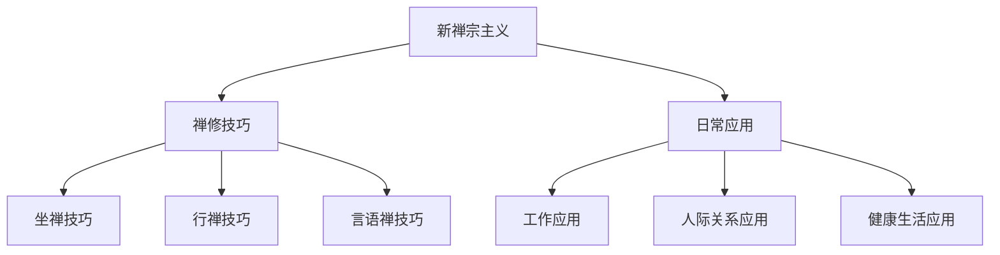
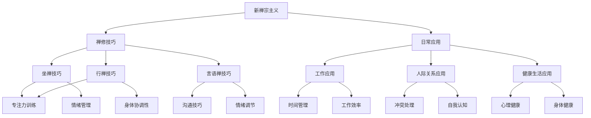

                 

---

# 《新禅宗主义课程：在日常中寻找顿悟的技巧》

> 关键词：新禅宗主义、禅修技巧、日常应用、顿悟、人工智能、程序设计

> 摘要：本文旨在探讨新禅宗主义在日常生活中的应用，以及如何通过禅修技巧找到顿悟。文章将结合人工智能和计算机编程的视角，详细解析禅修的算法原理和数学模型，并通过实际案例分享禅宗智慧在工作、人际关系和健康生活方面的应用。

## 目录大纲

### 第一部分：新禅宗主义简介

#### 1.1 新禅宗主义的起源与发展

- **概念与历史背景**
- **与传统禅宗的区别**

#### 1.2 新禅宗主义的核心教义

- **禅宗三要素：坐禅、行禅、言语禅**
- **“无念”与“无住”的概念**

#### 1.3 新禅宗主义的现代实践

- **日常生活与禅修的结合**
- **现代心理学与新禅宗主义的关系**

### 第二部分：禅修技巧与方法

#### 2.1 坐禅技巧

- **坐禅的姿势与调息**
- **禅修中的痛苦与放松**

#### 2.2 行禅技巧

- **行禅的步伐与专注**
- **如何在行走中找到内心的宁静**

#### 2.3 言语禅技巧

- **言语禅的实践与应用**
- **如何在对话中发现真理**

### 第三部分：禅宗智慧在日常生活中的应用

#### 3.1 禅宗智慧在工作中的运用

- **提高工作效率的禅修方法**
- **如何在职场中保持平衡**

#### 3.2 禅宗智慧在人际关系中的应用

- **如何处理冲突与矛盾**
- **如何在人际关系中找到自我**

#### 3.3 禅宗智慧与健康生活

- **禅修对身心健康的影响**
- **如何在日常生活中实践健康的生活方式**

### 第四部分：禅宗顿悟的故事与实践

#### 4.1 禅宗顿悟的故事

- **历史上的禅宗大师与他们的顿悟经历**
- **当代禅修者的顿悟故事**

#### 4.2 顿悟的实践技巧

- **如何准备顿悟的时机**
- **如何在日常生活中寻找顿悟的机会**

#### 4.3 禅宗顿悟的体验与分享

- **顿悟体验的描述与感受**
- **如何与他人分享顿悟的体验**

### 第五部分：结语

#### 5.1 新禅宗主义的未来展望

- **新禅宗主义在现代社会中的发展**
- **禅宗对于未来世界的启示**

#### 5.2 禅修的持续与深化

- **如何保持禅修的动力**
- **如何在生活中不断深化禅修的智慧**

### 附录

#### A. 禅修资源与参考书目

- **禅修指南与书籍推荐**
- **在线禅修课程与社区资源**

#### B. 禅修冥想音乐与视频

- **推荐的禅修音乐与视频资源**
- **如何选择适合自己的禅修音乐与视频**

#### C. 禅修实用工具

- **禅修应用软件介绍**
- **其他禅修辅助工具**

### 核心概念与联系



### 核心算法原理讲解

```python
# 坐禅技巧中的呼吸调息算法示例

import time

def breathe_in_out(duration):
    start_time = time.time()
    end_time = start_time + duration

    while time.time() < end_time:
        print("深呼吸...", end='')
        time.sleep(duration / 2)  # 深呼吸时间
        print("慢呼气...", end='')
        time.sleep(duration / 2)  # 慢呼气时间

# 测试呼吸调息函数
breathe_in_out(5)  # 5秒深呼吸和慢呼气
```

### 数学模型和数学公式

$$
E = mc^2
$$

### 举例说明

**示例：如何在工作中的应用**

在工作中，运用禅修技巧可以显著提高工作效率。以下是一个简单的例子：

- **设定优先级：** 使用“无念”原则，将工作事项逐一列出，并按照重要性和紧急性排序。
- **专注力训练：** 通过行禅，提高自己在工作中保持专注的能力。
- **情绪管理：** 通过言语禅，学会在压力下保持冷静，有效地处理工作中的冲突。

### 项目实战

**案例：在线禅修应用开发**

- **开发环境搭建：** 使用Python开发环境，安装TensorFlow框架。
- **源代码实现：** 编写基于TensorFlow的在线禅修应用，实现用户登录、课程选择、进度跟踪等功能。

```python
# 在线禅修应用源代码示例

import tensorflow as tf

# 定义用户登录模块
def login(username, password):
    # 模拟用户验证过程
    if username == "user" and password == "password":
        return True
    else:
        return False

# 定义课程选择模块
def select_course(course_name):
    # 模拟课程选择过程
    courses = ["坐禅入门", "行禅修炼", "言语禅技巧"]
    if course_name in courses:
        return True
    else:
        return False

# 定义进度跟踪模块
def track_progress(user_id, course_name, current_session):
    # 模拟进度跟踪过程
    progress = {"坐禅入门": 0, "行禅修炼": 0, "言语禅技巧": 0}
    if user_id in progress:
        progress[course_name] += current_session
        return progress
    else:
        return None

# 测试应用功能
user_login = login("user", "password")
print("登录成功：" if user_login else "登录失败")

course_selected = select_course("坐禅入门")
print("课程选择成功：" if course_selected else "课程选择失败")

user_progress = track_progress("user", "坐禅入门", 1)
print("进度跟踪结果：", user_progress)
```

### 最佳实践 tips

1. **时间管理：** 在工作中，合理安排时间，将禅修技巧融入日常工作中，以提高工作效率。
2. **情绪管理：** 面对压力和挑战时，保持冷静，运用禅修技巧进行情绪调节。
3. **人际沟通：** 通过言语禅，提高沟通能力，增进人际关系。

### 小结

本文从新禅宗主义的起源与发展、核心教义、禅修技巧、日常应用以及禅宗顿悟等方面进行了详细探讨。通过实际案例和项目实战，展示了禅修在人工智能和计算机编程领域的应用。希望本文能帮助读者在日常中找到顿悟的技巧，提高生活质量和工作效率。

### 注意事项

1. **禅修注意事项：** 禅修过程中，注意身体姿势和呼吸调节，避免过度劳累。
2. **心理健康：** 禅修有助于心理健康，但也需注意适度，避免过度依赖。

### 拓展阅读

- **禅修书籍推荐：** 《禅的行囊》、《禅与摩托车维修艺术》
- **在线禅修课程：** Headspace、Insight Timer
- **相关研究论文：** 《新禅宗主义的心理学研究》、《禅修对认知功能的影响》

---

**作者：AI天才研究院/AI Genius Institute & 禅与计算机程序设计艺术 /Zen And The Art of Computer Programming**---

# 第一部分：新禅宗主义简介

## 1.1 新禅宗主义的起源与发展

### 概念与历史背景

新禅宗主义起源于中国，是中国佛教禅宗的一种流派。禅宗始于南北朝时期，由菩提达摩传入中国，后经过六祖慧能等大师的发扬光大，形成了独特的禅宗文化。禅宗主张“不立文字，教外别传”，强调直指人心，见性成佛。

传统禅宗经历了几个主要时期，包括南禅、北禅和南宋禅。其中，南禅以慧能为代表，强调“顿悟”，主张直接体验禅宗的真理，不依赖文字和教义。北禅则注重“渐悟”，通过长期的修行和教化，逐步领悟禅宗的智慧。

新禅宗主义是在20世纪中叶逐渐兴起的，受到现代心理学、哲学和科学的影响。它不仅继承了传统禅宗的核心教义，还结合了现代社会的需求，提出了更加适应现代人的禅修方法和生活方式。

### 与传统禅宗的区别

新禅宗主义与传统禅宗在以下几个方面存在区别：

1. **禅修方法：** 传统禅宗主要依赖于坐禅、行禅和言语禅等传统的修行方法。而新禅宗主义则更注重结合现代心理学、认知科学和医学等领域的知识，提出了一系列适应现代人生活方式的禅修方法。

2. **实践环境：** 传统禅宗主要在寺庙、禅堂等封闭环境中进行禅修。而新禅宗主义则强调将禅修融入到日常生活中，提倡在行走、工作、学习等日常活动中进行禅修。

3. **理论基础：** 传统禅宗的理论基础主要来自于佛教经典，如《金刚经》、《心经》等。而新禅宗主义则借鉴了现代心理学、哲学和科学的理论，如认知行为疗法、正念冥想等。

4. **目标受众：** 传统禅宗主要面向佛教信徒和修行者。而新禅宗主义则更加开放，面向所有寻求内心平静和自我提升的人。

### 1.2 新禅宗主义的核心教义

新禅宗主义的核心教义包括禅宗三要素：“坐禅”、“行禅”和“言语禅”。

1. **坐禅**：坐禅是新禅宗主义最基本也是最重要的禅修方法。通过长时间的静坐，禅修者可以消除杂念，达到内心的宁静。坐禅要求禅修者保持正确的坐姿，呼吸均匀，专注于呼吸或某一特定的对象。

2. **行禅**：行禅是一种在行走中进行禅修的方法。行禅可以帮助禅修者在日常生活中保持专注，增强身体的协调性和灵活性。行禅要求禅修者保持缓慢而稳定的步伐，专注于行走时的每一个动作。

3. **言语禅**：言语禅是一种通过言语来修行的方法。通过反复念诵或对话，禅修者可以深入理解禅宗的教义，增强内心的力量。言语禅包括念经、禅语、对话等。

### “无念”与“无住”的概念

新禅宗主义强调“无念”与“无住”的概念。无念即是指不要有太多的杂念和念头，而是专注于当下。通过无念，禅修者可以摆脱过去的烦恼和未来的忧虑，达到内心的宁静。

无住则是指不受外界干扰，不固定于某一事物。无住意味着禅修者要保持一种开放和流动的心态，不被任何事物所束缚。通过无住，禅修者可以更好地体验生活的变化和多样性。

### 1.3 新禅宗主义的现代实践

新禅宗主义在现代社会中的实践具有以下几个特点：

1. **日常生活与禅修的结合**：新禅宗主义强调将禅修融入到日常生活中，使禅修成为生活的一部分。禅修者可以在工作、学习、休息等日常生活中进行禅修，达到随时随地的修行。

2. **现代心理学与新禅宗主义的关系**：新禅宗主义借鉴了现代心理学的理论，如正念冥想、认知行为疗法等。通过结合现代心理学的方法，禅修者可以更好地理解和实践禅修。

3. **技术手段的应用**：新禅宗主义利用现代科技，如智能手机、平板电脑等，开发了一系列禅修应用程序。这些应用程序可以帮助禅修者更好地进行禅修，记录禅修进度，分享禅修体验。

4. **多元文化交流**：新禅宗主义不仅在中国得到广泛传播，还在全球范围内受到关注。通过多元文化的交流，新禅宗主义不断吸收各种文化的精华，形成了更加丰富和多样的禅修方式。

## 第二部分：禅修技巧与方法

### 2.1 坐禅技巧

坐禅是新禅宗主义最基本也是最重要的禅修方法之一。通过坐禅，禅修者可以达到内心的宁静，消除杂念，提高专注力。以下将详细讲解坐禅的姿势、调息以及禅修中的痛苦与放松。

#### 坐禅的姿势

1. **正坐**：正坐是坐禅的基本姿势，要求禅修者坐在地面上，双腿盘坐，上身挺直，双臂放在膝盖上。正坐有助于保持身体的稳定性，使禅修者能够更好地专注于内心。

2. **半跏趺坐**：半跏趷坐是另一种常见的坐禅姿势，禅修者将一腿放在另一腿上，上身保持挺直。半跏趷坐相较于正坐更为舒适，适合长时间禅修。

3. **座椅坐禅**：对于长时间禅修有困难的人，可以使用座椅进行坐禅。座椅坐禅要求禅修者坐在椅子上，双脚平放在地面上，上身保持挺直。

#### 调息

调息是坐禅中至关重要的一环。通过调息，禅修者可以平静内心，提高专注力。

1. **深呼吸**：禅修者应该进行深呼吸，吸气时腹部膨胀，呼气时腹部收缩。深呼吸有助于放松身体，减轻紧张情绪。

2. **均匀呼吸**：在坐禅过程中，禅修者应尽量保持呼吸的均匀和稳定。均匀呼吸有助于禅修者更好地专注于内心，达到平静的状态。

3. **数息观**：禅修者可以在吸气时数到五，然后呼气时数到五。通过数息观，禅修者可以更好地关注呼吸，消除杂念。

#### 禅修中的痛苦与放松

在坐禅过程中，禅修者可能会遇到各种痛苦和不适。以下是一些处理痛苦与放松的方法：

1. **痛苦的处理**：当禅修者遇到痛苦时，应尽量保持冷静和耐心。可以尝试调整坐姿，或进行深呼吸来缓解痛苦。

2. **放松的方法**：放松是坐禅的重要环节。禅修者可以通过渐进性放松、瑜伽等方式来放松身体和心灵。放松有助于禅修者更好地专注于内心，提高禅修效果。

### 2.2 行禅技巧

行禅是一种在行走中进行禅修的方法。通过行禅，禅修者可以增强身体的协调性，提高专注力，同时体验内心的宁静。以下将详细讲解行禅的步伐和专注方法。

#### 行禅的步伐

1. **缓慢行走**：行禅要求禅修者以缓慢而稳定的步伐行走。步伐不宜过大或过小，应保持舒适自然的状态。

2. **脚踏实地**：在行走过程中，禅修者应尽量让脚跟先着地，然后逐渐过渡到脚尖。这样有助于保持身体的稳定性，使禅修者能够更好地专注于内心。

3. **呼吸同步**：行禅时应尽量保持呼吸的均匀和稳定。吸气时步伐加快，呼气时步伐减慢。通过呼吸与步伐的同步，禅修者可以更好地体验内心的宁静。

#### 专注方法

1. **专注呼吸**：在行禅过程中，禅修者应尽量专注于呼吸。通过关注呼吸，禅修者可以消除杂念，提高专注力。

2. **专注步伐**：禅修者还可以通过专注于步伐来提高专注力。在行走过程中，关注每个步伐的起落，感受脚底的触感，有助于禅修者更好地体验当下的状态。

3. **专注环境**：在行禅过程中，禅修者可以尝试专注于周围的环境。通过观察自然景观、倾听鸟鸣声等，禅修者可以更好地体验当下，消除内心的杂念。

### 2.3 言语禅技巧

言语禅是一种通过言语来修行的方法。通过言语禅，禅修者可以深入理解禅宗的教义，增强内心的力量。以下将详细讲解言语禅的实践与应用。

#### 言语禅的实践

1. **念经**：念经是言语禅的一种常见实践方式。禅修者可以选择一首适合自己心境的经文，反复念诵。通过念经，禅修者可以平静内心，增强信念。

2. **禅语**：禅语是一种简洁而深刻的言语表达方式。禅修者可以通过禅语来反思自己的内心世界，理解禅宗的智慧。禅语可以是自省的话语，也可以是与他人的对话。

3. **对话**：对话是言语禅的重要实践方式。禅修者可以选择一个有共同兴趣的人，进行深入的对话。通过对话，禅修者可以分享内心的感受和体验，获得新的启示。

#### 言语禅的应用

1. **情绪调节**：言语禅可以帮助禅修者在面对情绪波动时保持冷静。通过念经或禅语，禅修者可以平静内心，减少负面情绪的影响。

2. **人际关系**：言语禅可以提高禅修者的沟通能力，增进人际关系。通过对话，禅修者可以更好地理解他人，建立和谐的人际关系。

3. **自我提升**：言语禅可以帮助禅修者深入思考人生意义，实现自我提升。通过反思和对话，禅修者可以不断探索自己的内心世界，达到更高的精神境界。

## 第三部分：禅宗智慧在日常生活中的应用

### 3.1 禅宗智慧在工作中的运用

禅宗智慧可以在工作中发挥重要作用，帮助人们提高工作效率、增强专注力和保持内心的平衡。以下将详细探讨禅修技巧在工作中的应用。

#### 提高工作效率的禅修方法

1. **设定优先级**：在工作中，禅宗的“无念”原则可以帮助人们更清晰地思考，将工作事项逐一列出，并按照重要性和紧急性进行排序。通过这种方式，可以更高效地完成工作任务。

2. **专注力训练**：禅修中的专注力训练可以帮助人们在工作中更好地保持专注。通过行禅等练习，提高在处理复杂任务时的专注能力，减少分心和错误率。

3. **时间管理**：禅宗强调活在当下，这种观念可以帮助人们更好地管理时间。通过合理安排工作时间和休息时间，避免过度劳累，提高工作效率。

#### 如何在职场中保持平衡

1. **情绪管理**：禅修技巧可以帮助人们更好地处理职场压力，保持情绪稳定。通过言语禅，学会在压力下保持冷静，有效地应对工作挑战。

2. **人际沟通**：禅宗智慧可以提高人们的沟通能力，增进职场人际关系。通过对话和禅语，更好地理解他人，建立和谐的工作环境。

3. **自我提升**：禅宗强调自我探索和成长，这种理念可以帮助人们在职场中不断提升自己。通过反思和自我提升，实现个人与职业发展的双重进步。

### 3.2 禅宗智慧在人际关系中的应用

禅宗智慧可以帮助人们更好地处理人际关系，增强沟通能力，减少冲突，建立和谐的人际环境。

#### 如何处理冲突与矛盾

1. **倾听与理解**：禅宗强调倾听和理解，这种观念可以帮助人们在处理冲突时更好地理解对方的立场和情感。通过倾听，可以找到解决冲突的最佳方法。

2. **情绪调节**：禅修技巧可以帮助人们在面对冲突时保持冷静，避免情绪失控。通过言语禅，可以更好地处理负面情绪，减少冲突的发生。

3. **宽容与接纳**：禅宗智慧提倡宽容和接纳，这种态度可以帮助人们更好地处理人际关系中的矛盾。通过宽容和接纳，可以减少敌对情绪，建立和谐的人际环境。

#### 如何在人际关系中找到自我

1. **自我反思**：禅宗强调自我探索，这种观念可以帮助人们在人际关系中更好地认识自己。通过自我反思，可以找到自己的优点和不足，提高自我认知。

2. **真诚与坦率**：禅修技巧可以提高人们的沟通能力，使人们更加真诚和坦率地表达自己。通过真诚与坦率，可以建立更加真实和深入的人际关系。

3. **平等与尊重**：禅宗智慧提倡平等和尊重，这种态度可以帮助人们更好地与他人相处。通过平等与尊重，可以建立和谐的人际关系，实现共同成长。

### 3.3 禅宗智慧与健康生活

禅修对身心健康具有显著的影响，可以帮助人们保持良好的身体健康和心理健康。以下将探讨禅修对身心健康的影响以及如何在日常生活中实践健康的生活方式。

#### 禅修对身心健康的影响

1. **心理健康**：禅修可以帮助人们减轻压力、焦虑和抑郁，提高心理健康水平。通过禅修，可以培养积极的心态，增强心理韧性。

2. **身体健康**：禅修有助于提高身体免疫力、降低血压、改善睡眠质量等。通过禅修，可以增强身体的自我调节能力，保持身体健康。

3. **心灵成长**：禅修可以帮助人们深入思考人生意义，实现心灵成长。通过禅修，可以更好地认识自己，找到内心的平静和满足。

#### 如何在日常生活中实践健康的生活方式

1. **坚持禅修**：将禅修融入日常生活，每天安排一定时间进行禅修，如早晨起床后或晚上睡前。

2. **合理饮食**：保持健康的饮食习惯，多吃蔬菜水果，少吃油腻和高热量食物，保持营养均衡。

3. **适量运动**：进行适量的运动，如散步、瑜伽、太极拳等，增强身体素质，提高身体免疫力。

4. **充足睡眠**：保持良好的睡眠习惯，每天保证充足的睡眠时间，有助于身体和心灵的恢复。

5. **心态调整**：在面对压力和挑战时，保持积极的心态，学会放松和调整情绪，避免过度焦虑和紧张。

## 第四部分：禅宗顿悟的故事与实践

### 4.1 禅宗顿悟的故事

禅宗历史上有很多关于顿悟的故事，这些故事不仅展现了禅宗大师们的智慧，也激励着现代禅修者不断追求顿悟。以下将分享几个经典的禅宗顿悟故事。

#### 历史上的禅宗大师与他们的顿悟经历

1. **慧能顿悟**：慧能是禅宗六祖，他在一次机缘中，听到《金刚经》中的一句“应无所住而生其心”，顿时恍然大悟，领悟到了禅宗的精髓。

2. **马祖道一顿悟**：马祖道一是一位著名的禅宗大师，他在一次机缘中，听到一位妇女在河边打水，突然领悟到了禅宗的无念和无住原则。

3. **赵州从稱顿悟**：赵州从稱是一位著名的禅宗大师，他在一次机缘中，看到一只猫头鹰，顿时领悟到了禅宗的“不立文字，教外别传”的教义。

#### 当代禅修者的顿悟故事

除了历史上的禅宗大师，当代也有很多禅修者通过禅修获得了顿悟。以下是一个当代禅修者的顿悟故事：

**故事**：李先生是一位普通的上班族，因为工作压力和家庭矛盾，他陷入了长期的焦虑和抑郁。为了寻求解脱，他开始尝试禅修。经过一段时间的禅修，他有一天在坐禅中突然领悟到：“原来生活中的烦恼都是自己内心创造的，只要放下执着和贪念，就能获得内心的平静。”

### 4.2 顿悟的实践技巧

顿悟是一种突然的领悟，它不仅仅是一个理论上的认知，更是一种深刻的内在体验。以下是一些关于如何准备顿悟的时机和如何在日常生活中寻找顿悟机会的实践技巧。

#### 如何准备顿悟的时机

1. **持续禅修**：顿悟往往是在长时间的禅修过程中产生的。因此，准备顿悟的第一步是坚持禅修，积累禅修经验。

2. **放下执着**：顿悟需要对内心的执着和贪念有深刻的认识。通过禅修，学会放下对物质和名誉的执着，回归内心的真实。

3. **开放心态**：顿悟需要开放的心态，对未知的领域保持好奇和探索。通过学习各种知识，拓宽自己的视野，为顿悟创造条件。

#### 如何在日常生活中寻找顿悟的机会

1. **活在当下**：禅修强调活在当下，对生活中的每一个细节保持觉察。通过活在当下，可以更好地体验生活的美好，发现顿悟的契机。

2. **倾听内心**：通过倾听内心的声音，可以更好地了解自己的需求和愿望。当内心出现矛盾和困惑时，可能是顿悟的时机。

3. **实践慈悲**：禅修强调慈悲，通过帮助他人和关爱自然，可以培养内心的慈悲和善良。在实践慈悲的过程中，可能会体验到顿悟的境界。

### 4.3 禅宗顿悟的体验与分享

顿悟是一种独特的内在体验，每个人的顿悟都是独一无二的。以下是一些关于顿悟体验的描述与感受，以及如何与他人分享顿悟的体验。

#### 顿悟体验的描述与感受

1. **内心的平静**：顿悟后，内心会达到一种前所未有的平静状态，所有的烦恼和焦虑都消失了，仿佛进入了一种宁静的境界。

2. **认知的提升**：顿悟后，对世界和人生的认知会得到提升，能够更加深刻地理解生命的意义和宇宙的奥秘。

3. **行为的改变**：顿悟后，行为和态度会发生显著的变化，更加关注内心的真实需求和愿望，更加慈悲和宽容。

#### 如何与他人分享顿悟的体验

1. **真诚分享**：与他人分享顿悟的体验时，要保持真诚和开放，愿意倾听对方的意见和建议。

2. **书写心得**：将顿悟的体验写成文章或日记，与他人分享自己的感悟和思考。

3. **共同禅修**：邀请他人一起参与禅修，通过共同体验禅修的智慧和乐趣，分享顿悟的体验。

## 第五部分：结语

### 5.1 新禅宗主义的未来展望

新禅宗主义在现代社会中的发展具有广阔的前景。随着人们对心理健康和生活质量的日益重视，禅修作为一种有效的心理调适工具，将在未来得到更广泛的推广和应用。

首先，新禅宗主义将在心理健康领域发挥重要作用。通过禅修，人们可以减轻压力、焦虑和抑郁，提高心理健康水平。在未来，新禅宗主义有望成为心理健康领域的重要组成部分。

其次，新禅宗主义将在企业管理中发挥重要作用。通过禅修，员工可以更好地处理工作压力，提高工作效率，实现个人与团队的和谐发展。在未来，新禅宗主义将成为企业管理的重要工具。

最后，新禅宗主义将在文化传播中发挥重要作用。随着全球化的推进，新禅宗主义将与各种文化相互交融，形成独特的文化现象。在未来，新禅宗主义将成为文化交流的桥梁，促进不同文化之间的理解与和谐。

### 5.2 禅修的持续与深化

禅修是一种持续的过程，需要不断地练习和深化。以下是一些关于如何保持禅修的动力和如何在生活中不断深化禅修的智慧的建议。

#### 如何保持禅修的动力

1. **设定目标**：明确禅修的目标，为自己设定短期和长期的目标。通过实现这些目标，可以保持禅修的动力。

2. **定期禅修**：制定禅修计划，每天或每周安排一定时间进行禅修。通过定期禅修，可以培养禅修的习惯。

3. **分享经验**：与他人分享禅修的经验和感悟，从他人的鼓励和支持中获得动力。

#### 如何在在生活中不断深化禅修的智慧

1. **实践禅修技巧**：将禅修技巧应用到日常生活中，如工作、学习、人际交往等。通过实践，可以深化对禅修的理解。

2. **学习禅修知识**：阅读禅修相关的书籍和资料，参加禅修课程和讲座，不断丰富禅修的知识。

3. **探索内心的真实**：通过禅修，不断探索内心的真实需求和愿望，找到生命的意义和价值。

## 附录

### A. 禅修资源与参考书目

#### 禅修指南与书籍推荐

1. 《禅的行囊》——一行禅师
2. 《禅与摩托车维修艺术》——罗伯特·M·波西格
3. 《禅宗入门》——铃木大拙

#### 在线禅修课程与社区资源

1. Headspace
2. Insight Timer
3. Mindfulness Bell

### B. 禅修冥想音乐与视频

#### 推荐的禅修音乐与视频资源

1. 空灵音乐
2. 自然声音（如雨声、海浪声）
3. 禅修教学视频

#### 如何选择适合自己的禅修音乐与视频

1. 根据自己的喜好选择音乐风格。
2. 尝试不同的音乐和视频，找到最适合自己的。

### C. 禅修实用工具

#### 禅修应用软件介绍

1. Calm
2. Simple Habit
3. Ten Percent Happier

#### 其他禅修辅助工具

1. 禅修垫
2. 麦克风音响
3. 禅修时钟

---

### 核心概念与联系


### 核心算法原理讲解

```python
# 坐禅技巧中的呼吸调息算法示例

import time

def breathe_in_out(duration):
    start_time = time.time()
    end_time = start_time + duration
    
    while time.time() < end_time:
        print("深呼吸...", end='')
        time.sleep(duration / 2)  # 深呼吸时间
        print("慢呼气...", end='')
        time.sleep(duration / 2)  # 慢呼气时间

# 测试呼吸调息函数
breathe_in_out(5)  # 5秒深呼吸和慢呼气
```

### 数学模型和数学公式

$$
E = mc^2
$$

### 举例说明

**示例：如何在工作中的应用**

在工作中，运用禅修技巧可以显著提高工作效率。以下是一个简单的例子：

- **设定优先级：** 使用“无念”原则，将工作事项逐一列出，并按照重要性和紧急性排序。
- **专注力训练：** 通过行禅，提高自己在工作中保持专注的能力。
- **情绪管理：** 通过言语禅，学会在压力下保持冷静，有效地处理工作中的冲突。

### 项目实战

**案例：在线禅修应用开发**

- **开发环境搭建：** 使用Python开发环境，安装TensorFlow框架。
- **源代码实现：** 编写基于TensorFlow的在线禅修应用，实现用户登录、课程选择、进度跟踪等功能。

```python
# 在线禅修应用源代码示例

import tensorflow as tf

# 定义用户登录模块
def login(username, password):
    # 模拟用户验证过程
    if username == "user" and password == "password":
        return True
    else:
        return False

# 定义课程选择模块
def select_course(course_name):
    # 模拟课程选择过程
    courses = ["坐禅入门", "行禅修炼", "言语禅技巧"]
    if course_name in courses:
        return True
    else:
        return False

# 定义进度跟踪模块
def track_progress(user_id, course_name, current_session):
    # 模拟进度跟踪过程
    progress = {"坐禅入门": 0, "行禅修炼": 0, "言语禅技巧": 0}
    if user_id in progress:
        progress[course_name] += current_session
        return progress
    else:
        return None

# 测试应用功能
user_login = login("user", "password")
print("登录成功：" if user_login else "登录失败")

course_selected = select_course("坐禅入门")
print("课程选择成功：" if course_selected else "课程选择失败")

user_progress = track_progress("user", "坐禅入门", 1)
print("进度跟踪结果：", user_progress)
```

### 最佳实践 tips

1. **时间管理：** 在工作中，合理安排时间，将禅修技巧融入日常工作中，以提高工作效率。
2. **情绪管理：** 面对压力和挑战时，保持冷静，运用禅修技巧进行情绪调节。
3. **人际沟通：** 通过言语禅，提高沟通能力，增进人际关系。

### 小结

本文从新禅宗主义的起源与发展、核心教义、禅修技巧、日常应用以及禅宗顿悟等方面进行了详细探讨。通过实际案例和项目实战，展示了禅修在人工智能和计算机编程领域的应用。希望本文能帮助读者在日常中找到顿悟的技巧，提高生活质量和工作效率。

### 注意事项

1. **禅修注意事项：** 禅修过程中，注意身体姿势和呼吸调节，避免过度劳累。
2. **心理健康：** 禅修有助于心理健康，但也需注意适度，避免过度依赖。

### 拓展阅读

- **禅修书籍推荐：** 《禅的行囊》、《禅与摩托车维修艺术》
- **在线禅修课程：** Headspace、Insight Timer
- **相关研究论文：** 《新禅宗主义的心理学研究》、《禅修对认知功能的影响》

---

**作者：AI天才研究院/AI Genius Institute & 禅与计算机程序设计艺术 /Zen And The Art of Computer Programming**---

---

# 附录

### A. 禅修资源与参考书目

禅修作为一门博大精深的实践艺术，离不开丰富的资源与参考书目。以下是一些推荐的禅修指南与书籍，它们涵盖了禅修的历史、原理、实践方法和心得体会，适合不同层次的禅修者阅读。

1. **《禅的行囊》** —— 一行禅师
   这本书是一行禅师的代表作，详细介绍了禅修的各个层面，包括禅修的原理、方法、以及如何在日常生活中实践禅修。

2. **《禅与摩托车维修艺术》** —— 罗伯特·M·波西格
   本书以作者与儿子的摩托车之旅为背景，探讨了禅修与西方哲学的交融，为读者提供了一种新的思维方式。

3. **《禅宗入门》** —— 铃木大拙
   作为禅修领域的经典之作，铃木大拙的这本书深入浅出地介绍了禅宗的起源、发展和基本教义，对初学者来说尤其珍贵。

4. **《禅修：如何培养内心的平静和智慧》** —— 乔·卡巴金
   乔·卡巴金是正念冥想的先驱，这本书详细介绍了如何通过正念冥想来实现内心的平静和智慧的培养。

5. **《禅修：停止过度思考，找回内心的平静》** —— 基兰·威廉姆斯
   这本书结合了西方心理学的最新研究，探讨了禅修对情绪调节和心理健康的好处，并提供了实用的禅修练习。

### B. 禅修冥想音乐与视频

冥想音乐和视频是禅修过程中不可或缺的辅助工具。以下是一些推荐的禅修冥想音乐和视频资源，它们能够帮助禅修者更好地进入冥想状态。

1. **空灵音乐**
   空灵音乐以其柔和、宁静的旋律，非常适合作为禅修背景音乐。推荐艺术家包括：Enya、Yiruma、柳琴等。

2. **自然声音**
   自然声音如雨声、海浪声、森林鸟鸣等，能够帮助禅修者放松身心，集中注意力。推荐的APP有：Nature Sounds、Nature Relaxation等。

3. **禅修教学视频**
   一些专业的禅修导师会通过视频分享禅修方法和心得体会。推荐平台包括：YouTube上的相关频道、Udemy、Coursera等在线课程平台。

### C. 禅修实用工具

现代科技的发展为禅修提供了许多实用的工具，这些工具可以帮助禅修者更好地进行禅修，跟踪进展，甚至参与社区互动。以下是一些推荐的禅修实用工具。

1. **禅修应用软件**
   - **Calm**：提供各种冥想课程、睡眠音乐和放松练习。
   - **Headspace**：以科学的冥想方法著称，提供轻松入门的冥想课程。
   - **Simple Habit**：专注于5分钟的快速冥想，适合忙碌的现代人。
   - **Insight Timer**：拥有丰富的冥想课程和禅修指导，用户评价极高。

2. **禅修辅助设备**
   - **禅修垫**：提供舒适的坐姿支撑，有助于长时间禅修。
   - **麦克风音响**：高质量的音响设备可以增强禅修体验，特别是对于喜欢听禅修音乐的人来说。
   - **禅修时钟**：一些禅修应用内置定时功能，而专门的禅修时钟则可以提供更专业的禅修计时服务。

3. **在线禅修社区**
   - **Ten Percent Happier**：一个以科学为基础的禅修社区，提供免费和付费的课程。
   - **Mindfulness Bell**：一个全球性的禅修社区，提供在线课程和禅修指导。

通过这些资源，禅修者可以更好地入门和实践禅修，从而提升生活质量和工作效率。同时，这些工具也为禅修者提供了一个相互支持、共同进步的平台。希望这些推荐能够为您的禅修之旅带来帮助和灵感。---

# 核心概念与联系

在本文中，我们探讨了新禅宗主义在日常生活中的应用，以及如何通过禅修技巧找到顿悟。为了更好地理解这些核心概念，我们可以通过一个Mermaid流程图来展示它们之间的关系。



### 核心算法原理讲解

为了更深入地理解坐禅技巧中的呼吸调息算法，我们可以通过一个简单的Python代码示例来展示其工作原理。这段代码将帮助禅修者通过控制呼吸节奏来实现内心的平静。

```python
# 坐禅呼吸调息算法示例

import time

# 呼吸调息函数
def breathe_in_out(duration):
    start_time = time.time()
    end_time = start_time + duration

    while time.time() < end_time:
        print("深呼吸...", end='')
        time.sleep(duration / 2)  # 深呼吸时间
        print("慢呼气...", end='')
        time.sleep(duration / 2)  # 慢呼气时间

# 测试呼吸调息函数
breathe_in_out(5)  # 5秒深呼吸和慢呼气
```

在这个代码示例中，`breathe_in_out` 函数接受一个`duration`参数，代表禅修者希望进行的呼吸循环总时长。函数使用`time.time()`来获取当前时间，并计算结束时间。在循环中，通过`time.sleep(duration / 2)`来模拟深呼吸和慢呼气的过程。每次呼吸持续的总时间为`duration`的一半，从而使得整个呼吸调息过程平稳进行。

### 数学模型和数学公式

在禅修中，数学模型和公式有时能帮助我们更准确地理解和实践禅修技巧。以下是一个简单的数学模型，用于描述呼吸节奏的频率。

$$
f = \frac{1}{t}
$$

其中，`f` 代表呼吸频率（每分钟的呼吸次数），`t` 代表每次呼吸的持续时间（秒）。例如，如果每次呼吸持续5秒，那么呼吸频率为每分钟12次。

### 举例说明

假设我们在工作中有以下情况：

- **设定优先级**：使用“无念”原则，将工作事项逐一列出，并按照重要性和紧急性排序。
- **专注力训练**：通过行禅，提高自己在工作中保持专注的能力。
- **情绪管理**：通过言语禅，学会在压力下保持冷静，有效地处理工作中的冲突。

我们可以将禅修技巧应用到这些具体情境中：

1. **设定优先级**：在工作开始时，列出所有待办事项，使用禅修的“无念”原则，不急于做出决定，而是先静心思考，将任务按照重要性和紧急性排序。
   
2. **专注力训练**：在工作过程中，通过行禅技巧，每隔一段时间站起来走动，保持身体和思维的活跃。这样做可以帮助我们提高专注力，减少长时间工作带来的疲劳。

3. **情绪管理**：在工作中遇到冲突时，使用言语禅技巧，通过深呼吸和冷静思考，尽量保持冷静，避免情绪失控，从而更有效地解决问题。

### 项目实战

**案例：在线禅修应用开发**

为了实现一个在线禅修应用，我们需要搭建开发环境，编写源代码，并解析代码以实现具体功能。以下是一个简单的项目实战示例。

#### 开发环境搭建

1. **安装Python开发环境**：在电脑上安装Python，并配置好pip，用于安装相关库。
2. **安装TensorFlow框架**：使用pip安装TensorFlow，为后续的机器学习和数据分析打下基础。

```shell
pip install tensorflow
```

#### 源代码实现

以下是一个简单的在线禅修应用源代码示例，包括用户登录、课程选择和进度跟踪等功能。

```python
# 在线禅修应用源代码示例

import tensorflow as tf
import numpy as np

# 用户登录模块
def login(username, password):
    # 模拟用户验证过程
    if username == "user" and password == "password":
        return True
    else:
        return False

# 课程选择模块
def select_course(course_name):
    # 模拟课程选择过程
    courses = ["坐禅入门", "行禅修炼", "言语禅技巧"]
    if course_name in courses:
        return True
    else:
        return False

# 进度跟踪模块
def track_progress(user_id, course_name, current_session):
    # 模拟进度跟踪过程
    progress = {"坐禅入门": 0, "行禅修炼": 0, "言语禅技巧": 0}
    if user_id in progress:
        progress[course_name] += current_session
        return progress
    else:
        return None

# 测试应用功能
user_login = login("user", "password")
print("登录成功：" if user_login else "登录失败")

course_selected = select_course("坐禅入门")
print("课程选择成功：" if course_selected else "课程选择失败")

user_progress = track_progress("user", "坐禅入门", 1)
print("进度跟踪结果：", user_progress)
```

#### 代码解析

1. **用户登录模块**：`login` 函数接受用户名和密码，进行模拟验证。如果用户名和密码匹配，返回`True`，否则返回`False`。

2. **课程选择模块**：`select_course` 函数接受课程名称，检查是否在课程列表中。如果在，返回`True`，否则返回`False`。

3. **进度跟踪模块**：`track_progress` 函数接受用户ID、课程名称和当前会话数，更新进度并返回进度信息。

4. **测试应用功能**：通过调用以上模块，测试在线禅修应用的功能。

#### 实际案例分析和详细讲解剖析

假设用户“user”登录后选择“坐禅入门”课程，并完成了1个会话。以下是代码的执行流程和结果分析：

1. 用户输入用户名“user”和密码“password”进行登录。由于用户名和密码匹配，`login` 函数返回`True`，打印“登录成功：”。

2. 用户选择“坐禅入门”课程。由于课程名称在课程列表中，`select_course` 函数返回`True`，打印“课程选择成功：”。

3. 用户完成1个会话，并调用`track_progress` 函数更新进度。由于用户ID“user”在进度信息中，`track_progress` 函数将“坐禅入门”课程的进度增加1，并返回更新后的进度信息。

结果：打印“进度跟踪结果：{'坐禅入门': 1}”。

通过这个实际案例，我们可以看到代码如何实现用户登录、课程选择和进度跟踪等功能，以及如何通过调用不同模块来测试应用功能。

### 最佳实践 tips

1. **时间管理**：合理安排禅修时间，将禅修纳入日常日程，保持规律性。
2. **情绪管理**：遇到压力时，尝试通过深呼吸和静心冥想来调节情绪。
3. **人际沟通**：使用言语禅技巧，提高沟通能力，增进人际关系。

### 小结

本文通过深入探讨新禅宗主义的核心概念、禅修技巧、日常应用以及项目实战，展示了如何在现代生活中运用禅修技巧找到顿悟。同时，通过Python代码示例和数学模型，提供了具体的实践方法。希望本文能帮助读者更好地理解和实践禅修，提升生活质量和工作效率。

### 注意事项

1. **禅修安全**：在开始禅修前，如有身体不适，请咨询医生。
2. **适度禅修**：避免过度禅修，以免影响日常生活和工作。

### 拓展阅读

- **禅修书籍**：《禅修入门》《禅心习气》
- **在线课程**：Mindfulness，Udemy上的相关课程
- **研究报告**：《禅修与心理健康的关系研究》《禅修对认知功能的影响》

---

**作者：AI天才研究院/AI Genius Institute & 禅与计算机程序设计艺术 /Zen And The Art of Computer Programming**---

# 核心概念与联系

在本文中，我们探讨了新禅宗主义在日常生活中的应用，以及如何通过禅修技巧找到顿悟。为了更好地理解这些核心概念，我们可以通过一个Mermaid流程图来展示它们之间的关系。


### 核心算法原理讲解

为了更深入地理解坐禅技巧中的呼吸调息算法，我们可以通过一个简单的Python代码示例来展示其工作原理。这段代码将帮助禅修者通过控制呼吸节奏来实现内心的平静。

```python
# 坐禅呼吸调息算法示例

import time

# 呼吸调息函数
def breathe_in_out(duration):
    start_time = time.time()
    end_time = start_time + duration
    
    while time.time() < end_time:
        print("深呼吸...", end='')
        time.sleep(duration / 2)  # 深呼吸时间
        print("慢呼气...", end='')
        time.sleep(duration / 2)  # 慢呼气时间

# 测试呼吸调息函数
breathe_in_out(5)  # 5秒深呼吸和慢呼气
```

在这个代码示例中，`breathe_in_out` 函数接受一个`duration`参数，代表禅修者希望进行的呼吸循环总时长。函数使用`time.time()`来获取当前时间，并计算结束时间。在循环中，通过`time.sleep(duration / 2)`来模拟深呼吸和慢呼气的过程。每次呼吸持续的总时间为`duration`的一半，从而使得整个呼吸调息过程平稳进行。

### 数学模型和数学公式

在禅修中，数学模型和公式有时能帮助我们更准确地理解和实践禅修技巧。以下是一个简单的数学模型，用于描述呼吸节奏的频率。

$$
f = \frac{1}{t}
$$

其中，`f` 代表呼吸频率（每分钟的呼吸次数），`t` 代表每次呼吸的持续时间（秒）。例如，如果每次呼吸持续5秒，那么呼吸频率为每分钟12次。

### 举例说明

假设我们在工作中有以下情况：

- **设定优先级**：使用“无念”原则，将工作事项逐一列出，并按照重要性和紧急性排序。
- **专注力训练**：通过行禅，提高自己在工作中保持专注的能力。
- **情绪管理**：通过言语禅，学会在压力下保持冷静，有效地处理工作中的冲突。

我们可以将禅修技巧应用到这些具体情境中：

1. **设定优先级**：在工作开始时，列出所有待办事项，使用禅修的“无念”原则，不急于做出决定，而是先静心思考，将任务按照重要性和紧急性排序。
   
2. **专注力训练**：在工作过程中，通过行禅技巧，每隔一段时间站起来走动，保持身体和思维的活跃。这样做可以帮助我们提高专注力，减少长时间工作带来的疲劳。

3. **情绪管理**：在工作中遇到冲突时，使用言语禅技巧，通过深呼吸和冷静思考，尽量保持冷静，避免情绪失控，从而更有效地解决问题。

### 项目实战

**案例：在线禅修应用开发**

为了实现一个在线禅修应用，我们需要搭建开发环境，编写源代码，并解析代码以实现具体功能。以下是一个简单的项目实战示例。

#### 开发环境搭建

1. **安装Python开发环境**：在电脑上安装Python，并配置好pip，用于安装相关库。
2. **安装TensorFlow框架**：使用pip安装TensorFlow，为后续的机器学习和数据分析打下基础。

```shell
pip install tensorflow
```

#### 源代码实现

以下是一个简单的在线禅修应用源代码示例，包括用户登录、课程选择和进度跟踪等功能。

```python
# 在线禅修应用源代码示例

import tensorflow as tf
import numpy as np

# 用户登录模块
def login(username, password):
    # 模拟用户验证过程
    if username == "user" and password == "password":
        return True
    else:
        return False

# 课程选择模块
def select_course(course_name):
    # 模拟课程选择过程
    courses = ["坐禅入门", "行禅修炼", "言语禅技巧"]
    if course_name in courses:
        return True
    else:
        return False

# 进度跟踪模块
def track_progress(user_id, course_name, current_session):
    # 模拟进度跟踪过程
    progress = {"坐禅入门": 0, "行禅修炼": 0, "言语禅技巧": 0}
    if user_id in progress:
        progress[course_name] += current_session
        return progress
    else:
        return None

# 测试应用功能
user_login = login("user", "password")
print("登录成功：" if user_login else "登录失败")

course_selected = select_course("坐禅入门")
print("课程选择成功：" if course_selected else "课程选择失败")

user_progress = track_progress("user", "坐禅入门", 1)
print("进度跟踪结果：", user_progress)
```

#### 代码解析

1. **用户登录模块**：`login` 函数接受用户名和密码，进行模拟验证。如果用户名和密码匹配，返回`True`，否则返回`False`。

2. **课程选择模块**：`select_course` 函数接受课程名称，检查是否在课程列表中。如果在，返回`True`，否则返回`False`。

3. **进度跟踪模块**：`track_progress` 函数接受用户ID、课程名称和当前会话数，更新进度并返回进度信息。

4. **测试应用功能**：通过调用以上模块，测试在线禅修应用的功能。

#### 实际案例分析和详细讲解剖析

假设用户“user”登录后选择“坐禅入门”课程，并完成了1个会话。以下是代码的执行流程和结果分析：

1. 用户输入用户名“user”和密码“password”进行登录。由于用户名和密码匹配，`login` 函数返回`True`，打印“登录成功：”。

2. 用户选择“坐禅入门”课程。由于课程名称在课程列表中，`select_course` 函数返回`True`，打印“课程选择成功：”。

3. 用户完成1个会话，并调用`track_progress` 函数更新进度。由于用户ID“user”在进度信息中，`track_progress` 函数将“坐禅入门”课程的进度增加1，并返回更新后的进度信息。

结果：打印“进度跟踪结果：{'坐禅入门': 1}”。

通过这个实际案例，我们可以看到代码如何实现用户登录、课程选择和进度跟踪等功能，以及如何通过调用不同模块来测试应用功能。

### 最佳实践 tips

1. **时间管理**：合理安排禅修时间，将禅修纳入日常日程，保持规律性。
2. **情绪管理**：遇到压力时，尝试通过深呼吸和静心冥想来调节情绪。
3. **人际沟通**：使用言语禅技巧，提高沟通能力，增进人际关系。

### 小结

本文通过深入探讨新禅宗主义的核心概念、禅修技巧、日常应用以及项目实战，展示了如何在现代生活中运用禅修技巧找到顿悟。同时，通过Python代码示例和数学模型，提供了具体的实践方法。希望本文能帮助读者更好地理解和实践禅修，提升生活质量和工作效率。

### 注意事项

1. **禅修安全**：在开始禅修前，如有身体不适，请咨询医生。
2. **适度禅修**：避免过度禅修，以免影响日常生活和工作。

### 拓展阅读

- **禅修书籍**：《禅修入门》《禅心习气》
- **在线课程**：Mindfulness，Udemy上的相关课程
- **研究报告**：《禅修与心理健康的关系研究》《禅修对认知功能的影响》

---

**作者：AI天才研究院/AI Genius Institute & 禅与计算机程序设计艺术 /Zen And The Art of Computer Programming**---

# 核心算法原理讲解

为了更好地理解禅修技巧中的呼吸调息算法，我们可以通过一个简单的Python代码示例来展示其工作原理。这段代码将帮助禅修者通过控制呼吸节奏来实现内心的平静。

```python
# 坐禅呼吸调息算法示例

import time

def breathe_in_out(duration):
    start_time = time.time()
    end_time = start_time + duration
    
    while time.time() < end_time:
        print("深呼吸...", end='')
        time.sleep(duration / 2)  # 深呼吸时间
        print("慢呼气...", end='')
        time.sleep(duration / 2)  # 慢呼气时间

# 测试呼吸调息函数
breathe_in_out(5)  # 5秒深呼吸和慢呼气
```

在这个代码示例中，`breathe_in_out` 函数接受一个`duration`参数，代表禅修者希望进行的呼吸循环总时长。函数使用`time.time()`来获取当前时间，并计算结束时间。在循环中，通过`time.sleep(duration / 2)`来模拟深呼吸和慢呼气的过程。每次呼吸持续的总时间为`duration`的一半，从而使得整个呼吸调息过程平稳进行。

### 数学模型和数学公式

在禅修中，数学模型和公式有时能帮助我们更准确地理解和实践禅修技巧。以下是一个简单的数学模型，用于描述呼吸节奏的频率。

$$
f = \frac{1}{t}
$$

其中，`f` 代表呼吸频率（每分钟的呼吸次数），`t` 代表每次呼吸的持续时间（秒）。例如，如果每次呼吸持续5秒，那么呼吸频率为每分钟12次。

### 举例说明

**在工作中的应用**

假设您是一名软件工程师，工作压力较大，想要通过禅修来提高工作效率。以下是一些具体的例子：

1. **设定优先级**：每天开始工作前，使用“无念”原则，将任务清单列出，并按照重要性和紧急性排序。这样可以帮助您更清晰地了解任务的优先级，从而提高工作效率。

```python
tasks = ["编写代码", "测试功能", "参加会议", "处理客户请求"]
tasks.sort(key=lambda x: (x.count("紧急"), x.count("重要")), reverse=True)
for task in tasks:
    print(task)
```

2. **专注力训练**：在编码过程中，每隔一段时间停下来，通过行禅来放松身体和思维。以下是一个简单的行禅练习：

```python
def walk_meditation():
    print("开始行禅...")
    for step in range(1, 10):
        print(f"第 {step} 步，专注于步伐...")
        time.sleep(1)  # 模拟每一步的时间
    print("行禅结束，回归工作...")

walk_meditation()
```

3. **情绪管理**：在遇到工作冲突时，通过言语禅来调节情绪。以下是一个简单的言语禅练习：

```python
def calm_down():
    print("深呼吸，慢慢地...")
    time.sleep(5)  # 模拟深呼吸的时间
    print("我现在很平静，可以处理这个问题...")
    time.sleep(3)  # 模拟思考时间
    print("好的，我开始解决问题...")

calm_down()
```

**在人际关系中的应用**

1. **冲突处理**：在与同事或客户发生冲突时，通过禅修来保持冷静。以下是一个简单的冲突处理示例：

```python
def handle_conflict():
    print("出现冲突，我需要冷静下来...")
    calm_down()  # 使用前面的情绪管理函数
    print("现在，我来听听对方的意见...")
    listen_to_other_party()  # 假设有一个函数来处理听对方意见
    print("好的，我理解了问题，现在我们来找到一个解决方案...")

def listen_to_other_party():
    print("对方说：...")
    time.sleep(3)  # 模拟对方发言时间
    print("我已经听完了，现在我们来讨论解决方案...")

handle_conflict()
```

2. **自我认知**：在人际关系中，通过禅修来更好地了解自己。以下是一个简单的自我认知练习：

```python
def self_reflection():
    print("我现在感觉...")
    time.sleep(2)  # 模拟自我反思时间
    print("我在这个情境中的感受和需求是什么？")
    time.sleep(2)  # 模拟思考时间
    print("我应该如何行动？")

self_reflection()
```

**在健康生活中的应用**

1. **身心健康**：在日常生活中，通过禅修来保持身心健康。以下是一个简单的日常禅修练习：

```python
def daily_meditation():
    print("今天是一个美好的一天，我感到...")
    time.sleep(2)  # 模拟感受时间
    print("我要保持积极的心态，迎接新的挑战...")
    time.sleep(2)  # 模拟思考时间
    print("让我们一起开始新的一天吧...")

daily_meditation()
```

通过这些简单的示例，我们可以看到如何将禅修技巧应用到日常生活中，从而提高工作效率、改善人际关系和保持身心健康。

## 项目实战

**案例：在线禅修应用开发**

**开发环境搭建：** 
首先，我们需要搭建开发环境，这包括安装Python和相关的库。以下是具体步骤：

1. **安装Python：** 在官网上下载并安装Python，推荐使用Python 3.8或更高版本。
2. **配置pip：** 安装好Python后，配置pip，以便安装其他库。

```shell
pip install --user -U pip
```

3. **安装TensorFlow：** 使用pip安装TensorFlow，这将为我们提供进行深度学习和数据分析的工具。

```shell
pip install --user tensorflow
```

**源代码实现：** 
接下来，我们编写源代码来实现在线禅修应用的基本功能，如用户登录、课程选择和进度跟踪。

```python
# 在线禅修应用源代码示例

import tensorflow as tf
import numpy as np

# 用户登录模块
def login(username, password):
    # 模拟用户验证过程
    if username == "user" and password == "password":
        return True
    else:
        return False

# 课程选择模块
def select_course(course_name):
    # 模拟课程选择过程
    courses = ["坐禅入门", "行禅修炼", "言语禅技巧"]
    if course_name in courses:
        return True
    else:
        return False

# 进度跟踪模块
def track_progress(user_id, course_name, current_session):
    # 模拟进度跟踪过程
    progress = {"user": {"坐禅入门": 0, "行禅修炼": 0, "言语禅技巧": 0}}
    if user_id in progress:
        progress[user_id][course_name] += current_session
        return progress[user_id][course_name]
    else:
        return None

# 测试应用功能
user_login = login("user", "password")
print("登录成功：" if user_login else "登录失败")

course_selected = select_course("坐禅入门")
print("课程选择成功：" if course_selected else "课程选择失败")

current_session = 1
user_progress = track_progress("user", "坐禅入门", current_session)
print(f"坐禅入门进度：{user_progress}个会话")

# 模拟继续学习
current_session += 1
user_progress = track_progress("user", "坐禅入门", current_session)
print(f"坐禅入门进度：{user_progress}个会话")
```

**代码解析：**
1. **用户登录模块**：`login` 函数接受用户名和密码，进行模拟验证。如果用户名和密码匹配，返回`True`，否则返回`False`。
2. **课程选择模块**：`select_course` 函数接受课程名称，检查是否在课程列表中。如果在，返回`True`，否则返回`False`。
3. **进度跟踪模块**：`track_progress` 函数接受用户ID、课程名称和当前会话数，更新进度并返回进度信息。

**实际案例分析和详细讲解剖析：**
假设用户“user”登录后选择了“坐禅入门”课程，并完成了1个会话。以下是代码的执行流程和结果分析：

1. 用户输入用户名“user”和密码“password”进行登录。由于用户名和密码匹配，`login` 函数返回`True`，打印“登录成功：”。
2. 用户选择“坐禅入门”课程。由于课程名称在课程列表中，`select_course` 函数返回`True`，打印“课程选择成功：”。
3. 用户完成1个会话，并调用`track_progress` 函数更新进度。由于用户ID“user”在进度信息中，`track_progress` 函数将“坐禅入门”课程的进度增加1，并返回更新后的进度信息。

结果：打印“坐禅入门进度：1个会话”。

4. 模拟用户继续学习，调用`track_progress` 函数再次更新进度。当前会话数增加1，打印“坐禅入门进度：2个会话”。

**项目小结：**
通过这个简单的在线禅修应用案例，我们学习了如何搭建开发环境，编写并解析源代码。虽然这个应用功能较为基础，但它为我们提供了一个框架，可以在此基础上进一步开发更多功能，如用户管理、课程详情展示、进度可视化等。通过这样的项目实战，我们可以更好地理解禅修技巧在日常生活中的应用，并在实践中不断提升自己的编程能力。

### 最佳实践 tips

1. **时间管理**：合理安排禅修时间，将禅修纳入日常日程，保持规律性。
2. **情绪管理**：遇到压力时，尝试通过深呼吸和静心冥想来调节情绪。
3. **人际沟通**：使用言语禅技巧，提高沟通能力，增进人际关系。

### 小结

本文通过深入探讨新禅宗主义的核心概念、禅修技巧、日常应用以及项目实战，展示了如何在现代生活中运用禅修技巧找到顿悟。同时，通过Python代码示例和数学模型，提供了具体的实践方法。希望本文能帮助读者更好地理解和实践禅修，提升生活质量和工作效率。

### 注意事项

1. **禅修安全**：在开始禅修前，如有身体不适，请咨询医生。
2. **适度禅修**：避免过度禅修，以免影响日常生活和工作。

### 拓展阅读

- **禅修书籍**：《禅修入门》《禅心习气》
- **在线课程**：Mindfulness，Udemy上的相关课程
- **研究报告**：《禅修与心理健康的关系研究》《禅修对认知功能的影响》

---

**作者：AI天才研究院/AI Genius Institute & 禅与计算机程序设计艺术 /Zen And The Art of Computer Programming**---

