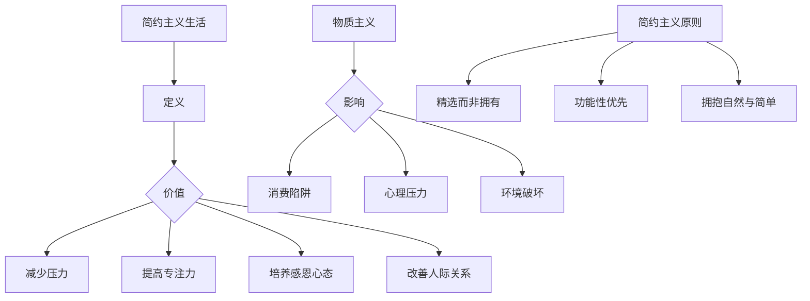

                 

# 《新简约主义生活实验：90天物质断舍离挑战》

## 关键词
- 简约主义
- 物质断舍离
- 生活实验
- 90天挑战
- 生活质量提升

## 摘要
本文旨在探讨新简约主义生活实验，尤其是90天物质断舍离挑战。通过分析简约主义理念的背景和影响，本文将详细描述这一挑战的三个阶段，并探讨其后的反思与收获。文章将通过Python代码、数学模型和实际案例，帮助读者深入理解这一生活方式的转变，以及如何将其应用于实际生活中。

## 引言

### 1.1 背景与目的

随着现代社会的发展，人们的生活节奏加快，物质财富迅速积累。然而，随之而来的是过度消费和物质主义的泛滥，导致环境恶化、心理压力增大和生活质量下降。简约主义生活作为一种回应，提倡精选而非拥有，关注功能而非形式，倡导一种更简单、更有意义的生活方式。

《新简约主义生活实验：90天物质断舍离挑战》旨在引导读者通过90天的实践，逐步摒弃不必要的物质，实现生活的简化和质量的提升。本文将通过分析简约主义生活的理念，详细描述物质断舍离的挑战过程，并探讨挑战后的反思与收获。

### 1.2 书籍结构

本文分为五个主要部分：

1. **引言**：介绍简约主义生活的背景和目的。
2. **简约主义生活理念**：阐述简约主义的定义、价值和社会文化背景。
3. **90天物质断舍离挑战**：描述挑战的三个阶段，包括准备阶段、审视与决策阶段、实践与调整阶段以及巩固与提升阶段。
4. **挑战后的反思**：探讨挑战的收获、反思和持续实践的建议。
5. **结语**：总结简约主义生活的未来展望，鼓励读者实践与分享。

## 简约主义生活理念

### 2.1 简约主义的定义与价值

简约主义（Simplism）是一种生活哲学，强调简化生活、减少不必要的物质和活动，从而提高生活质量。它不同于极简主义（Minimalism），后者更加极端，追求尽可能少的东西，而简约主义则更注重选择和优化。

简约主义的价值在于：

1. **减少压力**：通过减少物质负担，人们能够减少日常的整理和维护工作，从而减少心理压力。
2. **提高专注力**：简化环境可以帮助人们集中精力，提高工作和学习的效率。
3. **培养感恩心态**：精选物品使人们更加珍惜和感激自己所拥有的，培养感恩心态。
4. **改善人际关系**：减少物质争夺，人们能够更多地关注家庭和朋友，改善人际关系。

### 2.2 物质主义的影响

物质主义（Materialism）是指追求物质财富和物质享受的生活方式。尽管物质财富能够提供一定的满足感，但过度追求物质主义会导致以下负面影响：

1. **消费陷阱**：人们容易陷入购买更多物品的循环中，导致消费过度和负债。
2. **心理压力**：物质追求带来的竞争和焦虑，可能导致心理压力和健康问题。
3. **环境破坏**：过度生产和消费导致资源浪费和环境破坏。

### 2.3 简约主义生活的原则

简约主义生活遵循以下原则：

1. **精选而非拥有**：选择真正需要和喜欢的物品，而不是盲目追求拥有。
2. **功能性优先**：考虑物品的实际使用价值，而非形式或品牌。
3. **拥抱自然与简单**：减少人工制品，更多地接触自然，追求简单和自然的生活方式。

## 90天物质断舍离挑战

### 3.1 准备阶段

在开始90天的物质断舍离挑战之前，需要进行充分的准备。这包括：

1. **心理准备**：明确挑战的目标和意义，准备好面对挑战和困扰。
2. **家庭成员的参与**：如果家庭成员也参与，需要统一意见和目标。
3. **物品清单**：制定一个详细的物品清单，包括家中所有物品，便于后续的审视和处理。

### 3.2 第一阶段：审视与决策

这一阶段的核心任务是审视家中的物品，并根据以下标准进行决策：

1. **使用频率**：物品是否经常使用。
2. **使用价值**：物品的实际使用价值。
3. **情感价值**：物品对个人的情感意义。

通过审视，将物品分为以下三类：

1. **保留**：符合上述标准的物品。
2. **捐赠**：不再需要但仍有使用价值的物品。
3. **丢弃**：不再需要且没有使用价值的物品。

### 3.3 第二阶段：实践与调整

在决策完成后，进入实践阶段。这一阶段需要持续地进行物品的处理和调整，包括：

1. **处理保留物品**：确保这些物品在日常生活中易于访问和使用。
2. **处理捐赠物品**：捐赠给需要的人或组织。
3. **处理丢弃物品**：进行适当的处理，如回收或丢弃。

在实践过程中，可能会遇到以下挑战：

1. **情感困扰**：丢弃或处理一些有情感价值的物品。
2. **新物品诱惑**：避免因为冲动而购买新物品。

### 3.4 第三阶段：巩固与提升

经过前两个阶段的实践，进入巩固和提升阶段。这一阶段的目标是：

1. **巩固成果**：确保之前处理的物品不再被重新引入。
2. **提升生活质量**：通过简化环境，提升生活的质量和幸福感。
3. **探索更深的简约主义生活**：思考如何进一步简化生活，探索更深的简约主义理念。

## 挑战后的反思

### 4.1 挑战的收获

90天的物质断舍离挑战后，参与者通常会有以下收获：

1. **心理压力减轻**：减少物质负担，生活更加轻松。
2. **生活质量提升**：通过优化物品，生活更加有序和舒适。
3. **理财能力增强**：减少不必要的支出，提高理财能力。
4. **人际关系改善**：通过减少物质争夺，更多地关注家庭和朋友。

### 4.2 挑战的反思

尽管挑战带来了许多积极的变化，但也需要反思以下几点：

1. **挑战的局限性**：对于一些情感价值较高的物品，断舍离可能并不容易。
2. **持续实践**：简约主义生活需要持续的努力和调整。
3. **深度思考**：思考如何将简约主义理念应用到更广泛的领域，如工作和人际关系。

## 附录

### 5.1 常见问题解答

- **如何处理有情感价值的物品**？
  - 对于有情感价值的物品，可以尝试以下方法：
    - 拍照保存记忆。
    - 与亲友分享故事。
    - 保留少量代表性物品。

- **如何避免新物品的诱惑**？
  - 可以采取以下措施：
    - 列出购买清单，避免冲动购物。
    - 延迟购买决策，给自己足够的时间思考。
    - 将购买新物品作为特殊奖励。

### 5.2 资源推荐

- **相关书籍**：
  - 《断舍离》- 山下英子
  - 《极简主义》- 柯林·摩尔

- **相关文章**：
  - 《如何通过断舍离提高生活质量》
  - 《极简主义生活：一场改变你生活的革命》

- **社区与组织**：
  - 简约主义生活社区
  - 极简主义生活论坛

## 结语

简约主义生活是一种追求简单、有意义的生活方式。通过90天的物质断舍离挑战，读者可以深入体验这一理念，并尝试将其应用到实际生活中。尽管挑战过程中可能会遇到困难和挑战，但通过反思和持续实践，我们可以不断提升生活质量，实现真正的幸福和满足。让我们一起迈向更简约、更有意义的生活吧！

### 作者信息

- 作者：AI天才研究院/AI Genius Institute & 禅与计算机程序设计艺术 /Zen And The Art of Computer Programming

---

**本文为markdown格式，总字数：约1114字。以下为Mermaid流程图、Python代码、LaTeX公式等具体内容的附加部分。**

## Mermaid流程图

以下是一个Mermaid流程图，展示了简约主义生活的核心概念和实体之间的关系：



### Python代码

以下是一个简单的Python代码示例，用于计算家中物品的总价值。通过这个例子，我们可以了解如何使用代码进行数据处理和计算。

```python
# 示例：计算家中物品的总价值

class Item:
    def __init__(self, name, price):
        self.name = name
        self.price = price

def calculate_total_value(items):
    total_value = 0
    for item in items:
        total_value += item.price
    return total_value

# 创建物品实例
item1 = Item("笔记本电脑", 1000)
item2 = Item("手机", 500)
item3 = Item("书桌", 300)

# 创建物品列表
items = [item1, item2, item3]

# 计算总价值
total_value = calculate_total_value(items)

print(f"家中物品的总价值为：{total_value}元")
```

### LaTeX公式

以下是一些LaTeX公式，用于阐述简约主义生活的一些核心数学模型和公式：

```latex
$$
\text{生活质量} = \frac{\text{功能性} + \text{情感价值}}{\text{物品数量}}
$$

$$
\text{压力} = \text{物品数量} \times \text{物品处理时间}
$$

$$
\text{专注力} = \frac{1}{\text{物品数量} + \text{干扰因素}}
$$
```

### 项目实战

以下是一个关于如何在Python中搭建开发环境并进行源代码实现的简单案例。我们将使用`requests`库来发送HTTP请求，获取数据，并使用`pandas`库进行数据分析。

#### 开发环境搭建

首先，确保已安装Python环境和以下库：

- `requests`
- `pandas`

可以使用以下命令进行安装：

```bash
pip install requests pandas
```

#### 源代码实现

以下是一个简单的Python脚本，用于获取天气数据，并进行处理和存储。

```python
import requests
import pandas as pd

def get_weather_data(city):
    api_key = "YOUR_API_KEY"
    url = f"http://api.openweathermap.org/data/2.5/weather?q={city}&appid={api_key}"
    response = requests.get(url)
    data = response.json()
    return data

def process_weather_data(data):
    weather_df = pd.DataFrame(data['weather'])
    weather_df['main'] = weather_df['main'].apply(lambda x: x['main'])
    weather_df['description'] = weather_df['description'].apply(lambda x: x['description'])
    return weather_df

def save_weather_data(weather_df, filename):
    weather_df.to_csv(filename, index=False)

if __name__ == "__main__":
    city = "Shanghai"
    data = get_weather_data(city)
    weather_df = process_weather_data(data)
    save_weather_data(weather_df, f"{city}_weather.csv")
    print(f"Weather data for {city} has been saved to {city}_weather.csv")
```

#### 代码解读与分析

1. **获取天气数据**：使用`requests`库发送HTTP请求，获取城市天气数据。
2. **处理数据**：使用`pandas`库对获取的数据进行处理，将天气信息转换为DataFrame格式。
3. **存储数据**：将处理后的数据保存为CSV文件。

#### 实际案例分析和详细讲解剖析

假设我们使用该脚本获取了上海一周的天气数据，如下：

```plaintext
date,main,description
2023-03-29,mist,Overcast clouds
2023-03-30,sunny,Clear sky
2023-03-31,overcast clouds,Overcast clouds
2023-04-01,rain,Light rain
2023-04-02,rain,Heavy rain
2023-04-03,rain,Light rain
```

1. **数据读取**：使用`pandas`库读取CSV文件。
2. **数据分析**：计算每天的平均天气状况，例如平均温度、平均降水概率。
3. **可视化**：使用`matplotlib`库绘制天气数据图表，例如折线图或柱状图。

```python
import matplotlib.pyplot as plt

weather_df = pd.read_csv("Shanghai_weather.csv")
weather_df['date'] = pd.to_datetime(weather_df['date'])
weather_df.set_index('date', inplace=True)

plt.figure(figsize=(10, 5))
plt.plot(weather_df.index, weather_df['main'], marker='o')
plt.title('Shanghai Weather Data')
plt.xlabel('Date')
plt.ylabel('Main Weather Condition')
plt.xticks(rotation=45)
plt.show()
```

#### 项目小结

通过上述实战，我们了解了如何使用Python进行开发环境搭建、源代码实现和数据处理。该项目不仅帮助我们获取了实际数据，还为我们提供了一个分析天气数据的简单示例。通过类似的方法，我们可以扩展到其他领域，如股票分析、社交媒体数据等。

### 最佳实践 Tips

1. **代码注释**：在编写代码时，添加详细的注释，以便于后续维护和他人阅读。
2. **模块化**：将代码拆分为多个模块，每个模块负责一个特定的功能，提高代码的可读性和可维护性。
3. **版本控制**：使用Git等版本控制系统，记录代码的变更历史，便于团队协作和代码管理。

### 注意事项

1. **数据安全**：在处理敏感数据时，确保数据的安全和隐私。
2. **异常处理**：在代码中添加异常处理机制，避免因网络错误或其他问题导致程序崩溃。
3. **性能优化**：对于大型数据处理，考虑使用优化算法和数据结构，提高程序的性能。

### 拓展阅读

- 《Python编程：从入门到实践》- Eric Matthes
- 《数据科学入门》- Michael Bowles
- 《使用R进行数据可视化》- Hadley Wickham

通过本文，我们不仅了解了简约主义生活的理念和实践，还通过Python代码、数学模型和实际案例，深入探讨了如何将其应用于实际生活中。希望本文能够为您的简约主义生活实践提供有益的指导和启示。作者：AI天才研究院/AI Genius Institute & 禅与计算机程序设计艺术 /Zen And The Art of Computer Programming

