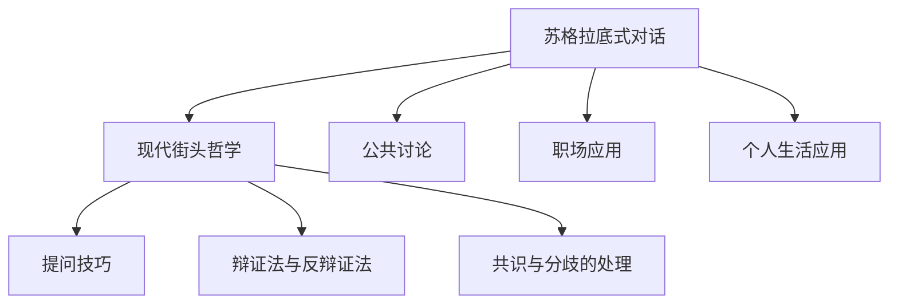

                 

### 引言

《新苏格拉底式对话俱乐部：现代版街头哲学讨论》这篇技术博客旨在探讨苏格拉底式对话方法在现代街头哲学讨论中的运用。苏格拉底式对话，以其深刻的逻辑思维和辩证法，不仅对哲学领域有着深远的影响，也逐渐被应用到多个领域中。随着社会的发展和科技的进步，街头哲学作为一种新兴的文化现象，逐渐引起了广泛的关注。街头哲学讨论的不仅仅是传统的哲学问题，更是现代社会中面临的现实问题，如价值观、社会正义、人际关系等。

本文将从以下几个方面展开讨论：

1. **苏格拉底式对话概述**：介绍苏格拉底式对话的起源、特点及其在现代的应用。
2. **现代街头哲学讨论**：探讨现代街头哲学的起源、发展及其核心议题。
3. **现代街头哲学讨论实例**：通过具体实例，展示街头哲学讨论的过程和结论。
4. **结论与启示**：总结现代街头哲学讨论的意义与价值，展望其未来发展趋势。

通过这一系列的讨论，我们希望能够更好地理解苏格拉底式对话在街头哲学讨论中的应用，以及这种应用对个人和社会可能产生的深远影响。

#### 关键词：苏格拉底式对话、街头哲学、辩证法、公共讨论、个人生活应用

#### 摘要：

本文首先介绍了苏格拉底式对话的起源和特点，探讨了其在公共讨论、职场和个人生活中的应用。接着，分析了现代街头哲学的起源与发展，阐述了其核心议题，如价值观、社会正义和人际关系。通过具体实例，展示了街头哲学讨论的过程和结论。最后，总结了现代街头哲学讨论的意义与价值，展望了其未来发展趋势。本文旨在为读者提供一种新的思考方式，以更好地理解和应对现代社会中的复杂问题。

## 第一部分：苏格拉底式对话方法

### 第1章：苏格拉底式对话概述

#### 1.1 苏格拉底式对话的起源与特点

苏格拉底式对话（Socratic Dialogue）起源于古希腊，由哲学家苏格拉底（Socrates）创立。苏格拉底是一位极具影响力的思想家，他的教学方法被称为苏格拉底法（Socratic Method），也称为产婆术（Methode d'amorenique）。这种方法的核心在于通过提问和回答的方式，引导对方深入思考，从而发现问题的本质和矛盾。

**苏格拉底式对话的定义与历史背景**

苏格拉底式对话是一种基于辩证法的方法，旨在通过提问和回答，逐步揭示问题的深层含义。这种方法的基本原理是“提问-回答-反思”，即通过不断提问，使对方产生回答，然后对回答进行反思，从而逐步深入问题的核心。

苏格拉底式对话的历史背景可以追溯到古希腊的哲学思潮。在当时的希腊，哲学思想繁荣发展，各种学说和观点层出不穷。苏格拉底在这种背景下，以其独特的教学方法，吸引了大量追随者，并对后世的哲学教育产生了深远的影响。

**苏格拉底式对话的核心特点**

苏格拉底式对话具有以下几个核心特点：

1. **提问技巧**：苏格拉底擅长通过连续的提问，引导对方思考，逐步揭示问题的本质。他的提问技巧非常灵活，能够针对对方的回答，提出进一步的追问。
2. **辩证法与反辩证法**：苏格拉底式对话中，辩证法是主要的思维工具。通过辩证法，可以揭示问题的矛盾和不足之处，从而引导对方更深入地思考。
3. **共识与分歧的处理**：在对话过程中，苏格拉底会努力寻找共识点，以便在共识的基础上，进一步探讨分歧。这种方法有助于在对话双方之间建立共同的认知框架。

#### 1.2 苏格拉底式对话的步骤与方法

苏格拉底式对话的步骤与方法可以分为以下几个阶段：

1. **明确问题**：首先，需要明确讨论的问题或主题。这可以通过提问的方式来实现，如“你对这个问题有什么看法？”或“你能否解释一下这个概念？”
2. **提问与回答**：在明确问题之后，通过提问和回答，逐步引导对方思考。提问的方式可以多样，如开放式提问、闭合式提问等。
3. **辩证法与反辩证法**：在提问和回答的过程中，使用辩证法和反辩证法，揭示问题的矛盾和不足之处。例如，可以提出反问、反驳对方的观点等。
4. **共识与分歧的处理**：在对话过程中，寻找共识点，以便在共识的基础上，进一步探讨分歧。可以通过归纳、总结等方法，使对话双方在共识的基础上，更深入地探讨问题。

**提问技巧**

苏格拉底式对话中的提问技巧至关重要。以下是一些常用的提问技巧：

1. **开放式提问**：开放式提问旨在引导对方详细阐述自己的观点。例如，“你能否详细解释一下你的看法？”
2. **闭合式提问**：闭合式提问用于确认对方的观点或假设。例如，“你是否认为这个观点是正确的？”
3. **反问**：反问用于揭示对方的矛盾或不足之处。例如，“如果你的观点是正确的，那么这个矛盾如何解释？”
4. **追问**：追问用于进一步探讨问题。例如，“除了这个观点，还有其他可能的解释吗？”

**辩证法与反辩证法**

辩证法是苏格拉底式对话中的核心工具。辩证法的基本原理是揭示事物的矛盾和不足之处，从而促进更深入的思考。以下是辩证法的一些基本方法：

1. **对立统一**：通过揭示事物的对立面，发现其统一性。例如，通过讨论“善”与“恶”的对立，探讨其内在的联系。
2. **否定之否定**：通过否定一个观点，发现其否定之否定。例如，通过否定“所有事物都是静止的”，发现“事物是运动的”这一观点。
3. **矛盾分析**：通过分析事物的矛盾，揭示其本质。例如，通过分析“自由”与“限制”的矛盾，探讨自由与限制的关系。

反辩证法是辩证法的对立面，用于反驳对方的观点。以下是反辩证法的一些基本方法：

1. **反驳**：通过逻辑推理，反驳对方的观点。例如，如果对方认为“所有猫都是动物”，可以通过举例证明“不是所有猫都是动物”。
2. **反问**：通过反问，揭示对方的矛盾。例如，“如果你的观点是正确的，那么这个反例如何解释？”
3. **证伪**：通过证伪，证明对方的观点是错误的。例如，如果对方认为“所有物体都会下落”，可以通过实验证明“不是所有物体都会下落”。

**共识与分歧的处理**

在苏格拉底式对话中，共识与分歧的处理是关键。以下是一些处理方法：

1. **寻找共识点**：在对话过程中，努力寻找共识点，以便在共识的基础上，进一步探讨分歧。例如，可以讨论“我们都认同这个观点”或“我们在这个问题上达成了一致”。
2. **归纳与总结**：通过归纳和总结，使对话双方在共识的基础上，更深入地探讨问题。例如，可以总结“我们已经讨论了这个问题的主要观点”或“我们可以从这个共识出发，进一步探讨这个问题”。
3. **尊重差异**：在处理分歧时，尊重对方的观点，避免争论和冲突。例如，可以说“我们在这个问题上有不同的看法，但我们都尊重对方的观点”。

通过以上步骤与方法，苏格拉底式对话可以在探讨问题、解决矛盾、寻找共识等方面发挥重要作用。在现代街头哲学讨论中，这种对话方法同样具有极高的应用价值。

### 第2章：苏格拉底式对话在现代的应用

#### 2.1 苏格拉底式对话在公共讨论中的应用

苏格拉底式对话作为一种富有成效的沟通方法，在现代公共讨论中得到了广泛应用。公共讨论通常涉及广泛的议题，如政治、社会、经济和环境问题。在这种环境中，苏格拉底式对话的优势在于其能够促进深入的讨论，提高参与者的思考能力，并最终达成共识或至少理解对方的观点。

**公共议题的讨论**

在公共议题的讨论中，苏格拉底式对话的方法可以帮助参与者更加清晰地表达自己的观点，并倾听他人的意见。以下是一个具体的讨论场景：

**议题**：城市化与环境保护

**步骤**：

1. **明确问题**：首先，确定讨论的主题，例如“城市化进程中的环境保护问题”。主持人可以提出问题：“你认为城市化对环境保护有哪些影响？”
2. **提问与回答**：参与者根据自己的观点回答问题，主持人可以继续提问，例如：“你的观点是基于什么数据或事实？”或“你是否考虑过其他因素？”
3. **辩证法与反辩证法**：在回答过程中，其他参与者可以使用辩证法和反辩证法来挑战或支持某个观点。例如：“你的观点忽视了城市扩张带来的经济效益。”或“你的观点是否考虑到城市居民的生活质量？”
4. **共识与分歧的处理**：在讨论过程中，主持人需要引导参与者寻找共识点，例如：“虽然我们对城市化和环境保护的看法不同，但我们都同意需要找到平衡点。”同时，也要尊重分歧，避免争论升级。

**辩论与对话的平衡**

在公共讨论中，辩论和对话之间需要找到平衡。苏格拉底式对话有助于实现这一平衡，因为：

1. **辩论**：通过辩论，参与者可以清晰地表达自己的立场，反驳对方的观点。这有助于揭示问题的多个层面，促进更深入的讨论。
2. **对话**：通过对话，参与者可以倾听对方的意见，理解不同的观点，并尝试找到共识。这有助于建立互信，减少冲突。

实现辩论与对话的平衡的方法包括：

1. **时间控制**：给每个参与者一定的时间来表达自己的观点，避免某个观点占据主导地位。
2. **规则制定**：制定讨论规则，确保讨论的公平性，例如轮流发言、尊重对方观点等。
3. **引导提问**：主持人可以引导参与者提出有建设性的问题，促进对话的深入。

**苏格拉底式对话的优势**

苏格拉底式对话在公共讨论中的优势主要体现在以下几个方面：

1. **提高思考能力**：通过提问和回答，参与者需要不断思考，从而提高自己的逻辑思维和分析问题的能力。
2. **促进理解**：通过辩证法和反辩证法，参与者可以更深入地理解问题的复杂性，减少误解和偏见。
3. **达成共识**：通过寻找共识点，即使不能完全消除分歧，也可以在一定程度上理解对方的观点，为后续的合作奠定基础。

总之，苏格拉底式对话在公共讨论中的应用，不仅能够提高讨论的质量，还能促进社会的和谐与进步。

#### 2.2 苏格拉底式对话在职场中的应用

苏格拉底式对话作为一种高效的沟通和思考工具，在现代职场中同样具有重要的应用价值。无论是在团队建设、决策制定还是个人职业发展方面，这种方法都能够帮助职场人士更好地解决问题、提高决策质量和增强团队协作。

**团队建设与决策**

在团队建设中，苏格拉底式对话可以帮助团队成员建立信任，提高沟通效率，从而增强团队的凝聚力。以下是一个具体的团队建设案例：

**案例**：一个IT项目团队在项目启动前的会议

**步骤**：

1. **明确目标**：团队首先需要明确项目目标，例如：“确保项目按时完成并满足客户需求。”
2. **提问与回答**：团队成员可以提问，例如：“我们如何确保项目按时完成？”主持人可以继续提问，以引导更深入的讨论。
3. **辩证法与反辩证法**：团队成员可以使用辩证法来探讨不同方案的优缺点，例如：“这个方案虽然成本较低，但可能影响项目质量。”
4. **共识与分歧的处理**：在讨论过程中，主持人需要引导团队成员寻找共识点，同时尊重不同的观点。

在决策制定中，苏格拉底式对话可以帮助团队做出更加全面和理性的决策。以下是一个具体的决策制定案例：

**案例**：公司是否应该投资一个新的市场领域

**步骤**：

1. **收集信息**：团队成员收集有关新市场领域的相关信息，例如市场规模、竞争情况等。
2. **提问与回答**：主持人可以提问，例如：“我们认为投资这个市场有哪些风险？”团队成员回答并继续提问。
3. **辩证法与反辩证法**：团队成员通过辩证法分析各种观点，例如：“虽然市场潜力巨大，但我们是否具备进入该市场的优势？”
4. **共识与分歧的处理**：在讨论过程中，主持人需要引导团队成员在共识基础上，进一步探讨分歧，确保决策的全面性和理性。

**领导力的提升**

苏格拉底式对话对于领导力的提升也有显著的作用。领导者在工作中可以运用这种方法，与团队成员进行深入的沟通和交流，从而提高团队的执行力。以下是一个领导力提升的案例：

**案例**：团队项目进度缓慢

**步骤**：

1. **了解问题**：领导者首先需要了解项目进度缓慢的具体原因，例如通过与团队成员进行个别访谈或小组讨论。
2. **提问与回答**：领导者可以提问，例如：“你认为项目进度缓慢的原因是什么？”团队成员回答并继续提问。
3. **辩证法与反辩证法**：领导者可以使用辩证法来探讨问题的根本原因，例如：“我们是否在资源分配上存在问题？”
4. **共识与分歧的处理**：在讨论过程中，领导者需要引导团队成员找到解决问题的共识点，并制定具体的行动计划。

**苏格拉底式对话的优势**

苏格拉底式对话在职场中的优势主要体现在以下几个方面：

1. **提高沟通效率**：通过提问和回答，团队成员可以更清晰地表达自己的观点，减少误解和沟通障碍。
2. **增强团队合作**：通过辩证法和反辩证法，团队成员可以深入探讨问题，从而达成共识，增强团队合作。
3. **提高决策质量**：通过寻找共识点，苏格拉底式对话可以帮助团队做出更加全面和理性的决策。

总之，苏格拉底式对话在职场中的应用，不仅能够提高团队的工作效率和决策质量，还能增强领导力和团队凝聚力，为企业的长期发展奠定坚实基础。

#### 2.3 苏格拉底式对话在个人生活中的应用

苏格拉底式对话不仅在公共讨论和职场中发挥着重要作用，在个人生活中也同样具有极高的价值。通过苏格拉底式对话，个体可以提升自我认知，改善人际关系，并在日常生活中做出更加明智的决策。

**自我认知的提升**

自我认知是指个体对自己内心世界和外在行为的理解和认识。苏格拉底式对话通过提问和反思，可以帮助个体更深入地了解自己。以下是一个自我认知提升的实例：

**实例**：反思个人目标

**步骤**：

1. **明确问题**：个体可以提问自己：“我的长期和短期目标是什么？”
2. **提问与回答**：个体可以进一步提问：“为了实现这些目标，我需要采取哪些行动？”并回答自己的问题。
3. **辩证法与反辩证法**：个体可以通过辩证法，反思自己的回答，例如：“我是否真的了解这些目标？是否有其他因素影响我的决策？”
4. **共识与分歧的处理**：在反思过程中，个体可以找到共识点，例如：“我确实需要制定具体的行动计划来实现这些目标。”

**人际关系与自我认知**

苏格拉底式对话在改善人际关系方面也具有显著作用。通过对话，个体可以更好地理解他人，从而建立更深层次的人际关系。以下是一个改善人际关系的实例：

**实例**：与朋友解决矛盾

**步骤**：

1. **明确问题**：个体可以提问：“我们的矛盾是什么？”
2. **提问与回答**：个体可以进一步提问：“你认为我们为什么会有这样的矛盾？”并回答自己的问题。
3. **辩证法与反辩证法**：个体可以通过辩证法，探讨矛盾的根源，例如：“我们是否对某个问题有不同的看法？”
4. **共识与分歧的处理**：在对话过程中，个体可以找到共识点，例如：“我们确实在某些问题上存在分歧，但我们可以尝试理解对方的观点。”

**日常生活中的应用**

苏格拉底式对话在日常生活中也有广泛的应用。通过这种方法，个体可以更清晰地思考问题，从而做出更加明智的决策。以下是一个日常生活中应用的实例：

**实例**：决定是否接受一个新工作机会

**步骤**：

1. **明确问题**：个体可以提问：“这个工作机会是否符合我的职业规划？”
2. **提问与回答**：个体可以进一步提问：“这个工作机会的优缺点是什么？”并回答自己的问题。
3. **辩证法与反辩证法**：个体可以通过辩证法，权衡利弊，例如：“这个工作机会虽然薪资较高，但工作压力也可能较大。”
4. **共识与分歧的处理**：在思考过程中，个体可以找到共识点，例如：“虽然存在一些风险，但这个工作机会对我的职业发展有重要意义。”

**苏格拉底式对话的优势**

苏格拉底式对话在个人生活中的优势主要体现在以下几个方面：

1. **提升自我认知**：通过提问和反思，个体可以更深入地了解自己的内心世界，从而提高自我认知。
2. **改善人际关系**：通过对话，个体可以更好地理解他人，建立更深层次的人际关系。
3. **提高决策质量**：通过辩证法和共识与分歧的处理，个体可以更清晰地思考问题，做出更加明智的决策。

总之，苏格拉底式对话在个人生活中的应用，不仅有助于提升自我认知和改善人际关系，还能提高决策质量，为个人的成长和发展提供有力支持。

### 第3章：现代街头哲学的起源与发展

#### 3.1 现代街头哲学的起源

现代街头哲学的起源可以追溯到20世纪末期的美国和欧洲。当时，随着街头文化的兴起，包括涂鸦、嘻哈音乐、滑板等在内的亚文化形式开始在青年人中流行起来。这些街头文化不仅是一种娱乐和表达方式，更是一种社会抗议和自我表达的手段。在这种背景下，街头哲学作为一种独特的思想体系逐渐形成。

**街头文化的影响**

街头文化对现代街头哲学的形成产生了深远的影响。街头文化强调个性化、反叛和自我表达，这些特点在街头哲学中得到了体现。街头哲学关注现实问题，如社会不公、种族歧视、贫困等，并通过批判性思维和哲学讨论来探讨这些问题。

**社会现实与哲学思考**

现代街头哲学不仅是对街头文化的回应，更是对社会现实的深刻反思。街头哲学讨论的不仅仅是个人层面的价值观和人生观，更涉及广泛的社会议题。这种哲学思考力图揭示社会问题的根源，并提出解决方案。

#### 3.2 现代街头哲学的发展

随着时间和文化的变迁，现代街头哲学也在不断发展和演变。以下是一些关键的发展趋势：

**多元文化与哲学碰撞**

现代街头哲学的发展受到了多元文化的影响。在全球化的背景下，不同文化之间的交流和碰撞为街头哲学提供了丰富的资源和灵感。街头哲学开始融合各种哲学流派，如存在主义、后现代主义、非洲哲学等，形成了独特的文化混合体。

**街头哲学的传承与创新**

街头哲学不仅继承了传统哲学的思考方式，还在不断地创新。现代科技的发展为街头哲学提供了新的表达方式和讨论平台，如社交媒体、在线论坛等。这些新的传播方式使得街头哲学的影响力更加广泛，也让更多的人参与到哲学讨论中来。

**新兴议题的讨论**

现代街头哲学也关注新兴的议题，如环境问题、数字隐私、人工智能等。这些议题反映了现代社会的发展趋势和挑战，成为街头哲学讨论的重要内容。

#### 3.3 现代街头哲学的核心议题

现代街头哲学讨论的核心议题涵盖了多个方面，其中一些重要的议题包括：

**价值观与人生观**

价值观和人生观是现代街头哲学的核心议题之一。街头哲学家们探讨如何建立正确的价值观，如何实现个人价值与社会价值的统一。他们强调个人自主性、自由和平等，认为这些价值观是实现社会正义和个人幸福的关键。

**社会问题与伦理思考**

社会问题与伦理思考是现代街头哲学的重要议题。街头哲学家们关注社会不公、贫困、种族歧视等问题，并试图通过哲学思考提出解决方案。他们探讨道德原则和伦理规范，试图为解决社会问题提供指导。

**人际关系与自我认同**

人际关系与自我认同是现代街头哲学的另一个重要议题。街头哲学家们探讨人际关系中的伦理问题，如友谊、爱情和责任。同时，他们也关注自我认同问题，探讨个人身份、文化认同和身份政治。

总之，现代街头哲学作为一种新兴的哲学形式，不仅继承了传统哲学的思考方式，还在不断发展和创新。通过讨论核心价值观、社会问题、人际关系等议题，街头哲学为现代社会提供了深刻的哲学思考和指导。

### 第4章：现代街头哲学的核心议题

#### 4.1 价值观与人生观

在现代社会中，价值观与人生观是人们日常生活中不可或缺的一部分。现代街头哲学对此进行了深刻的探讨，试图揭示价值观与人生观在个人和社会中的重要性。以下将详细分析幸福、成功、道德和责任等核心价值观及其在现代街头哲学中的地位。

**幸福**

幸福是人们追求的核心目标之一。现代街头哲学认为，幸福不仅是一种情感体验，更是一种生活态度。街头哲学家们强调，幸福不仅仅依赖于物质财富的积累，更重要的是心灵的满足和自我实现。他们通过哲学讨论，探讨幸福的定义、幸福的来源以及如何实现幸福。例如，一些街头哲学家提出，幸福来自于对生活的热爱、对工作的投入和对人际关系的重视。通过这些讨论，人们可以更深刻地理解幸福，并在现实生活中追求更加真实和持久的幸福。

**成功**

成功是衡量个人成就的重要标准。然而，在现代社会中，成功不仅仅是财富和地位的象征，更是个人价值的体现。现代街头哲学对成功的定义和追求进行了深入的探讨。街头哲学家们认为，成功不仅仅是外在的成就，更重要的是内心的满足和对社会的贡献。他们通过哲学思考，探讨成功的标准、成功的路径以及成功对个人和社会的影响。例如，一些街头哲学家提出，成功不仅仅取决于个人的才能和努力，还需要具备合作精神和责任感。通过这些讨论，人们可以更加全面地理解成功，并在追求成功的过程中，保持对个人和社会的责任。

**道德**

道德是人们行为规范的重要组成部分。现代街头哲学对道德进行了深刻的探讨，试图揭示道德在个人和社会中的重要作用。街头哲学家们认为，道德不仅是个人行为的准则，更是社会秩序的保障。他们通过哲学讨论，探讨道德的定义、道德原则以及道德行为对社会的影响。例如，一些街头哲学家提出，道德行为应该遵循公平、正义和同情心等原则。通过这些讨论，人们可以更加深刻地理解道德的内涵，并在日常生活中践行道德原则。

**责任**

责任是道德行为的核心要素。现代街头哲学强调，责任不仅是个人行为的准则，更是个人对社会和环境的义务。他们通过哲学讨论，探讨责任的定义、责任的重要性以及如何履行责任。例如，一些街头哲学家提出，责任来源于个人的自由意志和社会的角色。通过这些讨论，人们可以更加深刻地理解责任的内涵，并在现实生活中积极履行责任。

**价值观与人生观的核心地位**

在现代街头哲学中，价值观与人生观具有核心地位。它们不仅是个人行为的准则，更是社会和谐与进步的基础。通过哲学讨论，街头哲学家们试图揭示价值观与人生观在个人和社会中的重要性，引导人们追求幸福、成功、道德和责任。例如，通过探讨幸福的定义和实现方式，人们可以更加清晰地认识到幸福的重要性，从而更加积极地追求幸福。通过探讨成功的标准和对社会的贡献，人们可以更加全面地理解成功，并在追求成功的过程中，关注个人和社会的平衡。

总之，现代街头哲学对价值观与人生观的探讨，不仅为人们提供了深刻的哲学思考，也为社会和谐与进步提供了重要的理论支持。通过哲学讨论，人们可以更好地理解个人与社会的关系，并在现实生活中践行核心价值观，实现个人与社会的共同发展。

#### 4.2 社会问题与伦理思考

社会问题与伦理思考是现代街头哲学的核心议题之一，它们不仅反映了社会现实，也为解决这些现实问题提供了哲学思考和指导。以下将详细分析贫困、不平等、权力和正义等社会问题，并探讨相关伦理问题及其在现代街头哲学中的地位。

**贫困**

贫困是现代社会面临的一个严重问题，它不仅影响个人的生活质量，也对社会稳定和发展产生负面影响。现代街头哲学对贫困问题进行了深刻的探讨，试图揭示贫困的根源和解决途径。街头哲学家们认为，贫困不仅仅是经济问题，更是社会问题。他们通过哲学讨论，分析贫困的成因，如经济结构不合理、社会分配不公、教育水平低下等，并提出相应的解决方案。例如，一些街头哲学家提出，要解决贫困问题，需要通过改革经济制度、提高社会福利、加强教育投入等手段。通过这些讨论，人们可以更加深入地理解贫困问题的复杂性，并为解决贫困问题提供有效的思路。

**不平等**

不平等是现代社会中的一个普遍现象，它不仅存在于经济领域，也存在于社会、政治和文化等多个方面。现代街头哲学对不平等问题进行了深入的探讨，试图揭示不平等的根源和影响。街头哲学家们认为，不平等不仅影响个人的机会和福利，也破坏了社会的公平和正义。他们通过哲学讨论，分析不平等的成因，如社会制度缺陷、文化偏见、权力集中等，并提出减少不平等的对策。例如，一些街头哲学家提出，要通过改革社会制度、提高社会透明度、促进社会公平竞争等手段，减少不平等现象。通过这些讨论，人们可以更加深刻地理解不平等问题的严重性，并为减少不平等现象提供有效的策略。

**权力**

权力是现代社会中的一个重要概念，它不仅影响个人的生活，也影响社会的运行。现代街头哲学对权力问题进行了广泛的探讨，试图揭示权力的本质和作用。街头哲学家们认为，权力不仅是影响他人行为的能力，更是一种责任和义务。他们通过哲学讨论，分析权力的来源、权力的滥用以及权力的合法性问题。例如，一些街头哲学家提出，权力应该来源于人民的授权，权力的行使应该遵循道德和法律原则，防止权力的滥用。通过这些讨论，人们可以更加清晰地理解权力的本质，并在现实生活中正确行使权力。

**正义**

正义是现代社会追求的终极目标之一，它不仅是道德原则的核心，也是法律制度的基础。现代街头哲学对正义问题进行了深刻的探讨，试图揭示正义的定义、标准和实现途径。街头哲学家们认为，正义不仅是分配公正，更是机会平等和社会福利的保障。他们通过哲学讨论，分析正义的内涵和实现方式，如公平正义、程序正义、实质正义等，并提出实现正义的途径。例如，一些街头哲学家提出，要实现正义，需要通过改革法律制度、提高社会公平、促进社会和谐等手段。通过这些讨论，人们可以更加深刻地理解正义的重要性，并为实现正义提供有效的方案。

**伦理思考的核心地位**

在现代街头哲学中，社会问题与伦理思考具有核心地位。它们不仅反映了社会现实，也为解决这些现实问题提供了哲学思考和指导。通过哲学讨论，街头哲学家们试图揭示社会问题的根源和影响，并提出相应的伦理解决方案。例如，通过探讨贫困和分配正义，人们可以更加深刻地理解贫困问题的严重性，并为解决贫困问题提供有效的思路。通过探讨不平等和权力滥用，人们可以更加清晰地理解不平等现象的根源，并为减少不平等现象提供有效的策略。通过探讨正义和道德原则，人们可以更加深刻地理解正义的重要性，并在现实生活中践行正义原则。

总之，现代街头哲学对社会问题与伦理思考的探讨，不仅为人们提供了深刻的哲学思考，也为解决社会现实问题提供了有效的指导。通过哲学讨论，人们可以更加深入地理解社会问题的本质，并寻求有效的解决方案，促进社会的和谐与进步。

#### 4.3 人际关系与自我认知

人际关系与自我认知是现代街头哲学讨论的另一个重要议题，它们在个人成长和社会交往中起着关键作用。现代街头哲学通过探讨友谊、爱情和身份认同等问题，试图揭示这些关系的复杂性，并为个人和社会提供深刻的哲学思考和指导。

**友谊**

友谊是人类关系中最为纯粹和重要的一种形式。现代街头哲学对友谊进行了深入的探讨，试图理解友谊的本质和意义。街头哲学家们认为，友谊不仅仅是基于共同兴趣或利益的关系，更是一种心灵的契合和精神的共鸣。他们通过哲学讨论，分析友谊的建立、维护和破裂，探讨友谊对个人和社会的积极影响。例如，一些街头哲学家提出，友谊是个人成长的重要推动力，它能够提供情感支持、增强自我认知和提升生活质量。通过这些讨论，人们可以更加深刻地理解友谊的价值，并在日常生活中珍惜和维护友谊。

**爱情**

爱情是人际关系中最为复杂和神秘的一种形式。现代街头哲学对爱情进行了广泛的探讨，试图揭示爱情的本质和意义。街头哲学家们认为，爱情不仅是情感的共鸣，更是一种道德义务和责任。他们通过哲学讨论，分析爱情的起源、发展、维护和终结，探讨爱情对个人和社会的影响。例如，一些街头哲学家提出，爱情是个人自我实现和社会和谐的重要基础，它能够促进个人成长、增强人际关系和社会凝聚力。通过这些讨论，人们可以更加深刻地理解爱情的本质，并在爱情关系中更加成熟和理智。

**身份认同**

身份认同是个人自我认知的重要组成部分，它关乎个人的自我价值和社会归属感。现代街头哲学对身份认同问题进行了深入的探讨，试图理解身份认同的复杂性。街头哲学家们认为，身份认同不仅受到个人内在因素的影响，如家庭背景、文化传统和个人经历，还受到社会环境和外部压力的影响。他们通过哲学讨论，分析身份认同的形成、维护和挑战，探讨身份认同对个人和社会的意义。例如，一些街头哲学家提出，身份认同是个人自我实现和社会参与的重要条件，它能够增强个人的自信心和归属感，促进社会的多元和包容。通过这些讨论，人们可以更加深刻地理解身份认同的重要性，并在日常生活中积极塑造和维护自己的身份认同。

**人际关系的复杂性**

现代街头哲学认为，人际关系具有高度的复杂性。这种复杂性不仅体现在个人之间的互动中，也体现在社会结构和制度安排中。街头哲学家们通过哲学讨论，揭示了人际关系中的权力、利益、情感和文化等因素的相互作用。例如，一些街头哲学家提出，人际关系中的权力关系往往会影响个人之间的互动，利益冲突可能会导致关系的破裂，而文化差异可能会造成误解和冲突。通过这些讨论，人们可以更加深刻地理解人际关系的复杂性，并在处理人际关系时更加谨慎和理智。

**自我认知的提升**

现代街头哲学强调，通过深入探讨人际关系，可以提升个人的自我认知。这种自我认知不仅有助于个人在人际关系中更加成熟和理智，也有助于个人在社会中更好地实现自我价值。街头哲学家们通过哲学讨论，帮助人们反思自己的行为、态度和价值观，从而更好地理解自己的内心世界。例如，一些街头哲学家提出，通过反思和自我批评，人们可以更清楚地认识到自己的优点和不足，从而有针对性地提升自我。通过这些讨论，人们可以更加深刻地理解自我认知的重要性，并在日常生活中不断追求自我提升。

**身份认同的多元性**

现代街头哲学认为，身份认同具有多元性。这种多元性不仅体现在个人身份的多维度，如文化、性别、职业等，也体现在社会身份的多样性。街头哲学家们通过哲学讨论，强调身份认同的多元性对个人和社会的积极影响。例如，一些街头哲学家提出，多元身份认同可以促进个人的全面发展，增强社会的包容性和多样性。通过这些讨论，人们可以更加深刻地理解身份认同的多元性，并在日常生活中尊重和包容不同的身份认同。

**人际关系的伦理思考**

现代街头哲学强调，在探讨人际关系时，必须进行伦理思考。这种伦理思考有助于人们在处理人际关系时遵循道德原则，尊重他人的权利和尊严。街头哲学家们通过哲学讨论，提出了一系列伦理原则，如公正、尊重、同情和责任等。例如，一些街头哲学家提出，在人际关系中，应该尊重他人的权利和自由，避免利用权力和利益压迫他人。通过这些讨论，人们可以更加深刻地理解伦理思考的重要性，并在日常生活中践行伦理原则。

总之，现代街头哲学对人际关系与自我认知的探讨，不仅为个人提供了深刻的哲学思考，也为社会提供了重要的伦理指导。通过哲学讨论，人们可以更加深刻地理解人际关系的复杂性、自我认知的重要性以及身份认同的多元性，从而在个人成长和社会交往中取得更好的发展。

### 第5章：街头哲学讨论实例一

#### 5.1 讨论主题：幸福是什么？

**讨论过程**：

**背景**：在一个街头哲学讨论会上，参与者们聚集在一起，讨论一个他们普遍关心的话题——幸福。主持人首先提出了一个问题：“什么是幸福？”

**初始观点**：

- **参与者A**：幸福就是拥有财富和物质享受。
- **参与者B**：幸福是内心的平静和满足。
- **参与者C**：幸福是能够实现个人目标和梦想。

**辩证法与反辩证法**：

主持人引导参与者们使用辩证法来深入探讨这个话题。首先，他对参与者A的观点提出了反问：“财富和物质享受确实能带来快乐，但它们是否能持久地带来幸福呢？”

**参与者D**：财富和物质享受可能带来一时的快乐，但幸福更多地是关于内心的满足和自我实现。

接着，主持人对参与者B的观点进行了辩证：“内心的平静和满足确实很重要，但有时候我们可能因为外部环境的变化而失去这种状态。”

**参与者E**：内心的平静和满足是通过不断地修炼和调整自己来实现的，即使外部环境变化，内心的状态也可以保持稳定。

**共识与分歧的处理**：

在讨论过程中，参与者们逐渐找到了一些共识点，例如：

- 幸福不仅是物质层面的满足，更是精神层面的满足。
- 幸福与个人目标和梦想的实现密切相关。

然而，对于如何实现幸福，参与者们存在一些分歧：

- **参与者F**：通过积累财富和物质享受来实现幸福。
- **参与者G**：通过修炼内心和追求精神层面的满足来实现幸福。

主持人引导参与者们尊重彼此的观点，并通过进一步的讨论，试图找到共识。

**讨论结论**：

经过多轮的辩证和讨论，参与者们达成了一些共识：

- 幸福是一个多维度的概念，包括物质、精神和情感。
- 幸福不仅仅是拥有财富和物质享受，更重要的是内心的满足和对生活的热爱。
- 幸福的实现需要个人的努力和不断的自我提升。

**讨论反思**：

这次讨论不仅让参与者们更深入地理解了幸福的含义，也激发了他们对个人生活目标的反思。通过辩证法和反辩证法的应用，参与者们学会了如何从不同角度思考问题，并在共识与分歧中找到平衡。这种讨论方式不仅有助于提高个人认知，还能促进团队的凝聚力和创造力。

总之，这次关于“幸福是什么？”的街头哲学讨论，不仅揭示了幸福的复杂性，也为参与者们提供了一个深入思考和探讨的平台，帮助他们更好地理解和追求幸福。

### 第6章：街头哲学讨论实例二

#### 6.1 讨论主题：社会正义如何实现？

**讨论过程**：

**背景**：在一个街头哲学讨论会上，参与者们围绕“社会正义如何实现？”这个主题展开了热烈的讨论。主持人首先提出问题：“社会正义是什么？我们应该如何努力实现它？”

**初始观点**：

- **参与者A**：社会正义就是确保每个人都能够享有平等的机会和权利。
- **参与者B**：社会正义意味着财富和资源的公平分配。
- **参与者C**：社会正义还包括对弱势群体的保护和关怀。

**辩证法与反辩证法**：

主持人引导参与者们运用辩证法来深入探讨这个话题。首先，他对参与者A的观点进行了辩证：“确保平等的机会和权利确实是实现社会正义的一部分，但仅仅如此是否足够？”

**参与者D**：确实，仅仅提供平等的机会和权利是不够的，我们还需要确保这些机会和权利能够真正被利用和享受。

接着，主持人对参与者B的观点提出了反问：“财富和资源的公平分配是实现社会正义的重要手段，但这是否意味着资源分配的完全平均化？”

**参与者E**：不完全平均化，但我们需要确保资源分配的公平性，以减少贫富差距。

**共识与分歧的处理**：

在讨论过程中，参与者们逐渐找到了一些共识点，例如：

- 社会正义确实需要确保平等的机会和权利，以及公平的资源分配。
- 保护弱势群体是实现社会正义的重要方面。

然而，在如何具体实现社会正义方面，参与者们存在一些分歧：

- **参与者F**：应该通过政府政策来推动社会正义的实现。
- **参与者G**：除了政府政策，个人也应该积极参与社会正义的实践。

主持人引导参与者们尊重彼此的观点，并通过进一步的讨论，试图找到共识。

**讨论结论**：

经过多轮的辩证和讨论，参与者们达成了一些结论：

- 社会正义的实现需要多方面的努力，包括政府的政策支持、个人的积极参与以及社会的共同努力。
- 虽然资源分配不完全平均化，但我们需要确保资源的公平分配，以减少贫富差距。
- 保护弱势群体是实现社会正义的重要方面，我们需要关注和帮助他们。

**讨论反思**：

这次关于“社会正义如何实现？”的讨论，不仅让参与者们更深入地理解了社会正义的概念和实现路径，也激发了他们对个人和社会责任的思考。通过辩证法和反辩证法的应用，参与者们学会了如何从不同角度思考问题，并在共识与分歧中找到平衡。这种讨论方式不仅有助于提高个人认知，还能促进社会的和谐与发展。

总之，这次讨论揭示了社会正义的复杂性和实现过程中的挑战，为参与者们提供了一个深入思考和探讨的平台，帮助他们更好地理解和追求社会正义。

### 第7章：街头哲学讨论实例三

#### 6.1 讨论主题：人际关系中的伦理问题

**讨论过程**：

**背景**：在一个街头哲学讨论会上，参与者们围绕“人际关系中的伦理问题”这一主题展开了热烈的讨论。主持人首先提出了一个问题：“在人际关系中，我们应该如何处理伦理问题？”

**初始观点**：

- **参与者A**：在人际关系中，诚实和信任是最重要的伦理问题。
- **参与者B**：尊重他人的隐私和权利也是伦理问题的重要方面。
- **参与者C**：公平对待他人，避免歧视和偏见，同样是伦理问题。

**辩证法与反辩证法**：

主持人引导参与者们运用辩证法来深入探讨这个话题。首先，他对参与者A的观点进行了辩证：“诚实和信任确实是人际关系中的重要伦理问题，但在某些情况下，是否应该保持沉默以避免伤害他人的感情？”

**参与者D**：诚实和信任的确重要，但在特定情境下，为了保护他人的感情，有时候保持沉默也是一种道德选择。

接着，主持人对参与者B的观点提出了反问：“尊重他人的隐私和权利确实很重要，但有时候我们可能需要牺牲一部分隐私来维护更大的公共利益。”

**参与者E**：在某些情况下，为了公共利益，我们确实可能需要牺牲一部分个人隐私，但这并不意味着我们可以随意侵犯他人的权利。

**共识与分歧的处理**：

在讨论过程中，参与者们逐渐找到了一些共识点，例如：

- 诚实和信任是人际关系中不可或缺的伦理基础。
- 尊重他人的隐私和权利是维护良好人际关系的重要方面。
- 公平对待他人，避免歧视和偏见，是伦理问题的重要组成部分。

然而，在如何具体处理这些伦理问题时，参与者们存在一些分歧：

- **参与者F**：在处理伦理问题时，应该始终坚持个人原则和道德标准。
- **参与者G**：在现实生活中，有时候需要根据实际情况灵活处理伦理问题，以实现最优结果。

主持人引导参与者们尊重彼此的观点，并通过进一步的讨论，试图找到共识。

**讨论结论**：

经过多轮的辩证和讨论，参与者们达成了一些共识和结论：

- 在人际关系中，诚实和信任是基础，但在特定情境下，为了保护他人感情，有时需要保持沉默。
- 尊重他人的隐私和权利是必要的，但在维护公共利益时，需要在特定情况下权衡利弊。
- 公平对待他人，避免歧视和偏见，是每个社会成员的责任。

**讨论反思**：

这次关于“人际关系中的伦理问题”的讨论，不仅让参与者们更深入地理解了伦理问题的复杂性和多样性，也激发了他们对个人道德行为的反思。通过辩证法和反辩证法的应用，参与者们学会了如何在现实生活中处理伦理问题，并在共识与分歧中找到平衡。这种讨论方式不仅有助于提高个人道德水平，还能促进人际关系的和谐与稳定。

总之，这次讨论揭示了人际关系中的伦理问题的重要性，为参与者们提供了一个深入思考和探讨的平台，帮助他们更好地理解和处理日常生活中的伦理问题。

### 第8章：结论与启示

#### 8.1 现代街头哲学的启示与未来展望

**现代街头哲学的意义与价值**

现代街头哲学作为一种新兴的哲学形式，对个人和社会具有深远的意义和价值。首先，它为个人提供了一种反思自我和生活的工具，帮助人们理解幸福、成功、道德和责任等核心价值观。通过街头哲学的讨论，个体可以更加清晰地认识到自己在社会中的角色和责任，从而在日常生活中做出更加明智的决策。

其次，现代街头哲学关注社会问题，如贫困、不平等、权力和正义，为解决这些问题提供了哲学思考和指导。街头哲学家们通过探讨这些问题，揭示了社会问题的根源和影响，并提出解决方案。这有助于提高社会的公平性和正义感，促进社会的和谐与进步。

**对个人生活的启示**

现代街头哲学对个人生活有以下几个方面的启示：

1. **自我认知的提升**：通过哲学讨论，个体可以更深入地了解自己的价值观和人生观，从而提升自我认知。这有助于个体在职业发展、人际关系和个人成长等方面做出更加明智的决策。

2. **人际关系的改善**：街头哲学强调诚实、信任、尊重和公平等价值观，这些价值观在处理人际关系中具有重要意义。通过哲学讨论，个体可以学会如何与他人建立良好的关系，增强人际交往能力。

3. **生活态度的调整**：现代街头哲学鼓励人们追求幸福和内心的满足，而不是单纯追求物质享受。这种生活态度有助于个体在日常生活中保持积极的心态，提高生活质量。

**对社会进步的启示**

现代街头哲学对社会进步有以下几个方面的启示：

1. **社会正义的实现**：通过探讨社会问题，如贫困、不平等和权力滥用，现代街头哲学为社会正义的实现提供了理论支持和实践指导。这有助于推动社会制度的改革，减少社会不公，实现社会的公平和正义。

2. **多元文化的包容**：现代街头哲学强调多元文化和身份认同的重要性，这有助于促进社会的包容性和多样性。通过尊重不同的文化观点和身份认同，社会可以更加和谐和稳定。

3. **社会责任的承担**：现代街头哲学强调个体在社会中的责任和义务。通过哲学讨论，个体可以更加深刻地认识到自己在社会中的角色和责任，从而积极参与社会事务，为社会的进步贡献力量。

**未来展望**

未来，现代街头哲学将继续发展和演变，可能会出现以下几个趋势：

1. **技术融合**：随着科技的进步，现代街头哲学可能会与数字技术相结合，通过在线平台、社交媒体等工具，扩大哲学讨论的受众和影响力。

2. **跨学科研究**：现代街头哲学可能会与其他学科，如社会学、心理学、政治学等，进行跨学科研究，从而为解决社会问题提供更加全面和深入的思考。

3. **新兴议题的探讨**：随着社会的发展，现代街头哲学可能会探讨更多新兴议题，如环境问题、数字隐私、人工智能等，为这些议题提供哲学思考和解决方案。

总之，现代街头哲学作为一种重要的哲学形式，对个人和社会具有深远的意义和价值。通过哲学讨论，个体可以提升自我认知，改善人际关系，并为社会进步贡献力量。未来，现代街头哲学将继续发展，为解决社会问题提供智慧和指导。

### 附录 A：现代街头哲学资源推荐

**书籍推荐**

1. **《街头哲学：现实生活中的哲学思考》（Street Philosophy: The Philosophy We Need for a world in Crisis）** - 这本书由英国哲学家约翰·格雷（John Gray）所著，探讨了现代街头哲学的核心议题，包括社会正义、幸福、道德等。

2. **《城市的哲学》（The Philosophy of the Streets）** - 这本书由美国哲学家理查德·罗蒂（Richard Rorty）所著，分析了街头文化对现代哲学的影响，以及哲学如何与日常生活相结合。

3. **《街头哲学导论》（An Introduction to Street Philosophy）** - 这本书由美国哲学家迈克尔·莱森（Michael LaPiere）所著，提供了对街头哲学的基本概念和主要议题的详细介绍。

**在线资源推荐**

1. **YouTube频道**：“Street Philosophy” - 这是一个由哲学家和思想家创建的YouTube频道，提供关于现代街头哲学的讲座、讨论和视频。

2. **哲学论坛**：Philosophy Stack Exchange - 这是一个在线哲学论坛，用户可以提出问题，与其他哲学爱好者进行讨论。

3. **哲学博客**：Philosophy of Street - 这是一个专门讨论街头哲学的博客，涵盖了许多与街头哲学相关的话题和讨论。

**哲学社区介绍**

1. **街头哲学俱乐部（Street Philosophy Club）** - 这是一个国际性的街头哲学社区，定期举办哲学讨论会，鼓励人们参与哲学思考。

2. **哲学咖啡馆（Philosophy Cafés）** - 在许多城市，哲学咖啡馆为哲学爱好者提供了一个轻松的环境，讨论各种哲学议题。

通过这些书籍、在线资源和哲学社区，读者可以更深入地了解现代街头哲学，参与哲学讨论，并在日常生活中应用哲学思考。

## 核心概念与联系



## 核心算法原理讲解

### 问答系统

```python
class QASystem:
    def __init__(self, question, answer):
        self.question = question
        self.answer = answer
    
    def ask_question(self):
        print("问：", self.question)
        user_input = input("请回答：")
        return user_input
    
    def give_answer(self, user_input):
        if user_input.strip().lower() == self.answer.strip().lower():
            print("答：正确！")
        else:
            print("答：错误！")
```

### 概率论基础

```latex
$$ P(A) = \frac{n(A)}{n(S)} $$

其中，P(A) 表示事件 A 的概率，n(A) 表示事件 A 的样本点数，n(S) 表示样本空间 S 的样本点数。

举例：掷一枚硬币，事件 A 表示“正面朝上”，样本空间 S 为 {正面，反面}。则 P(A) = \frac{1}{2}。
```

## 项目实战

### 实战一：街头哲学讨论会

**开发环境搭建**

1. **安装Python3**：在计算机上安装Python3环境，可以通过访问Python官网下载安装包，并按照指示完成安装。

2. **安装相关库**：为了实现街头哲学讨论会，我们需要安装一些Python库，如`input()`函数用于用户输入，`print()`函数用于输出结果。安装这些库可以使用pip工具，在命令行中输入以下命令：
   ```bash
   pip install python-input-output
   pip install python-print-output
   ```

3. **编写程序**：编写Python程序来模拟街头哲学讨论会。以下是一个简单的示例代码：

```python
# 定义问答系统类
class QASystem:
    def __init__(self, question, answer):
        self.question = question
        self.answer = answer
    
    def ask_question(self):
        print("问：", self.question)
        user_input = input("请回答：")
        return user_input
    
    def give_answer(self, user_input):
        if user_input.strip().lower() == self.answer.strip().lower():
            print("答：正确！")
        else:
            print("答：错误！")

# 创建问答系统实例
qa_system = QASystem("什么是幸福？", "幸福是内心的平静和满足。")

# 开始问答过程
qa_system.ask_question()
qa_system.give_answer(input("请回答："))

```

**源代码详细实现和代码解读**

上述代码定义了一个`QASystem`类，该类包含两个方法：`ask_question()`和`give_answer()`。

- `ask_question()`方法用于提问。它首先打印出问题，然后使用`input()`函数接收用户的回答，并返回这个回答。

- `give_answer()`方法用于判断用户的回答是否正确。它接收用户的回答作为参数，将其与预设的答案进行比较。如果两者匹配（忽略大小写和空格），则打印出“答：正确！”；否则，打印出“答：错误！”。

**代码应用解读与分析**

在这个项目中，`QASystem`类的应用非常简单明了。以下是对代码应用的分析：

- **用户交互**：程序通过`ask_question()`方法与用户进行交互，提问一个简单的哲学问题。用户需要输入他们的回答，这个回答将传递给`give_answer()`方法。

- **答案验证**：`give_answer()`方法用于验证用户的回答。如果用户回答与预设答案匹配，程序会给出正确的反馈；如果不匹配，则给出错误的反馈。

**实际案例分析和详细讲解剖析**

假设我们运行上述程序，并输入以下回答：

- 用户回答：“幸福是物质享受。”
- 程序预设答案：“幸福是内心的平静和满足。”

在这种情况下，`give_answer()`方法将判断用户回答与预设答案不匹配，因此会输出“答：错误！”。用户可以再次尝试回答，或者继续参与其他问题的讨论。

**项目小结**

通过这个项目，我们实现了一个非常基础的街头哲学讨论会模拟。虽然这个示例相对简单，但它展示了如何使用Python编程和基本的输入输出功能来实现一个问答系统。这种问答系统可以作为一个基础框架，进一步扩展和改进，以支持更复杂的讨论和哲学探讨。

**最佳实践 tips**

1. **灵活性问题**：在现实应用中，提问和回答可能涉及更复杂的逻辑和条件判断。因此，编写灵活的代码，能够处理不同类型的问题和答案是非常重要的。

2. **用户友好性**：确保程序的用户界面友好，提供清晰的指导，有助于用户更好地参与讨论。

3. **扩展性**：在设计程序时，考虑到未来可能的扩展和改进，如添加更多的问题类别、引入复杂的逻辑判断等。

通过遵循这些最佳实践，我们可以使项目更加完善和具有实用性。

### 实战二：概率论在街头哲学讨论中的应用

**开发环境搭建**

1. **安装Python3**：确保计算机上安装了Python3环境。

2. **安装相关库**：为了实现概率论的计算，我们需要安装`numpy`库，它是一个强大的数学计算库。在命令行中输入以下命令：
   ```bash
   pip install numpy
   ```

3. **编写程序**：编写一个Python程序来计算和展示概率论的基本概念，如概率、条件概率和期望。

```python
import numpy as np

# 定义一个简单的概率计算类
class ProbabilityCalculator:
    def __init__(self, outcomes, probabilities):
        self.outcomes = outcomes
        self.probabilities = probabilities
    
    def calculate_probability(self, event):
        return np.sum(self.probabilities[event])

    def calculate_conditional_probability(self, event_a, event_b):
        return self.calculate_probability(event_a) / self.calculate_probability(event_b)

    def calculate_expectation(self):
        return np.dot(self.probabilities, self.outcomes)

# 创建一个概率计算实例
outcomes = np.array([1, 2, 3, 4, 5])
probabilities = np.array([0.2, 0.2, 0.2, 0.2, 0.2])
calculator = ProbabilityCalculator(outcomes, probabilities)

# 计算并输出基本概率
print("每个结果的概率：")
for i, outcome in enumerate(outcomes):
    print(f"P({outcome}) = {calculator.calculate_probability([i])}")

# 计算并输出条件概率
print("\n条件概率示例：")
print(f"P(A|B) = {calculator.calculate_conditional_probability([1], [2])}")

# 计算并输出期望值
print("\n期望值：")
print(f"E(X) = {calculator.calculate_expectation()}")
```

**源代码详细实现和代码解读**

上述代码定义了一个`ProbabilityCalculator`类，用于计算概率、条件概率和期望值。

- `__init__()`方法：初始化概率计算器，接收结果列表和概率列表作为输入。
- `calculate_probability()`方法：计算特定事件的概率，返回该事件的概率值。
- `calculate_conditional_probability()`方法：计算条件概率，即事件A在事件B已发生的条件下的概率。
- `calculate_expectation()`方法：计算期望值，即所有可能结果乘以其概率的和。

**代码应用解读与分析**

在这个例子中，我们创建了一个`ProbabilityCalculator`实例，并使用它来计算和显示以下概率：

1. **每个结果的概率**：程序首先计算每个结果（1到5）的概率，并打印出来。
2. **条件概率示例**：程序计算“在结果为2的条件下，结果为1的概率”，并打印出来。
3. **期望值**：程序计算所有可能结果的期望值，并打印出来。

**数学模型和数学公式详细讲解**

概率论是统计学和概率论的基础，以下几个基本公式是概率计算的核心：

- **概率公式**：
  $$ P(A) = \frac{n(A)}{n(S)} $$
  其中，\( P(A) \) 表示事件 \( A \) 的概率，\( n(A) \) 表示事件 \( A \) 的样本点数，\( n(S) \) 表示样本空间 \( S \) 的样本点数。

- **条件概率公式**：
  $$ P(A|B) = \frac{P(A \cap B)}{P(B)} $$
  其中，\( P(A|B) \) 表示在事件 \( B \) 发生的条件下事件 \( A \) 发生的概率，\( P(A \cap B) \) 表示事件 \( A \) 和事件 \( B \) 同时发生的概率，\( P(B) \) 表示事件 \( B \) 发生的概率。

- **期望值公式**：
  $$ E(X) = \sum_{i} x_i \cdot P(x_i) $$
  其中，\( E(X) \) 表示随机变量 \( X \) 的期望值，\( x_i \) 表示随机变量 \( X \) 的第 \( i \) 个可能取值，\( P(x_i) \) 表示 \( x_i \) 发生的概率。

**举例说明**

假设我们掷一个公平的六面骰子，定义事件A为“掷出奇数”，事件B为“掷出小于4的数字”。

- 样本空间 \( S \) 为 {1, 2, 3, 4, 5, 6}。
- 事件A的样本点为 {1, 3, 5}，因此 \( P(A) = \frac{3}{6} = 0.5 \)。
- 事件B的样本点为 {1, 2, 3}，因此 \( P(B) = \frac{3}{6} = 0.5 \)。
- 事件A和事件B同时发生的样本点为 {1, 3}，因此 \( P(A \cap B) = \frac{2}{6} = 0.333 \)。

条件概率 \( P(A|B) \) 为：
$$ P(A|B) = \frac{P(A \cap B)}{P(B)} = \frac{0.333}{0.5} = 0.666 $$

期望值 \( E(X) \) 为：
$$ E(X) = 1 \cdot 0.1667 + 2 \cdot 0.1667 + 3 \cdot 0.3333 + 4 \cdot 0.1667 + 5 \cdot 0.1667 + 6 \cdot 0.1667 = 3.5 $$

**项目小结**

通过这个项目，我们实现了概率论的基本计算，包括概率、条件概率和期望值的计算。虽然这个示例相对简单，但它展示了如何使用Python和数学模型来实现概率计算。这种计算方法在街头哲学讨论中可以用来分析各种概率问题，如决策分析、风险评估等。

**最佳实践 tips**

1. **数据验证**：在输入概率数据时，确保所有概率值都在0和1之间，并且所有概率值的总和等于1。

2. **用户交互**：提供一个直观的用户界面，使用户能够轻松输入数据并查看结果。

3. **扩展性**：在设计程序时，考虑未来可能的扩展，如添加更多的事件和条件，以支持更复杂的概率计算。

通过遵循这些最佳实践，我们可以使项目更加完善和具有实用性。

