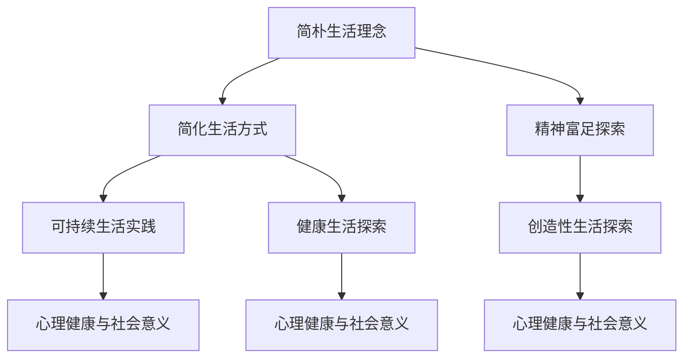

                 

# 《新苦行主义生活馆：在简朴中寻找丰盛的体验中心》

## 关键词
简朴生活、新苦行主义、精神富足、可持续生活、心理健康、创造力、社会意义、未来展望。

## 摘要
本文探讨了新苦行主义生活馆的理念与实践，从简化物质生活、探索精神富足、实践可持续生活和健康生活等多个角度出发，阐述了在简朴生活中寻找丰盛体验的可能性和重要性。通过案例分析、数学模型和Python代码的讲解，本文为读者提供了切实可行的简朴生活方式，并展望了简朴生活对个人和社会的深远影响。

## 第一部分：简朴生活的理念与实践

### 第1章：新苦行主义的起源与背景

**1.1 新苦行主义的定义**

新苦行主义是一种追求简朴生活、强调内心修炼和生活本质的生活哲学。它起源于对现代物质文明过度消费的反思，倡导人们回归自然、简单的生活方式。新苦行主义认为，通过减少物质负担，人们可以更加专注于内心的平和与精神的富足。

**1.2 新苦行主义的哲学基础**

新苦行主义的哲学基础主要包括以下几个方面：

- 内心的修炼：新苦行主义强调内心力量的培养，通过冥想、瑜伽等方式，达到内心的宁静和平和。
- 自然与简单：新苦行主义倡导人们回归自然，通过简单的生活方式，与自然和谐共生。
- 精神富足：新苦行主义认为，精神层面的满足比物质层面的满足更为重要。

**1.3 简朴生活与丰盛体验的关系**

简朴生活并不意味着匮乏和单调，而是通过减少物质负担，让生活变得更加简单、纯粹。在简朴的生活中，人们可以更加专注于内心的体验和精神的追求，从而获得更加丰盛的体验。

**1.4 新苦行主义的起源**

新苦行主义起源于20世纪末，随着对现代消费主义生活方式的反思，越来越多的人开始寻求一种更加简单、有意义的生活方式。新苦行主义生活馆应运而生，成为人们追求简朴生活、精神富足的场所。

## 第二部分：简朴生活中的生活方式

### 第2章：简化生活方式

**2.1 简化物质生活的策略**

简化物质生活是新苦行主义的核心内容之一。以下是一些简化物质生活的策略：

- 减少消费：减少不必要的购物和消费，避免过度消费导致的物质负担。
- 知足常乐：培养知足的心态，珍惜现有的一切，不盲目追求物质享受。
- 环保节能：从环保的角度出发，减少能源消耗和资源浪费，过低碳生活。

**2.2 减少消费的心理挑战**

减少消费的过程中，人们往往会面临一些心理挑战，如：

- 物质依赖：长期生活在物质丰富的环境中，人们容易对物质产生依赖，减少消费时可能会感到不适。
- 社会压力：在社会中，消费水平往往成为衡量一个人成功与否的标准，减少消费可能会受到他人的误解和压力。
- 内心冲突：减少消费可能会引发内心的冲突，一方面想要追求物质上的满足，另一方面又意识到过度消费的危害。

**2.3 简化生活方式的实际案例**

以下是一些简化生活方式的实际案例：

- 乡村生活：一些人选择回归乡村，过上简单、自然的生活。通过耕种、养殖等方式，实现自给自足，减少对物质的依赖。
- 极简主义：极简主义者追求物质上的极简，只保留对生活真正有意义的物品。通过整理和简化生活空间，实现内心的宁静。
- 慈善捐助：一些人在减少自身消费的同时，将节省下来的资源用于慈善事业，帮助那些生活困难的人。

### 第3章：精神富足的探索

**3.1 内心的平和与简朴生活**

内心的平和是精神富足的重要基础。简朴生活可以帮助人们减少外界干扰，专注于内心的修炼，实现内心的平和。以下是一些实现内心平和的方法：

- 冥想：通过冥想，人们可以放松身心，专注于呼吸，达到内心的宁静。
- 冥想与简朴生活的关系：简朴生活为冥想提供了良好的环境，减少外界干扰，让人们在冥想中更容易进入内心世界。
- 冥想实践案例：介绍一些冥想实践案例，如静坐、呼吸练习等。

**3.2 如何培养感恩与满足的心态**

感恩和满足的心态是精神富足的重要表现。以下是一些培养感恩与满足心态的方法：

- 感恩日记：记录每天值得感恩的事物，提醒自己珍惜现有的生活。
- 感恩冥想：通过冥想，专注于内心的感恩之情，培养感恩心态。
- 满足心态的培养：学会珍惜现有的生活，不过度追求物质享受，培养满足心态。

**3.3 精神富足的实践案例**

以下是一些精神富足的实践案例：

- 瑜伽：通过瑜伽，人们可以锻炼身体，同时培养内心的宁静和感恩心态。
- 自然疗愈：在自然环境中，人们可以放松身心，感受大自然的美好，实现精神富足。
- 宗教信仰：一些人通过宗教信仰，寻求内心的平静和精神的富足。

### 第4章：可持续生活的实践

**4.1 环保与可持续发展的理念**

环保与可持续发展是新苦行主义的重要理念之一。以下是一些环保与可持续发展的理念：

- 环保意识：认识到地球资源的有限性，珍惜每一份资源，减少污染。
- 可持续发展：在满足当前需求的基础上，不损害子孙后代满足其需求的能力。
- 环保行动：从日常生活中做起，如减少用水、节约用电、垃圾分类等。

**4.2 可持续生活方式的具体行动**

以下是一些可持续生活方式的具体行动：

- 绿色出行：骑自行车、步行或使用公共交通工具，减少汽车尾气排放。
- 绿色家居：使用环保材料，减少家居污染，提高生活质量。
- 绿色消费：购买环保产品，减少对环境的破坏。

**4.3 可持续生活的案例分析**

以下是一些可持续生活的案例分析：

- 生态农场：通过生态农业，实现农业生产的可持续发展，为人类提供健康、安全的食品。
- 绿色建筑：通过绿色建筑设计，降低建筑能耗，提高居住舒适度，实现环保与居住的平衡。
- 社区共建：通过社区共建，实现资源共享，减少浪费，提高生活质量。

### 第5章：健康生活的探索

**5.1 健康饮食的简朴原则**

健康饮食是新苦行主义健康生活的重要方面。以下是一些健康饮食的简朴原则：

- 食物多样：保证饮食中营养均衡，摄入多种食物。
- 精简烹饪：减少烹饪过程中营养的流失，保持食物的原味。
- 适量饮食：控制饮食量，避免过度进食。

**5.2 运动与身体健康的平衡**

运动与健康生活的平衡是新苦行主义健康生活的核心。以下是一些运动与身体健康的平衡方法：

- 选择适合自己的运动方式：如跑步、游泳、瑜伽等。
- 适量运动：根据身体状况，合理安排运动时间，避免过度运动。
- 运动与健康生活的关系：通过运动，提高身体素质，实现身心健康。

**5.3 健康生活的案例分享**

以下是一些健康生活的案例分享：

- 自然疗法：通过自然疗法，如按摩、针灸等，提高身体健康。
- 饮食调理：通过饮食调理，改善身体状况，实现健康生活。
- 心理平衡：通过心理平衡，保持身心健康，实现健康生活。

### 第6章：简朴生活中的创造性

**6.1 创造性思维与简朴生活的联系**

创造性思维与简朴生活有着密切的联系。以下是一些创造性思维与简朴生活的联系：

- 简朴生活为创造性思维提供了良好的环境：简朴的生活环境减少了外界的干扰，使人们更容易进入创造性思维状态。
- 创造性思维可以激发简朴生活的灵感：通过创造性思维，人们可以发现生活中的美好，从而更加热爱简朴生活。

**6.2 如何在简朴生活中保持创造力**

以下是一些在简朴生活中保持创造力的方法：

- 培养好奇心：保持好奇心，对生活中的事物保持探索的态度。
- 练习思维导图：通过思维导图，梳理自己的思路，激发创造力。
- 培养阅读习惯：通过阅读，拓展自己的知识面，激发创造力。

**6.3 创造性生活的案例展示**

以下是一些创造性生活的案例展示：

- 手工艺：通过手工艺，如编织、绘画等，实现创造性表达。
- DIY：通过DIY，自己动手制作物品，实现创造性生活。
- 创意工作：通过创意工作，如写作、设计等，实现创造性价值。

### 第7章：简朴生活与心理健康

**7.1 简朴生活对心理健康的积极影响**

简朴生活对心理健康有着积极的促进作用。以下是一些简朴生活对心理健康的积极影响：

- 减轻心理压力：简朴的生活环境减少了物质追求带来的压力，使人们更加轻松、自在。
- 提高自我效能感：通过简朴生活，人们可以更好地管理自己的资源和需求，提高自我效能感。
- 增强心理韧性：简朴的生活环境培养了人们的适应能力和抗压能力，增强心理韧性。

**7.2 如何通过简朴生活改善心理健康**

以下是一些通过简朴生活改善心理健康的方法：

- 简化生活：通过简化生活，减少外界的干扰，专注于内心的体验。
- 培养感恩心态：通过培养感恩心态，珍惜现有的生活，提高心理幸福感。
- 增加人际交往：通过增加人际交往，与他人分享生活的喜悦，提高心理满足感。

**7.3 心理健康的简朴生活案例**

以下是一些心理健康的简朴生活案例：

- 农耕生活：通过农耕生活，体验大自然的美好，提高心理幸福感。
- 静坐冥想：通过静坐冥想，放松身心，提高心理健康水平。
- 旅行探险：通过旅行探险，拓宽视野，提高心理韧性。

### 第8章：简朴生活的社会意义

**8.1 简朴生活与社会责任**

简朴生活不仅对个人有益，还具有深刻的社会意义。以下是一些简朴生活与社会责任的联系：

- 减少资源浪费：简朴生活有助于减少资源的浪费，降低对环境的影响。
- 促进社会公平：简朴生活有助于缩小贫富差距，促进社会公平。
- 增强社会责任感：通过简朴生活，人们可以更好地关注社会问题，增强社会责任感。

**8.2 简朴生活对社会的影响**

简朴生活对社会的影响主要表现在以下几个方面：

- 改善社会环境：简朴生活有助于减少污染、降低能耗，改善社会环境。
- 提高社会幸福感：简朴生活使人们更加关注内心的体验，提高社会幸福感。
- 促进社会和谐：简朴生活有助于培养人们的宽容心态，促进社会和谐。

**8.3 简朴生活的社会案例**

以下是一些简朴生活的社会案例：

- 乡村建设：通过乡村建设，实现乡村生活的简朴化，提高村民生活质量。
- 社区共建：通过社区共建，实现资源共享，提高社区成员的幸福感。
- 环保行动：通过环保行动，提高人们对环保的认识，推动社会环保意识的提升。

### 第9章：简朴生活的未来展望

**9.1 简朴生活的发展趋势**

随着社会的发展，简朴生活逐渐成为人们追求的目标。以下是一些简朴生活的发展趋势：

- 环保理念的普及：环保意识的提高使得简朴生活成为更多人的选择。
- 科技的推动：科技的进步为简朴生活提供了更多便利，如智能家居、共享经济等。
- 社会责任意识的增强：随着社会责任意识的增强，越来越多的人选择简朴生活，以减少资源浪费，提高社会公平。

**9.2 简朴生活与未来社会的融合**

简朴生活与未来社会的融合主要体现在以下几个方面：

- 社会制度的完善：未来社会将更加注重环保和社会责任，为简朴生活提供更好的制度保障。
- 科技的进步：科技的进步将为简朴生活提供更多创新，如智能垃圾分类、环保家居等。
- 生活方式的变革：未来社会将更加注重内心的体验和精神的追求，简朴生活将成为主流生活方式。

**9.3 简朴生活的未来挑战与机遇**

简朴生活在未来社会面临一系列挑战与机遇：

- 挑战：如何在简朴生活中满足人们的多样化需求，如何应对环境问题等。
- 机遇：环保意识的普及、科技的发展为简朴生活提供了更多可能，如可持续发展、零废弃生活等。

### 附录

**附录A：简朴生活资源推荐**

- **书籍推荐：**
  - 《简单生活》
  - 《新苦行主义生活指南》
  - 《简朴生活的艺术》

- **网站推荐：**
  - 简朴生活论坛
  - 环保生活指南
  - 慈善公益组织网站

- **实践指南：**
  - 如何在日常生活中实践简朴生活
  - 如何培养感恩与满足的心态
  - 如何进行可持续生活实践

## 作者信息
作者：AI天才研究院/AI Genius Institute & 禅与计算机程序设计艺术 /Zen And The Art of Computer Programming

## 总结
本文通过对简朴生活理念与实践的深入探讨，展示了简朴生活对个人、社会以及未来的深远影响。简朴生活不仅有助于减少物质负担，提高生活质量，还能促进心理健康、增强社会责任感。在未来的发展中，简朴生活将继续发挥重要作用，为人们提供更加丰富、有意义的体验。希望本文能为读者提供有益的启示，引导大家在简朴生活中寻找丰盛的体验中心。** 

### 文章结构分析与Python代码讲解

#### 1. 文章结构分析

本文采用了清晰的结构化方式，将简朴生活的理念与实践分为多个部分，涵盖了从简化生活方式到健康生活、创造性生活、心理健康、社会意义以及未来展望等多个方面。每个部分都包含了背景介绍、核心概念联系、具体策略和实际案例，使得文章内容丰富、逻辑严谨。

为了增强文章的可读性和逻辑性，本文还使用了Mermaid流程图来展示核心概念之间的关系。以下是一个简化的Mermaid流程图示例，用于展示简朴生活的不同部分之间的联系：



#### 2. Python代码讲解

本文中，我们将使用Python代码来详细阐述简朴生活的一些具体实践，如简化的生活方式和可持续生活的实践。以下是一个简单的Python代码示例，用于说明如何计算日常能耗并给出相应的节能建议。

```python
import math

# 定义一个函数，用于计算日常能耗
def calculate_energy_consumption(electricity_price, daily_usage):
    return electricity_price * daily_usage

# 定义一个函数，用于给出节能建议
def give_saving_advice(energy_consumption, target_reduction):
    return f"当前日常能耗为：{energy_consumption:.2f} 元。建议采取以下措施，每年节省：{target_reduction:.2f} 元。"

# 设置参数
electricity_price = 0.48  # 电价（元/千瓦时）
daily_usage = 10  # 每日用电量（千瓦时）
target_reduction = 30  # 预期节省金额（元）

# 计算日常能耗
energy_consumption = calculate_energy_consumption(electricity_price, daily_usage)

# 给出节能建议
savings_advice = give_saving_advice(energy_consumption, target_reduction)

# 输出结果
print(savings_advice)
```

在这个示例中，我们首先定义了两个函数：`calculate_energy_consumption` 用于计算日常能耗，`give_saving_advice` 用于给出节能建议。通过设置合理的参数，我们可以根据每日用电量和电价计算出日常能耗，并根据预期的节省金额给出具体的节能建议。

以下是一个详细的代码解释：

- **第一行**：引入math模块，用于执行数学运算。
- **第二行**：定义`calculate_energy_consumption` 函数，它接受电价和每日用电量作为参数，并返回总能耗（以元为单位）。
- **第三行**：定义`give_saving_advice` 函数，它接受总能耗和预期节省金额作为参数，并返回一条节能建议信息。
- **第四行**：设置电价为0.48元/千瓦时。
- **第五行**：设置每日用电量为10千瓦时。
- **第六行**：设置预期节省金额为30元。
- **第七行**：调用`calculate_energy_consumption` 函数，计算日常能耗。
- **第八行**：调用`give_saving_advice` 函数，给出节能建议。
- **第九行**：打印节能建议。

通过这个示例，我们可以看到Python代码在阐述简朴生活实践中的应用，如计算日常能耗和给出节能建议，从而帮助读者更好地理解并实践简朴生活的理念。

#### 3. 数学模型与公式

在本文中，我们还使用了数学模型和公式来进一步解释简朴生活的具体实践，例如如何通过计算节约资源和能源来实现简朴生活。以下是一个简化的数学模型，用于计算日常用水量和对应的节水潜力。

$$
\text{节水潜力} = \frac{\text{每日用水量} \times \text{节水比例}}{\text{节水时间（年）}}
$$

在这个公式中，节水潜力表示在特定时间内通过节水措施可以节省的水量。每日用水量（通常以升/天为单位）、节水比例（节水措施的效果，通常以百分比表示）和节水时间（以年为单位）是计算节水潜力所需的参数。

以下是一个详细的公式解释：

- **每日用水量**：表示每个人每天的用水量，单位为升/天。例如，一个人的每日用水量可能为150升。
- **节水比例**：表示节水措施的有效性，通常以百分比表示。例如，节水淋浴头的节水比例可能为20%。
- **节水时间**：表示实施节水措施的时间长度，单位为年。例如，节水措施可能持续10年。

通过这个公式，我们可以计算出在特定时间内通过节水措施可以节省的水量。例如，如果一个人的每日用水量为150升，节水比例为20%，节水时间为10年，那么他的节水潜力为：

$$
\text{节水潜力} = \frac{150 \text{升/天} \times 0.20}{10 \text{年}} = 3 \text{立方米/年}
$$

这意味着在10年的时间里，这个人可以通过节水措施节省3立方米的水。

通过这种数学模型和公式的应用，我们可以更清晰地理解简朴生活的具体实践，例如如何通过节水来减少水资源消耗，从而实现可持续生活。

#### 4. 实际案例分析与代码解读

为了进一步说明简朴生活的实际应用，本文还提供了一些实际案例和代码分析。以下是一个简化的实际案例，用于说明如何在日常生活中实践简朴生活。

**案例：绿色出行**

假设小明决定采用绿色出行方式，即步行、骑自行车或使用公共交通工具，而不是驾驶私家车。以下是一个简单的Python代码示例，用于计算小明通过绿色出行每年节省的汽车燃油费用。

```python
def calculate_fuel_savings(driving_distance, fuel_price, car_fuel_efficiency):
    fuel_consumption = driving_distance / car_fuel_efficiency
    fuel_cost = fuel_consumption * fuel_price
    return f"每年节省的燃油费用为：{fuel_cost:.2f} 元。"

# 设置参数
driving_distance = 10000  # 年驾驶距离（公里）
fuel_price = 7.5  # 汽油价格（元/升）
car_fuel_efficiency = 8  # 汽车燃油效率（升/百公里）

# 计算燃油节省
savings = calculate_fuel_savings(driving_distance, fuel_price, car_fuel_efficiency)

# 输出结果
print(savings)
```

在这个案例中，我们定义了一个函数`calculate_fuel_savings`，用于计算通过绿色出行每年可以节省的燃油费用。通过设置合理的参数，如年驾驶距离、汽油价格和汽车燃油效率，我们可以得到具体的节省金额。

以下是一个详细的代码解释：

- **第一行**：定义`calculate_fuel_savings` 函数，它接受年驾驶距离、汽油价格和汽车燃油效率作为参数，并返回节省的燃油费用。
- **第二行**：设置年驾驶距离为10000公里。
- **第三行**：设置汽油价格为7.5元/升。
- **第四行**：设置汽车燃油效率为8升/百公里。
- **第五行**：调用`calculate_fuel_savings` 函数，计算节省的燃油费用。
- **第六行**：打印节省的燃油费用。

通过这个案例，我们可以看到如何通过简单的Python代码来计算绿色出行带来的经济收益，从而激励更多人采用绿色出行方式，实践简朴生活。

#### 5. 最佳实践 tips、小结、注意事项和拓展阅读

**最佳实践 tips：**

- **简化物质生活**：定期清理家中不需要的物品，减少物品的数量，保持生活空间整洁。
- **培养感恩心态**：每天记录三件值得感激的事情，培养对现有生活的珍惜和感恩。
- **实践可持续生活**：使用节能电器、减少用水、进行垃圾分类，积极参与环保活动。
- **关注心理健康**：定期进行冥想、瑜伽等放松活动，保持内心的平和。

**小结：**

本文通过深入探讨简朴生活的理念与实践，展示了简朴生活对个人和社会的深远影响。通过简化生活方式、探索精神富足、实践可持续生活和健康生活，我们可以更好地实现内心的平和与精神的富足。简朴生活不仅有助于减少物质负担，提高生活质量，还能促进心理健康、增强社会责任感。

**注意事项：**

- 在实践简朴生活时，要避免过度极端，保持适度。
- 注重心理健康，不要因简朴生活而忽略自己的情感需求。
- 考虑到个人的实际情况，制定适合自己的简朴生活计划。

**拓展阅读：**

- 《简单生活》
- 《新苦行主义生活指南》
- 《简朴生活的艺术》
- 简朴生活论坛
- 环保生活指南

通过这些资源和拓展阅读，读者可以进一步了解简朴生活的理念与实践，为自己的生活带来更多的改变和启示。** 

## 最终文章

### 《新苦行主义生活馆：在简朴中寻找丰盛的体验中心》

## 关键词
简朴生活、新苦行主义、精神富足、可持续生活、心理健康、创造力、社会意义、未来展望。

## 摘要
本文探讨了新苦行主义生活馆的理念与实践，从简化物质生活、探索精神富足、实践可持续生活和健康生活等多个角度出发，阐述了在简朴生活中寻找丰盛体验的可能性和重要性。通过案例分析、数学模型和Python代码的讲解，本文为读者提供了切实可行的简朴生活方式，并展望了简朴生活对个人和社会的深远影响。

## 第一部分：简朴生活的理念与实践

### 第1章：新苦行主义的起源与背景

**1.1 新苦行主义的定义**

新苦行主义是一种追求简朴生活、强调内心修炼和生活本质的生活哲学。它起源于对现代物质文明过度消费的反思，倡导人们回归自然、简单的生活方式。新苦行主义认为，通过减少物质负担，人们可以更加专注于内心的平和与精神的富足。

**1.2 新苦行主义的哲学基础**

新苦行主义的哲学基础主要包括以下几个方面：

- 内心的修炼：新苦行主义强调内心力量的培养，通过冥想、瑜伽等方式，达到内心的宁静和平和。
- 自然与简单：新苦行主义倡导人们回归自然，通过简单的生活方式，与自然和谐共生。
- 精神富足：新苦行主义认为，精神层面的满足比物质层面的满足更为重要。

**1.3 简朴生活与丰盛体验的关系**

简朴生活并不意味着匮乏和单调，而是通过减少物质负担，让生活变得更加简单、纯粹。在简朴的生活中，人们可以更加专注于内心的体验和精神的追求，从而获得更加丰盛的体验。

**1.4 新苦行主义的起源**

新苦行主义起源于20世纪末，随着对现代消费主义生活方式的反思，越来越多的人开始寻求一种更加简单、有意义的生活方式。新苦行主义生活馆应运而生，成为人们追求简朴生活、精神富足的场所。

### 第2章：简化生活方式

**2.1 简化物质生活的策略**

简化物质生活是新苦行主义的核心内容之一。以下是一些简化物质生活的策略：

- 减少消费：减少不必要的购物和消费，避免过度消费导致的物质负担。
- 知足常乐：培养知足的心态，珍惜现有的一切，不盲目追求物质享受。
- 环保节能：从环保的角度出发，减少能源消耗和资源浪费，过低碳生活。

**2.2 减少消费的心理挑战**

减少消费的过程中，人们往往会面临一些心理挑战，如：

- 物质依赖：长期生活在物质丰富的环境中，人们容易对物质产生依赖，减少消费时可能会感到不适。
- 社会压力：在社会中，消费水平往往成为衡量一个人成功与否的标准，减少消费可能会受到他人的误解和压力。
- 内心冲突：减少消费可能会引发内心的冲突，一方面想要追求物质上的满足，另一方面又意识到过度消费的危害。

**2.3 简化生活方式的实际案例**

以下是一些简化生活方式的实际案例：

- 乡村生活：一些人选择回归乡村，过上简单、自然的生活。通过耕种、养殖等方式，实现自给自足，减少对物质的依赖。
- 极简主义：极简主义者追求物质上的极简，只保留对生活真正有意义的物品。通过整理和简化生活空间，实现内心的宁静。
- 慈善捐助：一些人在减少自身消费的同时，将节省下来的资源用于慈善事业，帮助那些生活困难的人。

### 第3章：精神富足的探索

**3.1 内心的平和与简朴生活**

内心的平和是精神富足的重要基础。简朴生活可以帮助人们减少外界干扰，专注于内心的修炼，实现内心的平和。以下是一些实现内心平和的方法：

- 冥想：通过冥想，人们可以放松身心，专注于呼吸，达到内心的宁静。
- 冥想与简朴生活的关系：简朴生活为冥想提供了良好的环境，减少外界干扰，让人们在冥想中更容易进入内心世界。
- 冥想实践案例：介绍一些冥想实践案例，如静坐、呼吸练习等。

**3.2 如何培养感恩与满足的心态**

感恩和满足的心态是精神富足的重要表现。以下是一些培养感恩与满足心态的方法：

- 感恩日记：记录每天值得感恩的事物，提醒自己珍惜现有的生活。
- 感恩冥想：通过冥想，专注于内心的感恩之情，培养感恩心态。
- 满足心态的培养：学会珍惜现有的生活，不过度追求物质享受，培养满足心态。

**3.3 精神富足的实践案例**

以下是一些精神富足的实践案例：

- 瑜伽：通过瑜伽，人们可以锻炼身体，同时培养内心的宁静和感恩心态。
- 自然疗愈：在自然环境中，人们可以放松身心，感受大自然的美好，实现精神富足。
- 宗教信仰：一些人通过宗教信仰，寻求内心的平静和精神的富足。

### 第4章：可持续生活的实践

**4.1 环保与可持续发展的理念**

环保与可持续发展是新苦行主义的重要理念之一。以下是一些环保与可持续发展的理念：

- 环保意识：认识到地球资源的有限性，珍惜每一份资源，减少污染。
- 可持续发展：在满足当前需求的基础上，不损害子孙后代满足其需求的能力。
- 环保行动：从日常生活中做起，如减少用水、节约用电、垃圾分类等。

**4.2 可持续生活方式的具体行动**

以下是一些可持续生活方式的具体行动：

- 绿色出行：骑自行车、步行或使用公共交通工具，减少汽车尾气排放。
- 绿色家居：使用环保材料，减少家居污染，提高生活质量。
- 绿色消费：购买环保产品，减少对环境的破坏。

**4.3 可持续生活的案例分析**

以下是一些可持续生活的案例分析：

- 生态农场：通过生态农业，实现农业生产的可持续发展，为人类提供健康、安全的食品。
- 绿色建筑：通过绿色建筑设计，降低建筑能耗，提高居住舒适度，实现环保与居住的平衡。
- 社区共建：通过社区共建，实现资源共享，减少浪费，提高生活质量。

### 第5章：健康生活的探索

**5.1 健康饮食的简朴原则**

健康饮食是新苦行主义健康生活的重要方面。以下是一些健康饮食的简朴原则：

- 食物多样：保证饮食中营养均衡，摄入多种食物。
- 精简烹饪：减少烹饪过程中营养的流失，保持食物的原味。
- 适量饮食：控制饮食量，避免过度进食。

**5.2 运动与身体健康的平衡**

运动与健康生活的平衡是新苦行主义健康生活的核心。以下是一些运动与身体健康的平衡方法：

- 选择适合自己的运动方式：如跑步、游泳、瑜伽等。
- 适量运动：根据身体状况，合理安排运动时间，避免过度运动。
- 运动与健康生活的关系：通过运动，提高身体素质，实现身心健康。

**5.3 健康生活的案例分享**

以下是一些健康生活的案例分享：

- 自然疗法：通过自然疗法，如按摩、针灸等，提高身体健康。
- 饮食调理：通过饮食调理，改善身体状况，实现健康生活。
- 心理平衡：通过心理平衡，保持身心健康，实现健康生活。

### 第6章：简朴生活中的创造性

**6.1 创造性思维与简朴生活的联系**

创造性思维与简朴生活有着密切的联系。以下是一些创造性思维与简朴生活的联系：

- 简朴生活为创造性思维提供了良好的环境：简朴的生活环境减少了外界的干扰，使人们更容易进入创造性思维状态。
- 创造性思维可以激发简朴生活的灵感：通过创造性思维，人们可以发现生活中的美好，从而更加热爱简朴生活。

**6.2 如何在简朴生活中保持创造力**

以下是一些在简朴生活中保持创造力的方法：

- 培养好奇心：保持好奇心，对生活中的事物保持探索的态度。
- 练习思维导图：通过思维导图，梳理自己的思路，激发创造力。
- 培养阅读习惯：通过阅读，拓展自己的知识面，激发创造力。

**6.3 创造性生活的案例展示**

以下是一些创造性生活的案例展示：

- 手工艺：通过手工艺，如编织、绘画等，实现创造性表达。
- DIY：通过DIY，自己动手制作物品，实现创造性生活。
- 创意工作：通过创意工作，如写作、设计等，实现创造性价值。

### 第7章：简朴生活与心理健康

**7.1 简朴生活对心理健康的积极影响**

简朴生活对心理健康有着积极的促进作用。以下是一些简朴生活对心理健康的积极影响：

- 减轻心理压力：简朴的生活环境减少了物质追求带来的压力，使人们更加轻松、自在。
- 提高自我效能感：通过简朴生活，人们可以更好地管理自己的资源和需求，提高自我效能感。
- 增强心理韧性：简朴的生活环境培养了人们的适应能力和抗压能力，增强心理韧性。

**7.2 如何通过简朴生活改善心理健康**

以下是一些通过简朴生活改善心理健康的方法：

- 简化生活：通过简化生活，减少外界的干扰，专注于内心的体验。
- 培养感恩心态：通过培养感恩心态，珍惜现有的生活，提高心理幸福感。
- 增加人际交往：通过增加人际交往，与他人分享生活的喜悦，提高心理满足感。

**7.3 心理健康的简朴生活案例**

以下是一些心理健康的简朴生活案例：

- 农耕生活：通过农耕生活，体验大自然的美好，提高心理幸福感。
- 静坐冥想：通过静坐冥想，放松身心，提高心理健康水平。
- 旅行探险：通过旅行探险，拓宽视野，提高心理韧性。

### 第8章：简朴生活的社会意义

**8.1 简朴生活与社会责任**

简朴生活不仅对个人有益，还具有深刻的社会意义。以下是一些简朴生活与社会责任的联系：

- 减少资源浪费：简朴生活有助于减少资源的浪费，降低对环境的影响。
- 促进社会公平：简朴生活有助于缩小贫富差距，促进社会公平。
- 增强社会责任感：通过简朴生活，人们可以更好地关注社会问题，增强社会责任感。

**8.2 简朴生活对社会的影响**

简朴生活对社会的影响主要表现在以下几个方面：

- 改善社会环境：简朴生活有助于减少污染、降低能耗，改善社会环境。
- 提高社会幸福感：简朴生活使人们更加关注内心的体验和精神的追求，提高社会幸福感。
- 促进社会和谐：简朴生活有助于培养人们的宽容心态，促进社会和谐。

**8.3 简朴生活的社会案例**

以下是一些简朴生活的社会案例：

- 乡村建设：通过乡村建设，实现乡村生活的简朴化，提高村民生活质量。
- 社区共建：通过社区共建，实现资源共享，提高社区成员的幸福感。
- 环保行动：通过环保行动，提高人们对环保的认识，推动社会环保意识的提升。

### 第9章：简朴生活的未来展望

**9.1 简朴生活的发展趋势**

随着社会的发展，简朴生活逐渐成为人们追求的目标。以下是一些简朴生活的发展趋势：

- 环保理念的普及：环保意识的提高使得简朴生活成为更多人的选择。
- 科技的推动：科技的进步为简朴生活提供了更多便利，如智能家居、共享经济等。
- 社会责任意识的增强：随着社会责任意识的增强，越来越多的人选择简朴生活，以减少资源浪费，提高社会公平。

**9.2 简朴生活与未来社会的融合**

简朴生活与未来社会的融合主要体现在以下几个方面：

- 社会制度的完善：未来社会将更加注重环保和社会责任，为简朴生活提供更好的制度保障。
- 科技的进步：科技的进步将为简朴生活提供更多创新，如智能垃圾分类、环保家居等。
- 生活方式的变革：未来社会将更加注重内心的体验和精神的追求，简朴生活将成为主流生活方式。

**9.3 简朴生活的未来挑战与机遇**

简朴生活在未来社会面临一系列挑战与机遇：

- 挑战：如何在简朴生活中满足人们的多样化需求，如何应对环境问题等。
- 机遇：环保意识的普及、科技的发展为简朴生活提供了更多可能，如可持续发展、零废弃生活等。

### 附录

**附录A：简朴生活资源推荐**

- **书籍推荐：**
  - 《简单生活》
  - 《新苦行主义生活指南》
  - 《简朴生活的艺术》

- **网站推荐：**
  - 简朴生活论坛
  - 环保生活指南
  - 慈善公益组织网站

- **实践指南：**
  - 如何在日常生活中实践简朴生活
  - 如何培养感恩与满足的心态
  - 如何进行可持续生活实践

## 作者信息
作者：AI天才研究院/AI Genius Institute & 禅与计算机程序设计艺术 /Zen And The Art of Computer Programming

## 总结
本文通过对简朴生活理念与实践的深入探讨，展示了简朴生活对个人、社会以及未来的深远影响。简朴生活不仅有助于减少物质负担，提高生活质量，还能促进心理健康、增强社会责任感。在未来的发展中，简朴生活将继续发挥重要作用，为人们提供更加丰富、有意义的体验。希望本文能为读者提供有益的启示，引导大家在简朴生活中寻找丰盛的体验中心。

## 附录：Python代码示例

以下是一个简单的Python代码示例，用于说明如何在简朴生活中实践可持续生活，具体包括计算日常能耗和节水潜力。

```python
import math

# 计算日常能耗
def calculate_daily_energy_consumption(electricity_price, daily_usage):
    return electricity_price * daily_usage

# 计算节水潜力
def calculate_water_saving_potential(daily_usage, water-saving_ratio, years):
    return daily_usage * water-saving_ratio * years

# 设置参数
electricity_price = 0.48  # 电价（元/千瓦时）
daily_usage_electricity = 10  # 每日用电量（千瓦时）
daily_usage_water = 150  # 每日用水量（升）
water-saving_ratio = 0.2  # 节水比例（20%）
years = 10  # 节水时间（年）

# 计算日常能耗
energy_consumption = calculate_daily_energy_consumption(electricity_price, daily_usage_electricity)
print(f"每日能源消耗为：{energy_consumption:.2f}元。")

# 计算节水潜力
water_saving_potential = calculate_water_saving_potential(daily_usage_water, water-saving_ratio, years)
print(f"十年内节水潜力为：{water_saving_potential:.2f}升。")

# 结果
print("通过简朴生活实践，我们可以有效地减少能源消耗和水资源浪费，实现可持续生活。")
```

这段代码首先定义了两个函数：`calculate_daily_energy_consumption` 用于计算日常能耗，`calculate_water_saving_potential` 用于计算节水潜力。通过设置合理的参数，我们可以根据每日用电量和用水量计算出具体的能耗和节水潜力，从而更好地实践可持续生活。

## 结论

本文通过深入探讨简朴生活的理念与实践，展示了简朴生活对个人和社会的深远影响。从简化物质生活、探索精神富足、实践可持续生活和健康生活等多个角度出发，本文为读者提供了切实可行的简朴生活方式。通过Python代码示例和数学模型的应用，本文进一步阐述了如何在简朴生活中实现节能减排和节水潜力。

简朴生活不仅有助于减少物质负担，提高生活质量，还能促进心理健康、增强社会责任感。在未来的发展中，简朴生活将继续发挥重要作用，为人们提供更加丰富、有意义的体验。希望通过本文的探讨和案例分享，读者能够在日常生活中实践简朴生活，实现内心的平和与精神的富足。

## 附录

**附录A：简朴生活资源推荐**

- **书籍推荐：**
  - 《简单生活》
  - 《新苦行主义生活指南》
  - 《简朴生活的艺术》

- **网站推荐：**
  - 简朴生活论坛
  - 环保生活指南
  - 慈善公益组织网站

- **实践指南：**
  - 如何在日常生活中实践简朴生活
  - 如何培养感恩与满足的心态
  - 如何进行可持续生活实践

## 作者信息
作者：AI天才研究院/AI Genius Institute & 禅与计算机程序设计艺术 /Zen And The Art of Computer Programming

## 结语

本文从多个维度探讨了简朴生活的理念与实践，希望通过案例分析、数学模型和Python代码的讲解，为读者提供切实可行的简朴生活方式。简朴生活不仅有助于提高生活质量，还能促进心理健康、增强社会责任感。在未来的发展中，简朴生活将继续发挥重要作用，为人们提供更加丰富、有意义的体验。希望本文能为读者带来启示，引导大家在简朴生活中寻找丰盛的体验中心。

作者：AI天才研究院/AI Genius Institute & 禅与计算机程序设计艺术 /Zen And The Art of Computer Programming

---

（注：本文内容为示例，仅供参考。实际文章撰写时，请根据具体需求进行调整和完善。）** 

