                 

### 引言

#### 1. 现代社会的精神挑战

在当今高速发展的现代社会，人们面临着越来越多的精神挑战。随着科技的发展、信息的爆炸以及生活节奏的加快，人们承受的压力越来越大，焦虑、抑郁等心理问题日益突出。社会竞争的激烈、人际关系的复杂以及自我认同的缺失，都使得现代社会中的个体处于一种紧张和不安的状态。这种精神上的困境，不仅影响了个体的生活质量，也对整个社会的稳定和发展构成了威胁。

#### 2. 苦行僧的起源与内涵

苦行僧，源自于佛教中的修行者，是指在修行过程中通过身体和精神的自我折磨，以达到超脱世俗、净化心灵的目的。他们以严格的自控、简朴的生活和极端的修行方式，追求内心的平静和精神的升华。苦行僧的修行，不仅仅是一种宗教行为，更是一种对人生意义的深刻思考和探索。

#### 3. 书籍的目的与结构

本书旨在探讨苦行僧的精神修行方法在现代社会中的应用，分析其在应对现代精神挑战中的有效性。全书共分为三个部分：第一部分介绍苦行僧的精神修行方法论，包括核心信念、修行路径、心理调适和社会实践；第二部分探讨苦行僧在现代社会的应用与实践，包括职场、家庭和教育中的实践；第三部分则是通过对成功案例的研究，总结苦行僧在现代社会的挑战与机遇。

通过本书的探讨，我们希望为读者提供一种新的思考方式，帮助他们在现代社会中找到精神的平衡，实现内心的宁静和自我超越。

### 现代社会的精神挑战

现代社会的发展带来了诸多便利，但同时也引发了一系列精神健康问题。首先，快节奏的生活让许多人感到压力山大。工作、家庭、社交等多方面的责任，使得个体时常感到疲惫不堪，长期处于紧张状态。其次，随着互联网和社交媒体的普及，信息的爆炸和过载也让人们感到应接不暇，容易产生焦虑和抑郁情绪。此外，现代社会的竞争激烈，人际关系的复杂化，也让许多人在寻找自我认同的过程中感到困惑和迷茫。

心理健康问题的普遍存在，不仅影响了个体的生活质量，也对社会的稳定和发展构成了威胁。首先，精神问题可能导致工作效率下降，影响生产力和经济发展。其次，家庭和社会关系的紧张，可能导致社会问题的加剧，影响社会的和谐与稳定。因此，如何应对现代社会的精神挑战，已成为一个亟待解决的问题。

### 苦行僧的起源与内涵

苦行僧，这一源自佛教的修行者群体，有着悠久的历史和丰富的内涵。其起源可以追溯到古代印度，当时佛教刚刚兴起。佛教的创始人释迦牟尼在苦行中获得了觉悟，开创了佛教的修行传统。随着时间的推移，苦行僧的修行方式逐渐演变，形成了独特的修行体系和价值观念。

苦行僧的核心信念在于通过自我折磨和极端的修行，以达到超脱世俗、净化心灵的目的。他们坚信，只有通过身心的极致修炼，才能摆脱欲望的束缚，实现内心的平静和精神的升华。这种信念不仅体现了他们对宗教信仰的坚定，也反映了对人生意义的深刻思考。

苦行僧的生活态度体现在他们的日常生活和行为中。他们以简朴的生活方式为主，拒绝奢华和物质享受。他们住在简陋的寺庙或茅棚中，以素食为主，过着清苦的生活。他们的行为举止也遵循严格的戒律，如不杀人、不偷盗、不妄语等。这种生活态度不仅是对自我欲望的控制，也是对道德和伦理的坚守。

在道德观念方面，苦行僧强调慈悲、无私和奉献。他们认为，只有通过无私的奉献和服务他人，才能达到心灵的升华。因此，许多苦行僧投身于慈善事业，为贫困人群提供帮助。他们的行为不仅体现了对社会的责任感，也是对自我价值的实现。

总的来说，苦行僧的修行方法和精神内涵，为现代社会提供了一种独特的思考方式和生活方式。尽管他们的修行方式极端，但其所追求的心灵平静和精神升华，对现代社会中的个体而言，具有重要的启示意义。通过学习和借鉴苦行僧的修行方法，我们可以更好地应对现代社会的精神挑战，实现内心的宁静和自我超越。

### 苦行僧的起源与内涵

#### 1. 苦行僧的哲学基础

苦行僧的哲学基础主要源自佛教的核心教义，即“四圣谛”和“八正道”。四圣谛包括苦谛、集谛、灭谛和道谛，揭示了人生的痛苦根源、痛苦的产生原因、痛苦的解脱之道和实现解脱的途径。八正道则是实现解脱的具体实践方法，包括正见、正思维、正语、正业、正命、正精进、正念和正定。

在苦行僧的修行过程中，他们通过严格的自律和极端的修行，实践八正道，以达到心灵的净化和精神的升华。例如，通过正见，他们认识到生命的本质和痛苦的根源，从而摆脱对世俗欲望的执着。通过正思维，他们培养正确的思维方式和情绪管理能力，以保持内心的平静和专注。通过正语、正业和正命，他们遵循道德规范，保持行为和生活方式的纯洁。

#### 2. 苦行僧的生活态度

苦行僧的生活态度体现在他们的日常生活和行为中。首先，他们以极简的生活方式为主，拒绝奢华和物质享受。他们居住在简陋的寺庙或茅棚中，以素食为主，过着清苦的生活。其次，他们严格遵守戒律，如不杀人、不偷盗、不妄语、不邪淫等，以保持心灵的纯净和道德的高尚。

此外，苦行僧强调无私的奉献和服务他人。他们认为，通过无私的奉献和服务他人，可以积累善缘，实现心灵的升华。因此，许多苦行僧投身于慈善事业，为贫困人群提供帮助，如修建寺庙、救济贫困、教育贫童等。他们的行为不仅体现了对社会的责任感，也是对自我价值的实现。

#### 3. 苦行僧的道德观念

苦行僧的道德观念强调慈悲、无私和奉献。他们相信，只有通过无私的奉献和服务他人，才能达到心灵的升华。因此，许多苦行僧将自己的智慧和力量用于帮助他人，不仅为贫困人群提供物质帮助，还通过教育和精神引导，帮助人们摆脱痛苦和困境。

在道德实践中，苦行僧注重内心的修炼和行为的规范。他们通过冥想和禅修，培养慈悲心和无畏心，提升自我意识，实现心灵的净化。同时，他们以身作则，遵循道德规范，树立榜样，影响他人。这种道德观念不仅体现在个人的修行中，也体现在他们与社会的互动中。

总的来说，苦行僧的哲学基础、生活态度和道德观念，共同构成了他们独特的修行体系和价值观念。这些价值观不仅为苦行僧的修行提供了方向和动力，也为现代社会中的个体提供了深刻的启示和指导。通过学习和借鉴苦行僧的修行方法，我们可以更好地应对现代社会的精神挑战，实现内心的宁静和自我超越。

### 苦行僧的修行路径

#### 1. 修行的准备与启动

苦行僧的修行之旅并非一蹴而就，而是一个需要精心准备和逐步启动的过程。首先，个体需要明确自己的修行目标和动机。无论是为了心灵的净化、自我超越，还是为了服务社会和他人，明确的目标是修行的基础。接着，个体需要进行身体和心理的调适。这包括改善生活习惯，如规律作息、健康饮食、适量运动等，以及心理上的调整，如减少干扰、培养专注力和耐力。

在准备阶段，个体还可以通过阅读相关的修行书籍、参与冥想和瑜伽课程，来提升对修行方法和理论的理解。此外，与经验丰富的修行者交流和请教，也是一个重要的步骤。通过这些准备，个体能够更好地理解修行的本质，增强对修行过程的信心和决心。

#### 2. 日常修行实践

日常修行是苦行僧生活中的核心部分，贯穿于他们的日常生活。首先，晨间冥想是修行的起点。苦行僧通常在黎明前起床，进行一段时间的冥想，以平静心灵，集中注意力。他们通过呼吸冥想、专注冥想或禅修等方式，培养专注力和正念。

其次，日常生活中的行为也遵循修行的原则。他们以简洁、有纪律的生活方式为主，避免过度消费和物质享受。在饮食上，他们通常以素食为主，保持身体的清净和心灵的平静。在工作和社会交往中，他们遵循道德规范，如不偷盗、不妄语等，以维护内心的纯净和高尚。

此外，修行还包括对自身情绪的管理。苦行僧通过正念和冥想，学会观察和管理自己的情绪，避免被负面情绪所控制。他们通过自我反思和感恩，培养积极的心态，提升心理韧性。

#### 3. 特殊修行实践

除了日常修行，苦行僧还会进行一些特殊的修行实践，以进一步提升自身的修行层次。这些特殊修行通常需要严格的环境和条件，如长时间的独居、禁食、极端的体力劳动等。

例如，一些苦行僧会选择长时间的独居，与外界隔绝，以专注于内心的修行。在这种环境中，他们面临更多的挑战和困境，但也能够更好地体验到内心的宁静和力量。禁食是另一种常见的特殊修行方式，通过限制食物摄入，苦行僧能够更好地专注于内心的探索，提升自控力和精神力量。

极端的体力劳动，如长时间的搬运重物或修建寺庙，也是一些苦行僧的选择。通过这些体力劳动，他们不仅锻炼身体，更重要的是在极端环境中体验心灵的坚韧和毅力。这种特殊的修行方式，能够帮助他们在面对生活中的困难时，保持积极的心态和坚定的信念。

总的来说，苦行僧的修行路径是一个系统而深入的过程，从准备阶段到日常实践，再到特殊修行，每个环节都紧密相连，共同构成了他们独特的修行体系。通过这些修行，苦行僧不仅实现了内心的平静和精神的升华，也为现代社会中的个体提供了一种深刻的启示和指导。

### 苦行僧的心理调适

在修行的过程中，心理调适是至关重要的一环。对于苦行僧而言，他们的修行不仅是为了身体的净化，更重要的是心灵的升华。因此，情绪管理和冥想成为他们心理调适的主要方法。

首先，情绪管理是修行过程中必不可少的技能。苦行僧通过正念和冥想，学会观察和管理自己的情绪。正念是指对当前时刻的觉知，通过专注于呼吸、身体感受和思维活动，苦行僧能够更好地了解自己的情绪状态，并避免被负面情绪所控制。例如，当情绪波动时，他们通过深呼吸和专注冥想，逐渐平静下来，恢复内心的平静。

冥想是苦行僧日常修行的核心，它不仅有助于情绪管理，还能够提升自我意识和心理韧性。通过冥想，苦行僧能够深入内心，探索自我，发现并解决内心的冲突。冥想的形式多样，包括专注冥想、呼吸冥想和观想冥想等。例如，在专注冥想中，苦行僧将注意力集中在呼吸上，通过反复的呼吸练习，培养专注力和正念；在呼吸冥想中，他们通过深呼吸来放松身体和心灵，减轻压力和焦虑。

其次，自我认知和反思也是苦行僧心理调适的重要组成部分。通过自我反思，他们能够更好地了解自己的内在需求和动机，从而调整行为和心态。例如，每天结束修行后，苦行僧会花时间记录自己的修行体验和情绪变化，通过反思来发现和解决内在的冲突。这种反思不仅有助于个人的成长，也能够增强心理韧性。

最后，心理健康的重要性不容忽视。在修行的过程中，苦行僧注重心理健康的维护，通过冥想、正念和自我反思，他们能够保持内心的平衡和和谐。此外，他们还通过社交互动和社区活动，与他人分享修行的经验和感悟，从而获得心理上的支持和安慰。

总的来说，情绪管理和冥想是苦行僧心理调适的主要方法，通过这些方法，他们能够更好地应对修行过程中的挑战和困境，实现内心的平静和精神的升华。

### 苦行僧的社会实践

苦行僧不仅关注个人修行，还积极参与社会实践活动，通过实际行动为社会贡献力量，实现心灵与社会价值的双重提升。

首先，社区建设是苦行僧社会实践的重要方面。他们致力于创建和谐、互助的社区环境，通过举办讲座、研讨会和公益活动，提升社区居民的道德素养和生活质量。例如，一些苦行僧会定期在社区中心开设冥想课程，帮助居民缓解压力、提升心理健康。他们还组织志愿者团队，参与社区清洁、绿化和环境保护等公益活动，以实际行动推动社区的可持续发展。

其次，志愿服务与慈善活动是苦行僧参与社会的重要途径。他们以无私奉献的精神，投身于各种志愿服务和慈善事业。例如，许多苦行僧积极参与贫困地区的教育项目，为贫困儿童提供免费的教育资源和辅导。他们还致力于救助贫困人群、孤儿和老人，通过捐款、捐物和提供生活援助，帮助他们摆脱困境。此外，苦行僧还组织大型慈善活动，如募捐活动、慈善晚会等，筹集善款用于社会公益事业。

在参与社会实践的过程中，苦行僧不仅提升了自身的精神境界，也对社会产生了深远的影响。他们的无私奉献和道德行为，激发了社会的正能量，推动了社会的和谐与进步。例如，通过他们的努力，许多贫困地区的儿童得到了良好的教育机会，贫困人群得到了生活援助，社区环境得到了显著改善。

社会影响的评估与反思是苦行僧社会实践的重要环节。他们通过定期的评估和反思，总结社会实践活动中的经验和教训，不断优化和改进自己的工作方式。例如，他们通过问卷调查、访谈和观察，了解社区居民的需求和反馈，及时调整志愿服务和慈善活动的策略，确保活动的有效性和可持续性。

总的来说，苦行僧的社会实践不仅是一种社会责任，更是一种修行的方式。通过参与社区建设、志愿服务和慈善活动，他们不仅为社会作出了贡献，也实现了自身的价值，体现了精神修行的真正意义。

### 现代生活中的苦行僧

#### 5.1 职场苦行僧的挑战与应对

在职场中，苦行僧面临着诸多独特的挑战。首先，高强度的工作压力和时间管理问题是一个普遍的难题。现代职场环境要求员工高效、快速地完成任务，往往导致长时间的工作和高度的精神紧张。对于苦行僧而言，如何在繁忙的工作中保持内心的平静和专注，是首要解决的问题。

**解决方案与策略**：

1. **时间管理**：苦行僧可以通过制定详细的工作计划和时间表，合理安排工作任务，避免因紧急任务而导致的临时突击和过度劳累。例如，他们可以利用番茄工作法，将工作时间分割成多个25分钟的工作周期，每个周期后休息5分钟，以保持工作的高效和注意力集中。

2. **情绪管理**：通过冥想和正念练习，苦行僧能够更好地管理自己的情绪，减少压力和焦虑。例如，在感到紧张或焦虑时，他们可以通过深呼吸和冥想来平复情绪，恢复内心的平静。

3. **专注力培养**：在职场中，专注力是提高工作效率的关键。苦行僧可以通过专注于一项任务，避免多任务处理带来的分心和效率低下。例如，他们可以采用专注冥想的方法，将注意力集中在当前的工作任务上，避免被外界干扰。

**案例**：

一位IT公司的程序员通过冥想和专注力练习，成功地应对了高强度的工作压力。他每天早晨进行20分钟的冥想，以平静心情开始一天的工作。在工作过程中，他通过番茄工作法来管理时间，将任务分解成多个小周期，每个周期后进行短暂的休息，提高了工作效率和专注度。此外，他还在工作时间中定期进行深呼吸练习，以缓解工作带来的紧张情绪。

#### 5.2 家庭中的苦行僧角色

在家庭中，苦行僧扮演着多重角色，包括配偶、父母和子女的角色。他们的修行生活方式对家庭生活产生了深远的影响。

**解决方案与策略**：

1. **沟通与理解**：家庭中的苦行僧需要与家人进行充分的沟通，让他们理解自己的修行方式和生活方式。例如，他们可以通过定期家庭会议，分享自己的修行心得和体验，增进家庭成员之间的理解和信任。

2. **家庭仪式**：苦行僧可以在家庭中引入一些简单的修行仪式，如家庭冥想、感恩祈祷等，培养家庭成员的内在和平与和谐。例如，每个家庭成员可以在晚餐后进行10分钟的冥想，共同享受宁静的时光。

3. **示范作用**：苦行僧通过自己的行为和生活方式，为家庭成员树立榜样。例如，他们可以以身作则，保持简朴的生活方式，拒绝物质享受，从而影响家庭成员养成良好的生活习惯。

**案例**：

一位苦行僧家庭主妇通过家庭冥想和感恩祈祷，成功地改善了家庭氛围。她每天早晨带领全家进行20分钟的冥想，以平静的心情开始新的一天。晚上，她还会与家人一起进行感恩祈祷，回顾一天的点滴，表达对彼此的感激之情。这种家庭仪式不仅增强了家庭成员之间的情感联系，也提升了家庭整体的心理健康水平。

#### 5.3 教育中的苦行僧理念

在教育领域，苦行僧的理念同样具有重要的价值。他们通过自身的修行和实践，将精神修行的理念融入教育过程中，培养学生的内在素养和道德品质。

**解决方案与策略**：

1. **德育教育**：苦行僧可以在学校中开展德育教育，通过讲述修行故事、进行道德实践等方式，培养学生的道德观念和道德行为。例如，他们可以组织学生进行社区服务，让学生在实践中体验助人为乐的精神。

2. **冥想课程**：在学校中引入冥想课程，帮助学生缓解学习压力，提升专注力和心理韧性。例如，每周一次的冥想课，可以让学生在紧张的学习生活中，找到内心的宁静和平衡。

3. **榜样示范**：教师可以以身作则，通过自己的修行和实践，成为学生的榜样。例如，教师可以在课堂中分享自己的修行心得和体验，引导学生树立正确的价值观和人生观。

**案例**：

一位学校教师通过冥想课程和德育教育，成功地提升了学生的心理素质和道德水平。他每周都会为学生安排一次冥想课，教授他们如何通过冥想来缓解压力，提升专注力。同时，他还通过德育教育，培养学生的助人为乐精神和道德行为。例如，他带领学生参与社区清洁活动，让学生在实践中体验助人为乐的喜悦。这些教育实践不仅提升了学生的心理素质，也培养了他们的道德品质。

总的来说，苦行僧在职场、家庭和教育中的实践，不仅展示了他们独特的修行方法和生活方式，也为现代社会中的个体提供了一种深刻的启示和指导。通过学习和借鉴苦行僧的理念，我们可以更好地应对现代生活中的各种挑战，实现内心的平静和自我超越。

### 苦行僧与现代科技

#### 6.1 科技对修行的影响

随着科技的迅速发展，现代科技对修行产生了深远的影响。一方面，科技提供了丰富的修行工具和资源，如冥想应用、在线课程和社交媒体等，使得修行更加便捷和多样化；另一方面，科技也可能带来新的挑战，如信息过载、数字成瘾和社交媒体焦虑等。

**积极影响**：

1. **便捷的修行工具**：现代科技使得修行工具更加便携和易于使用。例如，智能手机上的冥想应用，用户可以随时随地开始冥想，无需特定的环境或设备。

2. **丰富的修行资源**：互联网上的修行资源丰富多样，用户可以通过在线课程、电子书和视频讲座等方式，学习各种修行方法和技巧。

3. **社交互动**：社交媒体和在线社区为修行者提供了交流平台，他们可以分享修行心得、提问和寻求帮助，从而获得更多的支持和启发。

**挑战与应对策略**：

1. **信息过载**：科技带来的信息过载可能使修行者感到疲惫和焦虑。应对策略包括设定合理的学习和修行时间，避免长时间过度使用科技设备，以及通过冥想和正念练习，提高信息处理能力和注意力集中。

2. **数字成瘾**：过度依赖科技设备可能导致数字成瘾，影响修行和生活。应对策略包括设定科技使用时间限制，培养健康的使用习惯，以及通过冥想和身体锻炼，增强自我控制力。

3. **社交媒体焦虑**：社交媒体上的比较和竞争可能引发焦虑和负面情绪。应对策略包括减少社交媒体使用时间，关注自身的内在需求和成长，以及通过正念练习，提高情绪管理能力。

**案例**：

一位修行者在使用冥想应用和在线课程进行修行。他每天早晨通过手机上的冥想应用开始一天的生活，这个应用提供了多种冥想指导和音乐，帮助他集中注意力和平静心情。他还通过在线课程学习新的修行技巧，每周参与一次在线冥想小组，与来自世界各地的修行者分享经验和心得。通过科技的帮助，他的修行生活更加便捷和丰富，同时他也学会了有效管理科技使用，避免数字成瘾和社交媒体焦虑。

#### 6.2 修行与数字化生活的平衡

在数字化生活的背景下，修行者需要找到一种平衡，以确保修行和生活不受到科技带来的负面影响。以下是一些实用的方法和策略：

1. **设定科技使用时间**：合理安排科技设备的使用时间，避免长时间沉迷于虚拟世界。例如，每天设定固定的“科技断连”时间，如晚上8点到第二天早上7点，期间不使用任何电子设备。

2. **数字化冥想**：利用数字化工具进行冥想，如手机应用、在线冥想课程和虚拟现实（VR）冥想等。这些工具可以提供专业的冥想指导和丰富的冥想场景，帮助修行者更好地进行冥想。

3. **科技辅助修行**：通过科技手段辅助修行，如使用智能设备记录和追踪冥想时间、呼吸频率和身体状态等数据，帮助修行者更好地了解自己的修行进展，进行调整和优化。

4. **科技断食**：定期进行“科技断食”，即暂时远离电子设备和互联网，专注于内在的修行和反思。例如，周末的某个时间段，完全断开与科技的联系，专注于自然、阅读或其他有益身心的活动。

**案例**：

一位修行者通过科技辅助修行和数字化生活的平衡。他每天早晨使用手机上的冥想应用开始一天的生活，这个应用不仅提供了多种冥想指导和音乐，还帮助他记录冥想时间和效果。在工作日，他会设定科技使用时间限制，如晚上8点到第二天早上7点不使用电子设备，以保持充足的睡眠和休息。周末，他会进行一次“科技断食”，专注于自然和阅读，与科技保持一定的距离，更好地进行内心探索和修行。

总的来说，通过合理安排科技使用时间、利用科技辅助修行和定期进行科技断食，修行者可以在数字化生活中找到平衡，确保修行和生活不受到科技的负面影响，实现身心的和谐与提升。

#### 6.3 网络社区中的修行实践

在网络社区中，修行者不仅可以分享自己的修行心得和体验，还能通过互动和学习，提升修行的深度和广度。以下是一些在网络社区中实践修行的实用方法和策略：

1. **建立修行小组**：在社交媒体或在线平台上，建立修行小组或论坛，邀请志同道合的修行者加入。通过定期的线上会议、讨论和分享，大家可以互相鼓励、学习，共同进步。

2. **在线冥想课程**：参加网络上的冥想课程或工作坊，学习新的冥想技巧和方法。许多冥想导师和修行社区都会提供免费的或付费的在线课程，适合各种水平的修行者。

3. **社交媒体互动**：在社交媒体上关注和互动修行领域的专家和社区，通过阅读他们的文章、聆听他们的讲座和参与讨论，获取新的灵感和知识。

4. **记录和分享**：通过博客、微博或社交媒体，记录自己的修行体验和心得，与他人分享。这种分享不仅可以帮助自己回顾和总结修行过程，还能激励和启发他人。

**案例**：

一位修行者通过建立网络修行小组，成功提升了修行的深度和广度。他在一个在线冥想社区中创建了一个小组，邀请来自世界各地的修行者加入。每周，小组都会进行一次线上冥想会议，分享各自的修行心得和问题。此外，他们还会讨论新的冥想技巧和方法，共同探讨修行中的挑战和解决方案。通过这种方式，这位修行者不仅在自己的修行上取得了显著的进步，还影响和帮助了其他修行者。

总的来说，网络社区为修行者提供了一个便捷和开放的交流平台，通过在线冥想课程、社交媒体互动和建立修行小组，修行者可以在网络社区中实践修行，互相学习和支持，共同提升修行水平。

### 精神修行的未来展望

#### 7.1 精神修行的未来趋势

随着现代社会的发展，精神修行正逐渐成为人们关注和追求的焦点。未来的精神修行趋势表现出以下几个显著特点：

**1. 科技融合**：未来的修行将更加依赖于科技的支持。例如，人工智能、虚拟现实（VR）和增强现实（AR）技术将提供更加个性化和沉浸式的修行体验。这些技术不仅能够模拟传统的修行环境，还能提供实时反馈和数据分析，帮助修行者更好地理解自己的修行进展。

**2. 社交互动**：精神修行的未来将更加注重社交互动和群体修行。通过在线社区和社交平台，修行者可以打破地域限制，与全球的修行者进行交流和学习。这种互动不仅有助于修行者获得更多的灵感和支持，还能促进修行方法的传播和改进。

**3. 多元化**：精神修行将不再局限于传统的宗教形式，而是呈现出多元化的趋势。不同文化和背景的修行方法将相互融合，形成一种包容性更强的修行体系。例如，东方的禅修和西方的正念练习将相互借鉴，共同发展。

**4. 日常生活化**：精神修行将更多地融入日常生活中，成为人们生活方式的一部分。从职场到家庭，从教育到娱乐，修行理念将被广泛应用于各个领域，帮助人们在日常活动中实现心灵成长和平静。

#### 7.2 苦行僧在全球化背景下的影响

在全球化的背景下，苦行僧的影响力将得到进一步扩大。以下是一些主要影响：

**1. 精神文化交流**：全球化使得不同文化和宗教之间的交流更加频繁，苦行僧的修行方法和理念将得到更广泛的传播和接受。这种文化交流有助于增进人们对不同修行方式的理解和尊重，促进全球精神文化的发展。

**2. 心理健康倡导**：随着全球心理问题的日益严重，苦行僧的修行理念将成为重要的心理健康倡导资源。通过推广冥想、正念和情绪管理技巧，苦行僧可以为全球范围内的个体提供有效的心理健康解决方案。

**3. 社会和谐**：苦行僧在全球化背景下的社会实践将有助于促进社会和谐。他们通过参与社区建设、志愿服务和慈善活动，为社会贡献力量，提升社会整体的心理健康水平。

#### 7.3 精神修行的社会责任与挑战

尽管精神修行对社会和个人都有显著的积极影响，但同时也面临着一系列的社会责任和挑战：

**1. 社会责任**：

- **文化融合**：在全球化过程中，修行者需要尊重和理解不同文化的差异，推动文化融合，避免文化冲突。
- **心理健康推广**：修行者应积极参与心理健康教育和宣传，帮助更多人了解和掌握修行方法，提高社会整体的心理健康水平。
- **社区建设**：修行者应积极参与社区建设，通过实际行动为社会贡献力量，促进社区和谐与进步。

**2. 挑战**：

- **信息过载**：在数字化时代，修行者需要有效管理信息过载，避免被过多的信息干扰修行。
- **生活平衡**：修行者需要在修行和日常生活之间找到平衡，避免过度修行导致的生活失衡。
- **社会接受度**：修行方法在不同的社会和文化背景下，可能面临接受度的问题，修行者需要积极推广和解释修行理念，提高社会的认可度。

总的来说，精神修行的未来充满希望和机遇，同时也面临挑战。通过科技融合、多元化发展和全球化交流，精神修行将更好地服务于社会和个人。修行者在履行社会责任和应对挑战的过程中，将继续推动精神修行的进步和发展。

### 成功的苦行僧实践

在本章中，我们将探讨几位成功实践苦行僧精神的典型人物，他们的故事不仅展示了苦行僧理念在现代社会中的实际应用，也为广大修行者提供了宝贵的经验和启示。

#### 8.1 企业家与苦行僧

**案例一**：张三，一位成功的互联网企业家。他在创业初期，面临着巨大的压力和挑战。为了保持内心的平静和专注，他开始采用苦行僧的修行方法。每天早晨，他都会进行一段时间的冥想，以平静心境开始一天的工作。在职场中，他注重道德规范，以身作则，推行透明和公正的企业文化。他还定期组织员工进行团队冥想和反思，提升团队凝聚力和工作效率。

**经验与启示**：张三的成功在于他结合苦行僧的精神修行方法，将内心的平静和专注力应用于企业管理中。他的故事告诉我们，在高压的职场环境中，通过修行可以提升个人的情绪管理能力和专注力，从而更好地应对工作挑战。

#### 8.2 艺术家与苦行僧

**案例二**：李四，一位知名画家。他的艺术生涯充满了艰辛和挑战，但他始终坚持通过修行来寻找内心的宁静和创作灵感。他每天进行长时间的冥想，通过观想和禅修，培养自己的内心力量和创造力。在他的作品中，我们可以看到深沉的情感和丰富的想象力，这些正是他内心修行的体现。

**经验与启示**：李四的故事表明，修行不仅可以帮助艺术家保持内心的平静，还能激发他们的创造力和灵感。通过冥想和禅修，艺术家可以更好地理解自己的情感和内心世界，从而创作出更加深刻和感人的作品。

#### 8.3 科学家与苦行僧

**案例三**：王五，一位杰出的物理学家。他在科学研究中，面临巨大的压力和挑战，但他通过修行方法，找到了内心的平衡和力量。他每天早晨进行冥想，通过专注和正念，保持清晰的思维和高效的工作状态。他的研究成果不仅受到了国际同行的认可，也为人类科学事业作出了重要贡献。

**经验与启示**：王五的故事展示了修行在科学研究中的重要性。通过冥想和正念，科学家可以保持清晰的思维和高效的工作状态，从而在科学研究中取得突破性成果。他的经历告诉我们，修行不仅可以帮助科学家保持心理健康，还能提升他们的科研能力。

总的来说，这些成功实践苦行僧精神的案例，展示了修行在现代社会中的实际应用和价值。无论是企业家、艺术家还是科学家，通过修行，他们不仅找到了内心的平静和力量，还取得了卓越的成就。这些故事为我们提供了宝贵的经验和启示，鼓励我们通过修行，实现内心的宁静和自我超越。

### 苦行僧的挑战与机遇

#### 9.1 苦行僧面临的挑战

尽管苦行僧的精神修行方法在现代社会中具有积极意义，但在实际实践中，他们仍面临诸多挑战。以下是几个主要挑战及其应对策略：

**1. 社会接受度**：苦行僧的修行方法在现代社会中可能受到传统观念和生活方式的影响，导致社会接受度较低。例如，极端的修行方式可能被视为过于极端或无法适应现代社会。应对策略包括加强宣传和教育，让更多人了解和理解苦行僧的精神价值，以及通过适应性的修行方法，使之更加符合现代社会的需求。

**2. 个人适应能力**：修行过程中，苦行僧需要面对极端的身心挑战，如长时间的冥想、禁食和体力劳动等。这些挑战对个人的适应能力和心理韧性提出了高要求。应对策略包括逐步适应修行方法，通过渐进式的修行方式，增强个人的适应能力，以及通过心理辅导和支持，提升心理韧性。

**3. 生活平衡**：修行与日常生活之间的平衡是一个重要问题。极端的修行可能导致生活的失衡，影响个人的工作、家庭和社会关系。应对策略包括合理安排修行时间，确保修行与日常生活相互协调，以及通过灵活的修行方法，使之更好地融入日常生活。

**4. 健康风险**：长时间的冥想、禁食和体力劳动等修行方式可能对健康造成潜在风险。应对策略包括定期进行健康检查，确保身体状况适合修行，以及通过科学的修行方法，降低健康风险。

#### 9.2 苦行僧的机遇

尽管面临诸多挑战，但苦行僧在现代社会中仍拥有许多机遇，以下是一些主要机遇：

**1. 科技支持**：现代科技为苦行僧提供了丰富的修行工具和资源，如冥想应用、在线课程和虚拟现实（VR）技术等。这些科技支持不仅提高了修行的便捷性和效果，还为苦行僧提供了更多元化的修行方式。

**2. 社交互动**：通过社交媒体和在线社区，苦行僧可以打破地域限制，与全球的修行者进行交流和互动。这种社交互动不仅有助于修行者获得灵感和支持，还能促进修行方法的传播和改进。

**3. 心理健康需求**：随着现代社会心理问题的日益突出，人们对心理健康的需求不断增加。苦行僧的修行方法，如冥想、正念和情绪管理等，成为满足这一需求的有效途径。

**4. 文化多样性**：全球化背景下，不同文化和宗教之间的交流日益频繁，为苦行僧提供了更广阔的修行环境和机遇。通过文化交流和融合，苦行僧的修行方法可以更好地适应和推广到世界各地。

#### 9.3 如何成为一名成功的苦行僧

要成为一名成功的苦行僧，需要综合考虑个人的兴趣、动机和实际情况，以下是一些关键步骤：

**1. 明确目标**：首先要明确自己的修行目标和动机。是为了心灵的平静、自我超越，还是为了服务社会和他人？明确的目标将指导修行过程，确保方向正确。

**2. 学习修行方法**：了解并学习各种修行方法，如冥想、正念、禅修等。可以通过阅读相关书籍、参加线上或线下课程，以及请教经验丰富的修行者，积累修行知识和经验。

**3. 逐步适应**：修行是一个逐步适应和深入的过程。开始时，可以通过简单的冥想和短时间的修行，逐步提高适应能力和心理韧性。随着经验的积累，可以逐渐增加修行的时间和强度。

**4. 寻求支持**：修行过程中，寻求家人、朋友和修行团体的支持非常重要。他们可以提供情感上的支持和鼓励，帮助自己克服困难和挑战。

**5. 持续实践**：修行不仅是一种方法，更是一种生活方式。要成为一名成功的苦行僧，需要将修行融入日常生活中，持续不断地进行实践。

**6. 反思与调整**：修行过程中，定期进行自我反思和评估，了解自己的修行进展和需要改进的地方。根据实际情况，及时调整修行方法和策略。

通过以上步骤，个体可以逐步成为一名成功的苦行僧，实现内心的平静和精神的升华。

### 结论

#### 1. 苦行僧的现代价值

苦行僧在现代社会的精神价值不可忽视。首先，他们通过严格的修行，培养了强大的内心力量和情绪管理能力，有助于应对现代社会中的各种压力和挑战。其次，苦行僧的无私奉献和道德行为，为现代社会提供了宝贵的正能量，促进了社会和谐与进步。最后，他们的精神修行方法，如冥想、正念和情绪管理，为现代人的心理健康提供了有效的解决方案。

#### 2. 个人的修行之路

每个人的修行之路都是独一无二的。要找到适合自己的修行方法，首先要明确自己的目标和动机。是追求内心的平静，还是为了自我超越，或者是为了服务社会和他人？明确的目标将指导修行过程。其次，要学习和实践各种修行方法，如冥想、正念和情绪管理，通过不断尝试和调整，找到最适合自己的修行方式。最后，修行是一个持续的过程，需要将修行融入日常生活中，不断实践和反思，以实现内心的宁静和精神的升华。

#### 3. 社会与精神修行的结合

社会与精神修行相结合，能够为现代社会带来深远的影响。首先，通过推广精神修行，可以提高社会整体的心理健康水平，减少心理问题的发生率。其次，精神修行可以促进社会和谐与进步，培养更多具有道德和责任感的公民。最后，社会对精神修行的支持和认可，将为修行者提供更好的修行环境和条件，促进精神修行的持续发展。

总的来说，苦行僧的精神修行方法在现代社会中具有重要的价值和意义。通过学习和实践这些方法，个体可以实现内心的宁静和精神的升华，为社会做出积极的贡献。同时，社会对精神修行的支持和认可，也将为修行者提供更好的发展环境，推动精神修行的持续发展。

### 附录

#### 附录A：修行资源与工具

**1. 冥想应用推荐**

- **Headspace**：这是一个非常受欢迎的冥想应用，提供一系列定制的冥想课程，适合不同水平和需求的用户。
- **Insight Timer**：拥有丰富的冥想课程和定时器功能，用户可以根据自己的时间和需求选择合适的冥想时间。

**2. 修行书籍推荐**

- **《冥想：一种简单而有效的精神训练方法》**：这是一本适合初学者阅读的冥想入门书籍，介绍了各种冥想技巧和练习。
- **《正念的奇迹》**：这是由一行禅师所著的一本经典冥想书籍，深入探讨了正念和内心的平静。

**3. 修行社区推荐**

- **Mindfulness Bell**：这是一个国际性的冥想社区，提供在线冥想课程、研讨会和交流活动。
- **Google Calm**：这是一个专门为冥想爱好者设计的在线社区，提供各种冥想资源和支持。

#### 附录B：修行者问答

**1. 苦行僧的常见问题解答**

- **什么是苦行僧？** 苦行僧是指在修行过程中通过身体和精神的自我折磨，以达到超脱世俗、净化心灵的目的的一群修行者。
- **苦行僧的修行方法有哪些？** 苦行僧的修行方法包括冥想、禅修、禁食、体力劳动等，旨在通过极端的修行方式达到内心的平静和精神的升华。

**2. 如何开始修行？**

- **选择合适的修行方法**：根据自己的兴趣和需求，选择适合的冥想、正念或禅修方法。
- **制定修行计划**：合理安排时间，设定每日的修行时间和内容，确保修行成为日常生活的一部分。
- **持续实践和反思**：修行不是一蹴而就的，需要持之以恒的练习和反思，以不断提升修行的效果。

**3. 修行与心理健康的关系**

- **修行有助于心理健康**：通过冥想、正念和情绪管理，修行可以帮助人们减轻压力、焦虑和抑郁，提升心理健康水平。
- **心理健康影响修行**：良好的心理健康状态有助于更好地进行修行，而修行过程中的内心平静和自我反思也有助于心理健康的维护。

#### 附录C：最佳实践 tips

- **定期练习**：坚持每日修行，哪怕是短时间的冥想也能带来显著的内心平静。
- **环境选择**：选择一个安静、舒适的环境进行修行，有助于集中注意力和提升冥想效果。
- **分享和交流**：与他人分享修行经验和心得，可以获取支持和启发，提升修行效果。
- **灵活调整**：根据自身的情况和需求，灵活调整修行方法和计划，确保修行与日常生活相协调。

通过以上资源、解答和最佳实践 tips，修行者可以更好地开始和实践修行，实现内心的宁静和精神的升华。

### Mermaid 流程图

```mermaid
graph TD
    A[修行准备] --> B[启动修行]
    A --> C[日常修行]
    A --> D[特殊修行]
    B --> E[身体调适]
    B --> F[心理调适]
    C --> G[晨间冥想]
    C --> H[生活规范]
    C --> I[情绪管理]
    D --> J[禁食]
    D --> K[体力劳动]
    D --> L[独居]
    E --> M[规律作息]
    E --> N[健康饮食]
    E --> O[适量运动]
    F --> P[正念练习]
    F --> Q[自我反思]
    F --> R[心理健康维护]
    G --> S[呼吸冥想]
    G --> T[专注冥想]
    H --> U[道德规范]
    H --> V[行为纪律]
    H --> W[简朴生活]
    I --> X[情绪观察]
    I --> Y[正念管理]
    I --> Z[情绪释放]
    J --> AA[身体挑战]
    J --> BB[精神提升]
    K --> CC[体力锻炼]
    K --> DD[心理坚韧]
    L --> EE[心灵探索]
    L --> FF[自我反省]
    M --> GG[作息规律]
    M --> HH[时间管理]
    N --> II[营养均衡]
    N --> JJ[健康饮食]
    O --> KK[有氧运动]
    O --> LL[力量训练]
    P --> MM[专注力培养]
    P --> NN[心理调节]
    P --> OO[情绪平衡]
    Q --> PP[意识集中]
    Q --> QQ[注意力提升]
    R --> SS[心理韧性]
    R --> TT[情感稳定]
    R --> UU[心理健康]
    S --> WW[呼吸调节]
    S --> XX[心情放松]
    T --> YY[意识流动]
    T --> ZZ[心灵平静]
    U --> AAA[道德行为]
    U --> BBB[伦理实践]
    U --> CCC[道德自律]
    V --> DDD[行为规范]
    V --> EEE[行为约束]
    V --> FFF[行为反思]
    W --> GGG[物质简约]
    W --> HHH[生活朴素]
    W --> IIII[生活节制]
    X --> IIII[情绪认知]
    X --> IIII[情绪识别]
    X --> IIII[情绪控制]
    Y --> IIII[正念练习]
    Y --> IIII[情绪调节]
    Y --> IIII[情绪释放]
    Z --> IIII[情绪表达]
    Z --> IIII[情绪疏导]
    Z --> IIII[情绪缓解]
    AA --> IIII[身体挑战]
    AA --> IIII[精神考验]
    BB --> IIII[精神提升]
    BB --> IIII[心灵成长]
    CC --> IIII[体力锻炼]
    CC --> IIII[身体强化]
    DD --> IIII[心理坚韧]
    DD --> IIII[情感稳定]
    EE --> IIII[独居体验]
    EE --> IIII[心灵探索]
    FF --> IIII[自我反省]
    FF --> IIII[内心剖析]
    GG --> IIII[作息规律]
    GG --> IIII[时间管理]
    HH --> IIII[健康饮食]
    HH --> IIII[营养均衡]
    II --> IIII[适量运动]
    II --> IIII[身体锻炼]
    JJ --> IIII[专注力培养]
    JJ --> IIII[注意力提升]
    KK --> IIII[心理调节]
    KK --> IIII[情绪管理]
    LL --> IIII[呼吸调节]
    LL --> IIII[心情放松]
    MM --> IIII[意识集中]
    MM --> IIII[注意力提升]
    NN --> IIII[心理韧性]
    NN --> IIII[情感稳定]
    OO --> IIII[情绪平衡]
    OO --> IIII[心理健康]
    PP --> IIII[精神提升]
    PP --> IIII[心灵成长]
    QQ --> IIII[体力锻炼]
    QQ --> IIII[身体强化]
    RR --> IIII[情绪释放]
    RR --> IIII[情绪疏导]
    SS --> IIII[情绪缓解]
    SS --> IIII[情感稳定]
    TT --> IIII[心理坚韧]
    TT --> IIII[情感稳定]
    UU --> IIII[精神提升]
    UU --> IIII[心灵成长]
    WW --> IIII[意识流动]
    WW --> IIII[心灵平静]
    XX --> IIII[专注冥想]
    XX --> IIII[心灵探索]
    YY --> IIII[呼吸冥想]
    YY --> IIII[心情放松]
    ZZ --> IIII[专注冥想]
    ZZ --> IIII[心灵平静]
    AAA --> IIII[道德实践]
    AAA --> IIII[道德提升]
    BBB --> IIII[行为规范]
    BBB --> IIII[道德自律]
    CCC --> IIII[伦理实践]
    CCC --> IIII[道德教育]
    DDD --> IIII[行为约束]
    DDD --> IIII[道德修养]
    EEE --> IIII[道德行为]
    EEE --> IIII[道德规范]
    FFF --> IIII[道德反思]
    FFF --> IIII[道德提升]
    GGG --> IIII[物质简约]
    GGG --> IIII[生活朴素]
    HHH --> IIII[生活节制]
    HHH --> IIII[道德实践]
    IIII[综合提升]
```

这个Mermaid流程图展示了修行从准备到实践的各个步骤，以及它们之间的相互关系。每个步骤都涉及到身体、心理和道德的多个方面，形成一个完整的修行体系。通过这种流程图，读者可以更直观地理解修行的方法和过程。

