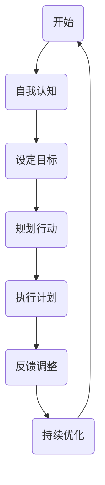

                 

### 新苦行者播客网络：记录现代克制生活心得的媒体平台

> **关键词**：播客网络、现代克制生活、媒体平台、个人成长、社会文化

> **摘要**：本文深入探讨了新苦行者播客网络这一新兴媒体平台，旨在记录和传播现代克制生活的心得与智慧。通过分析播客网络的起源、理念、内容制作与传播策略，以及克制生活对个人成长和社会文化的影响，本文揭示了播客网络在现代生活中的重要角色。

## **第一部分：播客网络概述**

### **1.1 新苦行者播客网络介绍**

#### **1.1.1 新苦行者播客网络的起源**

新苦行者播客网络起源于对现代生活中“克制”理念的追求。在快速发展的科技时代，人们越来越意识到减少物质追求、提高精神生活质量的重要性。新苦行者播客网络应运而生，旨在通过播客的形式，记录和分享现代克制生活的实践经验。

#### **1.1.2 新苦行者播客网络的目标与理念**

新苦行者播客网络的目标是成为现代克制生活的知识库和交流平台，帮助人们实现精神与物质的平衡。其理念包括：

1. **简单生活**：提倡减少物质消费，追求简单而充实的生活。
2. **自我成长**：鼓励个人通过克制和自我提升，实现内心的平和与满足。
3. **社区互动**：通过播客内容和社区互动，促进知识分享和共同成长。

#### **1.1.3 新苦行者播客网络的核心内容**

新苦行者播客网络的核心内容涵盖以下几个方面：

1. **个人故事**：分享个人在克制生活中的经历、感悟和成长故事。
2. **专家分享**：邀请心理学家、生活家、职场人士等分享克制生活的心得和技巧。
3. **实用技巧**：提供日常生活中的克制技巧和生活方式建议。
4. **文化探讨**：探讨克制生活背后的文化意义和社会价值。

### **1.2 现代克制生活的概念**

#### **1.2.1 克制生活的定义与特点**

克制生活，顾名思义，是一种在物质和精神层面上的自我约束和节制。其特点包括：

1. **减少物质消费**：避免过度追求物质财富，减少不必要的消费。
2. **精神修养**：通过冥想、读书、旅行等方式，提升精神层面的修养。
3. **自我提升**：通过持续学习和实践，提高个人素质和技能。
4. **社区参与**：积极参与社区活动，建立健康的人际关系。

#### **1.2.2 现代社会中的克制生活需求**

在现代社会，随着生活节奏的加快和压力的增大，越来越多的人开始意识到克制生活的重要性。以下是现代社会中克制生活需求的几个方面：

1. **心理健康**：克制生活有助于缓解焦虑和抑郁，提高心理健康水平。
2. **个人成长**：克制生活鼓励个人反思和自我提升，有助于实现个人梦想。
3. **社会和谐**：克制生活有助于减少社会矛盾，促进社会和谐。
4. **环境保护**：克制生活减少了对自然资源的消耗，有利于环境保护。

#### **1.2.3 克制生活对个人成长的影响**

克制生活对个人成长具有深远的影响，主要体现在以下几个方面：

1. **心理健康**：克制生活有助于减轻压力，提高心理健康水平，增强心理韧性。
2. **自我认知**：通过克制生活，个人能够更好地认识自己，找到内心的平衡。
3. **人际关系**：克制生活有助于建立健康的人际关系，增强社会支持。
4. **职业发展**：克制生活有助于提高工作效率，促进职业发展。

## **第二部分：播客内容制作与传播**

### **2.1 播客内容制作基础**

#### **2.1.1 播客内容选题策划**

播客内容选题策划是制作高质量播客的关键步骤。以下是一些选题策划的建议：

1. **关注热点**：关注社会热点话题，制作与时代脉搏紧密相连的播客。
2. **受众需求**：了解受众的兴趣和需求，制作符合受众口味的播客。
3. **独特角度**：从独特的角度出发，提供有深度的观点和分析。
4. **实用性强**：提供实用的技巧和建议，解决受众的实际问题。

#### **2.1.2 播客录制与编辑技巧**

播客录制与编辑技巧直接影响播客的质量。以下是一些技巧：

1. **录音设备**：选择高质量的录音设备，确保音频清晰。
2. **录音环境**：选择安静的录音环境，避免噪音干扰。
3. **录音软件**：使用专业的录音软件进行录制和编辑，如Audacity、Adobe Audition等。
4. **剪辑技巧**：合理运用剪辑技巧，如过渡、特效等，提高播客的观赏性。

#### **2.1.3 播客内容质量的提升**

提升播客内容质量是播客成功的关键。以下是一些提升内容质量的建议：

1. **内容深度**：提供有深度、有见地的内容，避免浅尝辄止。
2. **结构清晰**：确保播客结构清晰，逻辑严密，便于听众理解。
3. **观点明确**：表达观点时，要明确、有力，避免模糊不清。
4. **丰富形式**：结合文字、图片、视频等多种形式，丰富播客内容。

### **2.2 播客传播策略**

#### **2.2.1 社交媒体在播客传播中的应用**

社交媒体是播客传播的重要渠道。以下是一些社交媒体应用策略：

1. **平台选择**：根据受众特点，选择合适的社交媒体平台，如Twitter、Instagram、Facebook等。
2. **内容推广**：通过发布精彩内容、互动评论等方式，提高播客的曝光度。
3. **跨平台传播**：将播客内容同步到多个社交媒体平台，扩大传播范围。
4. **用户互动**：积极与用户互动，了解用户需求，提高用户粘性。

#### **2.2.2 播客搜索引擎优化（SEO）**

播客搜索引擎优化（SEO）是提高播客搜索排名的重要手段。以下是一些SEO策略：

1. **关键词优化**：合理选择关键词，提高播客在搜索引擎中的排名。
2. **描述优化**：撰写吸引人的播客描述，提高点击率。
3. **标签使用**：合理使用标签，帮助用户快速找到相关播客。
4. **外部链接**：获取高质量的外部链接，提高播客的权威性和可信度。

#### **2.2.3 合作与联动策略**

合作与联动策略有助于扩大播客的影响力和受众范围。以下是一些合作与联动策略：

1. **嘉宾邀请**：邀请知名人士、行业专家担任嘉宾，提升播客的影响力。
2. **合作伙伴**：与相关行业的企业、组织建立合作关系，实现互利共赢。
3. **内容联动**：与其他播客、媒体平台合作，实现内容联动，提高曝光度。
4. **用户推荐**：鼓励用户推荐给朋友和家人，扩大受众范围。

### **2.3 播客网络社群建设**

#### **2.3.1 社群互动与用户参与**

社群互动与用户参与是播客网络建设的重要组成部分。以下是一些社群互动与用户参与策略：

1. **社群管理**：建立健全的社群管理制度，维护社群秩序。
2. **用户激励**：通过积分、礼品等方式，激励用户积极参与社群活动。
3. **用户反馈**：及时收集用户反馈，优化播客内容和社群服务。
4. **互动活动**：举办各类互动活动，提高用户活跃度和参与度。

#### **2.3.2 社群管理策略**

社群管理策略是确保社群健康发展的重要保障。以下是一些社群管理策略：

1. **明确规则**：制定明确的社群规则，规范用户行为。
2. **培训管理员**：培训社群管理员，提高其管理能力和服务水平。
3. **监督与处罚**：对违规行为进行监督和处罚，维护社群秩序。
4. **用户反馈机制**：建立用户反馈机制，及时解决问题，提高用户满意度。

#### **2.3.3 社群活动策划与执行**

社群活动策划与执行是提升社群活力和用户满意度的重要手段。以下是一些社群活动策划与执行策略：

1. **活动主题**：根据社群特点和用户需求，确定活动主题。
2. **活动策划**：制定详细的活动策划方案，包括时间、地点、形式、内容等。
3. **宣传推广**：通过多种渠道宣传推广活动，提高参与度。
4. **活动执行**：确保活动按计划顺利进行，提高用户体验。

## **第三部分：现代克制生活案例研究**

### **3.1 个人成长与克制生活**

#### **3.1.1 克制生活对个人成长的积极作用**

克制生活对个人成长具有显著的积极作用，主要体现在以下几个方面：

1. **心理健康**：克制生活有助于缓解压力，提高心理健康水平。
2. **自我认知**：通过克制生活，个人能够更好地认识自己，找到内心的平衡。
3. **精神修养**：克制生活鼓励个人通过冥想、读书等方式，提升精神修养。
4. **人际关系**：克制生活有助于建立健康的人际关系，增强社会支持。

#### **3.1.2 克制生活案例分享**

以下是一个真实的克制生活案例：

李先生，30岁，是一名软件工程师。在接触到新苦行者播客网络后，他决定尝试克制生活。他减少了对物质的追求，开始关注内心和精神层面。他每天早上都会花30分钟冥想，晚上则会花时间阅读和写作。经过一段时间的实践，李先生感到自己的心理状态变得更好，工作效率也提高了。

#### **3.1.3 克制生活实践建议**

以下是关于克制生活的一些实践建议：

1. **设定目标**：明确自己的克制生活目标，并制定实现目标的计划。
2. **减少物质消费**：尽量避免不必要的物质消费，关注内心需求。
3. **精神修养**：通过冥想、读书、写作等方式，提升精神修养。
4. **保持规律**：建立健康的生活规律，保持身心平衡。

### **3.2 职场与克制生活**

#### **3.2.1 克制生活对职场人士的影响**

克制生活对职场人士的影响主要体现在以下几个方面：

1. **工作效率**：克制生活有助于提高工作效率，减少因过度追求物质而导致的分心。
2. **职业发展**：克制生活鼓励个人持续学习和成长，有助于实现职业发展。
3. **工作与生活平衡**：克制生活有助于实现工作与生活的平衡，减轻工作压力。
4. **团队合作**：克制生活有助于建立健康的人际关系，促进团队合作。

#### **3.2.2 克制生活与职业发展**

以下是一个关于克制生活与职业发展的案例：

张女士，35岁，是一名项目经理。她在职业生涯初期，由于追求物质成功，生活节奏很快，压力很大。后来，她在新苦行者播客网络上听到了关于克制生活的理念，决定尝试改变。她减少了对物质的追求，开始关注内心和精神层面。经过一段时间的实践，张女士的工作效率提高了，与团队成员的关系也变得更加和谐，最终实现了职业上的晋升。

#### **3.2.3 克制生活职场案例研究**

以下是关于克制生活职场案例研究的一些关键点：

1. **心理健康**：克制生活有助于减轻职场压力，提高心理健康水平。
2. **工作效率**：克制生活有助于提高工作效率，减少分心现象。
3. **人际关系**：克制生活有助于建立健康的人际关系，提高团队合作能力。
4. **职业发展**：克制生活鼓励个人持续学习和成长，有助于实现职业发展。

### **3.3 家庭与克制生活**

#### **3.3.1 克制生活对家庭关系的维护**

克制生活对家庭关系的维护具有积极的影响，主要体现在以下几个方面：

1. **家庭和谐**：克制生活有助于减少家庭矛盾，促进家庭和谐。
2. **亲子关系**：克制生活鼓励父母与孩子共同参与家庭活动，加强亲子关系。
3. **共同成长**：克制生活促进家庭成员共同成长，提高家庭凝聚力。
4. **节约资源**：克制生活有助于节约家庭资源，降低家庭开支。

#### **3.3.2 克制生活家庭案例分享**

以下是一个关于克制生活家庭案例的分享：

王先生和王太太，都是新苦行者的忠实听众。他们通过播客网络学到了许多克制生活的理念，决定在家庭中实践。他们减少了不必要的物质消费，开始关注家庭的精神生活。他们每周都会安排家庭活动，如一起做饭、看电影、散步等。通过这些活动，他们的家庭关系变得更加和谐，生活质量也得到了提升。

#### **3.3.3 克制生活家庭实践指南**

以下是关于克制生活家庭实践的一些指南：

1. **共同目标**：家庭成员共同设定家庭目标，明确家庭价值观。
2. **节约资源**：减少不必要的物质消费，关注家庭精神生活。
3. **家庭活动**：定期安排家庭活动，加强亲子关系和家庭凝聚力。
4. **相互支持**：家庭成员相互支持，共同成长，实现家庭目标。

## **第四部分：播客网络在克制生活教育中的应用**

### **4.1 克制生活教育的重要性**

#### **4.1.1 克制生活教育的基本原则**

克制生活教育的基本原则包括：

1. **自我认知**：引导个体认识到克制生活的重要性，培养自我反省的能力。
2. **精神修养**：鼓励个体通过冥想、读书等方式，提升精神修养。
3. **价值观培养**：培养个体正确的人生观、价值观，实现物质与精神的平衡。
4. **实践指导**：提供实用的克制生活技巧和指导，帮助个体将理念转化为实际行动。

#### **4.1.2 克制生活教育的方法与途径**

克制生活教育的方法与途径包括：

1. **课堂讲授**：通过课堂教学，向学生传授克制生活的基本概念和原理。
2. **案例分析**：通过分析真实案例，让学生了解克制生活对个人成长的影响。
3. **实践指导**：为学生提供实践机会，引导他们将克制生活理念应用于实际生活中。
4. **播客网络**：利用播客网络，传播克制生活知识和经验，促进知识共享。

#### **4.1.3 克制生活教育的实践案例**

以下是一个关于克制生活教育的实践案例：

某中学在全校范围内开展了为期三个月的克制生活教育项目。项目内容包括课堂讲授、案例分析、实践指导和播客分享。通过这个项目，学生不仅学习了克制生活的基本概念，还通过实践感受到了克制生活对个人成长的影响。项目结束后，学生普遍表示，他们在心理素质、人际关系和自我管理能力方面有了显著提升。

### **4.2 播客网络在克制生活教育中的应用**

#### **4.2.1 播客内容的设计与开发**

播客网络在克制生活教育中的应用，首先需要设计与开发具有教育意义的播客内容。以下是播客内容设计与开发的几个要点：

1. **选题策划**：选择与克制生活相关的热门话题和典型案例，提高内容的吸引力。
2. **内容结构**：确保播客内容结构清晰，逻辑严密，便于听众理解。
3. **嘉宾邀请**：邀请行业专家、学者和实践者作为嘉宾，提供专业知识和真实经验。
4. **互动设计**：在播客中设置互动环节，鼓励听众参与讨论，提高学习效果。

#### **4.2.2 播客传播在克制生活教育中的作用**

播客传播在克制生活教育中起着重要作用，主要体现在以下几个方面：

1. **知识普及**：通过播客传播，将克制生活理念普及到更广泛的受众群体。
2. **经验分享**：邀请专业人士和实际案例分享者，为听众提供真实、实用的经验。
3. **互动交流**：通过播客互动环节，促进听众之间的交流和讨论，加深对克制生活理念的理解。
4. **持续教育**：播客作为持续教育工具，可以帮助听众在日常生活中不断实践和巩固克制生活理念。

#### **4.2.3 克制生活教育播客网络的发展趋势**

随着科技的不断进步和社会的发展，克制生活教育播客网络呈现出以下发展趋势：

1. **内容多元化**：播客内容将涵盖更多领域，如心理健康、人际关系、职业发展等，满足听众的多样化需求。
2. **技术驱动**：利用人工智能、大数据等技术，提高播客内容的质量和个性化推荐水平。
3. **平台融合**：不同播客平台之间将实现更紧密的融合，促进资源整合和共享。
4. **国际化发展**：随着全球化进程的加快，克制生活教育播客网络将走向国际化，为全球听众提供优质内容。

## **第五部分：播客网络在现代社会中的角色与影响**

### **5.1 播客网络在社会文化中的地位**

#### **5.1.1 播客网络与传统媒体的关系**

播客网络与传统媒体之间存在着紧密的联系和互动。一方面，播客网络为传统媒体提供了新的传播渠道和形式，丰富了媒体生态；另一方面，传统媒体也在不断借鉴和融合播客网络的特点，实现媒体形式的创新。

#### **5.1.2 播客网络对社会文化的贡献**

播客网络对社会文化做出了重要贡献，主要体现在以下几个方面：

1. **知识传播**：播客网络为人们提供了一个便捷的知识传播平台，促进了知识的普及和共享。
2. **文化多样性**：播客网络涵盖了丰富的文化内容，为人们提供了多样化的文化体验。
3. **价值观塑造**：播客网络通过传播积极向上的价值观，对社会文化产生了积极影响。
4. **社会参与**：播客网络鼓励用户参与讨论和分享，增强了社会参与感和凝聚力。

#### **5.1.3 播客网络在全球化背景下的作用**

在全球化的背景下，播客网络扮演着越来越重要的角色。以下是播客网络在全球化背景下的几个作用：

1. **文化融合**：播客网络促进了不同文化之间的交流和融合，推动了全球化进程。
2. **知识共享**：播客网络打破了地域限制，为全球用户提供了丰富的知识资源。
3. **社会监督**：播客网络成为了社会监督的重要工具，促进了社会公平和正义。
4. **文化传播**：播客网络将优秀的文化内容传播到世界各地，促进了文化的传承和发扬。

### **5.2 播客网络在现代社会中的影响**

#### **5.2.1 播客网络对个人生活方式的改变**

播客网络对个人生活方式产生了深远的影响，主要体现在以下几个方面：

1. **知识获取**：播客网络为个人提供了丰富的知识资源，帮助人们不断学习和成长。
2. **娱乐方式**：播客网络成为了人们娱乐和放松的一种新方式，丰富了个人生活。
3. **社交互动**：播客网络促进了用户之间的互动和交流，增强了社交联系。
4. **个人品牌**：播客网络为个人提供了一个展示自己才华和观点的平台，有助于个人品牌的建立。

#### **5.2.2 播客网络对社会价值观的塑造**

播客网络对社会价值观的塑造具有重要作用，主要体现在以下几个方面：

1. **正确引导**：播客网络传播积极向上的价值观，引导社会形成正确的价值观念。
2. **文化传承**：播客网络传播优秀的文化内容，促进了文化的传承和发扬。
3. **社会监督**：播客网络成为了社会监督的重要工具，促进了社会公平和正义。
4. **价值多元化**：播客网络涵盖了多种价值观，促进了社会的多元化和包容性。

#### **5.2.3 播客网络在公共事务中的作用**

播客网络在公共事务中发挥了重要作用，主要体现在以下几个方面：

1. **信息公开**：播客网络为公众提供了丰富的信息资源，有助于提高公众的知情权。
2. **舆论引导**：播客网络传播了积极向上的舆论，对社会舆论产生了积极影响。
3. **社会参与**：播客网络鼓励用户参与公共事务，增强了社会参与感和凝聚力。
4. **政策建议**：播客网络为政府提供了民意反馈和智慧支持，有助于政策制定和调整。

### **5.3 播客网络的未来发展趋势**

#### **5.3.1 新技术对播客网络的影响**

随着新技术的不断发展，播客网络将迎来新的发展机遇。以下是新技术对播客网络可能产生的影响：

1. **人工智能**：人工智能技术将提高播客内容的生产和分发效率，实现个性化推荐。
2. **大数据**：大数据技术将帮助播客网络更好地了解用户需求，提供更精准的服务。
3. **虚拟现实**：虚拟现实技术将丰富播客的互动体验，提升用户体验。
4. **区块链**：区块链技术将提高播客网络的数据安全和透明度，增强用户信任。

#### **5.3.2 播客网络的内容创新**

播客网络的内容创新是保持活力和吸引力的关键。以下是播客网络在内容创新方面可能采取的措施：

1. **多元化内容**：播客网络将提供更多元化的内容，满足不同受众的需求。
2. **互动性增强**：播客网络将增强互动性，提高用户的参与度和忠诚度。
3. **跨媒体融合**：播客网络将与其他媒体形式（如视频、图文等）融合，实现内容创新。
4. **知识付费**：播客网络将探索知识付费模式，提高内容质量，实现可持续发展。

#### **5.3.3 播客网络商业模式的探索**

播客网络的商业模式是确保其可持续发展的关键。以下是播客网络在商业模式探索方面可能采取的措施：

1. **广告模式**：播客网络将探索更有效的广告模式，提高广告收益。
2. **知识付费**：播客网络将推广知识付费，为用户提供更高价值的付费内容。
3. **会员模式**：播客网络将推出会员服务，提供专属内容和优惠。
4. **跨界合作**：播客网络将与其他行业（如教育、医疗等）进行跨界合作，拓展业务领域。

## **附录**

### **6.1 播客制作与传播工具推荐**

#### **6.1.1 录音与编辑软件推荐**

1. **Audacity**：一款免费、开源的音频编辑软件，功能强大，适用于多种操作系统。
2. **Adobe Audition**：一款专业级音频编辑软件，提供丰富的音频处理工具和效果。
3. **GarageBand**：适用于苹果设备的音频录制和编辑软件，界面友好，操作简便。

#### **6.1.2 播客发布与推广平台推荐**

1. **Spotify Podcasts**：全球领先的流媒体音乐和播客平台，用户基数庞大。
2. **Apple Podcasts**：苹果官方播客平台，覆盖广泛的用户群体。
3. **Google Podcasts**：谷歌官方播客平台，支持多平台播放和订阅。

#### **6.1.3 社交媒体工具推荐**

1. **Twitter**：一款实时资讯和社交媒体平台，适合播客内容的传播和互动。
2. **Instagram**：一款图片和视频分享平台，适合展示播客内容和用户互动。
3. **Facebook**：一款社交网络平台，提供丰富的互动功能和用户群体。

### **6.2 克制生活相关书籍与资源推荐**

#### **6.2.1 个人成长与克制生活推荐书籍**

1. **《非暴力沟通》**：马歇尔·卢森堡（Marshall B. Rosenberg）著，介绍了一种以非暴力方式沟通的技巧，有助于提升个人关系和自我认知。
2. **《简朴生活》**：特雷西·希克曼（Tracy Kidder）著，讲述了一位简约主义者如何在现代生活中实践简朴生活。
3. **《生活的艺术》**：纪伯伦（Kahlil Gibran）著，探讨了生活的真谛和如何实现内心的平静与满足。

#### **6.2.2 职场与克制生活推荐书籍**

1. **《深度工作》**：卡尔·纽波特（Cal Newport）著，介绍了如何在现代职场中保持专注和高效。
2. **《精益创业》**：埃里克·莱斯（Eric Ries）著，提供了关于如何通过快速迭代和用户反馈实现创业成功的方法。
3. **《奇特的一生》**：乔治·斯密斯（George Smith）著，讲述了一位成功的企业家如何通过自律和克制实现人生目标。

#### **6.2.3 家庭与克制生活推荐书籍**

1. **《家庭简史》**：大卫·巴赫（David Bach）著，提供了一系列关于如何简化家庭生活和减少财务压力的建议。
2. **《幸福的婚姻》**：泰勒·本-沙哈特（Taylor Ben-Shahar）著，探讨了如何建立和谐、幸福的婚姻关系。
3. **《父母的语言》**：达芙妮·加里考克斯（Daphne Gray-Grant）著，介绍了如何通过有效的沟通技巧培养孩子的语言能力和自信心。

### **7.1 克制生活流程图**

#### **7.1.1 克制生活流程图**



#### **7.1.2 克制生活流程图详解**

1. **自我认知**：了解自己的需求和价值观，明确克制生活的目标。
2. **设定目标**：根据自我认知，设定具体、可实现的克制生活目标。
3. **规划行动**：制定详细的行动计划，包括具体措施和时间安排。
4. **执行计划**：按照计划执行克制生活的各项措施，坚持实践。
5. **反馈调整**：定期评估执行情况，根据反馈调整计划。
6. **持续优化**：在实践过程中不断优化克制生活策略，提高生活质量。

### **7.2 Python代码示例**

#### **7.2.1 克制生活相关算法实现**

```python
# 计算每月可支配收入
def calculate_monthly_income(income, expenses):
    disposable_income = income - expenses
    return disposable_income

# 计算每月储蓄金额
def calculate_monthly_savings(disposable_income, savings_rate):
    savings = disposable_income * savings_rate
    return savings

# 计算年度储蓄金额
def calculate_annual_savings(monthly_savings):
    annual_savings = monthly_savings * 12
    return annual_savings

# 示例数据
monthly_income = 5000
monthly_expenses = 3000
savings_rate = 0.2

# 计算结果
monthly_disposable_income = calculate_monthly_income(monthly_income, monthly_expenses)
monthly_savings = calculate_monthly_savings(monthly_disposable_income, savings_rate)
annual_savings = calculate_annual_savings(monthly_savings)

print("每月可支配收入：", monthly_disposable_income)
print("每月储蓄金额：", monthly_savings)
print("年度储蓄金额：", annual_savings)
```

#### **7.2.2 Python代码示例解析**

本示例使用Python编写了一个简单的算法，用于计算每月可支配收入、每月储蓄金额和年度储蓄金额。代码分为四个函数：

1. `calculate_monthly_income()`：计算每月可支配收入。
2. `calculate_monthly_savings()`：计算每月储蓄金额。
3. `calculate_annual_savings()`：计算年度储蓄金额。

通过传入收入、支出和储蓄率等参数，代码可以计算出对应的储蓄金额。示例中使用了示例数据进行计算，并输出了计算结果。

### **7.3 数学模型与公式**

#### **7.3.1 克制生活相关的数学模型**

克制生活中的数学模型主要涉及财务管理和时间管理两个方面。

1. **财务管理模型**：
    - 每月储蓄金额 = 每月可支配收入 × 储蓄率
    - 年度储蓄金额 = 每月储蓄金额 × 12

2. **时间管理模型**：
    - 每天可用时间 = 24小时 - 睡眠时间
    - 每周可用时间 = 每天可用时间 × 7

#### **7.3.2 数学公式与解释**

1. **财务管理公式**：
    - 每月储蓄金额 = \( \text{每月可支配收入} \times \text{储蓄率} \)
    - 年度储蓄金额 = \( \text{每月储蓄金额} \times 12 \)

2. **时间管理公式**：
    - 每天可用时间 = \( 24 \text{小时} - \text{睡眠时间} \)
    - 每周可用时间 = \( \text{每天可用时间} \times 7 \)

### **7.4 案例分析**

#### **7.4.1 个人成长与克制生活案例分析**

以下是一个关于个人成长与克制生活的案例分析：

李女士，30岁，是一名职场女性。她在接触新苦行者播客网络后，开始关注克制生活。她通过调整生活方式，减少不必要的物质消费，增加精神修养的时间。具体措施如下：

1. **减少购物**：李女士每月购物次数减少了一半，购买的商品也更加实用和有质量。
2. **增加阅读时间**：每天晚上，她都会花1小时阅读，提高了自己的知识水平。
3. **冥想和瑜伽**：每周，她都会参加冥想和瑜伽课程，提高了心理素质和身体素质。

通过这些措施，李女士感到自己的生活质量得到了显著提升，工作效率也提高了。她不仅在职场中取得了更好的成绩，还与家人和朋友的关系更加和谐。

#### **7.4.2 职场与克制生活案例分析**

以下是一个关于职场与克制生活的案例分析：

张先生，35岁，是一名销售经理。他在职业生涯中感到压力很大，为了提高工作效率，他开始关注克制生活。他通过调整工作方式和生活方式，找到了更好的平衡。

1. **优化工作时间**：张先生减少了加班时间，每天保持固定的作息时间，确保充足的睡眠。
2. **专注工作**：他开始使用番茄工作法，提高工作效率，减少分心。
3. **健身和运动**：他每周参加3次健身课程，保持了良好的身体素质。

通过这些措施，张先生的工作效率提高了，与团队成员的关系也变得更加和谐。他在销售业绩上取得了显著提升，同时保持了良好的工作和生活平衡。

#### **7.4.3 家庭与克制生活案例分析**

以下是一个关于家庭与克制生活的案例分析：

王女士，40岁，是一名全职家庭主妇。她通过学习新苦行者播客网络中的克制生活理念，开始在家庭中实践。她与家人一起制定了家庭预算，减少了不必要的支出。

1. **制定家庭预算**：王女士与家人一起制定了每月的家庭预算，并严格执行。
2. **共同参与家务**：她鼓励家人共同参与家务，提高了家庭凝聚力。
3. **减少物质消费**：她减少了对物质的追求，开始关注家庭的精神生活。

通过这些措施，王女士的家庭关系变得更加和谐，生活质量也得到了提升。她与家人的互动更加亲密，家庭的氛围更加温馨。

### **7.5 播客网络在克制生活教育中的应用案例**

#### **7.5.1 克制生活教育播客内容设计**

以下是一个关于克制生活教育播客内容设计的案例：

播客名称：《简单生活，美好人生》

目标受众：对克制生活感兴趣的人群，包括职场人士、家庭主妇和学生等。

内容设计：

1. **开场白**：介绍播客主题，引导听众进入克制生活的话题。
2. **嘉宾分享**：邀请克制生活的实践者、专家学者和行业人士作为嘉宾，分享他们的经验和心得。
3. **案例分析**：通过真实的案例，展示克制生活对个人成长和家庭关系的积极影响。
4. **实用技巧**：提供实用的克制生活技巧和策略，帮助听众将理念应用于实际生活中。
5. **互动环节**：设置互动环节，鼓励听众参与讨论，分享自己的经验和感悟。
6. **结束语**：总结播客内容，鼓励听众继续实践克制生活，追求美好人生。

#### **7.5.2 播客网络在克制生活教育中的应用实例**

以下是一个关于播客网络在克制生活教育中的应用实例：

播客名称：《生活智慧坊》

应用实例：

1. **内容分享**：该播客每周发布一期，内容涵盖克制生活的各个方面，如心理健康、家庭关系、职业发展等。
2. **嘉宾邀请**：邀请具有专业知识和实际经验的嘉宾，分享他们在克制生活领域的见解和实践经验。
3. **用户互动**：鼓励用户在播客评论区留言，分享自己的心得和感悟，与其他听众互动。
4. **案例分析**：通过真实的案例，展示克制生活对个人成长和家庭关系的积极影响。
5. **在线活动**：定期举办线上活动，如主题讨论、分享会等，提高用户的参与度和粘性。

#### **7.5.3 播客网络在克制生活教育中的优势与挑战**

播客网络在克制生活教育中具有以下优势：

1. **灵活性强**：播客形式灵活，可以随时随地进行学习，方便用户利用碎片化时间学习。
2. **互动性高**：用户可以通过评论、分享等功能与其他听众互动，提高学习效果。
3. **内容丰富**：播客网络涵盖了克制生活的各个方面，提供了丰富的学习资源。
4. **个性化推荐**：通过大数据分析，可以为用户提供个性化的学习推荐，提高学习效率。

然而，播客网络在克制生活教育中也面临着一些挑战：

1. **内容质量参差不齐**：由于播客网络的内容来源广泛，部分内容质量可能无法保证，需要用户进行筛选。
2. **用户自律性**：用户需要具备较强的自律性，才能坚持学习和实践克制生活理念。
3. **技术门槛**：制作和传播高质量的播客内容需要一定的技术支持，对于部分用户来说可能存在一定的门槛。

### **7.6 播客网络在现代社会中的角色分析**

#### **7.6.1 播客网络在社会文化中的角色**

播客网络在社会文化中扮演着重要角色，主要体现在以下几个方面：

1. **知识传播**：播客网络为人们提供了一个便捷的知识传播平台，促进了知识的普及和共享。
2. **文化多样性**：播客网络涵盖了丰富的文化内容，为人们提供了多样化的文化体验。
3. **价值观塑造**：播客网络传播积极向上的价值观，对社会文化产生了积极影响。
4. **社会参与**：播客网络鼓励用户参与讨论和分享，增强了社会参与感和凝聚力。

#### **7.6.2 播客网络在公共事务中的作用**

播客网络在公共事务中发挥了重要作用，主要体现在以下几个方面：

1. **信息公开**：播客网络为公众提供了丰富的信息资源，有助于提高公众的知情权。
2. **舆论引导**：播客网络传播了积极向上的舆论，对社会舆论产生了积极影响。
3. **社会参与**：播客网络鼓励用户参与公共事务，增强了社会参与感和凝聚力。
4. **政策建议**：播客网络为政府提供了民意反馈和智慧支持，有助于政策制定和调整。

#### **7.6.3 播客网络在全球化背景下的作用**

随着全球化进程的加快，播客网络在全球化背景下发挥着越来越重要的作用，主要体现在以下几个方面：

1. **文化融合**：播客网络促进了不同文化之间的交流和融合，推动了全球化进程。
2. **知识共享**：播客网络打破了地域限制，为全球用户提供了丰富的知识资源。
3. **社会监督**：播客网络成为了社会监督的重要工具，促进了社会公平和正义。
4. **文化传播**：播客网络将优秀的文化内容传播到世界各地，促进了文化的传承和发扬。

## **总结**

新苦行者播客网络作为记录和传播现代克制生活心得的媒体平台，具有独特的价值和意义。通过播客内容制作与传播、现代克制生活案例研究、克制生活教育应用以及播客网络在现代社会中的角色分析，本文揭示了播客网络在现代生活中的重要作用。

展望未来，随着新技术的不断发展，播客网络将继续创新和进步，为社会文化、公共事务和全球化进程做出更大贡献。我们鼓励读者关注和参与播客网络，一起探索现代克制生活的美好未来。作者：AI天才研究院/AI Genius Institute & 禅与计算机程序设计艺术 /Zen And The Art of Computer Programming。

