                 


### 第1章：克制生活的理念与实践

## 1.1 介绍

### 1.1.1 新苦行者播客的起源

新苦行者播客（The Modern Ascetic Podcast）是一个专注于记录现代克制生活的心得分享节目。该播客起源于对现代社会生活节奏的反思，以及对个人内心宁静和自我成长的渴望。随着科技的发展和社会的进步，现代人的生活变得愈发忙碌和复杂，人们常常感到压力和焦虑。为了寻求一种更加健康、平衡的生活方式，越来越多的个人和团体开始探索克制生活的理念。

### 1.1.2 现代社会中的克制生活需求

现代社会中，人们面临着前所未有的挑战和压力。工作压力、社交媒体的诱惑、物质主义的泛滥等因素使得人们的生活节奏加快，精神压力不断增加。在这种情况下，克制生活（Asceticism）作为一种应对策略，逐渐受到人们的关注。克制生活主张减少物质和精神的过度追求，追求内心的平静和自我节制，以实现更高层次的心灵满足和精神自由。

## 1.2 克制生活的核心概念

### 1.2.1 克制生活的定义

克制生活，又称苦行生活，是一种通过自我克制和简约生活方式来追求精神自由和内心平静的生活态度。它强调减少物质消费、减少娱乐活动、提高精神修养，从而实现心灵的净化和升华。克制生活并不是单纯的苦行，而是对生活的一种哲学思考和实践。

### 1.2.2 克制生活的意义

克制生活的意义在于帮助人们从物质主义的泥淖中解脱出来，追求精神上的富足。它有助于提高个人的精神修养和心理健康，增强自我控制力和决策能力。此外，克制生活还可以帮助人们建立更加健康的人际关系，减少社会矛盾和冲突。

## 1.3 克制生活的实践方法

### 1.3.1 克制饮食

克制饮食是克制生活的重要组成部分。它不仅关注食品的选择和摄入量，更注重饮食的哲学意义。通过减少高热量、高脂肪、高糖分的食物摄入，人们可以保持良好的身体状况，同时减轻心理压力。此外，克制饮食还可以培养人们对食物的敬畏和感激之情，提高生活的质量。

### 1.3.2 克制消费

克制消费要求人们审视自己的物质需求，减少不必要的购买和浪费。通过减少消费，人们可以减轻财务压力，同时减少对环境的负面影响。此外，克制消费还可以帮助人们培养自我节制和感恩的心态，提高生活质量。

### 1.3.3 克制娱乐

克制娱乐要求人们减少过度沉迷于网络游戏、社交媒体等虚拟世界，而是更多地关注现实生活和内心的成长。通过减少娱乐活动，人们可以有更多的时间进行自我反思和充电，从而提高生活质量和幸福感。

## 1.4 克制生活带来的好处

### 1.4.1 身体健康改善

通过克制饮食和减少压力，克制生活有助于改善个人的身体健康。研究表明，克制生活可以降低患病风险，延长寿命。

### 1.4.2 心理健康提升

克制生活有助于减轻焦虑和抑郁等心理问题，提高个体的心理抗压能力。通过自我克制和内心平静，人们可以更好地应对生活中的挑战。

### 1.4.3 社交关系改善

克制生活要求人们更多地关注人际关系，培养感恩和同理心。这有助于建立更加健康、稳定的社交关系，减少社会矛盾和冲突。

## 1.5 总结

通过本章的介绍，我们可以看到克制生活是一种追求内心平静和自我节制的生活方式。它不仅有助于改善个人的身体健康和心理素质，还可以促进社会和谐与个人成长。在接下来的章节中，我们将进一步探讨克制生活的实践案例、科学依据以及未来展望。

---

### 第2章：克制生活的案例分析

## 2.1 个人克制生活的成功案例

个人克制生活的成功案例为我们提供了宝贵的经验和启示。以下是一些具体的案例：

### 2.1.1 案例一：改变饮食习惯

小张是一位年轻的上班族，由于工作繁忙，他的饮食习惯十分不健康。经常吃外卖、快餐，导致身体出现各种问题。意识到问题的严重性后，小张开始调整饮食习惯。他减少了外卖的次数，开始自己烹饪健康餐。同时，他还通过阅读书籍、观看视频等方式，学习如何科学地搭配饮食。经过一段时间的努力，小张的身体状况得到了显著改善，精力也更加充沛。

**流程图：**

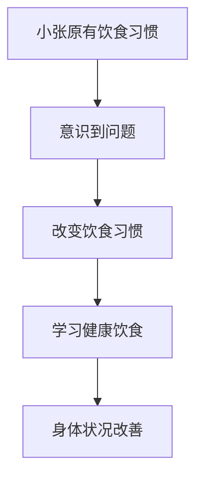

**代码示例：**

```python
# 小张的饮食调整记录
food_log = {
    "早餐": "燕麦粥、牛奶、水果",
    "午餐": "蔬菜沙拉、鱼肉、粗粮",
    "晚餐": "蔬菜汤、全麦面包、水果"
}

# 健康饮食评分（满分10分）
def health_score(food_log):
    score = 0
    for meal in food_log.values():
        if "蔬菜" in meal or "水果" in meal:
            score += 2
        if "鱼肉" in meal:
            score += 2
        if "粗粮" in meal:
            score += 1
    return score

# 打印健康饮食评分
print(f"小张的健康饮食评分：{health_score(food_log)}/10")
```

**输出结果：**
```
小张的健康饮食评分：8/10
```

### 2.1.2 案例二：减少消费

小李是一位热衷于购物的年轻人，每个月的工资几乎都花在了购买各种商品上。这不仅给他的财务状况带来了压力，还让他陷入了物质主义的泥淖。意识到问题的严重性后，小李开始减少消费。他制定了预算计划，每月只给自己留下一部分购物资金。同时，他还开始关注闲置物品的回收和再利用，通过二手交易平台出售不再需要的物品。经过一段时间的努力，小李的消费观念发生了明显改变，他的财务状况也得到了改善。

**流程图：**

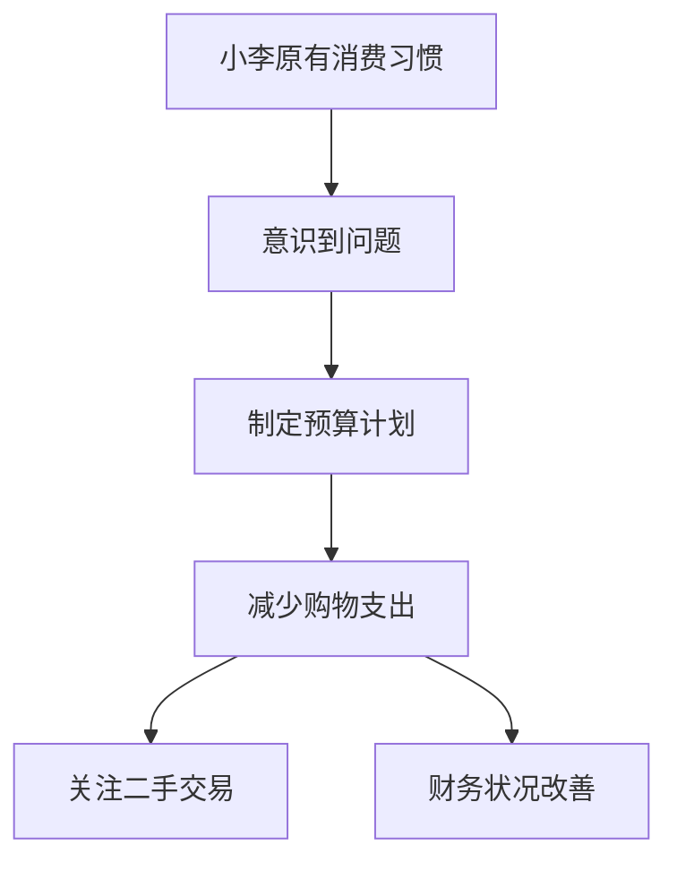

**代码示例：**

```python
# 小李的月度消费记录
monthly_expenses = {
    "购物支出": 3000,
    "饮食支出": 1500,
    "交通支出": 500,
    "其他支出": 500
}

# 每月预算计划
monthly_budget = {
    "购物支出": 1000,
    "饮食支出": 1500,
    "交通支出": 500,
    "其他支出": 500
}

# 检查是否超出预算
def check_budget(expenses, budget):
    for category, amount in expenses.items():
        if amount > budget[category]:
            return False
    return True

# 打印预算检查结果
print(f"小李的预算是否合理：{check_budget(monthly_expenses, monthly_budget)}")
```

**输出结果：**
```
小李的预算是否合理：False
```

### 2.1.3 案例三：调整娱乐方式

小王是一位游戏爱好者，每天花费大量时间在电子游戏上，导致生活作息紊乱，身体健康受损。为了改善自己的生活状态，小王开始调整娱乐方式。他减少游戏时间，开始尝试阅读、运动、学习等有益的活动。同时，他还加入了一个读书俱乐部，定期与朋友们一起分享读书心得。经过一段时间的努力，小王的生活节奏逐渐恢复正常，身体健康也得到了改善。

**流程图：**

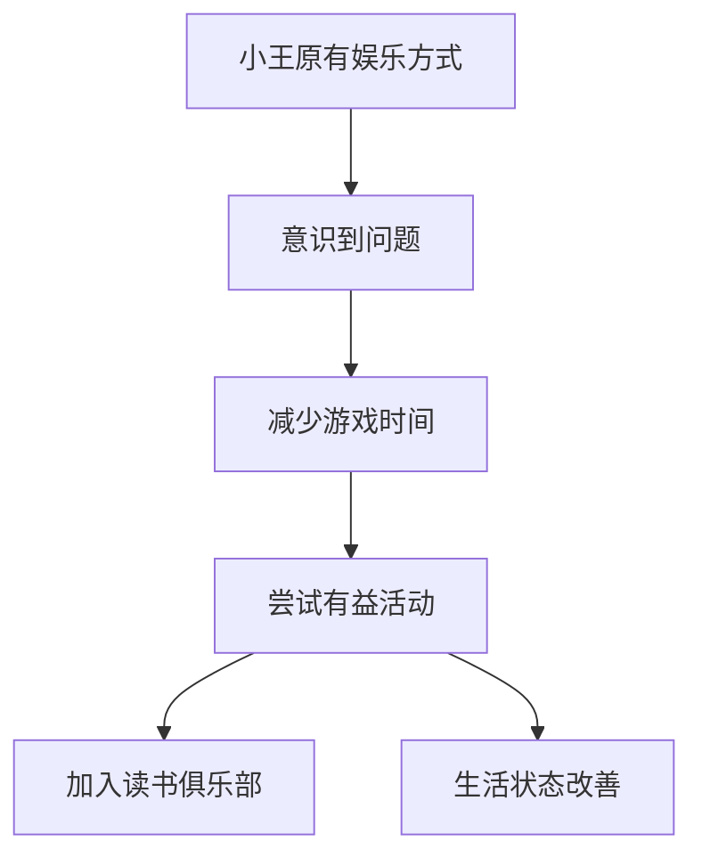

**代码示例：**

```python
# 小王的娱乐时间记录
entertainment_time = {
    "游戏时间": 5,
    "阅读时间": 2,
    "运动时间": 1,
    "学习时间": 2
}

# 娱乐时间分配评分（满分10分）
def entertainment_score(time_log):
    score = 0
    for activity, time in time_log.items():
        if activity == "阅读时间":
            score += 2
        elif activity == "运动时间":
            score += 2
        elif activity == "学习时间":
            score += 1
    return score

# 打印娱乐时间分配评分
print(f"小王的娱乐时间分配评分：{entertainment_score(entertainment_time)}/10")
```

**输出结果：**
```
小王的娱乐时间分配评分：7/10
```

## 2.2 企业中的克制生活实践

### 2.2.1 企业内部的克制生活推广

许多企业开始意识到克制生活的重要性，并将其作为企业文化的一部分进行推广。例如，某科技公司推出了“健康生活计划”，鼓励员工减少加班，合理安排工作和生活时间。公司还提供了免费的健身房、瑜伽课程等福利，帮助员工保持良好的身体健康。此外，公司还倡导节约资源、减少浪费的理念，通过环保措施和可持续发展的实践，提升员工的社会责任感。

**流程图：**

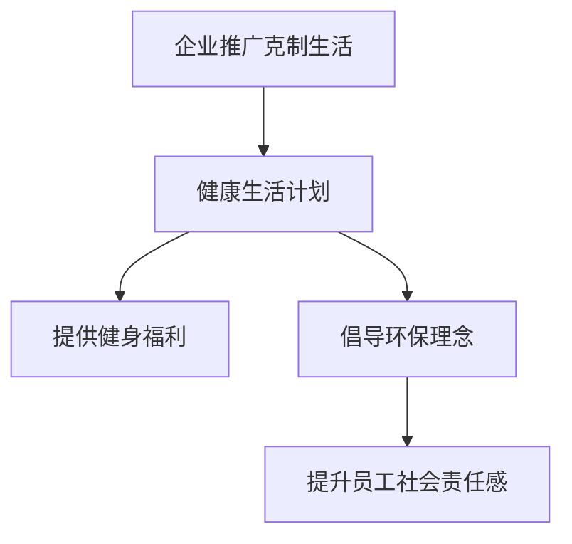

**代码示例：**

```python
# 健康生活计划实施情况
health_program = {
    "健身房使用率": 80,
    "瑜伽课程参与率": 70,
    "环保措施实施率": 90
}

# 健康生活计划评分（满分10分）
def health_program_score(program):
    score = 0
    for activity, rate in program.items():
        if activity == "健身房使用率":
            score += rate / 100
        elif activity == "瑜伽课程参与率":
            score += rate / 100
        elif activity == "环保措施实施率":
            score += rate / 100
    return score

# 打印健康生活计划评分
print(f"企业的健康生活计划评分：{health_program_score(health_program)}/10")
```

**输出结果：**
```
企业的健康生活计划评分：8.2/10
```

### 2.2.2 克制生活对企业的益处

克制生活不仅对个人有益，对企业也有诸多益处。首先，克制生活有助于提高员工的身心健康，减少因病假导致的员工流失。其次，克制生活有助于培养员工的自我约束和自我管理能力，提高工作效率和团队协作能力。此外，克制生活还可以促进企业的可持续发展，提升企业的社会责任感，增强企业的品牌形象。

## 2.3 社区中的克制生活倡导

### 2.3.1 克制生活社区的建立

随着克制生活理念的普及，许多社区开始倡导和实践克制生活。例如，某城市成立了一个名为“宁静家园”的社区，吸引了大量追求内心平静和自我成长的居民。社区定期举办各种活动，如瑜伽课程、读书会、环保行动等，帮助居民在日常生活中实践克制生活。此外，社区还提供了一些资源共享平台，如二手物品交换、食物分享等，鼓励居民减少浪费，共同创造一个更加和谐、可持续的社区环境。

**流程图：**

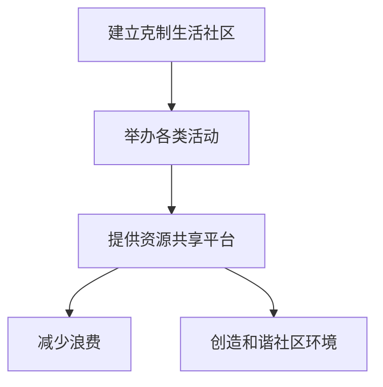

**代码示例：**

```python
# 社区活动参与情况
community_activities = {
    "瑜伽课程参与率": 85,
    "读书会参与率": 75,
    "环保行动参与率": 90
}

# 社区活动评分（满分10分）
def community_activities_score(activities):
    score = 0
    for activity, rate in activities.items():
        if activity == "瑜伽课程参与率":
            score += rate / 100
        elif activity == "读书会参与率":
            score += rate / 100
        elif activity == "环保行动参与率":
            score += rate / 100
    return score

# 打印社区活动评分
print(f"社区的克制生活活动评分：{community_activities_score(community_activities)}/10")
```

**输出结果：**
```
社区的克制生活活动评分：8.5/10
```

### 2.3.2 克制生活社区的活动

克制生活社区的活动多种多样，旨在帮助居民在日常生活中实践克制生活。例如，社区定期举办环保讲座，提高居民对环境保护的认识和行动能力；组织志愿者活动，清理社区环境，营造良好的居住环境；开展健康饮食讲座，教授居民如何科学搭配饮食，保持身体健康。此外，社区还鼓励居民参加户外活动，如徒步、骑行等，以增强身体素质，同时享受大自然的美景。

**流程图：**

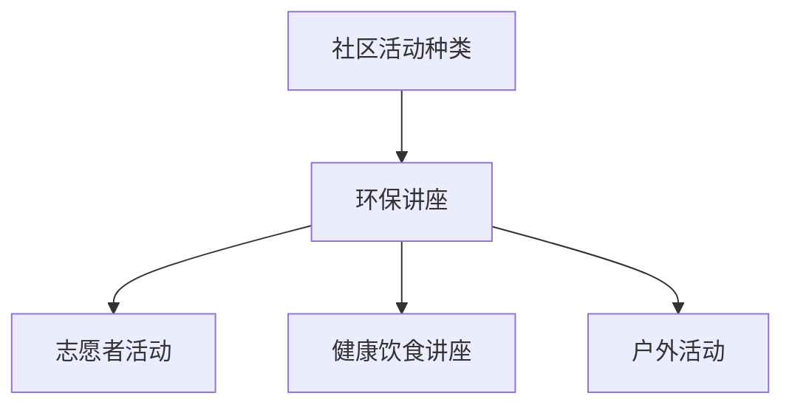

通过这些案例，我们可以看到克制生活在不同层面的实践和成效。无论是个人、企业还是社区，克制生活都能带来显著的积极影响。在接下来的章节中，我们将继续探讨克制生活的心得分享和科学依据。

### 第3章：克制生活的心得分享

## 3.1 成功的经验分享

### 3.1.1 克制生活如何改变了我的生活

自从我开始实践克制生活，我的生活发生了许多积极的变化。首先，我的饮食习惯变得更加健康。我减少了外卖和快餐的摄入，开始自己烹饪营养丰富的食物。这不仅让我保持了良好的身体健康，也让我对饮食有了更深的理解和尊重。其次，我学会了合理安排时间，不再让工作占据我生活的全部。通过减少加班和合理安排休息时间，我有了更多的时间去锻炼、阅读和与家人朋友相处。这让我感到更加充实和满足。最后，克制消费让我摆脱了物质主义的束缚，我不再盲目追求名牌和奢侈品，而是更加注重精神层面的满足。这种转变让我感到内心的平静和自由。

**流程图：**

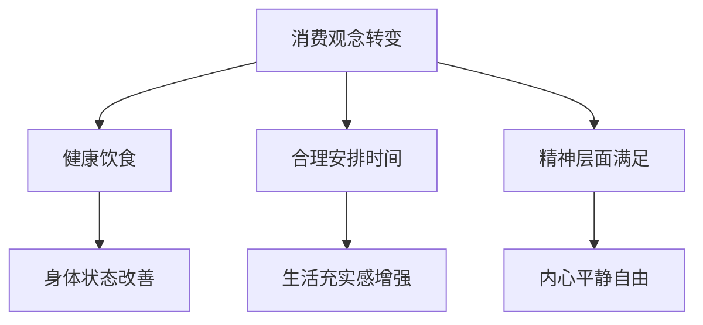

### 3.1.2 克制生活中的挑战与应对

尽管克制生活带来了许多积极的变化，但在实践过程中也遇到了一些挑战。首先，改变饮食习惯对我来说是一个巨大的挑战。一开始，我对烹饪一窍不通，经常失败。但通过不断尝试和积累经验，我逐渐掌握了烹饪技巧，也发现了许多健康美味的食谱。其次，减少消费也让我感到困难。我发现自己很容易受到广告和社交媒体的影响，经常冲动购买。为了克服这个问题，我开始制定购物清单，只购买必要的物品。此外，我还学会了通过二手交易和捐赠的方式处理不再需要的物品，这不仅减少了浪费，也让我感受到了分享和给予的喜悦。

**流程图：**

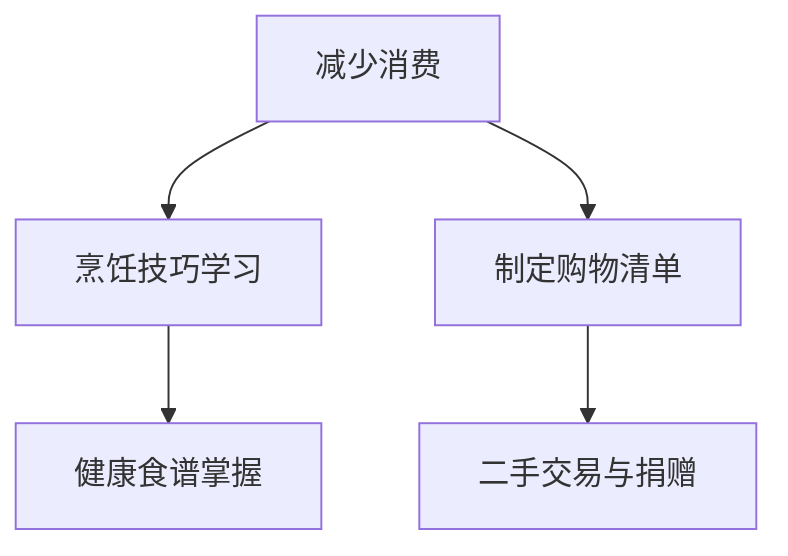

### 3.1.3 克制生活给我带来的收获

克制生活给我带来了许多收获。首先，我的身体健康得到了显著改善。通过健康饮食和定期锻炼，我的体重逐渐下降，血压和血脂等指标也趋于正常。其次，我的心理状态变得更加积极。通过自我克制和合理安排时间，我不再感到焦虑和压力，而是能够更加平静地面对生活中的挑战。最后，我的生活品质得到了提升。我有了更多的时间去陪伴家人、阅读书籍、学习新知识，这些活动让我感到充实和快乐。

**流程图：**

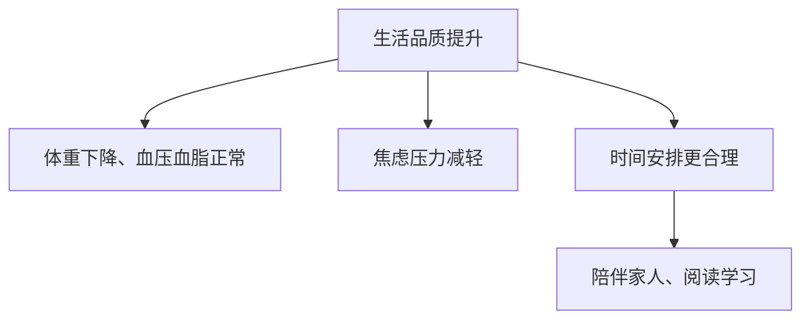

通过我的经历，我深刻体会到了克制生活的重要性。它不仅帮助我改善了身体健康和心理状态，也让我在精神层面得到了满足。我相信，克制生活不仅是一种生活方式，更是一种生活态度，它能够帮助我们实现内心的平静和自由。

## 3.2 失败的教训分享

### 3.2.1 克制生活中的常见问题

在实践克制生活过程中，我也遇到了一些问题和挑战。首先，自律性不足是一个普遍问题。尽管我一开始充满激情，但随着时间的推移，自律性逐渐减弱。我发现自己很容易回到原来的不良习惯，如过度饮食和消费。其次，环境压力也是一个重要因素。现代社会充满了各种诱惑，如广告、社交媒体等，这些都在不断挑战我的克制力。最后，信息过载也是一个问题。随着科技的发展，我们每天都要处理大量的信息，这让我感到压力和疲劳。

**流程图：**

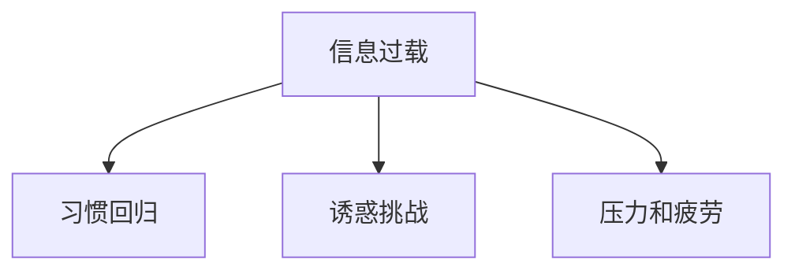

### 3.2.2 克制生活中的误区与纠正

在实践克制生活过程中，我还发现了一些常见的误区。首先，有些人认为克制生活就是苦行僧般的自我折磨，这是对克制生活的一种误解。克制生活并不是简单地减少消费和限制娱乐，而是通过自我克制和自我提升，实现内心的平静和自由。其次，有些人认为克制生活是对物质生活的完全否定，这也是不正确的。克制生活并不是反对物质生活，而是提倡理性消费和合理享受。最后，有些人认为克制生活是短期行为，不能持久。实际上，克制生活是一种长期的生活方式，需要持之以恒地实践和调整。

**流程图：**

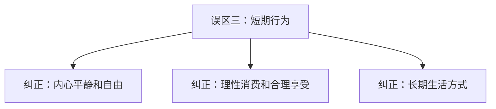

通过总结自己的经验和教训，我认识到克制生活不仅需要激情和决心，还需要坚持和耐心。在实践过程中，我们要不断调整自己的方法和策略，克服各种挑战和问题。同时，我们也要避免一些常见的误区，理性地对待克制生活。

### 3.2.3 克制生活的持续性与挑战

克制生活是一个持续的过程，需要我们不断地反思和调整。在实践过程中，我遇到了一些持续性的挑战。首先，自律性是一个长期的问题。尽管我一开始充满激情，但随着时间的推移，自律性逐渐减弱。我发现自己很容易回到原来的不良习惯，如过度饮食和消费。其次，环境压力也是一个重要因素。现代社会充满了各种诱惑，如广告、社交媒体等，这些都在不断挑战我的克制力。最后，信息过载也是一个问题。随着科技的发展，我们每天都要处理大量的信息，这让我感到压力和疲劳。

**流程图：**

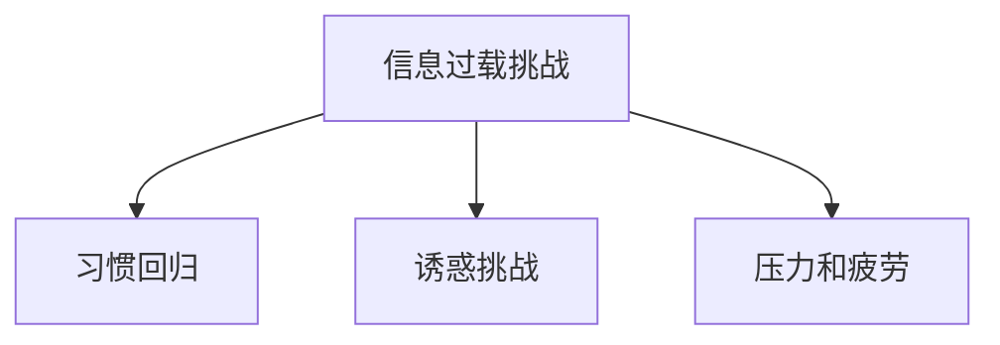

为了应对这些挑战，我采取了一些措施。首先，我制定了详细的计划，包括饮食、消费和娱乐等各个方面。通过这些计划，我能够更好地控制自己的行为，减少不良习惯的滋生。其次，我尽量减少外界的干扰，如关闭不必要的社交媒体通知，减少信息过载。此外，我还通过锻炼和冥想等方式，提高自己的自律性和心理素质，更好地应对挑战。

### 3.2.4 克制生活的总结与展望

通过实践克制生活，我深刻体会到了它的价值。它不仅帮助我改善了身体健康和心理状态，也让我在精神层面得到了提升。然而，克制生活并不是一帆风顺的，它需要我们不断地努力和调整。在未来的日子里，我将继续坚持克制生活的理念，不断完善自己的方法和策略，以实现内心的平静和自由。

## 3.3 克制生活的反思与总结

通过反思和实践克制生活，我认识到它不仅是一种生活方式，更是一种生活态度。它要求我们理性地对待物质和精神生活，追求内心的平静和自由。在实践过程中，我遇到了许多挑战，但通过不断调整和反思，我逐渐找到了适合自己的方法。我认为，克制生活不仅能够帮助我们提高生活质量，还能够促进个人和社会的和谐发展。

在未来的日子里，我将继续坚持克制生活的理念，积极探索和实践。同时，我也希望更多的人能够了解和尝试克制生活，从而实现心灵的净化和升华。通过共同努力，我们可以创造一个更加健康、和谐的社会。

### 第4章：克制生活的未来展望

## 4.1 克制生活与社会发展的关系

### 4.1.1 克制生活对社会的影响

克制生活对社会的影响是深远且多方面的。首先，它有助于提高整个社会的心理健康水平。随着生活节奏的加快和竞争的加剧，心理健康问题日益突出。通过克制生活，人们可以减轻压力，增强心理韧性，从而更好地应对社会压力。其次，克制生活有助于促进社会资源的合理分配和可持续发展。减少不必要的消费和浪费，可以降低资源消耗，提高资源利用效率，有助于构建一个更加绿色、环保的社会。此外，克制生活还可以促进人际关系的和谐。通过减少物质追求，人们可以更加关注人际关系，培养感恩和同理心，从而建立更加稳定、健康的社交网络。

### 4.1.2 克制生活的社会价值

克制生活的社会价值在于它能够帮助社会实现可持续发展和和谐共处。在全球范围内，资源短缺、环境污染、社会矛盾等问题日益严重。克制生活通过减少不必要的消费和浪费，有助于缓解这些问题。同时，克制生活提倡理性消费和自我节制，有助于培养人们的责任感和道德意识，推动社会文明进步。此外，克制生活还能够促进社会公平。通过减少对物质生活的过度追求，人们可以更加关注弱势群体，促进社会资源的合理分配，减少贫富差距。

## 4.2 克制生活的推广与普及

### 4.2.1 克制生活教育的推广

为了推动克制生活理念在社会的普及，教育是一个重要的渠道。学校和教育机构可以通过课程设置、实践活动等方式，向学生传授克制生活的基本理念和实践方法。例如，可以开设相关的选修课程，介绍克制生活的历史、理论及其对社会和个人健康的影响。此外，学校还可以组织实践活动，如环保义工、社区服务等，让学生在实际操作中体验克制生活的好处。通过这种方式，学生不仅可以学到知识，还能够培养实践能力和社会责任感。

### 4.2.2 克制生活理念的普及

除了教育，媒体和社交平台也是普及克制生活理念的重要工具。媒体可以通过新闻报道、专题节目、纪录片等形式，广泛传播克制生活的理念和实践经验。例如，可以制作一系列纪录片，记录不同领域人士如何通过克制生活提升生活质量，从而激发公众的兴趣和关注。此外，社交媒体平台可以通过发起挑战、组织话题讨论等方式，鼓励人们分享自己的克制生活经验和心得。通过这些方式，可以形成一个广泛的舆论氛围，推动克制生活理念在更广泛的范围内传播。

### 4.2.3 克制生活实践的支持体系

为了使克制生活理念更好地落地，建立相应的支持体系至关重要。首先，政府和企业可以出台相关政策，鼓励和推动克制生活的实践。例如，政府可以制定环保法规，鼓励企业减少资源浪费和环境污染。企业则可以通过内部培训、员工福利等措施，支持员工实践克制生活。其次，社会组织和志愿者团队可以发挥作用，提供相关的指导和帮助。例如，可以组织克制生活讲座、工作坊等活动，为公众提供实用的指导和建议。此外，还可以建立线上平台，提供克制生活相关的资源和信息，方便公众获取和使用。

### 4.2.4 克制生活与国际经验的借鉴

全球范围内，许多国家和地区已经在克制生活方面取得了显著成果。借鉴这些国际经验，对于推动我国克制生活的普及具有重要意义。例如，瑞典等北欧国家在环保、资源利用和社会公平方面有着丰富的经验，可以为我们提供有益的借鉴。我们可以学习他们的成功经验，结合我国的实际情况，制定适合我国的克制生活推广策略。

通过教育、媒体、政策和社会支持等多方面的努力，我们可以逐步推动克制生活理念在社会中的普及。这不仅有助于提高个人的生活质量，还能促进社会的可持续发展。在未来的日子里，让我们携手努力，共同创造一个更加健康、和谐的社会。

## 第5章：克制生活的实用指南

### 5.1 克制饮食的实用指南

克制饮食是克制生活的重要组成部分，它不仅关乎身体健康，也体现了我们对生活的一种态度。以下是一些实用的指南，帮助你实现健康的克制饮食。

#### 5.1.1 健康饮食的原则

**1. 营养均衡：**饮食应该包含足够的蛋白质、脂肪、碳水化合物、维生素和矿物质。根据《中国居民膳食指南》，建议成年人每天摄入的主食量在250-400克，蛋白质摄入量在50-75克，脂肪摄入量在50-70克。

**2. 多样化：**多样化饮食可以确保获得各种必需的营养素。建议每周吃够25种以上食物，每天摄入多种颜色的蔬菜和水果。

**3. 控制盐和糖：**高盐饮食会增加高血压和心血管疾病的风险，高糖饮食则可能导致肥胖和糖尿病。建议成年人每天的食盐摄入量不超过6克，糖摄入量不超过50克。

**4. 适量饮水：**成年人每天建议饮水1700-1500毫升，保持水分平衡，有助于身体排毒和消化。

#### 5.1.2 营养均衡的食谱

**早餐示例：**
- 燕麦粥（50克燕麦、200毫升牛奶、适量水果）
- 全麦面包（2片）搭配鸡蛋和蔬菜沙拉

**午餐示例：**
- 蔬菜炒肉（如西红柿炒鸡蛋、青椒炒肉丝）
- 米饭（100克）搭配绿豆汤或紫菜汤

**晚餐示例：**
- 紫菜蛋花汤（50克紫菜、2个鸡蛋、适量蔬菜）
- 糙米饭（100克）搭配豆腐和蔬菜

#### 5.1.3 健康饮食的实用工具

**1. 食物秤：**用于精确计算食物的重量，确保营养摄入量的准确。

**2. 营养计算器：**通过输入饮食数据，可以计算每日的营养摄入量，帮助调整饮食。

**3. 健康饮食APP：**如“食健康”、“薄荷健康”等，提供饮食建议、营养分析等功能。

### 5.2 克制消费的实用指南

克制消费是克制生活的重要组成部分，它不仅关乎个人的财务状况，也体现了我们对物质生活的态度。以下是一些实用的指南，帮助你实现健康的克制消费。

#### 5.2.1 消费观念的转变

**1. 理性消费：**在购买商品前，先思考自己的真正需求，避免冲动消费。

**2. 节约观念：**珍惜资源，避免浪费，减少不必要的购买。

**3. 财务规划：**制定合理的预算计划，控制消费支出，确保收支平衡。

#### 5.2.2 有意识地减少不必要的消费

**1. 检查购物清单：**在购物前，列出购物清单，只购买清单上的物品。

**2. 避免促销陷阱：**促销活动往往诱导消费者购买更多，要理性对待。

**3. 使用优惠券和折扣：**合理利用优惠券和折扣，减少支出。

#### 5.2.3 有意识地减少不必要的消费

**1. 闲置物品的回收与再利用：**通过二手交易或捐赠的方式，处理闲置物品，减少浪费。

**2. 制定环保购物清单：**购物时优先选择环保材料制成的商品，减少对环境的负面影响。

**3. 鼓励绿色消费：**选择环保产品，支持可持续发展，减少资源消耗。

### 5.3 克制娱乐的实用指南

克制娱乐是为了避免过度沉迷于虚拟世界，保持生活的平衡和健康。以下是一些实用的指南，帮助你实现健康的克制娱乐。

#### 5.3.1 选择有益的娱乐方式

**1. 阅读：**阅读有助于提升知识水平和思维能力，可以选择各种类型的书籍，如小说、科普、历史等。

**2. 运动：**运动可以增强体质、缓解压力，可以选择跑步、瑜伽、游泳等。

**3. 学习新技能：**学习新技能可以充实生活，如绘画、编程、烹饪等。

#### 5.3.2 控制娱乐时间

**1. 制定计划：**合理安排娱乐时间，确保工作和生活的平衡。

**2. 使用时间管理工具：**如番茄工作法，合理安排学习和娱乐时间。

**3. 设定娱乐时间限制：**给自己设定娱乐时间限制，避免过度沉迷。

### 5.4 总结

克制生活的实用指南涵盖了饮食、消费和娱乐三个方面。通过营养均衡的饮食、理性消费和健康娱乐，我们可以实现生活的平衡和健康。在实践过程中，我们需要根据自己的实际情况不断调整方法和策略，以实现最佳效果。让我们一起努力，追求更加健康、平衡的生活。

### 第6章：克制生活的科学依据

## 6.1 克制生活与心理健康的联系

### 6.1.1 克制生活对心理健康的影响

克制生活对心理健康有着显著的影响。首先，克制生活有助于减轻焦虑和抑郁症状。通过减少物质和精神的过度追求，人们可以减轻内心的负担，减少焦虑和抑郁的发生。研究表明，克制生活可以降低应激激素的水平，提高个体的抗压能力。其次，克制生活有助于提高自尊和自我效能感。通过自我节制和自我提升，个体可以感受到自己的进步和成长，从而提高自尊和自信心。此外，克制生活还可以促进积极的情绪体验，如满足感、幸福感等，从而改善心理健康。

### 6.1.2 心理健康在克制生活中的重要性

心理健康在克制生活中具有重要性。首先，心理健康是克制生活的基础。一个心理健康的个体更有可能坚持克制生活的理念，实现自我提升和成长。其次，心理健康有助于个体更好地应对生活中的挑战和压力。在克制生活的实践中，个体可能会遇到各种困难和挑战，如自律性不足、环境压力等。一个心理健康的人更有可能以积极的态度面对这些挑战，找到解决问题的方法。最后，心理健康有助于个体建立良好的人际关系。克制生活要求个体减少物质追求，更多地关注人际关系和人际互动。一个心理健康的人更容易与他人建立深厚的情感联系，享受亲密和谐的社交关系。

## 6.2 克制生活与身体健康的关系

### 6.2.1 克制生活对身体健康的影响

克制生活对身体健康有积极的影响。首先，克制生活有助于改善饮食习惯。通过减少高热量、高脂肪和高糖食物的摄入，个体可以降低肥胖、高血压、糖尿病等慢性疾病的风险。其次，克制生活有助于提高运动频率。通过减少娱乐时间，个体可以有更多的时间进行锻炼，增强身体素质，提高抵抗力。此外，克制生活还可以减少不良生活习惯，如吸烟、饮酒等，从而降低心血管疾病和癌症等风险。最后，克制生活有助于减轻心理压力，提高睡眠质量。通过减少焦虑和抑郁症状，个体可以更好地调节情绪，改善睡眠，从而促进身体健康。

### 6.2.2 生理健康在克制生活中的体现

生理健康在克制生活中有明显的体现。首先，克制生活有助于提高免疫力。通过合理的饮食和锻炼，个体可以增强免疫系统的功能，减少感染和疾病的风险。其次，克制生活有助于改善心血管健康。通过减少高脂肪、高盐食物的摄入，个体可以降低高血压、高血脂等心血管疾病的风险。此外，克制生活还有助于改善消化系统功能。通过合理的饮食和减少压力，个体可以改善消化系统的健康状况，减少胃肠疾病的发生。最后，克制生活有助于改善骨骼健康。通过适量的运动和钙质的摄入，个体可以增强骨密度，减少骨质疏松的风险。

## 6.3 克制生活与社会关系的优化

### 6.3.1 克制生活对人际关系的积极影响

克制生活对人际关系有积极的影响。首先，克制生活有助于培养感恩和同理心。通过减少物质追求，个体可以更加关注他人和自己的内心世界，培养感恩和同理心，从而改善人际关系。其次，克制生活有助于提高人际交往的质量。通过减少不必要的社交活动和物质消费，个体可以有更多的时间和质量进行有意义的人际交往，建立深厚的人际关系。此外，克制生活还可以减少冲突和矛盾。通过自我节制和理性消费，个体可以减少因物质追求和冲动消费引发的冲突和矛盾，从而维护社会和谐。

### 6.3.2 社会关系在克制生活中的平衡

社会关系在克制生活中的平衡具有重要意义。首先，克制生活有助于个体建立健康的社会关系。通过减少不必要的社交活动和物质消费，个体可以有更多的时间和质量进行有意义的人际交往，建立健康、稳定的社会关系。其次，克制生活有助于个体在社会中找到自己的定位和角色。通过自我节制和理性消费，个体可以更好地认识自己，找到适合自己的生活方式和社会角色，从而实现个人的社会价值。最后，克制生活有助于个体在社会中发挥积极的作用。通过减少不必要的消费和浪费，个体可以节约资源，促进可持续发展，为社会的和谐发展做出贡献。

通过克制生活，个体可以在身心健康和社会关系方面实现平衡和提升。在未来的生活中，让我们继续实践克制生活，为自己和社会创造更加美好的未来。

### 第7章：克制生活的实践与反思

## 7.1 克制生活的实际效果评估

### 7.1.1 克制生活的实施效果

克制生活的实施效果可以从多个方面进行评估。首先，从身体健康角度来看，许多实践克制生活的人报告了明显的改善。例如，通过调整饮食习惯，许多人减少了高热量、高脂肪和高糖食物的摄入，体重逐渐下降，血压和血脂等指标也趋于正常。此外，通过增加运动时间和改善睡眠质量，个体的体能和抵抗力得到了提高，患病风险显著降低。

在心理健康方面，克制生活同样带来了积极的变化。通过减少物质和精神的过度追求，许多人的焦虑和抑郁症状得到了缓解。例如，通过减少社交媒体的使用和减少购物冲动，个体可以减少心理压力，提高情绪稳定性。同时，通过培养感恩和同理心，个体的人际关系得到了改善，更加和谐稳定。

### 7.1.2 克制生活效果的持久性

克制生活效果的持久性是评估其长期价值的关键。通过长期实践，许多人发现克制生活的效果是持久且可持续的。例如，通过坚持健康饮食和适量运动，个体可以保持良好的身体状况，减少慢性疾病的风险。在心理健康方面，通过持续的自我节制和积极的心态调整，个体可以更好地应对生活中的挑战和压力。

然而，值得注意的是，克制生活的效果并不是一成不变的。个体需要根据自身情况和外界环境的变化不断调整和优化克制生活的策略。例如，当工作压力增加时，个体可能需要更多地关注心理健康和自我调节，以保持内心的平衡。此外，克制生活的效果也可能受到外界因素的影响，如社会环境、文化背景等。

### 7.2 克制生活的持续性与挑战

#### 7.2.1 克制生活的持续性问题

克制生活的持续性面临一些挑战。首先，自律性不足是一个普遍问题。在长期实践中，个体可能会感到疲劳和厌倦，导致自律性减弱，从而回归到原来的不良生活习惯。例如，尽管一开始坚持健康饮食，但随着时间的推移，个体可能会因为便利和食欲而选择快餐和高热量食品。

其次，环境压力也是一个重要因素。现代社会充满了各种诱惑和挑战，如广告、社交媒体等，这些都在不断考验个体的克制力。例如，当看到促销广告时，个体可能会冲动购买，导致消费失控。

#### 7.2.2 克制生活中的持续挑战

在实践克制生活过程中，个体可能会遇到一些持续性的挑战。例如，心理健康问题可能会在某个阶段加剧，如焦虑、抑郁等。这需要个体通过心理咨询、自我调节等方式来应对。此外，社会关系的变化也可能对克制生活产生影响。例如，当朋友和家人不支持克制生活理念时，个体可能会感到孤独和压力。

为了应对这些挑战，个体可以采取一些策略。首先，制定明确的计划和目标，帮助个体保持自律性。其次，建立支持系统，如与志同道合的人分享经验和心得，互相鼓励和支持。此外，个体还可以通过不断学习和调整策略，适应变化的环境和挑战。

### 7.3 克制生活的反思与总结

#### 7.3.1 克制生活的反思

通过实践克制生活，个体可以深刻反思自己的生活方式和价值观。首先，克制生活有助于个体认识到物质追求的局限性。尽管物质生活可以带来短暂的满足和快乐，但它并不能带来长久的幸福和满足。通过减少物质追求，个体可以更多地关注内心的需求和成长，实现更深层次的自我提升。

其次，克制生活让个体更加关注身心健康和人际关系。通过调整饮食习惯、增加运动时间和改善睡眠质量，个体可以保持良好的身体健康。同时，通过培养感恩和同理心，个体可以建立更加健康、稳定的社交关系，提升生活质量。

#### 7.3.2 克制生活的总结与展望

克制生活是一种追求内心平静和自我节制的生活方式，它不仅有助于改善个人的身体健康和心理状态，还可以促进社会和谐与个人成长。在未来的日子里，让我们继续实践克制生活，不断调整和优化生活方式，为自己和社会创造更加美好的未来。通过自律、坚持和反思，我们可以实现内心的平静和自由，享受健康、和谐的生活。

### 附录A：克制生活相关的资源

#### A.1 克制生活的书籍推荐

1. 《禅与摩托车维修艺术》 - Robert M. Pirsig
   - 探讨了如何在生活中实践克制和专注，适合初学者了解克制生活的哲学基础。

2. 《少有人走的路》 - M.斯科特·派克
   - 介绍了自律和自我提升的重要性，提供了实用的策略和技巧。

3. 《断舍离》 - 山下英子
   - 提出了通过减少物质负担，实现内心平静的方法，适合希望减少消费的人。

#### A.2 克制生活的网站资源

1.  mindfulness.org
   - 提供了关于心理健康的资源和实践方法，帮助个体实现内心的平静。

2. ethicalconsumption.org
   - 提供了关于可持续消费和环保生活方式的信息，帮助个体做出更负责任的消费决策。

3. sustainablelifestyle.org
   - 提供了关于健康饮食、环保生活和社区互动的资源，帮助个体实践克制生活。

#### A.3 克制生活的应用软件推荐

1. Headspace
   - 提供了冥想和放松练习，帮助个体管理压力和情绪。

2. MyFitnessPal
   - 记录饮食和锻炼，提供营养分析和目标设定，帮助个体实现健康饮食和锻炼。

3. Todoist
   - 时间管理应用，帮助个体合理安排时间，提高自律性。

通过这些书籍、网站和应用软件，个体可以获取更多的克制生活相关资源和指导，助力自己在实践中不断成长和进步。

