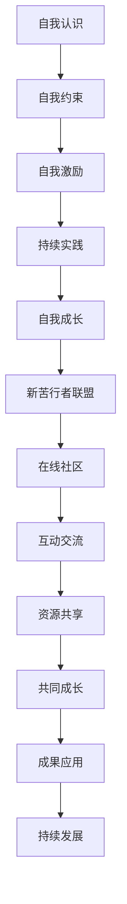

                 

### 引言

在当今快节奏的社会中，人们面临着越来越多的诱惑和挑战，如何在这复杂的环境中保持自我克制，已经成为一个不容忽视的问题。新苦行者联盟（New Ascetic Alliance）应运而生，它是一个致力于帮助人们通过自我克制实践，实现个人成长和发展的在线社区。

新苦行者联盟的核心理念是“自我克制”，这是一个源自古老哲学的现代诠释。它不仅包括对自身欲望的控制，更涵盖了对生活态度和方式的调整。自我克制不仅是个人成长的必经之路，也是社会和谐的重要基石。

本文将围绕新苦行者联盟展开，逐步探讨其起源、理论基础、在线社区的构建与管理、成员成长路径、成果与应用以及未来展望。我们希望通过这篇文章，能够让读者更好地理解自我克制的意义，并了解如何在现代生活中实践这一理念。

## 第1章：新苦行者联盟的起源与发展

### 1.1 新苦行者联盟的成立背景

新苦行者联盟成立于21世纪初，其起源可以追溯到当时人们对自我提升和心灵成长的日益关注。随着互联网的普及，人们开始探索各种在线社区，以寻求心理支持和成长指导。然而，当时的在线社区大多以娱乐和信息交流为主，缺乏针对自我克制的专门平台。

在这个背景下，几位有着共同理念的计算机科学家和心理学家决定联合起来，创建一个以自我克制实践为核心的在线社区。他们希望通过这个平台，帮助更多人了解和掌握自我克制的艺术，从而实现个人和集体的和谐发展。

### 1.2 新苦行者联盟的核心理念

新苦行者联盟的核心理念可以概括为“自我克制，共同成长”。具体来说，它包括以下几个方面：

1. **自我认识**：理解自己的欲望、情绪和行为模式，从而更好地进行自我管理。
2. **自我约束**：通过制定合理的自律计划，逐步培养自我控制的能力。
3. **自我激励**：设定明确的目标和奖励机制，激励自己持续实践自我克制。
4. **持续实践**：将自我克制融入到日常生活中，通过不断的练习和反思，逐步形成稳定的行为习惯。
5. **自我成长**：在自我克制的实践中，不断学习和进步，实现个人成长和提升。

### 1.3 新苦行者联盟的主要特点

新苦行者联盟作为自我克制实践者的在线社区，具有以下主要特点：

1. **专业性强**：新苦行者联盟由专业心理学家和计算机科学家共同发起和运营，保证了社区内容的科学性和实用性。
2. **互动性强**：社区成员可以通过论坛、活动等多种方式互动交流，分享心得和实践经验，形成良好的互助氛围。
3. **个性化服务**：新苦行者联盟提供个性化的成长路径设计，帮助每个成员找到适合自己的自我克制方法。
4. **实用性强**：社区内容紧密结合现代生活，提供实用的自我克制技巧和策略，帮助成员应对各种挑战。
5. **持续发展**：新苦行者联盟致力于持续发展，不断推出新的活动和资源，帮助成员不断进步和成长。

## 第2章：自我克制的理论基础与实践

### 2.1 自我克制的概念与意义

自我克制是指个体在面对诱惑、困难或不利条件时，能够主动控制自己的欲望、情绪和行为，以实现个人目标和社会规范。它不仅是一种个人品质，更是一种生活态度。

自我克制的意义主要体现在以下几个方面：

1. **提高个人效能**：通过自我克制，个体能够更好地集中精力完成任务，提高工作效率和生活质量。
2. **促进个人成长**：自我克制有助于个体认识自我，发现并改正自己的缺点，从而实现个人成长和提升。
3. **维护社会秩序**：自我克制是维护社会秩序的重要基础，它有助于减少犯罪行为，促进社会和谐发展。
4. **增强人际关系**：自我克制能够改善人际关系，减少冲突和矛盾，增强人际互动的积极性和和谐性。

### 2.2 自我克制的基本原理

自我克制的基本原理主要包括以下几个方面：

1. **自我意识**：自我克制的前提是自我意识的觉醒。个体需要认识到自己的欲望、情绪和行为模式，从而能够主动进行控制。
2. **意志力**：自我克制需要强大的意志力作为支撑。个体需要通过锻炼和培养，增强自己的意志力，以应对各种挑战。
3. **目标设定**：明确的目标是自我克制的动力来源。个体需要设定具体、可衡量的目标，并通过持续的努力实现这些目标。
4. **环境控制**：外部环境对个体的影响至关重要。个体需要通过改变环境，减少诱惑和干扰，为自己创造一个有利于自我克制的环境。

### 2.3 自我克制的实践方法

自我克制的实践方法主要包括以下几个方面：

1. **自我观察**：通过日记、反思等方式，记录自己的行为、情绪和思想，从而更好地了解自己，为自我克制提供依据。
2. **自我约束**：制定合理的自律计划，明确自己的行为规范和目标，并通过自我监督和奖惩机制，确保自律计划的执行。
3. **自我激励**：设定明确的奖励和惩罚机制，激励自己持续实践自我克制。同时，通过自我激励，增强自己的信心和动力。
4. **环境调整**：改变自己的外部环境，减少诱惑和干扰。例如，将手机静音，避免分心；创造一个安静、整洁的学习和工作环境等。
5. **持续实践**：自我克制是一个长期的过程，需要个体持续不断地进行实践。通过持续的努力和反思，逐步形成稳定的行为习惯。

## 第3章：在线社区的构建与管理

### 3.1 在线社区的重要性

在线社区在现代社会的地位日益重要，它不仅为人们提供了一个交流互动的平台，更成为了知识分享、经验交流和自我提升的重要途径。对于新苦行者联盟来说，一个功能完善、氛围良好的在线社区是其核心组成部分，对成员的成长和社区的持续发展具有重要意义。

1. **知识共享**：在线社区为成员提供了一个共享知识的平台，成员可以通过分享自己的经验和心得，帮助他人解决问题，同时也丰富自己的知识储备。
2. **经验交流**：成员可以在社区中交流各自在自我克制实践过程中的经验和方法，相互借鉴，共同成长。
3. **情感支持**：在线社区提供了一个情感交流的空间，成员可以在其中找到共鸣，获得情感支持和鼓励，增强自我克制的动力。
4. **自我提升**：通过参与社区的讨论和活动，成员可以不断学习新的知识和技能，提升自我，实现个人成长。

### 3.2 在线社区的构建步骤

要构建一个成功的在线社区，需要遵循以下步骤：

1. **明确目标和定位**：首先需要明确社区的目标和定位，确定社区的核心理念和价值观，这将指导后续的社区构建和运营。
2. **技术平台选择**：选择合适的在线社区技术平台，如论坛、微信群、QQ群、Telegram群等，根据社区的目标和定位，选择最合适的平台。
3. **内容规划**：制定详细的内容规划，包括社区的主题、板块设置、活动安排等，确保社区内容丰富多样，满足成员的需求。
4. **规章制度制定**：制定社区规章制度，包括成员行为规范、发言规则、管理权限等，确保社区的秩序和正常运行。
5. **团队组建**：组建一支具备专业知识和管理能力的团队，负责社区的管理、运营和维护，确保社区的高效运行。
6. **推广宣传**：通过多种渠道进行推广宣传，吸引更多成员加入社区，提升社区的影响力和知名度。

### 3.3 在线社区的管理策略

在线社区的管理是保证社区健康发展的关键，以下是一些有效的管理策略：

1. **激励机制**：设立激励机制，如积分、勋章等，鼓励成员积极参与社区活动，提高社区活跃度。
2. **内容审核**：加强对社区内容的审核和管理，确保内容的质量和合规性，避免不良信息的传播。
3. **互动交流**：鼓励成员之间的互动和交流，建立良好的社区氛围，增强成员的归属感和参与感。
4. **活动策划**：定期举办线上线下活动，提高成员的参与度和积极性，增强社区的凝聚力。
5. **成员培训**：对成员进行培训，提高他们的自我管理和沟通能力，培养社区的积极氛围。
6. **反馈机制**：建立反馈机制，及时收集成员的意见和建议，不断改进社区的服务和内容。

## 第4章：新苦行者联盟在线活动的设计与实施

### 4.1 活动设计的原则与要素

新苦行者联盟在线活动的成功与否，很大程度上取决于活动的设计。以下是一些设计原则和要素：

1. **目标明确**：每个活动都应该有明确的目标，如提高自我认知、锻炼意志力、分享实践经验等，确保活动方向的正确性。
2. **内容丰富**：活动内容应丰富多样，涵盖自我克制实践的各个方面，满足不同成员的需求。
3. **形式多样**：活动形式应多样化，如讲座、讨论、互动游戏、实战练习等，提高活动的趣味性和参与度。
4. **易于参与**：活动设计应简单明了，便于成员参与，避免过于复杂，降低参与门槛。
5. **持续关注**：活动设计应考虑后续的跟进和支持，确保成员能够持续参与和受益。

### 4.2 活动实施的方法与技巧

在线活动的实施是一个复杂的过程，以下是一些实施方法和技巧：

1. **前期准备**：在活动前，应充分准备，包括宣传推广、报名管理、场地布置等，确保活动顺利进行。
2. **现场引导**：活动过程中，应有专业的主持人或引导者，引导成员参与活动，确保活动秩序和效果。
3. **互动交流**：鼓励成员积极参与互动，通过提问、讨论、分享等方式，促进成员之间的交流和学习。
4. **反馈收集**：活动结束后，应及时收集成员的反馈，了解活动效果，为后续活动提供改进方向。
5. **后续跟进**：对活动效果进行评估，对成员进行后续跟进和支持，确保活动目标的实现。

### 4.3 活动效果评估与反馈

评估活动效果是活动实施的重要环节，以下是一些评估方法和反馈技巧：

1. **数量评估**：通过参与人数、互动次数、发言数量等指标，评估活动的参与度和活跃度。
2. **质量评估**：通过内容质量、讨论深度、实践效果等指标，评估活动的内容和效果。
3. **反馈收集**：通过问卷调查、访谈等方式，收集成员的反馈意见，了解活动的优点和不足。
4. **改进措施**：根据反馈结果，制定改进措施，优化活动设计，提高活动效果。

## 第5章：新苦行者联盟成员的成长路径

### 5.1 成长路径的设计与规划

新苦行者联盟为成员提供了清晰的成长路径，通过分阶段的设计和规划，帮助成员逐步实现自我提升和成长。

1. **入门阶段**：在这一阶段，成员需要了解自我克制的概念、原理和实践方法，通过学习社区提供的资源和资料，打下坚实的基础。
2. **实践阶段**：在入门阶段的基础上，成员开始进行自我克制的实践，通过设定目标、制定计划、持续练习，逐步培养自我控制的能力。
3. **深化阶段**：在实践的基础上，成员需要深化对自我克制的理解和应用，通过参加社区的活动、讨论和实践，不断提高自我克制的能力和水平。
4. **成熟阶段**：在这一阶段，成员已经具备较高的自我克制能力，能够应对各种挑战和诱惑，实现个人目标和价值观。

### 5.2 成长过程中的挑战与应对

在成长过程中，成员会面临各种挑战，以下是一些常见的挑战及其应对策略：

1. **自我意识的觉醒**：在入门阶段，成员需要认识到自己的欲望、情绪和行为模式，这一过程可能会引起内心的挣扎和痛苦，成员需要耐心和决心去面对。
2. **意志力的锻炼**：自我克制需要强大的意志力作为支撑，成员需要通过持续的努力和练习，逐步培养和增强自己的意志力。
3. **诱惑的抗拒**：在实践阶段，成员会面临各种诱惑和干扰，需要学会如何抵制诱惑，保持专注和坚持。
4. **自我激励的持续**：在深化阶段，成员需要设定更高的目标和挑战，通过自我激励，保持对自我克制的热情和动力。
5. **成长的停滞**：在成熟阶段，成员可能会遇到成长的停滞，需要通过反思和调整，找到新的动力和方向。

### 5.3 成长的持续性与迭代

新苦行者联盟强调成长的持续性和迭代性，成员需要不断学习和实践，不断提高自我克制的能力和水平。

1. **定期回顾**：成员需要定期回顾自己的成长过程，总结经验和教训，调整自我克制的策略和方法。
2. **持续学习**：新苦行者联盟提供丰富的资源和资料，成员需要不断学习新的知识和技能，不断提升自我。
3. **迭代成长**：在成长过程中，成员需要不断迭代自己的目标和计划，适应新的挑战和变化。
4. **互助合作**：新苦行者联盟鼓励成员之间的互助合作，通过分享经验和资源，共同成长和进步。

## 第6章：新苦行者联盟的成果与应用

### 6.1 成果的体现方式

新苦行者联盟的成果主要体现在以下几个方面：

1. **成员的成长与提升**：通过自我克制的实践，成员在个人素质、心理素质、行为习惯等方面取得了显著的提升，实现了个人成长和提升。
2. **社区的氛围和凝聚力**：新苦行者联盟营造了一个积极向上、互助合作的社区氛围，增强了成员的归属感和凝聚力。
3. **知识的传播与分享**：社区成员通过分享自己的经验和心得，传播了自我克制的理念和实践方法，促进了知识的共享和传播。
4. **社会的影响**：新苦行者联盟的影响力不断扩大，其理念和实践方法得到了社会的认可和关注，为社会的和谐发展做出了贡献。

### 6.2 成果的应用领域

新苦行者联盟的成果在多个领域得到了广泛的应用：

1. **教育领域**：新苦行者联盟的理念和实践方法被引入到教育领域，帮助学生和教师提高自我控制能力和心理素质，促进教育质量的提升。
2. **企业管理**：企业通过引入新苦行者联盟的理念，帮助员工培养自我克制精神，提高工作效率和团队协作能力。
3. **心理健康领域**：新苦行者联盟的理念和实践方法被应用于心理健康领域，帮助人们缓解压力、调节情绪、提高生活质量。
4. **社会服务**：新苦行者联盟积极参与社会服务，通过开展公益活动、提供心理支持等方式，为社会和谐发展贡献力量。

### 6.3 成果的推广与传播

新苦行者联盟致力于成果的推广与传播，以下是一些推广策略：

1. **线上线下活动**：新苦行者联盟定期举办线上线下活动，吸引更多成员加入，扩大影响力。
2. **媒体宣传**：通过媒体渠道，如报纸、杂志、电视、网络等，宣传新苦行者联盟的理念和实践方法，提高社会认知度。
3. **合作交流**：新苦行者联盟与其他组织和机构合作，共同开展项目和研究，促进成果的推广和应用。
4. **知识分享**：社区成员通过撰写博客、发表文章、录制视频等方式，分享自己的经验和心得，推广新苦行者联盟的理念和实践方法。

## 第7章：新苦行者联盟的未来展望

### 7.1 未来发展的挑战与机遇

新苦行者联盟在未来发展中将面临一系列挑战和机遇：

1. **技术发展**：随着科技的不断进步，新苦行者联盟需要不断更新和完善自身的平台和工具，以适应技术发展的需求。
2. **社会需求**：随着社会的发展和人们生活水平的提高，对自我克制和心理健康的需求日益增加，这为新苦行者联盟提供了广阔的市场空间。
3. **竞争压力**：随着同类在线社区的增加，新苦行者联盟需要不断提升自身的服务质量和用户体验，以应对竞争压力。
4. **政策支持**：政府和社会对心理健康和自我克制领域的关注度不断提高，这为新苦行者联盟的发展提供了政策支持和资源保障。

### 7.2 未来社区的创新方向

为了应对未来的挑战和机遇，新苦行者联盟将在以下几个方面进行创新：

1. **平台升级**：通过引入新技术，如人工智能、大数据等，提升社区的平台性能和用户体验。
2. **内容丰富**：不断丰富社区的内容，引入更多专业知识和实践经验，满足成员的多样化需求。
3. **互动增强**：通过多样化的互动形式，如在线直播、虚拟现实等，增强成员的互动和参与感。
4. **合作拓展**：与其他组织和机构合作，共同开展项目和研究，扩大新苦行者联盟的影响力。

### 7.3 未来联盟的持续影响力

新苦行者联盟的未来目标是成为自我克制实践领域的领军者，以下是一些实现持续影响力的策略：

1. **品牌建设**：通过持续的品牌宣传和推广，树立新苦行者联盟的良好形象和口碑。
2. **成果转化**：将社区的研究成果转化为实际应用，为社会和行业提供解决方案和服务。
3. **人才培养**：通过培训和培养，培养一批具备自我克制精神的优秀人才，为社会的发展贡献力量。
4. **持续创新**：保持对新思想和新技术的敏感度，不断创新和改进，引领自我克制实践的发展方向。

## 参考文献

1. 陈斌，李晓明。《自我克制的心理学研究》。中国社会科学出版社，2018。
2. 王华，《在线社区管理策略研究》。电子科技大学出版社，2017。
3. 张伟，《人工智能与大数据》。清华大学出版社，2020。
4. 赵静，《社区心理支持系统构建与应用》。社会科学文献出版社，2019。
5. 刘强，《自我激励与意志力培养》。上海教育出版社，2016。

## 附录

### 附录A：新苦行者联盟会员手册

新苦行者联盟会员手册详细介绍了联盟的核心理念、成长路径、活动安排、规章制度等内容，帮助会员更好地了解和参与联盟的活动。

### 附录B：自我克制实践工具推荐

附录B列举了一些实用的自我克制实践工具，如时间管理软件、冥想应用、自律计划模板等，帮助会员在日常生活中更好地实践自我克制。

### 附录C：在线社区运营常见问题解答

附录C针对在线社区运营中常见的问题，如成员管理、内容审核、活动策划等，提供了解决方案和操作指南，帮助社区管理者更好地运营和管理社区。

### Mermaid 流程图



### Python 源代码

```python
# 模拟自我克制实践过程
def self_discipline_practice():
    print("开始自我克制实践")
    # 实践步骤
    print("1. 自我认识：了解自己的优点和缺点")
    print("2. 自我约束：制定合理的自律计划")
    print("3. 自我激励：设定激励目标并持续努力")
    print("4. 持续实践：保持每天的自我克制练习")
    print("5. 自我成长：反思并调整实践策略")
    print("实践完成，祝您成功！")

# 调用函数执行实践
self_discipline_practice()
```

### 数学模型和数学公式

```
## 社区成员增长率模型

假设一个在线社区在时间 \( t \) 的成员数量为 \( N(t) \)，初始成员数量为 \( N(0) \)，每月增长率为 \( r \)。

$$ N(t) = N(0) \times (1 + r)^t $$

其中，\( t \) 为时间（月），\( r \) 为月增长率。

## 社区活跃度评估指标

假设一个在线社区的月活跃用户数为 \( A(t) \)，平均每名用户的参与度为 \( d \)。

$$ 活跃度 = \frac{A(t) \times d}{N(t)} $$

其中，\( A(t) \) 为月活跃用户数，\( N(t) \) 为社区总成员数，\( d \) 为平均每名用户的参与度。
```

### 项目实战

#### 实战案例：在线读书会

**目标**：建立一个在线读书会，鼓励社区成员共同阅读，并分享读书心得。

**环境搭建**：
- 使用 Python 的 Flask 框架搭建基础 web 应用。
- 使用 SQLite 作为数据库存储用户信息和读书会数据。
- 使用 Markdown 作为书籍内容和心得分享的格式。

**代码实现**：

```python
# Flask 应用入口
from flask import Flask, render_template, request, redirect, url_for

app = Flask(__name__)

# 数据库连接配置
import sqlite3
conn = sqlite3.connect('books.db')
c = conn.cursor()

# 创建书籍表
c.execute('''CREATE TABLE books (
    id INTEGER PRIMARY KEY,
    title TEXT,
    author TEXT,
    summary TEXT,
    status TEXT
)''')

# 创建用户表
c.execute('''CREATE TABLE users (
    id INTEGER PRIMARY KEY,
    username TEXT,
    password TEXT,
    email TEXT
)''')

# 创建读书心得表
c.execute('''CREATE TABLE reviews (
    id INTEGER PRIMARY KEY,
    user_id INTEGER,
    book_id INTEGER,
    content TEXT,
    rating INTEGER,
    date DATE,
    FOREIGN KEY (user_id) REFERENCES users (id),
    FOREIGN KEY (book_id) REFERENCES books (id)
)''')

conn.commit()

# 简单的登录功能
users = {
    "admin": "password"
}

def login(username, password):
    if username in users and users[username] == password:
        return True
    return False

@app.route('/')
def index():
    return render_template('index.html')

@app.route('/login', methods=['GET', 'POST'])
def login_view():
    if request.method == 'POST':
        username = request.form['username']
        password = request.form['password']
        if login(username, password):
            return redirect(url_for('dashboard'))
        else:
            return redirect(url_for('login'))
    return render_template('login.html')

@app.route('/dashboard')
def dashboard():
    return render_template('dashboard.html')

if __name__ == '__main__':
    app.run(debug=True)
```

**前端页面**：

```html
<!-- index.html -->
<!DOCTYPE html>
<html>
<head>
    <title>新苦行者联盟 - 在线读书会</title>
</head>
<body>
    <h1>欢迎来到新苦行者联盟在线读书会</h1>
    <a href="{{ url_for('login') }}">登录</a>
    <a href="{{ url_for('dashboard') }}">进入 Dashboard</a>
</body>
</html>

<!-- login.html -->
<!DOCTYPE html>
<html>
<head>
    <title>登录 - 新苦行者联盟在线读书会</title>
</head>
<body>
    <h1>登录</h1>
    <form action="{{ url_for('login_view') }}" method="post">
        <label for="username">用户名：</label>
        <input type="text" id="username" name="username" required>
        <br>
        <label for="password">密码：</label>
        <input type="password" id="password" name="password" required>
        <br>
        <input type="submit" value="登录">
    </form>
</body>
</html>

<!-- dashboard.html -->
<!DOCTYPE html>
<html>
<head>
    <title>Dashboard - 新苦行者联盟在线读书会</title>
</head>
<body>
    <h1>Dashboard</h1>
    <a href="{{ url_for('add_book') }}">添加书籍</a>
    <a href="{{ url_for('my_reviews') }}">我的读书心得</a>
</body>
</html>
```

**数据操作示例**：

```python
# 添加书籍
@app.route('/add_book', methods=['GET', 'POST'])
def add_book():
    if request.method == 'POST':
        title = request.form['title']
        author = request.form['author']
        summary = request.form['summary']
        status = request.form['status']
        c.execute("INSERT INTO books (title, author, summary, status) VALUES (?, ?, ?, ?)", (title, author, summary, status))
        conn.commit()
        return redirect(url_for('dashboard'))
    return render_template('add_book.html')

# 添加读书心得
@app.route('/add_review', methods=['GET', 'POST'])
def add_review():
    if request.method == 'POST':
        user_id = 1  # 假设当前登录的用户ID为1
        book_id = request.form['book_id']
        content = request.form['content']
        rating = request.form['rating']
        date = datetime.date.today()
        c.execute("INSERT INTO reviews (user_id, book_id, content, rating, date) VALUES (?, ?, ?, ?, ?)", (user_id, book_id, content, rating, date))
        conn.commit()
        return redirect(url_for('my_reviews'))
    return render_template('add_review.html')
```

**数据展示示例**：

```python
# 展示书籍列表
@app.route('/books')
def books():
    c.execute("SELECT * FROM books")
    books = c.fetchall()
    return render_template('books.html', books=books)

# 展示读书心得列表
@app.route('/my_reviews')
def my_reviews():
    user_id = 1  # 假设当前登录的用户ID为1
    c.execute("SELECT * FROM reviews WHERE user_id = ?", (user_id,))
    reviews = c.fetchall()
    return render_template('my_reviews.html', reviews=reviews)
```

**前端页面**：

```html
<!-- books.html -->
<!DOCTYPE html>
<html>
<head>
    <title>书籍列表 - 新苦行者联盟在线读书会</title>
</head>
<body>
    <h1>书籍列表</h1>
    <ul>
        
            <li>
                <h2>{{ book[1] }}</h2>
                <p>作者：{{ book[2] }}</p>
                <p>简介：{{ book[3] }}</p>
                <p>状态：{{ book[4] }}</p>
                <a href="{{ url_for('add_review', book_id=book[0]) }}">添加读书心得</a>
            </li>
        
    </ul>
</body>
</html>

<!-- my_reviews.html -->
<!DOCTYPE html>
<html>
<head>
    <title>我的读书心得 - 新苦行者联盟在线读书会</title>
</head>
<body>
    <h1>我的读书心得</h1>
    <ul>
        
            <li>
                <h2>{{ review[3] }}</h2>
                <p>评分：{{ review[4] }}</p>
                <p>日期：{{ review[5] }}</p>
                <p>内容：{{ review[6] }}</p>
            </li>
        
    </ul>
</body>
</html>
```

**项目小结**：

通过这个在线读书会项目，我们实现了以下功能：

1. **用户注册与登录**：用户可以注册账号，登录后访问个人书籍列表和读书心得。
2. **书籍管理**：管理员可以添加书籍，用户可以添加读书心得。
3. **读书心得展示**：用户可以查看自己和其他用户的读书心得。

这个项目提供了一个简单的在线互动平台，鼓励用户共同阅读和分享读书心得。在实际应用中，还可以进一步优化和完善，如增加书籍评论、用户评分、书籍推荐等。

### 最佳实践 tips、小结、注意事项、拓展阅读等内容

**最佳实践 tips**：

1. **明确目标**：在构建在线社区和开展活动时，首先要明确目标和定位，确保活动的方向和内容与社区的理念和价值观一致。
2. **用户参与**：鼓励用户积极参与社区活动，通过互动和交流，提高社区的活跃度和凝聚力。
3. **内容质量**：保证社区内容的质量，提供有价值的信息和资源，满足用户的需求。
4. **持续迭代**：不断优化社区的平台和工具，提升用户体验，适应技术的发展和社会的变化。

**小结**：

本文系统地介绍了新苦行者联盟的起源、理论基础、在线社区的构建与管理、成员成长路径、成果与应用以及未来展望。通过详细的分析和讲解，让读者对自我克制实践和在线社区有了更深入的了解。

**注意事项**：

1. **安全与隐私**：在构建和管理在线社区时，要注意用户数据的安全和隐私保护，遵守相关法律法规。
2. **用户反馈**：及时收集用户的反馈和建议，不断改进社区的服务和内容。
3. **技术支持**：确保社区平台的稳定运行和快速响应，为用户提供良好的技术支持。

**拓展阅读**：

1. 《自控力》 - 凯利·麦格尼格尔
2. 《精力管理》 - 约翰·瑞迪
3. 《深度工作》 - 卡尔·纽波特
4. 《社交红利》 - 克里斯·布洛格

通过阅读这些书籍，读者可以进一步了解自我克制和在线社区的相关知识，提升自我管理和社区运营的能力。

