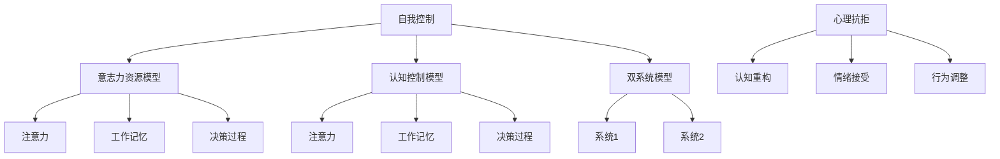

                 

## 第1章 引言：新苦行者的起源与意义

### 1.1 新苦行者的起源

在古代东方的智慧传统中，苦行被视为一种精神修炼的方法，旨在通过极端的自我克制来达到心灵的纯净和精神的升华。这种修炼形式在印度教和佛教中尤为突出，修行者通过极端的斋戒、静坐和修行，以期达到与宇宙合一的境界。而在西方，神秘主义和基督教中也有类似的苦行传统，如早期基督教的修行者们通过长时间的祷告、禁食和苦行来寻求上帝的恩赐和精神的提升。

随着现代社会的发展和人们对心理健康的关注，苦行传统开始被重新审视和适应现代生活的需求，形成了“新苦行者”这一概念。新苦行者不再单纯追求极端的物理苦行，而是更注重心理和精神的自我提升。这种转变源于现代社会中对自我控制、自律和内心平静的需求增加。

### 1.2 新苦行者训练营的核心价值观

新苦行者训练营的核心价值观可以概括为两个关键词：自我克制和集体实践。

**自我克制**：这是新苦行者训练营的核心，它要求个体在面对各种诱惑和困难时，能够保持冷静和理性，做出有益于长期目标的行为决策。自我克制不仅仅是简单的意志力锻炼，更是一种深层次的自我认知和情感管理能力。

**集体实践**：自我克制并不是一个孤立的过程，而是需要在一个团队或社群中共同进行和实践。集体实践为新苦行者提供了相互激励和监督的环境，通过团队合作和社交互动，个体能够更容易地坚持自我克制的原则，并且从他人的经验中学习。

### 1.3 自我克制的集体实践的重要性

**个人成长**：自我克制的集体实践对于个人的成长具有重要意义。通过不断地自我克制，个体能够提高自我控制力，增强心理韧性，从而更好地应对生活中的各种挑战。

**社会影响**：从更广泛的社会角度来看，自我克制的集体实践有助于改善社会风气，提升整体的社会素质。当越来越多的人能够自我克制，社会将更加和谐，人与人之间的关系也将更加健康。

总的来说，新苦行者训练营不仅仅是一种自我提升的方法，更是一种社会实验，旨在探索如何在现代社会中实现个人与社会的共同进步。这一章为我们提供了一个框架，引导我们进一步探讨自我克制和集体实践的心理学基础、日常实践、社会互动以及心理调适等多个方面。

### 关键词

- 新苦行者
- 自我克制
- 集体实践
- 心理韧性
- 社会和谐
- 精神修炼
- 心理健康

### 摘要

本文探讨了“新苦行者训练营”这一现代自我提升概念的起源与意义。通过对传统苦行者的历史回顾，我们理解了自我克制和集体实践的核心价值观。文章强调了自我克制对于个人成长和社会影响的重要性，并提出了集体实践在这一过程中的关键作用。接下来，我们将进一步探讨自我克制的心理学基础，以及如何在日常生活中实践这一理念。

## 第2章 自我克制的心理学基础

自我克制是一种深层次的心理能力，它涉及到个体如何控制自己的行为、情感和欲望。理解自我克制的心理学基础，有助于我们更有效地进行自我管理和实现长期目标。在本章中，我们将详细探讨自我控制理论，包括其定义、重要性以及相关的理论模型。

### 2.1 自我控制理论

#### 2.1.1 自我控制的定义

自我控制是指个体在面对内在冲动和外部诱惑时，能够灵活地调整自己的行为和情感，以符合既定的目标或规范。自我控制不仅仅是一种简单的意志力表现，它更是一种复杂的认知和行为过程，涉及到多个心理和神经机制。

#### 2.1.2 自我控制的重要性

自我控制对于个体的心理和生理健康具有显著的影响。首先，自我控制能够帮助个体更好地管理压力和情绪，提高心理韧性。其次，自我控制能力强的个体更容易实现长期目标，因为他们能够克服短期的诱惑和困难。此外，自我控制还能够促进社交关系的和谐，提高个体的社会适应能力。

#### 2.1.3 自我控制的理论模型

在心理学领域，有多种理论模型解释自我控制的形成和运作机制。以下是其中几个重要的理论模型：

1. **意志力资源模型**：
   该模型认为自我控制是一种有限的资源，类似于肌肉力量。当个体需要自我控制时，这些资源会被消耗，使用过多会导致疲劳和崩溃。意志力资源模型强调自我控制需要能量的支持，并且可以通过适当的休息和恢复来增强。

2. **认知控制模型**：
   认知控制模型关注个体如何使用认知资源来调节行为。这个模型强调注意力、工作记忆和决策过程在自我控制中的作用。通过认知控制，个体能够抑制不合适的行为冲动，集中注意力在目标上。

3. **双系统模型**：
   双系统模型将自我控制分为两个系统：快速、自动化的“系统1”和缓慢、有意识的“系统2”。系统1主要负责处理日常的直觉反应，而系统2则涉及复杂的决策和自我调节。当个体需要高度的自我控制时，系统2需要介入，监督和调节系统1的行为。

### 2.2 克服诱惑与拖延的心理学策略

在日常生活中，自我控制能力常常受到各种诱惑和拖延的挑战。以下是几种有效的心理学策略，帮助我们克服这些障碍：

#### 2.2.1 克服诱惑的策略

1. **前置决策**：
   在面对诱惑之前，预先制定明确的决策和计划，减少即兴决定的诱惑。例如，如果担心零食诱惑，可以在家里不购买零食，或者将零食放在不易拿取的地方。

2. **情境控制**：
   通过改变环境来减少诱惑。例如，如果容易沉迷于手机，可以将手机放在远离自己的地方，或者设置屏幕使用时间限制。

3. **社会支持**：
   寻求家人、朋友或同事的支持和监督，他们可以在我们面临诱惑时提供帮助和鼓励。

#### 2.2.2 克服拖延的策略

1. **目标分解**：
   将大目标分解成小步骤，逐步完成。这样可以减少任务的压迫感，提高完成的动力和成就感。

2. **时间管理**：
   制定详细的时间表和计划，为每项任务分配特定的时间。使用番茄工作法等时间管理技巧，确保高效完成任务。

3. **奖励机制**：
   设定奖励来激励自己完成任务。当完成一个任务后，给予自己一些小奖励，如休息片刻、享受美食等。

#### 2.2.3 心理抗拒与自我调节

心理抗拒是指个体在面对不愉快或困难任务时，产生的一种抵触情绪。自我调节是指个体通过认知和行为策略，来控制和管理自己的情绪和动机。以下是几种应对心理抗拒的自我调节策略：

1. **认知重构**：
   重新解释任务的意义和价值，将其与个人的目标和价值观联系起来，从而减少抵触情绪。

2. **情绪接受**：
   接受自己的情绪，不要试图压抑或逃避。通过冥想、深呼吸等放松技巧，缓解情绪压力。

3. **行为调整**：
   调整行为方式，如改变工作环境、与他人合作等，以减少心理抗拒的影响。

总的来说，自我克制是一种复杂的心理能力，需要个体通过多种策略和模型来提升。理解自我控制的心理学基础，有助于我们更好地管理自己的行为和情感，实现长期目标。

### 核心概念与联系

为了更好地理解自我克制的心理学基础，我们需要构建核心概念之间的关系架构。以下是使用Mermaid流程图表示的核心概念：



这个Mermaid流程图展示了自我控制与相关理论模型、心理机制以及自我调节策略之间的关系。通过这种关系架构，我们可以更清晰地理解自我克制在心理学中的复杂性。

### Python源代码：意志力资源模型示例

为了更好地解释意志力资源模型，我们使用Python代码模拟了一个简单的实验，假设个体的意志力资源随时间逐渐耗尽。

```python
import matplotlib.pyplot as plt
import numpy as np

# 假设个体的初始意志力资源为100点
willpower = 100

# 设定实验时长为10分钟，每分钟消耗5点意志力
time_elapsed = 0
willpower_consumption = 5
willpower_curve = []

while time_elapsed < 10:
    willpower -= willpower_consumption
    willpower_curve.append(willpower)
    time_elapsed += 1

plt.plot([i for i in range(1, 11)], willpower_curve)
plt.xlabel('Time (minutes)')
plt.ylabel('Willpower (points)')
plt.title('Willpower Resource Over Time')
plt.show()
```

上述代码生成了一条随时间下降的意志力曲线，展示了个体在连续任务中意志力资源逐渐耗尽的过程。这个示例帮助读者更直观地理解意志力资源模型的概念。

### 数学模型与公式

在自我控制理论中，我们常常使用以下数学模型和公式来描述自我控制的运作：

1. **意志力消耗模型**：

   \[ W_t = W_{\text{initial}} - \sum_{i=1}^{t} C_i \]

   其中，\( W_t \) 表示在时间 \( t \) 时的意志力资源，\( W_{\text{initial}} \) 是初始意志力资源，\( C_i \) 是每单位时间消耗的意志力。

2. **认知负荷模型**：

   \[ C_{\text{total}} = \sum_{i=1}^{n} B_i \cdot \Delta T_i \]

   其中，\( C_{\text{total}} \) 是总认知负荷，\( B_i \) 是第 \( i \) 个任务的需要认知资源的强度，\( \Delta T_i \) 是完成第 \( i \) 个任务所需的时间。

通过这些数学模型和公式，我们可以定量地分析自我控制的机制，帮助个体更好地理解和管理自己的意志力资源。

### 项目实战：新苦行者训练营的饮食控制

在自我克制的集体实践中，饮食控制是一个重要的方面。以下是一个具体的实战项目，介绍如何在新苦行者训练营中实施饮食控制，并分析其实施过程中的挑战和解决方案。

#### 1. 开发环境搭建

为了有效地进行饮食控制，我们需要搭建一个包含以下组件的开发环境：

- **数据收集工具**：使用手机应用程序或传感器来记录个体的饮食信息，如摄入的食物种类、数量、时间等。
- **数据库**：使用MySQL或MongoDB等数据库来存储收集到的饮食数据。
- **数据分析平台**：使用Python的Pandas和NumPy库进行数据分析和可视化。

#### 2. 源代码详细实现

以下是一个简单的Python脚本，用于收集和记录饮食数据，并将其存储到MySQL数据库中：

```python
import mysql.connector
import pandas as pd

# MySQL数据库连接
db = mysql.connector.connect(
  host="localhost",
  user="yourusername",
  password="yourpassword",
  database="diet_control"
)

# 创建饮食数据表
cursor = db.cursor()
cursor.execute("""
  CREATE TABLE IF NOT EXISTS diet_data (
    id INT AUTO_INCREMENT PRIMARY KEY,
    user_id INT,
    food_name VARCHAR(255),
    quantity INT,
    time DATETIME
  )
""")

# 收集饮食数据
def record_diet_data(user_id, food_name, quantity, time):
    query = """
    INSERT INTO diet_data (user_id, food_name, quantity, time)
    VALUES (%s, %s, %s, %s)
    """
    cursor.execute(query, (user_id, food_name, quantity, time))
    db.commit()

# 关闭数据库连接
cursor.close()
db.close()
```

#### 3. 代码应用解读与分析

上述代码实现了一个简单的饮食记录功能，用户可以通过调用 `record_diet_data` 函数，将饮食数据输入到数据库中。这个功能有助于个体跟踪自己的饮食情况，从而更好地进行饮食控制。

#### 4. 实际案例分析和详细讲解剖析

以下是一个实际案例，展示如何使用上述系统进行饮食控制，并分析其效果：

**案例**：用户A想要减少碳水化合物的摄入，以控制体重。他使用了饮食记录系统，每天记录自己的饮食数据。

**分析**：

- **第一周**：用户A记录了每天摄入的碳水化合物数量，发现平均每天摄入量为300克。这超出了他设定的每日目标（250克）。
- **第二周**：通过饮食记录，用户A意识到需要减少主食的摄入。他开始选择全麦面包和糙米等低GI食物，并增加了蔬菜和蛋白质的摄入。
- **第三周**：用户A再次记录饮食数据，发现每日碳水化合物摄入量降至240克，接近目标值。他的体重开始有所下降，身体感觉更加轻盈。

**讲解**：

- **数据驱动决策**：通过饮食记录系统，用户A能够清晰地看到自己的饮食状况，并根据数据调整饮食计划。
- **持续监督与反馈**：饮食记录系统提供了一个持续监督和反馈机制，帮助用户A保持自我克制的动力。

#### 5. 项目小结

饮食控制在新苦行者训练营中是一项重要的实践。通过搭建一个简单的饮食记录系统，个体能够更好地跟踪自己的饮食情况，并根据数据调整饮食计划。这个项目的成功实施，展示了数据驱动的自我管理方法在自我克制实践中的应用价值。

### 最佳实践 tips

1. **设置明确的目标**：在开始饮食控制前，明确设定具体的饮食目标，如每日摄入的热量和营养素比例。
2. **定期回顾和调整**：定期回顾饮食记录，并根据实际情况调整饮食计划，以适应身体变化和需求。
3. **多样化饮食**：确保饮食多样化，避免单一食物的过量摄入，以保持营养均衡。

### 小结

饮食控制是新苦行者训练营中自我克制的一个重要方面。通过数据驱动的自我管理方法，个体能够更有效地控制饮食，达到健康目标。饮食控制不仅有助于个人的身体健康，还能提升整体的生活质量。

### 注意事项

1. **个性化饮食计划**：每个人的身体和需求都不同，因此需要制定个性化的饮食计划。
2. **持续监测**：定期监测饮食数据，确保饮食计划的有效性和调整的及时性。

### 拓展阅读推荐

- 《瘦身心理学：行为和认知策略》（Marianne J. Leggate）
- 《饮食心理学：如何通过食物改善情绪和健康》（David Kessler）

## 第3章 新苦行者训练营的日常实践

自我克制的集体实践不仅体现在理论和心理策略上，更需要通过日常的实际行动来落实。新苦行者训练营的日常实践涵盖了多个方面，包括晨练、冥想和饮食控制等。这些实践不仅有助于提升个体的身心健康，还能增强团队的凝聚力和合作效率。在本章中，我们将详细探讨这些日常实践的具体方法、好处以及常见问题与解决策略。

### 3.1 晨练：唤醒身体的仪式

**晨练的好处**：

- **提升代谢率**：早晨进行运动可以加速新陈代谢，帮助身体更有效地燃烧热量。
- **增强心血管功能**：规律的晨练有助于增强心脏和肺部的功能，提高耐力和抵抗力。
- **改善精神状态**：晨练能够释放身体内的内啡肽，带来愉悦感和积极的情绪，有助于缓解压力和焦虑。

**晨练的具体方法**：

- **热身运动**：开始晨练前，进行5-10分钟的热身运动，如慢跑、跳绳或瑜伽。
- **有氧运动**：进行20-30分钟的有氧运动，如快走、慢跑、骑自行车等，以提升心肺功能。
- **力量训练**：每周安排2-3次力量训练，如举重、俯卧撑、深蹲等，以增强肌肉力量和耐力。
- **拉伸放松**：运动结束后，进行5-10分钟的拉伸放松，缓解肌肉紧张，预防运动损伤。

**晨练的常见问题与解决**：

- **缺乏动力**：设定明确的目标和奖励机制，如每周完成晨练次数，奖励自己喜欢的小奖励。
- **时间不足**：利用早晨的碎片时间进行晨练，如早起30分钟，或选择在家附近的公园进行简短运动。
- **身体不适**：适当调整运动强度和频率，如果出现身体不适，及时停止运动并寻求专业医生的建议。

### 3.2 冥想：安抚心灵的练习

**冥想的基本原理**：

- **专注呼吸**：通过专注呼吸，将注意力集中在呼吸的进出，从而放松身体和心灵。
- **观想**：通过观想正面的图像或场景，如想象自己在平静的海滩或森林中，来减轻压力和焦虑。
- **正念**：正念冥想强调对当下的觉察和接受，不加评判地观察自己的思想和感受。

**冥想的具体方法**：

- **坐姿冥想**：选择一个安静舒适的环境，坐在垫子上，保持脊柱挺直，专注呼吸。
- **动禅冥想**：结合身体运动和呼吸，如散步、太极拳等，通过动作的流畅和呼吸的同步来达到冥想状态。
- **呼吸冥想**：专注于呼吸的进出，感受气息的流动，放松身体和心灵。

**冥想的常见问题与解决**：

- **难以集中注意力**：选择一个安静的环境，减少干扰，通过多次冥想练习逐步提高专注力。
- **身体不适**：选择舒适的坐姿或卧姿，保持身体放松，如果身体出现不适，适当调整姿势或暂停冥想。
- **情绪波动**：冥想可能会引发情绪波动，接受这些情绪，通过呼吸和正念练习来平复情绪。

### 3.3 饮食控制：净化身体的实践

**饮食控制的重要性**：

- **维持健康体重**：合理的饮食控制有助于维持健康的体重，预防肥胖和相关疾病。
- **提升营养摄入**：通过选择健康、营养丰富的食物，确保身体获得所需的营养素。
- **改善消化功能**：合理的饮食控制有助于改善消化系统功能，预防消化不良和胃肠疾病。

**饮食控制的具体措施**：

- **限制高热量食物**：减少高热量、高脂肪和高糖食物的摄入，如油炸食品、糖果和快餐。
- **增加蔬菜和水果摄入**：每天摄入足够的水果和蔬菜，以保证维生素和矿物质的摄入。
- **控制饮食量**：适量进食，避免暴饮暴食，每餐保持七分饱。
- **定时定量**：制定合理的饮食计划和餐表，遵循定时定量的原则。

**饮食控制的挑战与解决方案**：

- **饮食欲望**：通过增加饱腹感食物的摄入，如富含膳食纤维的食物，减少饥饿感。
- **社交压力**：在社交场合中，提前规划饮食计划，拒绝诱惑，或选择健康替代品。
- **饮食习惯**：逐步改变饮食习惯，增加健康食物的摄入，减少不健康食物的依赖。

### 小结

新苦行者训练营的日常实践是自我克制的重要组成部分，通过晨练、冥想和饮食控制等多种方法，个体能够有效地提升身心健康，增强自我控制力。这些实践不仅有助于个人的成长，还能为团队和社会带来积极的影响。

### 注意事项

- **个性化实践**：根据个人身体状况和需求，制定适合自己的晨练、冥想和饮食计划。
- **持续坚持**：保持日常实践的一致性，逐步形成习惯，以实现长期的效果。

### 拓展阅读推荐

- 《健康生活的艺术：如何通过运动和饮食保持身心健康》（Marianne J. Leggate）
- 《冥想与生活：如何通过冥想改善身心健康》（Jack Kornfield）

## 第4章 新苦行者训练营的社会互动

在自我克制的集体实践中，社会互动起到了至关重要的作用。新苦行者训练营通过团队协作和群体动力，不仅增强了个体之间的互动，还促进了自我克制的深入实践。本章将探讨团队协作和群体动力的基本原理、影响因素以及其在新苦行者训练营中的积极作用和挑战。

### 4.1 团队协作：自我克制的集体力量

**团队协作的重要性**：

- **共享目标**：团队协作有助于明确和统一团队的目标，使得每个成员都能为共同的目标努力。
- **分工合作**：通过分工合作，团队成员能够发挥各自的优势，提高工作效率和效果。
- **互相激励**：在团队中，成员之间可以相互鼓励和激励，共同克服困难和挑战，保持自我克制的动力。

**团队协作的具体形式**：

- **任务分配**：根据团队成员的特长和兴趣，合理分配任务，确保每个成员都能在适合自己的领域发挥作用。
- **定期会议**：通过定期会议，团队成员可以分享进展、讨论问题，及时调整策略，确保团队目标的实现。
- **反馈机制**：建立有效的反馈机制，团队成员可以相互提供反馈和建议，帮助彼此改进和提高。

**团队协作中的沟通技巧**：

- **明确传达**：在沟通时，确保信息传达清晰、明确，避免产生误解和歧义。
- **倾听理解**：倾听他人的观点和需求，理解并尊重不同的意见和想法。
- **积极互动**：鼓励团队成员积极参与讨论和决策，促进团队内部的知识共享和经验交流。

### 4.2 群体动力：自我克制的群体效应

**群体动力的基本原理**：

- **模仿效应**：个体倾向于模仿群体中其他成员的行为和态度，这种现象被称为模仿效应。
- **社会认同**：个体在群体中感受到的社会认同感，增强了他们的自我克制能力。
- **群体压力**：群体对个体的行为和态度施加的压力，促使个体遵守群体的规范和价值观。

**群体动力的影响因素**：

- **群体规模**：群体规模越大，个体在群体中的匿名感越强，这可能导致自我克制能力的下降。
- **群体凝聚力**：群体凝聚力越高，成员之间的互动越密切，群体效应越明显。
- **群体领导**：有效的群体领导能够增强群体的凝聚力和自我克制能力，引导群体朝着共同目标前进。

**群体动力的积极作用**：

- **提高自我克制能力**：群体动力的积极作用在于，它能够增强个体的自我控制能力，使个体在集体实践中更容易坚持自我克制原则。
- **促进团队合作**：群体动力有助于团队成员之间的合作和协作，提高团队的整体效率和绩效。
- **提升社会认同感**：通过参与群体动力，个体能够感受到强烈的社会认同感，增强自信心和归属感。

**群体动力的挑战**：

- **群体压力**：群体动力中可能存在的群体压力，有时会导致个体放弃自我克制，盲目追求群体认同。
- **群体思维**：群体思维可能抑制个体的独立思考，导致决策的偏差和错误。
- **群体惰性**：群体动力中可能存在的群体惰性，使得个体倾向于依赖群体，缺乏自我驱动力。

### 小结

社会互动在新苦行者训练营中扮演着重要的角色。团队协作和群体动力不仅能够增强个体之间的互动和信任，还能促进自我克制的深入实践。通过有效的沟通技巧和领导力的发挥，团队和群体能够充分发挥其积极作用，克服挑战，实现共同的目标。

### 注意事项

- **个性化引导**：在团队协作和群体动力中，要注重个性化引导，确保每个成员都能充分发挥自己的特长和潜力。
- **持续反思**：定期进行团队反思和评估，及时发现和解决团队协作和群体动力中的问题。

### 拓展阅读推荐

- 《团队协作的艺术：如何打造高效团队》（Patrick Lencioni）
- 《群体动力：理解群体行为和决策》（Jeffrey Pfeffer）

## 第5章 新苦行者训练营的心理调适

在自我克制的集体实践中，心理调适是一个不可或缺的环节。压力管理和情绪管理是心理调适的两个核心方面，它们直接影响个体的心理健康和自我克制能力。本章将深入探讨压力管理和情绪管理的重要性、方法及其在应对生活挑战中的应用。

### 5.1 压力管理：应对生活挑战

**压力的来源**：

- **工作压力**：工作负荷重、竞争激烈、职业发展不确定性等因素可能导致工作压力。
- **家庭压力**：家庭责任、亲子关系、婚姻关系等都会产生压力。
- **社交压力**：社交互动中的压力，如聚会、社交网络等。
- **健康压力**：健康问题、疾病、身体不适等。

**压力管理的方法**：

1. **认知重构**：
   通过改变对压力事件的认知和解读，减少其负面影响。例如，将“无法完成的任务”转化为“当前阶段的挑战”。

2. **时间管理**：
   合理规划时间，避免过度工作或拖延。使用时间管理工具，如待办事项列表、时间表等，确保每项任务都有充足的时间完成。

3. **放松技巧**：
   利用深呼吸、冥想、瑜伽等放松技巧，缓解紧张情绪。定期进行放松练习，有助于降低长期压力水平。

4. **积极应对**：
   面对压力时，采取积极应对的态度，如寻求支持、解决问题、制定应对计划等。

**压力管理的误区与解决**：

- **逃避**：逃避压力并不能解决问题，反而可能导致问题积累。解决方法：面对问题，采取实际行动。
- **压抑**：长期压抑情绪可能导致心理健康问题。解决方法：学会表达和释放情绪，通过写日记、倾诉等方式缓解压力。

### 5.2 情绪管理：平衡心态

**情绪管理的重要性**：

情绪管理是心理健康的重要组成部分，良好的情绪管理有助于提高生活质量、增强人际关系和提升工作效能。

**情绪管理的方法**：

1. **情绪觉察**：
   提高对自身情绪的觉察和识别能力，了解情绪的来源和影响。

2. **情绪接受**：
   接受自己的情绪，不要试图压抑或逃避。认识到情绪是正常的生理反应，学会与情绪和平共处。

3. **情绪表达**：
   学会健康地表达情绪，避免消极的情绪压抑或爆发。通过写日记、倾诉或艺术表达等方式，有效释放情绪。

4. **情绪调节**：
   使用调节技巧，如深呼吸、冥想、正念练习等，帮助自己平衡情绪，缓解情绪波动。

**情绪管理的案例分析**：

- **案例一**：一位职场人士在项目压力下感到焦虑和压抑。通过情绪觉察和表达，他意识到自己的情绪来源于对失败的恐惧。通过正念练习和与同事的沟通，他学会了面对和缓解情绪，提高了工作效率。
- **案例二**：一位母亲在家庭压力下感到疲惫和沮丧。通过情绪接受和调节技巧，她学会了与情绪和平共处，并通过与家人和朋友的支持，缓解了压力。

### 小结

心理调适是新苦行者训练营中不可或缺的一环。通过有效的压力管理和情绪管理，个体能够更好地应对生活挑战，保持心理平衡。这些调适方法不仅有助于提升个体的心理健康，还能增强自我克制能力，促进自我成长和集体实践。

### 注意事项

- **个性化调适**：每个人的心理状态和压力源不同，需要制定个性化的心理调适计划。
- **持续实践**：心理调适需要长期的坚持和实践，通过不断练习，逐步提高自我管理能力。

### 拓展阅读推荐

- 《情绪智能：如何管理情绪，获得幸福与成功》（Daniel Goleman）
- 《压力管理：如何应对压力，提高生活质量》（John M. Grohol）

## 第6章 新苦行者训练营的持续发展

自我克制和集体实践不仅是一次性的活动，而是一个持续发展的过程。新苦行者训练营的持续发展需要不断自我成长、积极面对社会贡献以及持续反思与优化。本章将深入探讨这些方面，以及如何通过自我成长和社会贡献实现新苦行者训练营的长期目标。

### 6.1 自我成长：不断超越自我

**自我成长的必要性**：

自我成长是每个人持续发展的核心。通过不断学习和提升，个体能够更好地适应环境变化，实现个人目标和价值。

**自我成长的方法**：

1. **终身学习**：
   在信息爆炸的时代，终身学习已经成为必然。通过参加培训课程、阅读专业书籍、参与线上课程等方式，不断更新知识和技能。

2. **反思与自我评估**：
   定期进行自我反思和评估，了解自己的优点和不足，设定明确的学习和发展目标。

3. **实践与锻炼**：
   知识和技能需要通过实践来巩固和提高。参与实际项目和挑战，锻炼自己的能力，不断提升自我。

**自我成长的案例分析**：

- **案例一**：一位程序员通过参加编程马拉松和在线课程，不断提升编程技能。通过实际项目的开发，他将所学知识付诸实践，取得了显著的成长。
- **案例二**：一位创业者通过阅读商业书籍、参加商业培训和与同行交流，不断完善自己的商业理念和策略，最终成功带领公司走向成功。

### 6.2 社会贡献：传递自我克制的价值

**社会贡献的意义**：

社会贡献不仅能够帮助他人，还能提升个体的自我价值和成就感。通过自我克制的集体实践，新苦行者训练营的成员能够为社会带来积极的影响。

**社会贡献的具体方式**：

1. **志愿服务**：
   参与志愿服务活动，如支教、环保等，通过实际行动帮助他人和社会。

2. **知识分享**：
   通过写作、演讲、线上教学等方式，将自己的知识和经验分享给他人，帮助更多人实现自我提升。

3. **公益活动**：
   参与公益活动，如捐赠物资、筹款等，为社会弱势群体提供帮助。

**社会贡献的案例分析**：

- **案例一**：一位新苦行者训练营的成员通过志愿服务活动，帮助当地社区改善了生活条件。他的行动不仅得到了社区的认可，也激励了更多人参与志愿服务。
- **案例二**：一位资深程序员通过在线教学平台，免费为全球开发者提供编程课程。他的行动不仅帮助了无数开发者提升技能，也推动了全球技术人才的培养。

### 6.3 持续发展的策略

**持续发展的策略**：

为了确保新苦行者训练营的持续发展，需要采取一系列策略：

1. **组织文化**：
   建立积极向上的组织文化，鼓励成员持续成长和社会贡献。通过文化活动、团队建设等方式，增强团队的凝聚力。
   
2. **激励机制**：
   设立激励机制，如表彰、奖励等，鼓励成员积极参与自我成长和社会贡献。这些激励措施能够提高成员的积极性和参与度。

3. **持续反思**：
   定期进行团队反思和评估，识别存在的问题和改进空间。通过持续反思，不断优化训练内容和方式。

**最佳实践 tips**：

- **个性化成长计划**：根据每个成员的特长和兴趣，制定个性化的成长计划，确保每个人都能够在训练营中实现自我提升。
- **跨部门合作**：鼓励跨部门合作，促进知识和经验的交流，提高整体团队的协作效率。
- **持续学习与创新**：保持对新知识和新技术的敏感度，鼓励创新思维，推动组织的持续发展。

### 小结

新苦行者训练营的持续发展是一个不断自我成长、积极面对社会贡献的过程。通过自我成长，个体能够不断提升自我能力，实现个人价值。通过社会贡献，个体能够实现自我价值的同时，为社会发展贡献力量。持续发展的策略和组织文化的建设，将确保新苦行者训练营在未来的发展中持续前行。

### 注意事项

- **个性化发展**：每个人的成长路径不同，要尊重个体的个性化发展需求。
- **长期视角**：持续发展需要长期的坚持和投入，不能期望一蹴而就。

### 拓展阅读推荐

- 《终身学习：如何应对时代变革，实现持续成长》（Peter H. grev）
- 《社会贡献：如何通过行动改变世界》（Peter H. grev）

## 第7章 新苦行者训练营的成功案例

新苦行者训练营的成功不仅体现在个体的自我提升上，更在于其对社会和组织的深远影响。以下是一些成功的个人成长和组织变革案例，这些案例展示了自我克制实践在不同领域和层面的显著成果。

### 7.1 个人成长：自我克制的实践者

**成功案例一：从拖延到高效**

**背景**：李明是一位程序员，长期受到拖延症的困扰，工作效率低下，导致项目进度延误。

**实践**：李明参加了新苦行者训练营，通过自我克制的集体实践，他学会了时间管理和任务分解的方法。

**结果**：经过一段时间的训练，李明的拖延问题得到了显著改善，工作效率大幅提升，项目进度按时完成，得到了同事和领导的认可。

**案例分析**：李明通过自我克制，克服了拖延症，学会了有效管理时间和任务，这不仅提高了他的工作效率，也增强了他在团队中的影响力。

**启示**：自我克制是克服拖延的有效方法，通过培养自律和坚持，个体能够实现自我提升。

**成功案例二：从抑郁到自信**

**背景**：张丽是一位创业者，因长期承受创业压力和情绪波动，出现了抑郁症症状。

**实践**：张丽加入了新苦行者训练营，通过冥想、压力管理和社交互动，她逐渐恢复了自信和心理健康。

**结果**：经过训练营的培训，张丽的情绪状态得到了显著改善，她能够更加积极地面对挑战，创业项目也取得了突破性进展。

**案例分析**：张丽通过自我克制的集体实践，不仅恢复了心理健康，还增强了自信和抗压能力，从而在创业道路上取得了成功。

**启示**：心理健康和自我克制能力对于创业者至关重要，通过适当的调适和实践，个体能够克服情绪困扰，实现自我突破。

**成功案例三：从肥胖到健康**

**背景**：王华是一位长期受肥胖困扰的上班族，健康状况堪忧。

**实践**：王华参加了新苦行者训练营，通过饮食控制和晨练，他逐步改善了自己的饮食习惯和生活方式。

**结果**：经过一段时间的努力，王华成功减掉了多余的体重，健康状况显著改善，精力更加充沛。

**案例分析**：王华通过自我克制的饮食控制和运动习惯，成功改善了健康状况，这为他的工作和生活带来了积极的变化。

**启示**：健康的生活方式需要自我克制，通过合理的饮食和运动，个体能够实现健康目标，提高生活质量。

### 7.2 组织变革：企业中的新苦行者

**成功案例一：提高员工工作效率**

**背景**：某公司面临工作效率低下的问题，员工经常拖延任务，导致项目进度受阻。

**实践**：公司引入了新苦行者训练营的理念，通过自我克制的培训和团队协作，提高了员工的工作效率。

**结果**：员工的工作效率显著提升，项目进度加快，客户满意度提高，公司的业绩得到了显著改善。

**案例分析**：通过新苦行者训练营的培训，公司员工学会了时间管理和任务分解的方法，克服了拖延症，从而提高了整体工作效率。

**启示**：自我克制的集体实践能够提升员工的工作效率，为企业带来积极的变化。

**成功案例二：改善企业文化**

**背景**：某公司企业文化中存在竞争激烈、协作不足的问题，员工关系紧张。

**实践**：公司通过新苦行者训练营，促进了团队合作和社会互动，改善了企业文化。

**结果**：员工之间的关系变得更加和谐，协作效率提高，员工满意度显著提升，企业整体凝聚力增强。

**案例分析**：新苦行者训练营通过团队协作和社会互动，打破了部门间的隔阂，促进了企业文化的改善。

**启示**：自我克制的集体实践能够促进团队合作，改善企业文化，提升企业竞争力。

**成功案例三：推动社会进步**

**背景**：某公益组织希望通过项目推动社会进步，但缺乏有效的组织和执行。

**实践**：公益组织引入新苦行者训练营的理念，通过自我克制和社会贡献，提高了项目执行效率。

**结果**：项目成功实施，社会影响显著，公益组织的知名度和社会影响力大幅提升。

**案例分析**：通过新苦行者训练营的实践，公益组织成员学会了自我管理和团队协作，从而推动了项目的成功实施。

**启示**：自我克制的集体实践不仅适用于企业，也能够在公益组织中发挥重要作用，推动社会进步。

### 总结

新苦行者训练营的成功案例展示了自我克制实践在个人成长和组织变革中的显著成果。通过自我克制和集体实践，个体能够实现自我提升，组织能够改善文化和效率，社会能够获得积极影响。这些成功案例为其他人提供了宝贵的经验和启示，鼓励更多人参与到新苦行者训练营中，共同实现个人和社会的进步。

## 第8章 总结与展望

新苦行者训练营：自我克制的集体实践，通过理论和实践的结合，展示了个体自我提升和组织变革的强大潜力。本文回顾了新苦行者训练营的核心内容，探讨了自我克制的心理学基础、日常实践、社会互动以及心理调适等方面，并通过成功案例展示了其实际应用价值。

### 8.1 新苦行者训练营的核心收获

- **个体成长**：新苦行者训练营帮助个体提高了自我控制力、心理韧性和工作效率，实现了个人成长和目标实现。
- **组织变革**：通过团队协作和社会互动，新苦行者训练营改善了企业文化和组织效率，推动了组织的持续发展。
- **社会影响**：新苦行者训练营促进了社会的和谐与进步，通过志愿服务和知识分享，传递了自我克制的价值。

### 8.2 训练营的实践价值

- **可持续性**：新苦行者训练营强调长期实践，帮助个体和组织形成持续自我提升的习惯。
- **适应性**：训练营内容灵活，可以根据个体和组织的需求进行调整，适应不同场景和目标。
- **实用性**：通过实际案例和成功经验，训练营提供了具体可行的策略和方法，易于实践和应用。

### 8.3 训练营的未来发展方向

- **个性化定制**：未来，新苦行者训练营可以进一步发展个性化定制服务，根据个体和组织的不同需求，提供更精准的培训和指导。
- **技术整合**：结合人工智能和大数据技术，提升训练营的自动化和个性化水平，提高培训效果。
- **跨领域合作**：拓宽训练营的领域和应用范围，与其他领域如教育、医疗、公益等合作，实现更广泛的社会影响。

### 8.4 对自我克制的思考与展望

- **持续性与灵活性**：自我克制的实践需要持续性和灵活性，个体和组织应根据自身情况和外部环境调整策略。
- **社会影响**：自我克制不仅仅是个体层面的提升，更是一种社会行为，能够促进社会的和谐与进步。
- **可持续发展**：未来，自我克制的实践需要更加注重可持续发展，通过循环利用资源和经验，实现长期的价值。

### 结论

新苦行者训练营：自我克制的集体实践，为个体和组织提供了一种有效的自我提升和变革方法。通过持续实践和反思，我们能够不断优化和完善自我克制的方法和策略，实现个人和社会的可持续发展。

### 附录

#### 附录 A：新苦行者训练营资源指南

- **推荐书籍**：
  - 《自控力：如何掌控你的注意力、情绪和意志力》（凯利·麦格尼格尔）
  - 《时间管理：如何有效管理时间，提高工作效率》（艾伦·拉金）

- **在线课程**：
  - Coursera上的《压力管理课程》
  - Udemy上的《时间管理与个人效率提升课程》

- **实用工具**：
  - Trello：项目管理工具
  - Evernote：笔记管理工具
  - Headspace：冥想应用

#### 附录 B：常见问题解答

- **如何开始新苦行者训练营？**
  - 首先，明确目标和需求，选择适合自己的训练营或自我提升计划。然后，制定详细的行动计划，并开始实践。

- **如何应对自我克制中的挑战？**
  - 通过建立支持系统，如寻找志同道合的朋友或加入社群，获取鼓励和帮助。此外，逐步调整目标和策略，以适应自我控制能力的提升。

#### 附录 C：进一步阅读推荐

- 《意志力：为什么我们总是失败》（杰伊·海因里希）
- 《自律力：如何培养自律，实现目标》（兰迪·帕克）
- 《社交动物：人类行为的本质》（戴维·布鲁克斯）

通过这些资源，读者可以进一步深入了解自我克制和集体实践的相关知识，不断提升自我管理和团队协作能力。

作者：AI天才研究院/AI Genius Institute & 禅与计算机程序设计艺术 /Zen And The Art of Computer Programming

