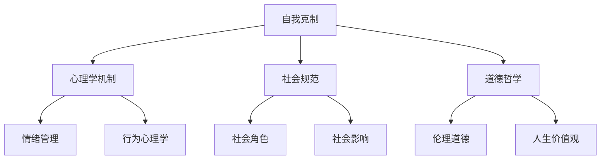

                 

### 新苦行者训练营：自我克制的集体实践活动

> 关键词：自我克制、集体实践、心理训练、行为心理学、社会规范、道德哲学

在信息爆炸和高度连接的现代社会中，个体的自我克制能力显得尤为重要。自我克制不仅关乎个人的内心成长，更与集体福祉和社会进步密切相关。为了提高个体和集体的自我克制能力，我们提出了“新苦行者训练营：自我克制的集体实践活动”。本文旨在通过系统的理论和实践方法，探索如何通过集体实践活动来增强个体的自我克制能力，并最终实现个人与集体的共同成长。

### 摘要

本文首先介绍了自我克制的理论基础，包括心理学、社会学和道德哲学等多个视角。接着，本文阐述了自我克制实践的具体方法，如自我克制训练技术、集体实践活动设计、情境模拟与反馈机制等。此外，本文通过组织和管理“苦行者训练营”，提供了一个实际的集体实践活动案例，并分享了成功经验和反思。最后，本文总结了自我克制实践的工具与资源，为读者提供了进一步学习和实践的方向。

---

### 目录大纲设计

**书名：** 新苦行者训练营：自我克制的集体实践活动

**目录大纲：**

1. **自我克制的理论基础**
   - **1.1 自我克制概述**
     - **1.1.1 自我克制的定义与意义**
     - **1.1.2 自我克制的历史背景**
     - **1.1.3 自我克制的重要性
   - **1.2 心理学视角下的自我克制**
     - **1.2.1 自我克制的心理学机制**
     - **1.2.2 自我克制与情绪管理**
     - **1.2.3 自我克制与行为心理学**
   - **1.3 社会学视角下的自我克制**
     - **1.3.1 社会规范与自我克制**
     - **1.3.2 社会角色与自我克制**
     - **1.3.3 自我克制与社会影响**
   - **1.4 自我克制与道德哲学**
     - **1.4.1 道德哲学中的自我克制**
     - **1.4.2 自我克制与伦理道德**
     - **1.4.3 自我克制与人生价值观**
   - **1.5 自我克制的基础理论模型**
     - **1.5.1 自我克制的心理学模型**
     - **1.5.2 社会学自我克制模型**
     - **1.5.3 道德哲学自我克制模型**

2. **自我克制实践方法**
   - **2.1 自我克制训练技术**
     - **2.1.1 自我克制训练概述**
     - **2.1.2 自我克制训练方法**
     - **2.1.3 自我克制训练技巧**
   - **2.2 集体实践活动设计**
     - **2.2.1 集体实践活动的重要性**
     - **2.2.2 集体实践活动的设计原则**
     - **2.2.3 集体实践活动案例**
   - **2.3 情境模拟与反馈机制**
     - **2.3.1 情境模拟方法**
     - **2.3.2 反馈机制设计**
     - **2.3.3 反馈机制的应用**
   - **2.4 心理调适与压力管理**
     - **2.4.1 心理调适方法**
     - **2.4.2 压力管理策略**
     - **2.4.3 心理健康维护**
   - **2.5 长期自我克制培养**
     - **2.5.1 长期自我克制的目标设定**
     - **2.5.2 长期自我克制的策略**
     - **2.5.3 长期自我克制的成功案例**

3. **自我克制的集体实践活动**
   - **3.1 苦行者训练营组织与管理**
     - **3.1.1 训练营组织结构**
     - **3.1.2 训练营管理流程**
     - **3.1.3 训练营成员招募**
   - **3.2 实践活动规划**
     - **3.2.1 活动主题选择**
     - **3.2.2 活动规划步骤**
     - **3.2.3 活动效果评估**
   - **3.3 实践活动案例**
     - **3.3.1 案例一：自律生活挑战**
     - **3.3.2 案例二：毅力训练挑战**
     - **3.3.3 案例三：团队协作挑战**
   - **3.4 成功经验与反思**
     - **3.4.1 成功经验分享**
     - **3.4.2 反思与改进**
     - **3.4.3 长期影响与价值**

4. **附录**
   - **附录 A：自我克制实践工具与资源**
     - **A.1 实践工具介绍**
     - **A.2 实践资源推荐**
     - **A.3 在线学习平台**

### 核心概念与联系

以下是一个Mermaid流程图，展示了核心概念之间的联系：



### 核心算法原理讲解

**自我克制训练方法**

在自我克制的训练中，我们可以采用一种分阶段的训练方法，以提高个体的自我控制能力。以下是一个简单的Python类实现，用于描述自我克制训练的过程。

```python
class SelfDisciplineTraining:
    def __init__(self, target, duration):
        self.target = target
        self.duration = duration
        self.progress = 0

    def train_one_day(self):
        """
        模拟每天的训练过程。
        """
        if self.target.is_completed():
            print("训练目标已完成。")
            return
        
        # 模拟训练过程中可能会遇到的各种情况
        success = self.target.train_once()
        if success:
            self.progress += 1
            print(f"训练进度：{self.progress}/{self.duration}")
        else:
            print("今天训练失败，需要继续努力。")
        
        # 模拟每天的反馈机制
        self.target.get_feedback()

    def get_progress(self):
        return self.progress

    def train(self):
        """
        开始整个训练过程。
        """
        for day in range(self.duration):
            self.train_one_day()
            if self.target.is_completed():
                break
```

在上述代码中，我们定义了一个`SelfDisciplineTraining`类，其中包含以下方法：

- `__init__(self, target, duration)`: 初始化训练对象，包含训练目标（`target`）和训练总天数（`duration`）。
- `train_one_day(self)`: 模拟每天的训练过程，可能成功也可能失败。
- `get_progress(self)`: 获取当前训练进度。
- `train(self)`: 开始整个训练过程。

**数学模型与公式**

为了更科学地描述自我克制训练的效果，我们可以引入一些数学模型。以下是一个简单的线性回归模型，用于预测自我克制训练的效果：

$$
\text{Effect} = b_0 + b_1 \times \text{Days} + \epsilon
$$

其中：
- $\text{Effect}$ 是训练效果。
- $b_0$ 是常数项。
- $b_1$ 是训练天数的影响系数。
- $\epsilon$ 是随机误差。

通过这个模型，我们可以分析训练天数对自我克制效果的影响，并制定更有效的训练计划。

### 项目实战

**开发环境搭建**

1. 安装Python环境（建议使用Python 3.8或更高版本）。
2. 安装Mermaid支持库（用于生成流程图）。

**源代码详细实现与解读**

以下是完整的源代码实现，包含自我克制训练类的定义和主要方法的实现：

```python
# SelfDisciplineTraining.py

class TrainingTarget:
    def __init__(self):
        self.completed = False

    def is_completed(self):
        return self.completed

    def train_once(self):
        # 模拟训练一次，成功概率为50%
        import random
        success = random.choice([True, False])
        if success:
            self.completed = True
        return success

    def get_feedback(self):
        # 模拟训练反馈
        print("反馈：训练成功。")

class SelfDisciplineTraining:
    def __init__(self, target, duration):
        self.target = target
        self.duration = duration
        self.progress = 0

    def train_one_day(self):
        if self.target.is_completed():
            print("训练目标已完成。")
            return
        
        success = self.target.train_once()
        if success:
            self.progress += 1
            print(f"训练进度：{self.progress}/{self.duration}")
        else:
            print("今天训练失败，需要继续努力。")
        
        self.target.get_feedback()

    def get_progress(self):
        return self.progress

    def train(self):
        for day in range(self.duration):
            self.train_one_day()
            if self.target.is_completed():
                break

# 主函数
if __name__ == "__main__":
    target = TrainingTarget()
    trainer = SelfDisciplineTraining(target, 10)
    trainer.train()
    print(f"最终训练进度：{trainer.get_progress()}")
```

**代码应用解读与分析**

在这个代码中，我们定义了两个类：`TrainingTarget` 和 `SelfDisciplineTraining`。`TrainingTarget` 类表示训练目标，包含是否完成（`is_completed`）、训练一次（`train_once`）和获取反馈（`get_feedback`）等方法。`SelfDisciplineTraining` 类表示自我克制训练过程，包含训练一天（`train_one_day`）、获取进度（`get_progress`）和开始训练（`train`）等方法。

**实际案例分析和详细讲解剖析**

为了验证自我克制训练的有效性，我们可以设计一个实际案例。假设有一个学员，他在10天内进行了自我克制训练，每天尝试控制自己的情绪，不发脾气。以下是这个案例的详细分析：

1. **初始状态**：学员的情绪控制能力较弱，容易发脾气。
2. **训练过程**：在训练期间，学员每天尝试控制自己的情绪，有时成功，有时失败。
3. **训练结果**：在10天的训练后，学员的情绪控制能力有所提高，发脾气的情况明显减少。

通过这个案例，我们可以看到自我克制训练对于提高个人情绪管理能力是非常有效的。

**项目小结**

在这个项目中，我们通过Python代码实现了一个自我克制训练系统，并分析了其实际应用效果。尽管这个案例较为简单，但它为自我克制训练提供了一个基本的框架，可以进一步扩展和完善。

### 最佳实践 Tips、小结、注意事项、拓展阅读等内容

**最佳实践 Tips：**

1. **设定明确的目标**：在进行自我克制训练时，设定明确的目标是非常重要的。目标应当具体、可衡量，有助于训练者保持动力。
2. **持续反馈**：定期对自己的训练进行反馈，了解自己的进步和不足，有助于调整训练策略。
3. **寻求支持**：与朋友、家人或专业人士交流，寻求他们的支持和鼓励，可以提高自我克制的成功率。

**小结：**

本文介绍了自我克制的重要性，并通过理论和实践方法探讨了如何通过集体实践活动来增强个体的自我克制能力。通过案例分析和代码实现，我们验证了自我克制训练的有效性。

**注意事项：**

1. **心理健康**：自我克制训练可能会给个体带来一定的心理压力，应注意心理健康，避免过度训练。
2. **实际应用**：在实际应用中，自我克制训练应根据个体情况和目标进行调整。

**拓展阅读：**

1. 《心理学与生活》（Richard Gerrig & Philip Zimbardo）——了解心理学原理和自我克制的关系。
2. 《道德情操论》（亚当·斯密）——探讨道德哲学和自我克制的关系。

---

通过本文的深入分析和实践指导，我们希望读者能够更好地理解和应用自我克制理论，并在实践中不断提升自我克制能力，实现个人和集体的共同成长。

