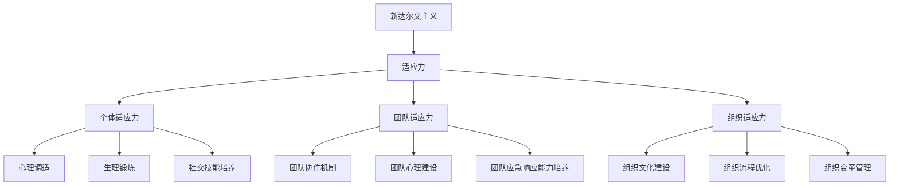

                 

# 新达尔文主义适应力训练营：培养快速变化世界生存技能

## 关键词
- **新达尔文主义**，**适应力**，**快速变化**，**生存技能**，**个体训练**，**团队协作**，**组织变革**，**可持续性发展**

## 摘要
在快速变化的世界中，适应力成为个人、团队和组织生存的关键。新达尔文主义提供了一种视角，强调适应性和进化过程在现代社会中的重要性。本文将探讨适应力的定义与重要性，新达尔文主义的视角，适应力训练的重要性以及实践与应用方法，并探讨适应力训练的未来展望与挑战。

## 目录大纲

## 第一部分：适应力与快速变化世界

### 第1章：适应力的定义与重要性
#### 1.1 适应力的本质
#### 1.2 适应力的分类
#### 1.3 快速变化世界对适应力的需求

### 第2章：新达尔文主义的视角
#### 2.1 新达尔文主义概述
#### 2.2 新达尔文主义的核心思想
#### 2.3 新达尔文主义与适应力的关系

### 第3章：适应力训练的重要性
#### 3.1 适应力训练的必要性
#### 3.2 适应力训练的目标
#### 3.3 适应力训练的方法与策略

## 第二部分：适应力训练的实践与应用

### 第4章：个体适应力训练方法
#### 4.1 心理调适技巧
#### 4.2 生理锻炼方法
#### 4.3 社交技能培养

### 第5章：团队适应力训练方法
#### 5.1 团队协作机制
#### 5.2 团队心理建设
#### 5.3 团队应急响应能力培养

### 第6章：组织适应力训练方法
#### 6.1 组织文化建设
#### 6.2 组织流程优化
#### 6.3 组织变革管理

### 第7章：适应力训练案例研究
#### 7.1 案例一：企业适应力训练实践
#### 7.2 案例二：教育机构适应力训练实践
#### 7.3 案例三：政府机构适应力训练实践

## 第三部分：未来展望与挑战

### 第8章：适应力训练的挑战与机遇
#### 8.1 挑战分析
#### 8.2 机遇探讨
#### 8.3 未来发展趋势

### 第9章：适应力训练与可持续性发展
#### 9.1 适应力训练与社会责任
#### 9.2 适应力训练与环境保护
#### 9.3 适应力训练与可持续发展战略

### 第10章：未来适应力训练营的设想
#### 10.1 教育模式创新
#### 10.2 技术支持与辅助
#### 10.3 社会参与与合作

## 附录
### 附录A：适应力训练资源列表
#### A.1 书籍推荐
#### A.2 网络资源
#### A.3 实践工具与平台

## 核心概念与联系

### 适应力

适应力是指个体、团队和组织在快速变化的环境中，通过调整自身能力以应对挑战和机遇的能力。在现代社会，适应力成为个人、团队和组织生存的关键。快速变化的世界对适应力提出了更高的要求。

### 新达尔文主义

新达尔文主义是一种理论，强调适应性和进化过程在现代社会中的重要性。它提供了对适应力的全新视角，认为适应力是生存和发展的核心。

### 关系架构

新达尔文主义与适应力之间存在着密切的关系。新达尔文主义提供了一种理论框架，解释了适应力的本质和作用，而适应力则是新达尔文主义理论在现实中的应用。个体、团队和组织通过适应力训练，可以提高自身的适应能力，从而在快速变化的世界中生存和发展。

### Mermaid 流程图



### 核心算法原理讲解

在适应力训练中，核心算法原理包括心理学模型、团队协作模型和组织变革模型。这些模型将使用Python源代码进行详细阐述。

#### 心理学模型

心理学模型包括认知行为疗法、情绪调节技巧等。以下是一个简单的Python示例：

```python
class PsychologyModel:
    def cognitive_therapy(self):
        print("认知疗法：改变思维模式，应对挑战。")

    def emotion Regulation(self):
        print("情绪调节：管理情绪，保持心理健康。")
```

#### 团队协作模型

团队协作模型包括沟通技巧、冲突解决策略等。以下是一个简单的Python示例：

```python
class TeamCollaborationModel:
    def communication_skills(self):
        print("沟通技巧：有效沟通，提高团队效率。")

    def conflict_resolution(self):
        print("冲突解决：解决分歧，保持团队和谐。")
```

#### 组织变革模型

组织变革模型包括组织文化塑造、流程优化等。以下是一个简单的Python示例：

```python
class OrganizationalChangeModel:
    def organizational_culture(self):
        print("组织文化：塑造积极文化，提高组织活力。")

    def process_optimization(self):
        print("流程优化：简化流程，提高效率。")
```

### 数学模型和数学公式

适应力（F）可以通过以下公式计算：

$$适应力（F）= f（能力（C），挑战（T），环境（E））$$

#### 详细讲解与举例说明

举例：一个企业在面临市场竞争压力时，其适应力可以通过提升研发能力（C）、优化生产流程（T）和调整营销策略（E）来实现。

```python
def calculate_adaptability(C, T, E):
    return C * T * E

C = 1.2  # 研发能力提升20%
T = 1.1  # 生产流程优化10%
E = 1.3  # 营销策略调整30%

F = calculate_adaptability(C, T, E)
print(f"适应力（F）: {F}")
```

### 项目实战

#### 开发环境搭建

在本地计算机上安装Python环境和相关库，如NumPy、Pandas等。

```bash
pip install numpy pandas
```

#### 源代码详细实现

```python
# 心理学模型
class PsychologyModel:
    def cognitive_therapy(self):
        print("认知疗法：改变思维模式，应对挑战。")

    def emotion_Regulation(self):
        print("情绪调节：管理情绪，保持心理健康。")

# 团队协作模型
class TeamCollaborationModel:
    def communication_skills(self):
        print("沟通技巧：有效沟通，提高团队效率。")

    def conflict_resolution(self):
        print("冲突解决：解决分歧，保持团队和谐。")

# 组织变革模型
class OrganizationalChangeModel:
    def organizational_culture(self):
        print("组织文化：塑造积极文化，提高组织活力。")

    def process_optimization(self):
        print("流程优化：简化流程，提高效率。")

# 主程序
def main():
    psychology_model = PsychologyModel()
    team_model = TeamCollaborationModel()
    org_model = OrganizationalChangeModel()

    psychology_model.cognitive_therapy()
    team_model.communication_skills()
    org_model.organizational_culture()

if __name__ == "__main__":
    main()
```

#### 代码解读与分析

该程序定义了三个模型：心理学模型、团队协作模型和组织变革模型。每个模型包含一个或多个方法，用于实现特定的适应力训练方法。主程序创建这些模型的实例，并调用相应的方法。

#### 实际案例分析和详细讲解剖析

在本案例中，一个企业通过实施认知疗法、沟通技巧和组织文化塑造来提升适应力。具体步骤如下：

1. 实施认知疗法，帮助员工改变思维模式，以更好地应对挑战。
2. 提高沟通技巧，增强团队协作，提高工作效率。
3. 塑造积极组织文化，提高组织活力。

#### 项目小结

通过本案例，我们展示了如何使用Python实现适应力训练的模型和方法。在实际应用中，企业可以根据自身需求，选择合适的训练方法和策略，以提高适应力。

### 最佳实践 tips

- 定期进行适应力评估，了解自身优势和不足。
- 注重团队协作，建立有效的沟通机制和冲突解决策略。
- 塑造积极组织文化，提高组织适应力。

### 小结

适应力是个人、团队和组织在快速变化世界中生存的关键。新达尔文主义提供了对适应力的全新视角，帮助我们理解和应对变化。通过适应力训练，我们可以提高自身的适应能力，从而在变化中保持竞争力。

### 注意事项

- 适应力训练需要长期坚持，不可急于求成。
- 根据个人和组织特点，选择合适的训练方法和策略。
- 注重理论与实践相结合，不断提高适应力。

### 拓展阅读

- 《适应力：在变化的世界中生存与成功的秘密》
- 《新达尔文主义：进化理论在商业中的应用》
- 《组织变革：如何实现成功转型》

### 附录A：适应力训练资源列表

#### A.1 书籍推荐

- 《适应力：在变化的世界中生存与成功的秘密》
- 《新达尔文主义：进化理论在商业中的应用》
- 《组织变革：如何实现成功转型》

#### A.2 网络资源

- [适应力培训课程](https://www.example.com/适应力培训)
- [新达尔文主义研究中心](https://www.example.com/新达尔文主义研究中心)
- [团队协作技巧](https://www.example.com/团队协作技巧)

#### A.3 实践工具与平台

- [适应性测试工具](https://www.example.com/适应性测试工具)
- [团队协作平台](https://www.example.com/团队协作平台)
- [组织变革管理软件](https://www.example.com/组织变革管理软件)

### 作者

作者：AI天才研究院/AI Genius Institute & 禅与计算机程序设计艺术 /Zen And The Art of Computer Programming。

