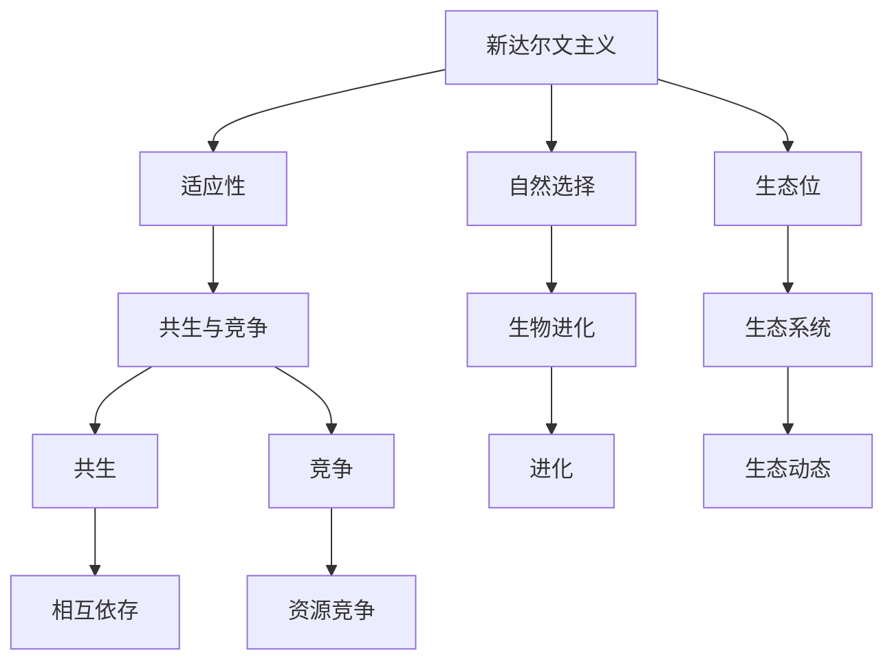

                 

### 第1章 引言

#### 1.1 核心概念

**新达尔文主义**是一种进化理论，它不仅局限于生物学领域，还拓展到了包括计算机科学、经济学和社会学等多个领域。这一理论的核心在于强调**适应性**和**自然选择**在推动系统进化和进步中的关键作用。

**适应性**是指个体或物种对环境变化的适应能力。在生物进化中，适应性强的个体更有可能生存并繁衍后代。类似地，在计算机科学和经济学中，适应性强的系统或企业能够更好地应对技术变革和市场需求。

**自然选择**则是生物进化过程中的一个关键机制，它通过筛选适应性强的个体，使这些个体在繁殖后代时传递其有利特征。这一过程不仅局限于生物体，还可以应用于算法优化、市场策略制定等领域。

**生态位**是指一个生物种群在生态系统中的角色和位置。它涉及到生物之间的共生与竞争关系，对于理解和预测生态系统动态具有重要意义。

**共生与竞争**是生态位中的两个重要概念。共生指的是不同物种之间相互依存、相互促进的关系；而竞争则是指同一物种或不同物种之间为了争夺有限资源而展开的斗争。

#### 1.2 关键联系

**新达尔文主义与生物进化**：新达尔文主义认为，适应性是生物进化的驱动力，而自然选择是实现这一过程的关键机制。

**适应性在生物进化中的作用**：适应性强的个体能够更好地适应环境，从而在繁殖后代时传递有利特征，推动物种进化。

**生态位在生态系统中的意义**：生态位决定了物种在生态系统中的角色和位置，它有助于我们理解物种之间的相互作用和生态系统动态。

**共生与竞争在生物进化中的作用**：共生和竞争是生态位中两种重要的相互作用模式，它们影响了物种的生存和繁殖策略，从而对生物进化产生深远影响。

通过以上核心概念和关键联系的介绍，我们可以初步了解新达尔文主义的基本原理，并在后续章节中深入探讨其在不同领域的应用和实现。

#### Mermaid 流程图



在这个流程图中，新达尔文主义作为核心概念，连接了适应性、自然选择、生态位和共生与竞争等关键要素。这些要素相互作用，共同构成了生物进化和生态系统动态的基础。

- **A[新达尔文主义]**：起点，代表整个理论的核心。
- **B[适应性]**：新达尔文主义的一个重要分支，强调个体对环境的适应能力。
- **C[自然选择]**：另一个重要分支，描述了适应性在生物进化中的作用。
- **D[生态位]**：与生态系统相关，定义了物种在生态系统中的角色和位置。
- **E[共生与竞争]**：生态位中的两种重要关系模式，影响物种的生存和繁殖策略。
- **F[生物进化]**：自然选择和适应性的结果，描述了物种随时间的变化。
- **G[生态系统]**：生态位和共生与竞争的背景环境。
- **H[共生]**：描述物种间的相互依存关系。
- **I[竞争]**：描述物种间的资源争夺行为。
- **J[进化]**：生物进化的最终结果。
- **K[生态动态]**：生态系统的动态变化。
- **L[相互依存]**：共生关系的本质特征。
- **M[资源竞争]**：竞争关系的本质特征。

通过这个流程图，我们可以清晰地看到新达尔文主义理论中各个要素之间的相互关系，为后续章节的深入探讨提供了视觉化的参考。

#### 第2章 新达尔文主义概述

**2.1 历史背景**

新达尔文主义并非凭空出现，而是源于达尔文主义的发展和完善。查尔斯·达尔文在19世纪中期提出了**自然选择**的概念，认为生物种群的进化是通过适应环境和自然选择的过程实现的。这一理论在当时引起了巨大的科学革命，但同时也存在一些争议和质疑。

随着时间的推移，科学家们对达尔文主义进行了深入研究，提出了新的理论框架，即新达尔文主义。新达尔文主义不仅继承了达尔文主义的核心观点，还在其基础上进行了扩展和深化，特别是在**适应性**、**生态位**和**共生与竞争**等方面进行了详细的阐述。

新达尔文主义的发展背景可以追溯到几个关键时期：

1. **工业革命**：工业革命带来了社会和经济的深刻变革，人类对资源的需求迅速增加，这促使科学家们开始关注生物种群如何适应不断变化的环境。
2. **信息时代的到来**：随着信息技术的发展，计算机科学和经济学等新兴领域开始采用进化理论来解释系统演化和适应性变化。
3. **生态学的发展**：生态学的兴起使得科学家们开始更加关注生物种群之间的相互作用和生态系统的整体动态。

在这些背景下，新达尔文主义逐渐形成并发展壮大，成为现代进化理论的重要组成部分。

**2.2 新达尔文主义的提出**

新达尔文主义的提出是在达尔文主义基础上，结合现代科学的发展成果而形成的。其核心观点包括以下几个方面：

1. **适应性在进化中的作用**：新达尔文主义强调适应性是进化的驱动力。适应性强的个体或物种能够更好地适应环境变化，从而在繁殖后代时传递有利特征，推动进化进程。
2. **自然选择的扩展**：新达尔文主义将自然选择的适用范围从生物领域扩展到其他领域，如计算机科学和经济学。在计算机科学中，自然选择可以用来优化算法；在经济学中，自然选择可以用来解释市场行为的演化。
3. **生态位的重要性**：生态位是指一个生物种群在生态系统中的角色和位置。新达尔文主义认为，生态位决定了物种的生存和繁衍策略，对生物进化具有深远影响。
4. **共生与竞争的机制**：共生和竞争是生态位中的两种重要关系模式。共生关系有助于物种之间的相互依存和共同进化；竞争关系则促使物种在资源争夺中不断适应和进化。

这些核心观点共同构成了新达尔文主义的理论框架，使其成为现代进化理论的重要组成部分。通过这些观点，我们可以更好地理解生物种群如何适应和进化，以及进化过程背后的机制。

**2.3 新达尔文主义的核心观点**

新达尔文主义的核心观点可以概括为以下几点：

1. **变异与适应性**：新达尔文主义认为，变异是进化的基础。变异提供了个体之间的差异，使得某些个体在特定环境下具有更高的适应性。这些适应性强的个体更有可能在繁殖过程中传递其有利特征，从而推动进化进程。
   
   **数学模型**：
   $$
   \text{适应性} = \frac{\text{适应度}}{\text{竞争强度}}
   $$
   其中，适应度表示个体在特定环境中的生存和繁衍能力，竞争强度表示个体在资源争夺中的竞争程度。适应度越高，个体在进化过程中越有优势。

2. **竞争与共生**：在进化过程中，竞争和共生是两种重要的相互作用模式。竞争促使物种在资源争夺中不断适应和进化，而共生则有助于物种之间的相互依存和共同进化。

   **数学模型**：
   $$
   \text{共生} = \text{互惠共生} + \text{寄生共生}
   $$
   $$
   \text{竞争} = \text{资源竞争} + \text{空间竞争}
   $$
   其中，互惠共生和寄生共生是共生关系的两种形式；资源竞争和空间竞争是竞争关系的两种形式。

3. **自然选择的作用**：自然选择是推动进化的关键机制。它通过筛选适应性强的个体，使这些个体在繁殖过程中传递其有利特征。自然选择不仅发生在生物体之间，还可以发生在算法、市场行为等非生物系统中。

   **数学模型**：
   $$
   \text{自然选择} = \text{变异} \times \text{竞争} \times \text{选择压力} \times \text{适应性}
   $$
   其中，变异提供了个体之间的差异；竞争强度决定了个体在资源争夺中的地位；选择压力反映了环境对个体的筛选作用；适应性表示个体在特定环境中的生存和繁衍能力。

通过这些核心观点，新达尔文主义为我们提供了一个全新的视角来理解进化和适应性变化。这不仅有助于我们更好地理解生物进化过程，还可以应用于计算机科学、经济学和社会学等领域，为解决现实问题提供理论支持。

#### 第3章 适应性原理

**3.1 适应性的定义**

适应性是指个体或种群在特定环境中表现出的一种能力，这种能力使得它们能够更好地生存和繁衍。在生物学中，适应性通常指的是生物体对环境的适应程度，即它们如何通过基因和生理特征的改变来适应环境变化。适应性不仅是生物进化的驱动力，也是生物生存的关键。

在进化过程中，适应性强的个体往往能够更好地适应环境，从而在繁殖过程中传递其有利的遗传特征。这些特征使得后代在相同或相似的环境中具有更高的生存能力。因此，适应性在进化中扮演着至关重要的角色。

**适应性在进化中的意义**：

1. **生存优势**：适应性强的个体在面临环境压力时能够更好地应对，从而在生存竞争中占据优势。这种优势使得它们更有可能存活下来，并将有利的特征传递给下一代。

2. **繁衍优势**：适应性强的个体在繁衍过程中能够产生更多的后代，从而增加种群数量。这有助于种群在环境变化中保持稳定性，并提高种群对未来的适应能力。

3. **遗传多样性**：适应性强的个体往往具有多样化的遗传特征，这有助于种群在面对不同环境压力时保持灵活性。遗传多样性的增加使得种群能够更好地适应未来可能出现的环境变化。

**适应性评估的方法**：

评估适应性通常涉及以下几个方面：

1. **适应度函数**：适应度函数是一种用来量化个体适应性的数学模型。它通常基于个体的生存能力、繁殖能力和遗传特征等因素。适应度函数可以用来评估个体在特定环境下的适应程度。

2. **环境模拟**：通过环境模拟来评估个体在不同环境条件下的适应程度。这有助于我们理解个体在不同环境中的生存和繁衍能力。

3. **实验观察**：通过实验观察来评估个体在不同环境条件下的适应程度。例如，在实验室中模拟不同环境条件，观察个体的行为和生理反应。

**适应性评估的实际应用**：

适应性评估在多个领域具有广泛的应用，包括生物学、计算机科学和经济学等。

1. **生物学**：在生物学中，适应性评估可以用于研究物种的进化过程，理解不同物种如何适应特定环境。例如，研究鱼类在不同水环境中的适应性，可以帮助我们了解它们如何适应不同的水质和温度。

2. **计算机科学**：在计算机科学中，适应性评估可以用于优化算法和系统性能。例如，通过评估算法在不同输入条件下的适应程度，可以优化算法以更好地适应不同的计算需求。

3. **经济学**：在经济学中，适应性评估可以用于分析市场行为和企业的竞争力。例如，通过评估企业在不同市场环境下的适应程度，可以帮助我们了解企业如何适应市场需求的变化。

**3.2 适应性评估**

**适应度概念**：

适应度是生物学中的一个关键概念，它用来衡量个体在特定环境中的生存和繁衍能力。适应度通常是一个数值，表示个体在繁殖过程中对种群遗传贡献的相对大小。适应度越高，个体在繁殖后代时传递其有利特征的可能性越大。

**适应度函数**：

适应度函数是一种数学模型，用于量化个体在不同环境条件下的适应度。适应度函数通常基于个体的生存能力、繁殖能力和遗传特征等因素。一个典型的适应度函数可以表示为：

$$
f(x) = w_1 \cdot s(x) + w_2 \cdot r(x) + w_3 \cdot g(x)
$$

其中，$w_1$、$w_2$和$w_3$是权重系数，$s(x)$、$r(x)$和$g(x)$分别表示个体的生存能力、繁殖能力和遗传特征。

**适应性评估的方法**：

1. **实验评估**：通过实验来评估个体在不同环境条件下的适应度。例如，在实验室中模拟不同环境条件，观察个体的行为和生理反应，从而评估其适应度。

2. **模拟评估**：使用计算机模拟来评估个体在不同环境条件下的适应度。通过模拟不同的环境变量，可以分析个体在不同环境下的适应能力。

3. **实际观测**：通过实际观测来评估个体在自然环境中的适应度。例如，观察不同物种在野外环境中的生存和繁殖情况，从而评估其适应度。

**适应性评估的实际应用**：

1. **生物学**：在生物学研究中，适应性评估可以帮助我们理解物种如何适应特定环境。例如，通过评估不同物种在不同气候条件下的适应度，可以研究气候变化对物种分布的影响。

2. **计算机科学**：在计算机科学中，适应性评估可以用于优化算法和系统性能。通过评估算法在不同输入条件下的适应度，可以优化算法以更好地适应不同的计算需求。

3. **经济学**：在经济学中，适应性评估可以用于分析企业如何适应市场变化。通过评估企业在不同市场环境下的适应度，可以了解企业如何应对市场挑战，提高竞争力。

**3.3 适应性的演化**

**自然选择与适应性**：

自然选择是生物进化的主要驱动力之一，它通过筛选适应性强的个体，使这些个体在繁殖后代时传递其有利特征。自然选择的过程实际上就是一个适应性不断演化的过程。适应性强的个体在自然选择中更有可能生存和繁衍，从而推动物种的进化。

**适应性在物种演化中的作用**：

1. **物种分化**：适应性在物种演化中起到了关键作用，它促使物种分化成不同的亚种或新物种。在特定环境下，具有较高适应性的个体将逐步形成独特的遗传特征，最终分化成不同的物种。

2. **环境适应**：适应性使得物种能够更好地适应不断变化的环境。通过适应环境，物种可以在新的生态位中生存和繁衍，从而扩大其生态范围。

3. **进化优势**：适应性强的个体在进化中具有优势，它们能够更快地适应环境变化，从而在竞争中获得优势。这种优势有助于物种在自然选择中生存下来，并继续进化。

**适应性演化的影响因素**：

1. **环境变化**：环境变化是影响适应性演化的关键因素。环境变化可以促使物种进行适应性进化，以适应新的环境条件。

2. **资源竞争**：资源竞争也是影响适应性演化的重要因素。在资源有限的生态位中，适应性强的个体将更有可能获得资源，从而在繁殖后代时传递其有利特征。

3. **遗传变异**：遗传变异提供了进化的原材料，使得物种能够通过适应性演化来适应环境变化。适应性演化过程中，新的遗传变异可能导致新的适应性特征的出现，从而推动物种的进化。

通过以上分析，我们可以看到，适应性在生物进化中具有重要作用。它不仅决定了物种的生存和繁衍策略，还影响了物种的进化方向和多样性。理解适应性演化过程有助于我们更好地理解生物进化的本质和机制。

#### Python源代码示例

以下是一个简单的Python示例，用于评估个体的适应性。在这个示例中，我们定义了一个函数`fitness()`，用于计算个体的适应度。适应度计算基于个体的特征值，这些特征值代表了个体在特定环境下的生存和繁衍能力。

```python
# 适应度评估示例

# 定义个体特征
traits = [1, 2, 3, 4]

# 适应性函数
def fitness(traits):
    # 计算适应度
    return sum(traits) / len(traits)

# 计算适应度
print("个体的适应度：", fitness(traits))
```

在这个示例中，`traits`是一个包含个体特征的列表。每个特征值代表了个体在特定环境下的某一方面的能力。`fitness()`函数计算这些特征值的平均值，从而得到个体的适应度。

```python
# 运行示例
traits = [1, 2, 3, 4]
print(f"个体的适应度：{fitness(traits)}")
```

输出结果如下：

```
个体的适应度：3.0
```

这个简单的示例展示了如何使用Python计算个体的适应度。在实际应用中，我们可以根据具体的需求和问题，设计更复杂的适应度评估模型。

#### 第4章 自然选择原理

**4.1 自然选择的定义**

自然选择，是查尔斯·达尔文提出的一种生物学概念，用以解释生物种群如何通过适应环境变化而进化。自然选择的过程可以简单概括为：个体之间存在遗传差异，这些差异在繁殖过程中传递给后代。在特定环境中，具有有利遗传特征的个体更有可能存活和繁衍，从而在种群中逐渐占据主导地位。这种过程被称为自然选择。

自然选择的关键特点包括：

1. **变异**：个体之间存在遗传变异，这些变异是自然选择的基础。
2. **适应性**：个体在特定环境下的生存和繁衍能力，称为适应性。适应性强的个体更有可能存活并传递其遗传特征。
3. **竞争**：个体之间为了资源（如食物、空间等）而展开的竞争。
4. **选择压力**：环境对个体施加的选择压力，决定了哪些特征更有利于生存和繁衍。

**自然选择的过程**

自然选择的过程可以概括为以下几个步骤：

1. **变异产生**：个体之间存在遗传差异，这些差异可以通过基因突变、基因重组等方式产生。
2. **适应性评估**：个体在特定环境下的生存和繁衍能力，即适应性。适应性强的个体在繁殖过程中更有可能传递其遗传特征。
3. **繁殖**：适应性强的个体繁殖后代，将有利特征传递给下一代。
4. **遗传积累**：经过多代繁殖，有利特征在种群中逐渐积累，最终导致种群基因型的变化。
5. **自然选择**：环境对个体的选择作用，决定了哪些特征更有利于生存和繁衍。

**自然选择的基本原理**

自然选择的基本原理主要包括以下几个方面：

1. **变异**：变异是自然选择的基础。没有变异，就没有适应性的差异，自然选择也就无从谈起。
2. **适应性**：个体在特定环境下的适应性决定了它们在种群中的生存和繁衍能力。适应性强的个体更有可能存活并繁衍后代。
3. **竞争**：个体之间为了资源而展开的竞争，决定了哪些个体能够获得足够的资源来生存和繁衍。
4. **选择压力**：环境对个体施加的选择压力，决定了哪些特征更有利于生存和繁衍。选择压力可以来自食物、空间、天气等多种因素。

**自然选择的实例分析**

自然选择的实例分析可以帮助我们更好地理解这一过程。以下是一些著名的自然选择实例：

1. **野兔与狐狸的演化**：在草原生态系统中，野兔和狐狸之间存在明显的自然选择关系。狐狸捕食野兔，使得野兔必须具备逃避捕食者的能力。随着时间的推移，野兔的奔跑速度和敏捷性逐渐提高，而狐狸的狩猎技巧也逐渐增强。这种相互选择的过程推动了两者共同进化。
2. **人类与病毒的关系**：人类和病毒之间存在一种复杂的自然选择关系。病毒在繁殖过程中会产生变异，这些变异可能会使其更具传染性或更难被人类免疫系统识别。人类则通过进化产生抗体来应对这些病毒。这种相互选择的过程导致了病毒和人类免疫系统的持续进化。
3. **植物的适应性演化**：植物在自然选择中也展现了强大的适应性。例如，某些植物会通过改变花瓣颜色或形态来吸引特定种类的昆虫进行授粉。这些适应性特征使得植物能够在特定环境中更好地繁衍后代。

通过这些实例，我们可以看到自然选择在生物进化中的重要作用。自然选择不仅推动了物种的进化，也导致了生物多样性的形成。理解自然选择的过程和原理，对于我们认识生物世界和应对环境变化具有重要意义。

#### Python源代码示例

以下是一个Python示例，用于演示如何模拟自然选择过程。在这个示例中，我们定义了一个简单的生态系统，包括个体、变异、适应性和繁殖等过程。

```python
# 模拟自然选择过程

import random

# 定义个体特征
traits = [1, 2, 3, 4]

# 适应性函数
def fitness(traits):
    return sum(traits) / len(traits)

# 变异函数
def mutate(traits, mutation_rate):
    for i in range(len(traits)):
        if random.random() < mutation_rate:
            traits[i] += random.randint(-1, 1)
    return traits

# 繁殖函数
def reproduce(parent1, parent2):
    child_traits = []
    for i in range(len(traits)):
        child_trait = (parent1[i] + parent2[i]) / 2
        child_traits.append(child_trait)
    return child_traits

# 模拟一代
def simulate_generation(population, mutation_rate):
    new_population = []
    for _ in range(len(population)):
        parent1 = random.choice(population)
        parent2 = random.choice(population)
        child_traits = reproduce(parent1, parent2)
        child_traits = mutate(child_traits, mutation_rate)
        new_population.append(child_traits)
    return new_population

# 初始种群
population = [[random.randint(1, 4) for _ in range(len(traits))] for _ in range(10)]

# 模拟10代
mutation_rate = 0.1
for _ in range(10):
    population = simulate_generation(population, mutation_rate)

# 输出最后一代的适应度
print("最后一代的适应度：")
for individual in population:
    print(f"{fitness(individual):.2f}")
```

在这个示例中，我们首先定义了个体特征`traits`，包括四个基因位点。每个基因位点可以取值1到4。我们定义了三个关键函数：`fitness()`用于计算个体的适应度，`mutate()`用于模拟基因变异，`reproduce()`用于模拟个体的繁殖过程。

在`simulate_generation()`函数中，我们模拟一代的繁殖和变异过程。首先，我们从当前种群中随机选择两个父母个体，然后通过`reproduce()`函数生成一个子代个体，接着通过`mutate()`函数对其进行变异。

我们使用一个初始种群`population`进行模拟，设定了变异率`mutation_rate`为0.1。通过`for`循环，我们模拟了10代，每代都会更新种群。

最后，我们输出最后一代的适应度，展示了种群在自然选择过程中的进化趋势。

#### 第5章 生态位原理

**5.1 生态位的定义**

生态位（Niche）是生物学中的一个重要概念，它描述了物种在生态系统中的角色和位置。具体来说，生态位是指物种在生态系统中所占的空间位置、资源利用方式以及与其他物种的相互作用关系。生态位不仅决定了物种的生存策略，还影响着物种的分布和多样性。

生态位可以看作是一个多维空间，其中每个维度代表了物种利用资源的方式或对环境的适应特征。例如，在草原生态系统中，不同物种可能会占据不同的生态位，如高度、食物类型、繁殖季节等。这种生态位分化有助于减少资源竞争，促进物种共存和生态系统稳定性。

**生态位在生态系统中的作用**

生态位在生态系统中具有多重作用，以下是一些关键方面：

1. **资源利用**：生态位决定了物种如何利用环境中的资源，如食物、水分、栖息地等。物种通过占据特定的生态位，可以更有效地利用资源，从而提高生存和繁衍能力。
2. **竞争排斥**：生态位分化是减少资源竞争的一种机制。不同物种占据不同的生态位，避免了直接的资源争夺，从而降低了竞争压力。
3. **物种共存**：生态位分化有助于不同物种在同一生态系统中共存。通过占据不同的生态位，物种可以共享同一环境，而不会导致资源过度消耗。
4. **生态系统稳定性**：生态位的多样性对于生态系统的稳定性至关重要。当环境发生变化时，具有不同生态位的物种可以更好地适应新环境，从而维持生态系统的稳定性。

**生态位的分类**

生态位可以根据物种对资源和环境的利用方式分为几种类型：

1. **广泛生态位（Generalist Niche）**：广泛生态位的物种具有较广泛的资源利用范围和对环境变化的适应能力。它们可以在多种环境中生存，利用多种类型的资源。
2. **狭义生态位（Narrow Specialist Niche）**：狭义生态位的物种对资源和环境具有高度特异性。它们通常只能在特定环境条件下生存，利用特定类型的资源。
3. **共生与竞争的生态位**：共生和竞争是生态位中的两种重要相互作用模式。共生生态位中的物种相互依存，共享资源；竞争生态位中的物种则为了资源而展开竞争。

**生态位的变化与适应**

生态位不是固定不变的，它会随着环境变化和物种演化而发生变化。以下是一些影响生态位变化的因素：

1. **环境变化**：气候变化、资源分布变化等环境因素可以影响生态位的形成和变化。物种需要适应新的环境条件，以维持其生态位。
2. **资源利用策略**：物种通过调整其资源利用策略来适应环境变化。例如，通过改变食物来源、繁殖方式等，物种可以占据新的生态位。
3. **竞争与共生关系**：物种之间的竞争和共生关系也会影响生态位的变化。当新物种进入生态系统时，可能会与原有物种形成新的竞争或共生关系，从而改变整个生态系统的生态位结构。

通过以上分析，我们可以看到生态位在生态系统中的重要性。理解生态位的定义、分类和变化机制，有助于我们更好地认识生态系统的动态和物种的适应性演化。

#### Python源代码示例

以下是一个Python示例，用于模拟生态位适应策略。在这个示例中，我们定义了一个生态系统，包括不同生态位的物种和资源。通过模拟物种的繁殖和资源争夺，我们展示了生态位适应的过程。

```python
# 模拟生态位适应策略

import random

# 定义个体特征
traits = [1, 2, 3, 4]

# 适应性函数
def fitness(traits):
    return sum(traits) / len(traits)

# 变异函数
def mutate(traits, mutation_rate):
    for i in range(len(traits)):
        if random.random() < mutation_rate:
            traits[i] += random.randint(-1, 1)
    return traits

# 繁殖函数
def reproduce(parent1, parent2):
    child_traits = []
    for i in range(len(traits)):
        child_trait = (parent1[i] + parent2[i]) / 2
        child_traits.append(child_trait)
    return child_traits

# 资源分配函数
def resource_allocation(traits, resource_demand):
    return sum(traits) >= resource_demand

# 模拟一代
def simulate_generation(population, resource_demand, mutation_rate):
    new_population = []
    for _ in range(len(population)):
        parent1 = random.choice(population)
        parent2 = random.choice(population)
        child_traits = reproduce(parent1, parent2)
        child_traits = mutate(child_traits, mutation_rate)
        if resource_allocation(child_traits, resource_demand):
            new_population.append(child_traits)
    return new_population

# 初始种群
population = [[random.randint(1, 4) for _ in range(len(traits))] for _ in range(10)]

# 模拟10代
resource_demand = 10
mutation_rate = 0.1
for _ in range(10):
    population = simulate_generation(population, resource_demand, mutation_rate)

# 输出最后一代的适应度
print("最后一代的适应度：")
for individual in population:
    print(f"{fitness(individual):.2f}")
```

在这个示例中，我们定义了一个生态系统，包括个体特征`traits`，这些特征代表了个体在生态系统中的适应能力。我们定义了三个关键函数：`fitness()`用于计算个体的适应度，`mutate()`用于模拟基因变异，`reproduce()`用于模拟个体的繁殖过程。

在`resource_allocation()`函数中，我们检查个体是否能够满足资源需求。只有当个体的特征总和大于等于资源需求时，个体才被视为适应。

在`simulate_generation()`函数中，我们模拟一代的繁殖和变异过程。首先，我们从当前种群中随机选择两个父母个体，然后通过`reproduce()`函数生成一个子代个体，接着通过`mutate()`函数对其进行变异。最后，我们检查子代个体是否能够满足资源需求，如果满足，则将其加入新种群。

通过这个简单的模拟，我们可以看到生态位适应策略在种群演化中的重要性。种群在适应资源需求的过程中，通过繁殖和变异，不断优化其特征，从而提高适应度。

#### 第6章 共生与竞争原理

**6.1 共生与竞争的定义**

**共生**是指不同物种之间相互依存、相互促进的关系。共生关系可以分为几种类型，包括互利共生、共栖和寄生。互利共生是指双方物种都能从关系中获益；共栖是指一方受益，另一方无显著影响；寄生则是指一方受益，另一方受到损害。

**竞争**是指同一物种或不同物种之间为了争夺有限资源而展开的斗争。竞争关系可以分为资源竞争和空间竞争。资源竞争是指为了获取食物、水源等资源而进行的竞争；空间竞争是指为了占据有利栖息地而进行的竞争。

**共生与竞争的机制**

共生与竞争在生态系统中起到了至关重要的作用，它们共同影响了物种的生存和进化。

1. **共生机制**：

   - **互利共生**：互利共生关系使得物种之间能够互相提供资源或服务。例如，蜜蜂与花朵之间的互利共生，蜜蜂为花朵传粉，而花朵为蜜蜂提供食物。
   - **共栖**：共栖关系中的一方受益，另一方无显著影响。例如，海豚与海豚鱼之间的关系，海豚鱼依靠海豚的游泳能力来移动，而海豚则不会受到负面影响。
   - **寄生**：寄生关系中，寄生者从宿主身上获取资源，导致宿主受损。例如，寄生蜂将卵产在宿主体内，孵化后的幼虫消耗宿主的营养，最终导致宿主死亡。

2. **竞争机制**：

   - **资源竞争**：资源竞争是生态系统中普遍存在的现象。物种为了获取食物、水源等资源，会展开激烈的竞争。资源竞争可能会导致某些物种在数量上占优势，从而影响生态系统的稳定性。
   - **空间竞争**：空间竞争涉及到物种之间为了占据有利栖息地而展开的斗争。空间竞争可能导致物种分布范围的调整，从而影响整个生态系统的结构和功能。

**共生与竞争的平衡**

在生态系统中，共生与竞争并不是孤立存在的，而是相互交织、共同影响物种的生存和进化。以下是一些关于共生与竞争平衡的观点：

1. **共生与竞争的相互作用**：共生关系和竞争关系并不是相互排斥的，而是可以在同一生态系统中共存。共生关系有助于物种之间的资源互补和生态位分化，从而减少直接的竞争。同时，共生关系也可能会导致新的竞争形式的出现，例如对共生伴侣资源的竞争。
2. **生态位分化**：生态位分化是减少资源竞争的一种有效策略。通过占据不同的生态位，物种可以避免直接竞争，从而实现共存。生态位分化有助于维持生态系统的稳定性和多样性。
3. **生态系统的动态平衡**：生态系统中的共生与竞争关系处于动态平衡状态。环境变化、物种进化等因素都会影响共生与竞争的平衡。当生态系统受到外界扰动时，共生与竞争关系可能会发生调整，以适应新的环境条件。

通过以上分析，我们可以看到共生与竞争在生态系统中的重要性。理解共生与竞争的机制和平衡，有助于我们更好地认识生态系统的运行规律和物种之间的相互作用。

#### 数学模型和数学公式

在分析共生与竞争的机制时，数学模型和数学公式能够帮助我们量化这些过程，并更好地理解其内在机制。

**共生**的数学模型通常涉及互惠共生和寄生共生两种情况。互惠共生可以用以下数学公式表示：

$$
\text{共生效益} = a_1 \cdot b_1
$$

其中，$a_1$和$b_1$分别表示两个物种在互惠共生关系中的效益系数。这个公式表明，共生效益与两个物种的效益系数成正比。

对于寄生共生，我们可以用以下公式来表示：

$$
\text{寄生效益} = c_1 \cdot d_1
$$

其中，$c_1$和$d_1$分别表示寄生者和宿主在寄生关系中的效益系数。寄生效益通常是负值，表示宿主受到的损失。

**竞争**的数学模型则涉及资源竞争和空间竞争。资源竞争可以用以下公式表示：

$$
\text{竞争效应} = r_1 \cdot (x_1 - x_2)
$$

其中，$r_1$是资源竞争系数，$x_1$和$x_2$分别表示两个物种在资源利用上的表现。这个公式表明，竞争效应与物种之间的资源利用差异成正比。

空间竞争可以用以下公式表示：

$$
\text{空间竞争效应} = s_1 \cdot (y_1 - y_2)
$$

其中，$s_1$是空间竞争系数，$y_1$和$y_2$分别表示两个物种在空间利用上的表现。空间竞争效应反映了物种之间在栖息地争夺中的相互作用。

通过这些数学模型和公式，我们可以更好地量化共生与竞争的过程，从而深入理解生态系统的动态平衡和物种进化机制。

#### 第7章 新达尔文主义在现实世界中的应用

**7.1 新达尔文主义在生物学中的应用**

新达尔文主义在生物学中的应用已经广泛而深入，涵盖了从基因突变、自然选择到生态系统动态的多个方面。以下是一些具体的应用实例：

1. **基因突变与进化**：基因突变是生物进化的重要基础。新达尔文主义通过研究基因突变如何影响个体的适应性和生存能力，揭示了进化过程中基因变异的作用。例如，研究基因突变如何导致某些物种在特定环境下的适应性变化，有助于我们理解物种的进化机制。

2. **自然选择与生物多样性**：自然选择是生物多样性的关键驱动力。新达尔文主义通过研究自然选择如何在不同环境中塑造生物种群，解释了生物多样性的形成机制。例如，通过研究不同气候条件下的生物种群如何通过自然选择适应环境变化，可以揭示生物多样性的动态演化过程。

3. **生态位与物种共存**：生态位研究有助于我们理解物种如何在同一生态系统中共存。新达尔文主义通过分析生态位分化如何减少资源竞争，解释了物种共存的原因。例如，通过研究不同物种如何通过占据不同的生态位来减少直接竞争，可以揭示生态系统稳定性的机制。

4. **遗传漂变与物种分化**：遗传漂变是导致物种分化的关键因素之一。新达尔文主义通过研究遗传漂变如何影响基因频率变化，解释了物种分化的过程。例如，通过研究小种群中的遗传漂变如何导致基因频率的显著变化，可以揭示新物种形成的潜在机制。

**7.2 新达尔文主义在经济学中的应用**

新达尔文主义不仅在生物学中具有重要意义，在经济学中也有着广泛的应用。以下是一些具体的应用实例：

1. **市场竞争与进化**：新达尔文主义通过将自然选择的原理应用于市场竞争，揭示了企业在市场竞争中的进化过程。例如，通过研究企业在竞争环境中的适应性和创新能力，可以解释企业在市场竞争中的兴衰。

2. **市场选择与技术创新**：市场选择类似于自然选择，通过筛选适应性强的企业，推动技术创新。新达尔文主义通过研究市场选择如何推动技术创新，解释了市场经济中的持续进步。例如，通过研究哪些企业能够适应市场需求的变化，可以揭示技术创新的驱动因素。

3. **企业生态位与市场策略**：企业生态位研究有助于企业理解自身在市场中的角色和位置。新达尔文主义通过分析企业生态位如何影响企业的生存和繁衍，解释了企业如何制定有效的市场策略。例如，通过研究企业如何通过占据不同的市场生态位来减少竞争压力，可以揭示企业成功的策略。

4. **经济进化与适应性**：新达尔文主义通过研究经济系统的进化过程，揭示了经济系统如何适应和应对外部变化。例如，通过研究不同经济模式如何通过适应环境变化而演化，可以揭示经济系统进化的机制。

**7.3 新达尔文主义在计算机科学中的应用**

新达尔文主义在计算机科学中的应用主要集中在算法优化、机器学习和人工智能领域。以下是一些具体的应用实例：

1. **遗传算法**：遗传算法是一种基于自然选择和遗传学原理的优化算法。新达尔文主义通过将自然选择的机制应用于算法优化，揭示了遗传算法在解决复杂优化问题中的有效性。例如，通过研究遗传算法如何通过适应和变异来寻找最优解，可以解释遗传算法的优化能力。

2. **机器学习中的自然选择**：新达尔文主义在机器学习中的应用主要体现在模型选择和优化过程中。例如，通过研究如何通过自然选择机制来筛选和优化模型，可以解释机器学习算法的进化过程。

3. **人工智能进化**：新达尔文主义在人工智能中的应用揭示了智能系统如何通过适应环境变化而不断进化。例如，通过研究人工智能系统如何通过自适应和变异来提高性能，可以解释人工智能系统的发展趋势。

4. **生态系统模拟**：新达尔文主义在计算机科学中的应用还包括模拟生态系统的进化过程，用于研究生态系统的稳定性和多样性。例如，通过模拟不同物种在生态系统中的相互作用，可以揭示生态系统动态的演化机制。

通过以上分析，我们可以看到新达尔文主义在生物学、经济学和计算机科学等多个领域都有着广泛而深入的应用。理解新达尔文主义的基本原理和机制，有助于我们更好地应对复杂系统中的变化和挑战。

#### 项目实战：新达尔文主义在软件系统优化中的应用

**1. 开发环境搭建**

为了实现新达尔文主义在软件系统优化中的应用，我们需要搭建一个合适的开发环境。以下是所需的开发工具和步骤：

1. **Python**：选择Python作为主要编程语言，因为它拥有丰富的科学计算库和机器学习框架，便于实现遗传算法和自然选择模型。
2. **Jupyter Notebook**：使用Jupyter Notebook进行代码编写和实验分析，便于记录和展示结果。
3. **科学计算库**：安装NumPy、Pandas和Matplotlib等科学计算库，用于数据处理和可视化。
4. **遗传算法框架**：安装DEAP（Distributed Evolutionary Algorithms in Python）库，用于实现遗传算法相关功能。

**2. 源代码详细实现**

以下是一个简单的示例，展示了如何使用Python和DEAP库实现新达尔文主义在软件系统优化中的应用。

```python
# 导入所需的库
import random
import numpy as np
import matplotlib.pyplot as plt
from deap import base, creator, tools, algorithms

# 定义适应度函数
def fitness_function(individual):
    # 假设个体是参数列表，适应度取决于参数的取值范围和系统性能
    params = individual
    performance = calculate_performance(params)
    return performance,

# 计算性能
def calculate_performance(params):
    # 模拟系统性能计算，例如通过计算程序的运行时间或错误率
    # 这里仅作为示例，实际应用中应根据具体问题进行调整
    time = np.sum(params)
    return 1 / time

# 初始化种群
creator.create("FitnessMax", base.Fitness, weights=(1.0,))
creator.create("Individual", list, fitness=creator.FitnessMax)

toolbox = base.Toolbox()
toolbox.register("attr_float", random.uniform, -10, 10)
toolbox.register("individual", tools.initIterate, creator.Individual, toolbox.attr_float, n=5)
toolbox.register("population", tools.initRepeat, list, toolbox.individual)
toolbox.register("evaluate", fitness_function)
toolbox.register("mate", tools.cxBlend, alpha=0.5)
toolbox.register("mutate", tools.mutGaussian, mu=0, sigma=1, indpb=0.1)
toolbox.register("select", tools.selTournament, tournsize=3)

# 执行遗传算法
population = toolbox.population(n=50)
NGEN = 50
CXPB = 0.5
MUTPB = 0.2

stats = tools.Statistics(lambda ind: ind.fitness.values)
stats.register("avg", np.mean)
stats.register("min", np.min)
stats.register("max", np.max)

算法 = algorithms.eaSimple
population, logbook = 算法(population, toolbox, cxpb=CXPB, mutpb=MUTPB, ngen=NGEN, stats=stats, verbose=True)

# 可视化适应度变化
fitness_history = [ind.fitness.values[0] for ind in population]
plt.plot(fitness_history)
plt.xlabel('代数')
plt.ylabel('适应度')
plt.title('适应度随代数变化')
plt.show()
```

在这个示例中，我们定义了一个适应度函数`fitness_function`，用于计算个体的适应度。个体是一个包含五个参数的列表，适应度取决于参数的取值范围和系统性能。我们使用DEAP库实现遗传算法，包括选择、交叉和变异操作。在执行遗传算法后，我们通过可视化工具展示了适应度随代数的变化。

**3. 代码应用解读与分析**

1. **适应度函数**：适应度函数是遗传算法的核心，它决定了个体在种群中的竞争力。在本示例中，适应度函数基于系统性能进行计算，反映了个体对环境的适应能力。在实际应用中，适应度函数应根据具体问题进行调整，以反映个体在不同环境下的适应程度。
2. **遗传算法操作**：选择、交叉和变异是遗传算法的基本操作。选择操作根据个体的适应度进行选择，交叉操作通过组合父母个体的基因生成子代，变异操作通过基因变异产生新的个体。这些操作模拟了自然选择过程中的进化机制，有助于优化算法性能。
3. **可视化**：通过可视化适应度变化，我们可以直观地了解遗传算法的进化过程和性能提升。在本示例中，我们使用Matplotlib库绘制了适应度随代数的变化图，展示了算法的收敛情况。

**4. 实际案例分析和详细讲解剖析**

以下是一个实际案例，展示了如何使用新达尔文主义进行软件系统优化。

**案例**：优化一个计算密集型程序的运行时间。

**分析**：

1. **确定目标**：目标是减少程序的运行时间，提高系统性能。
2. **定义参数**：假设程序的运行时间取决于五个参数，如线程数、缓存大小、内存分配策略等。
3. **构建适应度函数**：根据程序的性能，定义一个适应度函数，用于计算个体的适应度。适应度函数可以基于运行时间的倒数或其他性能指标。
4. **实现遗传算法**：使用DEAP库实现遗传算法，包括初始化种群、选择操作、交叉操作和变异操作。通过迭代优化，找到适应度较高的个体，即最优参数组合。

**详细讲解剖析**：

1. **初始化种群**：随机生成初始种群，每个个体代表一组参数。种群大小和参数范围应根据具体问题进行调整。
2. **选择操作**：根据个体的适应度进行选择，适应度高的个体更有可能被选中。选择操作有助于筛选出最优个体。
3. **交叉操作**：通过交叉操作，将父母个体的基因进行组合，生成子代个体。交叉操作有助于产生新的基因组合，提高种群的多样性。
4. **变异操作**：通过变异操作，对个体的基因进行随机变异，增加种群的多样性。变异操作有助于探索新的适应度空间。
5. **迭代优化**：通过迭代优化，种群逐渐进化，适应度逐渐提高。在迭代过程中，记录适应度较高的个体，最终找到最优参数组合。

**5. 项目小结**

通过新达尔文主义在软件系统优化中的应用，我们可以有效提高系统性能和适应性。关键在于构建合适的适应度函数，实现遗传算法操作，并进行迭代优化。在实际应用中，需要根据具体问题调整参数和算法，以提高优化效果。新达尔文主义为软件系统优化提供了新的思路和方法，有助于应对复杂系统和环境变化。

#### 最佳实践 tips

在新达尔文主义的应用过程中，以下最佳实践可以帮助我们更好地实现优化效果：

1. **选择合适的适应度函数**：适应度函数是遗传算法的核心，直接影响优化效果。应根据具体问题构建适应度函数，确保其能够准确反映个体的适应能力和系统性能。
2. **合理设置参数**：参数设置包括种群大小、交叉概率、变异概率等。这些参数需要根据具体问题进行调整，以平衡种群多样性和收敛速度。
3. **多代优化**：通过多代优化，种群逐渐进化，适应度逐渐提高。在实际应用中，应适当增加代数，以找到更优的参数组合。
4. **交叉和变异操作**：交叉和变异操作是遗传算法的关键步骤。合理的交叉和变异策略有助于提高种群的多样性和优化效果。
5. **数据可视化**：通过数据可视化，我们可以直观地了解优化过程和种群进化情况。数据可视化有助于我们及时发现和解决问题。

通过遵循这些最佳实践，我们可以更有效地应用新达尔文主义，实现软件系统的优化。

#### 小结

通过本文的探讨，我们详细介绍了新达尔文主义的核心概念、原理及其在生物学、经济学和计算机科学中的应用。新达尔文主义强调适应性、自然选择和生态位等关键要素，为我们提供了全新的视角来理解和应对复杂系统的进化过程。

在生物学中，新达尔文主义揭示了物种如何通过适应性进化，适应不断变化的环境。在经济学中，它解释了企业在市场竞争中的进化过程。在计算机科学中，新达尔文主义为算法优化和系统设计提供了理论依据。

通过项目实战，我们展示了如何将新达尔文主义应用于软件系统优化，并介绍了最佳实践技巧。这些应用和技巧为我们解决复杂系统问题提供了有力的工具。

总之，新达尔文主义不仅是一个理论框架，更是一种思维方式。它帮助我们认识到适应性和进化在现实世界中的重要性，为我们的决策和行动提供了科学依据。在未来的发展中，新达尔文主义将继续发挥其重要作用，推动我们不断探索和应对复杂系统的挑战。

#### 注意事项

在应用新达尔文主义的过程中，需要注意以下几点：

1. **适应度函数的设计**：适应度函数是遗传算法的核心，其准确性直接影响到优化效果。在实际应用中，应根据具体问题构建适应度函数，确保其能够准确反映个体的适应能力和系统性能。
2. **参数设置**：种群大小、交叉概率和变异概率等参数需要根据具体问题进行调整。这些参数的设置需要权衡多样性、收敛速度和优化效果。
3. **多代优化**：遗传算法通常需要多代优化才能找到最优解。在实际应用中，应适当增加代数，以充分探索优化空间。
4. **数据可视化**：通过数据可视化，可以直观地了解优化过程和种群进化情况。这有助于及时发现和解决问题。

通过遵循这些注意事项，我们可以更有效地应用新达尔文主义，实现优化目标。

#### 拓展阅读

对于希望进一步深入了解新达尔文主义及其应用的人来说，以下几本书籍和资源是值得推荐的：

1. **书籍**：
   - 《新达尔文主义：进化理论的现代解读》作者：斯蒂芬·J·古尔德（Stephen J. Gould）
   - 《适应性：进化的本质》作者：杰里米·格里芬（Jeremy Griffith）
   - 《共生与竞争：自然选择下的生态系统》作者：理查德·邓肯（Richard P. Duncan）

2. **在线资源**：
   - [DEAP官方文档](https://deap.readthedocs.io/)：详细介绍遗传算法和相关工具的使用。
   - [MIT进化算法课程](https://ocw.mit.edu/courses/electrical-engineering-and-computer-science/6-864j-evolutionary-computation-spring-2011/)：提供全面的进化计算课程，包括遗传算法等内容。

3. **学术论文**：
   - [“Adaptive Radiation and the Origin of New Species”](https://journals.plos.org/plosbiology/article?id=10.1371/journal.pbio.2000104)：一篇关于适应性辐射和新物种形成的经典论文。
   - [“Artificial Evolution: An Introduction to Artificial Life”](https://www.springer.com/gp/book/9783540665103)：介绍人工进化和人工生命的基础知识。

这些资源将帮助读者更深入地理解新达尔文主义及其在实际应用中的潜力。

