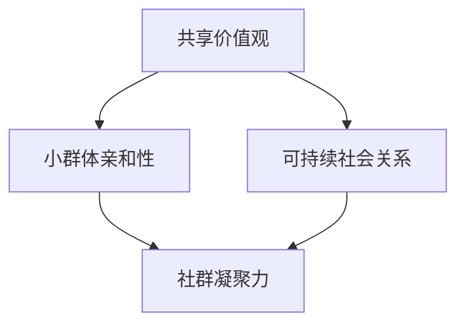

                 

## 引言

《新部落主义：在碎片化社会中重建归属感》旨在探讨如何在当今社会的高效连接与碎片化中，重新定义和构建人们之间的归属感。随着科技的进步和社会的快速发展，我们进入了一个高度连接但同时也高度碎片化的时代。在这个时代，人们的生活节奏加快，社会结构发生了深刻变化，人与人之间的联系变得更加复杂和多元。然而，这种碎片化的现象也带来了一些负面影响，尤其是归属感的缺失。

归属感是一种深刻的情感需求，是人类社会关系的重要组成部分。它不仅关乎个人的心理和情感健康，还影响到社会整体的和谐与稳定。在碎片化社会中，如何重新建立归属感，成为了我们需要深入探讨的问题。新部落主义作为一种新的社会构建理念，提供了一种可能的解决方案。

新部落主义不仅强调个体之间的互动和联系，更注重社群的凝聚力和共同价值观的建立。它主张通过小群体的亲和性和共享的价值观，来弥补现代社会中人际关系的疏离和冷漠。因此，本书将从以下几个方面展开讨论：

1. **碎片化社会与归属感缺失**：介绍碎片化社会的特点，以及归属感缺失的表现和影响。
2. **新部落主义的概念与原则**：阐述新部落主义的起源、核心原则以及如何影响社会结构和人际关系。
3. **新部落主义的实践策略**：探讨如何在个人层面和社群层面实践新部落主义，重建归属感。
4. **新部落主义与组织变革**：分析新部落主义对企业文化和教育体系的潜在影响。
5. **新部落主义的挑战与未来**：探讨新部落主义面临的挑战以及其未来的发展方向。

通过以上讨论，我们希望能够为读者提供一种新的视角，帮助他们在碎片化的社会中找到归属感，构建更加紧密和有意义的社群关系。

### 目录大纲设计

在深入探讨新部落主义之前，我们需要为本书设定一个清晰的目录大纲，以便读者能够系统地理解和掌握相关内容。以下是我们设计的目录大纲：

## 第一部分：新部落主义的背景与理论基础

### 第1章：碎片化社会与归属感缺失
- **1.1 碎片化社会的特点**
    - 社会网络与虚拟社群的兴起
    - 个体生活的加速与专业化
    - 社会信任的危机
- **1.2 归属感的定义与意义**
    - 归属感的心理学基础
    - 社会关系中的归属感
    - 缺乏归属感的负面影响

### 第2章：新部落主义的概念与原则
- **2.1 新部落主义的起源**
    - 社交媒体的变革
    - 去中心化的社会结构
- **2.2 新部落主义的核心原则**
    - 共享的价值观
    - 小群体的亲和性
    - 可持续的社会关系

## 第二部分：新部落主义的实践策略

### 第3章：重构个人归属感
- **3.1 自我认知与自我表达**
    - 了解自己的需求与价值观
    - 在社交媒体中塑造真实自我
- **3.2 建立和维护社群**
    - 寻找志同道合的群体
    - 跨越虚拟与现实的界限

### 第4章：新部落主义在社群中的应用
- **4.1 线上社群的构建与运营**
    - 社群管理的策略
    - 社群文化的塑造
- **4.2 线下活动的组织与参与**
    - 线下活动的策划与执行
    - 线下活动中的归属感体验

### 第5章：新部落主义与组织变革
- **5.1 企业文化中的新部落主义**
    - 新型工作环境的塑造
    - 促进团队合作与员工归属感
- **5.2 教育体系中的新部落主义**
    - 班级社群的构建
    - 教师与学生之间的关系

## 第三部分：新部落主义的挑战与未来

### 第6章：新部落主义面临的挑战
- **6.1 虚拟现实与真实世界的平衡**
    - 虚拟互动对现实生活的冲击
    - 恢复社交活动的真实感
- **6.2 社群管理的困境**
    - 管理规模与社群多样性的挑战
    - 社群成员间的冲突与协调

### 第7章：新部落主义的发展方向
- **7.1 技术创新与新部落主义**
    - 人工智能在社群管理中的应用
    - 虚拟现实技术对归属感的影响
- **7.2 新部落主义的社会影响**
    - 对社会结构的影响
    - 对个人成长和发展的启示

## 结论

### 第8章：走向未来，重建归属感
- **新部落主义在未来的发展前景**
- **个人与社群如何在变化中寻求平衡**
- **面向未来的归属感构建策略**

通过以上目录大纲的设计，本书将系统性地介绍新部落主义的背景、理论基础、实践策略以及面临的挑战和未来发展方向。每个章节都将围绕核心主题展开深入探讨，旨在为读者提供全面的视角和实用的建议，帮助他们更好地理解和实践新部落主义，从而在碎片化社会中重建归属感。

### 第一部分：新部落主义的背景与理论基础

#### 第1章：碎片化社会与归属感缺失

**1.1 碎片化社会的特点**

在当今这个高度信息化和全球化的时代，社会结构发生了深刻的变化，其中一个显著的特点就是碎片化。碎片化社会不仅仅是一个地理或时间上的分散，更是一种社会关系的分散和多元化。以下是一些碎片化社会的典型特点：

- **社会网络与虚拟社群的兴起**：随着互联网和社交媒体的普及，人们可以通过各种平台建立虚拟社群，这些社群可能跨越地域和国界，成员之间通过线上互动形成社会联系。然而，这种联系往往是浅层次的，缺乏深度的交流和情感纽带。
  
- **个体生活的加速与专业化**：现代社会的生活节奏日益加快，人们为了适应这种节奏，不得不将生活切割成多个专业化的部分。工作、学习、娱乐、休息等都被分割开来，人们的生活变得片段化和专业化，这使得人与人之间的直接联系变得更加稀疏。

- **社会信任的危机**：在碎片化社会中，由于个体之间互动的减少和虚拟社群的广泛存在，社会信任感受到了严重的挑战。人们在面对面的互动中变得谨慎，对陌生人和新环境的信任度下降，这进一步加剧了社会关系的疏离。

**1.2 归属感的定义与意义**

归属感是一种深层的情感需求，是人类对于群体认同和归属的需求。它不仅仅是一种情感体验，更是一种社会心理状态。以下是对归属感的一些定义与意义的探讨：

- **归属感的心理学基础**：归属感来源于个体对群体的认同感和依赖感。心理学家马斯洛的需求层次理论指出，归属感是人类基本需求之一，位于安全需求的层次。当个体感到被某个群体接纳和重视时，会感到一种归属感和安全感。

- **社会关系中的归属感**：在社会学中，归属感被视为社会关系的重要方面。它不仅是个体与群体之间的情感联系，也是社会结构稳定性的基础。当个体在一个群体中感到归属时，他们会更愿意为该群体做出贡献，从而增强群体的凝聚力和稳定性。

- **缺乏归属感的负面影响**：归属感的缺失对个体的心理健康和社会行为都有显著的负面影响。缺乏归属感的个体可能感到孤独、焦虑和抑郁，社会参与度低，甚至可能产生反社会的行为。在社会层面，归属感的缺失可能导致社会动荡、不和谐和不稳定。

**总结**

碎片化社会带来了社会结构、人际关系和个体心理的深刻变化，这些变化使得归属感的缺失成为一个普遍现象。理解碎片化社会的特点以及归属感的定义和意义，是探索新部落主义及其在现代社会中重建归属感的基础。接下来，我们将进一步探讨新部落主义的概念和核心原则，帮助读者更好地理解这一新的社会构建理念。

#### 第2章：新部落主义的概念与原则

**2.1 新部落主义的起源**

新部落主义这一概念并非凭空产生，它有着深厚的背景和渊源。随着社交媒体的兴起和互联网技术的发展，人们开始对传统的社会结构进行反思和重塑。新部落主义正是这种反思和重塑的产物。以下是新部落主义起源的几个关键因素：

- **社交媒体的变革**：社交媒体平台如Facebook、Twitter、Instagram等，改变了人们社交的方式和模式。这些平台允许用户建立虚拟社群，与远在千里之外的陌生人建立联系，从而打破了传统地域和时间的限制。这种去中心化的社交方式，为新部落主义的形成提供了土壤。

- **去中心化的社会结构**：随着互联网和区块链技术的发展，去中心化的社会结构逐渐成为可能。去中心化不仅仅是技术上的变革，更是一种社会理念，它强调个体之间的平等和自主，反对中心化的权力结构。这种理念与新部落主义的核心原则高度契合。

- **对传统社会的反思**：在现代社会，许多人开始质疑传统社会结构中的种种问题，如高度竞争、不平等、冷漠等。他们渴望寻找一种更加平等、温暖和有意义的社会形式，新部落主义正是在这种背景下逐渐形成并发展的。

**2.2 新部落主义的核心原则**

新部落主义不仅仅是一种新的社会形式，更是一套完整的理念体系。它包含以下几个核心原则：

- **共享的价值观**：新部落主义强调社群成员之间共享的价值观。这些价值观可以是共同的目标、信念、文化传统等。通过共同的价值观，社群成员能够建立更深层次的情感联系和认同感。

- **小群体的亲和性**：与传统的大型社会群体相比，新部落主义更倾向于小群体。小群体的成员之间更容易建立亲密的关系，相互了解和信任。这种亲和性有助于增强社群的凝聚力和归属感。

- **可持续的社会关系**：新部落主义主张建立可持续的社会关系。这种关系不仅是一种短期的互动，更是一种长期的合作和共同发展。通过可持续的社会关系，社群能够实现长期的稳定和繁荣。

**新部落主义的核心概念与联系**

为了更好地理解新部落主义的理念，我们需要通过一个概念实体之间的关系架构来展现其核心组成部分。以下是一个简化的Mermaid流程图，展示了新部落主义的关键概念及其相互联系：

- **共享价值观**是新部落主义的基石，它为社群成员提供了共同的认同感和行为准则。
- **小群体亲和性**增强了成员之间的情感联系，有助于建立深厚的友谊和信任。
- **可持续社会关系**确保了社群的长期稳定和繁荣，通过合作和共同发展来实现社群的目标。

通过这个架构，我们可以清晰地看到新部落主义的核心概念及其相互之间的联系。这些核心原则不仅为新部落主义提供了理论基础，也为实际操作提供了指导。

**总结**

新部落主义的概念和原则，为我们提供了一种全新的视角，来理解现代社会中人与人之间的关系和社群的构建。通过共享价值观、小群体的亲和性和可持续的社会关系，新部落主义试图在碎片化的社会中重建归属感。在接下来的章节中，我们将探讨如何在实际生活中实践新部落主义，以应对现代社会中的挑战。

### 第二部分：新部落主义的实践策略

#### 第3章：重构个人归属感

在碎片化社会中，重构个人归属感显得尤为重要。这一章节将探讨如何通过自我认知与自我表达，以及建立和维护社群来重构个人归属感。

**3.1 自我认知与自我表达**

自我认知是重构个人归属感的第一步。个体需要深入了解自己的需求、价值观和兴趣，从而在社群中找到自己的位置。以下是实现自我认知和自我表达的一些策略：

- **自我反思**：定期进行自我反思，思考自己的优点、弱点、兴趣爱好和职业目标。这种方法可以帮助个体更清晰地认识自己，找到自己的优势和兴趣点。
  
- **目标设定**：根据自己的兴趣和价值观设定短期和长期目标。目标可以帮助个体在社群中找到方向，并通过实现目标来获得成就感和归属感。

- **社交媒体表达**：在社交媒体平台上积极表达自己的观点和感受。通过写作、摄影、视频等多种形式，展示自己的个性和特长，从而吸引志同道合的人。

**3.2 建立和维护社群**

建立和维护一个具有归属感的社群，是重构个人归属感的关键。以下是一些策略：

- **寻找志同道合的群体**：通过社交媒体、兴趣小组、社区活动等方式，寻找与自己兴趣和价值观相符的社群。参与这些社群，可以让人感受到归属感和认同感。

- **积极参与社群活动**：在社群中积极参与讨论、活动和项目，通过实际行动来展示自己的价值。积极参与不仅可以增加自己在社群中的影响力，还能增强归属感。

- **建立亲密关系**：在社群中寻找可以建立亲密关系的人。通过深层次的交流和互动，建立深厚的友谊和信任，从而增强归属感。

- **维护社群文化**：每个社群都有其独特的文化，维护社群文化有助于增强成员之间的凝聚力和归属感。可以通过制定共同的规则、举办文化活动等方式来维护社群文化。

**案例分析：一个成功的小型社群**

以下是一个成功的小型社群的案例，该社群通过自我认知、自我表达和社群互动，成功重构了成员的归属感：

- **背景**：这个社群是由一群对编程和人工智能感兴趣的年轻人组建的。他们通过线上平台找到了彼此，并决定定期线下聚会，共同探讨技术问题。

- **自我认知与自我表达**：社群成员通过自我介绍、分享个人项目和兴趣，相互了解并建立初步联系。他们还在社群中发表技术文章、代码片段，展示自己的技术能力。

- **社群互动**：社群成员积极参与讨论，分享技术心得和问题解答。他们还定期举办技术沙龙和黑客松，通过共同解决问题和实现项目来增强互动和归属感。

- **维护社群文化**：社群制定了共同的技术标准和行为规范，确保成员之间的交流和合作顺畅。他们还定期举办文化活动和聚会，增强成员之间的情感联系。

**总结**

通过自我认知与自我表达，以及建立和维护社群，个体可以在碎片化社会中重构归属感。这需要个体积极寻找适合自己的社群，并通过积极参与和互动，建立深厚的友谊和信任。在下一章中，我们将探讨新部落主义在社群中的应用，以更系统地理解如何实践这一理念。

#### 第4章：新部落主义在社群中的应用

新部落主义不仅是一种社会理念，更是一种实践策略，它强调通过社群构建来增强成员之间的归属感和凝聚力。本章节将探讨如何在线上社群和线下活动中应用新部落主义，以及这些策略的实际效果和意义。

**4.1 线上社群的构建与运营**

线上社群是现代社交网络中最重要的组成部分之一，它们提供了虚拟空间，使人们可以跨越地理限制，进行深入的互动和交流。以下是构建和运营线上社群的一些建议：

- **确定社群目标和价值观**：线上社群需要有一个明确的目标和共同价值观，这有助于吸引志同道合的成员。社群的目标可以是一个共同的学习目标、一个共同的兴趣领域，或者一个共同的社会使命。

- **建立有效的沟通机制**：线上社群的沟通机制是社群活力和凝聚力的重要保障。可以设置论坛、聊天室、邮件列表等多种沟通渠道，确保信息的流通和成员之间的互动。

- **激发成员参与**：通过举办线上讨论、问答环节、主题分享等活动，激发成员的参与热情。定期发布有价值的资源和内容，吸引成员主动参与讨论和分享。

- **培养社群文化**：社群文化是社群凝聚力的源泉。可以通过制定社群规则、设立荣誉制度、举办文化活动和聚会等方式，培养和维护社群文化。

**案例：一个成功的线上编程社群**

以下是一个成功的线上编程社群的案例，该社群通过有效的沟通机制和文化建设，成功地应用了新部落主义：

- **背景**：这个社群是由一群编程爱好者组建的，目标是共同学习和提高编程技能。
- **构建与运营**：社群成员通过GitHub、Reddit等平台进行编程分享和讨论，定期举办线上技术沙龙和编程马拉松。社群还设立了“编程之星”荣誉制度，激励成员积极参与和贡献。
- **效果**：社群成员之间的互动频繁，技术水平和合作能力显著提高。社群成员在技术问题和项目合作中互相支持，形成了紧密的归属感和凝聚力。

**4.2 线下活动的组织与参与**

线下活动是线上社群的重要延伸，它们为成员提供了面对面的互动机会，有助于加深成员之间的联系和信任。以下是组织线下活动的一些建议：

- **策划多样化活动**：线下活动可以包括技术研讨会、工作坊、社交聚会等多种形式。多样化的活动可以满足不同成员的需求，增强社群的吸引力。
  
- **确保活动质量**：线下活动的质量直接影响成员的参与感和满意度。可以通过邀请行业专家进行讲座、组织互动工作坊、安排实地考察等方式，提高活动的专业性和趣味性。

- **鼓励成员参与**：鼓励成员主动参与活动策划和组织，这不仅可以增加成员的参与感，还可以增强社群的凝聚力。可以通过成员投票、问卷调查等方式，收集成员的意见和建议。

- **营造归属感体验**：线下活动不仅要提供知识和技能，还要营造一种归属感和社区氛围。可以通过团队建设游戏、文化展示、互动交流等方式，增强成员之间的情感联系。

**案例：一个成功的线下编程社群活动**

以下是一个成功的线下编程社群活动的案例，该活动通过多样化的内容和情感互动，成功营造了归属感体验：

- **背景**：这个社群成员在一次线上编程马拉松中表现出色，社群组织者决定举办一次线下聚会，以庆祝他们的成就。
- **活动策划**：社群组织了一场主题为“编程与生活”的活动，包括编程技术分享、生活经验交流、文化展示等环节。
- **活动效果**：活动不仅提供了丰富的知识和技能交流，还通过互动游戏和文化展示，增强了成员之间的情感联系和归属感。活动结束后，成员们纷纷表示，这次聚会让他们感到更加紧密和有归属感。

**总结**

新部落主义在社群中的应用，通过线上社群的构建与运营和线下活动的组织与参与，有效地增强了成员之间的归属感和凝聚力。这些策略不仅为成员提供了知识和技能交流的平台，还为他们提供了情感互动和社区归属的机会。通过成功案例的分享，我们可以看到新部落主义在实践中的有效性和影响力。在下一章中，我们将探讨新部落主义对组织变革的影响，进一步理解其广泛的应用前景。

#### 第5章：新部落主义与组织变革

新部落主义不仅适用于个人和社群层面，它还为组织变革提供了新的视角和策略。在这一章节中，我们将探讨新部落主义如何影响企业文化、促进团队合作与员工归属感，以及它在教育体系中的应用。

**5.1 企业文化中的新部落主义**

企业文化是组织内部成员共同认同和遵守的价值观和行为准则。新部落主义强调共享价值观、小群体的亲和性和可持续的社会关系，这些理念对企业文化的塑造具有重要意义。

- **共享价值观**：新部落主义主张社群成员之间共享的价值观，这种价值观可以转化为企业内部的核心文化。例如，企业可以通过制定共同的目标和使命，来引导员工的行为和决策。这种共同的价值观可以增强员工的认同感和归属感。

- **小群体的亲和性**：在传统企业中，员工往往被划分为不同的部门，彼此之间的互动较少。新部落主义提倡通过小群体的方式来增强员工之间的联系。企业可以组建跨部门的兴趣小组或团队，鼓励员工在共同的兴趣和目标下进行合作和交流。

- **可持续的社会关系**：新部落主义强调建立可持续的社会关系，这种关系不仅体现在员工与员工之间，也体现在员工与组织之间。企业可以通过长期的人才培养计划和员工发展项目，来增强员工对组织的忠诚度和归属感。

**案例：一家科技公司的企业文化变革**

以下是一家科技公司如何通过新部落主义理念进行企业文化变革的案例：

- **背景**：这家公司在快速发展过程中，员工之间的互动和沟通较少，企业文化显得单调和疏离。
- **变革措施**：公司通过组建跨部门的兴趣小组，如编程小组、设计小组和AI研究小组，鼓励员工在共同的兴趣和目标下进行合作。公司还制定了共同的企业使命和价值观，定期组织团队建设活动和知识分享会，增强员工的归属感和认同感。
- **变革效果**：员工之间的互动和沟通显著增加，团队合作能力得到提升，员工对公司的忠诚度和满意度也显著提高。公司整体文化变得更加开放和包容，员工在工作中感到更加有归属感和满足感。

**5.2 新部落主义与团队合作**

团队合作是组织成功的关键，而新部落主义为团队合作提供了新的思路和策略。

- **共享目标和责任**：新部落主义强调小群体的亲和性，这种理念可以帮助团队成员更好地共享目标和责任。通过明确的任务分工和共同的目标，团队成员可以更好地协同工作，提高团队的整体效率。

- **增强沟通和信任**：新部落主义主张通过小群体的互动来增强沟通和信任。团队可以通过定期的会议、讨论和互动活动，来提高成员之间的沟通效率和信任度。这种信任和沟通是团队合作成功的重要基础。

- **激励和认可**：新部落主义提倡可持续的社会关系，这为激励和认可团队成员提供了新的方式。企业可以通过设立团队目标和荣誉制度，来激励团队成员为实现团队目标而努力。这种激励和认可不仅可以提高团队成员的积极性，还可以增强团队的凝聚力和归属感。

**案例：一家创业公司的团队合作实践**

以下是一家创业公司如何通过新部落主义理念实践团队合作的案例：

- **背景**：这家公司在创业初期，团队成员之间的互动较少，工作效率不高。
- **实践策略**：公司通过组建跨职能团队，鼓励团队成员在共同的项目中合作。公司还定期组织团队建设活动，如户外拓展、技术沙龙等，增强团队成员之间的沟通和信任。公司还设立了团队目标和荣誉制度，定期对表现优秀的团队成员进行表彰和奖励。
- **实践效果**：团队成员之间的互动和沟通显著增加，工作效率和项目质量得到提高。团队成员在工作中感到更加有归属感和满足感，公司的整体业绩也显著提升。

**5.3 新部落主义与教育体系**

新部落主义不仅对企业和团队合作有重要影响，它在教育体系中的应用也同样具有潜力。

- **班级社群的构建**：在教育体系中，班级可以被视为一种小群体，通过构建班级社群，可以增强学生之间的互动和归属感。教师可以通过设立共同的学习目标和价值观，组织班级活动和互动，来增强班级的凝聚力和归属感。

- **个性化学习**：新部落主义强调共享价值观和小群体的亲和性，这为个性化学习提供了新的思路。教师可以通过了解学生的兴趣和需求，为他们提供个性化的学习资源和指导，从而提高学生的学习效果和满意度。

- **跨学科合作**：新部落主义提倡跨学科的合作，这可以在教育体系中得到应用。通过跨学科的课程设置和项目合作，学生可以培养跨学科思维和合作能力，从而更好地适应未来社会的需求。

**案例：一所学校的班级社群建设**

以下是一所学校如何通过班级社群建设应用新部落主义理念的案例：

- **背景**：这所学校的学生在传统班级中互动较少，班级凝聚力较低。
- **建设措施**：学校通过设立共同的学习目标和价值观，组织班级活动和互动，如班级讨论会、小组合作项目等，来增强班级的凝聚力和归属感。学校还鼓励学生跨学科合作，通过跨学科项目来提高他们的综合能力和创新能力。
- **建设效果**：班级的互动和沟通显著增加，学生的学习积极性和参与度也显著提高。班级氛围变得更加活跃和和谐，学生的综合能力和团队合作能力得到显著提升。

**总结**

新部落主义不仅为个人和社群提供了重建归属感的策略，它在组织变革、团队合作和教育体系中的应用也展现出了巨大的潜力。通过共享价值观、小群体的亲和性和可持续的社会关系，新部落主义为现代组织和社会提供了一种全新的视角和策略，帮助我们更好地应对现代社会中的挑战。在下一章中，我们将探讨新部落主义面临的挑战和未来发展方向。

#### 第6章：新部落主义面临的挑战

尽管新部落主义提供了一种重建归属感的有效策略，但在其实践过程中也面临诸多挑战。这些挑战包括虚拟现实与真实世界的平衡、社群管理的困境等。理解并应对这些挑战，对于新部落主义的长远发展至关重要。

**6.1 虚拟现实与真实世界的平衡**

随着互联网和虚拟技术的不断发展，人们越来越多地依赖虚拟空间进行互动。然而，这种虚拟互动与现实世界的互动存在显著差异，可能会导致一些问题：

- **虚拟互动对现实生活的冲击**：长时间沉浸在虚拟社群中，可能会使人们忽视现实生活中的责任和义务。例如，过度使用社交媒体可能导致工作效率下降，人际关系疏离等问题。

- **恢复社交活动的真实感**：虚拟互动虽然方便快捷，但在情感深度和真实体验上存在不足。如何让虚拟互动与真实社交活动相辅相成，保持社交活动的真实感，是一个重要的挑战。

**案例：虚拟游戏社群与现实生活冲突**

以下是一个虚拟游戏社群与现实生活冲突的案例：

- **背景**：一个游戏社群成员因共同的游戏爱好而聚集在一起，但其中一位成员因过度沉迷游戏，忽视了现实生活中的工作、家庭和朋友关系。
- **冲突表现**：该成员在工作上表现不佳，家庭关系紧张，朋友关系疏远，最终导致生活失衡。虽然他在虚拟世界中找到了归属感，但在现实生活中却感到孤独和无助。

**应对策略**：

- **时间管理**：通过制定合理的时间表，确保虚拟互动和现实生活之间的平衡。例如，设定固定的游戏时间和休息时间，避免虚拟活动占据全部生活空间。
  
- **线下活动**：定期组织线下聚会和活动，增强成员之间的真实互动和情感联系。通过面对面的交流和互动，可以弥补虚拟互动的不足。

**6.2 社群管理的困境**

随着新部落主义的应用，社群规模不断扩大，管理难度也相应增加。以下是一些常见的社群管理困境：

- **管理规模与社群多样性的挑战**：随着社群成员的增加，管理难度显著提升。如何平衡社群的多样性和管理的效率，是一个重要的挑战。过于集中的管理可能导致成员失去参与感和自主性，而分散的管理则可能无法有效控制社群的运作。

- **社群成员间的冲突与协调**：社群成员来自不同的背景和兴趣，可能会产生冲突和分歧。如何协调和处理这些冲突，保持社群的和谐和稳定，是一个关键问题。

**案例：大型社群中的管理困境**

以下是一个大型社群管理困境的案例：

- **背景**：一个大型编程社群成员众多，活动频繁，但由于缺乏有效的管理，社群逐渐出现混乱。
- **问题表现**：社群内部讨论变得无序，活动质量下降，成员之间的冲突和抱怨增加。社群失去了原本的活力和凝聚力。

**应对策略**：

- **明确管理规则**：制定明确的管理规则和行为准则，确保社群成员的行为规范和秩序。通过设定合理的权限和责任分工，提高管理效率。
  
- **激励机制**：建立激励机制，鼓励成员积极参与社群管理和活动。例如，设立优秀贡献者奖项，鼓励成员为社群做出贡献。

- **社区自治**：通过引导成员参与社群自治，增强成员的参与感和责任感。例如，设立成员委员会，让成员参与决策和活动策划。

**总结**

新部落主义在实践过程中面临诸多挑战，需要通过有效的策略和管理方法来应对。通过平衡虚拟现实互动、优化社群管理和协调成员间的冲突，我们可以更好地实现新部落主义的目标，重建归属感，构建更加紧密和有意义的社群关系。在下一章中，我们将探讨新部落主义的技术创新和未来发展方向。

#### 第7章：新部落主义的发展方向

随着科技的不断进步，新部落主义也面临着新的机遇和挑战。在这一章节中，我们将探讨新部落主义在技术创新中的应用，以及这些技术对归属感的影响。同时，我们还将讨论新部落主义在社会结构和个人发展中的潜在影响。

**7.1 技术创新与新部落主义**

技术创新为新部落主义的实践提供了强大的支持。以下是一些关键技术的应用及其对社群归属感的影响：

- **人工智能**：人工智能技术在社群管理中的应用潜力巨大。通过分析社群成员的行为和互动数据，人工智能可以提供个性化的推荐和服务，增强成员的参与感和归属感。例如，人工智能可以自动识别社群中的活跃分子，为他们提供更多机会来发挥领导作用，从而提升整个社群的活跃度和凝聚力。

- **区块链技术**：区块链技术为去中心化社群的建立提供了技术基础。通过区块链，社群成员可以创建和参与去中心化的组织，确保社群的透明度和公平性。区块链技术还可以用于实现成员之间的价值交换，例如虚拟货币和代币奖励，从而增强成员对社群的忠诚度和归属感。

- **虚拟现实（VR）**：虚拟现实技术为现实世界与虚拟空间的融合提供了新的可能性。通过VR技术，社群成员可以在虚拟环境中进行更真实、互动性更强的社交活动。这种技术可以弥补虚拟互动在情感深度和真实体验上的不足，增强成员之间的情感联系和归属感。

**案例分析：VR技术在新部落主义中的应用**

以下是一个VR技术在新部落主义中的应用案例：

- **背景**：一家VR技术公司开发了一个虚拟现实平台，用于建立去中心化的虚拟社群。
- **应用场景**：该平台允许社群成员在虚拟世界中创建个人空间、组织线上活动和互动。通过VR技术，成员可以在虚拟环境中感受到更加真实的人际互动，增强归属感。
- **效果**：平台上线后，吸引了大量用户参与，成员之间的互动和沟通显著增加，社群的凝聚力和归属感得到提升。

**7.2 新部落主义的社会影响**

新部落主义不仅对个人层面的归属感有重要影响，它在社会结构和个人发展中也展现出巨大的潜力。

- **对社会结构的影响**：新部落主义强调去中心化的社群和共享的价值观，这有助于减少社会阶层差距，促进社会公平和包容。通过去中心化的组织和协作，新部落主义可以打破传统中心化权力的结构，为更多个体提供参与和表达的机会，从而增强社会的多样性和活力。

- **对个人发展的影响**：新部落主义为个人提供了更多的社交机会和成长空间。通过参与社群活动，个人可以学习新技能、拓展人际关系、提升自我认知和领导能力。此外，新部落主义倡导的共享价值观和互助合作精神，有助于培养个人的社会责任感和集体意识。

**案例分析：新部落主义对个人发展的积极影响**

以下是一个新部落主义对个人发展积极影响的案例：

- **背景**：一位年轻人在一次编程社群的活动中，通过参与项目和互动，提升了编程技能，建立了广泛的人脉网络。
- **发展过程**：通过社群的推荐和机会，他获得了多个实习和工作机会，最终成为了一名优秀的软件工程师。
- **影响**：社群不仅帮助他在职业发展中取得了显著进步，还为他提供了精神上的支持和归属感，使他更加坚定地追求自己的职业目标。

**总结**

技术创新和新部落主义的结合，为构建更加紧密和有意义的社群关系提供了新的路径。通过人工智能、区块链技术和虚拟现实等技术的应用，新部落主义不仅能够增强社群的归属感和凝聚力，还能对社会结构和个人发展产生深远的影响。在未来的发展中，新部落主义有望成为应对现代社会挑战的重要力量，为我们带来更加和谐和有意义的社会体验。

#### 第8章：走向未来，重建归属感

随着新部落主义理念的不断发展，其未来前景令人期待。通过回顾本书的核心内容和关键点，我们可以看到新部落主义在重建归属感方面具有巨大的潜力。以下是新部落主义在未来的发展前景、个人与社群如何在变化中寻求平衡，以及面向未来的归属感构建策略。

**新部落主义的发展前景**

新部落主义作为一种新型的社会构建理念，其在未来的发展前景是光明且充满希望的。随着技术的不断进步，新部落主义将进一步融入我们的日常生活，为人们提供更加丰富和多样化的社交体验。

- **技术融合**：人工智能、区块链和虚拟现实等新兴技术的广泛应用，将使新部落主义的应用场景更加广泛。通过这些技术，社群可以提供更加个性化和高效的服务，增强成员之间的互动和归属感。
  
- **全球化与本地化**：新部落主义不仅能够解决本地社群的归属感问题，还可以跨越国界，连接全球的个体。通过互联网和虚拟技术，全球社群可以分享资源和经验，共同构建更加包容和多元的社会。

**个人与社群如何在变化中寻求平衡**

在快速变化的社会中，个人与社群之间的平衡至关重要。以下是一些建议，帮助个人和社群在变化中找到平衡：

- **时间管理**：个人需要合理规划时间，确保在虚拟互动和现实生活之间保持平衡。通过设定固定的时间表，可以有效地管理虚拟活动和现实责任，避免虚拟互动对现实生活的负面影响。

- **多元化参与**：社群成员应积极参与多种形式的互动，包括线上讨论、线下聚会和技术沙龙等。通过多元化的参与，成员可以丰富自己的社交经验，同时为社群贡献更多的力量。

- **价值观共享**：社群成员应共同坚守社群的价值观，通过共同的目标和信念来增强社群的凝聚力和归属感。共享的价值观是社群稳定和发展的基石。

**面向未来的归属感构建策略**

为了在未来的社会中更好地重建归属感，以下是一些具体的策略：

- **技术创新**：继续探索和应用新兴技术，如人工智能、区块链和虚拟现实，以提供更加丰富和高效的社交体验。

- **教育推广**：通过教育和培训，提高公众对新部落主义理念的认识和理解。推广新部落主义的基本原则和实践方法，可以帮助更多人参与到社群建设中来。

- **社区建设**：鼓励社区组织者和成员积极参与社区建设，通过组织多样化的活动和项目，增强社区的活力和凝聚力。

- **情感关怀**：在社群中建立情感关怀机制，关注成员的情感需求和心理健康。通过提供心理支持和情感交流的机会，可以帮助成员在社群中找到归属感和安全感。

**总结**

新部落主义为在碎片化社会中重建归属感提供了一种有效的策略。通过共享价值观、小群体的亲和性和可持续的社会关系，新部落主义不仅能够增强个人和社群的归属感，还能为社会结构和个人发展带来深远的影响。面向未来，我们应继续探索和推广新部落主义，使其成为构建和谐社会的有力工具。

作者：AI天才研究院/AI Genius Institute & 禅与计算机程序设计艺术 /Zen And The Art of Computer Programming

---

通过本文的详细探讨，我们希望能够帮助读者深入理解新部落主义的概念和实践策略，并在日常生活中应用这一理念，从而在碎片化的社会中重建归属感，构建更加紧密和有意义的社群关系。

