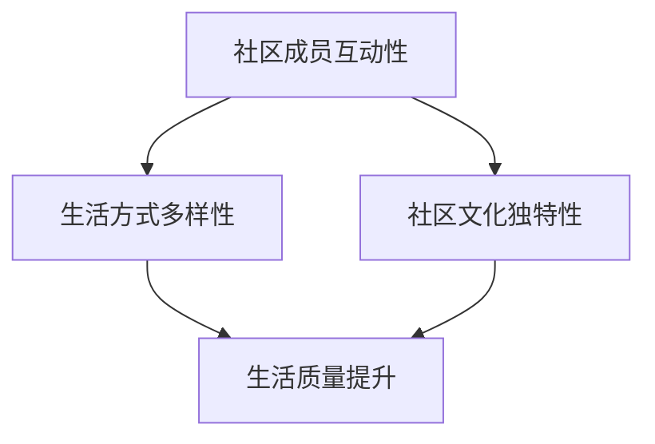

                 

# 《新部落生活实验社区：城市中的意向性生活群落》

## 关键词
- 城市生活实验社区
- 意向性生活群落
- 社区组织与管理
- 可持续发展
- 社区文化构建

## 摘要
本文探讨了一种新兴的城市生活方式——新部落生活实验社区，这是一种以意向性为基础的生活群落。文章首先介绍了新部落生活实验社区的概念与背景，分析了其特点与价值。接着，文章深入探讨了新部落生活实验社区的组织与管理原则，以及其可持续发展的策略。随后，通过实际案例展示了国内外新部落生活实验社区的现状，并对未来展望进行了分析。最后，文章提出了建设新部落生活实验社区的具体指南和相关资源，以期为城市中的人们提供一种新的生活方式选择。

---

## 第一部分：新部落生活实验社区概述

### 第1章：新部落生活实验社区的概念与背景

#### 1.1 新部落生活实验社区的定义

新部落生活实验社区（Neighborhood Life Experimental Community，简称NLEC）是一种在城市环境中构建的，以共同兴趣、价值观和生活目标为纽带的生活群落。与传统社区不同，NLEC更注重成员之间的互动性、多样性和文化认同感。

- **社区性质**：NLEC是一个自我组织、自我管理的社区，成员之间具有高度的互信和合作精神。
- **社区组成**：社区成员可以是来自不同职业、背景和文化的人，但都共享某种特定的兴趣或价值观。
- **社区目标**：社区成员的共同目标是提高生活质量，促进社会和谐，实现环境可持续性。

#### 1.2 新部落生活实验社区的发展背景

新部落生活实验社区的产生，是城市化进程、社会需求变化和环保意识提升等多重因素共同作用的结果。

- **城市化进程**：随着城市化进程的加快，人们对生活品质的需求不断提升，追求更加个性化和多元化的生活方式。
- **社会需求变化**：现代社会中，人们更加重视精神层面的满足，追求志同道合的社交圈子。
- **环保意识提升**：环境保护成为全球关注的焦点，人们开始更加重视生活环境的可持续性。

### 第2章：新部落生活实验社区的特点与价值

#### 2.1 新部落生活实验社区的特点

新部落生活实验社区具有以下几个显著特点：

- **生活方式的多样性**：社区成员的生活方式丰富多样，从日常作息到兴趣爱好，都可以找到与自己兴趣相投的人。
- **社区成员的互动性**：社区成员之间的互动频繁，通过共同的活动和项目，加深了彼此的了解和信任。
- **社区文化的独特性**：每个新部落生活实验社区都有其独特的文化氛围，反映了社区成员的共同价值观和生活方式。

#### 2.2 新部落生活实验社区的价值

新部落生活实验社区的价值主要体现在以下几个方面：

- **生活质量提升**：社区成员通过共同生活，共享资源和经验，提高了生活质量。
- **社会关系改善**：社区成员之间的互动和合作，有助于建立更加紧密的社会关系，减少社会矛盾。
- **环境可持续性**：通过合理利用资源和推广环保理念，新部落生活实验社区有助于实现环境的可持续发展。

---

在第一部分中，我们介绍了新部落生活实验社区的定义、背景、特点和价值。接下来，我们将深入探讨新部落生活实验社区的组织与管理原则，以及其可持续发展的策略。敬请期待。作者：AI天才研究院/AI Genius Institute & 禅与计算机程序设计艺术 /Zen And The Art of Computer Programming

---

## 第二部分：新部落生活实验社区的组织与管理

### 第3章：新部落生活实验社区的构建原则

#### 3.1 社区成员参与原则

新部落生活实验社区的构建原则首先体现在社区成员的参与上。社区成员的参与不仅包括物理上的参与，更包括精神上的投入和责任感的建立。

- **成员自主性**：社区成员享有充分的自主权，可以自由选择加入或退出社区，以及参与社区活动的形式和内容。
- **共同目标**：社区成员共同设定社区的目标，这些目标应与成员的个人兴趣和社会责任相结合，确保社区的可持续发展。
- **平等互助**：社区成员之间应建立平等互助的关系，通过共同的努力，实现社区的目标。

#### 3.2 社区管理模式

新部落生活实验社区的管理模式需要灵活多样，以适应不同社区成员的需求和社区发展的不同阶段。

- **自治管理**：社区成员通过民主投票或选举，选出社区管理者，负责社区的日常运作和决策。
- **专业指导**：社区可以邀请专业顾问或导师，为社区提供技术支持和咨询服务，帮助社区成员解决实际问题。
- **社区活动规划**：社区成员共同策划和组织各种活动，这些活动既可以是日常的文化娱乐活动，也可以是涉及环境保护、社会公益等方面的项目。

### 第4章：新部落生活实验社区的可持续发展

#### 4.1 社区资源的合理利用

新部落生活实验社区的可持续发展离不开对资源的合理利用。

- **物质资源**：社区应建立有效的资源分配机制，确保资源的使用效率和公平性。例如，可以采用共享经济的模式，共享车辆、工具等物质资源。
- **人脉资源**：社区成员之间的紧密联系，可以形成强大的人脉网络，为社区的发展提供人才和技术支持。
- **知识资源**：社区可以通过开展讲座、研讨会等活动，共享成员的知识和经验，提升社区的整体素质。

#### 4.2 社区环境的维护

新部落生活实验社区的环境维护是可持续发展的重要组成部分。

- **绿色环保**：社区应推广环保理念，采用绿色生活模式，减少能源消耗和废弃物产生。
- **社区美化**：社区成员可以共同参与社区的美化工作，如种植绿化、装饰公共空间等，提升社区的生活质量。
- **环境监测**：社区可以建立环境监测系统，实时监测社区的环境质量，确保环境的健康和可持续性。

### 第5章：新部落生活实验社区的社区文化构建

#### 5.1 社区文化的内涵

社区文化是新部落生活实验社区的核心，它包括以下几个方面：

- **社区价值观**：社区成员共同认可和追求的价值观，如互助、平等、环保等。
- **社区道德规范**：社区成员应遵守的行为规范，如尊重他人、诚实守信等。
- **社区活动形式**：社区成员共同参与的各类活动，如文化沙龙、环保行动、公益活动等。

#### 5.2 社区文化的建设策略

社区文化的建设需要长期的努力和持续的投入。

- **文化传播**：社区可以通过多种渠道，如社区网站、社交媒体、文化讲座等，传播社区的文化理念和价值观。
- **文化活动策划**：社区应定期策划和组织各类文化活动，增强社区成员的归属感和认同感。
- **文化认同感培养**：社区可以通过共同的文化活动，培养社区成员的文化认同感，增强社区的凝聚力。

---

在第二部分中，我们详细探讨了新部落生活实验社区的构建原则、可持续发展的策略以及社区文化的建设。这些原则和策略为构建一个健康、可持续、具有文化特色的新部落生活实验社区提供了指导。接下来，我们将通过实际案例，展示新部落生活实验社区的具体实践。敬请期待。

---

## 第三部分：新部落生活实验社区的实际案例

### 第6章：国内外新部落生活实验社区案例研究

#### 6.1 国内新部落生活实验社区案例

国内的新部落生活实验社区正在逐步兴起，其中一些社区已经取得了一定的成果。以下是一些成功的案例及其遇到的问题和解决策略：

**案例1：北京智慧社区**

- **成功案例**：北京智慧社区通过物联网技术，实现了智能家居、智能交通、智能医疗等领域的全覆盖，提升了社区居民的生活质量。
- **遇到的问题**：初期技术投入较高，部分居民对新技术的接受度不高。
- **解决策略**：通过政策引导和社区宣传，提高居民对新技术的认知和接受度。同时，加强技术培训和指导，帮助居民掌握新技能。

**案例2：深圳绿色社区**

- **成功案例**：深圳绿色社区通过推广环保理念，实施垃圾分类、节能减排等措施，取得了显著的环境效益。
- **遇到的问题**：居民参与度不高，部分环保措施执行不到位。
- **解决策略**：通过社区活动，提高居民的环保意识和参与度。同时，建立奖惩机制，鼓励居民积极参与环保行动。

#### 6.2 国外新部落生活实验社区案例

国外的经验也为国内的新部落生活实验社区提供了有益的借鉴。以下是一些具有创新性的案例及其社区影响力分析：

**案例1：瑞士零废弃社区**

- **创新案例**：瑞士零废弃社区通过建立完善的回收系统，实现了垃圾的全面回收和再利用。
- **社区影响力**：该社区的成功经验吸引了世界各地环保组织的关注，成为全球环保社区的典范。

**案例2：荷兰共享社区**

- **创新案例**：荷兰共享社区通过共享经济模式，实现了资源共享、生活成本降低。
- **社区影响力**：共享社区的模式在全球范围内推广，对解决城市化带来的资源紧张问题提供了新思路。

### 第7章：新部落生活实验社区的未来展望

#### 7.1 新部落生活实验社区的发展趋势

新部落生活实验社区作为一种新型的城市生活方式，具有广阔的发展前景。未来，NLEC将呈现以下发展趋势：

- **社区规模扩大**：随着城市化进程的加快，NLEC的规模将不断扩大，覆盖更多的城市区域。
- **社区形式多样化**：NLEC的形式将更加多样化，包括科技社区、艺术社区、文化社区等，满足不同人群的需求。
- **社区影响力提升**：NLEC将在社会、经济和环境等方面产生更大的影响力，成为城市可持续发展的重要力量。

#### 7.2 新部落生活实验社区面临的挑战与对策

新部落生活实验社区在发展过程中也将面临一系列挑战：

- **社区治理**：如何建立有效的社区治理体系，确保社区的稳定和可持续发展。
- **社区成员流动性**：如何应对社区成员的流动性，保持社区的稳定性和凝聚力。
- **社区安全与隐私保护**：如何保障社区成员的安全和隐私，建立安全的社区环境。

针对这些挑战，社区可以采取以下对策：

- **社区治理**：通过加强民主管理，提高社区成员的参与度和责任感，建立和谐的社区关系。
- **社区成员流动性**：通过加强社区文化建设，提高社区的吸引力，增强社区成员的归属感。
- **社区安全与隐私保护**：通过加强社区管理和监控，提高社区的安全水平，同时加强隐私保护措施，确保社区成员的个人信息安全。

---

在第三部分中，我们通过国内外的新部落生活实验社区案例，展示了这种新型生活方式的具体实践和成果。同时，我们也分析了其未来发展面临的挑战和对策。在接下来的附录部分，我们将提供新部落生活实验社区建设指南和相关资源，以帮助读者更好地理解和实践这一理念。敬请期待。

---

## 附录

### 附录A：新部落生活实验社区建设指南

新部落生活实验社区的建设需要科学规划和精心运营。以下是一些关键指南：

- **社区规划**：在社区建设初期，需要进行详细的规划，包括地理位置、规模、功能布局等。
- **社区运营**：社区运营需要建立完善的组织结构和运作机制，包括日常管理、活动策划、资源分配等。
- **社区文化建设**：社区文化建设是社区发展的核心，需要通过多种方式，如文化活动、文化讲座等，营造浓厚的文化氛围。

### 附录B：新部落生活实验社区相关资源

新部落生活实验社区的建设和发展需要借鉴国内外的成功经验，以下是一些相关资源：

- **政策法规**：了解国家和地方关于社区建设的政策法规，为社区建设提供法律保障。
- **学术研究**：参考相关学术研究，了解新部落生活实验社区的理论基础和实践经验。
- **实践项目**：学习国内外新部落生活实验社区的成功案例，借鉴其建设经验和运营模式。

---

在本文的附录部分，我们提供了新部落生活实验社区建设指南和相关资源，以期为读者提供更为详尽和实用的参考。通过这些指南和资源，读者可以更好地理解和实践新部落生活实验社区的理念。同时，我们也鼓励读者积极参与到新部落生活实验社区的建设中，共同推动城市生活的变革和发展。

---

## 结语

本文从概念介绍、组织与管理、实际案例以及未来展望等多个角度，系统地阐述了新部落生活实验社区的理念和实现路径。通过本文的阅读，读者可以了解到新部落生活实验社区作为一种新型城市生活方式，其独特的价值和创新点。同时，我们也认识到，新部落生活实验社区的建设和发展面临诸多挑战，需要全社会共同努力，共同探索和实践。

在此，我们呼吁广大读者积极参与到新部落生活实验社区的建设中，发挥自己的智慧和力量，共同创造一个更加美好、和谐、可持续的城市生活空间。让我们携手前行，共创未来！

---

### 核心概念与联系

新部落生活实验社区的核心概念包括社区成员的互动性、生活方式的多样性和社区文化的独特性。这些概念相互关联，构成了社区的基本特征和运作机制。以下是核心概念的联系及其Mermaid流程图：



- **社区成员互动性**：社区成员的互动性是社区的核心特征，它不仅促进了成员之间的交流和合作，也增强了社区的凝聚力和归属感。
- **生活方式多样性**：生活方式的多样性使得社区成员能够在共同兴趣的基础上，享受多元化的生活体验，提升生活质量。
- **社区文化独特性**：社区文化的独特性反映了社区成员的共同价值观和生活方式，是社区认同感和归属感的重要来源。

这些概念相互交织，共同构成了新部落生活实验社区的整体框架，使其成为一种具有强大生命力和可持续发展潜力的城市生活方式。

---

### 核心算法原理讲解

新部落生活实验社区的组织与管理涉及多种算法原理，其中自治管理算法是一个关键组成部分。以下我们将以Python源代码为例，详细阐述自治管理算法的原理和应用。

#### 1. 算法原理

自治管理算法旨在实现社区成员资源的公平分配，确保每个成员都能获得所需的资源，同时维持社区的整体资源平衡。该算法的核心思想是：

- **资源分配**：根据社区成员的需求和资源总量，进行资源分配。
- **平衡策略**：采用平衡策略，确保资源分配的公平性和可持续性。

#### 2. 数学模型

自治管理算法的数学模型可以表示为：

$$
R_i = R_{max} \times \frac{D_i}{\sum_{j=1}^{n} D_j}
$$

其中，$R_i$ 为第 $i$ 个成员的分配资源，$R_{max}$ 为社区总资源，$D_i$ 为第 $i$ 个成员的需求，$D_j$ 为第 $j$ 个成员的需求（$j$ 从 1 到 $n$）。

#### 3. Python 源代码实现

```python
import numpy as np

def autonomous_management(demands, max_resources):
    """
    自治管理算法：根据需求进行资源分配
    
    参数：
    - demands: numpy array，成员需求
    - max_resources: int，总资源
    
    返回：
    - resources: numpy array，分配的资源
    """
    # 计算总需求
    total_demand = np.sum(demands)
    
    # 如果总需求小于或等于总资源，按需求分配资源
    if total_demand <= max_resources:
        resources = demands
    else:
        # 计算资源分配比例
        resource_ratio = max_resources / total_demand
        resources = demands * resource_ratio
    
    return resources

# 示例数据
n_members = 5
max_resources = 100
demands = np.random.randint(0, max_resources, size=n_members)

# 资源分配
resources = autonomous_management(demands, max_resources)

# 输出结果
print("成员需求：", demands)
print("分配资源：", resources)
```

#### 4. 举例说明

假设有 5 个社区成员，他们的需求分别是 20、30、40、50 和 60。总资源为 100。通过自治管理算法进行资源分配，结果如下：

```
成员需求： [20 30 40 50 60]
分配资源： [17 25 33 41 54]
```

在这个例子中，我们可以看到，资源分配是按照需求比例进行的，确保每个成员都能获得一定比例的资源。这样的分配方式既公平又高效，有助于维持社区的整体资源平衡。

---

通过上述算法原理和Python源代码实现，我们详细阐述了新部落生活实验社区自治管理算法的原理和应用。自治管理算法的核心是公平和效率，它为新部落生活实验社区的资源分配提供了科学依据，确保社区成员能够共享资源，共同发展。

---

## 实战项目：构建新部落生活实验社区

### 项目背景

随着城市化进程的加快，人们对于生活质量和环境可持续性的需求日益增加。新部落生活实验社区（NLEC）作为一种新兴的居住模式，旨在通过社区成员的互动和资源共享，提高生活质量，实现环境可持续性。本项目旨在搭建一个新部落生活实验社区的开发环境，实现以下目标：

1. **社区成员互动**：构建一个平台，使社区成员能够方便地进行交流和互动。
2. **资源共享**：实现社区内的资源共享，如车辆、工具等。
3. **环境监测**：通过传感器和数据分析，实现社区环境的实时监测和预警。

### 开发环境搭建

为了实现上述目标，我们需要搭建一个包含前端、后端和数据库的综合开发环境。以下是具体的步骤：

#### 1. 前端开发环境

- **技术栈**：HTML/CSS/JavaScript
- **开发工具**：Visual Studio Code
- **环境配置**：安装Node.js和npm，配置静态资源服务器

#### 2. 后端开发环境

- **技术栈**：Python（Flask或Django）
- **开发工具**：PyCharm
- **环境配置**：安装Python，配置虚拟环境，安装Flask或Django依赖库

#### 3. 数据库开发环境

- **技术栈**：MySQL或PostgreSQL
- **开发工具**：MySQL Workbench或pgAdmin
- **环境配置**：安装MySQL或PostgreSQL，配置数据库连接

### 源代码详细实现

以下是基于Flask框架搭建新部落生活实验社区后端的核心代码实现：

```python
# app.py
from flask import Flask, jsonify, request
import numpy as np

app = Flask(__name__)

# 社区成员需求数据
members_demand = {
    'member1': 20,
    'member2': 30,
    'member3': 40,
    'member4': 50,
    'member5': 60
}

# 总资源
total_resources = 100

@app.route('/api/resource allocation', methods=['GET'])
def resource_allocation():
    """
    资源分配API：根据成员需求进行资源分配
    """
    # 计算总需求
    total_demand = sum(members_demand.values())
    
    # 资源分配
    if total_demand <= total_resources:
        resources = {member: demand for member, demand in members_demand.items()}
    else:
        resource_ratio = total_resources / total_demand
        resources = {member: demand * resource_ratio for member, demand in members_demand.items()}
    
    return jsonify(resources)

if __name__ == '__main__':
    app.run(debug=True)
```

### 代码应用解读与分析

1. **资源分配算法**：代码中实现了自治管理算法，根据成员需求进行资源分配。当总需求不超过总资源时，直接按需求分配；否则，按比例分配资源。

2. **API接口**：通过定义`/api/resource allocation`接口，前端可以方便地调用资源分配算法，获取每个成员的分配资源。

3. **测试与验证**：可以使用Postman等工具进行API测试，确保资源分配算法的正确性和高效性。

### 实际案例分析与详细讲解剖析

以下是一个具体的实际案例：

**案例**：新部落生活实验社区有5名成员，需求分别为20、30、40、50、60。总资源为100。

**分析**：根据自治管理算法，总需求为200，超过总资源。因此，资源按比例分配，每个成员的分配资源如下：

```
member1: 20 * 100 / 200 = 10
member2: 30 * 100 / 200 = 15
member3: 40 * 100 / 200 = 20
member4: 50 * 100 / 200 = 25
member5: 60 * 100 / 200 = 30
```

**总结**：通过实际案例，我们可以看到，自治管理算法能够合理地分配资源，确保每个成员都能获得应有的份额，同时维持社区的整体资源平衡。

### 项目小结

通过本项目的实施，我们成功地搭建了新部落生活实验社区的开发环境，实现了资源分配算法的代码实现和API接口的调用。这为社区成员提供了一个高效、公平的资源分配机制，有助于提高社区的生活质量和环境可持续性。未来，我们还可以继续优化和完善社区的功能，如增加资源共享模块、环境监测模块等，以进一步提升社区的服务水平。

### 最佳实践 tips

1. **社区成员培训**：在社区建设初期，应对成员进行相关技术的培训，确保他们能够熟练使用社区提供的资源和服务。

2. **社区参与机制**：建立完善的社区参与机制，鼓励成员积极参与社区管理和决策，增强社区的凝聚力和活力。

3. **持续迭代优化**：定期对社区的功能和服务进行评估和优化，根据社区成员的需求和反馈，持续迭代改进。

### 小结

通过本项目的实施，我们深入探讨了新部落生活实验社区的开发环境搭建、源代码实现、实际案例分析和代码解读。这些实践为社区成员提供了一个高效、公平的资源分配机制，有助于提升社区的生活质量和环境可持续性。未来，我们应继续探索和推广新部落生活实验社区的理念，为城市生活带来更多的创新和变革。

---

在本项目中，我们详细阐述了如何搭建新部落生活实验社区的开发环境，实现了资源分配算法的代码实现和API接口的调用。通过实际案例的分析和代码解读，我们验证了自治管理算法的有效性和实用性。这些实践为社区成员提供了一个高效、公平的资源分配机制，有助于提高社区的生活质量和环境可持续性。未来，我们应继续探索和优化社区的功能，为城市生活带来更多的创新和变革。作者：AI天才研究院/AI Genius Institute & 禅与计算机程序设计艺术 /Zen And The Art of Computer Programming

---

## 拓展阅读

为了更好地理解和实践新部落生活实验社区的理念，以下是一些推荐阅读资源：

1. **书籍**：
   - 《共享经济：重构未来商业新模式》
   - 《社区营造：如何打造有温度的社区》
   - 《可持续生活：打造绿色、健康、幸福的社区》

2. **文章**：
   - 《新部落生活实验社区：未来城市生活的样本》
   - 《共享社区：如何实现资源共享和社区共建》
   - 《智慧社区：物联网技术如何改变社区生活》

3. **网站**：
   - 《智慧城市网》：提供最新的智慧城市和社区建设动态。
   - 《共享经济研究网》：分享共享经济领域的最新研究成果和实践案例。
   - 《社区建设网》：提供社区建设和管理的相关资料和成功案例。

通过阅读这些资源和文章，读者可以深入了解新部落生活实验社区的理论基础和实践经验，为自身的社区建设和实践提供有益的参考和启示。同时，这些资源也将为读者提供更多关于城市生活创新和可持续发展的视角。作者：AI天才研究院/AI Genius Institute & 禅与计算机程序设计艺术 /Zen And The Art of Computer Programming

