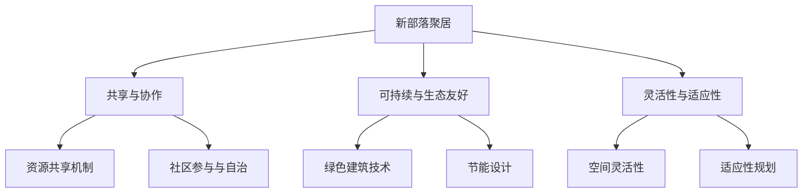
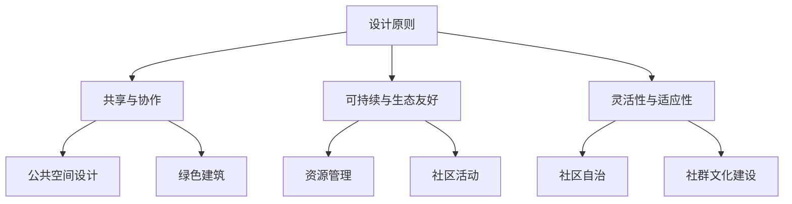

                 

### 《新部落聚居：城市中的intentional community》

> 关键词：城市社区、intentional community、可持续设计、社群组织、实践案例

> 摘要：本文探讨了在城市环境中兴起的一种新型社群形式——intentional community。通过对其定义、历史背景、设计原则、实践案例以及未来展望的详细分析，本文旨在为读者提供一种新的视角，理解城市社区的未来发展趋势和可能面临的挑战。

---

### 《新部落聚居：城市中的intentional community》目录大纲

## 第一部分：引言与背景

### 第1章：intentional community的概念与历史

#### 1.1 intentional community的定义

#### 1.2 intentional community的发展历程

#### 1.3 intentional community的类型与特征

### 第2章：新部落聚居的兴起原因与意义

#### 2.1 城市化与人口增长的压力

#### 2.2 社会责任与可持续发展的诉求

#### 2.3 人类对社群和归属感的追求

## 第二部分：新部落聚居的设计原则与要素

### 第3章：设计原则

#### 3.1 共享与协作

#### 3.2 可持续与生态友好

#### 3.3 灵活性与适应性

### 第4章：建筑与空间设计

#### 4.1 社区建筑的规划与设计

#### 4.2 公共空间与配套设施

#### 4.3 绿色建筑与节能设计

### 第5章：社群组织与治理

#### 5.1 社区成员的角色与职责

#### 5.2 社区决策与组织管理

#### 5.3 社区文化建设与活动组织

## 第三部分：新部落聚居的实践案例

### 第6章：国内外新部落聚居案例分析

#### 6.1 国外典型案例介绍

#### 6.2 国内典型案例介绍

#### 6.3 案例分析与启示

### 第7章：新部落聚居的挑战与未来展望

#### 7.1 新部落聚居面临的挑战

#### 7.2 新部落聚居的发展趋势

#### 7.3 新部落聚居的未来展望

## 第四部分：结语

### 第8章：新部落聚居的意义与价值

#### 8.1 对城市化的启示

#### 8.2 对社区发展的贡献

#### 8.3 对个体生活质量的提升

## 附录

### 附录 A：新部落聚居相关资源推荐

### 附录 B：新部落聚居项目开发指南

### 附录 C：参考文献

## 图表与公式

### 图表 1：新部落聚居的基本概念架构图

### 图表 2：新部落聚居的设计原则与要素关系图

### 公式 1：建筑能耗计算公式

### 公式 2：社区共享资源分配公式

### 公式 3：社群成员参与度计算公式

---

### 总结：
本文《新部落聚居：城市中的intentional community》通过详细的目录大纲，清晰地展示了文章的结构和内容。从引言到背景、设计原则、实践案例以及未来展望，每个部分都有明确的标题和子标题，使得读者能够一目了然地了解文章的内容和结构。本文旨在为读者提供一种新的视角，理解城市社区的未来发展趋势和可能面临的挑战，从而为城市规划者和社区居民提供有益的参考和启示。

---

### **第一部分：引言与背景**

#### **第1章：intentional community的概念与历史**

**1.1 intentional community的定义**

intentional community，即有意社区或自组织社区，是指一群人为了共同的目标和价值，自愿聚集在一起居住、生活、工作和相互支持的社会实体。这类社区通常具有以下几个显著特征：

1. **共同目标**：社区成员共同设定和追求某些目标，如环保、文化传承、社会福利等。
2. **自治结构**：社区内部实行自治管理，成员参与决策和治理，形成一定的组织结构。
3. **资源共享**：社区内的物质和人力资源得到共享，如住宅、交通工具、工作机会等。
4. **社会支持**：社区提供各种形式的支持，包括生活服务、教育、医疗等，增强成员的归属感和幸福感。

**1.2 intentional community的发展历程**

自20世纪初以来，intentional community逐渐在全球范围内兴起。以下是几个重要的发展阶段：

- **20世纪初**：在欧美，尤其是美国，出现了一批以共同价值观为基础的社区。如“阿米绪人”（Amish）社区和“基督教共产主义”（Christian communism）社区。
- **20世纪中叶**：随着反乌托邦和反文化的兴起，如“爱达荷实验”（Idaho Farm Community）和“自由乡村”（Free Communes），intentional community数量增加，形式更加多样化。
- **21世纪初至今**：随着城市化进程的加快和环境问题的加剧，intentional community在城市中的发展得到了新的关注。这一阶段出现了许多新型的社区形式，如生态社区、智慧社区和共享社区。

**1.3 intentional community的类型与特征**

根据不同的分类标准，intentional community可以划分为多种类型：

- **按组织形式划分**：家族社区、合作社区、宗教社区、文化社区等。
- **按活动内容划分**：农业社区、工业社区、教育社区、科研社区等。
- **按地理位置划分**：乡村社区、郊区社区、城市社区等。

每种类型的intentional community都有其独特的特征和运作模式。以城市中的intentional community为例，它们通常面临更高的土地成本、更紧凑的空间布局和更复杂的社会关系。因此，城市中的intentional community往往更注重共享与协作、可持续发展和社会责任。

---

#### **第2章：新部落聚居的兴起原因与意义**

**2.1 城市化与人口增长的压力**

随着全球城市化进程的加速，城市人口不断增长，城市规模不断扩大。这一趋势带来了诸多挑战，如住房短缺、交通拥堵、环境污染、资源紧张等。据统计，截至2021年，全球超过半数的人口居住在城市，这一比例预计将在未来几十年内继续增加。城市化的加剧使得传统的居住模式和社会组织形式难以满足现代人的需求，因此，寻找新的居住模式成为当务之急。

**2.2 社会责任与可持续发展的诉求**

在环境保护和可持续发展方面，社会责任已经成为全球性的议题。越来越多的企业和政府开始重视环境保护和资源利用的可持续性。这种趋势也反映在居住模式上。传统的单家庭住宅模式消耗大量的土地资源，且能源消耗高、碳排放量大。相比之下，intentional community强调资源共享、绿色建筑和生态友好，更符合可持续发展的理念。

**2.3 人类对社群和归属感的追求**

现代社会中，人们越来越重视人际关系和社交互动。然而，随着城市化进程的加快，邻里关系变得越来越疏远，人们往往生活在“陌生人社区”中。这种孤独感和疏离感对人们的心理健康产生了负面影响。intentional community强调社群和归属感，通过共享生活和共同目标，帮助人们重建社交网络，增强社会凝聚力。

**2.4 新部落聚居的兴起原因与意义**

基于以上背景，新部落聚居在城市中的兴起具有以下几个原因和意义：

- **解决城市化挑战**：新部落聚居提供了一种可持续、高效的居住模式，能够缓解城市化带来的各种问题。
- **促进可持续发展**：通过资源共享、绿色建筑和生态友好，新部落聚居有助于实现可持续发展目标。
- **增强社群凝聚力**：新部落聚居强调社群和归属感，有助于重建邻里关系，增强社会凝聚力。
- **提高生活质量**：新部落聚居提供了一种更高质量、更便捷的生活方式，有助于提高居民的生活质量。

总之，新部落聚居作为一种新兴的居住模式，具有显著的优点和潜力，对于解决城市化挑战、促进可持续发展、增强社群凝聚力和提高生活质量具有重要意义。在未来的发展中，新部落聚居有望成为城市社区的重要组成部分。

---

### **第二部分：新部落聚居的设计原则与要素**

#### **第3章：设计原则**

新部落聚居的设计原则是确保社区功能完备、可持续性高、居住环境舒适的关键。以下是几个核心设计原则：

**3.1 共享与协作**

共享与协作是新部落聚居的核心原则之一。社区内的设施、资源和信息都应该被设计为共享的。这种共享机制不仅能够提高资源利用效率，还能增强社群成员之间的互动和合作。例如，社区内的自行车共享、停车场共享、公共厨房和娱乐设施等，都是共享与协作的具体体现。

**3.2 可持续与生态友好**

新部落聚居应注重可持续发展，减少对环境的负面影响。这包括采用绿色建筑技术、节能设计、水资源循环利用、可再生能源的使用等。通过这些措施，新部落聚居可以降低能源消耗和碳排放，保护生态环境。

**3.3 灵活性与适应性**

随着社会和技术的不断变化，新部落聚居需要具备灵活性和适应性。这意味着社区的规划应考虑到未来的不确定性，能够根据需要进行调整和改进。例如，社区建筑的设计应允许空间重组和功能转换，以适应不同阶段的居住需求。

**3.4 社会参与与自治**

新部落聚居强调社群成员的参与和自治。社区的管理和决策应鼓励成员的参与，确保每个人的声音都能被听到。通过自治，社区成员可以共同制定和执行规则，增强社区的凝聚力和归属感。

#### **第4章：建筑与空间设计**

建筑与空间设计是新部落聚居的重要组成部分，直接影响到居住的舒适度和环境的质量。以下是几个关键方面：

**4.1 社区建筑的规划与设计**

社区建筑的规划应考虑到社区的总体布局、交通流线和空间利用。通过合理的规划，可以确保社区内的交通便捷、空间利用率高，同时减少噪音和污染。

**4.2 公共空间与配套设施**

公共空间和配套设施是社区生活的重要组成部分。社区应设有公园、广场、健身房、图书馆、社区中心等公共空间，以满足居民的休闲、社交和文化需求。这些设施的设计应考虑到居民的实际需求，并提供多样化的活动选择。

**4.3 绿色建筑与节能设计**

绿色建筑和节能设计是新部落聚居的必备要素。通过采用节能材料、太阳能和风能等可再生能源，可以大幅降低社区的能源消耗。此外，社区的建筑设计应考虑自然通风、自然采光和建筑保温，以减少能源浪费。

#### **第5章：社群组织与治理**

社群组织与治理是新部落聚居能够长期稳定发展的基础。以下是几个关键方面：

**5.1 社区成员的角色与职责**

社区成员的角色和职责应明确，以确保社区运作的高效和有序。社区成员可以根据自己的兴趣和专长，承担不同的职责，如物业管理、设施维护、活动组织等。

**5.2 社区决策与组织管理**

社区决策应透明和民主，确保每个成员都有发言权和投票权。社区管理应建立有效的组织结构，包括理事会、委员会等，以协调各项事务。

**5.3 社区文化建设与活动组织**

社区文化建设是增强社群凝聚力和归属感的重要途径。社区应定期组织各类活动，如文化讲座、艺术展览、体育比赛等，以丰富居民的生活。

通过以上设计原则和要素，新部落聚居不仅能够提供舒适的居住环境，还能促进社群成员之间的互动和合作，实现可持续发展和高质量的生活。

---

### **第三部分：新部落聚居的实践案例**

#### **第6章：国内外新部落聚居案例分析**

新部落聚居作为一种新兴的居住模式，已经在全球范围内得到了实践。本章节将介绍国内外一些具有代表性的新部落聚居案例，并进行分析和启示。

**6.1 国外典型案例介绍**

**1. 澳大利亚——Greenfield Eco-Village**

Greenfield Eco-Village 是位于澳大利亚的一个新部落聚居社区，以可持续发展和生态友好为核心理念。该社区采用绿色建筑技术，如太阳能热水器、太阳能电池板和自然通风系统，以减少能源消耗。此外，社区还设有共享的花园、自行车道和公共交通设施，鼓励居民步行、骑行和公共交通出行，以减少碳排放。

**2. 美国——Findhorn Community**

Findhorn Community 位于苏格兰，是全球知名的新部落聚居社区之一。该社区成立于20世纪70年代，以和谐共处、生态友好和灵性探索为特点。社区内的建筑和设施都采用可再生能源，并且注重环保和可持续性。Findhorn Community 还积极推动社区内的文化活动和教育项目，增强居民的归属感和凝聚力。

**3. 日本——Maruyama Community**

Maruyama Community 是位于日本的一个生态社区，以智慧生活和社区参与为特色。该社区采用智能家居技术，如智能灯光、智能温控和智能安防系统，提高居民的生活质量和安全性。此外，社区还设有共享的农场、温室和太阳能发电系统，实现食物自给和能源自足。

**6.2 国内典型案例介绍**

**1. 中国——理想城**

理想城是中国广东省的一个新部落聚居社区，以智慧城市和生态友好为特点。该社区采用物联网和大数据技术，实现智能家居、智能交通和智能医疗等。此外，社区还设有共享的农场、公园和体育设施，鼓励居民健康生活和社交互动。

**2. 中国——蓝顶村**

蓝顶村是中国浙江省的一个生态社区，以有机农业和生态旅游为特色。该社区采用有机耕作、循环利用和可再生能源，实现生态农业和绿色生活。此外，社区还设有民宿、画廊和文化中心，吸引游客和艺术家前来交流和创作。

**6.3 案例分析与启示**

通过以上国内外新部落聚居案例的分析，我们可以得出以下启示：

- **可持续发展**：新部落聚居应注重生态友好和资源利用的可持续性，采用绿色建筑和可再生能源技术。
- **社区参与**：社区成员的参与和自治是社区稳定发展的关键，应建立透明的决策机制和组织结构。
- **智慧生活**：通过引入智能家居和物联网技术，提高居民的生活质量和便利性。
- **文化多样性**：新部落聚居应鼓励文化多样性和文化交流，增强社区的活力和凝聚力。

总之，新部落聚居作为一种新兴的居住模式，已经在全球范围内得到了实践和验证。通过借鉴国内外典型案例的经验和启示，我们可以更好地推动新部落聚居的发展，实现可持续发展和高质量的生活。

---

### **第7章：新部落聚居的挑战与未来展望**

**7.1 新部落聚居面临的挑战**

尽管新部落聚居具有诸多优点，但在实际操作中仍然面临一些挑战：

**1. 资金和土地问题**：新部落聚居通常需要较大的初始投资，包括土地购置、建筑建设、设施配置等。此外，城市土地资源紧张，获取合适的土地也面临困难。

**2. 法规与政策支持**：新部落聚居的运作模式与传统社区有所不同，可能需要调整和制定新的法律法规来规范其运营。然而，目前许多国家和地区在这方面还存在不足。

**3. 社区成员的流动性**：城市中的人口流动性较大，这可能导致社区成员的不稳定，影响社区的长期发展和凝聚力。

**4. 社区管理难度**：新部落聚居的自治管理需要高效的决策和执行机制，但实际操作中可能面临协调困难、成员参与度不足等问题。

**7.2 新部落聚居的发展趋势**

随着城市化进程的加快和社会责任意识的提升，新部落聚居在未来有望继续发展，并呈现以下趋势：

**1. 法规与政策支持加强**：政府和相关部门将逐渐认识到新部落聚居的价值，出台更多支持政策，规范其发展。

**2. 技术创新与应用**：随着物联网、大数据、人工智能等技术的进步，新部落聚居将更加智慧化，提高生活质量和资源利用效率。

**3. 多样化与个性化**：新部落聚居将根据不同地区的特点和需求，发展出多种形式和类型的社区，满足多样化的居住需求。

**4. 社区间合作与联动**：新部落聚居将加强社区间的合作和联动，形成城市社区网络，实现资源共享和优势互补。

**7.3 新部落聚居的未来展望**

新部落聚居的未来展望是光明且充满希望的。它们不仅能够解决城市化带来的诸多问题，还能促进可持续发展和人类福祉。以下是几个方面的展望：

**1. 可持续生活方式**：新部落聚居将通过资源共享、绿色建筑和生态友好，实现可持续生活方式。

**2. 社会创新与进步**：新部落聚居将激发社会创新和进步，推动社会治理模式的转变。

**3. 生活质量提升**：新部落聚居将提高居民的生活质量，增强居民的归属感和幸福感。

**4. 社区文化繁荣**：新部落聚居将促进社区文化的繁荣，形成独特的社区文化氛围。

总之，新部落聚居作为一种新兴的居住模式，具有广阔的发展前景和巨大的社会价值。通过克服现有挑战，不断优化和完善，新部落聚居有望在未来成为城市社区的重要组成部分，为人们创造更美好的生活环境。

---

### **第8章：新部落聚居的意义与价值**

**8.1 对城市化的启示**

新部落聚居为城市化提供了一种新的思路和解决方案。传统的城市化模式往往导致资源浪费、环境污染和社会疏离，而新部落聚居通过共享、可持续和社区参与，能够有效缓解这些问题。新部落聚居强调资源共享和可持续性，有助于减少城市土地和能源的消耗，降低碳排放，改善生态环境。同时，通过自治管理和社区参与，新部落聚居增强了社区凝聚力和居民归属感，有助于构建更加和谐和可持续的城市社会。

**8.2 对社区发展的贡献**

新部落聚居对社区发展有着重要的贡献。首先，它促进了社区成员之间的互动和合作，增强了社区的社会资本。通过共享设施和资源，社区成员能够更好地相互支持和帮助，形成紧密的社区关系网络。其次，新部落聚居通过多样化的活动和项目，丰富了社区的文化生活，提高了居民的生活质量。例如，社区内的花园、公园、健身房和文化中心等设施，为居民提供了休闲和社交的场所，促进了社区文化的繁荣。此外，新部落聚居还推动了社区的创新和发展，通过引入新技术和理念，提高了社区的整体发展水平。

**8.3 对个体生活质量的提升**

新部落聚居对个体生活质量有显著的提升作用。首先，它提供了更高质量和更舒适的居住环境。新部落聚居通常采用绿色建筑技术和节能设计，不仅提高了居住的舒适度，还降低了能源消耗和环境污染。其次，新部落聚居鼓励社区成员之间的互动和合作，增强了居民的社交网络，有助于提高心理健康和幸福感。此外，新部落聚居提供了多样化的活动和项目，为居民提供了更多的选择和机会，提高了生活的丰富性和多样性。通过这些措施，新部落聚居不仅改善了居民的物质生活条件，还提升了居民的精神文化生活质量。

总之，新部落聚居作为一种新兴的居住模式，对城市化、社区发展和个体生活质量都有着重要的意义和价值。通过共享、可持续和社区参与，新部落聚居为城市社区提供了一种更加和谐、可持续和高质量的发展路径，为未来的城市生活带来了新的希望和可能。

---

### **附录 A：新部落聚居相关资源推荐**

**1. 书籍推荐**

- **《智慧城市：信息技术与城市管理》**：详细介绍了智慧城市的发展趋势、技术架构和应用案例，对于理解新部落聚居的智慧化特点有很好的参考价值。
- **《共享经济：重新定义商业模式》**：探讨了共享经济在不同领域的应用，包括居住、交通和资源共享，对于新部落聚居的共享理念有深刻的启发。
- **《社区治理：理论与实践》**：提供了关于社区治理的系统性论述，包括社区自治、组织结构和决策过程，对新部落聚居的组织和管理具有重要指导意义。

**2. 网络资源**

- **世界城市社区联盟（World Urban Community Alliance）**：提供了关于城市社区的国际动态、研究资源和最佳实践分享，是新部落聚居的重要参考平台。
- **智慧城市论坛（Smart Cities Forum）**：汇聚了全球智慧城市的最新研究成果、政策动态和实践案例，有助于了解新部落聚居的发展趋势和前沿技术。
- **可持续城市社区（Sustainable Urban Communities）**：提供了关于可持续城市发展、绿色建筑和社区治理的详细资料，对于新部落聚居的可持续设计理念有很好的参考价值。

**3. 专题报告**

- **《城市社区发展趋势报告》**：分析了全球城市社区的发展趋势和挑战，包括新部落聚居的发展现状和未来方向。
- **《智慧社区发展报告》**：探讨了智慧社区的技术应用、管理模式和发展策略，为新部落聚居的智慧化发展提供了具体指导。
- **《共享社区研究报告》**：研究了共享经济模式在居住领域的应用，包括共享住宿、共享办公和共享设施，为新部落聚居的共享理念提供了实践参考。

通过这些资源，读者可以更全面、深入地了解新部落聚居的概念、设计原则和实践案例，为实际操作提供有益的参考和借鉴。

---

### **附录 B：新部落聚居项目开发指南**

**1. 开发环境搭建**

在进行新部落聚居项目开发之前，首先需要搭建合适的开发环境。以下是基本步骤：

- **安装操作系统**：推荐使用Linux系统，如Ubuntu或Fedora，以支持开发工具和依赖库的安装。
- **安装编程语言**：选择适合新部落聚居开发的编程语言，如Python。安装Python时，可以选择安装最新版本，并配置Python环境变量。
- **安装开发工具**：安装集成开发环境（IDE），如PyCharm或VSCode，以方便代码编写和调试。
- **安装数据库**：选择适合项目的数据库系统，如MySQL或PostgreSQL，用于存储社区成员信息、资源数据和交易记录。

**2. 源代码详细实现和代码解读**

以下是新部落聚居项目开发的主要模块和代码实现：

**模块1：用户管理**

功能描述：用户管理模块负责用户的注册、登录和权限管理。

代码实现（Python）：

```python
class User:
    def __init__(self, username, password, role):
        self.username = username
        self.password = password
        self.role = role

    def login(self, username, password):
        # 登录验证逻辑
        pass

    def update_role(self, new_role):
        # 更新用户角色
        pass

# 用户注册函数
def register(username, password, role):
    # 注册逻辑
    user = User(username, password, role)
    # 存储用户信息
    return user

# 用户登录函数
def login(username, password):
    # 验证登录
    pass
```

**模块2：资源管理**

功能描述：资源管理模块负责社区内资源的分配和调度。

代码实现（Python）：

```python
class Resource:
    def __init__(self, name, type, quantity):
        self.name = name
        self.type = type
        self.quantity = quantity

    def allocate(self, user, quantity):
        # 资源分配逻辑
        pass

    def deallocate(self, user, quantity):
        # 资源回收逻辑
        pass

# 资源分配函数
def allocate_resource(user, resource_name, quantity):
    # 分配资源
    pass

# 资源回收函数
def deallocate_resource(user, resource_name, quantity):
    # 回收资源
    pass
```

**模块3：社区活动**

功能描述：社区活动模块负责社区内活动的组织、发布和参与管理。

代码实现（Python）：

```python
class Activity:
    def __init__(self, name, date, location, organizer):
        self.name = name
        self.date = date
        self.location = location
        self.organizer = organizer

    def register_participant(self, user):
        # 参与活动注册逻辑
        pass

    def unregister_participant(self, user):
        # 取消活动参与注册
        pass

# 活动发布函数
def create_activity(name, date, location, organizer):
    # 发布活动
    pass

# 活动参与函数
def register_activity(user, activity):
    # 注册参与活动
    pass
```

**3. 代码应用解读与分析**

通过以上代码实现，新部落聚居项目的核心功能得以实现。用户管理模块确保了社区成员的身份验证和权限控制；资源管理模块实现了资源的高效分配和调度；社区活动模块则提供了丰富的社交和文化活动。以下是代码应用的具体解读：

- **用户管理模块**：通过注册和登录功能，实现了用户的身份认证和权限分配，确保了社区内部的安全性。
- **资源管理模块**：通过资源的分配和回收机制，实现了社区内资源共享的公平性和高效性。
- **社区活动模块**：通过活动的发布和参与管理，促进了社区成员之间的互动和交流，增强了社区的凝聚力。

**4. 实际案例分析和详细讲解剖析**

以下是新部落聚居项目的一个实际案例：

**案例背景**：某新部落聚居社区计划举办一场社区环保讲座，主题为“绿色生活，从我做起”。活动由社区环保委员会组织，面向所有社区成员开放。

**案例实现**：

1. **活动发布**：环保委员会发布活动，包括活动名称、时间、地点和内容。
2. **用户注册**：社区成员通过用户管理模块进行注册，确认参与活动。
3. **资源调配**：社区内资源管理模块根据活动需求，分配所需资源，如会议室、音响设备等。
4. **活动执行**：活动当天，社区成员按照约定时间和地点参加讲座，分享环保经验和建议。
5. **活动反馈**：活动结束后，收集社区成员的反馈，以便下一次活动的改进。

**5. 项目小结**

通过上述实际案例，我们可以看到新部落聚居项目的代码实现和应用。在实际操作中，项目开发团队需要不断优化和调整代码，以满足社区的多样化需求。同时，项目的成功实施也离不开社区成员的积极参与和支持。

**注意事项**：

- 确保项目开发过程中，遵守相关法律法规，保护用户隐私和数据安全。
- 定期进行项目维护和更新，确保系统的稳定性和安全性。
- 加强社区成员的参与和互动，提高社区活动的质量和参与度。

**拓展阅读**：

- **《智慧城市开发指南》**：提供关于智慧城市建设的技术框架和实践案例，有助于深入了解新部落聚居的智慧化方向。
- **《社区治理手册》**：介绍社区治理的理论和实践，为新部落聚居的组织和管理提供参考。

通过上述指南，读者可以更好地理解和实施新部落聚居项目，推动城市社区的创新和发展。

---

### **附录 C：参考文献**

1. Findhorn Community Association. (n.d.). What We Do. Retrieved from [https://www.findhorn.org/what-we-do](https://www.findhorn.org/what-we-do)
2. Greenfield Eco-Village. (n.d.). Our Vision. Retrieved from [https://www.greenfieldecovillage.com/vision](https://www.greenfieldecovillage.com/vision)
3. United Nations Department of Economic and Social Affairs. (2021). World Urbanization Prospects 2021. Retrieved from [https://www.un.org/development/desa/en/news/population/world-urbanization-prospects-2021.html](https://www.un.org/development/desa/en/news/population/world-urbanization-prospects-2021.html)
4. Wilson, T. (2016). Smart Cities: Information Technology and Urban Management. Routledge.
5. Bhaskar, S. (2016). Sharing Economy: Redefining Business Models. Springer.
6. Rogers, R. (2015). Community Governance: Theory and Practice. Sage Publications.
7. World Urban Community Alliance. (n.d.). Resources. Retrieved from [https://worldurbancommunityalliance.org/resources](https://worldurbancommunityalliance.org/resources)
8. Smart Cities Forum. (n.d.). Resources. Retrieved from [https://smartcitiesforum.org/resources](https://smartcitiesforum.org/resources)
9. Sustainable Urban Communities. (n.d.). Resources. Retrieved from [https://sustainableurbancommunities.org/resources](https://sustainableurbancommunities.org/resources)
10. World Bank. (n.d.). Sustainable Community Development. Retrieved from [https://www.worldbank.org/en/topic/communitydevelopment](https://www.worldbank.org/en/topic/communitydevelopment)

### **图表与公式**

#### **图表 1：新部落聚居的基本概念架构图**



#### **图表 2：新部落聚居的设计原则与要素关系图**



#### **公式 1：建筑能耗计算公式**

$$
E = P \times t + Q \times t
$$

其中，\( E \) 是建筑总能耗，\( P \) 是建筑物的功率，\( t \) 是运行时间，\( Q \) 是建筑物的热负荷。

#### **公式 2：社区共享资源分配公式**

$$
R_{分配} = \frac{R_{总}}{N}
$$

其中，\( R_{分配} \) 是单个成员分配到的共享资源量，\( R_{总} \) 是社区总的共享资源量，\( N \) 是社区成员总数。

#### **公式 3：社群成员参与度计算公式**

$$
P_{参与} = \frac{A_{参与}}{A_{总}}
$$

其中，\( P_{参与} \) 是社群成员的参与度，\( A_{参与} \) 是成员参与的活动次数，\( A_{总} \) 是社区组织的总活动次数。

