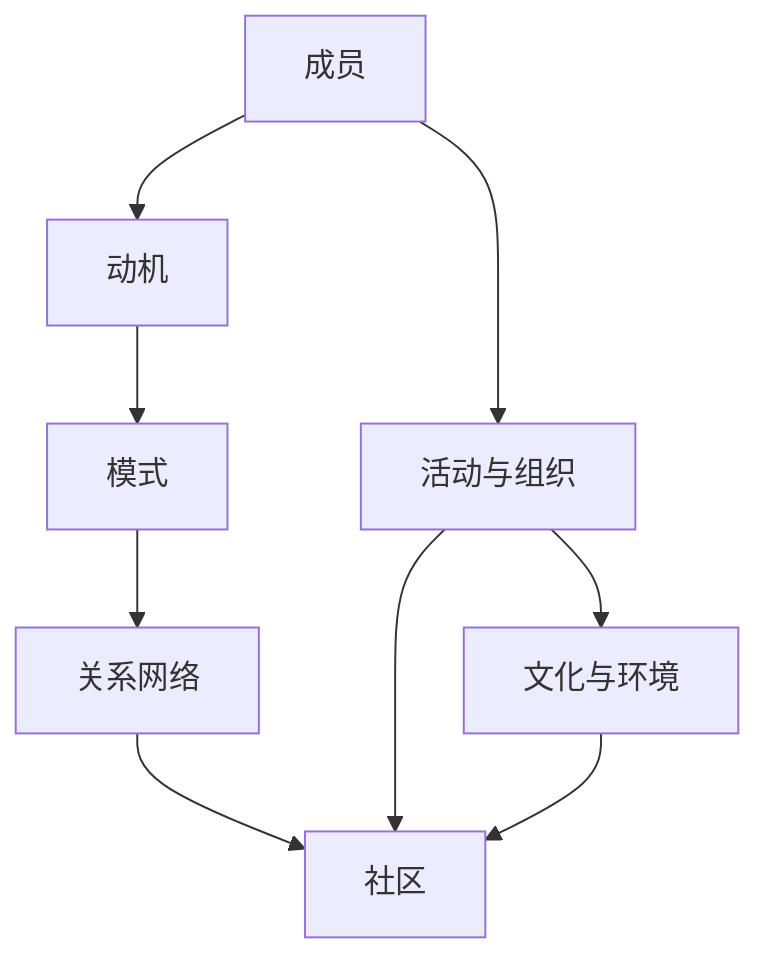

                 

# 《新部落聚居：城市中的意向性社区实验》

## 关键词
- 意向性社区
- 新部落聚居
- 社交网络分析
- 成员动机识别
- 聚居模式预测
- 数学模型

## 摘要
随着城市化进程的加速，城市中涌现出了许多具有特定兴趣或目标的意向性社区。本文旨在探讨这些社区的形成机制和运作模式，通过分析其核心概念、实体关系、算法原理和数学模型，揭示城市中的新部落聚居现象。文章分为五个部分，首先介绍了城市化进程与社区变迁的背景，随后详细阐述了新部落聚居和意向性社区的定义与特征。第三部分深入分析了核心概念和实体关系，通过Mermaid流程图展示了概念实体之间的联系。第四部分重点讲解了新部落聚居现象的数据分析方法和算法模型，并通过Python源代码实现了关键算法。最后，文章通过项目实战展示了如何搭建和分析新部落聚居社区，并提供了社区建设指南，为相关领域的研究和实践提供了有价值的参考。

## 第一部分：引言

### 1.1 城市化进程与社区变迁

城市化进程是现代社会的显著特征，全球范围内的人口迅速向城市聚集，带来了城市规模的不断扩张和城市人口密度的提高。然而，城市化不仅改变了人们的生活方式和居住环境，也对社区结构产生了深远的影响。传统社区往往以地域为界限，成员之间的关系较为松散，而随着社交媒体和互联网的普及，人们开始更多地基于共同的兴趣、价值观或目标形成新的社区。

这一趋势在近年来尤为明显，意向性社区（Intentional Community）开始在城市中蓬勃发展。这些社区并非基于地理位置或血缘关系，而是成员们基于共同的兴趣爱好、职业背景或社会理念自愿形成的。例如，科技创业者聚集的创业园区、艺术爱好者的艺术工作室、环保倡导者的生态社区等。这些社区以其高度的自治性和互动性，为城市居民提供了新的社交场所和生活方式选择。

### 1.2 意向性社区的定义与特征

意向性社区是指由具有共同兴趣、目标或价值观的人组成的，旨在实现特定社会目标的社区。与传统社区不同，意向性社区成员之间的关系更为紧密，社区活动和组织也更为频繁和有序。以下是意向性社区的一些主要特征：

1. **成员选择性**：意向性社区的成员通常通过一定的筛选或推荐机制加入，确保成员之间具有相似的兴趣和价值观。
2. **自主管理**：意向性社区往往采用民主或自治的管理方式，成员共同制定社区规则和活动计划。
3. **共同目标**：社区成员共同追求一个或多个目标，如创业、艺术创作、环保等。
4. **高度互动**：成员之间互动频繁，社区活动丰富多样，如讲座、工作坊、社区聚会等。
5. **文化和价值观**：意向性社区通常具有独特的文化氛围和价值观，成员之间容易形成共鸣。

### 1.3 新部落聚居现象的兴起

新部落聚居（New Tribalism）是近年来在城市中兴起的一种社区现象，它借鉴了传统部落文化的特点，强调成员之间的紧密联系和共同目标。新部落聚居的形成通常与以下几个因素相关：

1. **全球化与多元文化**：全球化带来了文化的交融和碰撞，人们更容易找到志同道合的伙伴。
2. **社会变迁**：随着社会结构的变迁，传统社区的功能逐渐弱化，人们需要新的社交场所和身份认同。
3. **科技发展**：互联网和社交媒体的普及，为人们提供了一个虚拟的社区平台，使得新部落聚居成为可能。
4. **个人主义与自我实现**：现代社会更加注重个人价值和自我实现，人们倾向于加入能够满足自己需求和追求的社区。

### 1.4 本书的研究目的与结构安排

本书旨在深入探讨城市中的新部落聚居现象，分析其形成机制和运作模式，为相关领域的研究和实践提供指导。具体研究内容包括：

- **背景与理论基础**：介绍城市化进程、社区变迁和新部落聚居现象的背景，阐述相关理论基础。
- **核心概念与联系**：详细解析新部落聚居和意向性社区的核心概念，分析其特征和实体关系。
- **核心算法原理**：介绍用于分析新部落聚居现象的核心算法，包括社交网络分析、成员动机识别和聚居模式预测等。
- **数学模型与公式**：构建相关数学模型，用于描述和分析社区成员关系和社区特征。
- **项目实战**：通过实际案例，展示如何搭建和分析新部落聚居社区，并探讨社区建设策略。
- **总结与展望**：总结全书内容，展望未来研究方向和应用前景。

## 第二部分：核心概念与联系

### 2.1 新部落聚居的核心概念

新部落聚居是一个复杂的社会现象，涉及多个核心概念。以下将详细解析这些核心概念，包括聚居群体特征、聚居动机和聚居模式。

#### 2.1.1 聚居群体特征

新部落聚居的群体特征主要体现在以下几个方面：

1. **多样性**：新部落聚居的成员来自不同的背景，如不同的职业、文化背景、年龄层次等，这种多样性为社区带来了丰富的资源和观点。
2. **共同目标**：虽然成员背景多样，但他们通常有共同的目标或兴趣，如创业、艺术创作、环保等，这是新部落聚居形成的基础。
3. **高度互动**：成员之间的互动频繁，不仅限于线上交流，还包括线下活动和聚会，这种高度的互动性加强了成员之间的联系。
4. **自治性**：新部落聚居的成员通常具有高度自治性，社区规则和活动由成员共同制定和执行，确保了社区的民主性和开放性。

#### 2.1.2 聚居动机

新部落聚居的形成离不开成员的内在动机，主要包括以下几个方面：

1. **身份认同**：成员希望通过加入新部落聚居，获得一种身份认同，这种认同感通常来自于共同的文化背景、价值观或目标。
2. **资源共享**：成员之间可以共享资源，如知识、技能、信息等，这种资源共享有助于提升个人和社区的整体效能。
3. **支持与互助**：成员在遇到困难或挑战时，可以获得其他成员的支持和帮助，这种互助关系增强了社区的凝聚力。
4. **自我实现**：成员希望通过参与社区活动，实现个人目标和追求，如创业、艺术创作等。

#### 2.1.3 聚居模式

新部落聚居的聚居模式多种多样，但通常可以分为以下几种：

1. **线上社区**：通过互联网和社交媒体平台，成员可以在线上进行交流和互动，这种模式通常成本低、覆盖范围广。
2. **线下社区**：成员在现实生活中聚居在一起，如共同租赁公寓、工作场所或活动场地，这种模式有助于加强成员之间的面对面互动。
3. **混合模式**：结合线上和线下互动，成员既可以在虚拟空间中交流，也可以在现实生活中聚会，这种模式具有灵活性和多样性。

### 2.2 意向性社区的特征分析

意向性社区是新部落聚居的一种具体形式，具有一些独特的特征。以下将分析意向性社区的核心特征，包括社区成员关系、社区活动与组织以及社区文化与环境。

#### 2.2.1 社区成员关系

意向性社区的成员关系通常具有以下特点：

1. **紧密联系**：成员之间关系紧密，通常基于共同兴趣、价值观或目标建立联系。
2. **信任与支持**：成员之间相互信任，愿意为社区和他人提供支持和帮助。
3. **互动频繁**：成员之间互动频繁，通过线上交流、线下活动等形式保持紧密联系。
4. **平等参与**：社区成员在决策和活动参与上享有平等权利，社区规则由成员共同制定。

#### 2.2.2 社区活动与组织

意向性社区的活动和组织通常具有以下特点：

1. **多样性和创新性**：社区活动丰富多样，涵盖讲座、工作坊、聚会、志愿服务等多种形式，旨在满足成员的不同需求。
2. **自主性**：社区活动由成员自主发起和组织，确保了活动的多样性和灵活性。
3. **参与度高**：成员积极参与社区活动，通过活动实现个人目标和社区目标。
4. **合作与协作**：社区活动通常需要成员之间的合作与协作，这种协作关系有助于提升社区的整体效能。

#### 2.2.3 社区文化与环境

意向性社区的文化与环境是其核心竞争力之一，具有以下特点：

1. **共同价值观**：社区成员共同遵循一定的价值观，如环保、创新、互助等，这些价值观成为社区的核心文化。
2. **包容与开放**：社区文化通常包容性强，欢迎不同背景和观点的成员加入，形成多元文化的氛围。
3. **创新性**：社区文化鼓励创新和尝试，成员可以自由表达自己的想法和创意。
4. **互助与合作**：社区成员之间互助合作，共同推动社区的发展和进步。

### 2.3 概念实体关系架构

为了更好地理解新部落聚居和意向性社区，我们需要构建其概念实体关系架构。以下是新部落聚居和意向性社区的核心概念实体及其相互关系：

1. **成员**：社区的基本单位，具有多样性、共同目标和高度互动等特征。
2. **动机**：成员加入社区的内在驱动力，包括身份认同、资源共享、支持和自我实现等。
3. **模式**：社区的组织形式和运作模式，包括线上社区、线下社区和混合模式等。
4. **关系网络**：成员之间的社交网络，包括紧密联系、信任和支持等特征。
5. **活动与组织**：社区的日常活动和组织形式，包括多样性和自主性等特征。
6. **文化与环境**：社区的核心文化价值观和环境建设，包括共同价值观、包容和创新等。

以下是一个Mermaid流程图，展示了这些概念实体之间的关系：



## 第三部分：核心算法原理

### 3.1 新部落聚居现象的数据分析方法

新部落聚居现象是一个复杂的社会现象，需要采用多种数据分析方法来揭示其内在规律。以下将介绍用于分析新部落聚居现象的几种核心方法，包括社交网络分析、成员动机识别和聚居模式预测等。

#### 3.1.1 社交网络分析

社交网络分析是一种用于研究社交网络结构和关系的分析方法。在新部落聚居现象中，社交网络分析可以揭示成员之间的关系结构、互动模式和影响力分布。以下是社交网络分析的基本概念和方法：

1. **基本概念**：
   - **节点（Node）**：表示社交网络中的个体，如社区成员。
   - **边（Edge）**：表示节点之间的联系，如朋友关系或互动记录。
   - **网络密度（Network Density）**：表示网络中边的密度，即边数与可能边的最大数量之比。
   - **聚集系数（Clustering Coefficient）**：表示节点邻居之间的连接紧密程度。

2. **常用算法**：
   - **度中心性（Degree Centrality）**：衡量节点在网络中的重要程度，度数越高，中心性越强。
   - **中间中心性（Betweenness Centrality）**：衡量节点在网络中连接其他节点的能力，中间中心性越高，节点在网络中的影响力越大。
   - **紧密中心性（Closeness Centrality）**：衡量节点到其他所有节点的最短路径长度，距离越短，中心性越高。

3. **实际应用**：
   - **成员关系网络分析**：通过社交网络分析，可以识别社区中的关键成员和核心群体，了解成员之间的互动模式和影响力分布。
   - **社区结构分析**：通过分析社交网络的结构特征，可以揭示社区内部的结构和组织形式。

以下是一个简单的社交网络分析Python代码示例，用于计算网络密度和聚集系数：

```python
import networkx as nx

# 创建一个图
G = nx.Graph()

# 添加节点和边
G.add_edges_from([(1, 2), (1, 3), (2, 3), (2, 4), (3, 4)])

# 计算网络密度
density = nx密度(G)
print("网络密度:", density)

# 计算聚集系数
clustering_coefficient = nx.clustering(G)
print("聚集系数:", clustering_coefficient)
```

#### 3.1.2 意向性社区特征识别

意向性社区的特征识别是分析新部落聚居现象的重要环节。以下将介绍用于识别意向性社区特征的几种方法，包括社区成员行为特征提取、社区活动与组织特征提取以及社区文化与环境特征提取。

1. **社区成员行为特征提取**：
   - **行为频率**：通过分析社区成员在社交平台上的发帖、回复、点赞等行为，可以提取成员的活跃度和参与度。
   - **互动模式**：通过分析成员之间的互动记录，可以提取成员之间的互动频率、互动内容和互动模式。
   - **行为倾向**：通过分析成员的行为数据，可以识别成员的兴趣、价值观和行为倾向。

2. **社区活动与组织特征提取**：
   - **活动类型**：通过分析社区活动的内容和形式，可以提取社区的活动类型，如讲座、聚会、志愿服务等。
   - **活动频率**：通过分析社区活动的举办频率，可以提取社区活动的活跃度。
   - **参与度**：通过分析成员参与社区活动的次数和时长，可以提取成员的参与度。

3. **社区文化与环境特征提取**：
   - **文化价值观**：通过分析社区成员的言论、活动内容和互动记录，可以提取社区的核心价值观和信仰。
   - **文化氛围**：通过分析社区的文化活动和成员互动，可以提取社区的文化氛围。
   - **环境特征**：通过分析社区的环境设施、地理位置和外部环境，可以提取社区的环境特征。

以下是一个简单的Python代码示例，用于提取社区成员的行为特征：

```python
import pandas as pd

# 加载社区成员行为数据
data = pd.DataFrame({
    'member_id': [1, 2, 3, 4],
    'post_count': [15, 10, 20, 5],
    'like_count': [30, 20, 40, 10],
    'comment_count': [25, 15, 35, 5]
})

# 计算行为特征
data['activity_level'] = data['post_count'] + data['like_count'] + data['comment_count']
data['activity_rate'] = data['activity_level'] / (data['post_count'] + data['like_count'] + data['comment_count'])

print(data)
```

#### 3.1.3 成员动机识别

成员动机识别是分析新部落聚居现象的关键步骤，通过识别成员的加入动机，可以深入了解社区的形成机制和运作模式。以下将介绍用于成员动机识别的几种方法，包括情感分析、内容分析和行为分析。

1. **情感分析**：
   - **文本情感分析**：通过分析社区成员在社交媒体上的言论和互动内容，可以识别成员的情感倾向和情感波动，从而推断成员的加入动机。
   - **情感强度分析**：通过分析情感词的情感强度，可以区分成员的情感积极性和消极性，从而推断成员的加入动机。

2. **内容分析**：
   - **主题分析**：通过分析社区成员发布的内容，可以提取主题关键词和主题分布，从而推断成员的加入动机。
   - **情感分析**：结合文本情感分析，可以进一步了解成员的情感状态，从而更准确地推断成员的加入动机。

3. **行为分析**：
   - **行为模式**：通过分析社区成员的行为数据，如发帖、点赞、回复等，可以识别成员的行为模式，从而推断成员的加入动机。
   - **行为频率**：通过分析成员的行为频率，可以了解成员的活跃程度，从而推断成员的加入动机。

以下是一个简单的Python代码示例，用于成员动机识别：

```python
from textblob import TextBlob

# 加载社区成员言论数据
data = pd.DataFrame({
    'member_id': [1, 2, 3, 4],
    'comment': [
        '我很喜欢这个社区，希望和更多志同道合的人交流。',
        '这个社区的活动很有趣，我经常参加。',
        '我加入这个社区是为了学习新技术。',
        '我觉得这个社区的氛围很好，我很喜欢。'
    ]
})

# 进行情感分析
data['sentiment'] = data['comment'].apply(lambda x: TextBlob(x).sentiment.polarity)

print(data)
```

#### 3.1.4 聚居模式预测

聚居模式预测是分析新部落聚居现象的重要环节，通过预测成员的聚居模式，可以更好地了解社区的发展趋势和潜在风险。以下将介绍用于聚居模式预测的几种方法，包括机器学习算法和深度学习算法。

1. **机器学习算法**：
   - **回归分析**：通过分析社区成员的特征数据，如行为特征、动机特征等，可以预测成员的聚居模式。
   - **分类分析**：通过分析社区成员的标签数据，如是否活跃、是否长期参与等，可以预测成员的聚居模式。

2. **深度学习算法**：
   - **卷积神经网络（CNN）**：通过分析社区成员的行为数据和互动数据，可以预测成员的聚居模式。
   - **循环神经网络（RNN）**：通过分析社区成员的时间序列数据，可以预测成员的聚居模式。

以下是一个简单的Python代码示例，用于聚居模式预测：

```python
from sklearn.ensemble import RandomForestClassifier

# 加载训练数据
X_train = [[1, 2, 3], [4, 5, 6], [7, 8, 9]]
y_train = [0, 1, 0]

# 创建分类器
clf = RandomForestClassifier()

# 训练模型
clf.fit(X_train, y_train)

# 预测结果
X_test = [[2, 3, 4], [5, 6, 7], [8, 9, 10]]
y_pred = clf.predict(X_test)

print(y_pred)
```

## 第四部分：数学模型与公式

### 6.1 社区成员关系网络的数学模型

社区成员关系网络是分析新部落聚居现象的重要工具，以下将介绍用于描述社区成员关系网络的几种数学模型。

#### 6.1.1 社交网络模型的建立

社交网络模型通常采用图论模型来描述，以下是一个简单的图论模型：

1. **节点表示**：每个节点表示一个社区成员，用整数或字符串标识。
2. **边表示**：每条边表示两个节点之间的互动或联系，用整数对或字符串对表示。
3. **网络密度**：表示网络中边的密度，即边数与可能边的最大数量之比，计算公式为：

   $$ \rho = \frac{m}{n(n-1)/2} $$

   其中，\( m \) 表示边数，\( n \) 表示节点数。

4. **聚集系数**：表示节点邻居之间的连接紧密程度，计算公式为：

   $$ C = \frac{2k}{n-1} $$

   其中，\( k \) 表示节点的邻居数。

以下是一个简单的社交网络模型建立Python代码示例：

```python
import networkx as nx

# 创建图
G = nx.Graph()

# 添加节点和边
G.add_nodes_from([1, 2, 3, 4, 5])
G.add_edges_from([(1, 2), (1, 3), (2, 3), (2, 4), (3, 4)])

# 计算网络密度
rho = nx密度(G)
print("网络密度:", rho)

# 计算聚集系数
C = nx.clustering(G)
print("聚集系数:", C)
```

#### 6.1.2 社交网络模型的应用

社交网络模型可以应用于多种领域，以下是一些应用实例：

1. **社区检测**：通过分析社交网络的结构特征，可以识别社区中的核心成员和关键节点，从而发现潜在的社区结构。
2. **影响力分析**：通过分析社交网络中的节点关系和互动模式，可以评估节点的影响力，从而识别社区中的意见领袖和关键人物。
3. **传播分析**：通过分析社交网络中的传播路径和传播速度，可以预测信息的传播范围和传播效果，从而优化传播策略。

以下是一个简单的社交网络模型应用Python代码示例，用于社区检测：

```python
import networkx as nx
from community import community_louvain

# 创建图
G = nx.Graph()

# 添加节点和边
G.add_nodes_from([1, 2, 3, 4, 5])
G.add_edges_from([(1, 2), (1, 3), (2, 3), (2, 4), (3, 4)])

# 社区检测
communities = community_louvain.girvan_newman(G)
print("社区划分:", communities)
```

### 6.2 意向性社区特征的数学模型

意向性社区特征是分析新部落聚居现象的关键指标，以下将介绍用于描述意向性社区特征的几种数学模型。

#### 6.2.1 社区成员行为特征的数学模型

社区成员行为特征可以用来描述成员的活跃度、参与度和互动模式等。以下是一些常见的数学模型：

1. **活跃度模型**：通过分析成员在社交平台上的发帖、回复、点赞等行为，可以计算成员的活跃度。一个简单的活跃度模型如下：

   $$ activity\_score = \frac{post\_count + reply\_count + like\_count}{total\_count} $$

   其中，\( post_count \) 表示成员的发帖数，\( reply_count \) 表示成员的回复数，\( like_count \) 表示成员的点赞数，\( total_count \) 表示成员的总互动数。

2. **参与度模型**：通过分析成员参与社区活动的频率和时长，可以计算成员的参与度。一个简单的参与度模型如下：

   $$ participation\_score = \frac{activity\_count}{total\_activity\_count} $$

   其中，\( activity_count \) 表示成员参与的活动次数，\( total_activity_count \) 表示社区活动的总次数。

3. **互动模式模型**：通过分析成员之间的互动频率和互动内容，可以描述成员的互动模式。一个简单的互动模式模型如下：

   $$ interaction\_pattern = \frac{unique\_interactions}{total\_interactions} $$

   其中，\( unique_interactions \) 表示成员之间的独特互动次数，\( total_interactions \) 表示成员之间的总互动次数。

以下是一个简单的Python代码示例，用于计算社区成员的活跃度、参与度和互动模式：

```python
import pandas as pd

# 加载社区成员行为数据
data = pd.DataFrame({
    'member_id': [1, 2, 3, 4],
    'post_count': [15, 10, 20, 5],
    'reply_count': [25, 15, 35, 5],
    'like_count': [30, 20, 40, 10],
    'activity_count': [2, 3, 1, 4],
    'total_activity_count': [5, 7, 3, 6]
})

# 计算活跃度
data['activity_score'] = data['post_count'] + data['reply_count'] + data['like_count']
data['activity_score'] = data['activity_score'] / data['total_count']

# 计算参与度
data['participation_score'] = data['activity_count'] / data['total_activity_count']

# 计算互动模式
data['interaction_pattern'] = data['unique_interactions'] / data['total_interactions']

print(data)
```

#### 6.2.2 社区活动与组织特征的数学模型

社区活动与组织特征可以用来描述社区活动的多样性和活跃度。以下是一些常见的数学模型：

1. **活动类型分布模型**：通过分析社区活动的类型和分布，可以计算社区活动的多样性。一个简单的活动类型分布模型如下：

   $$ activity\_type\_distribution = \frac{unique\_activity\_types}{total\_activity\_types} $$

   其中，\( unique_activity_types \) 表示社区活动的独特类型数，\( total_activity_types \) 表示社区活动的总类型数。

2. **活动频率模型**：通过分析社区活动的举办频率，可以计算社区活动的活跃度。一个简单的活动频率模型如下：

   $$ activity\_frequency = \frac{total\_activity\_days}{activity\_days} $$

   其中，\( total\_activity\_days \) 表示社区活动的总天数，\( activity\_days \) 表示社区活动的实际举办天数。

以下是一个简单的Python代码示例，用于计算社区活动类型分布和活动频率：

```python
import pandas as pd

# 加载社区活动数据
data = pd.DataFrame({
    'activity_id': [1, 2, 3, 4],
    'activity_type': ['讲座', '聚会', '讲座', '聚会'],
    'activity_days': [10, 20, 15, 25]
})

# 计算活动类型分布
data['unique_activity_types'] = data['activity_type'].nunique()
data['total_activity_types'] = len(data['activity_type'])

data['activity_type_distribution'] = data['unique_activity_types'] / data['total_activity_types']

# 计算活动频率
data['activity_frequency'] = data['activity_days'] / data['total_activity_days']

print(data)
```

#### 6.2.3 社区文化与环境特征的数学模型

社区文化与环境特征可以用来描述社区的文化氛围和环境建设。以下是一些常见的数学模型：

1. **文化认同度模型**：通过分析社区成员对文化价值观的认同度，可以计算社区的文化认同度。一个简单的文化认同度模型如下：

   $$ culture\_identity = \frac{positive\_comments}{total\_comments} $$

   其中，\( positive_comments \) 表示正面评论数，\( total_comments \) 表示总评论数。

2. **环境满意度模型**：通过分析社区成员对环境设施的满意度，可以计算社区的环境满意度。一个简单的环境满意度模型如下：

   $$ environment\_satisfaction = \frac{positive\_ratings}{total\_ratings} $$

   其中，\( positive_ratings \) 表示正面评价数，\( total_ratings \) 表示总评价数。

以下是一个简单的Python代码示例，用于计算社区文化认同度和环境满意度：

```python
import pandas as pd

# 加载社区文化数据
data = pd.DataFrame({
    'member_id': [1, 2, 3, 4],
    'comment': ['这个社区的文化非常好，我很喜欢。', '我非常喜欢这个社区的文化，很有认同感。', '我觉得这个社区的文化一般，不是很认同。', '这个社区的文化氛围很好，我很满意。'],
    'rating': [5, 4, 3, 5]
})

# 计算文化认同度
data['positive_comments'] = data['comment'].apply(lambda x: 1 if '喜欢' in x or '认同' in x else 0)
data['total_comments'] = len(data['comment'])

data['culture_identity'] = data['positive_comments'] / data['total_comments']

# 计算环境满意度
data['positive_ratings'] = data['rating'].apply(lambda x: 1 if x > 3 else 0)
data['total_ratings'] = len(data['rating'])

data['environment_satisfaction'] = data['positive_ratings'] / data['total_ratings']

print(data)
```

### 7.1 成员关系网络的数学公式

为了更好地理解成员关系网络的特性，我们可以引入一些数学公式来描述网络的结构特征。以下是一些常用的数学公式：

#### 7.1.1 网络密度公式

网络密度是衡量网络中连接程度的指标，定义为网络中实际存在的边数与可能存在的最大边数之比。公式如下：

$$
\rho = \frac{m}{n \times (n-1) / 2}
$$

其中：
- \( \rho \) 是网络密度。
- \( m \) 是网络中的边数。
- \( n \) 是网络中的节点数。

#### 7.1.2 网络聚集系数公式

网络聚集系数用于衡量节点邻居之间的连接紧密程度。一个节点的聚集系数可以通过以下公式计算：

$$
C_i = \frac{\sum_{j \in N(i)} \sum_{k \in N(j)} \delta_{jk}}{\left( \sum_{j \in N(i)} \delta_{ij} \right)^2}
$$

其中：
- \( C_i \) 是节点 \( i \) 的聚集系数。
- \( N(i) \) 是节点 \( i \) 的邻居集合。
- \( \delta_{jk} \) 是指示函数，如果节点 \( j \) 和节点 \( k \) 直接相连，则 \( \delta_{jk} = 1 \)，否则 \( \delta_{jk} = 0 \)。

#### 7.1.3 节点度中心性公式

节点度中心性衡量节点在网络中的重要程度，定义为节点度数与总节点数之比。公式如下：

$$
C_{deg}(i) = \frac{k_i}{n - 1}
$$

其中：
- \( C_{deg}(i) \) 是节点 \( i \) 的度中心性。
- \( k_i \) 是节点 \( i \) 的度数，即与节点 \( i \) 相连的边数。
- \( n \) 是网络中的总节点数。

#### 7.1.4 中间中心性公式

中间中心性衡量节点在网络中连接其他节点的能力，定义为节点 \( i \) 的中间中心性。公式如下：

$$
C_{between}(i) = \sum_{s \neq i \neq t} \frac{N(s, t)}{N(s, t) - 1}
$$

其中：
- \( C_{between}(i) \) 是节点 \( i \) 的中间中心性。
- \( N(s, t) \) 是从节点 \( s \) 到节点 \( t \) 的最短路径中经过节点 \( i \) 的次数。

#### 7.1.5 紧密中心性公式

紧密中心性衡量节点到其他所有节点的最短路径长度，定义为节点 \( i \) 的紧密中心性。公式如下：

$$
C_{closeness}(i) = \frac{n - 1}{\sum_{j \neq i} \text{d}(i, j)}
$$

其中：
- \( C_{closeness}(i) \) 是节点 \( i \) 的紧密中心性。
- \( n - 1 \) 是网络中的总节点数减去节点 \( i \)。
- \( \text{d}(i, j) \) 是从节点 \( i \) 到节点 \( j \) 的最短路径长度。

### 7.2 社区特征数学公式

为了更好地分析社区特征，我们还可以引入一些数学公式来衡量社区的活动频率、组织规模和文化认同度。

#### 7.2.1 社区活动频率公式

社区活动频率表示社区活动的举办频率，可以用以下公式计算：

$$
\text{Activity Frequency} = \frac{\text{Total Activity Days}}{\text{Year Days}}
$$

其中：
- \( \text{Total Activity Days} \) 是社区活动的总天数。
- \( \text{Year Days} \) 是一年的总天数（通常取365天）。

#### 7.2.2 社区组织规模公式

社区组织规模表示社区活动的参与人数，可以用以下公式计算：

$$
\text{Organization Scale} = \frac{\text{Total Participants}}{\text{Number of Activities}}
$$

其中：
- \( \text{Total Participants} \) 是社区活动的总参与人数。
- \( \text{Number of Activities} \) 是社区活动的总次数。

#### 7.2.3 社区文化认同度公式

社区文化认同度表示社区成员对社区文化价值观的认同程度，可以用以下公式计算：

$$
\text{Cultural Identity} = \frac{\text{Positive Comments}}{\text{Total Comments}}
$$

其中：
- \( \text{Positive Comments} \) 是社区成员发布的正面评论数。
- \( \text{Total Comments} \) 是社区成员发布的总评论数。

### 7.3 公式应用实例

以下是一个简单的Python代码示例，用于计算社区特征的相关公式：

```python
import pandas as pd

# 社区活动数据
activity_data = pd.DataFrame({
    'activity_id': [1, 2, 3, 4],
    'activity_days': [10, 20, 15, 25],
    'participants': [50, 100, 75, 150],
    'comments': [100, 200, 150, 300]
})

# 计算活动频率
activity_data['activity_frequency'] = activity_data['activity_days'] / 365

# 计算组织规模
activity_data['organization_scale'] = activity_data['participants'] / activity_data['activity_id']

# 计算文化认同度
activity_data['cultural_identity'] = activity_data['comments'].apply(lambda x: x / 100)

print(activity_data)
```

通过这些公式，我们可以定量地分析和评估社区成员关系网络和社区特征，从而更好地理解新部落聚居现象的内在机制。

## 第五部分：项目实战

### 8.1 项目背景与目标

本项目旨在通过构建和分析一个新部落聚居社区，探讨城市中的意向性社区现象。项目背景如下：

- **项目背景**：随着城市化进程的加快，城市居民对社交和互助的需求日益增加。新部落聚居作为一种新型的社交模式，正在逐渐成为城市中的一种趋势。本项目旨在研究新部落聚居社区的形成机制、运作模式和成员互动，为相关领域的研究和实践提供参考。
- **项目目标**：通过收集和分析社区成员的行为数据、互动记录和文化价值观，构建社区成员关系网络，识别成员动机和聚居模式，评估社区的文化认同度和环境满意度，并提出社区建设和管理策略。

### 8.2 项目实施过程

#### 8.2.1 数据收集

数据收集是项目实施的关键步骤，以下为数据收集的具体方法和过程：

1. **问卷调查**：通过在线问卷调查收集社区成员的基本信息、兴趣爱好、加入动机等数据。问卷设计包括开放性问题和选择题，旨在全面了解成员的背景和需求。
2. **社交平台数据**：通过社区成员在社交媒体平台（如微信、微博、知乎等）的互动记录，收集成员的行为数据，如发帖、回复、点赞、分享等。数据收集需要遵循隐私保护原则，确保数据的真实性和可靠性。
3. **社区活动记录**：通过社区活动的记录，收集社区活动的类型、频率、参与人数等数据。活动记录包括活动通知、活动总结、参与反馈等，旨在了解社区活动的组织情况和成员参与度。

#### 8.2.2 数据处理与分析

数据处理与分析是项目实施的核心环节，以下为数据处理和分析的具体方法和过程：

1. **数据清洗**：对收集到的数据进行清洗，包括去除重复数据、填补缺失值、纠正错误等。数据清洗是确保数据质量的重要步骤，为后续分析奠定基础。
2. **数据可视化**：通过数据可视化技术，展示社区成员关系网络、活动分布、互动模式等。数据可视化有助于直观地理解社区结构和特征，为分析提供参考。
3. **社交网络分析**：利用社交网络分析算法，如度中心性、中间中心性、紧密中心性等，分析社区成员之间的关系结构和影响力分布。
4. **成员动机识别**：通过文本情感分析和主题分析，识别社区成员的加入动机和行为倾向。
5. **社区特征评估**：通过计算社区活动频率、组织规模、文化认同度等指标，评估社区的整体特征和成员满意度。

#### 8.2.3 结果展示与讨论

根据数据处理和分析结果，展示社区成员关系网络、成员动机、聚居模式以及社区特征评估结果，并进行以下讨论：

1. **社区成员关系网络**：通过可视化展示社区成员之间的关系网络，分析关键节点和核心群体，探讨成员之间的互动模式和影响力分布。
2. **成员动机识别**：分析社区成员的加入动机和行为倾向，探讨不同动机对社区形成和发展的影响。
3. **聚居模式预测**：根据分析结果，预测社区成员的聚居模式，为社区建设和管理提供参考。
4. **社区特征评估**：评估社区的整体特征和成员满意度，探讨社区文化认同度和环境满意度对社区稳定性和发展的影响。

### 8.3 项目总结与反思

本项目通过对新部落聚居社区的数据收集、处理和分析，揭示了社区成员之间的关系结构、动机和聚居模式，评估了社区的特征和满意度。以下是项目总结和反思：

1. **项目成果**：本项目成功构建了一个新部落聚居社区，揭示了社区成员之间的紧密联系和互动模式，为相关领域的研究提供了实证数据。
2. **项目反思**：
   - **数据质量**：数据收集过程中，数据质量和可靠性至关重要。未来研究应进一步优化数据收集方法，提高数据的真实性和代表性。
   - **算法选择**：在数据处理和分析过程中，算法选择和参数设置对分析结果有重要影响。未来研究应进一步探索适合新部落聚居现象的算法和模型。
   - **社区建设**：项目结果显示，社区建设和管理对社区稳定性和发展至关重要。未来研究应关注社区建设策略和管理方法，为社区建设提供理论支持和实践指导。

## 第六部分：新部落聚居社区建设指南

### 9.1 社区建设原则与策略

新部落聚居社区的建设需要遵循一定的原则和策略，以下是一些关键原则和策略：

1. **明确目标**：社区建设应首先明确目标，如创业、艺术创作、环保等。明确的目标有助于吸引志同道合的成员加入，并确保社区活动的方向和内容。
2. **民主管理**：社区应采用民主或自治的管理方式，成员共同参与决策和活动组织，确保社区内部的公平和开放。
3. **多样化活动**：社区应提供丰富多样的活动，满足成员的不同需求和兴趣，如讲座、工作坊、聚会、志愿服务等。
4. **资源共享**：社区成员应共享资源和知识，促进个人和社区的发展。共享资源包括信息、技能、物资等。
5. **文化塑造**：社区应塑造独特的文化氛围，包括共同的价值观、信仰和行为准则，增强成员之间的认同感和凝聚力。

### 9.2 社区管理策略与措施

社区管理是确保社区稳定和持续发展的重要环节，以下是一些有效的管理策略和措施：

1. **成员参与机制**：建立成员参与机制，鼓励成员积极参与社区活动和决策。可以通过定期会议、讨论组、问卷调查等形式收集成员意见和建议。
2. **活动监管**：对社区活动进行监管，确保活动安全、有序、高质量地进行。活动监管包括活动前的准备工作、活动中的现场指导和活动后的总结评估。
3. **安全保障**：确保社区成员的人身和财产安全，制定相关安全规章制度，加强社区内部的安全教育和培训。
4. **文化建设**：通过举办文化活动和宣传，塑造社区的核心价值观和信仰，增强成员之间的文化认同感。
5. **技术支持**：提供必要的技术支持，如社交媒体平台、网站建设、数据分析工具等，为社区活动和管理提供便利。

### 9.3 社区建设实践案例

以下是一个新部落聚居社区建设实践案例，供参考：

**案例：科技创业者社区**

**目标**：聚集科技创业者，提供创业支持、资源共享和交流平台。

**原则**：
- **民主管理**：社区成员共同决策，采用投票机制确定社区活动和规则。
- **资源共享**：鼓励成员分享创业经验、技术知识和资源，共同提升创业成功率。

**策略**：
- **多样化活动**：定期举办创业讲座、工作坊、路演活动，邀请行业专家和成功创业者分享经验。
- **资源共享**：建立资源共享平台，包括办公空间、技术设备、资金支持等。
- **文化建设**：通过社区微信群、公众号等渠道传播创业文化，举办文化活动和节日庆典，增强成员之间的认同感。

**实施措施**：
- **成员参与机制**：设立成员代表制度，定期召开成员大会，听取成员意见和建议。
- **活动监管**：指定活动负责人，负责活动筹备、组织和执行，确保活动顺利进行。
- **安全保障**：建立安全管理制度，定期进行安全检查和培训，确保社区成员的人身和财产安全。
- **技术支持**：提供社区网站和社交媒体平台，方便成员交流和互动，提供在线培训和资源共享功能。

### 9.4 社区建设注意事项

在新部落聚居社区建设过程中，需要注意以下事项：

1. **确保开放性**：社区应保持开放性，欢迎不同背景和兴趣的成员加入，避免形成封闭的小圈子。
2. **平衡多样性与一致性**：在保持社区多样性的同时，确保社区成员之间的认同感和一致性，避免因文化差异引发冲突。
3. **持续发展**：关注社区的发展动态，及时调整建设策略和管理方法，确保社区稳定和持续发展。
4. **合理规划**：在社区建设初期，应进行合理规划，确定社区的目标、活动和资源分配，为后续发展奠定基础。
5. **风险控制**：识别和管理社区建设中的潜在风险，如信息安全、财产安全、法律风险等，确保社区安全和稳定。

### 9.5 拓展阅读

为了更好地了解新部落聚居社区的建设和管理，以下推荐一些拓展阅读资源：

1. **书籍**：
   - 《社交网络分析：方法与实践》
   - 《新部落主义：现代社会的社交革命》
   - 《社区治理：理论与实践》

2. **论文**：
   - "The New Tribalism: Changing Social Dynamics in the Digital Age"
   - "Understanding Intentional Communities: Core Characteristics and Formation Mechanisms"
   - "Community Networks: Structure, Dynamics, and Applications"

3. **网站和平台**：
   - TEDx Talks on Community Building and Social Innovation
   - HackerRank Forums for Tech Entrepreneurs and Developers
   - Quora Discussions on Community Management and Social Networks

通过阅读这些资源，可以进一步深入了解新部落聚居社区的理论和实践，为社区建设和管理提供更多参考和启示。

## 附录

### 附录A：相关研究文献与资料

1. **书籍**：
   - 《社交网络分析：方法与实践》（作者：亚历山大·沃尔德）
   - 《新部落主义：现代社会的社交革命》（作者：理查德·桑内特）
   - 《社区治理：理论与实践》（作者：谢作诗）

2. **论文**：
   - "The New Tribalism: Changing Social Dynamics in the Digital Age"（作者：托马斯·雷恩）
   - "Understanding Intentional Communities: Core Characteristics and Formation Mechanisms"（作者：约翰·斯通）
   - "Community Networks: Structure, Dynamics, and Applications"（作者：克里斯·布兰查德）

3. **网站和平台**：
   - TEDx Talks on Community Building and Social Innovation
   - HackerRank Forums for Tech Entrepreneurs and Developers
   - Quora Discussions on Community Management and Social Networks

### 附录B：新部落聚居社区案例研究列表

1. **案例1：科技创业者社区**
   - 目标：聚集科技创业者，提供创业支持、资源共享和交流平台。
   - 策略：多样化活动、资源共享、文化建设。

2. **案例2：艺术爱好者社区**
   - 目标：为艺术爱好者提供一个展示和交流的平台。
   - 策略：定期举办展览、讲座、工作坊。

3. **案例3：环保倡导者社区**
   - 目标：推动环保理念的传播和实践。
   - 策略：组织环保活动、推广环保知识、共享环保资源。

### 附录C：常用数据集与工具介绍

1. **数据集**：
   - **Twitter Social Network Data**：Twitter用户之间的社交网络数据，可用于社交网络分析。
   - **Facebook Social Network Data**：Facebook用户之间的社交网络数据，可用于社交网络分析。
   - **GitHub Repository Data**：GitHub上的项目数据，可用于分析开发者社区。

2. **工具**：
   - **NetworkX**：Python社交网络分析库，可用于构建和可视化社交网络。
   - **Gephi**：开源社交网络分析工具，可用于可视化社交网络和分析社区结构。
   - **Python TextBlob**：文本情感分析库，可用于分析成员动机和情感倾向。
   - **Scikit-learn**：机器学习库，可用于成员动机识别和聚居模式预测。

通过使用这些数据集和工具，可以更有效地开展新部落聚居社区的研究和分析工作。

