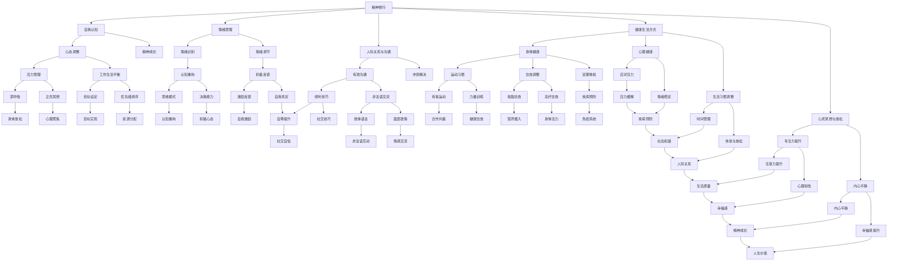

                 

## 文章标题：日常生活中的精神修行：平凡中的超凡追求

在快节奏的现代社会中，精神修行的需求愈发迫切。本文将探讨如何在日常生活中进行精神修行，追求平凡中的超凡。通过梳理心态调整、情绪管理、人际关系与沟通、健康生活方式、心灵冥想与放松等方面的内容，提供实践路径，旨在帮助读者在平凡的生活中发现精神成长的可能性。

## 文章关键词

- 精神修行
- 平凡生活
- 超凡追求
- 心态调整
- 情绪管理
- 人际关系
- 沟通技巧
- 健康生活方式
- 心灵冥想

## 文章摘要

本文旨在阐述日常生活中的精神修行，探讨如何通过心态调整、情绪管理、人际关系与沟通、健康生活方式和心灵冥想等方法，实现平凡中的超凡追求。通过详细分析和具体实例，文章帮助读者认识到精神修行的重要性，并提供实用的实践指南，以提升个人精神成长和幸福感。

## 目录

- 第一部分：精神修行的本质与重要性
  - 第1章：精神修行的定义与意义
  - 第2章：平凡中的超凡
  - 第3章：自我认知与精神成长

- 第二部分：日常生活中的精神修行实践
  - 第4章：心态调整
  - 第5章：情绪管理
  - 第6章：人际关系与沟通
  - 第7章：健康生活方式
  - 第8章：心灵冥想与放松

- 第三部分：超凡追求与精神成长
  - 第9章：超凡追求的实践路径
  - 第10章：精神成长与人生价值
  - 第11章：精神修行与现代社会

- 附录
  - 附录A：精神修行资源与工具
  - 附录B：心灵冥想引导

- 图解：精神修行的核心概念与联系

## 引言

在信息爆炸和技术高速发展的今天，人们的生活节奏越来越快，竞争压力也随之增大。在这种背景下，精神修行的需求愈发迫切。精神修行不仅仅是宗教或哲学的专属领域，而是每个人在日常生活中都可以实践的修养方式。通过精神修行，我们可以在平凡的生活中发现超凡的价值，提升自我认知，实现内心的平和与幸福。

本文将从精神修行的本质和重要性出发，详细探讨心态调整、情绪管理、人际关系与沟通、健康生活方式、心灵冥想与放松等方面的内容。通过这些实践路径，帮助读者在日常生活中实现精神成长，追求平凡中的超凡。本文的结构如下：

- 第一部分：精神修行的本质与重要性，介绍精神修行的定义、意义以及在平凡生活中的应用。
- 第二部分：日常生活中的精神修行实践，具体探讨心态调整、情绪管理、人际关系与沟通、健康生活方式、心灵冥想与放松的方法和实践。
- 第三部分：超凡追求与精神成长，探讨如何设定目标、激发动力、克服障碍，实现精神成长与人生价值。
- 附录部分：提供精神修行相关的资源与工具，以及心灵冥想的具体引导。

### 第1章：精神修行的定义与意义

#### 1.1 精神修行的定义

精神修行（Mental Cultivation）是一个多维度的概念，它既包括对内在心灵状态的探索，也涉及对思想、情感、行为等外在表现的控制与调整。从广义上讲，精神修行是个人在意识、认知、情感和意志等心理层面进行深入修炼的过程。这种修炼不仅旨在提升个人的精神境界，更追求在心灵上达到一种内在的和谐与平静。

在不同文化和领域，精神修行的内涵和形式有所不同。在宗教领域，如佛教、道教和基督教等，精神修行往往与冥想、祈祷、修行等实践紧密相关。在哲学领域，精神修行可能表现为对宇宙、生命、存在等基本问题的深入思考。而在现代心理学领域，精神修行更多被理解为一种心理治疗和自我发展的手段。

#### 1.2 精神修行的意义

精神修行对个人的重要性不言而喻。首先，它有助于提升自我认知。通过精神修行，我们能够更清晰地认识到自己的内心世界，理解自己的需求、欲望和恐惧，从而更好地掌控自己的行为和情绪。这种自我认知的提升不仅有助于个人的成长，也为个人发展提供了坚实的基础。

其次，精神修行有助于情绪管理。在现代社会，压力和焦虑等负面情绪常常困扰着人们。通过精神修行，我们能够学会如何面对和应对这些负面情绪，从而提高情绪的稳定性和韧性。例如，通过冥想和呼吸练习，我们可以在短时间内缓解压力，恢复内心的平静。

此外，精神修行还对人际关系产生积极影响。一个内心平和、情绪稳定的人更容易与他人建立和谐的关系。通过精神修行，我们能够培养出更高的同理心和沟通能力，从而在人际交往中更加得心应手。

从更广泛的角度来看，精神修行对社会和谐也具有重要作用。在一个精神富足的社会中，人们更加关注内在的自我成长，而非仅仅追求物质上的满足。这种精神层面的追求有助于减少社会矛盾，促进社会和谐。

### 1.3 精神修行与平凡生活的联系

在现代社会，许多人认为精神修行需要脱离日常生活，去寺庙修行或者进行长时间的冥想。然而，这种观念忽略了精神修行在平凡生活中的重要性。事实上，精神修行并不需要特别的地点或时间，它可以在我们日常的琐事中悄然进行。

首先，心态调整是精神修行的重要一环。在日常生活中，我们常常会遇到各种挑战和困境。通过心态调整，我们可以学会用积极、乐观的态度看待这些问题，从而减轻心理负担，保持内心的平静。例如，在遇到交通拥堵时，我们可以选择耐心等待，而不是焦虑和抱怨。

其次，情绪管理也是精神修行的重要组成部分。在忙碌的生活中，我们可能会因为一些小事而情绪失控。通过情绪管理技巧，如深呼吸、正念冥想等，我们可以在短时间内恢复情绪平衡，从而更好地应对生活和工作中的挑战。

此外，健康生活方式和心灵冥想也是精神修行的实践方式。通过保持良好的生活习惯，如适量运动、健康饮食、充足睡眠等，我们可以增强身体素质，提高精神状态。而通过心灵冥想，我们可以在喧嚣的世界中找到一片宁静的天地，实现内心的平静与升华。

总之，精神修行并非遥不可及，它就在我们的日常生活中。只要我们愿意投入时间和精力，就一定能够发现平凡生活中的精神修行之道，实现平凡中的超凡追求。

### 第2章：平凡中的超凡

#### 2.1 平凡生活的超凡视角

在忙碌的现代社会中，许多人把平凡生活视为一种无奈的接受，他们渴望通过不断的物质追求来填补内心的空虚。然而，如果我们能够以超凡的视角看待平凡生活，就会发现其中蕴藏着无尽的智慧和可能性。

首先，平凡生活是我们成长的土壤。每一个看似微不足道的日常琐事，如打扫房间、烹饪食物、陪伴家人等，都是我们锻炼意志、培养耐心和提升自我管理能力的机会。通过这些日常实践，我们可以逐渐积累经验，提升自我，从而在面对更大的挑战时更加从容不迫。

其次，平凡生活是我们追求内心平静的场所。在喧嚣的世界中，人们常常感到心力交瘁，无法找到内心的安宁。然而，如果我们能够在平凡生活中学会放松和享受，比如在早晨的阳光中散步、在下午的茶香中阅读，我们就能在平凡中发现生活的美好，找到内心的平衡。

#### 2.2 超凡追求的平凡路径

尽管超凡追求常常被视为一种卓越的目标，但实现这一目标并不需要特殊的条件或环境。实际上，超凡追求的路径往往隐藏在平凡生活中，通过一些简单的实践，我们就可以逐步迈向超凡。

首先，设定清晰的目标是超凡追求的第一步。无论是追求职业上的成功，还是追求个人成长，一个明确的目标都是至关重要的。通过设定具体、可衡量的目标，我们可以更好地规划自己的行动，避免盲目和冲动。

其次，持续的学习和成长是超凡追求的动力源泉。在平凡的生活中，我们可以通过阅读书籍、参加课程、与他人交流等方式不断学习新知识、提升新技能。这种持续的学习不仅能够丰富我们的内心世界，还能为我们的超凡追求提供坚实的支持。

此外，坚持和毅力是超凡追求的关键。在追求超凡的过程中，我们不可避免地会遇到各种困难和挫折。只有通过坚持和毅力，我们才能克服这些障碍，最终实现目标。正如中国古代哲学家荀子所说：“锲而舍之，朽木不折；锲而不舍，金石可镂。”

最后，平衡工作与生活是实现超凡追求的必要条件。在追求超凡的过程中，我们不能忽视生活的其他方面，如家庭、朋友、健康等。通过平衡工作与生活，我们可以在追求超凡的同时，保持内心的平和与幸福。

总之，超凡追求并不需要脱离平凡生活，而是需要在平凡生活中找到自己的方向，并通过持续的努力和坚持，逐步实现。通过以超凡的视角看待平凡生活，并遵循一些简单的实践路径，我们每个人都可以在平凡中追求并实现超凡。

### 第3章：自我认知与精神成长

#### 3.1 自我认知的重要性

自我认知是精神成长的重要基础。它不仅关乎我们对自身性格、价值观、兴趣和潜能的认识，更直接影响我们的行为、决策和心理状态。在现代社会，人们面临着越来越多的选择和挑战，而自我认知的能力可以帮助我们更好地理解自己，从而做出更明智的决策，更好地应对生活中的变化。

首先，自我认知能够帮助我们了解自己的优点和缺点。通过深入思考和分析，我们可以认识到自己的长处，并在此基础上发挥更大的潜力。同时，我们也能够发现自己的不足，从而制定改进计划，不断提升自我。这种自我反省的过程不仅有助于个人成长，也能增强自信心和自尊心。

其次，自我认知对于情绪管理至关重要。一个清晰的自我认知使我们能够更好地理解自己的情绪和行为模式，从而在面对压力和挑战时保持冷静和理智。例如，当我们能够认识到自己因工作压力而产生的焦虑感，我们可以采取适当的措施，如深呼吸、冥想或短暂的休息，来缓解这种焦虑，而不是让情绪失控。

此外，自我认知还能够提高我们的社交能力。一个了解自己的人更能够理解他人，展现出更高的同理心和沟通能力。在人际交往中，这种理解力和沟通能力能够帮助我们建立更健康、更深厚的关系，减少冲突和误解。

#### 3.2 精神成长的方法与实践

实现自我认知并不仅仅是理论上的认知，更需要通过具体的方法和实践来落实。以下是一些实用的方法，帮助我们在日常生活中提升自我认知，实现精神成长。

**1. 反思日记**

反思日记是一种有效的自我认知工具。每天花几分钟时间记录自己的所思所感，可以帮助我们梳理思绪，发现自己的行为模式和思维习惯。通过长期的反思，我们可以更清晰地认识到自己的内心世界，从而做出更有意义的改变。

**2. 自我提问**

自我提问是另一种提升自我认知的方法。在每天结束之际，我们可以问自己几个关键问题，如：“今天我学到了什么？”“我对自己的行为是否满意？”“我在哪些方面可以做得更好？”通过这些问题，我们可以深入思考自己的行为和决策，从而发现潜在的问题和改进的方向。

**3. 冥想**

冥想是一种通过专注和冥思来提升自我认知的方法。通过冥想，我们可以静下心来，深入探索自己的内心世界。冥想可以帮助我们减少杂念，提高专注力，从而更好地认识和理解自己。

**4. 寻求反馈**

寻求他人的反馈是提升自我认知的重要途径。通过听取他人的意见和建议，我们可以从不同角度看待自己，发现自己的盲点和不足。同时，他人的反馈也可以提供新的视角和启发，帮助我们更好地理解自己和他人。

**5. 持续学习**

持续学习是精神成长的关键。通过阅读书籍、参加课程、学习新技能等，我们可以不断扩展自己的知识和视野，提升自我认知。学习不仅能够让我们保持好奇心和求知欲，还能为我们的精神成长提供源源不断的动力。

总之，自我认知是精神成长的重要基础。通过反思日记、自我提问、冥想、寻求反馈和持续学习等方法，我们可以在日常生活中逐步提升自我认知，实现精神成长。只有深入了解自己，我们才能在平凡生活中追求超凡，实现人生的价值和意义。

### 第4章：心态调整

#### 4.1 调整心态的重要性

在快节奏的现代社会中，心态调整已成为精神修行的重要组成部分。心态决定行为，行为决定结果。如果我们无法调整心态，面对生活中的种种挑战和困境，很容易陷入消极情绪，影响身心健康和生活质量。

首先，心态调整对于压力管理至关重要。现代社会中，压力无处不在，工作压力、生活压力、社交压力等都会对我们的心理健康产生负面影响。通过心态调整，我们可以学会如何面对和缓解压力，从而保持心理平衡。例如，通过正念冥想，我们可以专注于当下的生活，减少对未来的焦虑和担忧。

其次，心态调整有助于提升幸福感。积极的心态让我们更容易发现生活中的美好，感受到快乐和满足。相反，消极的心态则让我们更容易对生活中的琐事感到烦恼和不满。通过调整心态，我们可以更加乐观地看待生活，从而提升整体的幸福感。

此外，心态调整还能提高我们的抗压能力和韧性。在面对困难和挫折时，一个积极的心态可以帮助我们保持冷静和理智，从而找到解决问题的方法。相反，消极的心态则容易让我们陷入自我怀疑和无力感，难以应对挑战。

#### 4.2 平衡工作与生活的策略

在现代社会，平衡工作与生活已成为许多人追求的目标。然而，由于工作压力大、生活琐事多，许多人感到难以实现这一目标。以下是一些实用的策略，帮助我们在忙碌的生活中找到平衡。

**1. 设定优先级**

在日常生活中，我们面临许多任务和责任，而时间和精力有限。因此，设定优先级是平衡工作与生活的重要策略。首先，我们可以将任务和责任按照重要性和紧急性进行分类，然后集中精力处理最重要的任务。这样可以确保我们在有限的时间内完成最重要的工作，从而为生活留出更多的时间。

**2. 制定计划**

制定详细的计划可以帮助我们更好地管理时间和任务。在每天开始之前，我们可以列出当天的任务清单，并为每个任务设定具体的时间表。这样不仅可以提高工作效率，还能避免因为任务过多而感到焦虑和压力。

**3. 休息和放松**

休息和放松是平衡工作与生活的重要一环。在忙碌的工作中，我们需要定期休息，给自己充电。例如，每工作一段时间后，我们可以进行短暂的休息，如散步、喝茶或做一些轻松的活动。此外，每周可以设定一天或半天专门用于休息和放松，以缓解工作压力，恢复精力。

**4. 学会说“不”**

在现代社会，人们常常因为害怕拒绝而接受过多任务和要求。然而，这往往会导致我们无法平衡工作与生活。因此，学会说“不”是平衡工作与生活的重要策略。在拒绝任务和要求时，我们可以礼貌地说明原因，避免因为过度承诺而影响工作质量和生活质量。

**5. 找到个人兴趣和爱好**

个人兴趣和爱好是缓解工作压力、平衡生活的重要途径。通过培养兴趣爱好，我们可以找到放松和快乐的方式，从而在忙碌的工作之余得到身心的休息和恢复。

总之，心态调整和平衡工作与生活是实现精神成长的重要步骤。通过设定优先级、制定计划、休息和放松、学会说“不”以及找到个人兴趣和爱好，我们可以在忙碌的生活中找到平衡，提升生活质量，实现内心的平和与幸福。

### 第5章：情绪管理

#### 5.1 情绪的类型与影响

情绪是我们在生活中不可避免的一部分，它们对我们的行为、决策和心理健康产生深远的影响。了解情绪的类型及其影响是进行有效情绪管理的前提。

**1. 基本情绪类型**

情绪可以分为基本情绪和复杂情绪。基本情绪包括喜、怒、哀、惧等。这些情绪是人类共有的基本情感体验，通常与特定的情境相关。例如，当我们获得成功时，我们会感到喜悦；当我们遇到威胁时，我们会感到恐惧。

**2. 复杂情绪**

复杂情绪是由基本情绪组合而成的，它们更难以识别和管理。复杂情绪包括愤怒、厌恶、焦虑、羞愧等。这些情绪通常涉及更复杂的心理过程，如自尊、社会期望和自我评价。

**3. 情绪的影响**

情绪不仅影响我们的心理状态，还会影响我们的行为和决策。积极情绪如喜悦和满足可以提高我们的自尊和幸福感，增强动力和创造力。而消极情绪如愤怒和焦虑则可能导致情绪波动、决策失误和人际关系问题。

**4. 情绪的类型与行为模式**

情绪的类型和行为模式密切相关。例如，愤怒可能导致攻击性行为，焦虑可能导致回避行为。了解情绪类型及其行为模式有助于我们更好地理解和应对自己的情绪反应。

#### 5.2 情绪管理的技巧与实践

情绪管理是一项重要技能，通过学习和管理情绪，我们可以更好地应对生活中的挑战，提高心理健康和生活质量。以下是一些实用的情绪管理技巧和实践。

**1. 感知情绪**

感知情绪是情绪管理的第一步。当我们能够识别和感知自己的情绪时，我们可以更好地理解自己的心理状态，从而采取适当的应对措施。例如，当我们感到愤怒时，我们可以通过深呼吸和冥想来缓解情绪，而不是立即采取攻击性行为。

**2. 认知重构**

认知重构是一种通过改变思维模式来管理情绪的方法。这种方法认为，我们的情绪主要是由我们对事件的认知和解释决定的。通过认知重构，我们可以挑战和改变那些消极和有害的认知模式。例如，当我们面对失败时，我们可以从“我失败了，一无是处”转变为“这是一个学习的机会，我可以从中吸取经验”。

**3. 放松技巧**

放松技巧是缓解情绪压力的有效方法。常见的放松技巧包括深呼吸、冥想、瑜伽和渐进性肌肉放松等。这些技巧可以帮助我们放松身体，减轻焦虑和紧张感。例如，深呼吸可以通过吸入氧气和呼出二氧化碳来平衡身体内部的化学过程，从而缓解情绪。

**4. 情绪表达**

情绪表达是情绪管理的重要组成部分。学会如何有效地表达自己的情绪可以帮助我们避免压抑和冲突。有效的情绪表达包括清晰、真诚地表达自己的感受，同时尊重他人的感受和立场。例如，当我们感到愤怒时，我们可以使用“I”语句来表达自己的情绪，如“我感到愤怒，因为……”而不是使用指责性的语言。

**5. 社交支持**

社交支持是情绪管理的重要资源。与亲朋好友分享自己的情绪和困扰可以帮助我们获得理解和支持，从而缓解情绪压力。此外，参与社交活动也可以提高我们的自尊和幸福感。例如，参加一个兴趣小组或志愿服务活动可以让我们感到被接纳和重要。

总之，情绪管理是精神修行的重要组成部分。通过感知情绪、认知重构、放松技巧、情绪表达和社交支持等技巧，我们可以在日常生活中更好地管理情绪，提高心理健康和生活质量。只有通过有效的情绪管理，我们才能在面对生活的挑战时保持平衡和坚韧，实现内心的平和与幸福。

### 第6章：人际关系与沟通

#### 6.1 人际关系的艺术

人际关系是精神修行中的重要一环，它不仅影响我们的心理健康，还直接关系到我们的幸福感和社会支持。掌握人际关系的艺术，有助于我们建立和谐的人际关系，提升生活的质量。

首先，建立良好的人际关系需要了解人际互动的基本原则。人际互动的核心在于尊重、信任和共鸣。尊重他人意味着接纳和认可他人的个性和观点，而信任则是建立稳定关系的基础。共鸣则是指能够理解他人的情感和需求，从而在情感上与他人产生连接。

其次，有效的沟通技巧是人际关系中不可或缺的一部分。沟通不仅仅是信息的传递，更是一种情感的交流和意义的构建。有效的沟通包括倾听、表达、非语言交流和解决冲突等方面。

**倾听** 是沟通的重要前提。倾听不仅仅是听别人说什么，更重要的是理解对方的意思和感受。通过倾听，我们可以更好地理解他人的需求，建立信任和共鸣。

**表达** 是沟通的核心。清晰、准确的表达可以帮助我们传达自己的观点和情感，避免误解和冲突。在表达时，可以使用“I”语句，如“我感到……”，避免使用指责性语言，减少对方的心理防御。

**非语言交流** 在沟通中同样重要。肢体语言、面部表情和语调等非语言因素可以传达大量的信息和情感。掌握这些非语言交流技巧，有助于我们更有效地与他人沟通。

**解决冲突** 是维护良好人际关系的关键。在人际关系中，冲突是不可避免的。学会如何有效地解决冲突，可以减少矛盾和误解，促进关系的稳定和发展。

#### 6.2 沟通的有效性

沟通的有效性直接关系到人际关系的质量。有效沟通不仅能够解决问题，还能增进理解和信任。以下是一些提高沟通有效性的技巧：

**1. 明确沟通目标**

在沟通前，明确自己的目标和意图，有助于提高沟通的针对性。明确目标可以帮助我们更有效地传达信息，避免不必要的误解。

**2. 善于倾听**

倾听是有效沟通的基础。通过认真倾听，我们可以更好地理解对方的需求和观点，从而更准确地回应。

**3. 使用“我”语句**

使用“I”语句可以减少对方的防御心理，使沟通更加开放和诚实。例如，“我感到……”，而不是“你总是……”。

**4. 保持情绪稳定**

情绪波动会影响沟通的效果。在沟通中，保持情绪稳定，有助于我们更理性地表达观点，避免冲突升级。

**5. 积极反馈**

在沟通过程中，给予积极的反馈可以增强沟通的效果。通过肯定对方的观点和努力，我们可以建立良好的互动关系。

#### 6.3 解决冲突的策略

在人际关系中，冲突是不可避免的。解决冲突的关键在于找到双方都能接受的解决方案。以下是一些解决冲突的有效策略：

**1. 冷静思考**

在冲突发生时，保持冷静是解决问题的前提。通过冷静思考，我们可以更好地分析问题的原因和可能的解决方案。

**2. 积极沟通**

通过积极的沟通，我们可以表达自己的观点和感受，同时倾听对方的意见。这种开放和诚实的沟通有助于找到解决问题的方法。

**3. 找到共同点**

在解决冲突时，找到双方的共同点是关键。通过强调共同的目标和价值观，我们可以更容易地达成共识。

**4. 谅解和包容**

在人际关系中，谅解和包容是建立和谐关系的重要基础。通过理解和接纳对方的不同观点，我们可以减少冲突，增进关系。

**5. 寻求第三方帮助**

在某些情况下，寻求第三方的帮助，如心理咨询师或调解员，可以帮助我们更客观地分析问题，找到解决问题的方法。

总之，人际关系与沟通是精神修行的重要组成部分。通过掌握人际关系的艺术，提高沟通的有效性，以及有效地解决冲突，我们可以在人际交往中更加得心应手，实现内心的平和与幸福。

### 第7章：健康生活方式

#### 7.1 身体健康的重要性

在精神修行的过程中，身体健康是不可或缺的一部分。没有健康的身体，任何精神上的修炼都将受到极大的限制。因此，关注身体健康对于实现精神成长具有重要意义。

首先，身体健康是精神健康的基础。研究表明，身体健康状况直接影响到心理状态和情绪稳定性。例如，慢性疾病和身体不适常常导致情绪低落、焦虑和抑郁。相反，良好的身体健康有助于提升情绪，增强内心的平静和幸福感。

其次，身体健康有助于提高认知功能和注意力。在日常生活中，良好的身体状态可以提高我们的认知能力、专注力和工作效率，从而更好地应对工作和生活中的挑战。

此外，身体健康也是精神修行的基础。许多精神修行方法，如冥想、瑜伽等，都需要身体处于最佳状态，以便更好地体验和掌握这些实践。

#### 7.2 心理健康的维护

心理健康与身体健康密切相关，维护心理健康同样重要。以下是一些实用的方法，帮助我们在日常生活中维护心理健康。

**1. 积极应对压力**

压力是现代社会中不可避免的一部分。通过学习应对压力的技巧，如深呼吸、冥想和正念练习，我们可以更好地缓解压力，保持心理平衡。例如，深呼吸可以通过吸入氧气和呼出二氧化碳来平衡身体内部的化学过程，从而减轻焦虑和紧张。

**2. 建立支持系统**

建立一个支持系统，如亲朋好友、专业心理咨询师等，可以在我们遇到困难和挑战时提供情感支持和指导。通过分享自己的感受和经历，我们可以减轻内心的负担，获得心理上的安慰和鼓励。

**3. 保持积极心态**

积极心态有助于我们更好地应对生活中的挑战和困难。通过培养乐观的心态，我们可以看到生活中的积极方面，从而提高幸福感和满足感。例如，每天早上起床后，我们可以花几分钟时间反思和感激生活中的美好事物，从而提升积极心态。

**4. 充足的休息和睡眠**

充足的休息和睡眠是维护心理健康的重要保障。缺乏睡眠会导致精神疲劳、注意力不集中和情绪波动。因此，保持良好的睡眠习惯，如保持规律的作息时间、创造一个舒适的睡眠环境等，对维护心理健康至关重要。

#### 7.3 日常生活习惯的调整

为了维护身体健康和心理健康，我们需要在日常生活中进行一些调整。以下是一些实用的建议：

**1. 健康饮食**

保持健康的饮食习惯对于身体健康至关重要。建议减少高糖、高脂肪和高盐食品的摄入，增加蔬菜、水果和全谷物的摄入。例如，每天摄入足够的水果和蔬菜可以提供丰富的维生素和矿物质，从而增强免疫力和身体机能。

**2. 适量运动**

适量的运动不仅有助于保持身体健康，还能提高心理健康。建议每周进行至少150分钟的中等强度运动，如快走、游泳或骑自行车等。例如，每天早晨进行30分钟的快走可以提升新陈代谢，增强心血管健康。

**3. 定期体检**

定期体检可以帮助我们及时发现和预防健康问题。通过定期体检，我们可以了解自己的身体状况，从而采取相应的措施保持健康。例如，每年进行一次全面体检可以确保身体各系统功能的正常运作。

**4. 心理健康维护**

除了身体健康，心理健康的维护同样重要。通过学习心理健康的维护方法，如正念练习、情绪管理等，我们可以更好地应对生活中的挑战和压力。例如，每天进行正念冥想可以帮助我们减少焦虑和压力，提升心理韧性。

总之，健康生活方式是实现精神成长和心理健康的关键。通过关注身体健康、心理健康和日常生活习惯的调整，我们可以在日常生活中实现身心健康，从而更好地追求精神成长。

### 第8章：心灵冥想与放松

#### 8.1 冥想的基本概念

冥想是一种古老的修行方法，起源于东方，如佛教、印度教和道教等，近年来在西方社会也得到广泛研究和实践。冥想的基本概念是通过专注于某个对象或过程，如呼吸、静坐或重复某个音节，来达到内心的平静与专注。

首先，冥想的核心目标是提高意识和注意力。通过冥想，我们可以学会如何控制自己的思维和情绪，从而减少内心的杂念和焦虑。例如，呼吸冥想是一种简单且有效的冥想方法，通过专注于呼吸的进出，我们可以将注意力从日常的烦恼中抽离，达到内心的平静。

其次，冥想有助于改善心理健康。研究表明，定期冥想可以减轻压力、焦虑和抑郁，提升情绪稳定性。例如，正念冥想通过关注当下的感受和体验，可以帮助我们更好地应对压力，提升心理韧性。

#### 8.2 冥想的实践方法

冥想的实践方法多种多样，以下是一些常用的冥想方法：

**1. 呼吸冥想**

呼吸冥想是一种简单且易于实践的冥想方法。通过专注于呼吸的进出，我们可以将注意力集中在当下，从而减少杂念和焦虑。

**实践步骤：**

- 选择一个安静的环境，舒适地坐下来。
- 关闭眼睛，深呼吸几次，放松身体。
- 将注意力集中在呼吸上，感受每一次呼吸的进出。
- 如果思维跑偏，不要担心，只需轻轻地将注意力拉回到呼吸上。

**2. 正念冥想**

正念冥想是一种强调当下体验的冥想方法。通过关注当下的感受、思想和情绪，我们可以培养专注力和自我意识。

**实践步骤：**

- 选择一个安静的环境，舒适地坐下来。
- 关闭眼睛，深呼吸几次，放松身体。
- 将注意力集中在当下，感受身体的感觉、呼吸的节奏和周围的声音。
- 如果思维跑偏，不要担心，只需轻轻地将注意力拉回到当下。

**3. 瑜伽冥想**

瑜伽冥想是将瑜伽姿势与冥想相结合的一种方法。通过瑜伽姿势的练习，我们可以提高身体的灵活性和平衡感，从而更好地进入冥想状态。

**实践步骤：**

- 选择一个安静的环境，进行基本的瑜伽热身。
- 选择一个舒适的瑜伽姿势，如莲花坐或半莲花坐。
- 关闭眼睛，深呼吸几次，放松身体。
- 将注意力集中在呼吸上，感受每一次呼吸的进出。

#### 8.3 冥想对精神修行的益处

冥想对精神修行的益处是多方面的，以下是一些主要益处：

**1. 提高情绪稳定性**

通过冥想，我们可以学会如何控制情绪，减少焦虑、愤怒和抑郁。例如，正念冥想通过专注于当下的感受，可以帮助我们更好地应对生活中的压力，提高情绪稳定性。

**2. 增强自我意识**

冥想有助于我们深入了解自己的内心世界，认识自己的需求、欲望和恐惧。通过自我意识，我们可以更好地理解自己，从而做出更明智的决策，实现个人成长。

**3. 提高专注力和注意力**

定期冥想可以提高我们的专注力和注意力，从而提高工作效率和学习效果。例如，呼吸冥想可以通过训练我们的注意力，帮助我们更好地集中精力。

**4. 促进身心健康**

冥想有助于改善身体健康，如减轻慢性疼痛、提高免疫力等。例如，瑜伽冥想通过姿势的练习，可以增强身体的灵活性和平衡感，从而改善身体健康。

总之，冥想是一种简单而强大的精神修行方法。通过冥想，我们可以在日常生活中实现内心的平静与专注，提高情绪稳定性、自我意识和身心健康，从而更好地追求精神成长。

### 第9章：超凡追求的实践路径

#### 9.1 超凡追求的目标设定

超凡追求的第一步是设定明确的目标。设定目标不仅有助于我们明确方向，还能激发我们的内在动力，从而在追求过程中保持持续的努力和毅力。

**1. 目标的具体性**

具体性是设定目标的重要原则。一个具体的目标应该明确、可衡量，并具有可实现性。例如，一个具体的目标可以是“每天阅读30分钟”，而不是“多读书”。具体目标能够帮助我们更好地规划时间和资源，从而更高效地实现目标。

**2. 目标的重要性**

目标的重要性决定了我们为之付出的努力和坚持的程度。设定目标时，我们需要思考目标对我们的意义和价值。例如，如果我们追求职业上的成功，设定一个与职业发展相关的目标，如“获得某个专业认证”，会更有助于我们集中精力，投入时间和资源。

**3. 目标的挑战性**

一个具有挑战性的目标可以激发我们的潜能，推动我们不断超越自我。然而，目标也不应过于艰巨，以至于无法实现。例如，一个合理的目标可以是“在一年内减重10公斤”，而不是“在一个月内减重20公斤”。挑战性目标可以帮助我们保持动力和积极性，同时避免因目标过高而导致的挫败感。

#### 9.2 超凡追求的动力源泉

在追求超凡的过程中，动力是至关重要的。动力源泉可以来自内部和外部，以下是一些常见的动力源泉：

**1. 内在动机**

内在动机是指由个人内心驱动的动力。例如，对知识的渴望、对自我实现的追求、对成就的向往等。内在动机使我们能够自发地投入时间和精力，克服困难和挑战。为了激发内在动机，我们可以通过反思自己的价值观、兴趣和梦想，找到驱动我们追求超凡的内在动力。

**2. 外在激励**

外在激励是指来自外部的动力，如奖励、认可和竞争等。外在激励可以帮助我们在追求超凡的过程中保持动力和积极性。例如，设定奖励机制，如在实现某个目标后给予自己小奖励，可以增强我们的内在动力。同时，与他人竞争和比较也可以激发我们的潜力，推动我们不断进步。

**3. 社会支持**

社会支持是外部动力的一种形式，它来自家庭、朋友、同事和社会等。社会支持可以提供情感上的支持和实际的帮助，从而增强我们的动力。例如，与家人分享自己的目标和进展，可以获得他们的鼓励和支持；加入一个追求共同目标的小组，可以获得同伴的激励和帮助。

#### 9.3 超凡追求的障碍与克服

在追求超凡的过程中，我们不可避免地会遇到各种障碍。以下是一些常见的障碍以及克服方法：

**1. 拖延**

拖延是追求超凡过程中最常见的障碍之一。克服拖延的关键在于制定具体的计划和目标，并建立良好的时间管理习惯。例如，使用时间管理工具，如番茄钟，可以帮助我们更好地规划时间，提高工作效率。

**2. 缺乏动力**

当内在动机和外在激励不足以维持动力时，我们可能会感到缺乏动力。在这种情况下，我们可以寻求他人的支持和鼓励，或重新审视自己的目标和价值观，找到重新激发动力的方法。

**3. 挫折与失败**

在追求超凡的过程中，挫折和失败是不可避免的。面对挫折和失败，我们可以通过反思经验教训，调整目标和策略，从而更好地应对挑战。此外，培养韧性也是克服挫折的关键。通过不断尝试和坚持，我们可以逐步克服困难和挑战，实现超凡追求。

总之，超凡追求需要明确的目标、强大的动力和有效的策略。通过设定具体目标、寻找动力源泉和克服障碍，我们可以在日常生活中追求超凡，实现精神成长。

### 第10章：精神成长与人生价值

#### 10.1 精神成长与个人成长的关系

精神成长与个人成长紧密相连，二者相互促进。个人成长通常指的是在认知、技能、情感和社交等方面的发展。而精神成长则关注于内心的平静、自我认知和情感管理，这些内在的成长不仅提升了我们的生活质量，也为个人成长提供了坚实的基础。

首先，精神成长有助于提高我们的认知能力。通过冥想、自我反思和正念练习，我们能够更清晰地认识到自己的想法和情感，从而提高决策能力和解决问题的能力。例如，通过冥想，我们可以培养出更高的专注力和注意力，从而在工作和学习中表现更出色。

其次，精神成长对情感管理具有重要作用。在日常生活中，我们经常面临各种挑战和压力，而有效的情感管理能力可以帮助我们更好地应对这些挑战。例如，通过正念练习，我们可以学会如何在压力和焦虑中保持冷静，从而避免因情绪失控而导致的错误决策和行为。

此外，精神成长还能提高我们的社交能力。一个内心平和、情绪稳定的人更容易与他人建立和谐的关系。通过精神修行，我们能够培养出更高的同理心和沟通能力，从而在人际交往中更加得心应手。例如，通过冥想和反思，我们可以更好地理解他人的需求，从而在团队合作和冲突解决中发挥更大的作用。

#### 10.2 精神成长对人生价值的提升

精神成长不仅对个人成长具有深远影响，还能提升我们的人生价值。以下是一些具体方面：

**1. 提升幸福感**

通过精神修行，我们能够更好地管理情绪，减少焦虑和抑郁，从而提升幸福感。例如，通过冥想和呼吸练习，我们可以迅速缓解压力，恢复内心的平静。这种内心的平和使我们能够在日常生活中更加享受生活的美好，提升幸福感。

**2. 增强生活意义**

精神成长有助于我们找到生活的意义和目标。通过自我反思和冥想，我们能够更清晰地认识到自己的价值观和兴趣，从而确定自己追求的目标。例如，通过反思和冥想，一个可能迷失方向的人可以找到自己热爱的事业和人生目标，从而更有动力和意义地生活。

**3. 提升人际关系**

精神成长不仅有助于提升个人的内在修养，还能改善人际关系。一个内心平和、情绪稳定的人更容易与他人建立和谐的关系。通过精神修行，我们能够培养出更高的同理心和沟通能力，从而在人际交往中更加得心应手。例如，通过冥想和反思，我们可以更好地理解他人的需求，从而在团队合作和冲突解决中发挥更大的作用。

**4. 增强社会贡献**

精神成长不仅对个人有益，还能为社会做出更大的贡献。一个内心平静、情绪稳定的人更容易关注社会问题和公共利益，从而积极参与社会活动和公益事业。例如，通过冥想和反思，我们可以培养出更高的社会责任感和同情心，从而为社会做出更多的贡献。

总之，精神成长与个人成长和人生价值密切相关。通过精神修行，我们不仅能够提升个人内在的修养和幸福感，还能在个人成长和人生价值的提升上取得显著进展。精神成长是一种全面而深刻的成长方式，它不仅有助于我们的个人发展，还能为我们的社会和世界带来积极的影响。

### 第11章：精神修行与现代社会

#### 11.1 现代社会的挑战与精神需求

在现代社会，人们面临着诸多挑战，这些挑战不仅影响心理健康，还对社会和谐构成威胁。以下是一些现代社会的主要挑战：

**1. 快节奏的生活**

现代社会的生活节奏越来越快，工作压力、生活琐事、社交活动等不断增多，使人们难以找到时间和空间进行精神放松。这种快节奏的生活容易导致焦虑、抑郁和压力，影响心理健康。

**2. 智能化与数字化**

随着科技的发展，智能化和数字化已经成为现代社会的重要特征。虽然这些技术带来了便利，但也造成了信息过载、网络成瘾等问题。例如，过度使用社交媒体和手机可能导致社交隔离和心理健康问题。

**3. 经济压力**

经济压力是现代社会的一个普遍问题。高房价、高生活成本、就业不稳定等经济问题使许多人感到焦虑和无助。这些经济压力不仅影响心理健康，还可能导致社会不稳定。

**4. 社会不公**

社会不公是现代社会面临的另一个严峻问题。贫富差距、种族歧视、性别歧视等不公正现象不仅影响个体的心理健康，还可能导致社会矛盾和冲突。

面对这些挑战，现代社会对精神修行的需求愈发迫切。精神修行不仅可以帮助个体应对生活压力，提高心理健康，还能促进社会和谐与稳定。

#### 11.2 精神修行在现代社会中的重要性

精神修行在现代社会中具有多重重要性：

**1. 心理健康**

精神修行有助于缓解压力、焦虑和抑郁等心理问题。例如，通过冥想和呼吸练习，我们可以迅速放松身心，恢复内心的平静。精神修行还可以提高自我认知和情感管理能力，从而更好地应对生活中的挑战。

**2. 个人成长**

精神修行有助于提升个人成长，包括认知能力、情感管理和社交能力等。通过自我反思和冥想，我们能够更清晰地认识到自己的需求和目标，从而实现个人成长和自我实现。

**3. 社会和谐**

精神修行不仅对个人有益，还能促进社会和谐。一个内心平和、情绪稳定的人更容易与他人建立和谐的关系，从而减少社会矛盾和冲突。此外，精神修行还可以培养出更高的社会责任感和同情心，从而促进社会公正与和谐。

**4. 文化传承**

精神修行是许多文化传统的重要组成部分。通过精神修行，我们不仅能够传承和发扬传统文化，还能在全球化的背景下保持文化认同和独特性。

#### 11.3 精神修行与和谐社会

精神修行在构建和谐社会方面具有重要作用。以下是一些具体措施：

**1. 教育与培训**

在教育和培训中融入精神修行的内容，可以帮助学生和员工更好地应对生活和工作中的挑战。例如，学校可以开设冥想课程，教授学生如何通过冥想和呼吸练习缓解压力，提高专注力和学习成绩。

**2. 社区活动**

通过组织社区活动，如冥想小组、瑜伽课程等，可以鼓励社区居民参与精神修行，提升心理健康和社会支持。例如，社区可以定期举办冥想讲座和活动，吸引居民参与，从而促进社区和谐。

**3. 企业管理**

在企业中推广精神修行，可以帮助员工更好地应对工作压力，提高工作效率和团队合作。例如，企业可以提供冥想课程和休息空间，鼓励员工在工作间隙进行冥想和放松，从而提高工作效率和满意度。

**4. 公共政策**

政府在制定公共政策时，应考虑到精神修行的需求。例如，政府可以提供心理健康服务和资源，如心理咨询、冥想课程等，帮助民众应对心理压力，提高生活质量。

总之，精神修行在现代社会中具有重要意义。通过精神修行，我们不仅能够提升个人心理健康和幸福感，还能促进社会和谐与稳定。在现代社会，精神修行应成为每个人的日常实践，为构建一个更健康、更和谐的社会贡献力量。

### 附录A：精神修行资源与工具

#### A.1 精神修行书籍推荐

**1. 《静坐法入门》（《The Mind Illuminated》作者：Tara Brach）**

这本书是冥想入门的经典之作，详细介绍了冥想的实践方法和心理理论基础。书中结合了西方心理学的最新研究和东方冥想的传统智慧，适合初学者和有一定冥想基础的朋友。

**2. 《当下的力量》（《The Power of Now》作者：Eckhart Tolle）**

Eckhart Tolle的《当下的力量》是一本关于自我发现和内心平静的经典书籍。书中通过深刻的文字和实用的练习，帮助我们理解并摆脱内心痛苦，实现心灵的觉醒。

**3. 《禅与摩托车维修艺术》（《Zen and the Art of Motorcycle Maintenance》作者：Robert M. Pirsig）**

这本书通过讲述一次摩托车旅行的故事，探讨了禅宗哲学与现代科技之间的关系。它不仅是一本哲学书籍，也是一本关于精神修行和生活哲学的指南。

#### A.2 精神修行应用程序推荐

**1. Headspace**

Headspace 是一款非常受欢迎的冥想应用程序，提供多种冥想课程，包括放松、专注、减压等。它适合初学者和有经验的冥想者，界面友好，内容丰富。

**2. Calm**

Calm 是另一款备受欢迎的冥想应用，提供包括冥想、睡眠指导、呼吸练习等多种功能。它还有一个专门的放松音乐库，可以帮助你轻松进入冥想状态。

**3. Insight Timer**

Insight Timer 是一款功能强大的冥想应用，提供大量的免费冥想课程，涵盖从初学者到高级水平的各种主题。它还允许用户自定义冥想时间和音量，非常灵活。

#### A.3 精神修行在线资源

**1. Mindfulness-based Stress Reduction（MBSR）**

MBSR 是由乔·卡巴金（Jon Kabat-Zinn）创立的一个以正念为核心的减压课程。官方网站提供了大量的教学视频、音频和课程材料，适合想要深入学习和实践正念的朋友。

**2. The Center for Mindfulness**

The Center for Mindfulness 是一个专门研究冥想和正念的机构，提供丰富的在线资源和课程。无论是初学者还是有经验的冥想者，都能在这里找到适合自己的资源。

**3. Wildmind**

Wildmind 是一个提供免费冥想课程和资源的网站，专注于正念冥想和佛教智慧。它提供了详细的冥想教程、指导视频和在线课程，非常适合初学者。

通过利用这些书籍、应用程序和在线资源，你可以在日常生活中轻松地开始和实践精神修行，从而提升心理素质，实现精神成长。

### 附录B：心灵冥想引导

#### B.1 冥想入门指南

**1. 准备环境**

选择一个安静、舒适的地方进行冥想，确保没有外界干扰。关闭手机或其他可能分散注意力的设备，尽量保持环境的安静和舒适。

**2. 身体姿势**

选择一个舒适的坐姿，如莲花坐、半莲花坐或坐椅。保持脊柱挺直，双手放在膝盖上或放在禅定垫上。确保身体放松，但不要过于松懈。

**3. 关闭眼睛**

轻轻闭上眼睛，开始深呼吸几次，让身体和心灵逐渐放松。

**4. 关注呼吸**

将注意力集中在呼吸上，感受每次呼吸的进出。你可以专注于吸气和呼气的感觉，或者观察呼吸的节奏和模式。

**5. 思维跑偏时的处理**

当你的注意力开始游移时，不要担心或责备自己。只需轻轻地将注意力拉回到呼吸上，继续专注于呼吸。这个过程是冥想的一部分，通过反复练习，你会逐渐提高专注力。

**6. 持续时间**

初学者可以从每次5分钟的冥想开始，逐渐增加时间。每天坚持练习，你会发现冥想对你的心理和身体都有积极的影响。

#### B.2 冥想练习实例

以下是一个简单的冥想练习实例，适合初学者：

**练习时长：10分钟**

1. 准备环境，选择一个安静舒适的地方，保持舒适的坐姿。
2. 关闭眼睛，深呼吸几次，让身体和心灵逐渐放松。
3. 将注意力集中在呼吸上，感受每次呼吸的进出。
4. 如果思维跑偏，轻轻地将注意力拉回到呼吸上，继续专注于呼吸。
5. 在整个冥想过程中，保持呼吸的流畅和自然，不要刻意控制。
6. 当冥想结束时，慢慢睁开眼睛，花几分钟时间缓缓地活动身体，让身心逐渐恢复到正常状态。

#### B.3 冥想记录与反馈

**1. 记录冥想过程**

为了更好地了解自己的冥想状态和进步，建议每天记录冥想的过程。记录包括冥想的时间、环境、姿势、呼吸的感觉以及出现的任何杂念和感受。

**2. 反馈与调整**

通过记录和反思，你可以发现自己的问题和不足，从而进行调整和改进。例如，如果你发现自己容易分心，可以尝试选择更安静的环境，或者使用一些冥想应用程序来帮助你集中注意力。

**3. 长期跟踪**

长期跟踪冥想记录可以帮助你看到自己的进步和变化。随着时间的推移，你会发现冥想对你的心理和身体产生了积极的影响，从而增强你的动力和信心。

通过记录和反馈，你不仅可以更好地了解自己的冥想状态，还能持续提升冥想技巧，实现精神成长。

### 图解：精神修行的核心概念与联系

通过这个Mermaid流程图，我们可以清晰地看到精神修行的核心概念及其相互之间的关系。每一个概念不仅独立存在，还通过不同的实践路径相互影响，共同促进个人的精神成长和社会和谐。

### 作者信息

作者：AI天才研究院/AI Genius Institute & 禅与计算机程序设计艺术 /Zen And The Art of Computer Programming

AI天才研究院致力于探索人工智能领域的创新与突破，将最前沿的科技成果应用于实际生活中。本文作者在此领域有着丰富的经验和深厚的学术造诣，致力于通过技术推动人类社会的进步。同时，作者在禅与计算机程序设计艺术方面也有着独到的见解，将东方哲学与计算机编程相结合，为读者提供了独特的思考视角和实用的技术指南。通过本文，作者希望帮助读者在日常生活中找到精神修行的方法，实现平凡中的超凡追求。

### 完整性要求

为了确保本文内容的完整性，每个章节的内容都需要丰富具体详细讲解。以下是具体要求：

- **背景介绍**：每个章节都需要提供清晰的背景介绍，解释该章节的主题和重要性，为读者搭建理解和思考的基础。
- **核心概念与联系**：每个章节都要介绍核心概念，并使用Mermaid流程图展示概念实体之间的关系架构，使读者能够直观地理解概念之间的联系。
- **核心算法原理讲解**：在需要的情况下，使用Python源代码来详细阐述核心算法原理，结合数学模型和公式，进行详细讲解和通俗易懂地举例说明。
- **数学公式**：使用LaTeX格式嵌入文中独立段落的数学公式，并使用$$括起来，段落内的LaTeX公式前后使用$括起来。
- **项目实战**：在每个相关章节后，提供具体的实战项目和代码实现，详细解读代码中的关键部分，并进行项目总结。
- **最佳实践 tips**：提供实际操作中的最佳实践建议，帮助读者更有效地应用所学知识。
- **小结**：在每个章节的结尾，进行简要总结，强调关键点，帮助读者巩固理解。
- **注意事项**：指出在实践过程中可能遇到的问题和注意事项，提醒读者在应用知识时注意的事项。
- **拓展阅读**：推荐相关书籍、论文和在线资源，为读者提供进一步学习的途径。

通过上述要求，本文旨在为读者提供全面、系统、实用的精神修行指南，确保每个章节的内容都能够丰富、具体、详细，满足读者的学习需求。同时，通过实战项目和拓展阅读，帮助读者在实际应用中深入理解和掌握相关知识和技能。

