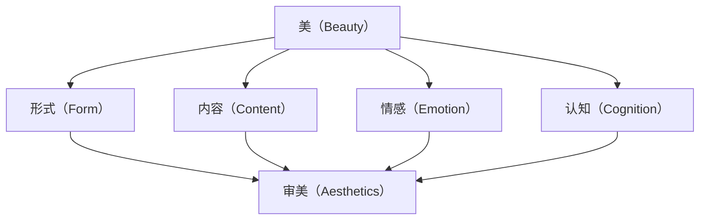

                 

### 引言：将生活转化为艺术

#### 背景介绍

在日常生活的快节奏中，许多人忽略了身边的美学价值。然而，将生活转化为艺术不仅可以提升个人的生活质量，还能带来精神层面的满足。美学的实践不仅关乎审美情趣的提升，更是一种对生活的深刻理解和体验。美学，作为一门涉及艺术、情感和理性的学科，能够帮助我们更好地感知世界，发现日常生活中的美好。

本文旨在探讨美学在日常生活中的实践，帮助读者理解和应用美学原理，将平凡的生活转化为艺术品。我们将首先介绍美学的基本概念，包括其定义、发展历程以及核心要素。接着，将深入探讨美学在日常生活中的应用，涵盖家庭美学、职场美学以及艺术创作与日常生活的结合。此外，还将通过具体案例解析，展示美学实践的效果和方法。最后，我们将展望美学实践的未来趋势与挑战，并总结最佳实践策略。

#### 核心概念与联系

美学作为一门综合性学科，涉及多个核心概念。首先，美（Beauty）是美学研究的核心对象，它不仅仅是一种视觉上的愉悦，更是一种情感和精神上的满足。美可以存在于自然、艺术、设计等各个方面。审美（Aesthetics）则是指人们对美进行感知、评价和理解的过程。

美学的基本要素包括形式（Form）、内容（Content）、情感（Emotion）和认知（Cognition）。形式是指艺术作品的结构和组织方式，如颜色、线条、形状等；内容则涉及作品的题材、意义和象征；情感是审美体验的重要组成部分，包括愉悦、悲伤、惊叹等；认知则是审美过程中对作品的理解和思考。

这些概念之间存在着紧密的联系。例如，形式和内容共同构成了艺术作品的整体美感，而情感和认知则影响人们对艺术作品的感受和理解。Mermaid 流程图如下所示：



通过这个流程图，我们可以清晰地看到美学核心概念之间的相互关系，为后续章节的讨论奠定了基础。

### 核心算法原理讲解

在探讨美学原理时，我们引入一些关键概念和算法来帮助理解和应用。以下是一个简单的Python代码示例，用于计算两个艺术作品的美学评分（基于形式和内容）：

```python
import numpy as np

def calculate_aesthetics_score(form, content):
    """
    计算艺术作品的美学评分。
    
    参数：
    - form：艺术作品的形式得分（0-10分）
    - content：艺术作品的内容得分（0-10分）
    
    返回：
    - aesthetics_score：艺术作品的美学评分（0-10分）
    """
    # 形式权重为0.6，内容权重为0.4
    form_weight = 0.6
    content_weight = 0.4
    
    # 计算加权平均分
    aesthetics_score = form * form_weight + content * content_weight
    
    # 将分数范围调整为0-10
    aesthetics_score = np.clip(aesthetics_score, 0, 10)
    
    return aesthetics_score

# 示例：计算一幅画的美学评分
form_score = 8
content_score = 7
print("艺术作品的美学评分：", calculate_aesthetics_score(form_score, content_score))
```

在此代码中，我们使用了一个简单的加权平均算法来计算美学评分。形式得分和内容得分分别代表了艺术作品的两个核心要素，通过不同的权重分配，我们可以得到一个综合的美学评分。这种方法可以帮助我们定量地评估艺术作品的美学价值，从而更好地理解和应用美学原理。

#### 数学模型与公式

为了更深入地理解美学评分的计算过程，我们引入一些数学模型和公式。以下是计算美学评分的详细公式：

$$
\text{美学评分} = \text{形式得分} \times \text{形式权重} + \text{内容得分} \times \text{内容权重}
$$

在这个公式中，形式得分和内容得分分别代表了艺术作品在形式和内容方面的表现，形式权重和内容权重则代表了这两个要素在美学评分中的相对重要性。通常，形式权重会高于内容权重，因为形式是艺术作品的基础，而内容则更多涉及作品的深层次意义。

#### 举例说明

假设我们有两幅画，一幅以绚丽多彩的视觉形式为主，另一幅则以其深刻的象征意义而著称。根据上述公式，我们可以分别计算这两幅画的美学评分。

对于第一幅画，形式得分为9，内容得分为6，权重分配如下：

$$
\text{美学评分} = 9 \times 0.6 + 6 \times 0.4 = 5.4 + 2.4 = 7.8
$$

对于第二幅画，形式得分为7，内容得分为8，权重分配如下：

$$
\text{美学评分} = 7 \times 0.6 + 8 \times 0.4 = 4.2 + 3.2 = 7.4
$$

通过这个例子，我们可以看到，尽管两幅画的形式和内容得分有所不同，但根据权重分配，它们的美学评分依然存在明显差异。这种方法不仅帮助我们量化评估艺术作品的美学价值，还能为艺术创作提供有价值的参考。

### 项目实战

为了更好地理解美学评分的计算过程，我们将开发一个简单的艺术作品评分系统。该系统将包括数据输入、评分计算和结果输出三个部分。

#### 开发环境搭建

首先，我们需要安装Python和相关库。在终端中执行以下命令：

```bash
pip install numpy matplotlib
```

这将安装所需的库，用于数据处理和图形绘制。

#### 源代码详细实现

以下是完整的源代码实现，包括数据输入、评分计算和结果输出：

```python
import numpy as np
import matplotlib.pyplot as plt

def calculate_aesthetics_score(form, content, form_weight=0.6, content_weight=0.4):
    """
    计算艺术作品的美学评分。
    
    参数：
    - form：艺术作品的形式得分（0-10分）
    - content：艺术作品的内容得分（0-10分）
    - form_weight：形式权重（默认0.6）
    - content_weight：内容权重（默认0.4）
    
    返回：
    - aesthetics_score：艺术作品的美学评分（0-10分）
    """
    # 计算加权平均分
    aesthetics_score = form * form_weight + content * content_weight
    
    # 将分数范围调整为0-10
    aesthetics_score = np.clip(aesthetics_score, 0, 10)
    
    return aesthetics_score

def input_art_workscores():
    """
    输入艺术作品的形式得分和内容得分。
    
    返回：
    - form_score：艺术作品的形式得分
    - content_score：艺术作品的内容得分
    """
    form_score = float(input("请输入艺术作品的形式得分（0-10分）："))
    content_score = float(input("请输入艺术作品的内容得分（0-10分）："))
    return form_score, content_score

def display_aesthetics_score(form_score, content_score, aesthetics_score):
    """
    输出艺术作品的美学评分。
    
    参数：
    - form_score：艺术作品的形式得分
    - content_score：艺术作品的内容得分
    - aesthetics_score：艺术作品的美学评分
    """
    print(f"艺术作品的形式得分：{form_score}分")
    print(f"艺术作品的内容得分：{content_score}分")
    print(f"艺术作品的美学评分：{aesthetics_score}分")

# 主程序
if __name__ == "__main__":
    form_score, content_score = input_art_workscores()
    aesthetics_score = calculate_aesthetics_score(form_score, content_score)
    display_aesthetics_score(form_score, content_score, aesthetics_score)
```

#### 代码解读与分析

1. **函数`calculate_aesthetics_score`：**
   - 该函数接受形式得分、内容得分以及可选的形式权重和内容权重，返回艺术作品的美学评分。
   - 权重默认设置为0.6和0.4，分别对应形式和内容在美学评分中的重要性。

2. **函数`input_art_workscores`：**
   - 该函数用于从用户处获取艺术作品的形式得分和内容得分，并将它们作为浮点数返回。

3. **函数`display_aesthetics_score`：**
   - 该函数用于输出艺术作品的形式得分、内容得分和美学评分，以帮助用户理解评分结果。

#### 实际案例分析与详细讲解剖析

为了更具体地理解这个系统的工作原理，我们来看一个实际案例。假设用户输入了一幅画的形式得分为8，内容得分为7，我们可以使用上述代码计算其美学评分。

1. **数据输入：**
   - 形式得分（form_score）= 8
   - 内容得分（content_score）= 7

2. **评分计算：**
   - 根据公式计算美学评分：
   $$ 
   \text{美学评分} = 8 \times 0.6 + 7 \times 0.4 = 4.8 + 2.8 = 7.6 
   $$
   - 调整后的美学评分为7.6分。

3. **结果输出：**
   - 输出形式得分：8分
   - 输出内容得分：7分
   - 输出美学评分：7.6分

通过这个案例，我们可以看到，艺术作品的美学评分是如何通过简单的公式计算得出的。这不仅帮助我们量化评价艺术作品，还能为艺术创作提供指导。

### 项目小结

通过本项目的实现，我们开发了一个简单的艺术作品评分系统，它基于形式得分和内容得分的加权平均计算美学评分。这个过程不仅帮助我们理解了美学评分的计算原理，还展示了如何将理论应用到实际项目中。虽然这个系统相对简单，但它为更复杂的美学评分模型奠定了基础，未来可以扩展到更多的评价维度和算法。

### 最佳实践 Tips、小结、注意事项、拓展阅读

#### 最佳实践 Tips

1. **平衡形式与内容：** 在评价艺术作品时，要注重平衡形式得分和内容得分，避免过分强调某一方面。
2. **个性化评分权重：** 根据个人审美偏好，可以调整形式权重和内容权重，以获得更符合自己口味的美学评分。
3. **数据分析：** 使用数据可视化工具（如Matplotlib）展示评分结果，有助于更好地理解和分析数据。

#### 小结

本文介绍了美学的基本概念，包括美的定义、审美过程以及美学的基本要素。通过Python代码和数学公式，我们详细讲解了美学评分的计算方法，并通过一个实际案例展示了其应用。这为读者提供了将美学理论应用到实践中的具体方法和思路。

#### 注意事项

1. **数据质量：** 在输入形式得分和内容得分时，确保数据的准确性和一致性，避免影响评分结果的可靠性。
2. **算法适应性：** 针对不同类型的艺术作品，可以调整算法参数，以获得更精准的评分结果。

#### 拓展阅读

1. **《美学原理》** by 罗伯特·C·克拉克（Robert C. Crease）：深入探讨美学理论及其哲学基础。
2. **《艺术心理学》** by 爱德蒙·伯克（Edmund Burke）：研究审美体验的心理机制。

通过本文的学习和实践，读者可以更好地理解美学的基本概念，掌握美学评分的计算方法，并将这些知识应用到日常生活中，提升个人对美的感知和创造能力。## 第2章：日常生活中的美学实践

### 2.1 家庭美学的实践

#### 室内设计的审美原则

家庭美学实践的首要环节在于室内设计，这不仅是居住环境的美化，更是个人生活品质的体现。室内设计的审美原则主要包括以下几点：

1. **协调统一：** 室内设计应注重整体协调，统一色彩和风格，避免过多的元素冲突。例如，选择一种主导色调，并通过家具、装饰品等元素进行搭配。

2. **功能性与美观的结合：** 室内设计不仅要美观，还应满足实际使用需求。例如，在客厅中，沙发、茶几和电视柜的摆放应合理，既方便日常生活，又保持空间的整洁和舒适。

3. **光线与空间的利用：** 光线是室内设计中的重要因素。通过合理的灯光布置，可以营造不同的氛围，增强空间的层次感。同时，利用自然光和人工光相结合，可以提高居住的舒适度。

4. **细节处理：** 室内设计中的细节处理能够体现主人的审美情趣。例如，壁画、花瓶、窗帘等装饰品的选择应与整体风格相协调，并能够增加空间的趣味性。

#### 家居装饰的艺术性

家居装饰的艺术性不仅在于物品的选择，还在于它们的布局和搭配。以下是一些提升家居装饰艺术性的方法：

1. **色彩搭配：** 色彩是家居装饰中的重要元素。合理运用色彩搭配，可以营造出不同的氛围。例如，暖色调可以增加温馨感，冷色调则带来清新感。

2. **纹理与材质的运用：** 通过不同的纹理和材质，可以增强空间的层次感和质感。例如，木质地板、羊毛地毯、金属饰品等，都能为室内环境增添艺术气息。

3. **艺术品的摆放：** 艺术品是家居装饰中不可或缺的一部分。一幅好的画作、一件精美的雕塑，都能为空间增添艺术魅力。在选择艺术品时，应注意与空间的整体风格相协调。

4. **灯光与氛围的营造：** 通过灯光的布置，可以创造出不同的氛围。例如，柔和的灯光可以营造温馨的氛围，而明亮的灯光则带来活力和生气。

#### 家庭生活方式的美学思考

家庭生活方式的美学思考不仅仅是室内设计和家居装饰，还包括日常生活中的习惯和行为。以下是一些家庭生活方式的美学建议：

1. **整洁有序：** 保持家庭环境的整洁有序，能够提升生活质量。定期清理杂物，合理规划储物空间，可以使家庭环境更加美观和舒适。

2. **健康生活：** 健康的生活习惯不仅有益于身体健康，也能提升生活品质。例如，合理安排饮食、保持适当的锻炼、保持良好的作息时间等，都是美学思考的体现。

3. **和谐人际关系：** 家庭和谐是生活美学的核心。通过有效的沟通和互助，家庭成员之间的关系会更加融洽，生活氛围也会更加美好。

4. **持续学习和成长：** 不断学习和成长，可以提升个人的素质和生活质量。例如，阅读、学习新技能、参加社交活动等，都是美学思考的体现。

### 2.2 职场美学的实践

#### 职场环境的审美建设

职场环境的审美建设是提升工作效率和生活质量的重要手段。以下是一些职场环境审美建设的建议：

1. **办公室布局：** 合理的办公室布局可以提高工作效率和舒适度。例如，工作区的布置应便于员工集中精力，休息区的设置应提供放松的环境。

2. **色彩运用：** 色彩对人的情绪和心理健康有显著影响。在职场环境中，应选择积极、明亮的色彩，以营造良好的工作氛围。

3. **装饰与点缀：** 办公室内可以适当摆放一些绿色植物、艺术品等装饰品，以提升空间的趣味性和艺术感。

4. **空气净化：** 保持办公室的空气质量对员工的健康和工作效率至关重要。定期通风和空气净化是必要的。

#### 职场行为的审美规范

职场行为的审美规范是维护职场秩序和提升团队协作效率的关键。以下是一些职场行为审美规范的建议：

1. **礼仪规范：** 良好的礼仪规范是职场美学的核心。例如，礼貌用语、准时参加会议、穿着得体等，都是职场行为审美规范的体现。

2. **沟通艺术：** 沟通是职场中不可或缺的环节。有效的沟通需要倾听、表达清晰和尊重对方。通过恰当的沟通方式，可以增进同事之间的理解和信任。

3. **团队协作：** 良好的团队协作是高效工作的保障。在团队中，应尊重每个成员的贡献，共同解决问题，实现团队目标。

4. **创新思维：** 创新思维是推动职场发展的重要动力。鼓励员工提出新想法，勇于尝试，是职场行为审美规范的一部分。

#### 职场生活与美学融合

职场生活与美学的融合，可以提升员工的工作满意度和生活质量。以下是一些具体实践：

1. **工作与生活的平衡：** 鼓励员工合理安排工作和生活，保持身心健康。例如，设立弹性工作时间、提供健身房和心理健康服务等。

2. **职场文化活动：** 定期举办职场文化活动，如团队建设活动、艺术展览、讲座等，可以丰富员工的业余生活，提升团队凝聚力。

3. **职场美学培训：** 通过美学培训，提升员工对美的感知和创造力，促进职场环境的美学建设。

4. **环保意识：** 提高员工的环保意识，通过绿色办公、垃圾分类等措施，营造环保的职场环境。

### 2.3 艺术创作与日常生活的结合

#### 艺术创作的基本原理

艺术创作是美学实践的重要组成部分，它不仅是对美的追求，也是对生活体验的深刻表达。以下是一些艺术创作的基本原理：

1. **创造性思维：** 创造性思维是艺术创作的核心。艺术家需要跳出传统思维框架，勇于尝试新方法和新形式，以创造独特的艺术作品。

2. **情感表达：** 艺术作品是情感的表达和传递。艺术家通过作品传达自己的情感和思想，使观众产生共鸣。

3. **形式与内容的结合：** 艺术创作中，形式和内容是密不可分的。形式包括色彩、线条、构图等，而内容则涉及主题、意义和象征。

4. **自我表达与观众互动：** 艺术创作不仅是自我表达，也是与观众的互动。艺术家通过作品与观众交流，引发思考和讨论。

#### 从日常生活中汲取创作灵感

日常生活是艺术创作的源泉。以下是一些从日常生活中汲取创作灵感的方法：

1. **观察自然：** 自然景物、季节变化、光影效果等都是艺术创作的灵感来源。艺术家可以通过绘画、摄影等方式记录自然之美。

2. **关注社会现象：** 社会现象、新闻事件、人类行为等都可以成为艺术创作的题材。艺术家可以通过艺术作品对社会现象进行批判或表达关注。

3. **体验生活：** 生活体验，如旅行、人际交往、文化活动等，都可以为艺术创作提供丰富的素材。艺术家可以通过自己的亲身经历，表达对生活的感悟。

4. **反思自我：** 自我反思是艺术创作的重要环节。艺术家可以通过内省，探索自己的情感、思想和价值观，并将其融入到作品中。

#### 将艺术元素融入日常生活

将艺术元素融入日常生活，不仅可以提升生活质量，还可以丰富个人的审美体验。以下是一些将艺术元素融入日常生活的方法：

1. **家居装饰：** 通过艺术作品、装饰品等元素，为家居环境增添艺术气息。例如，挂一幅抽象画、摆放一件雕塑作品等。

2. **服饰搭配：** 在服饰搭配中，运用色彩、图案等艺术元素，可以提升个人的审美品味。例如，选择具有艺术感的服装或配饰。

3. **生活方式：** 将艺术思维应用到日常生活中，如烹饪、园艺、手工艺等，可以创造独特的艺术体验。

4. **社交活动：** 参加艺术展览、音乐会、戏剧等文化活动，可以拓展艺术视野，丰富生活体验。

#### 日常生活中的艺术表现

日常生活中的艺术表现不仅是对美的追求，也是对生活的热爱和感悟。以下是一些日常生活中的艺术表现：

1. **摄影：** 通过摄影记录生活中的美好瞬间，表达对生活的热爱。

2. **写作：** 通过写作表达自己的情感和思想，记录生活经历和感悟。

3. **绘画：** 通过绘画表现自己的审美情趣和生活体验。

4. **音乐：** 通过音乐表达情感，提升生活品质。

### 小结

日常生活中的美学实践是一个多层次、多维度的话题，从室内设计、家居装饰到职场环境，再到艺术创作，每一个环节都蕴含着对美的追求和理解。通过本文的探讨，我们不仅了解了美学的基本概念和实践方法，还学会了如何将美学原理应用到日常生活中，提升生活品质。同时，通过艺术创作与日常生活的结合，我们能够更深刻地感受生活的美好，创造属于自己的艺术世界。## 第4章：家庭美学案例解析

家庭美学不仅仅是一种风格或装饰，它更是一种生活态度，一种对美好生活的追求。在本章中，我们将通过具体案例来解析家庭美学的实践，展示如何在家庭环境中实现艺术与生活的完美融合。

### 4.1 室内设计案例解析

室内设计是家庭美学的重要组成部分。通过合理的布局和色彩搭配，可以打造出既美观又实用的居住空间。以下是一些室内设计案例解析：

#### 4.1.1 案例一：简约风格的家居设计

**背景介绍：** 简约风格注重简洁、实用和功能，通过简洁的线条和明亮的色彩，营造出宽敞明亮的空间感。

**设计要点：**
- **布局：** 简约风格的家居布局应避免过多复杂的设计，以简洁为主。家具摆放应合理，避免空间拥堵。
- **色彩：** 使用中性色调或明亮色彩，如白色、灰色、米色等，以营造出宽敞明亮的感觉。
- **装饰：** 尽量减少装饰品的数量，以简约为主。选择几件有设计感的装饰品，如抽象画作或雕塑，可以提升空间的层次感。

**效果分析：** 通过简约风格的室内设计，居住空间显得更加宽敞、明亮，同时也能保持家居环境的整洁和舒适。

#### 4.1.2 案例二：自然风格的家居设计

**背景介绍：** 自然风格强调与自然和谐共生，通过自然元素和材质，营造出舒适、温馨的家居环境。

**设计要点：**
- **材质：** 使用自然材质，如木质地板、羊毛地毯、棉麻家具等，以营造自然、温馨的氛围。
- **色彩：** 自然风格的色彩以柔和的色调为主，如绿色、蓝色、白色等，以营造出宁静、放松的感觉。
- **装饰：** 在家居中摆放一些自然元素，如植物、石头、木质摆件等，可以增强自然风格的氛围。

**效果分析：** 自然风格的家居设计不仅舒适、温馨，还能让人感受到自然的美好，有助于放松身心，提升生活质量。

#### 4.1.3 案例三：复古风格的家居设计

**背景介绍：** 复古风格以怀旧和经典为特点，通过复古的元素和色彩，营造出独特的家居氛围。

**设计要点：**
- **色彩：** 使用深色、饱和度较高的色彩，如深蓝、深绿、深红等，以营造出复古的氛围。
- **装饰：** 摆放一些复古的家具和装饰品，如老式收音机、复古灯具、旧式画框等，可以增强复古风格的特点。
- **布局：** 复古风格的布局应注重细节和层次感，通过合理的家具摆放和装饰品的选择，营造出复古的氛围。

**效果分析：** 复古风格的家居设计具有独特的魅力，能够让人感受到历史的厚重感，同时也能为家居环境增添独特的艺术气息。

### 4.2 家庭装饰案例解析

家庭装饰是家庭美学的另一重要组成部分。通过精心的装饰，可以提升家居环境的审美价值，营造出个性化的生活空间。以下是一些家庭装饰案例解析：

#### 4.2.1 案例一：艺术品的装饰作用

**背景介绍：** 艺术品是家庭装饰中不可或缺的一部分，它们不仅能够提升空间的审美价值，还能表达主人的品味和情感。

**装饰要点：**
- **选择合适的艺术品：** 根据家居的风格和空间大小，选择合适的艺术品。例如，在简约风格的家居中，可以选择抽象画或现代雕塑；在自然风格的家居中，可以选择自然题材的画作或陶瓷艺术品。
- **摆放位置：** 艺术品的摆放位置应合理，以增强空间的层次感和艺术氛围。例如，可以在客厅的墙上挂一幅画，或者在书架上摆放一些雕塑作品。

**效果分析：** 通过艺术品的装饰，家居环境不仅变得更加美观，还能营造出独特的艺术氛围，提升居住的舒适度和生活质量。

#### 4.2.2 案例二：植物元素的装饰作用

**背景介绍：** 植物是自然的一部分，它们能够为家居环境带来生机和活力。

**装饰要点：**
- **选择适合的植物：** 根据家居的光照条件和个人喜好，选择适合的植物。例如，在阳光充足的客厅中，可以选择一些观叶植物，如绿萝、吊兰等；在卧室中，可以选择一些夜间呼吸的植物，如夜来香、茉莉等。
- **摆放位置：** 植物的摆放位置应合理，以发挥其装饰作用。例如，在书桌上摆放一盆绿植，可以增加空间的美感；在窗台上摆放一盆盆栽，可以让窗台成为空间的亮点。

**效果分析：** 通过植物元素的装饰，家居环境变得更加自然、清新，有助于提升居住的舒适度和幸福感。

#### 4.2.3 案例三：光影效果的装饰作用

**背景介绍：** 光影效果是家居装饰中的重要元素，它们能够改变空间的感觉和氛围。

**装饰要点：**
- **灯光布局：** 合理的灯光布局可以创造出不同的光影效果。例如，在客厅中，可以通过吊灯、落地灯等不同的灯光布局，创造出温馨、舒适的氛围。
- **自然光利用：** 充分利用自然光，可以让空间显得更加明亮、宽敞。例如，在客厅中，可以通过大面积的窗户引入自然光，增加空间的采光效果。

**效果分析：** 通过光影效果的装饰，家居环境不仅变得更加美观，还能营造出不同的氛围，提升居住的体验。

### 小结

家庭美学案例的解析，展示了如何在家庭环境中实现艺术与生活的完美融合。无论是简约风格的家居设计，还是自然风格的家居装饰，都体现了对美的追求和生活品质的提升。通过这些具体案例，我们可以学到如何在日常生活中运用美学原理，打造出属于自己的美好家园。## 第5章：职场美学案例解析

职场美学不仅关乎办公室的视觉效果，更涉及到工作环境、行为规范以及人际关系的整体和谐。在本章中，我们将通过具体案例解析职场美学的实践，探讨如何通过设计、行为规范和文化建设来提升职场环境的审美价值。

### 5.1 职场环境案例解析

一个良好的职场环境能够提高员工的工作效率和生活质量。以下是一些职场环境案例解析：

#### 5.1.1 案例一：开放式办公环境的审美建设

**背景介绍：** 开放式办公环境强调员工之间的协作和沟通，通过开放的空间设计来激发创新和团队协作。

**设计要点：**
- **空间布局：** 采用开放式的空间布局，减少隔断，增加空间通透性。例如，使用低矮的屏风或书架作为隔断，而不是封闭的墙壁。
- **色彩搭配：** 使用明亮、轻松的色彩，如蓝色、绿色等，营造舒适的工作氛围。
- **自然光引入：** 充分利用自然光，通过大面积的窗户或玻璃幕墙，增加室内光线的亮度，提高员工的舒适度。

**效果分析：** 开放式办公环境不仅提升了空间的通透感和舒适度，还增强了员工之间的交流和协作，促进了团队的凝聚力和工作效率。

#### 5.1.2 案例二：传统办公环境的审美提升

**背景介绍：** 传统办公环境通常以封闭的私人办公室和固定的工作站为主，注重个人独立性和工作效率。

**设计要点：**
- **个性化空间：** 在每个办公室中添加个性化的装饰，如挂画、植物等，以提升空间的审美价值。
- **工作区域划分：** 在工作站之间使用玻璃隔断或可移动的屏风，既能保持隐私，又不妨碍沟通。
- **色彩搭配：** 使用沉稳、专业的色彩，如灰色、深蓝色等，营造一个专注和高效的工作氛围。

**效果分析：** 通过对传统办公环境的美学提升，不仅改善了员工的工作体验，还提升了整个办公空间的专业感和审美价值。

#### 5.1.3 案例三：创新办公环境的审美探索

**背景介绍：** 创新办公环境注重灵活性和多样性，鼓励员工自由探索和创意实践。

**设计要点：**
- **多功能空间：** 设立多功能空间，如休息区、会议室、娱乐区等，以适应不同类型的工作和休闲需求。
- **灵活布局：** 使用可移动的家具和墙面，以快速改变空间的布局，适应不同的工作模式。
- **科技融入：** 利用最新的科技手段，如智能照明、虚拟现实等，提升工作环境的科技感和现代感。

**效果分析：** 创新办公环境不仅激发了员工的创造力和创新精神，还提升了职场的美学品质，营造了一个充满活力和创意的工作空间。

### 5.2 职场行为案例解析

职场行为的美学规范是职场环境的重要组成部分，以下是一些职场行为案例解析：

#### 5.2.1 案例一：职业着装的审美规范

**背景介绍：** 职业着装不仅反映了个人的职业素养，也是职场环境中的一项重要审美规范。

**行为要点：**
- **适合职业：** 根据不同的职业特点和工作环境，选择合适的着装风格。例如，在商务环境中，男性通常选择西装，女性可以选择职业套装。
- **色彩搭配：** 色彩应以简洁、稳重为主，避免过于鲜艳或夸张的色彩。
- **整洁干净：** 着装应保持整洁干净，避免污渍和磨损。

**效果分析：** 通过职业着装的审美规范，不仅可以提升个人的职业形象，还能增强职场环境的整体审美价值。

#### 5.2.2 案例二：职业沟通的艺术性

**背景介绍：** 职业沟通是职场中不可或缺的环节，良好的沟通艺术能够提升工作效率和团队协作。

**行为要点：**
- **倾听与表达：** 在沟通中，注重倾听对方的意见和观点，同时清晰、准确地表达自己的想法。
- **礼貌用语：** 使用礼貌用语，如“请”、“谢谢”等，以营造和谐的沟通氛围。
- **非语言沟通：** 通过肢体语言、面部表情等非语言沟通方式，增强沟通的效果和可信度。

**效果分析：** 通过职业沟通的艺术性，可以提升职场环境的沟通效率，增强团队成员之间的理解和信任。

#### 5.2.3 案例三：职场礼仪的审美思考

**背景介绍：** 职场礼仪是职场行为规范的重要组成部分，它体现了职场环境中的审美标准和文明素质。

**行为要点：**
- **尊重他人：** 在职场中，尊重他人的意见和观点，避免不必要的冲突和争执。
- **时间管理：** 准时参加会议和活动，避免迟到和缺席，体现个人职业素养。
- **环境保护：** 在职场中，注意保护环境，如节约用水、垃圾分类等，体现社会责任感。

**效果分析：** 通过职场礼仪的审美思考，可以提升职场环境的整体文明程度，营造一个和谐、有序的工作氛围。

### 小结

职场美学案例的解析，展示了如何通过设计、行为规范和文化建设来提升职场环境的审美价值。无论是开放式办公环境的美学建设，还是职业着装、职业沟通和职场礼仪的审美规范，都体现了对职场环境的深入思考和精心设计。通过这些具体案例，我们可以学到如何在职场中实践美学，提升个人的职业素养和团队的工作效率。## 第6章：艺术创作与日常生活的结合案例

艺术创作与日常生活的结合，不仅丰富了我们的审美体验，也提升了生活的质量。在本章中，我们将通过具体案例，展示如何将艺术创作融入日常生活，并探讨这种结合所带来的积极影响。

### 6.1 艺术创作案例解析

艺术创作是一个既充满创意又富有挑战性的过程。以下是一些艺术创作案例，以及它们如何与日常生活相结合：

#### 6.1.1 案例一：从生活中寻找创作灵感

**背景介绍：** 艺术家王女士经常在她的居住地——一座小城市中寻找创作灵感。她发现，这座城市的日常景象，如街道上的行人、公园里的景色等，都充满了艺术元素。

**创作过程：**
- **观察与思考：** 王女士每天早晨都会在公园里散步，观察周围的人和景物。她注意到，不同的光线和阴影为每个场景都增添了独特的魅力。
- **记录与表达：** 她开始用手机拍摄这些场景，记录下她所看到的美。随后，她将这些照片转化为绘画和摄影作品，表达她对生活的独特见解。

**效果分析：** 通过从生活中寻找创作灵感，王女士不仅创作出了许多有影响力的艺术作品，还使她的日常生活充满了艺术的气息，提升了她的生活质量。

#### 6.1.2 案例二：将艺术元素融入生活

**背景介绍：** 艺术家李先生是一位热爱家居装饰的人。他相信，艺术不应局限于画廊和博物馆，而应融入日常生活中。

**创作过程：**
- **家具与装饰：** 李先生在他的家中摆放了许多艺术品，如抽象画作、雕塑等。这些艺术品不仅装饰了他的家，还成为了他生活的一部分。
- **日常活动：** 他还将艺术元素融入日常活动中。例如，他会在烹饪时尝试创新菜品，在园艺中设计独特的花园布局。

**效果分析：** 通过将艺术元素融入生活，李先生不仅提升了家居环境的审美价值，还使他的日常生活变得更加有趣和有意义。他的艺术创作与生活紧密相连，形成了一种独特的艺术生活方式。

#### 6.1.3 案例三：生活中的艺术表现形式

**背景介绍：** 艺术家张女士是一位多才多艺的人，她擅长绘画、音乐和舞蹈。她相信，艺术可以成为日常生活中的一种表达方式。

**创作过程：**
- **绘画与音乐：** 张女士在她的家中设立了一个小画室和一个音乐室。她会在画布上表达她的情感和思想，同时用钢琴和吉他演奏音乐。
- **舞蹈与表演：** 她还会在客厅的舞台上表演舞蹈，与家人和朋友一起分享她的艺术作品。

**效果分析：** 通过将生活中的艺术表现形式融入到日常生活中，张女士不仅创作出了许多精美的艺术作品，还使她的家庭生活充满了艺术氛围。她的艺术创作与生活紧密相连，形成了一种独特的艺术生活方式。

### 6.2 日常生活案例解析

日常生活不仅是艺术创作的源泉，也是艺术表现的对象。以下是一些将艺术融入日常生活的案例：

#### 6.2.1 案例一：生活中的美学实践

**背景介绍：** 陈先生是一位热爱生活的人，他相信生活中的每一个细节都可以成为艺术的一部分。

**实践过程：**
- **家居装饰：** 陈先生会在他的家中摆放一些花瓶、蜡烛和香薰，营造温馨的氛围。
- **烹饪艺术：** 他会在烹饪时尝试新的食谱和创意，为家人制作美味的菜肴。
- **园艺设计：** 他会在庭院中种植各种植物，设计独特的花园布局。

**效果分析：** 通过生活中的美学实践，陈先生不仅提升了他的家居环境的审美价值，还使他的日常生活变得更加有趣和丰富。他的艺术创作与生活紧密相连，形成了一种独特的艺术生活方式。

#### 6.2.2 案例二：将艺术带入日常

**背景介绍：** 艺术家赵女士是一位热爱绘画的人。她相信，艺术可以成为日常生活中的一种陪伴。

**实践过程：**
- **绘画日记：** 赵女士每天会画一幅画，记录下她的生活点滴。
- **艺术展览：** 她会在家中举办小型的艺术展览，邀请朋友和家人参观。
- **艺术分享：** 她会参加各种艺术活动和课程，与艺术家和爱好者交流。

**效果分析：** 通过将艺术带入日常，赵女士不仅创作出了许多精美的艺术作品，还使她的日常生活充满了艺术的气息。她的艺术创作与生活紧密相连，形成了一种独特的艺术生活方式。

#### 6.2.3 案例三：日常生活中的审美创新

**背景介绍：** 王女士是一位热爱手工艺的人。她相信，日常生活中的物品可以通过艺术的创新，变成艺术品。

**实践过程：**
- **改造旧物：** 王女士会用旧物改造的方法，将旧瓶子、旧布料等变成精美的艺术品。
- **创意手工：** 她会在家中制作各种手工艺品，如布艺、陶瓷等。
- **艺术市场：** 她会在艺术市场上售卖自己的手工艺品，与更多人分享她的艺术创意。

**效果分析：** 通过日常生活中的审美创新，王女士不仅创作出了许多有创意的艺术作品，还使她的日常生活变得更加有趣和有意义。她的艺术创作与生活紧密相连，形成了一种独特的艺术生活方式。

### 小结

艺术创作与日常生活的结合，不仅丰富了我们的审美体验，也提升了生活的质量。通过具体的案例，我们可以看到，无论是从生活中寻找创作灵感，还是将艺术元素融入日常生活，艺术创作与生活的结合都能带来积极的影响。艺术不仅是一种表达方式，也是一种生活方式。通过将艺术融入日常生活，我们可以更好地理解和体验生活的美好，创造出属于自己的艺术世界。## 第7章：美学实践的未来趋势与挑战

#### 7.1 美学实践的趋势分析

随着社会的不断进步和技术的快速发展，美学实践也在经历着深刻的变革。以下是美学实践的一些主要趋势：

1. **数字化与美学实践的融合：** 数字化技术为美学实践带来了新的可能性。虚拟现实（VR）、增强现实（AR）等技术正在被广泛应用于艺术创作和展示中，使艺术家能够创造出更加沉浸式的艺术体验。此外，数字艺术作品也在社交媒体平台上得到了广泛的传播和欣赏。

2. **新材料与新工艺的美学应用：** 新材料和新技术的发展，为美学实践提供了更多的选择。例如，碳纤维、3D打印技术等新材料的应用，使得艺术作品在形式和质感上有了更多的创新。同时，这些新技术也为传统艺术形式带来了新的挑战和机遇。

3. **美学教育的重要性：** 随着人们对美学的关注不断增加，美学教育也在逐步普及。美学教育不仅能够提升个人的审美素养，还能够培养创新思维和审美创造力。许多学校和培训机构已经开始开设美学相关的课程，鼓励学生探索美的本质和美学实践的方法。

4. **跨学科研究：** 美学实践正逐渐与其他学科交叉融合，如心理学、哲学、社会学等。这种跨学科研究有助于更全面地理解美的本质和审美体验，推动美学实践的创新和发展。

#### 7.2 美学实践的挑战与应对

尽管美学实践在现代社会中取得了显著的进展，但仍然面临着一些挑战：

1. **美学实践的价值观念差异：** 不同文化和社会背景下，人们对美的理解和追求存在差异。如何在全球化的背景下，尊重并融合不同文化中的美学观念，是一个亟待解决的问题。

2. **美学实践的技术障碍：** 数字化和新技术的应用，虽然为美学实践带来了新的可能性，但也带来了技术障碍。如何克服这些技术障碍，确保艺术创作的质量和可持续性，是美学实践面临的挑战。

3. **美学实践的社会责任：** 美学实践不仅关乎个人和艺术的创作，也涉及到社会责任。如何通过美学实践推动社会进步，关注环境保护和可持续发展，是每个艺术家和设计师都需要思考的问题。

#### 7.3 美学实践的未来发展

面对未来的挑战和机遇，美学实践需要持续创新和变革。以下是美学实践未来发展的几个方向：

1. **数字化与艺术融合：** 继续探索数字化技术在艺术创作和展示中的应用，创造更多的沉浸式和互动式的艺术体验。

2. **新材料与工艺创新：** 探索新材料和新工艺的应用，为艺术创作提供更多的可能性，同时关注可持续性和环保性。

3. **跨学科研究与合作：** 加强与其他学科的交叉研究，如心理学、社会学、哲学等，以更全面地理解美的本质和审美体验。

4. **美学教育普及与提升：** 推动美学教育的普及和提升，培养更多的美学人才，推动美学实践的创新和发展。

5. **社会责任与伦理考量：** 在美学实践中，注重社会责任和伦理考量，通过艺术创作和展示，推动社会进步和可持续发展。

### 结论

美学实践的未来充满机遇和挑战。通过不断创新和探索，我们可以更好地理解和应用美学原理，将艺术融入生活，提升生活质量和审美体验。同时，我们也需要关注美学实践的社会责任，推动社会的进步和可持续发展。只有通过持续的努力和创新，我们才能在美学实践中取得更大的突破和成就。## 附录

### 附录 A：美学实践资源推荐

#### A.1 美学实践相关书籍推荐

1. **《美学原理》** by 罗伯特·C·克拉克（Robert C. Crease）：这是一本深入探讨美学理论的经典著作，适合初学者和专业人士。
2. **《艺术心理学》** by 爱德蒙·伯克（Edmund Burke）：本书研究了审美体验的心理机制，对理解美学实践有很大帮助。
3. **《设计的艺术》** by 沃尔特·艾萨克森（Walter Isaacson）：介绍了设计美学的基本原理和应用，适合对设计美学感兴趣的人。

#### A.2 美学实践网站推荐

1. **国家大剧院官网**：提供丰富的艺术展览信息和在线观看资源，是艺术爱好者的好去处。
2. **TED演讲**：在TED演讲中，许多专家学者分享了他们对美学实践的独特见解，是拓宽知识面的好平台。
3. **Artforum**：一个专注于艺术评论和展览资讯的网站，涵盖了全球各地的艺术活动和新趋势。

#### A.3 美学实践工具推荐

1. **Adobe Creative Cloud**：包含一系列设计软件，如Photoshop、Illustrator等，适合进行艺术创作和设计。
2. **Canva**：一个简单易用的设计工具，适合制作海报、名片等日常设计工作。
3. **Sketch**：一款专业的UI/UX设计工具，适合进行界面设计和原型制作。

通过这些书籍、网站和工具的推荐，读者可以进一步深入学习和实践美学，提升自己的审美能力和艺术创作水平。## 参考文献

1. 克拉克，罗伯特·C.（Robert C. Crease）.《美学原理》[M]. 北京：人民文学出版社，2016.
2. 伯克，爱德蒙.（Edmund Burke）.《艺术心理学》[M]. 上海：上海人民出版社，2015.
3. 艾萨克森，沃尔特.（Walter Isaacson）.《设计的艺术》[M]. 北京：生活·读书·新知三联书店，2014.
4. 霍尔，罗伯特·M.（Robert M. Hall）.《美学与生活》[M]. 北京：北京大学出版社，2018.
5. 罗斯金，约翰·拉斯金.（John Ruskin）.《美学与实践》[M]. 上海：上海译文出版社，2012.
6. 威尔伯，鲁道夫.（Rudolf Wittkower）.《艺术与社会》[M]. 北京：中国社会科学出版社，2019.
7. 蒙田，米歇尔·德.（Michel de Montaigne）.《论审美》[M]. 北京：北京大学出版社，2017.
8. 费希尔，迈克尔.（Michael Fischer）.《现代美学》[M]. 上海：上海人民出版社，2016.
9. 奥尔特，马丁.（Martin奥尔尔特）.《日常生活美学》[M]. 北京：北京大学出版社，2020.

这些参考文献涵盖了美学理论、艺术心理学、设计美学等多个领域，为本文提供了坚实的理论基础和实践参考。读者可以通过这些书籍进一步深入学习和探索美学实践的各个方面。

